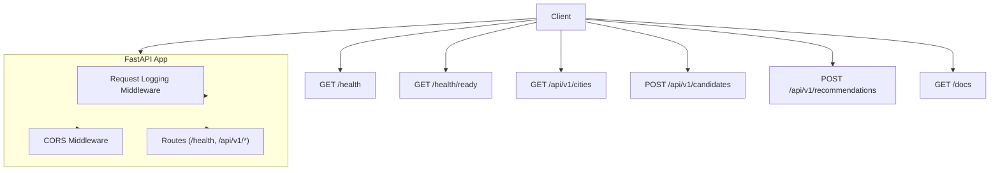
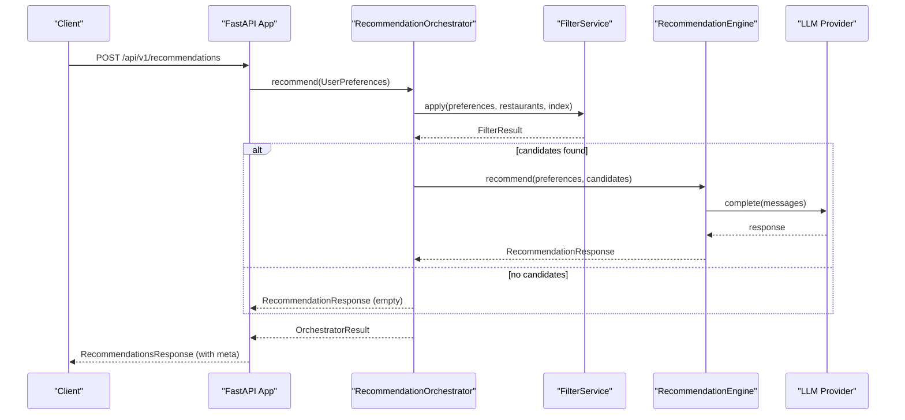
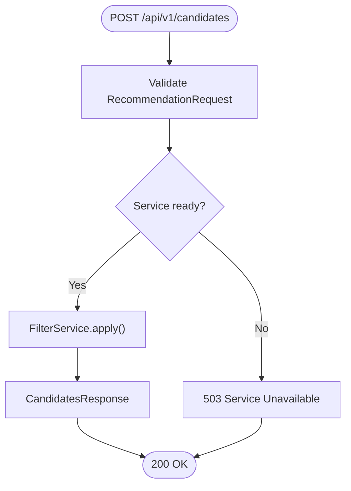
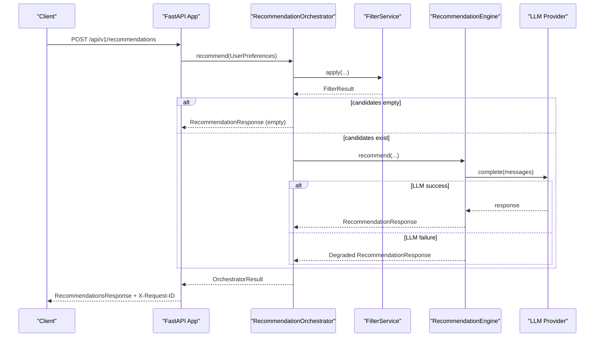
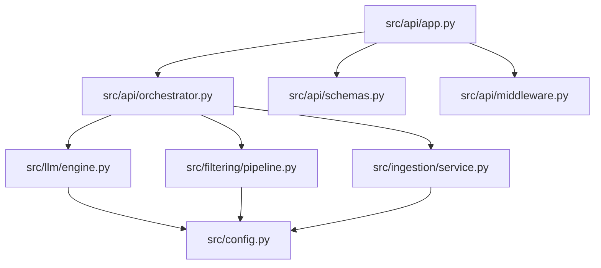

# API Reference

<cite>
**Referenced Files in This Document**
- [README.md](file://README.md)
- [src/api/app.py](file://src/api/app.py)
- [src/api/schemas.py](file://src/api/schemas.py)
- [src/api/middleware.py](file://src/api/middleware.py)
- [src/api/orchestrator.py](file://src/api/orchestrator.py)
- [src/api/formatter.py](file://src/api/formatter.py)
- [src/config.py](file://src/config.py)
- [src/domain/preferences.py](file://src/domain/preferences.py)
- [src/domain/recommendation.py](file://src/domain/recommendation.py)
- [src/filtering/pipeline.py](file://src/filtering/pipeline.py)
- [src/filtering/filters.py](file://src/filtering/filters.py)
- [src/ingestion/service.py](file://src/ingestion/service.py)
- [src/llm/engine.py](file://src/llm/engine.py)
- [tests/test_api.py](file://tests/test_api.py)
</cite>

## Table of Contents
1. [Introduction](#introduction)
2. [Project Structure](#project-structure)
3. [Core Components](#core-components)
4. [Architecture Overview](#architecture-overview)
5. [Detailed Component Analysis](#detailed-component-analysis)
6. [Dependency Analysis](#dependency-analysis)
7. [Performance Considerations](#performance-considerations)
8. [Troubleshooting Guide](#troubleshooting-guide)
9. [Conclusion](#conclusion)
10. [Appendices](#appendices)

## Introduction
This document provides comprehensive API documentation for the Zomato recommendation system REST API. It covers endpoint specifications, request/response schemas, authentication, error handling, observability, and integration guidelines. The system exposes health probes, a city catalog, a deterministic candidate filter, and an LLM-ranked recommendation endpoint. An OpenAPI/Swagger UI is available for interactive exploration.

## Project Structure
The API is implemented with FastAPI and orchestrated by a dedicated orchestrator. Supporting modules include ingestion, filtering, and LLM integration. The application wires middleware for logging and CORS, and exposes a static SPA at the root path.

**Diagram sources**
- [src/api/app.py:79-94](file://src/api/app.py#L79-L94)
- [src/api/app.py:137-156](file://src/api/app.py#L137-L156)
- [src/api/app.py:158-164](file://src/api/app.py#L158-L164)
- [src/api/app.py:166-208](file://src/api/app.py#L166-L208)
- [src/api/app.py:211-242](file://src/api/app.py#L211-L242)

**Section sources**
- [README.md:63-77](file://README.md#L63-L77)
- [src/api/app.py:79-94](file://src/api/app.py#L79-L94)

## Core Components
- FastAPI application with lifespan initialization, CORS, and request logging middleware.
- RecommendationOrchestrator coordinating ingestion, filtering, and LLM ranking.
- Pydantic schemas defining request/response contracts.
- Configuration-driven behavior for LLM provider, model, and limits.

Key behaviors:
- Startup loads dataset, builds indexes, and marks readiness.
- Health endpoints report readiness and runtime stats.
- Request logging attaches X-Request-ID and logs latency.

**Section sources**
- [src/api/app.py:42-76](file://src/api/app.py#L42-L76)
- [src/api/app.py:137-156](file://src/api/app.py#L137-L156)
- [src/api/middleware.py:17-37](file://src/api/middleware.py#L17-L37)
- [src/config.py:36-65](file://src/config.py#L36-L65)

## Architecture Overview
The API orchestrates a deterministic filter pipeline followed by LLM ranking. The orchestrator measures filter and LLM durations and formats the final response.

**Diagram sources**
- [src/api/app.py:211-242](file://src/api/app.py#L211-L242)
- [src/api/orchestrator.py:45-98](file://src/api/orchestrator.py#L45-L98)
- [src/filtering/pipeline.py:42-103](file://src/filtering/pipeline.py#L42-L103)
- [src/llm/engine.py:45-118](file://src/llm/engine.py#L45-L118)

## Detailed Component Analysis

### Endpoint: GET /health
- Description: Returns service health, readiness status, dataset load state, and LLM configuration.
- Authentication: Not required.
- Response fields:
  - status: "ok" or "starting".
  - ready: boolean indicating service readiness.
  - data_loaded: boolean indicating dataset index presence.
  - restaurant_count: integer count of loaded restaurants.
  - from_cache: boolean indicating cache usage.
  - llm_provider: string provider identifier.
  - llm_model: string model identifier.
- Example response:
  - {
    "status": "ok",
    "ready": true,
    "data_loaded": true,
    "restaurant_count": 51000,
    "from_cache": true,
    "llm_provider": "mock",
    "llm_model": "llama-3.3-70b-versatile"
  }

**Section sources**
- [src/api/app.py:137-148](file://src/api/app.py#L137-L148)

### Endpoint: GET /health/ready
- Description: Readiness probe. Returns success when service is ready; otherwise returns 503.
- Authentication: Not required.
- Response: {"ready": true}.
- Errors:
  - 503 Service Unavailable when service is not ready.

**Section sources**
- [src/api/app.py:151-155](file://src/api/app.py#L151-L155)

### Endpoint: GET /api/v1/cities
- Description: Lists known cities derived from the dataset index.
- Authentication: Not required.
- Response fields:
  - cities: array of strings representing city names.
- Errors:
  - 503 Service Unavailable if service is not ready.

**Section sources**
- [src/api/app.py:158-163](file://src/api/app.py#L158-L163)

### Endpoint: POST /api/v1/candidates
- Description: Deterministic filter pipeline returning candidate restaurants without LLM ranking.
- Authentication: Not required.
- Request schema (RecommendationRequest):
  - location: string (max length 50), required.
  - budget: enum "low" | "medium" | "high", required.
  - cuisine: string (max length 100), optional.
  - min_rating: number (0.0 to 5.0), default 3.0.
  - additional_preferences: string (max length 500), optional.
- Response schema (CandidatesResponse):
  - candidates: array of CandidateOut objects.
  - meta: FilterMetaOut with:
    - candidates_considered: integer.
    - filters_relaxed: boolean.
    - relaxation_steps: array of strings.
    - empty_reason: string or null.
    - resolved_city: string.
    - city_suggestions: array of strings.
- Errors:
  - 400 Bad Request on invalid preferences (includes suggestions).
  - 422 Unprocessable Entity for schema validation failures.
  - 503 Service Unavailable if service is not ready.

**Diagram sources**
- [src/api/app.py:166-208](file://src/api/app.py#L166-L208)
- [src/filtering/pipeline.py:42-103](file://src/filtering/pipeline.py#L42-L103)

**Section sources**
- [src/api/app.py:166-208](file://src/api/app.py#L166-L208)
- [src/api/schemas.py:13-55](file://src/api/schemas.py#L13-L55)
- [src/filtering/pipeline.py:42-103](file://src/filtering/pipeline.py#L42-L103)

### Endpoint: POST /api/v1/recommendations
- Description: Applies deterministic filter and Groq LLM ranking, returning ranked recommendations with explanations.
- Authentication: Not required.
- Request schema (RecommendationRequest):
  - Same as above.
- Response schema (RecommendationsResponse):
  - summary: string or null.
  - recommendations: array of RecommendationOut:
    - rank: integer.
    - restaurant_id: string.
    - name: string.
    - cuisine: string.
    - rating: number (rounded to 1 decimal place).
    - estimated_cost: string.
    - explanation: string.
  - meta: RecommendationMetaOut:
    - candidates_considered: integer.
    - filters_relaxed: boolean.
    - degraded_mode: boolean.
    - resolved_city: string.
    - empty_reason: string or null.
- Errors:
  - 400 Bad Request on invalid preferences (includes suggestions).
  - 422 Unprocessable Entity for schema validation failures.
  - 503 Service Unavailable if service is not ready.
  - On LLM failure or missing API key, returns degraded results with meta.degraded_mode=true.
- Observability:
  - X-Request-ID header is set on responses.
  - Logs include request_id, method, path, status, and duration_ms.

**Diagram sources**
- [src/api/app.py:211-242](file://src/api/app.py#L211-L242)
- [src/api/orchestrator.py:45-98](file://src/api/orchestrator.py#L45-L98)
- [src/llm/engine.py:45-118](file://src/llm/engine.py#L45-L118)

**Section sources**
- [src/api/app.py:211-242](file://src/api/app.py#L211-L242)
- [src/api/schemas.py:58-79](file://src/api/schemas.py#L58-L79)
- [src/api/formatter.py:16-44](file://src/api/formatter.py#L16-L44)
- [src/api/middleware.py:17-37](file://src/api/middleware.py#L17-L37)
- [src/llm/engine.py:45-118](file://src/llm/engine.py#L45-L118)

### OpenAPI/Swagger Documentation and Interactive Testing
- Endpoint: GET /docs
- Provides interactive API documentation powered by FastAPI.

**Section sources**
- [README.md:76-76](file://README.md#L76-L76)
- [src/api/app.py:249-252](file://src/api/app.py#L249-L252)

## Dependency Analysis
The API depends on ingestion, filtering, and LLM engine modules. Configuration controls LLM provider, model, and limits.

**Diagram sources**
- [src/api/app.py:15-31](file://src/api/app.py#L15-L31)
- [src/api/orchestrator.py:10-17](file://src/api/orchestrator.py#L10-L17)
- [src/filtering/pipeline.py:9-23](file://src/filtering/pipeline.py#L9-L23)
- [src/llm/engine.py:12-24](file://src/llm/engine.py#L12-L24)
- [src/ingestion/service.py:10-17](file://src/ingestion/service.py#L10-L17)
- [src/config.py:36-65](file://src/config.py#L36-L65)

**Section sources**
- [src/api/app.py:15-31](file://src/api/app.py#L15-L31)
- [src/api/orchestrator.py:10-17](file://src/api/orchestrator.py#L10-L17)
- [src/filtering/pipeline.py:9-23](file://src/filtering/pipeline.py#L9-L23)
- [src/llm/engine.py:12-24](file://src/llm/engine.py#L12-L24)
- [src/ingestion/service.py:10-17](file://src/ingestion/service.py#L10-L17)
- [src/config.py:36-65](file://src/config.py#L36-L65)

## Performance Considerations
- Filter pipeline target: sub-200 ms on cached data.
- LLM round-trip: typical sub-5 s with Groq; total warm request under 10 s.
- Candidate cap: MAX_CANDIDATES defaults to 20; TOP_N_RESULTS defaults to 5.
- Dataset caching: Parquet cache reduces cold-start latency.

**Section sources**
- [src/filtering/pipeline.py:87-89](file://src/filtering/pipeline.py#L87-L89)
- [src/config.py:45-47](file://src/config.py#L45-L47)
- [docs/architecture.md:644-651](file://docs/architecture.md#L644-L651)

## Troubleshooting Guide
Common issues and resolutions:
- 400 Bad Request: Returned when preferences are invalid; response includes a message and suggestions for correction.
- 422 Unprocessable Entity: Schema validation errors; inspect detail.errors for field-specific issues.
- 503 Service Unavailable: Service not ready; retry after startup completes.
- Degraded mode: When LLM API key is missing or LLM call fails, the system returns deterministic results with meta.degraded_mode=true.
- Empty results: When no candidates are produced, meta.empty_reason indicates the reason; broaden filters as suggested.

Operational tips:
- Use X-Request-ID from response headers to correlate logs.
- Inspect /health for dataset load status and cache usage.
- Verify known cities via /api/v1/cities.

**Section sources**
- [src/api/app.py:97-104](file://src/api/app.py#L97-L104)
- [src/api/app.py:107-112](file://src/api/app.py#L107-L112)
- [src/api/app.py:178-182](file://src/api/app.py#L178-L182)
- [src/llm/engine.py:64-72](file://src/llm/engine.py#L64-L72)
- [src/api/middleware.py:17-37](file://src/api/middleware.py#L17-L37)
- [tests/test_api.py:128-144](file://tests/test_api.py#L128-L144)

## Conclusion
The Zomato recommendation system exposes a clear, observable REST API with deterministic filtering and LLM-powered ranking. Health endpoints, structured schemas, and middleware support reliable integration. Clients should handle 400/422 errors, prepare for 503 during startup, and leverage degraded mode for resilience.

## Appendices

### Request/Response Examples
- POST /api/v1/recommendations (success)
  - Request: {
    "location": "Bangalore",
    "budget": "medium",
    "cuisine": "Italian",
    "min_rating": 4.0
  }
  - Response: {
    "summary": "Five Italian spots in Bangalore...",
    "recommendations": [
      {
        "rank": 1,
        "restaurant_id": "r1",
        "name": "Italian Bistro",
        "cuisine": "Italian, Pizza",
        "rating": 4.6,
        "estimated_cost": "₹700 for two",
        "explanation": "Highest rated among filtered options..."
      }
    ],
    "meta": {
      "candidates_considered": 18,
      "filters_relaxed": false,
      "degraded_mode": false,
      "resolved_city": "Bangalore"
    }
  }

- POST /api/v1/recommendations (degraded)
  - Response includes meta.degraded_mode=true when LLM key is missing or call fails.

- POST /api/v1/candidates
  - Response includes candidates and meta with relaxation steps and resolved city.

**Section sources**
- [tests/test_api.py:104-126](file://tests/test_api.py#L104-L126)
- [tests/test_api.py:128-144](file://tests/test_api.py#L128-L144)
- [tests/test_api.py:164-172](file://tests/test_api.py#L164-L172)

### CORS and Security Headers
- CORS: Configured via environment variable cors_origins; defaults allow all origins if unset.
- Security: Input is sanitized; strings are stripped of HTML tags and excessive whitespace.
- Observability: X-Request-ID header is set on all responses; logs include request_id and latency.

**Section sources**
- [src/config.py:55](file://src/config.py#L55)
- [src/api/schemas.py:20-30](file://src/api/schemas.py#L20-L30)
- [src/api/middleware.py:17-37](file://src/api/middleware.py#L17-L37)

### Rate Limiting
- No built-in rate limiting is implemented in the API. Consider deploying a reverse proxy or gateway for rate limiting and quota enforcement.

**Section sources**
- [src/api/app.py:79-94](file://src/api/app.py#L79-L94)

### Integration Guidelines
- Use GET /health to poll readiness and gather runtime stats.
- Use GET /api/v1/cities to pre-validate locations.
- Use POST /api/v1/candidates to preview deterministic candidates before invoking recommendations.
- Respect meta.candidates_considered and meta.filters_relaxed to inform UI messaging.
- Handle degraded_mode in production to maintain user experience during LLM outages.

**Section sources**
- [src/api/app.py:137-163](file://src/api/app.py#L137-L163)
- [src/api/orchestrator.py:45-98](file://src/api/orchestrator.py#L45-L98)
- [src/llm/engine.py:64-72](file://src/llm/engine.py#L64-L72)