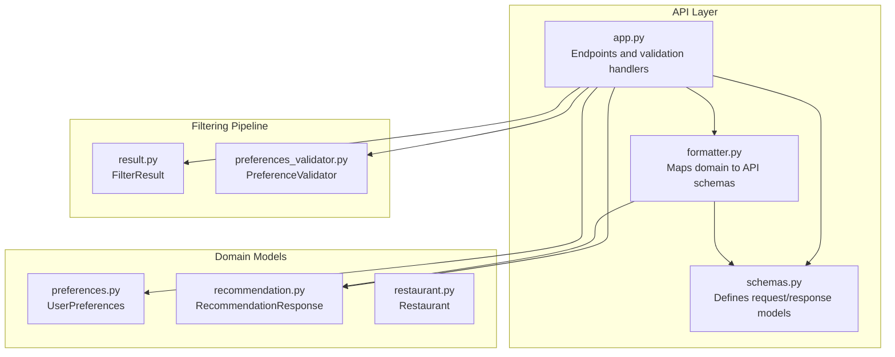
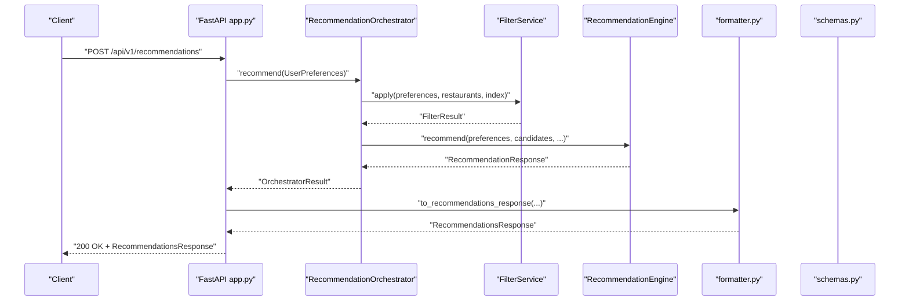
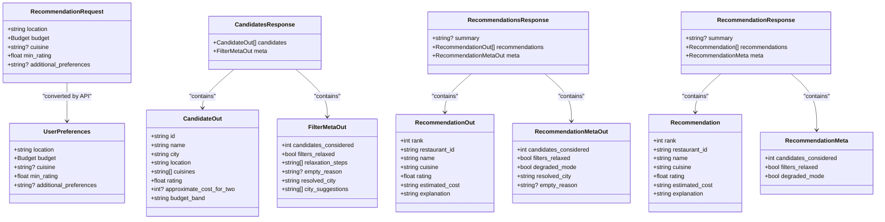

# API Schemas

<cite>
**Referenced Files in This Document**
- [schemas.py](file://src/api/schemas.py)
- [preferences.py](file://src/domain/preferences.py)
- [recommendation.py](file://src/domain/recommendation.py)
- [restaurant.py](file://src/domain/restaurant.py)
- [result.py](file://src/filtering/result.py)
- [formatter.py](file://src/api/formatter.py)
- [app.py](file://src/api/app.py)
- [preferences_validator.py](file://src/filtering/preferences_validator.py)
- [test_api.py](file://tests/test_api.py)
</cite>

## Table of Contents
1. [Introduction](#introduction)
2. [Project Structure](#project-structure)
3. [Core Components](#core-components)
4. [Architecture Overview](#architecture-overview)
5. [Detailed Component Analysis](#detailed-component-analysis)
6. [Dependency Analysis](#dependency-analysis)
7. [Performance Considerations](#performance-considerations)
8. [Troubleshooting Guide](#troubleshooting-guide)
9. [Conclusion](#conclusion)
10. [Appendices](#appendices)

## Introduction
This document provides comprehensive documentation for all API request and response schemas used across the recommendation system. It covers the UserPreferences model, RecommendationRequest schema, CandidateOut model, CandidatesResponse structure, RecommendationResponse format, and FilterMetaOut metadata. It explains field definitions, data types, validation rules, optional versus required fields, and example payloads. It also documents the relationships between schema objects and their usage in various API endpoints, along with schema evolution, backward compatibility considerations, and validation error handling.

## Project Structure
The API schemas are defined primarily in the API layer and domain models, with orchestration and formatting utilities bridging between the filtering pipeline and the LLM recommendation engine.

**Diagram sources**
- [schemas.py:1-80](file://src/api/schemas.py#L1-L80)
- [formatter.py:1-49](file://src/api/formatter.py#L1-L49)
- [app.py:1-254](file://src/api/app.py#L1-L254)
- [preferences.py:1-29](file://src/domain/preferences.py#L1-L29)
- [recommendation.py:1-28](file://src/domain/recommendation.py#L1-L28)
- [restaurant.py:1-26](file://src/domain/restaurant.py#L1-L26)
- [result.py:1-20](file://src/filtering/result.py#L1-L20)
- [preferences_validator.py:1-76](file://src/filtering/preferences_validator.py#L1-L76)

**Section sources**
- [app.py:1-254](file://src/api/app.py#L1-L254)
- [schemas.py:1-80](file://src/api/schemas.py#L1-L80)

## Core Components
This section documents the primary schema objects and their roles in the API.

- UserPreferences: Domain model representing user input validated against known cities and normalized.
- RecommendationRequest: API request schema for recommendations, including sanitization and validation.
- CandidateOut: Output model for filtered candidates.
- CandidatesResponse: Response envelope for candidate lists with metadata.
- RecommendationOut: Individual recommendation item.
- RecommendationMetaOut: API metadata for recommendations.
- RecommendationsResponse: Full response envelope for recommendations.
- FilterMetaOut: API metadata for candidate filtering.

**Section sources**
- [preferences.py:15-29](file://src/domain/preferences.py#L15-L29)
- [schemas.py:13-80](file://src/api/schemas.py#L13-L80)

## Architecture Overview
The API orchestrates filtering and LLM ranking, returning structured responses with metadata. The flow below maps endpoint usage to schema objects.

**Diagram sources**
- [app.py:211-242](file://src/api/app.py#L211-L242)
- [formatter.py:16-44](file://src/api/formatter.py#L16-L44)
- [schemas.py:58-80](file://src/api/schemas.py#L58-L80)
- [recommendation.py:24-28](file://src/domain/recommendation.py#L24-L28)
- [result.py:11-20](file://src/filtering/result.py#L11-L20)

## Detailed Component Analysis

### UserPreferences Model
- Purpose: Encapsulates validated user preferences used across filtering and recommendation.
- Fields:
  - location: string; required; validated to be non-empty.
  - budget: enum Budget ("low", "medium", "high").
  - cuisine: optional string; default None.
  - min_rating: float; default 3.0; constrained to [0.0, 5.0].
  - additional_preferences: optional string; default None.
- Validation rules:
  - Location must be non-empty after stripping whitespace.
- Example payload:
  - {
      "location": "Bangalore",
      "budget": "medium",
      "cuisine": "Italian",
      "min_rating": 4.0,
      "additional_preferences": null
    }
- Notes:
  - Used internally by the API to convert RecommendationRequest to UserPreferences.

**Section sources**
- [preferences.py:15-29](file://src/domain/preferences.py#L15-L29)
- [app.py:127-134](file://src/api/app.py#L127-L134)

### RecommendationRequest Schema
- Purpose: API request schema for recommendations with sanitization and validation.
- Fields:
  - location: string; required; max length 50; sanitized to remove HTML and extra whitespace.
  - budget: Budget enum; required.
  - cuisine: optional string; max length 100; sanitized similarly.
  - min_rating: float; default 3.0; constrained to [0.0, 5.0].
  - additional_preferences: optional string; max length 500; sanitized similarly.
- Validation rules:
  - Sanitization strips HTML tags and collapses whitespace.
  - Budget must be one of the allowed enum values.
  - min_rating must be within bounds.
- Example payload:
  - {
      "location": "Bangalore",
      "budget": "medium",
      "cuisine": "Italian",
      "min_rating": 4.0
    }
- Notes:
  - Converted to UserPreferences for internal processing.

**Section sources**
- [schemas.py:13-31](file://src/api/schemas.py#L13-L31)
- [app.py:127-134](file://src/api/app.py#L127-L134)

### CandidateOut Model
- Purpose: Output model for individual candidate restaurants in the candidates endpoint.
- Fields:
  - id: string; required.
  - name: string; required.
  - city: string; required.
  - location: string; required.
  - cuisines: array of strings; required.
  - rating: float; required.
  - approximate_cost_for_two: integer; optional.
  - budget_band: string; required; corresponds to BudgetBand enum values.
- Example payload:
  - {
      "id": "r1",
      "name": "Italian Bistro",
      "city": "Bangalore",
      "location": "Indiranagar",
      "cuisines": ["Italian", "Pizza"],
      "rating": 4.6,
      "approximate_cost_for_two": 700,
      "budget_band": "medium"
    }

**Section sources**
- [schemas.py:33-42](file://src/api/schemas.py#L33-L42)
- [restaurant.py:16-26](file://src/domain/restaurant.py#L16-L26)

### CandidatesResponse Structure
- Purpose: Envelope for the candidates endpoint, returning a list of CandidateOut plus metadata.
- Fields:
  - candidates: array of CandidateOut; required.
  - meta: FilterMetaOut; required.
- Example payload:
  - {
      "candidates": [CandidateOut],
      "meta": {
        "candidates_considered": 10,
        "filters_relaxed": false,
        "relaxation_steps": [],
        "empty_reason": null,
        "resolved_city": "Bangalore",
        "city_suggestions": []
      }
    }

**Section sources**
- [schemas.py:53-56](file://src/api/schemas.py#L53-L56)
- [result.py:11-20](file://src/filtering/result.py#L11-L20)

### RecommendationOut Model
- Purpose: Individual recommendation item in the recommendations endpoint.
- Fields:
  - rank: integer; required.
  - restaurant_id: string; required.
  - name: string; required.
  - cuisine: string; required.
  - rating: float; required.
  - estimated_cost: string; required.
  - explanation: string; required.
- Example payload:
  - {
      "rank": 1,
      "restaurant_id": "r1",
      "name": "Italian Bistro",
      "cuisine": "Italian",
      "rating": 4.6,
      "estimated_cost": "₹700",
      "explanation": "Strong rating and Italian cuisine."
    }

**Section sources**
- [schemas.py:58-66](file://src/api/schemas.py#L58-L66)
- [recommendation.py:8-16](file://src/domain/recommendation.py#L8-L16)

### RecommendationMetaOut Metadata
- Purpose: API metadata for recommendations, including resolved city and empty reason.
- Fields:
  - candidates_considered: integer; default 0.
  - filters_relaxed: boolean; default False.
  - degraded_mode: boolean; default False.
  - resolved_city: string; default "".
  - empty_reason: string; optional.
- Example payload:
  - {
      "candidates_considered": 10,
      "filters_relaxed": false,
      "degraded_mode": false,
      "resolved_city": "Bangalore",
      "empty_reason": null
    }

**Section sources**
- [schemas.py:68-74](file://src/api/schemas.py#L68-L74)

### RecommendationsResponse Format
- Purpose: Full response envelope for recommendations, including summary, recommendations, and metadata.
- Fields:
  - summary: string; optional.
  - recommendations: array of RecommendationOut; default empty.
  - meta: RecommendationMetaOut; default factory-initialized.
- Example payload:
  - {
      "summary": "Italian picks in Bangalore.",
      "recommendations": [RecommendationOut],
      "meta": RecommendationMetaOut
    }

**Section sources**
- [schemas.py:76-80](file://src/api/schemas.py#L76-L80)
- [formatter.py:16-44](file://src/api/formatter.py#L16-L44)

### FilterMetaOut Metadata
- Purpose: API metadata for candidate filtering, including city resolution and suggestions.
- Fields:
  - candidates_considered: integer; required.
  - filters_relaxed: boolean; required.
  - relaxation_steps: array of strings; default empty.
  - empty_reason: string; optional.
  - resolved_city: string; default "".
  - city_suggestions: array of strings; default empty.
- Example payload:
  - {
      "candidates_considered": 10,
      "filters_relaxed": false,
      "relaxation_steps": [],
      "empty_reason": null,
      "resolved_city": "Bangalore",
      "city_suggestions": []
    }

**Section sources**
- [schemas.py:44-51](file://src/api/schemas.py#L44-L51)
- [result.py:11-20](file://src/filtering/result.py#L11-L20)

## Dependency Analysis
The following diagram shows how schema objects relate to each other and to domain models and endpoints.

**Diagram sources**
- [schemas.py:13-80](file://src/api/schemas.py#L13-L80)
- [recommendation.py:8-28](file://src/domain/recommendation.py#L8-L28)
- [preferences.py:15-29](file://src/domain/preferences.py#L15-L29)

**Section sources**
- [schemas.py:13-80](file://src/api/schemas.py#L13-L80)
- [recommendation.py:8-28](file://src/domain/recommendation.py#L8-L28)
- [preferences.py:15-29](file://src/domain/preferences.py#L15-L29)

## Performance Considerations
- Endpoint separation:
  - POST /api/v1/candidates returns deterministic filtered candidates without LLM cost.
  - POST /api/v1/recommendations runs filtering and LLM ranking; consider caching and rate limiting.
- Metadata enrichment:
  - resolved_city and empty_reason help clients understand fallbacks and reasons for empty results.
- Degraded mode:
  - When LLM keys are missing, recommendations still return with degraded_mode enabled.

[No sources needed since this section provides general guidance]

## Troubleshooting Guide
- Validation errors:
  - 422 Unprocessable Entity with detailed errors for invalid request bodies.
  - Example: invalid budget value triggers a 422 response.
- City resolution failures:
  - 400 Bad Request with suggestions when location cannot be resolved.
  - PreferenceValidator provides close matches and known city fallbacks.
- Service readiness:
  - 503 Service Unavailable while data is loading or failing to load.

**Section sources**
- [app.py:97-104](file://src/api/app.py#L97-L104)
- [app.py:178-182](file://src/api/app.py#L178-L182)
- [preferences_validator.py:13-18](file://src/filtering/preferences_validator.py#L13-L18)
- [test_api.py:147-162](file://tests/test_api.py#L147-L162)

## Conclusion
The API schemas define a clear contract between the filtering pipeline and the LLM recommendation engine, with robust validation and metadata to support both deterministic and ranked results. The UserPreferences and RecommendationRequest models ensure consistent input handling, while CandidateOut and RecommendationOut provide structured outputs enriched with metadata for client consumption.

[No sources needed since this section summarizes without analyzing specific files]

## Appendices

### API Endpoints and Schema Usage
- GET /health: Returns readiness and dataset statistics.
- GET /health/ready: Readiness probe.
- GET /api/v1/cities: Known cities list.
- POST /api/v1/candidates: Returns CandidatesResponse with CandidateOut items and FilterMetaOut.
- POST /api/v1/recommendations: Returns RecommendationsResponse with RecommendationOut items and RecommendationMetaOut.

**Section sources**
- [app.py:137-164](file://src/api/app.py#L137-L164)
- [app.py:166-208](file://src/api/app.py#L166-L208)
- [app.py:211-242](file://src/api/app.py#L211-L242)

### Schema Evolution and Backward Compatibility
- Current state:
  - RecommendationRequest and UserPreferences share core fields; RecommendationRequest adds sanitization.
  - RecommendationOut and RecommendationResponse mirror each other; RecommendationMetaOut augments RecommendationMeta with resolved_city and empty_reason.
- Backward compatibility considerations:
  - Adding optional fields (e.g., additional_preferences) maintains backward compatibility.
  - Changing required fields requires careful migration and versioning.
  - Enum additions should be additive to preserve existing behavior.

**Section sources**
- [schemas.py:13-80](file://src/api/schemas.py#L13-L80)
- [recommendation.py:24-28](file://src/domain/recommendation.py#L24-L28)
- [preferences.py:15-29](file://src/domain/preferences.py#L15-L29)

### Example Payloads
- POST /api/v1/recommendations
  - Request: RecommendationRequest
  - Response: RecommendationsResponse
- POST /api/v1/candidates
  - Request: RecommendationRequest
  - Response: CandidatesResponse

**Section sources**
- [test_api.py:104-126](file://tests/test_api.py#L104-L126)
- [test_api.py:164-173](file://tests/test_api.py#L164-L173)