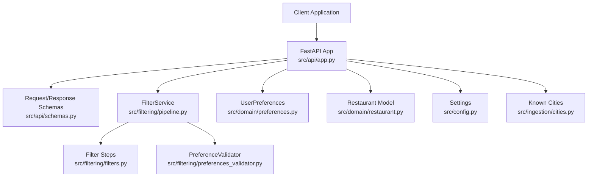
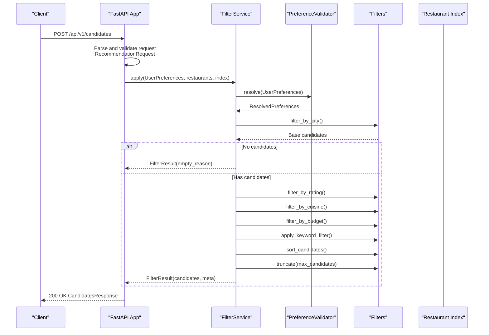
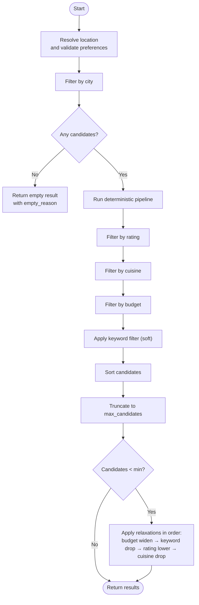
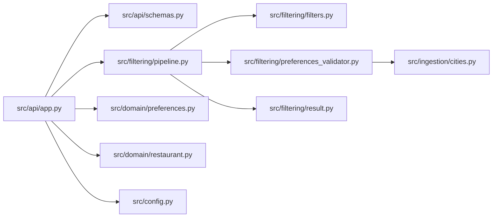

# Candidate Filtering

<cite>
**Referenced Files in This Document**
- [README.md](file://README.md)
- [src/api/app.py](file://src/api/app.py)
- [src/api/schemas.py](file://src/api/schemas.py)
- [src/filtering/pipeline.py](file://src/filtering/pipeline.py)
- [src/filtering/filters.py](file://src/filtering/filters.py)
- [src/filtering/preferences_validator.py](file://src/filtering/preferences_validator.py)
- [src/filtering/result.py](file://src/filtering/result.py)
- [src/domain/preferences.py](file://src/domain/preferences.py)
- [src/domain/restaurant.py](file://src/domain/restaurant.py)
- [src/config.py](file://src/config.py)
- [src/ingestion/cities.py](file://src/ingestion/cities.py)
- [tests/test_api.py](file://tests/test_api.py)
</cite>

## Table of Contents
1. [Introduction](#introduction)
2. [Project Structure](#project-structure)
3. [Core Components](#core-components)
4. [Architecture Overview](#architecture-overview)
5. [Detailed Component Analysis](#detailed-component-analysis)
6. [Dependency Analysis](#dependency-analysis)
7. [Performance Considerations](#performance-considerations)
8. [Troubleshooting Guide](#troubleshooting-guide)
9. [Conclusion](#conclusion)
10. [Appendices](#appendices)

## Introduction
This document provides comprehensive documentation for the /api/v1/candidates POST endpoint, which performs deterministic filtering of restaurants without LLM ranking. It explains the request schema, response structure, validation rules, error handling, and integration patterns for client applications.

Key characteristics of the endpoint:
- Deterministic filtering pipeline with no LLM ranking
- Applies city resolution, rating, cuisine, budget, and optional keyword filters
- Supports configurable minimum and maximum candidate counts
- Returns filter metadata including candidates considered, filters relaxed, relaxation steps, empty reason, resolved city, and city suggestions

## Project Structure
The endpoint is implemented within the FastAPI application layer and integrates with the filtering pipeline and domain models.

**Diagram sources**
- [src/api/app.py:166-208](file://src/api/app.py#L166-L208)
- [src/api/schemas.py:13-55](file://src/api/schemas.py#L13-L55)
- [src/filtering/pipeline.py:31-103](file://src/filtering/pipeline.py#L31-L103)
- [src/filtering/filters.py:27-124](file://src/filtering/filters.py#L27-L124)
- [src/filtering/preferences_validator.py:28-68](file://src/filtering/preferences_validator.py#L28-L68)
- [src/domain/preferences.py:15-28](file://src/domain/preferences.py#L15-L28)
- [src/domain/restaurant.py:16-25](file://src/domain/restaurant.py#L16-L25)
- [src/config.py:46-80](file://src/config.py#L46-L80)
- [src/ingestion/cities.py:15-48](file://src/ingestion/cities.py#L15-L48)

**Section sources**
- [README.md:86-95](file://README.md#L86-L95)
- [src/api/app.py:166-208](file://src/api/app.py#L166-L208)

## Core Components
- Endpoint handler: Converts request body to UserPreferences and delegates to FilterService
- FilterService: Orchestrates deterministic filtering pipeline with configurable relaxation
- Filter steps: City, rating, cuisine, budget, keyword, sorting, truncation
- Validators: PreferenceValidator resolves locations and validates preferences
- Schemas: Pydantic models define request/response contracts

**Section sources**
- [src/api/app.py:166-208](file://src/api/app.py#L166-L208)
- [src/filtering/pipeline.py:31-204](file://src/filtering/pipeline.py#L31-L204)
- [src/filtering/filters.py:27-124](file://src/filtering/filters.py#L27-L124)
- [src/filtering/preferences_validator.py:28-68](file://src/filtering/preferences_validator.py#L28-L68)
- [src/api/schemas.py:13-55](file://src/api/schemas.py#L13-L55)

## Architecture Overview
The endpoint follows a layered architecture: API layer translates requests to domain models, applies deterministic filters, and returns structured results with metadata.

**Diagram sources**
- [src/api/app.py:166-208](file://src/api/app.py#L166-L208)
- [src/filtering/pipeline.py:42-103](file://src/filtering/pipeline.py#L42-L103)
- [src/filtering/filters.py:27-124](file://src/filtering/filters.py#L27-L124)
- [src/filtering/preferences_validator.py:37-68](file://src/filtering/preferences_validator.py#L37-L68)

## Detailed Component Analysis

### Endpoint Definition and Behavior
- Path: POST /api/v1/candidates
- Purpose: Deterministic filtering without LLM ranking
- Response model: CandidatesResponse
- Validation: Pydantic-based request validation plus PreferenceValidator for location resolution

Behavior highlights:
- Converts RecommendationRequest to UserPreferences
- Delegates to FilterService.apply with dataset and index
- Handles PreferenceValidationError by returning 400 with suggestions
- Constructs CandidateOut entries and FilterMetaOut metadata

**Section sources**
- [src/api/app.py:166-208](file://src/api/app.py#L166-L208)
- [src/api/schemas.py:13-18](file://src/api/schemas.py#L13-L18)
- [src/domain/preferences.py:15-28](file://src/domain/preferences.py#L15-L28)

### Request Schema
Fields:
- location: String, max length 50, sanitized and validated
- budget: Enum (low, medium, high)
- cuisine: Optional string, max length 100
- min_rating: Float, default 3.0, range 0.0–5.0
- additional_preferences: Optional string, max length 500

Sanitization:
- Removes HTML tags and collapses whitespace
- Strips leading/trailing spaces

Validation rules:
- Location cannot be empty after normalization
- Rating bounds enforced
- Unknown city raises validation error with suggestions

**Section sources**
- [src/api/schemas.py:13-31](file://src/api/schemas.py#L13-L31)
- [src/domain/preferences.py:19-28](file://src/domain/preferences.py#L19-L28)
- [src/filtering/preferences_validator.py:37-68](file://src/filtering/preferences_validator.py#L37-L68)

### Response Structure
CandidatesResponse:
- candidates: Array of CandidateOut
- meta: FilterMetaOut

CandidateOut fields:
- id, name, city, location, cuisines[], rating, approximate_cost_for_two?, budget_band

FilterMetaOut fields:
- candidates_considered: Number of candidates considered
- filters_relaxed: Boolean indicating if any relaxation was applied
- relaxation_steps: Array of strings describing applied relaxations
- empty_reason: Optional string explaining why no candidates were returned
- resolved_city: Canonical city name used for filtering
- city_suggestions: Array of suggested cities when location is ambiguous

**Section sources**
- [src/api/schemas.py:33-55](file://src/api/schemas.py#L33-L55)
- [src/filtering/result.py:11-19](file://src/filtering/result.py#L11-L19)

### Filtering Pipeline
Sequential deterministic steps:
1. City resolution and lookup
2. Rating threshold filter
3. Cuisine token filter
4. Budget band filter (with optional relaxation)
5. Keyword soft filter (narrowing only)
6. Sorting by rating, cost fit, and ID
7. Truncation to max_candidates

Relaxation strategy (applied when candidate count < min_candidates):
1. Widen budget bands
2. Drop keyword filter
3. Lower minimum rating (in steps down to floor)
4. Drop cuisine filter

**Diagram sources**
- [src/filtering/pipeline.py:42-103](file://src/filtering/pipeline.py#L42-L103)
- [src/filtering/pipeline.py:105-129](file://src/filtering/pipeline.py#L105-L129)
- [src/filtering/pipeline.py:131-203](file://src/filtering/pipeline.py#L131-L203)

**Section sources**
- [src/filtering/pipeline.py:31-204](file://src/filtering/pipeline.py#L31-L204)
- [src/filtering/filters.py:27-124](file://src/filtering/filters.py#L27-L124)

### Validation and Error Handling
- Request validation: Pydantic validation errors return 422 with detail
- Preference validation: PreferenceValidationError returns 400 with message and suggestions
- City resolution: Uses known cities and difflib suggestions
- Empty results: Returns empty_reason metadata for client awareness

**Section sources**
- [src/api/app.py:97-104](file://src/api/app.py#L97-L104)
- [src/api/app.py:178-182](file://src/api/app.py#L178-L182)
- [src/filtering/preferences_validator.py:13-18](file://src/filtering/preferences_validator.py#L13-L18)

### Integration Patterns
Recommended client patterns:
- Use /api/v1/cities to pre-validate locations
- For unknown locations, present city_suggestions to users
- Respect candidates_considered and filters_relaxed to inform UX
- Handle empty_reason to explain no-results scenarios
- Apply client-side caching for repeated queries

**Section sources**
- [src/api/app.py:158-163](file://src/api/app.py#L158-L163)
- [src/filtering/result.py:11-19](file://src/filtering/result.py#L11-L19)

## Dependency Analysis
The endpoint depends on:
- API layer for routing and response serialization
- FilterService for deterministic filtering
- Filter steps for individual transformations
- PreferenceValidator for location resolution
- Domain models for typed data exchange
- Configuration for thresholds and limits

**Diagram sources**
- [src/api/app.py:166-208](file://src/api/app.py#L166-L208)
- [src/api/schemas.py:13-55](file://src/api/schemas.py#L13-L55)
- [src/filtering/pipeline.py:31-103](file://src/filtering/pipeline.py#L31-L103)
- [src/filtering/filters.py:27-124](file://src/filtering/filters.py#L27-L124)
- [src/filtering/preferences_validator.py:28-68](file://src/filtering/preferences_validator.py#L28-L68)
- [src/filtering/result.py:11-19](file://src/filtering/result.py#L11-L19)
- [src/domain/preferences.py:15-28](file://src/domain/preferences.py#L15-L28)
- [src/domain/restaurant.py:16-25](file://src/domain/restaurant.py#L16-L25)
- [src/config.py:46-80](file://src/config.py#L46-L80)
- [src/ingestion/cities.py:15-48](file://src/ingestion/cities.py#L15-L48)

**Section sources**
- [src/api/app.py:166-208](file://src/api/app.py#L166-L208)
- [src/filtering/pipeline.py:31-103](file://src/filtering/pipeline.py#L31-L103)

## Performance Considerations
- Target filter pipeline duration under 200 ms
- max_candidates and min_candidates balance responsiveness and completeness
- City indexing accelerates initial filtering
- Soft keyword filter avoids unnecessary narrowing

[No sources needed since this section provides general guidance]

## Troubleshooting Guide
Common issues and resolutions:
- 400 Bad Request with suggestions: Location not found; use city_suggestions or /api/v1/cities
- 422 Unprocessable Entity: Request schema invalid; fix field types/ranges
- Empty results: Check empty_reason and consider relaxing filters
- Slow responses: Verify dataset loading and index availability

**Section sources**
- [src/api/app.py:178-182](file://src/api/app.py#L178-L182)
- [src/filtering/pipeline.py:88-89](file://src/filtering/pipeline.py#L88-L89)
- [src/api/app.py:158-163](file://src/api/app.py#L158-L163)

## Conclusion
The /api/v1/candidates endpoint provides a fast, deterministic filtering path that is ideal for real-time discovery without LLM overhead. Clients should leverage the provided metadata to inform user experience and handle edge cases gracefully.

[No sources needed since this section summarizes without analyzing specific files]

## Appendices

### Request Examples
Example 1: Basic filtering
{
  "location": "Bangalore",
  "budget": "medium",
  "cuisine": "Italian"
}

Example 2: With rating and preferences
{
  "location": "Bangalore",
  "budget": "high",
  "cuisine": "North Indian",
  "min_rating": 4.0,
  "additional_preferences": "wifi, delivery, family friendly"
}

**Section sources**
- [tests/test_api.py:164-172](file://tests/test_api.py#L164-L172)

### Response Example
{
  "candidates": [
    {
      "id": "r1",
      "name": "Italian Bistro",
      "city": "Bangalore",
      "location": "Indiranagar",
      "cuisines": ["Italian", "Pizza"],
      "rating": 4.6,
      "approximate_cost_for_two": 700,
      "budget_band": "medium"
    }
  ],
  "meta": {
    "candidates_considered": 10,
    "filters_relaxed": false,
    "relaxation_steps": [],
    "empty_reason": null,
    "resolved_city": "Bangalore",
    "city_suggestions": []
  }
}

**Section sources**
- [src/api/schemas.py:33-55](file://src/api/schemas.py#L33-L55)
- [src/filtering/result.py:11-19](file://src/filtering/result.py#L11-L19)

### Validation Rules Summary
- location: Non-empty after normalization and sanitization
- budget: Enum low/medium/high
- cuisine: Optional, comma/pipe/slash-separated tokens
- min_rating: 0.0 to 5.0
- additional_preferences: Optional, max length 500

**Section sources**
- [src/api/schemas.py:13-31](file://src/api/schemas.py#L13-L31)
- [src/domain/preferences.py:19-28](file://src/domain/preferences.py#L19-L28)