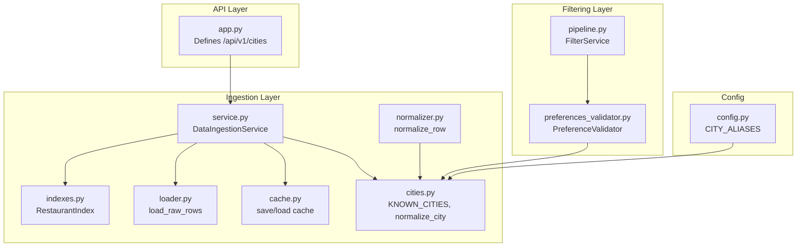
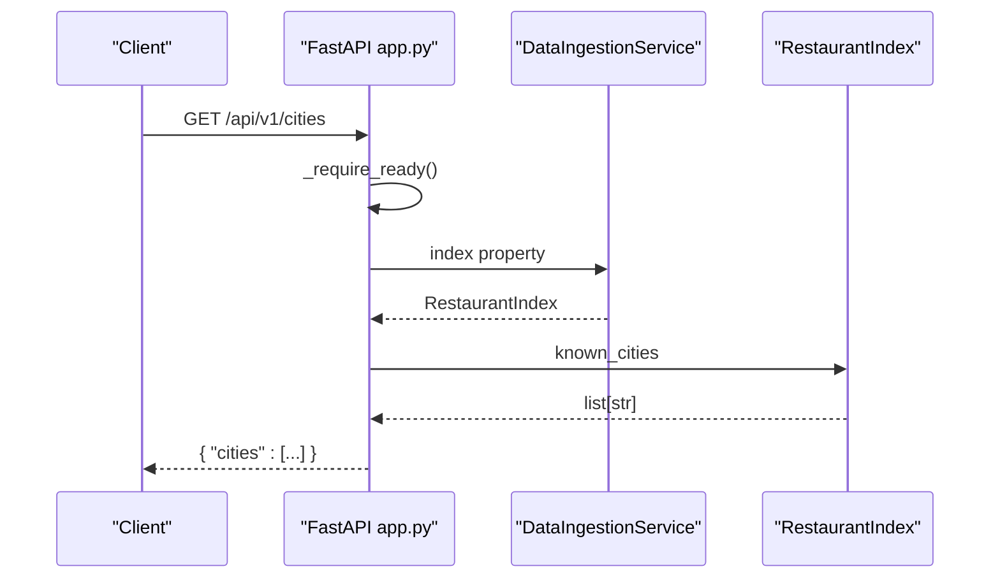
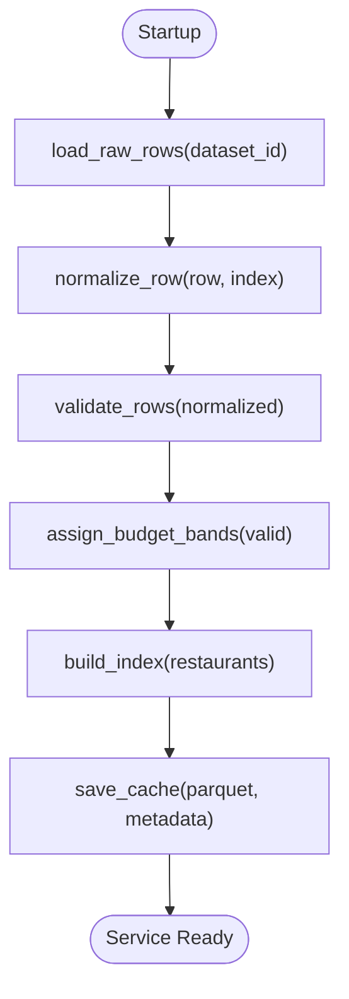
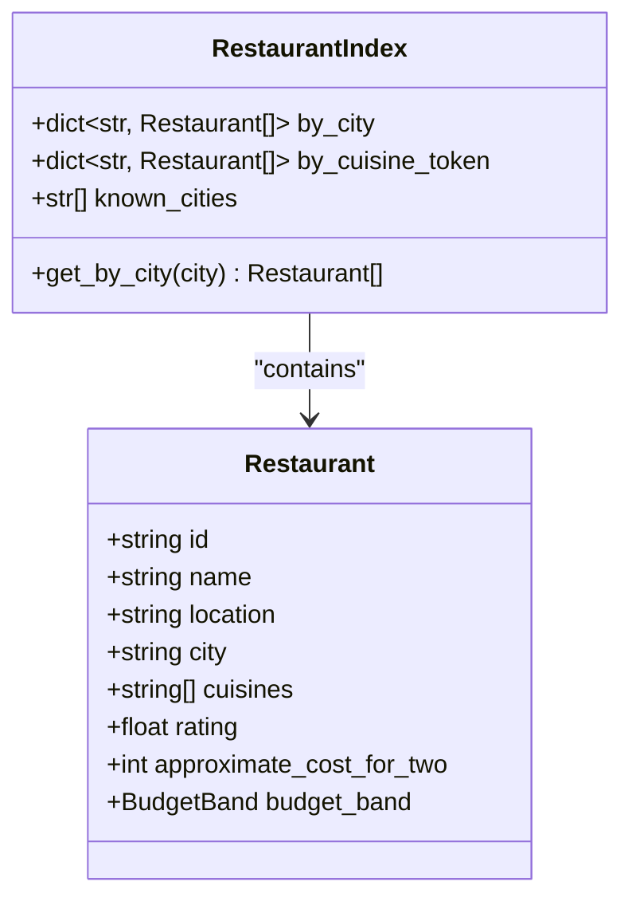
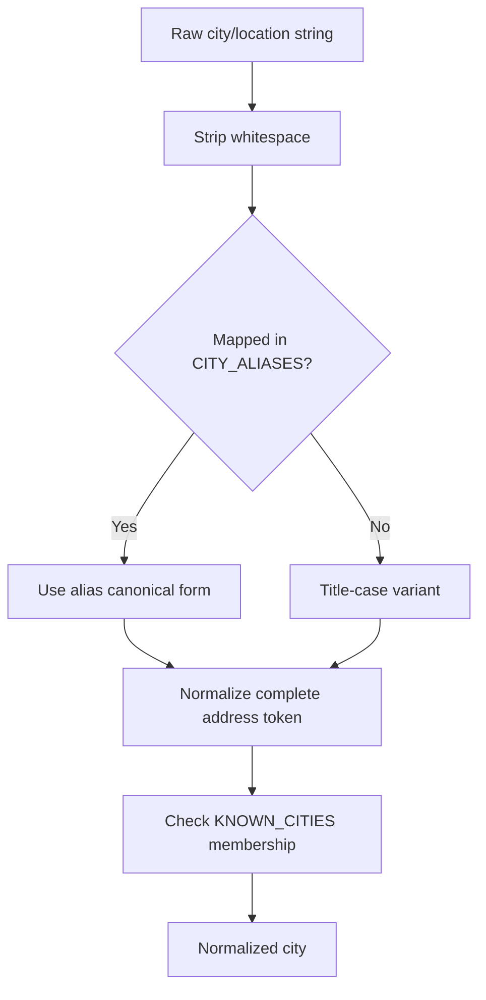
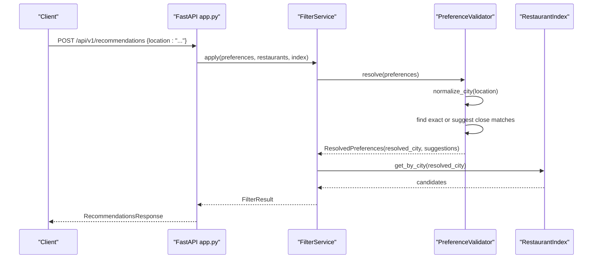
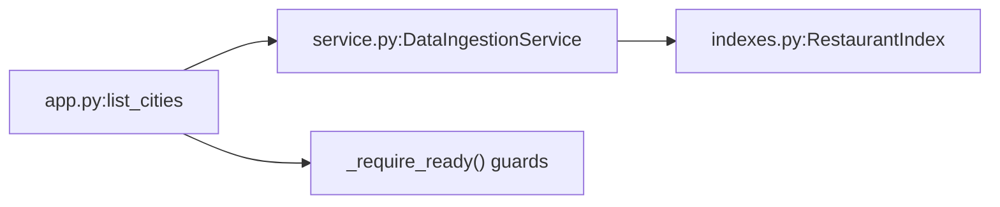

# City Discovery

<cite>
**Referenced Files in This Document**
- [app.py](file://src/api/app.py)
- [indexes.py](file://src/ingestion/indexes.py)
- [service.py](file://src/ingestion/service.py)
- [loader.py](file://src/ingestion/loader.py)
- [cache.py](file://src/ingestion/cache.py)
- [cities.py](file://src/ingestion/cities.py)
- [normalizer.py](file://src/ingestion/normalizer.py)
- [preferences_validator.py](file://src/filtering/preferences_validator.py)
- [pipeline.py](file://src/filtering/pipeline.py)
- [schemas.py](file://src/api/schemas.py)
- [config.py](file://src/config.py)
- [test_api.py](file://tests/test_api.py)
</cite>

## Table of Contents
1. [Introduction](#introduction)
2. [Project Structure](#project-structure)
3. [Core Components](#core-components)
4. [Architecture Overview](#architecture-overview)
5. [Detailed Component Analysis](#detailed-component-analysis)
6. [Dependency Analysis](#dependency-analysis)
7. [Performance Considerations](#performance-considerations)
8. [Troubleshooting Guide](#troubleshooting-guide)
9. [Conclusion](#conclusion)

## Introduction
This document describes the /api/v1/cities endpoint that exposes the list of available cities for location-based restaurant discovery. It explains the endpoint response format, how the city list is built from the ingestion pipeline, and how clients can integrate this endpoint into their applications. It also covers error handling, data source integration with the ingestion service, and the city indexing mechanism used to power both the endpoint and downstream recommendation filtering.

## Project Structure
The city discovery feature spans several modules:
- API layer: defines the endpoint and integrates with runtime services
- Ingestion layer: loads, normalizes, validates, caches, and indexes restaurant data
- Filtering layer: validates user preferences and resolves locations to known cities
- Configuration: centralizes constants and aliases used during normalization and validation

**Diagram sources**
- [app.py:158-163](file://src/api/app.py#L158-L163)
- [service.py:62-161](file://src/ingestion/service.py#L62-L161)
- [indexes.py:11-46](file://src/ingestion/indexes.py#L11-L46)
- [loader.py:11-28](file://src/ingestion/loader.py#L11-L28)
- [cache.py:58-99](file://src/ingestion/cache.py#L58-L99)
- [cities.py:15-91](file://src/ingestion/cities.py#L15-L91)
- [normalizer.py:67-97](file://src/ingestion/normalizer.py#L67-L97)
- [preferences_validator.py:28-75](file://src/filtering/preferences_validator.py#L28-L75)
- [pipeline.py:31-103](file://src/filtering/pipeline.py#L31-L103)
- [config.py:12-34](file://src/config.py#L12-L34)

**Section sources**
- [app.py:158-163](file://src/api/app.py#L158-L163)
- [service.py:62-161](file://src/ingestion/service.py#L62-L161)
- [indexes.py:11-46](file://src/ingestion/indexes.py#L11-L46)
- [loader.py:11-28](file://src/ingestion/loader.py#L11-L28)
- [cache.py:58-99](file://src/ingestion/cache.py#L58-L99)
- [cities.py:15-91](file://src/ingestion/cities.py#L15-L91)
- [normalizer.py:67-97](file://src/ingestion/normalizer.py#L67-L97)
- [preferences_validator.py:28-75](file://src/filtering/preferences_validator.py#L28-L75)
- [pipeline.py:31-103](file://src/filtering/pipeline.py#L31-L103)
- [config.py:12-34](file://src/config.py#L12-L34)

## Core Components
- Endpoint definition: GET /api/v1/cities returns a JSON object with a cities array.
- Runtime readiness guard: ensures the service is ready and data is loaded before serving requests.
- Index-backed retrieval: returns known_cities from the in-memory RestaurantIndex.
- Ingestion pipeline: builds the index from normalized and validated restaurant records.
- City normalization and aliases: ensures consistent city names across ingestion and filtering.

Key behaviors:
- Response shape: {"cities": [...]}
- Data source: derived from the loaded dataset via DataIngestionService and RestaurantIndex
- City indexing: built during ingestion and exposed via index.known_cities
- Client integration: fetch the city list once per session or when the app indicates readiness

**Section sources**
- [app.py:158-163](file://src/api/app.py#L158-L163)
- [service.py:76-125](file://src/ingestion/service.py#L76-L125)
- [indexes.py:11-46](file://src/ingestion/indexes.py#L11-L46)
- [cities.py:15-91](file://src/ingestion/cities.py#L15-L91)

## Architecture Overview
The city discovery endpoint participates in the startup lifecycle and relies on the ingestion service to populate the in-memory index. The filtering pipeline later uses the same known city list to validate and resolve user locations.

**Diagram sources**
- [app.py:158-163](file://src/api/app.py#L158-L163)
- [service.py:76-78](file://src/ingestion/service.py#L76-L78)
- [indexes.py:11-15](file://src/ingestion/indexes.py#L11-L15)

## Detailed Component Analysis

### Endpoint: /api/v1/cities
- Purpose: Provide the list of known cities for location-based discovery.
- Method: GET
- Response: JSON object with a single cities key whose value is an array of city strings.
- Behavior:
  - Requires service readiness; otherwise returns a 503 error.
  - Returns an empty list if the index is not yet populated.
  - Uses index.known_cities for the response.

Typical response example:
{
  "cities": ["Bangalore", "Delhi", "Mumbai", "Kolkata", "Chennai", "Hyderabad", "Pune", "Ahmedabad", "Gurgaon", "Noida", "Ghaziabad", "Jaipur", "Lucknow", "Chandigarh", "Goa", "Indore", "Bhopal", "Kochi", "Coimbatore", "Mysore", "Mysuru", "Vadodara", "Surat", "Nagpur", "Visakhapatnam", "Patna", "Ludhiana", "Amritsar", "Guwahati", "Bhubaneswar", "Trivandrum", "Thiruvananthapuram"]
}

Integration pattern:
- Fetch once at app startup or when the readiness endpoint confirms availability.
- Cache locally in memory to avoid repeated network calls.
- Use the returned list to populate dropdowns or autocomplete UI controls.

Error handling:
- 503 Service Unavailable if the service is not ready or the dataset failed to load.
- Empty list fallback if index is not yet built.

**Section sources**
- [app.py:158-163](file://src/api/app.py#L158-L163)
- [app.py:107-112](file://src/api/app.py#L107-L112)

### Data Source Integration and Ingestion Pipeline
The city list originates from the ingestion pipeline:
- Load raw rows from the Hugging Face dataset.
- Normalize each row to a structured restaurant record.
- Validate and enrich records.
- Build an in-memory index keyed by city and other attributes.
- Persist processed data to parquet cache with metadata.

**Diagram sources**
- [loader.py:11-28](file://src/ingestion/loader.py#L11-L28)
- [normalizer.py:67-97](file://src/ingestion/normalizer.py#L67-L97)
- [service.py:127-161](file://src/ingestion/service.py#L127-L161)
- [indexes.py:21-46](file://src/ingestion/indexes.py#L21-L46)
- [cache.py:58-71](file://src/ingestion/cache.py#L58-L71)

**Section sources**
- [loader.py:11-28](file://src/ingestion/loader.py#L11-L28)
- [normalizer.py:67-97](file://src/ingestion/normalizer.py#L67-L97)
- [service.py:85-161](file://src/ingestion/service.py#L85-L161)
- [indexes.py:21-46](file://src/ingestion/indexes.py#L21-L46)
- [cache.py:58-71](file://src/ingestion/cache.py#L58-L71)

### City Indexing Mechanism
The RestaurantIndex aggregates restaurants by city and maintains a sorted list of known cities:
- Keys: city name (normalized) and location name (when distinct from city)
- Values: lists of Restaurant objects
- known_cities: a sorted list of city keys

**Diagram sources**
- [indexes.py:11-46](file://src/ingestion/indexes.py#L11-L46)
- [service.py:123-125](file://src/ingestion/service.py#L123-L125)

**Section sources**
- [indexes.py:11-46](file://src/ingestion/indexes.py#L11-L46)
- [service.py:123-125](file://src/ingestion/service.py#L123-L125)

### City Normalization and Aliases
Normalization ensures consistent city names:
- Apply CITY_ALIASES to map common variants to canonical names.
- Title-case unknown tokens to maintain uniformity.
- Extract city tokens from addresses and fall back to explicit city fields.

**Diagram sources**
- [config.py:12-34](file://src/config.py#L12-L34)
- [cities.py:51-91](file://src/ingestion/cities.py#L51-L91)
- [normalizer.py:67-97](file://src/ingestion/normalizer.py#L67-L97)

**Section sources**
- [config.py:12-34](file://src/config.py#L12-L34)
- [cities.py:15-91](file://src/ingestion/cities.py#L15-L91)
- [normalizer.py:67-97](file://src/ingestion/normalizer.py#L67-L97)

### Relationship with Filtering and City Validation
The filtering pipeline uses the same known city list to validate and resolve user locations:
- PreferenceValidator constructs its internal known_cities from the union of the dataset’s known cities and the canonical KNOWN_CITIES set.
- It attempts exact matches, then fuzzy suggestions, and raises a validation error with suggestions if resolution fails.

**Diagram sources**
- [app.py:211-242](file://src/api/app.py#L211-L242)
- [pipeline.py:42-103](file://src/filtering/pipeline.py#L42-L103)
- [preferences_validator.py:37-68](file://src/filtering/preferences_validator.py#L37-L68)
- [indexes.py:17-18](file://src/ingestion/indexes.py#L17-L18)

**Section sources**
- [pipeline.py:31-103](file://src/filtering/pipeline.py#L31-L103)
- [preferences_validator.py:28-75](file://src/filtering/preferences_validator.py#L28-L75)
- [app.py:211-242](file://src/api/app.py#L211-L242)

## Dependency Analysis
The endpoint depends on:
- DataIngestionService for ensuring data is loaded and exposing the index
- RestaurantIndex for known_cities
- Runtime readiness checks to prevent serving before startup completes

**Diagram sources**
- [app.py:158-163](file://src/api/app.py#L158-L163)
- [app.py:107-112](file://src/api/app.py#L107-L112)
- [service.py:76-125](file://src/ingestion/service.py#L76-L125)
- [indexes.py:11-15](file://src/ingestion/indexes.py#L11-L15)

**Section sources**
- [app.py:158-163](file://src/api/app.py#L158-L163)
- [app.py:107-112](file://src/api/app.py#L107-L112)
- [service.py:76-125](file://src/ingestion/service.py#L76-L125)
- [indexes.py:11-15](file://src/ingestion/indexes.py#L11-L15)

## Performance Considerations
- The endpoint performs a constant-time lookup of known_cities from the in-memory index.
- Startup latency is dominated by dataset download, normalization, validation, and index building.
- Clients should cache the city list locally to minimize repeated requests.

## Troubleshooting Guide
Common issues and resolutions:
- 503 Service Unavailable on /api/v1/cities:
  - Cause: Service not ready or dataset failed to load during startup.
  - Resolution: Poll /health or /health/ready until ready; check logs for ingestion errors.
- Empty cities array:
  - Cause: Index not yet built or dataset loading failed.
  - Resolution: Confirm readiness and retry after startup completes.
- Client-side caching:
  - Pattern: On successful readiness, persist the returned city list and refresh periodically.

Integration verification:
- Use the readiness endpoint to confirm service availability before calling /api/v1/cities.
- Validate that the returned list matches expectations from the ingestion process.

**Section sources**
- [app.py:137-155](file://src/api/app.py#L137-L155)
- [app.py:107-112](file://src/api/app.py#L107-L112)
- [test_api.py:93-102](file://tests/test_api.py#L93-L102)

## Conclusion
The /api/v1/cities endpoint provides a simple, efficient way to discover supported cities by returning the known_cities list from the in-memory index. Its behavior is tightly coupled to the ingestion pipeline, which normalizes and validates data, assigns budget bands, and builds the index. Clients should fetch and cache this list upon readiness to enable smooth location-based discovery experiences. The same known city list powers downstream filtering and recommendation flows, ensuring consistency across the system.