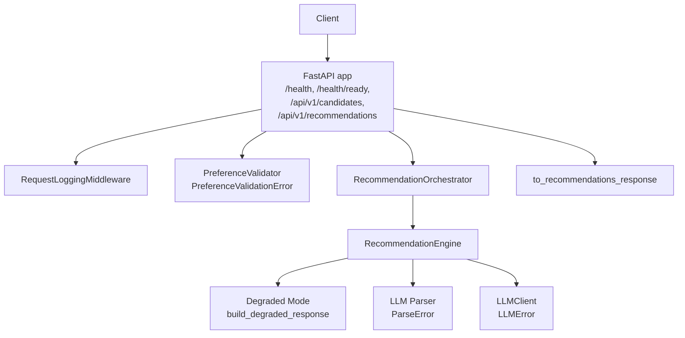
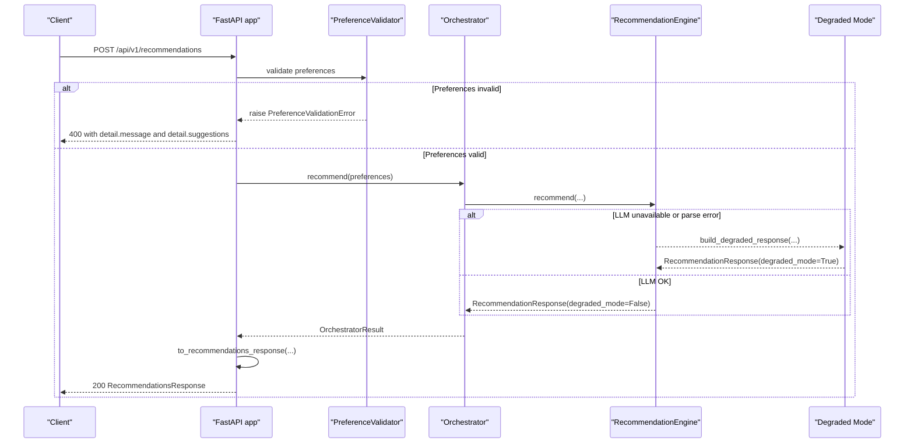
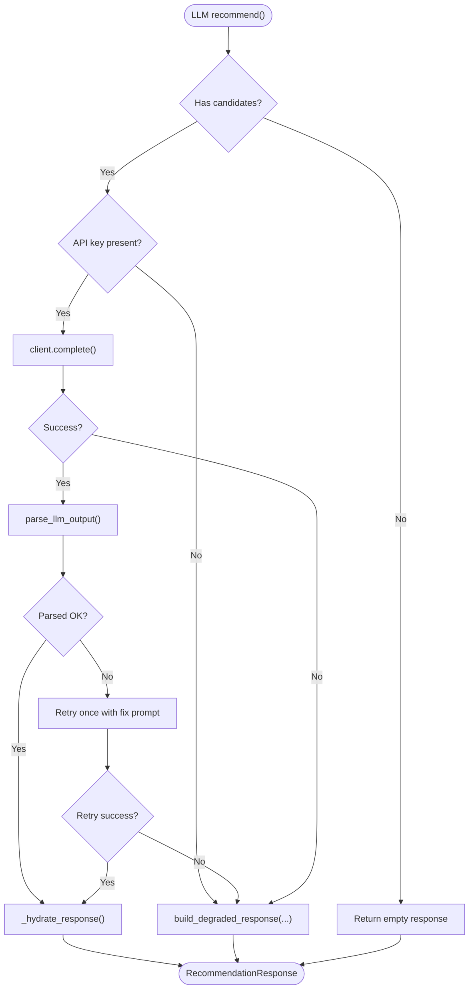
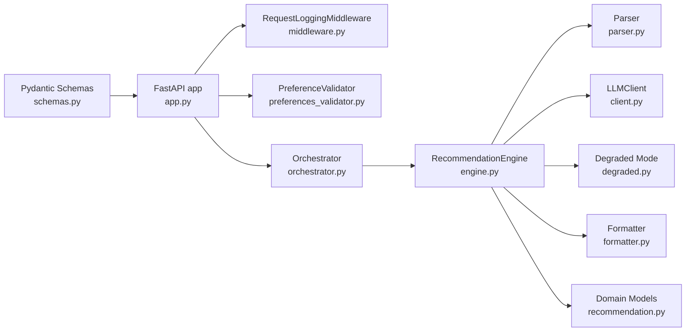

# Error Handling

<cite>
**Referenced Files in This Document**
- [app.py](file://src/api/app.py)
- [middleware.py](file://src/api/middleware.py)
- [schemas.py](file://src/api/schemas.py)
- [preferences_validator.py](file://src/filtering/preferences_validator.py)
- [formatter.py](file://src/api/formatter.py)
- [orchestrator.py](file://src/api/orchestrator.py)
- [engine.py](file://src/llm/engine.py)
- [client.py](file://src/llm/client.py)
- [parser.py](file://src/llm/parser.py)
- [recommendation.py](file://src/domain/recommendation.py)
- [preferences.py](file://src/domain/preferences.py)
- [test_api.py](file://tests/test_api.py)
</cite>

## Table of Contents
1. [Introduction](#introduction)
2. [Project Structure](#project-structure)
3. [Core Components](#core-components)
4. [Architecture Overview](#architecture-overview)
5. [Detailed Component Analysis](#detailed-component-analysis)
6. [Dependency Analysis](#dependency-analysis)
7. [Performance Considerations](#performance-considerations)
8. [Troubleshooting Guide](#troubleshooting-guide)
9. [Conclusion](#conclusion)

## Introduction
This document explains the API error handling patterns, HTTP status codes, and standardized error response formats used in the system. It covers:
- Validation errors (422) via FastAPI’s RequestValidationError handler
- Service unavailability (503) during startup or readiness failures
- Preference validation failures (400) with structured details and suggestions
- Custom exception mapping and error response standardization
- Examples of common error scenarios and client-side handling strategies
- Graceful degradation behavior and fallback mechanisms

## Project Structure
The error handling spans several layers:
- API layer: exception handlers, readiness checks, and endpoint logic
- Filtering/validation layer: preference validation and candidate filtering
- LLM engine: robust fallback to degraded mode on provider errors
- Response formatting: consistent API response shapes

**Diagram sources**
- [app.py:97-113](file://src/api/app.py#L97-L113)
- [middleware.py:17-37](file://src/api/middleware.py#L17-L37)
- [preferences_validator.py:13-68](file://src/filtering/preferences_validator.py#L13-L68)
- [orchestrator.py:30-98](file://src/api/orchestrator.py#L30-L98)
- [engine.py:29-173](file://src/llm/engine.py#L29-L173)
- [formatter.py:16-44](file://src/api/formatter.py#L16-L44)

**Section sources**
- [app.py:1-254](file://src/api/app.py#L1-L254)
- [middleware.py:1-38](file://src/api/middleware.py#L1-L38)
- [preferences_validator.py:1-76](file://src/filtering/preferences_validator.py#L1-L76)
- [engine.py:1-191](file://src/llm/engine.py#L1-L191)
- [formatter.py:1-49](file://src/api/formatter.py#L1-L49)
- [orchestrator.py:1-99](file://src/api/orchestrator.py#L1-L99)

## Core Components
- RequestValidationError handler returns 422 with a structured detail containing validation errors and a concise message.
- Service readiness guard raises 503 when the service is not ready (startup failure or missing dataset).
- Preference validation raises 400 with a structured detail including a message and suggestions for recovery.
- LLM engine falls back to degraded mode on missing API keys or provider errors, returning a consistent response shape with degraded_mode enabled.
- Response formatter ensures consistent RecommendationsResponse and meta fields.

Key behaviors:
- Standardized error response shape: JSON with detail and message fields for validation failures; detail includes suggestions for preference validation.
- Consistent meta fields across responses indicate whether degraded mode was used and related operational context.

**Section sources**
- [app.py:97-113](file://src/api/app.py#L97-L113)
- [app.py:178-182](file://src/api/app.py#L178-L182)
- [app.py:223-227](file://src/api/app.py#L223-L227)
- [engine.py:64-72](file://src/llm/engine.py#L64-L72)
- [engine.py:82-90](file://src/llm/engine.py#L82-L90)
- [engine.py:99-107](file://src/llm/engine.py#L99-L107)
- [formatter.py:16-44](file://src/api/formatter.py#L16-L44)

## Architecture Overview
The error handling architecture integrates request validation, preference validation, LLM resilience, and response shaping.

**Diagram sources**
- [app.py:211-242](file://src/api/app.py#L211-L242)
- [preferences_validator.py:37-68](file://src/filtering/preferences_validator.py#L37-L68)
- [orchestrator.py:45-98](file://src/api/orchestrator.py#L45-L98)
- [engine.py:45-118](file://src/llm/engine.py#L45-L118)
- [formatter.py:16-44](file://src/api/formatter.py#L16-L44)

## Detailed Component Analysis

### RequestValidationError Handler (422)
- Purpose: Intercept FastAPI’s RequestValidationError and return a standardized 422 response.
- Response format:
  - status_code: 422
  - body: { "detail": [...validation errors...], "message": "..." }
- Validation triggers include schema mismatches, out-of-range values, and type errors enforced by Pydantic validators.

Common triggers:
- Invalid budget enum values
- Location length limits or emptiness enforced by validators
- Numeric bounds violations (min_rating range)

**Section sources**
- [app.py:97-104](file://src/api/app.py#L97-L104)
- [schemas.py:13-31](file://src/api/schemas.py#L13-L31)
- [preferences.py:22-28](file://src/domain/preferences.py#L22-L28)
- [test_api.py:147-152](file://tests/test_api.py#L147-L152)

### Service Unavailability (503)
- Two entry points can return 503:
  - GET /health/ready: explicit readiness check
  - Any route guarded by readiness: internal readiness check raises 503 if not ready
- Behavior: Service indicates it is starting or dataset failed to load; clients should retry.

Operational context:
- Readiness gate ensures ingestion and orchestrator initialization succeeded before serving requests.

**Section sources**
- [app.py:151-155](file://src/api/app.py#L151-L155)
- [app.py:107-112](file://src/api/app.py#L107-L112)

### Preference Validation Failures (400)
- Triggered when preferences cannot be resolved (e.g., unknown city).
- Exception raised: PreferenceValidationError with:
  - message: descriptive error text
  - suggestions: optional list of candidate matches or defaults
- Response format:
  - status_code: 400
  - body: { "detail": { "message": "...", "suggestions": [...] } }

Recovery guidance:
- Use suggestions to correct the location spelling
- Broaden filters if appropriate

**Section sources**
- [preferences_validator.py:13-18](file://src/filtering/preferences_validator.py#L13-L18)
- [preferences_validator.py:37-68](file://src/filtering/preferences_validator.py#L37-L68)
- [app.py:178-182](file://src/api/app.py#L178-L182)
- [app.py:223-227](file://src/api/app.py#L223-L227)
- [test_api.py:155-161](file://tests/test_api.py#L155-L161)

### LLM Degraded Mode Fallback (Graceful Degradation)
- Conditions:
  - Missing LLM API key and provider is not mock
  - LLMError during completion
  - ParseError during response parsing (retry once)
- Behavior:
  - Engine returns RecommendationResponse with degraded_mode=True
  - Uses deterministic ranking based on filters and basic formatting
- Meta fields:
  - candidates_considered, filters_relaxed preserved
  - degraded_mode toggled for client awareness

**Diagram sources**
- [engine.py:45-118](file://src/llm/engine.py#L45-L118)
- [engine.py:120-173](file://src/llm/engine.py#L120-L173)
- [client.py:25-34](file://src/llm/client.py#L25-L34)
- [parser.py:36-45](file://src/llm/parser.py#L36-L45)
- [degraded.py:34-66](file://src/llm/degraded.py#L34-L66)

**Section sources**
- [engine.py:64-72](file://src/llm/engine.py#L64-L72)
- [engine.py:82-90](file://src/llm/engine.py#L82-L90)
- [engine.py:99-107](file://src/llm/engine.py#L99-L107)
- [engine.py:156-163](file://src/llm/engine.py#L156-L163)
- [recommendation.py:18-27](file://src/domain/recommendation.py#L18-L27)

### Error Response Standardization
- Validation errors (422): detail contains validation errors; message provides concise context.
- Preference validation errors (400): detail includes message and suggestions for correction.
- Service readiness errors (503): detail indicates service is starting or dataset failed to load.
- LLM errors (200 with degraded_mode=True): response remains successful but meta.degraded_mode signals fallback.

Consistency:
- All endpoints return JSON with consistent top-level structure.
- Meta fields standardized across responses enable client-side decisions.

**Section sources**
- [app.py:97-104](file://src/api/app.py#L97-L104)
- [app.py:178-182](file://src/api/app.py#L178-L182)
- [app.py:223-227](file://src/api/app.py#L223-L227)
- [formatter.py:16-44](file://src/api/formatter.py#L16-L44)
- [recommendation.py:18-27](file://src/domain/recommendation.py#L18-L27)

## Dependency Analysis
Error handling depends on:
- FastAPI exception handlers and schema validators
- Preference validation and suggestion generation
- LLM client and parser error types
- Response formatting and meta propagation

**Diagram sources**
- [schemas.py:13-31](file://src/api/schemas.py#L13-L31)
- [app.py:97-113](file://src/api/app.py#L97-L113)
- [middleware.py:17-37](file://src/api/middleware.py#L17-L37)
- [preferences_validator.py:28-68](file://src/filtering/preferences_validator.py#L28-L68)
- [orchestrator.py:30-98](file://src/api/orchestrator.py#L30-L98)
- [engine.py:29-173](file://src/llm/engine.py#L29-L173)
- [parser.py:25-45](file://src/llm/parser.py#L25-L45)
- [client.py:15-34](file://src/llm/client.py#L15-L34)
- [formatter.py:16-44](file://src/api/formatter.py#L16-L44)
- [recommendation.py:8-27](file://src/domain/recommendation.py#L8-L27)

**Section sources**
- [schemas.py:1-80](file://src/api/schemas.py#L1-L80)
- [app.py:1-254](file://src/api/app.py#L1-L254)
- [middleware.py:1-38](file://src/api/middleware.py#L1-L38)
- [preferences_validator.py:1-76](file://src/filtering/preferences_validator.py#L1-L76)
- [engine.py:1-191](file://src/llm/engine.py#L1-L191)
- [parser.py:1-46](file://src/llm/parser.py#L1-L46)
- [client.py:1-64](file://src/llm/client.py#L1-L64)
- [formatter.py:1-49](file://src/api/formatter.py#L1-L49)
- [recommendation.py:1-28](file://src/domain/recommendation.py#L1-L28)

## Performance Considerations
- Logging latency and request IDs enables correlation of errors across services.
- Degraded mode avoids expensive retries and maintains responsiveness under provider failures.
- Early validation reduces unnecessary downstream work and improves error feedback speed.

[No sources needed since this section provides general guidance]

## Troubleshooting Guide
Common scenarios and resolutions:
- Validation error (422):
  - Cause: Schema mismatch or out-of-range values
  - Action: Adjust payload to meet constraints (e.g., budget enum, min_rating range)
  - Reference: [test_api.py:147-152](file://tests/test_api.py#L147-L152)
- Unknown city (400):
  - Cause: Location not recognized
  - Action: Use suggestions to correct spelling or choose from known cities
  - Reference: [test_api.py:155-161](file://tests/test_api.py#L155-L161)
- Service not ready (503):
  - Cause: Startup failure or missing dataset
  - Action: Retry after a short delay; monitor /health and /health/ready
  - Reference: [app.py:151-155](file://src/api/app.py#L151-L155), [app.py:107-112](file://src/api/app.py#L107-L112)
- LLM unavailable (200 with degraded_mode=True):
  - Cause: Missing API key or provider error
  - Action: Configure credentials or retry; client should handle degraded_mode flag
  - Reference: [engine.py:64-72](file://src/llm/engine.py#L64-L72), [engine.py:82-90](file://src/llm/engine.py#L82-L90), [engine.py:99-107](file://src/llm/engine.py#L99-L107), [test_api.py:128-144](file://tests/test_api.py#L128-L144)

Client-side strategies:
- Always inspect meta.degraded_mode to adapt UI and messaging
- For 400 with suggestions, present selectable corrections to users
- For 503, implement exponential backoff and show maintenance notice
- Log X-Request-ID from responses to correlate backend logs

**Section sources**
- [test_api.py:128-161](file://tests/test_api.py#L128-L161)
- [engine.py:64-107](file://src/llm/engine.py#L64-L107)
- [app.py:107-113](file://src/api/app.py#L107-L113)
- [middleware.py:20-36](file://src/api/middleware.py#L20-L36)

## Conclusion
The system employs a layered error handling strategy:
- FastAPI intercepts validation errors and returns 422 with structured detail
- Readiness gates prevent serving until the system is fully initialized
- Preference validation produces actionable 400 responses with suggestions
- LLM failures trigger graceful degradation while preserving a consistent response shape
- Middleware and response formatting ensure consistent, traceable error reporting

This approach improves reliability, observability, and user experience across common failure modes.