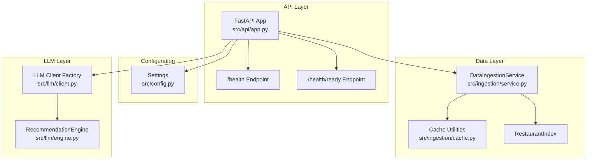
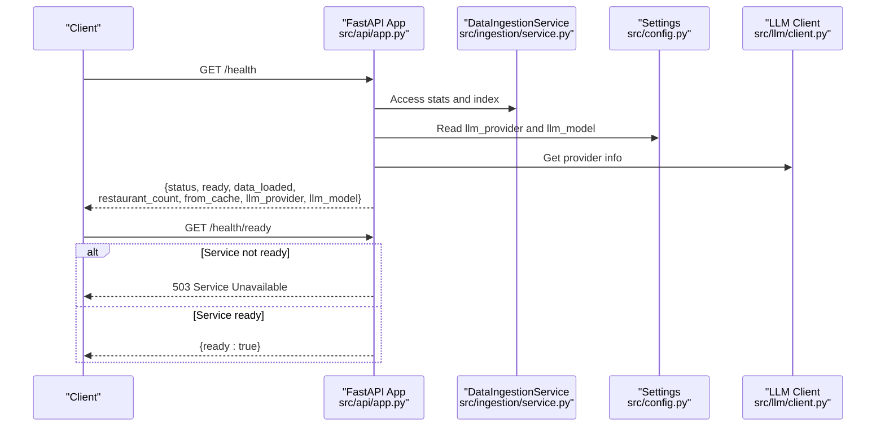
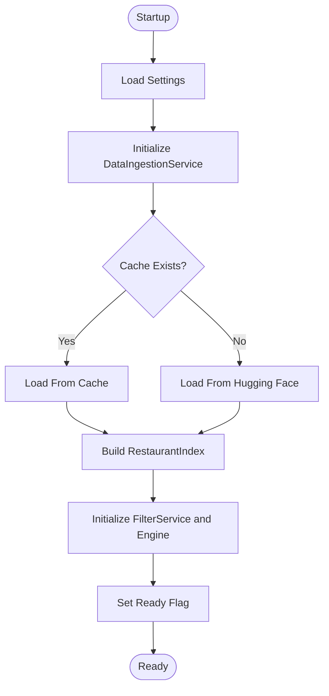
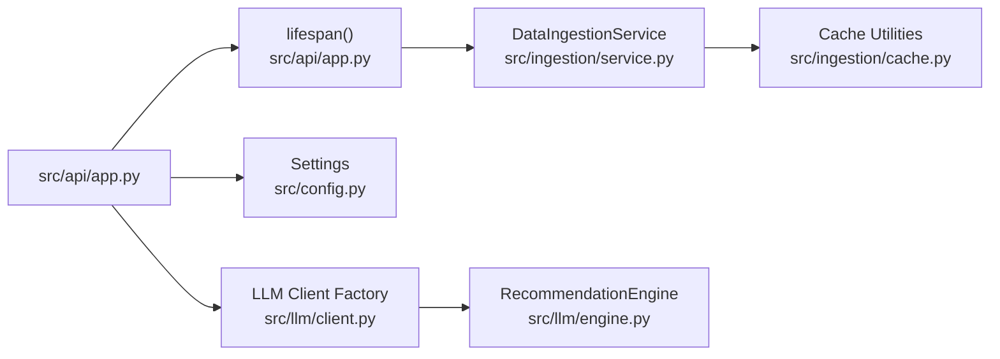

# Health Endpoints

<cite>
**Referenced Files in This Document**
- [app.py](file://src/api/app.py)
- [service.py](file://src/ingestion/service.py)
- [cache.py](file://src/ingestion/cache.py)
- [config.py](file://src/config.py)
- [client.py](file://src/llm/client.py)
- [engine.py](file://src/llm/engine.py)
- [test_api.py](file://tests/test_api.py)
- [README.md](file://README.md)
- [edge-cases.md](file://docs/edge-cases.md)
</cite>

## Table of Contents
1. [Introduction](#introduction)
2. [Project Structure](#project-structure)
3. [Core Components](#core-components)
4. [Architecture Overview](#architecture-overview)
5. [Detailed Component Analysis](#detailed-component-analysis)
6. [Dependency Analysis](#dependency-analysis)
7. [Performance Considerations](#performance-considerations)
8. [Troubleshooting Guide](#troubleshooting-guide)
9. [Conclusion](#conclusion)

## Introduction
This document provides comprehensive documentation for the health check endpoints `/health` and `/health/ready`. It explains the response structure, status indicators, readiness flags, data loading status, restaurant count metrics, cache statistics, and LLM provider information. It also covers the startup lifecycle, data loading process, error conditions affecting health status, and operational monitoring use cases.

## Project Structure
The health endpoints are implemented within the FastAPI application module alongside the main API routes. The application lifecycle manages data ingestion and service readiness, which directly influence the health endpoint responses.

**Diagram sources**
- [app.py:137-155](file://src/api/app.py#L137-L155)
- [service.py:62-161](file://src/ingestion/service.py#L62-L161)
- [cache.py:58-76](file://src/ingestion/cache.py#L58-L76)
- [config.py:46-81](file://src/config.py#L46-L81)
- [client.py:37-63](file://src/llm/client.py#L37-L63)
- [engine.py:29-191](file://src/llm/engine.py#L29-L191)

**Section sources**
- [app.py:137-155](file://src/api/app.py#L137-L155)
- [README.md:86-96](file://README.md#L86-L96)

## Core Components
- Health endpoint (`/health`): Returns service status, readiness flag, data loading status, restaurant count, cache hit indicator, and LLM provider/model information.
- Readiness endpoint (`/health/ready`): Returns a simple readiness confirmation or raises a 503 error if the service is not ready.
- Startup lifecycle: Initializes configuration, loads data, builds filter service and recommendation engine, and marks the service ready.

Key implementation references:
- Health endpoint definition and response construction: [app.py:137-148](file://src/api/app.py#L137-L148)
- Readiness endpoint definition and 503 behavior: [app.py:151-155](file://src/api/app.py#L151-L155)
- Startup lifecycle and readiness flag: [app.py:42-76](file://src/api/app.py#L42-L76)
- Data ingestion service and cache utilities: [service.py:62-161](file://src/ingestion/service.py#L62-L161), [cache.py:58-76](file://src/ingestion/cache.py#L58-L76)
- Configuration settings for LLM provider/model: [config.py:46-81](file://src/config.py#L46-L81)
- LLM client factory and engine: [client.py:37-63](file://src/llm/client.py#L37-L63), [engine.py:29-191](file://src/llm/engine.py#L29-L191)

**Section sources**
- [app.py:137-155](file://src/api/app.py#L137-L155)
- [app.py:42-76](file://src/api/app.py#L42-L76)
- [service.py:62-161](file://src/ingestion/service.py#L62-L161)
- [cache.py:58-76](file://src/ingestion/cache.py#L58-L76)
- [config.py:46-81](file://src/config.py#L46-L81)
- [client.py:37-63](file://src/llm/client.py#L37-L63)
- [engine.py:29-191](file://src/llm/engine.py#L29-L191)

## Architecture Overview
The health endpoints integrate with the application lifecycle and data ingestion subsystem. The `/health` endpoint reflects the current state of the service, while `/health/ready` serves as a readiness probe for load balancers and container orchestrators.

**Diagram sources**
- [app.py:137-155](file://src/api/app.py#L137-L155)
- [service.py:62-161](file://src/ingestion/service.py#L62-L161)
- [config.py:46-81](file://src/config.py#L46-L81)
- [client.py:37-63](file://src/llm/client.py#L37-L63)

## Detailed Component Analysis

### Health Endpoint (/health)
The `/health` endpoint provides a comprehensive snapshot of the service state:
- Status indicators:
  - `status`: "ok" when the service is ready; "starting" during initialization.
  - `ready`: Boolean indicating whether the service is ready to serve requests.
- Data loading status:
  - `data_loaded`: Boolean indicating whether the restaurant index is present.
  - `restaurant_count`: Number of restaurants loaded; zero when not ready.
- Cache statistics:
  - `from_cache`: Boolean indicating whether the dataset was loaded from cache.
- LLM provider information:
  - `llm_provider`: Provider name configured (e.g., "groq").
  - `llm_model`: Model identifier configured.

Operational behavior:
- During startup, the service initializes ingestion, builds the index, and sets the readiness flag.
- After successful initialization, the endpoint returns "ok" and populated metrics.
- If the service is not ready, the endpoint returns "starting" and zeros for numeric metrics.

Response structure reference:
- [app.py:137-148](file://src/api/app.py#L137-L148)

Example response fields:
- status: "ok" or "starting"
- ready: true or false
- data_loaded: true or false
- restaurant_count: integer
- from_cache: true or false
- llm_provider: string
- llm_model: string

Status codes:
- 200 OK under normal operation.

Monitoring use cases:
- Readiness probes: Use `/health/ready` for Kubernetes readiness gates.
- Liveness: Use `/health` for liveness checks to monitor ongoing service health.
- Operational dashboards: Track `restaurant_count`, `from_cache`, and `llm_provider`.

**Section sources**
- [app.py:137-148](file://src/api/app.py#L137-L148)
- [app.py:42-76](file://src/api/app.py#L42-L76)

### Readiness Endpoint (/health/ready)
The `/health/ready` endpoint serves as a readiness probe:
- Returns `{ "ready": true }` when the service is ready.
- Raises HTTP 503 Service Unavailable when the service is not ready.

Behavior during startup:
- The application lifecycle sets the readiness flag after successful data ingestion and service initialization.
- Until readiness is achieved, the endpoint returns 503.

Status codes:
- 200 OK when ready.
- 503 Service Unavailable when not ready.

Operational monitoring:
- Kubernetes readiness probes should target this endpoint to prevent traffic routing until the service is fully initialized.

**Section sources**
- [app.py:151-155](file://src/api/app.py#L151-L155)
- [app.py:42-76](file://src/api/app.py#L42-L76)

### Startup Lifecycle and Data Loading
The application lifecycle coordinates data ingestion and service initialization:
- Configuration loading: Retrieves settings for LLM provider, model, and cache paths.
- Data ingestion: Attempts to load the dataset either from cache or from the Hugging Face source.
- Index building: Constructs a restaurant index from loaded data.
- Service wiring: Initializes filter service and recommendation engine.
- Readiness flag: Marks the service ready after successful initialization.

Key implementation references:
- Application lifecycle and readiness flag: [app.py:42-76](file://src/api/app.py#L42-L76)
- Data ingestion service and cache utilities: [service.py:62-161](file://src/ingestion/service.py#L62-L161), [cache.py:58-76](file://src/ingestion/cache.py#L58-L76)
- Configuration settings: [config.py:46-81](file://src/config.py#L46-L81)

**Diagram sources**
- [app.py:42-76](file://src/api/app.py#L42-L76)
- [service.py:62-161](file://src/ingestion/service.py#L62-L161)
- [cache.py:58-76](file://src/ingestion/cache.py#L58-L76)
- [config.py:46-81](file://src/config.py#L46-L81)

**Section sources**
- [app.py:42-76](file://src/api/app.py#L42-L76)
- [service.py:62-161](file://src/ingestion/service.py#L62-L161)
- [cache.py:58-76](file://src/ingestion/cache.py#L58-L76)
- [config.py:46-81](file://src/config.py#L46-L81)

### Error Conditions Affecting Health Status
- Dataset load failure during startup: The lifecycle catches exceptions, logs them, and keeps the service not ready.
- API requests while not ready: Internal helpers raise HTTP 503 with a descriptive message.
- LLM configuration issues: Missing API keys or provider errors trigger degraded mode in recommendations, though the health endpoints themselves remain unaffected.

References:
- Startup error handling and readiness flag: [app.py:42-76](file://src/api/app.py#L42-L76)
- API readiness guard: [app.py:107-112](file://src/api/app.py#L107-L112)
- Edge case documentation for health checks: [edge-cases.md:167](file://docs/edge-cases.md#L167)

**Section sources**
- [app.py:42-76](file://src/api/app.py#L42-L76)
- [app.py:107-112](file://src/api/app.py#L107-L112)
- [edge-cases.md:167](file://docs/edge-cases.md#L167)

## Dependency Analysis
The health endpoints depend on the application lifecycle, ingestion service, and configuration. The ingestion service encapsulates cache and index management, while the configuration supplies LLM provider details.

**Diagram sources**
- [app.py:42-76](file://src/api/app.py#L42-L76)
- [service.py:62-161](file://src/ingestion/service.py#L62-L161)
- [cache.py:58-76](file://src/ingestion/cache.py#L58-L76)
- [config.py:46-81](file://src/config.py#L46-L81)
- [client.py:37-63](file://src/llm/client.py#L37-L63)
- [engine.py:29-191](file://src/llm/engine.py#L29-L191)

**Section sources**
- [app.py:42-76](file://src/api/app.py#L42-L76)
- [service.py:62-161](file://src/ingestion/service.py#L62-L161)
- [cache.py:58-76](file://src/ingestion/cache.py#L58-L76)
- [config.py:46-81](file://src/config.py#L46-L81)
- [client.py:37-63](file://src/llm/client.py#L37-L63)
- [engine.py:29-191](file://src/llm/engine.py#L29-L191)

## Performance Considerations
- Cache utilization: When data is loaded from cache, the service responds quickly and the `from_cache` flag indicates cache hits.
- Cold start impact: First-time ingestion from Hugging Face may take several minutes; subsequent starts load from cache.
- Monitoring metrics: Use `restaurant_count` to track dataset completeness and `from_cache` to monitor cache effectiveness.

[No sources needed since this section provides general guidance]

## Troubleshooting Guide
Common scenarios and diagnostics:
- Service not ready:
  - Verify that the startup lifecycle completed successfully.
  - Check logs for ingestion errors during startup.
  - Confirm that `/health/ready` returns 503 until the service is ready.
- Health endpoint returns zeros:
  - Occurs when the service is not ready; wait for initialization to complete.
- LLM provider issues:
  - The health endpoints do not reflect LLM errors; degraded mode affects recommendations, not health status.
- Testing readiness:
  - Use the test suite to validate health and readiness responses.

References:
- Health and readiness tests: [test_api.py:93-102](file://tests/test_api.py#L93-L102)
- Edge case documentation: [edge-cases.md:167](file://docs/edge-cases.md#L167)

**Section sources**
- [test_api.py:93-102](file://tests/test_api.py#L93-L102)
- [edge-cases.md:167](file://docs/edge-cases.md#L167)

## Conclusion
The health endpoints provide essential observability for the Zomato recommendation service. The `/health` endpoint offers a comprehensive view of service state, including readiness, data loading status, cache statistics, and LLM provider information. The `/health/ready` endpoint enables reliable readiness probing for production deployments. Together with the startup lifecycle and data ingestion subsystem, these endpoints support robust operational monitoring and deployment practices.