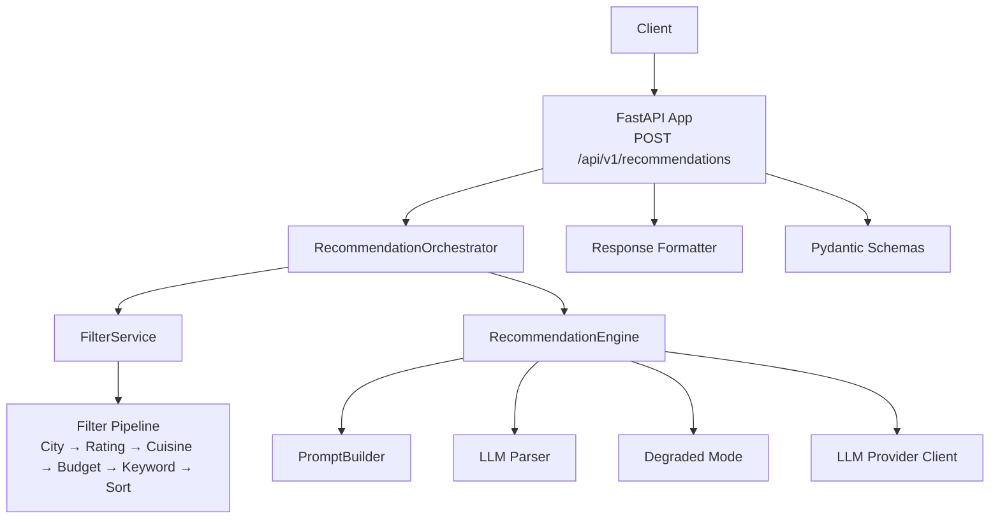
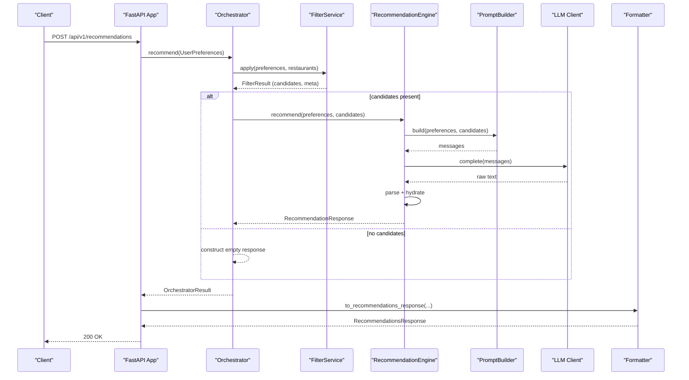
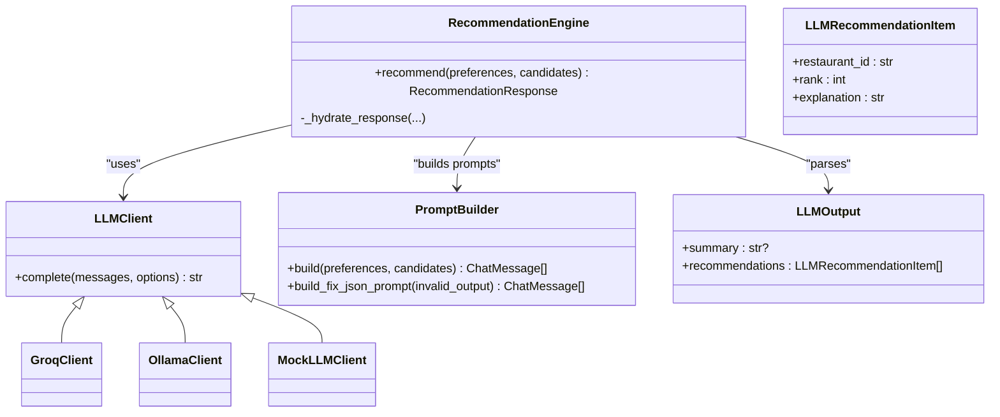
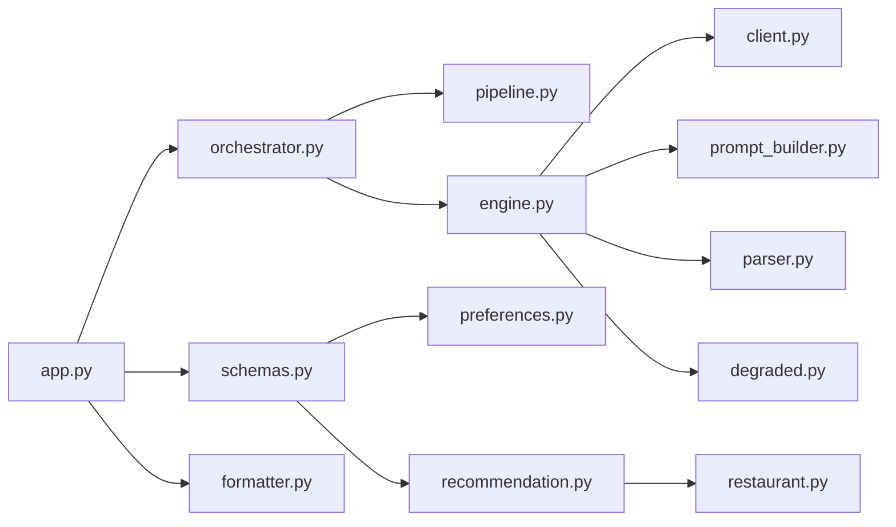

# Recommendation Engine

<cite>
**Referenced Files in This Document**
- [app.py](file://src/api/app.py)
- [schemas.py](file://src/api/schemas.py)
- [formatter.py](file://src/api/formatter.py)
- [preferences.py](file://src/domain/preferences.py)
- [recommendation.py](file://src/domain/recommendation.py)
- [restaurant.py](file://src/domain/restaurant.py)
- [orchestrator.py](file://src/api/orchestrator.py)
- [pipeline.py](file://src/filtering/pipeline.py)
- [client.py](file://src/llm/client.py)
- [engine.py](file://src/llm/engine.py)
- [prompt_builder.py](file://src/llm/prompt_builder.py)
- [parser.py](file://src/llm/parser.py)
- [degraded.py](file://src/llm/degraded.py)
- [config.py](file://src/config.py)
- [test_api.py](file://tests/test_api.py)
</cite>

## Table of Contents
1. [Introduction](#introduction)
2. [Project Structure](#project-structure)
3. [Core Components](#core-components)
4. [Architecture Overview](#architecture-overview)
5. [Detailed Component Analysis](#detailed-component-analysis)
6. [Dependency Analysis](#dependency-analysis)
7. [Performance Considerations](#performance-considerations)
8. [Troubleshooting Guide](#troubleshooting-guide)
9. [Conclusion](#conclusion)
10. [Appendices](#appendices)

## Introduction
This document provides comprehensive documentation for the `/api/v1/recommendations` POST endpoint that delivers AI-powered restaurant recommendations powered by an LLM. It explains the complete request/response lifecycle, including the UserPreferences schema, RecommendationRequest format, and RecommendationsResponse structure. It also details the recommendation workflow, LLM integration, ranking process, explanation generation, error handling, degraded mode operation, and production integration guidelines.

## Project Structure
The recommendation system is implemented as a FastAPI application with modular components:
- API layer: routes, request/response schemas, and response formatting
- Domain models: preferences, recommendations, and restaurant entities
- Filtering pipeline: deterministic candidate selection with configurable relaxation
- LLM integration: client abstraction, prompt building, parsing, and degraded mode fallback
- Orchestrator: coordinates filtering and LLM ranking into a unified response

**Diagram sources**
- [app.py:211-242](file://src/api/app.py#L211-L242)
- [orchestrator.py:30-98](file://src/api/orchestrator.py#L30-L98)
- [pipeline.py:42-103](file://src/filtering/pipeline.py#L42-L103)
- [engine.py:29-191](file://src/llm/engine.py#L29-L191)
- [prompt_builder.py:45-91](file://src/llm/prompt_builder.py#L45-L91)
- [parser.py:29-46](file://src/llm/parser.py#L29-L46)
- [formatter.py:16-44](file://src/api/formatter.py#L16-L44)
- [schemas.py:13-79](file://src/api/schemas.py#L13-L79)

**Section sources**
- [app.py:151-242](file://src/api/app.py#L151-L242)
- [schemas.py:13-79](file://src/api/schemas.py#L13-L79)

## Core Components
- UserPreferences: Describes user intent including location, budget, cuisine, minimum rating, and additional preferences.
- RecommendationRequest: API request schema validated and sanitized for safe processing.
- RecommendationResponse: Domain representation of recommendations with metadata.
- RecommendationsResponse: Final API response schema for clients.

Key characteristics:
- Location is normalized and validated; empty locations are rejected.
- Budget is constrained to predefined bands.
- Additional preferences support natural language augmentation.
- Responses include confidence-like ranking, restaurant details, and explanations.

**Section sources**
- [preferences.py:15-29](file://src/domain/preferences.py#L15-L29)
- [schemas.py:13-31](file://src/api/schemas.py#L13-L31)
- [recommendation.py:8-28](file://src/domain/recommendation.py#L8-L28)
- [schemas.py:58-79](file://src/api/schemas.py#L58-L79)

## Architecture Overview
The endpoint performs:
1. Validation and conversion of RecommendationRequest to UserPreferences
2. Deterministic filtering to produce a candidate shortlist
3. Optional LLM ranking and explanation generation
4. Formatting into RecommendationsResponse

**Diagram sources**
- [app.py:211-242](file://src/api/app.py#L211-L242)
- [orchestrator.py:45-98](file://src/api/orchestrator.py#L45-L98)
- [pipeline.py:42-103](file://src/filtering/pipeline.py#L42-L103)
- [engine.py:45-118](file://src/llm/engine.py#L45-L118)
- [prompt_builder.py:50-77](file://src/llm/prompt_builder.py#L50-L77)
- [formatter.py:16-44](file://src/api/formatter.py#L16-L44)

## Detailed Component Analysis

### Endpoint Definition and Request/Response
- Endpoint: POST /api/v1/recommendations
- Request: RecommendationRequest (validated via Pydantic)
- Response: RecommendationsResponse (formatted via API schemas)

Behavior highlights:
- Converts RecommendationRequest to UserPreferences
- Delegates to RecommendationOrchestrator for processing
- Logs performance metrics and degraded mode flag
- Applies response formatting and enriches with resolved city and empty reason

**Section sources**
- [app.py:211-242](file://src/api/app.py#L211-L242)
- [schemas.py:13-79](file://src/api/schemas.py#L13-L79)
- [formatter.py:16-44](file://src/api/formatter.py#L16-L44)

### UserPreferences Schema
- Fields: location, budget (enum), cuisine (optional), min_rating (float), additional_preferences (optional)
- Validation:
  - Location cannot be empty after stripping
  - Sanitization removes HTML tags and collapses whitespace
  - Budget must be one of low/medium/high
  - min_rating constrained to 0–5

**Section sources**
- [preferences.py:15-29](file://src/domain/preferences.py#L15-L29)
- [schemas.py:13-31](file://src/api/schemas.py#L13-L31)

### RecommendationRequest and RecommendationsResponse
- RecommendationRequest:
  - location: up to 50 chars
  - budget: required enum
  - cuisine: optional up to 100 chars
  - min_rating: defaults to 3.0, 0–5
  - additional_preferences: optional up to 500 chars
- RecommendationsResponse:
  - summary: optional
  - recommendations: list of RecommendationOut
  - meta: RecommendationMetaOut with counts, flags, resolved city, and empty reason

RecommendationOut fields:
- rank: integer
- restaurant_id: string
- name: string
- cuisine: formatted string
- rating: float
- estimated_cost: formatted currency string
- explanation: human-readable justification

**Section sources**
- [schemas.py:13-79](file://src/api/schemas.py#L13-L79)
- [recommendation.py:8-28](file://src/domain/recommendation.py#L8-L28)

### Filtering Pipeline
- Purpose: Deterministic candidate selection with configurable relaxation
- Steps:
  - Resolve city and filter by city
  - Filter by rating threshold
  - Filter by cuisine
  - Filter by budget band
  - Apply keyword filter if present
  - Sort candidates by budget preference
  - Truncate to maximum candidates
- Relaxation policy (when candidate count is below threshold):
  - Widen budget band
  - Drop keyword filter
  - Lower minimum rating (in steps) down to floor
  - Drop cuisine filter
- Returns FilterResult with:
  - candidates, candidates_considered, filters_relaxed, relaxation_steps
  - empty_reason, resolved_city, city_suggestions

**Section sources**
- [pipeline.py:42-103](file://src/filtering/pipeline.py#L42-L103)
- [pipeline.py:131-203](file://src/filtering/pipeline.py#L131-L203)

### LLM Integration and Ranking
- Provider abstraction: LLMClient with providers including mock, ollama, groq/openai
- Prompt building: PromptBuilder composes system and user messages with serialized preferences and candidates
- Completion: RecommendationEngine calls LLM client and logs exchanges optionally
- Parsing: parse_llm_output validates JSON and enforces schema
- Hydration: _hydrate_response maps LLM outputs to Recommendation items, deduplicates, and truncates to top_n

**Diagram sources**
- [client.py:15-63](file://src/llm/client.py#L15-L63)
- [engine.py:29-191](file://src/llm/engine.py#L29-L191)
- [prompt_builder.py:45-91](file://src/llm/prompt_builder.py#L45-L91)
- [parser.py:14-46](file://src/llm/parser.py#L14-L46)

**Section sources**
- [client.py:37-63](file://src/llm/client.py#L37-L63)
- [engine.py:45-118](file://src/llm/engine.py#L45-L118)
- [prompt_builder.py:50-77](file://src/llm/prompt_builder.py#L50-L77)
- [parser.py:36-46](file://src/llm/parser.py#L36-L46)

### Explanation Generation
- Normal operation: LLM generates explanations per recommendation
- Fallback: Degraded mode constructs explanations from template logic based on preferences and restaurant attributes

**Section sources**
- [engine.py:120-173](file://src/llm/engine.py#L120-L173)
- [degraded.py:22-32](file://src/llm/degraded.py#L22-L32)

### Orchestrator Workflow
- Loads restaurants and index
- Runs filter pipeline and records filter duration
- If candidates exist, invokes RecommendationEngine and records LLM duration
- Aggregates metrics and returns unified result

**Section sources**
- [orchestrator.py:45-98](file://src/api/orchestrator.py#L45-L98)

### Response Formatting
- Maps RecommendationResponse to RecommendationsResponse
- Rounds ratings to one decimal place
- Populates meta fields including resolved city and empty reason

**Section sources**
- [formatter.py:16-44](file://src/api/formatter.py#L16-L44)

### Example Request and Response

- Request (RecommendationRequest)
  - location: string (e.g., "Bangalore")
  - budget: enum (e.g., "medium")
  - cuisine: optional string (e.g., "Italian")
  - min_rating: float (e.g., 4.0)
  - additional_preferences: optional string (e.g., "quiet ambiance")

- Response (RecommendationsResponse)
  - summary: optional string
  - recommendations: array of RecommendationOut
  - meta: RecommendationMetaOut

Example recommendation item fields:
- rank: integer
- restaurant_id: string
- name: string
- cuisine: formatted string
- rating: float (rounded)
- estimated_cost: formatted currency string
- explanation: string

Performance metrics included in logs:
- filter_duration_ms
- llm_duration_ms
- degraded_mode flag

Empty scenario:
- If no candidates are found after filtering, the endpoint returns an empty recommendations list with meta indicating empty_reason and filters_relaxed.

**Section sources**
- [test_api.py:104-126](file://tests/test_api.py#L104-L126)
- [app.py:229-236](file://src/api/app.py#L229-L236)
- [formatter.py:47-49](file://src/api/formatter.py#L47-L49)

## Dependency Analysis
High-level dependencies:
- FastAPI app depends on orchestrator, filter service, and LLM engine
- Orchestrator depends on ingestion service, filter service, and recommendation engine
- Engine depends on client abstraction, prompt builder, and parser
- Schemas define request/response contracts consumed across layers

**Diagram sources**
- [app.py:15-31](file://src/api/app.py#L15-L31)
- [orchestrator.py:10-43](file://src/api/orchestrator.py#L10-L43)
- [engine.py:12-24](file://src/llm/engine.py#L12-L24)
- [schemas.py:8-11](file://src/api/schemas.py#L8-L11)

**Section sources**
- [app.py:15-31](file://src/api/app.py#L15-L31)
- [orchestrator.py:10-43](file://src/api/orchestrator.py#L10-L43)
- [engine.py:12-24](file://src/llm/engine.py#L12-L24)

## Performance Considerations
- Filter pipeline target: keep processing under 200 ms; warnings logged for longer runs
- LLM latency measured and logged; consider caching or batching for high-throughput deployments
- top_n_results controls downstream truncation; tune based on SLAs and UX needs
- Provider choice impacts latency and quality; configure llm_provider and llm_model appropriately

[No sources needed since this section provides general guidance]

## Troubleshooting Guide
Common issues and resolutions:
- Validation errors (422): Ensure budget enum values are correct and strings meet length limits
- City resolution errors (400): Unknown city; suggestions included in error detail
- Service not ready (503): Startup failed or dataset did not load; check health endpoints
- Empty recommendations: Verify filters; the system may relax filters and still return empty results if thresholds are too strict
- LLM failures: If API key is missing or provider fails, the system falls back to degraded mode with basic ranking and templated explanations

Operational checks:
- Health endpoint indicates readiness, loaded restaurant count, and LLM provider/model
- Ready endpoint confirms service availability
- Logs show filter and LLM durations and degraded mode usage

**Section sources**
- [app.py:97-104](file://src/api/app.py#L97-L104)
- [app.py:137-155](file://src/api/app.py#L137-L155)
- [app.py:229-236](file://src/api/app.py#L229-L236)
- [engine.py:64-72](file://src/llm/engine.py#L64-L72)
- [engine.py:82-90](file://src/llm/engine.py#L82-L90)

## Conclusion
The `/api/v1/recommendations` endpoint integrates deterministic filtering with LLM-powered ranking and explanations. It offers robust validation, graceful degradation, and clear observability. Production deployments should monitor filter and LLM latencies, configure providers appropriately, and leverage the meta fields for diagnostics and user feedback.

[No sources needed since this section summarizes without analyzing specific files]

## Appendices

### API Definition
- Method: POST
- Path: /api/v1/recommendations
- Request body: RecommendationRequest
- Response body: RecommendationsResponse
- Success: 200 OK
- Errors: 400 (validation/city), 422 (schema), 503 (service not ready)

**Section sources**
- [app.py:211-242](file://src/api/app.py#L211-L242)
- [schemas.py:13-79](file://src/api/schemas.py#L13-L79)

### Configuration Options
Key settings affecting recommendation behavior:
- llm_provider: "groq", "ollama", "openai", or "mock"
- llm_api_key: provider credentials
- llm_model: model identifier
- top_n_results: number of recommendations to return
- max_candidates/min_candidates: filter pipeline thresholds
- llm_temperature,llm_max_tokens,llm_timeout_seconds: LLM tuning
- llm_log_prompts,llm_log_dir: optional prompt logging

**Section sources**
- [config.py:46-80](file://src/config.py#L46-L80)

### Degraded Mode Behavior
When LLM API key is missing or provider calls fail:
- Basic ranking is performed using candidate attributes
- Templated explanations are generated based on preferences and restaurant details
- meta.degraded_mode is set to true

**Section sources**
- [engine.py:64-72](file://src/llm/engine.py#L64-L72)
- [engine.py:82-90](file://src/llm/engine.py#L82-L90)
- [degraded.py:34-66](file://src/llm/degraded.py#L34-L66)