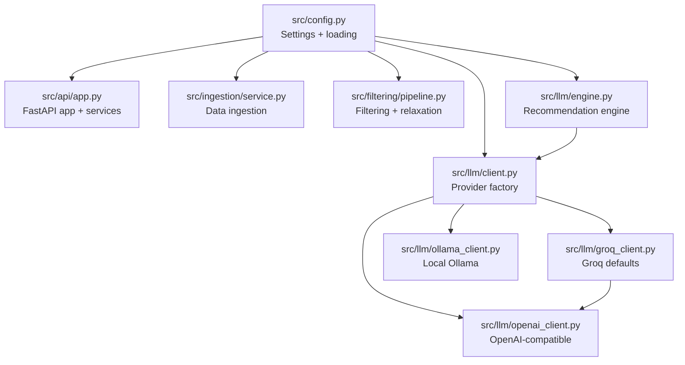
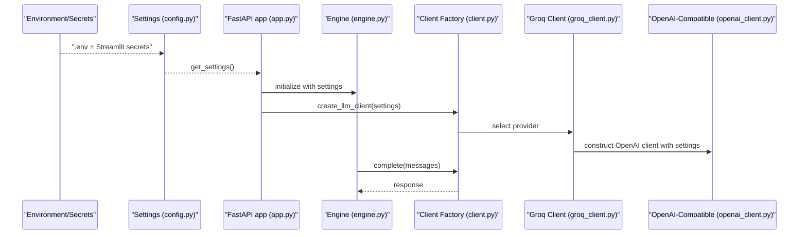
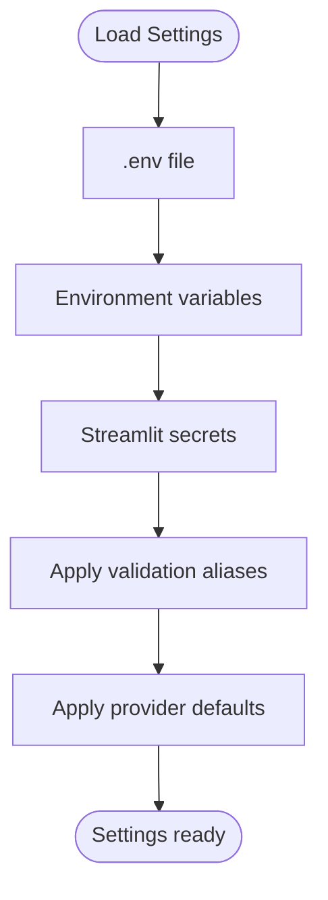
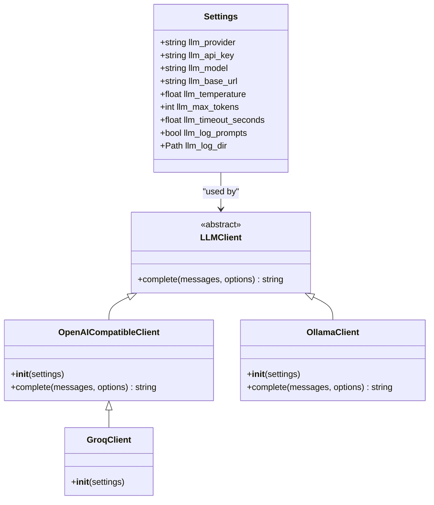
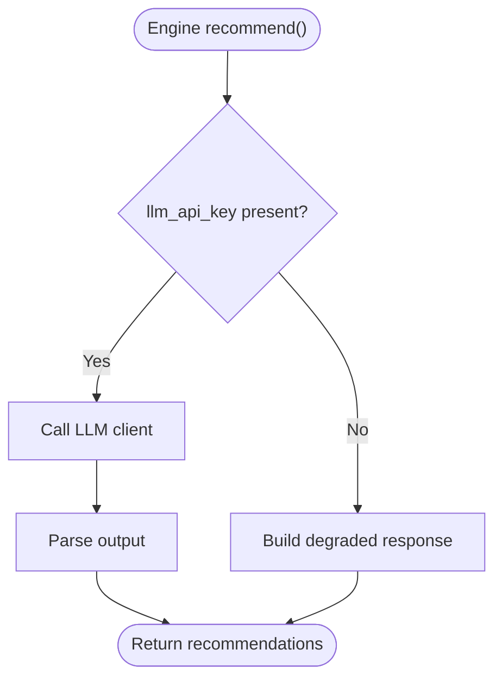
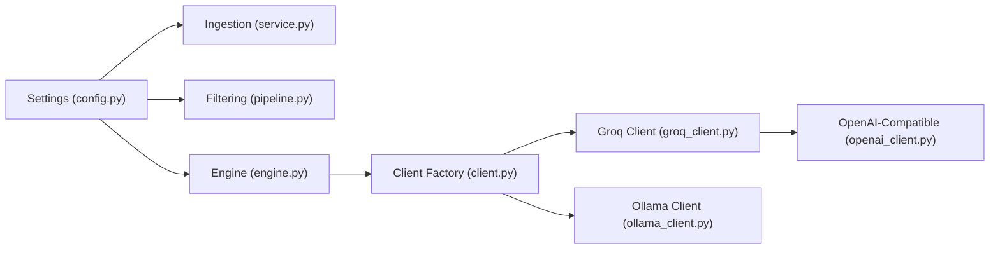

# Configuration Management

<cite>
**Referenced Files in This Document**
- [config.py](file://src/config.py)
- [app.py](file://src/api/app.py)
- [client.py](file://src/llm/client.py)
- [groq_client.py](file://src/llm/groq_client.py)
- [ollama_client.py](file://src/llm/ollama_client.py)
- [openai_client.py](file://src/llm/openai_client.py)
- [engine.py](file://src/llm/engine.py)
- [pipeline.py](file://src/filtering/pipeline.py)
- [service.py](file://src/ingestion/service.py)
- [deployment-plan.md](file://docs/deployment-plan.md)
- [test_groq_client.py](file://tests/test_groq_client.py)
- [requirements.txt](file://requirements.txt)
</cite>

## Table of Contents
1. [Introduction](#introduction)
2. [Project Structure](#project-structure)
3. [Core Components](#core-components)
4. [Architecture Overview](#architecture-overview)
5. [Detailed Component Analysis](#detailed-component-analysis)
6. [Dependency Analysis](#dependency-analysis)
7. [Performance Considerations](#performance-considerations)
8. [Security and Access Control](#security-and-access-control)
9. [Environment-Specific Configurations](#environment-specific-configurations)
10. [Configuration Validation and Error Handling](#configuration-validation-and-error-handling)
11. [Dynamic Configuration Reloading](#dynamic-configuration-reloading)
12. [Configuration Versioning and Migration](#configuration-versioning-and-migration)
13. [Troubleshooting Guide](#troubleshooting-guide)
14. [Conclusion](#conclusion)

## Introduction
This document provides comprehensive configuration management guidance for the recommendation system. It covers all configurable parameters (LLM providers, API keys, database connections, feature flags), configuration hierarchy and overrides, environment-specific setups, security considerations, validation, error handling, dynamic reloading, versioning/migration, and troubleshooting.

## Project Structure
Configuration is centralized in a single module and consumed across the application:
- Central configuration: src/config.py defines typed settings and loading order
- Application wiring: src/api/app.py initializes services using shared settings
- LLM integration: src/llm/* clients consume settings for provider selection and behavior
- Data ingestion: src/ingestion/service.py uses settings for cache paths and dataset metadata
- Filtering pipeline: src/filtering/pipeline.py applies settings for candidate thresholds and relaxation
- Deployment guidance: docs/deployment-plan.md documents environment-specific steps

**Diagram sources**
- [config.py:46-80](file://src/config.py#L46-L80)
- [app.py:35-76](file://src/api/app.py#L35-L76)
- [service.py:65-115](file://src/ingestion/service.py#L65-L115)
- [pipeline.py:34-103](file://src/filtering/pipeline.py#L34-L103)
- [engine.py:29-43](file://src/llm/engine.py#L29-L43)
- [client.py:37-63](file://src/llm/client.py#L37-L63)
- [groq_client.py:12-28](file://src/llm/groq_client.py#L12-L28)
- [openai_client.py:17-65](file://src/llm/openai_client.py#L17-L65)
- [ollama_client.py:17-55](file://src/llm/ollama_client.py#L17-L55)

**Section sources**
- [config.py:1-81](file://src/config.py#L1-L81)
- [app.py:1-254](file://src/api/app.py#L1-L254)

## Core Components
- Settings class encapsulates all configuration with Pydantic validation and aliasing
- Provider factory selects LLM backend based on settings
- Engine falls back to degraded mode when LLM credentials are absent
- Ingestion service uses settings for cache path and dataset metadata
- Pipeline applies settings for candidate thresholds and relaxation behavior

Key configuration parameters:
- LLM provider selection and credentials
- Model, base URL, timeouts, and logging
- Dataset and caching paths
- Candidate thresholds and top-N results
- CORS origins
- City normalization aliases

**Section sources**
- [config.py:46-80](file://src/config.py#L46-L80)
- [client.py:37-63](file://src/llm/client.py#L37-L63)
- [engine.py:64-72](file://src/llm/engine.py#L64-L72)
- [service.py:86-111](file://src/ingestion/service.py#L86-L111)
- [pipeline.py:75-85](file://src/filtering/pipeline.py#L75-L85)

## Architecture Overview
Configuration flows from environment and secrets into typed settings, then into services and clients. The provider factory ensures correct client instantiation and default overrides for supported providers.

**Diagram sources**
- [config.py:37-80](file://src/config.py#L37-L80)
- [app.py:42-76](file://src/api/app.py#L42-L76)
- [engine.py:40-43](file://src/llm/engine.py#L40-L43)
- [client.py:37-63](file://src/llm/client.py#L37-L63)
- [groq_client.py:12-28](file://src/llm/groq_client.py#L12-L28)
- [openai_client.py:17-65](file://src/llm/openai_client.py#L17-L65)

## Detailed Component Analysis

### Settings and Loading Order
- Loads from .env via pydantic-settings
- Supports Streamlit secrets with precedence over .env and environment variables
- Provides validation aliases for API keys
- Defines defaults for LLM provider, model, base URL, and other parameters

**Diagram sources**
- [config.py:37-80](file://src/config.py#L37-L80)

**Section sources**
- [config.py:46-80](file://src/config.py#L46-L80)
- [deployment-plan.md:314-399](file://docs/deployment-plan.md#L314-L399)

### LLM Provider Selection and Defaults
- Provider factory chooses client based on llm_provider
- Groq defaults applied when base URL/model are unset
- OpenAI-compatible client consumes settings for timeouts, tokens, and temperature

**Diagram sources**
- [config.py:46-80](file://src/config.py#L46-L80)
- [client.py:15-63](file://src/llm/client.py#L15-L63)
- [openai_client.py:17-65](file://src/llm/openai_client.py#L17-L65)
- [groq_client.py:12-28](file://src/llm/groq_client.py#L12-L28)
- [ollama_client.py:17-55](file://src/llm/ollama_client.py#L17-L55)

**Section sources**
- [client.py:37-63](file://src/llm/client.py#L37-L63)
- [groq_client.py:12-28](file://src/llm/groq_client.py#L12-L28)
- [openai_client.py:17-65](file://src/llm/openai_client.py#L17-L65)
- [ollama_client.py:17-55](file://src/llm/ollama_client.py#L17-L55)

### Degraded Mode and Validation
- Engine checks for API key presence and falls back to degraded mode when absent
- Tests validate degraded behavior when API key is missing

**Diagram sources**
- [engine.py:64-72](file://src/llm/engine.py#L64-L72)
- [engine.py:82-90](file://src/llm/engine.py#L82-L90)

**Section sources**
- [engine.py:64-72](file://src/llm/engine.py#L64-L72)
- [test_groq_client.py:16-19](file://tests/test_groq_client.py#L16-L19)

### Data Ingestion and Caching
- Uses settings for cache path and dataset ID
- Applies minimum city samples threshold for percentiles computation

**Section sources**
- [service.py:86-111](file://src/ingestion/service.py#L86-L111)
- [service.py:138-141](file://src/ingestion/service.py#L138-L141)

### Filtering Pipeline Thresholds
- Applies min_candidates and max_candidates thresholds
- Uses settings to relax filters when insufficient candidates remain

**Section sources**
- [pipeline.py:75-85](file://src/filtering/pipeline.py#L75-L85)
- [pipeline.py:146-201](file://src/filtering/pipeline.py#L146-L201)

## Dependency Analysis
- Centralized settings dependency across ingestion, filtering, and LLM engine
- Provider factory decouples client selection from application logic
- OpenAI-compatible client centralizes HTTP client configuration

**Diagram sources**
- [config.py:46-80](file://src/config.py#L46-L80)
- [service.py:65-115](file://src/ingestion/service.py#L65-L115)
- [pipeline.py:34-103](file://src/filtering/pipeline.py#L34-L103)
- [engine.py:29-43](file://src/llm/engine.py#L29-L43)
- [client.py:37-63](file://src/llm/client.py#L37-L63)
- [groq_client.py:12-28](file://src/llm/groq_client.py#L12-L28)
- [openai_client.py:17-65](file://src/llm/openai_client.py#L17-L65)
- [ollama_client.py:17-55](file://src/llm/ollama_client.py#L17-L55)

**Section sources**
- [requirements.txt:5-12](file://requirements.txt#L5-L12)

## Performance Considerations
- Tune llm_timeout_seconds and llm_max_tokens to balance latency and quality
- Adjust min_candidates and max_candidates to control candidate pool size
- Enable llm_log_prompts only for debugging due to I/O overhead
- Consider local Ollama for reduced network latency in development

## Security and Access Control
- API keys are loaded from environment/secrets and passed to clients
- Validation aliases support multiple key names for compatibility
- Streamlit secrets are merged into environment with precedence
- Keep .env and secrets.toml out of version control

Best practices:
- Restrict access to secrets to authorized CI/CD and deployment systems
- Rotate API keys regularly and monitor usage
- Avoid logging sensitive data; disable llm_log_prompts in production

**Section sources**
- [config.py:37-80](file://src/config.py#L37-L80)
- [openai_client.py:20-23](file://src/llm/openai_client.py#L20-L23)
- [deployment-plan.md:444-466](file://docs/deployment-plan.md#L444-L466)

## Environment-Specific Configurations
- Development: Use local Ollama (default base URL) or mock provider for offline development
- Staging: Validate Groq credentials and enable minimal logging
- Production: Ensure API keys are present; configure CORS origins appropriately

Environment-specific guidance:
- Streamlit Cloud requires secrets.toml and ephemeral filesystem handling
- Commit data/cache/restaurants.parquet for faster cold starts

**Section sources**
- [deployment-plan.md:314-399](file://docs/deployment-plan.md#L314-L399)
- [deployment-plan.md:403-441](file://docs/deployment-plan.md#L403-L441)

## Configuration Validation and Error Handling
- Pydantic validation enforces types and defaults
- Validation aliases resolve multiple key names to a single setting
- Missing API keys trigger degraded mode with warnings
- Client-side errors propagate as typed exceptions

Common validations:
- llm_api_key presence for non-mock providers
- llm_base_url and llm_model defaults for Groq
- Timeout and token limits for LLM calls

**Section sources**
- [config.py:59-62](file://src/config.py#L59-L62)
- [groq_client.py:12-21](file://src/llm/groq_client.py#L12-L21)
- [engine.py:64-72](file://src/llm/engine.py#L64-L72)
- [openai_client.py:55-60](file://src/llm/openai_client.py#L55-L60)

## Dynamic Configuration Reloading
- Current implementation initializes settings once at startup
- To support dynamic reloads, add a settings refresh mechanism and propagate changes to services

Proposed approach:
- Expose a settings refresh endpoint that rebuilds services with new settings
- Invalidate caches and restart background tasks as needed

[No sources needed since this section proposes general guidance]

## Configuration Versioning and Migration
- Use semantic versioning for settings schema changes
- Maintain backward-compatible aliases (as with API key aliases)
- Document breaking changes and provide migration scripts for cache paths or dataset IDs

Migration strategy:
- Introduce new settings with defaults
- Keep old keys functional via aliases
- Log deprecation warnings for deprecated keys

**Section sources**
- [config.py:59-62](file://src/config.py#L59-L62)

## Troubleshooting Guide
- Symptoms: Empty recommendations or degraded mode
  - Cause: Missing or invalid llm_api_key
  - Resolution: Set valid API key via environment/secrets; verify aliases
- Symptoms: Health checks fail or service not ready
  - Cause: Dataset load failure on startup
  - Resolution: Check cache availability and ingestion logs
- Symptoms: Unexpected provider behavior
  - Cause: Incorrect llm_provider or missing defaults
  - Resolution: Confirm provider selection and Groq defaults application

Diagnostic steps:
- Verify settings resolution order and precedence
- Check client initialization and error types
- Review ingestion cache existence and permissions

**Section sources**
- [engine.py:64-72](file://src/llm/engine.py#L64-L72)
- [app.py:48-54](file://src/api/app.py#L48-L54)
- [service.py:86-104](file://src/ingestion/service.py#L86-L104)
- [test_groq_client.py:16-19](file://tests/test_groq_client.py#L16-L19)

## Conclusion
The configuration system centers on a single, typed Settings class with clear precedence and validation. It supports multiple LLM providers, secure secret loading, and graceful fallbacks. By following the outlined security, environment-specific, and troubleshooting guidance, teams can maintain reliable and observable deployments across development, staging, and production.