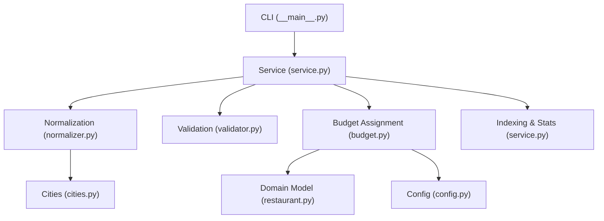
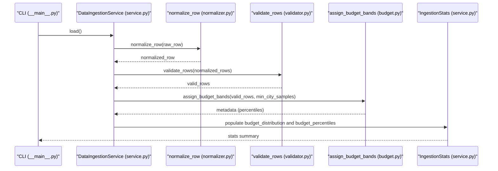
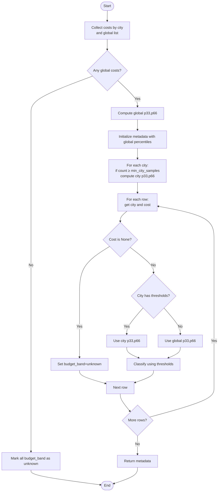
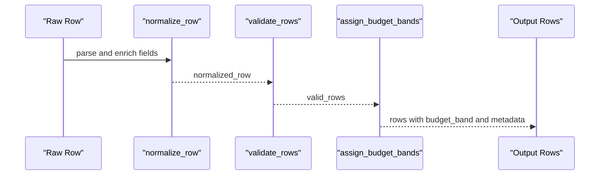
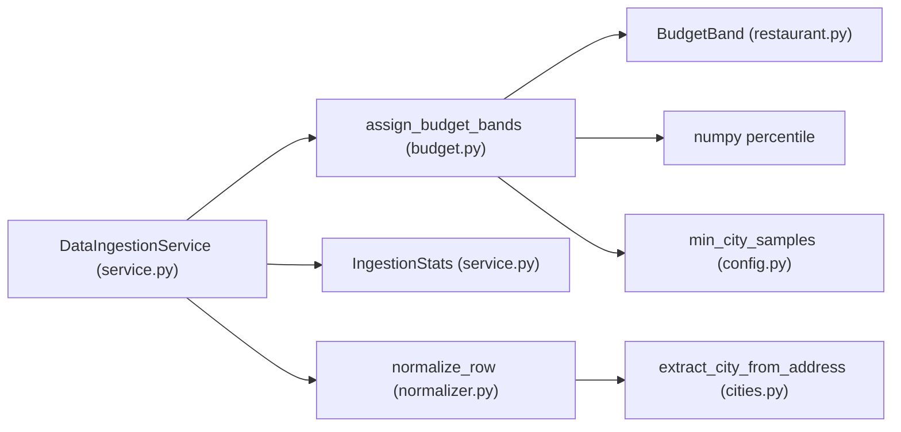

# Budget Classification

<cite>
**Referenced Files in This Document**
- [budget.py](file://src/ingestion/budget.py)
- [restaurant.py](file://src/domain/restaurant.py)
- [service.py](file://src/ingestion/service.py)
- [config.py](file://src/config.py)
- [normalizer.py](file://src/ingestion/normalizer.py)
- [cities.py](file://src/ingestion/cities.py)
- [test_budget.py](file://tests/test_budget.py)
- [conftest.py](file://tests/conftest.py)
- [__main__.py](file://src/ingestion/__main__.py)
</cite>

## Table of Contents
1. [Introduction](#introduction)
2. [Project Structure](#project-structure)
3. [Core Components](#core-components)
4. [Architecture Overview](#architecture-overview)
5. [Detailed Component Analysis](#detailed-component-analysis)
6. [Dependency Analysis](#dependency-analysis)
7. [Performance Considerations](#performance-considerations)
8. [Troubleshooting Guide](#troubleshooting-guide)
9. [Conclusion](#conclusion)

## Introduction
This document explains the budget band classification system used to categorize restaurants into Economy, Mid-range, and Premium tiers based on approximate cost for two. The system computes city-wise and global percentiles, applies a minimum city sample threshold for reliable estimates, and falls back to global percentiles for cities with insufficient data. It also generates percentile metadata and budget distribution statistics for observability.

## Project Structure
The budget classification lives in the ingestion pipeline and integrates with normalization, validation, and caching layers. Key files:
- Budget computation and distribution: [budget.py](file://src/ingestion/budget.py)
- Domain model for budget bands: [restaurant.py](file://src/domain/restaurant.py)
- Ingestion orchestration and statistics: [service.py](file://src/ingestion/service.py)
- Configuration for minimum city samples: [config.py](file://src/config.py)
- Row normalization (including cost parsing): [normalizer.py](file://src/ingestion/normalizer.py)
- City extraction and normalization: [cities.py](file://src/ingestion/cities.py)
- CLI entry point for ingestion: [__main__.py](file://src/ingestion/__main__.py)
- Tests validating behavior: [test_budget.py](file://tests/test_budget.py), [conftest.py](file://tests/conftest.py)

**Diagram sources**
- [__main__.py:17-55](file://src/ingestion/__main__.py#L17-L55)
- [service.py:127-161](file://src/ingestion/service.py#L127-L161)
- [normalizer.py:67-98](file://src/ingestion/normalizer.py#L67-L98)
- [budget.py:19-74](file://src/ingestion/budget.py#L19-L74)
- [restaurant.py:9-26](file://src/domain/restaurant.py#L9-L26)
- [config.py:71](file://src/config.py#L71)
- [cities.py:66-91](file://src/ingestion/cities.py#L66-L91)

**Section sources**
- [__main__.py:17-55](file://src/ingestion/__main__.py#L17-L55)
- [service.py:127-161](file://src/ingestion/service.py#L127-L161)
- [budget.py:19-74](file://src/ingestion/budget.py#L19-L74)
- [config.py:71](file://src/config.py#L71)

## Core Components
- BudgetBand enumeration defines categories: low (Economy), medium (Mid-range), high (Premium), and unknown.
- assign_budget_bands computes:
  - Global percentiles (33rd and 66th) across all valid costs.
  - Per-city percentiles only when a city has at least min_city_samples entries.
  - Assigns budget_band per row using city-specific thresholds if available; otherwise uses global thresholds.
  - Returns percentile metadata for global and qualifying cities.
- budget_band_distribution aggregates counts for each band category.
- Data ingestion pipeline:
  - Normalizes rows and parses approximate_cost_for_two.
  - Validates rows.
  - Computes budget bands with configurable minimum city samples.
  - Captures budget_distribution and budget_percentiles in ingestion stats.

**Section sources**
- [restaurant.py:9-26](file://src/domain/restaurant.py#L9-L26)
- [budget.py:19-74](file://src/ingestion/budget.py#L19-L74)
- [budget.py:77-82](file://src/ingestion/budget.py#L77-L82)
- [service.py:138-151](file://src/ingestion/service.py#L138-L151)
- [config.py:71](file://src/config.py#L71)

## Architecture Overview
The ingestion pipeline transforms raw rows into normalized dictionaries, validates them, and then assigns budget bands. Percentile metadata is captured for reporting and diagnostics.

**Diagram sources**
- [__main__.py:32-41](file://src/ingestion/__main__.py#L32-L41)
- [service.py:127-161](file://src/ingestion/service.py#L127-L161)
- [normalizer.py:67-98](file://src/ingestion/normalizer.py#L67-L98)
- [budget.py:19-74](file://src/ingestion/budget.py#L19-L74)

## Detailed Component Analysis

### Budget Band Categories and Thresholds
- Categories:
  - Economy (low): cost ≤ 33rd percentile
  - Mid-range (medium): cost ≤ 66th percentile
  - Premium (high): cost > 66th percentile
  - Unknown: when approximate_cost_for_two is missing
- Percentiles:
  - Computed using numpy percentile at 33 and 66.
  - City-wise thresholds apply only when city sample size meets or exceeds min_city_samples.

**Section sources**
- [restaurant.py:9-13](file://src/domain/restaurant.py#L9-L13)
- [budget.py:13-16](file://src/ingestion/budget.py#L13-L16)
- [budget.py:67-72](file://src/ingestion/budget.py#L67-L72)

### Minimum City Samples and Fallback Mechanism
- Minimum city samples default is 30.
- Cities with fewer than min_city_samples fall back to global percentiles.
- Global percentiles are computed across all valid costs when at least one cost exists; otherwise all rows are marked unknown.

**Diagram sources**
- [budget.py:19-74](file://src/ingestion/budget.py#L19-L74)

**Section sources**
- [config.py:71](file://src/config.py#L71)
- [budget.py:19-74](file://src/ingestion/budget.py#L19-L74)

### Percentile Metadata Generation
- Metadata includes:
  - Global percentiles under a special key.
  - Per-city percentiles for cities meeting the minimum sample size.
- Returned by assign_budget_bands and stored in ingestion stats for observability.

**Section sources**
- [budget.py:44-46](file://src/ingestion/budget.py#L44-L46)
- [budget.py:52-53](file://src/ingestion/budget.py#L52-L53)
- [service.py:145-151](file://src/ingestion/service.py#L145-L151)

### Budget Distribution Statistics
- Counts per band are aggregated post-classification.
- Used in ingestion stats and CLI output.

**Section sources**
- [budget.py:77-82](file://src/ingestion/budget.py#L77-L82)
- [service.py:145-151](file://src/ingestion/service.py#L145-L151)
- [__main__.py:40](file://src/ingestion/__main__.py#L40)

### Data Flow Through the Pipeline
- Normalization extracts and cleans approximate_cost_for_two and city.
- Validation ensures required fields are present and ratings are valid.
- Budget assignment classifies each row and builds metadata.
- Indexing and statistics capture distribution and known cities.

**Diagram sources**
- [normalizer.py:67-98](file://src/ingestion/normalizer.py#L67-L98)
- [service.py:135-142](file://src/ingestion/service.py#L135-L142)
- [budget.py:19-74](file://src/ingestion/budget.py#L19-L74)

**Section sources**
- [normalizer.py:67-98](file://src/ingestion/normalizer.py#L67-L98)
- [service.py:135-142](file://src/ingestion/service.py#L135-L142)

### Examples and Scenarios

- Example: Balanced three-band distribution
  - Fixture creates rows with increasing approximate_cost_for_two values and assigns bands using city-wise thresholds when available.
  - Ensures at least one row in each band category.

  **Section sources**
  - [conftest.py:46-61](file://tests/conftest.py#L46-L61)
  - [test_budget.py:5-9](file://tests/test_budget.py#L5-L9)

- Example: Unknown band when cost is missing
  - When approximate_cost_for_two is None, budget_band is set to unknown regardless of city.

  **Section sources**
  - [test_budget.py:12-16](file://tests/test_budget.py#L12-L16)
  - [budget.py:57-58](file://src/ingestion/budget.py#L57-L58)

- Example: Small city fallback
  - If a city has fewer than min_city_samples, its budget thresholds fall back to global percentiles.

  **Section sources**
  - [budget.py:50-53](file://src/ingestion/budget.py#L50-L53)
  - [budget.py:64-65](file://src/ingestion/budget.py#L64-L65)

- Example: City sampling impact
  - Cities below the minimum sample size do not contribute city percentiles to metadata; classification falls back to global percentiles.

  **Section sources**
  - [budget.py:48-53](file://src/ingestion/budget.py#L48-L53)

## Dependency Analysis
- assign_budget_bands depends on:
  - numpy for percentile computation.
  - BudgetBand enum for categorical assignments.
  - Config for minimum city samples.
- DataIngestionService orchestrates:
  - Normalization and validation.
  - Budget assignment with settings-driven threshold.
  - Stats aggregation including budget_distribution and budget_percentiles.

**Diagram sources**
- [budget.py:10](file://src/ingestion/budget.py#L10)
- [budget.py:8](file://src/ingestion/budget.py#L8)
- [config.py:71](file://src/config.py#L71)
- [service.py:127-161](file://src/ingestion/service.py#L127-L161)
- [normalizer.py:67-98](file://src/ingestion/normalizer.py#L67-L98)
- [cities.py:66-91](file://src/ingestion/cities.py#L66-L91)

**Section sources**
- [budget.py:10](file://src/ingestion/budget.py#L10)
- [config.py:71](file://src/config.py#L71)
- [service.py:127-161](file://src/ingestion/service.py#L127-L161)

## Performance Considerations
- Percentile computation uses vectorized numpy operations on cost arrays; complexity is O(n) per group (global and per city).
- Memory footprint scales with number of rows and number of distinct cities.
- Minimizing repeated percentile recomputation by grouping costs by city reduces overhead.
- Using a higher min_city_samples reduces reliance on global percentiles but may increase fallback frequency for smaller cities.

## Troubleshooting Guide
- No budget bands assigned:
  - If no valid costs exist, all rows are marked unknown and metadata is empty.
- Unexpected unknown bands:
  - Missing approximate_cost_for_two leads to unknown budget_band.
- Skewed distributions in small cities:
  - If a city has fewer than min_city_samples, classification falls back to global percentiles.
- Verifying metadata and distribution:
  - Inspect ingestion stats for budget_percentiles and budget_distribution printed by the CLI.

**Section sources**
- [budget.py:38-41](file://src/ingestion/budget.py#L38-L41)
- [budget.py:57-58](file://src/ingestion/budget.py#L57-L58)
- [budget.py:50-53](file://src/ingestion/budget.py#L50-L53)
- [__main__.py:40](file://src/ingestion/__main__.py#L40)

## Conclusion
The budget classification system reliably assigns Economy, Mid-range, and Premium bands using percentile-based thresholds. It enforces a minimum city sample size to ensure robust estimates and gracefully falls back to global percentiles for small cities. Percentile metadata and distribution statistics are generated and surfaced through ingestion stats, enabling monitoring and diagnostics.