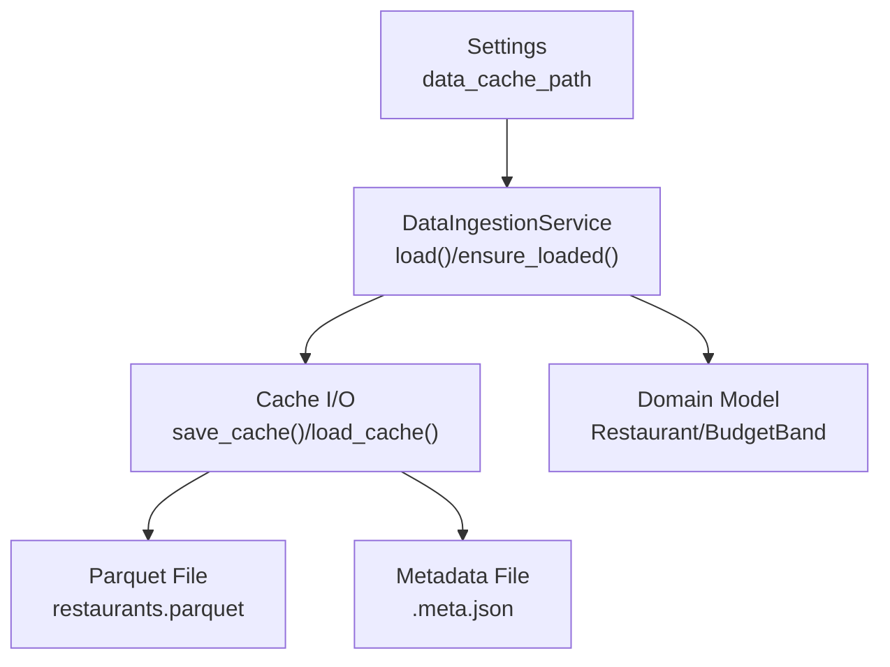
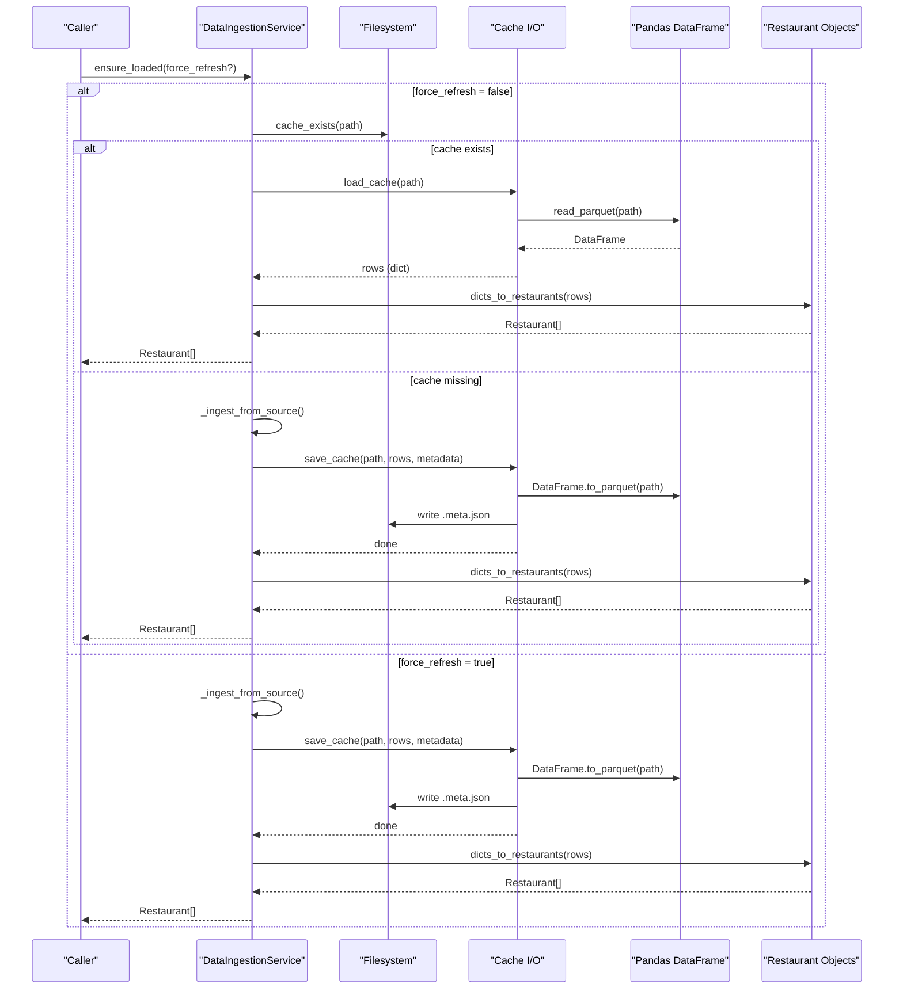
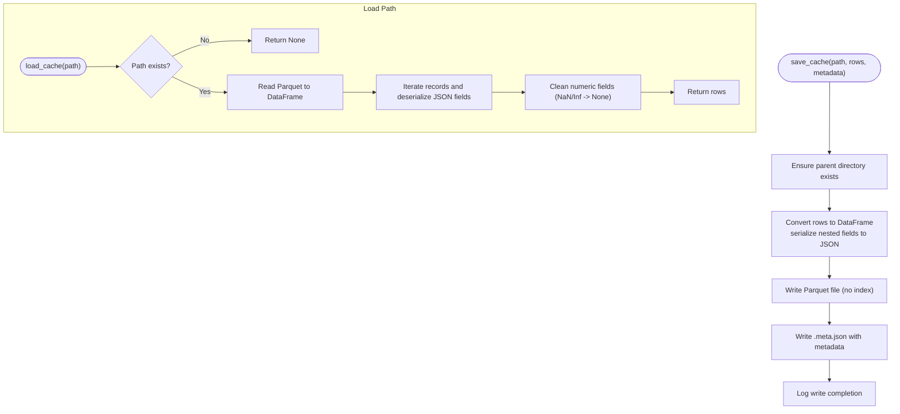
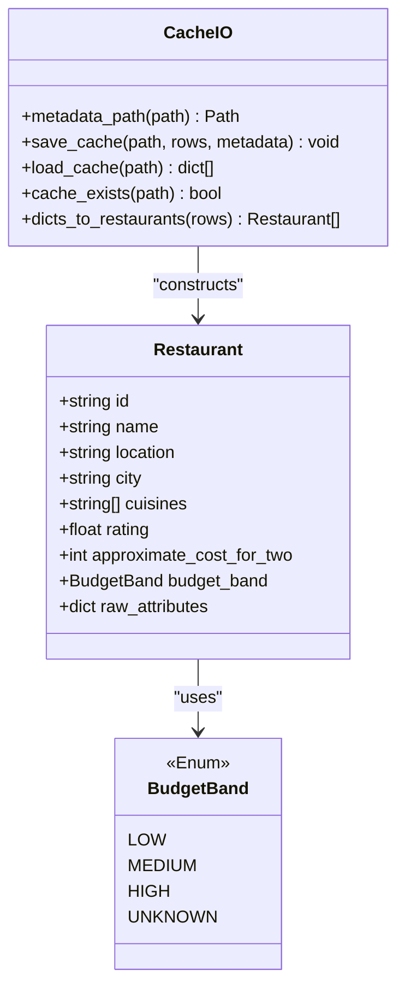
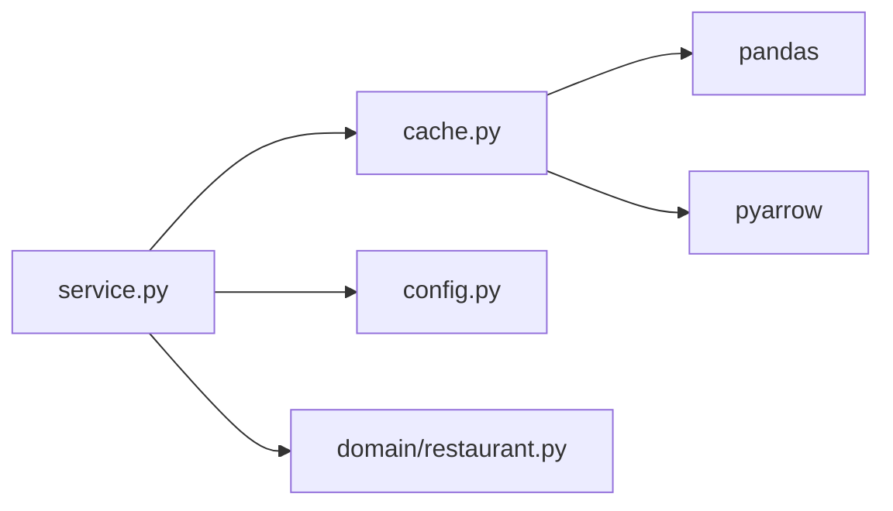

# Data Caching

<cite>
**Referenced Files in This Document**
- [cache.py](file://src/ingestion/cache.py)
- [service.py](file://src/ingestion/service.py)
- [config.py](file://src/config.py)
- [restaurant.py](file://src/domain/restaurant.py)
- [test_cache.py](file://tests/test_cache.py)
- [test_service.py](file://tests/test_service.py)
- [deployment-plan.md](file://docs/deployment-plan.md)
- [edge-cases.md](file://docs/edge-cases.md)
- [requirements.txt](file://requirements.txt)
</cite>

## Table of Contents
1. [Introduction](#introduction)
2. [Project Structure](#project-structure)
3. [Core Components](#core-components)
4. [Architecture Overview](#architecture-overview)
5. [Detailed Component Analysis](#detailed-component-analysis)
6. [Dependency Analysis](#dependency-analysis)
7. [Performance Considerations](#performance-considerations)
8. [Troubleshooting Guide](#troubleshooting-guide)
9. [Conclusion](#conclusion)
10. [Appendices](#appendices)

## Introduction
This document explains the data caching system used for storing processed restaurant datasets. It focuses on how Parquet files are used for persistent cache storage, including file structure, serialization, and metadata management. It also documents cache existence checks, loading procedures, saving behavior, invalidation strategies, refresh mechanisms, performance benefits, file location management, cleanup procedures, troubleshooting, and memory considerations.

## Project Structure
The caching system spans three primary modules:
- Cache I/O and conversion utilities
- Data ingestion service that orchestrates cache usage
- Application configuration that defines cache file locations

**Diagram sources**
- [config.py:54](file://src/config.py#L54)
- [service.py:85-115](file://src/ingestion/service.py#L85-L115)
- [cache.py:58-75](file://src/ingestion/cache.py#L58-L75)
- [restaurant.py:16-26](file://src/domain/restaurant.py#L16-L26)

**Section sources**
- [config.py:54](file://src/config.py#L54)
- [service.py:85-115](file://src/ingestion/service.py#L85-L115)
- [cache.py:58-75](file://src/ingestion/cache.py#L58-L75)
- [restaurant.py:16-26](file://src/domain/restaurant.py#L16-L26)

## Core Components
- Parquet cache writer and reader
- Metadata companion file management
- Cache existence check
- Conversion between DataFrame and dictionaries
- Restaurant domain object construction
- Ingestion service integration and refresh logic

Key responsibilities:
- Persist processed rows to a Parquet file and associated metadata
- Load cached rows efficiently and reconstruct domain objects
- Support forced refresh and cache-first loading
- Maintain metadata for dataset provenance and statistics

**Section sources**
- [cache.py:18-75](file://src/ingestion/cache.py#L18-L75)
- [service.py:85-115](file://src/ingestion/service.py#L85-L115)
- [restaurant.py:16-26](file://src/domain/restaurant.py#L16-L26)

## Architecture Overview
The cache architecture integrates with the ingestion pipeline to avoid repeated downloads and transformations.

**Diagram sources**
- [service.py:85-115](file://src/ingestion/service.py#L85-L115)
- [cache.py:58-75](file://src/ingestion/cache.py#L58-L75)
- [restaurant.py:78-99](file://src/ingestion/cache.py#L78-L99)

## Detailed Component Analysis

### Cache I/O Module
Responsibilities:
- Convert list of row dictionaries to a DataFrame and serialize to Parquet
- Deserialize Parquet back to row dictionaries
- Manage metadata companion file alongside the cache
- Convert numeric fields and handle special values

Implementation highlights:
- Rows containing nested lists or dicts are serialized to JSON strings before DataFrame creation
- Numeric fields are cleaned and coerced to integers where appropriate
- Deserialization loads JSON strings back into Python structures
- Metadata is stored in a sibling file with .meta.json extension

**Diagram sources**
- [cache.py:58-75](file://src/ingestion/cache.py#L58-L75)
- [cache.py:22-55](file://src/ingestion/cache.py#L22-L55)

**Section sources**
- [cache.py:18-75](file://src/ingestion/cache.py#L18-L75)

### Metadata Management
- Metadata companion file: derived from the cache path by replacing the filename extension with .meta.json
- Stored as JSON with human-readable indentation
- Contains dataset identifiers and ingestion statistics

Usage:
- During save: metadata is persisted alongside the cache
- During load: the cache loader does not consume metadata; it is intended for external tooling or future extensions

**Section sources**
- [cache.py:18-20](file://src/ingestion/cache.py#L18-L20)
- [cache.py:58-63](file://src/ingestion/cache.py#L58-L63)

### Cache Existence Checking and Loading
- Existence check: simple file presence verification
- Loading: reads the Parquet file and reconstructs rows with proper types
- On successful load, the ingestion service updates internal state and marks the load as cache-backed

Integration points:
- Used by the ingestion service to decide whether to refresh or reuse cached data

**Section sources**
- [cache.py:74-75](file://src/ingestion/cache.py#L74-L75)
- [service.py:88-104](file://src/ingestion/service.py#L88-L104)

### Cache Saving and Metadata Preservation
- Writes the Parquet file and immediately persists metadata to a sibling .meta.json file
- Ensures parent directories are created before writing
- Logs the number of restaurants written

Version tracking:
- The current implementation stores dataset identifiers and ingestion stats in metadata
- Staleness detection is not implemented in the cache module itself; it is handled by higher-level logic or deployment scripts

**Section sources**
- [cache.py:58-63](file://src/ingestion/cache.py#L58-L63)
- [service.py:107-111](file://src/ingestion/service.py#L107-L111)

### Refresh Mechanisms and Invalidation Strategies
- Force-refresh: ingestion service bypasses cache and re-ingests from source
- Cache-first: ingestion service attempts to load from cache and falls back to refresh if missing
- Invalidation: deletion of the cache file triggers a rebuild on next load
- Staleness: while not enforced by the cache module, deployment documentation outlines strategies to detect dataset version changes and rebuild accordingly

**Section sources**
- [service.py:80-115](file://src/ingestion/service.py#L80-L115)
- [edge-cases.md:60](file://docs/edge-cases.md#L60)
- [deployment-plan.md:403-428](file://docs/deployment-plan.md#L403-L428)

### Cache File Location Management
- Default cache path is configured via Settings and defaults to a Parquet file under data/cache
- Tests demonstrate overriding the cache path for isolated runs

**Section sources**
- [config.py:54](file://src/config.py#L54)
- [test_service.py:27-28](file://tests/test_service.py#L27-L28)

### Cleanup Procedures
- Manual cleanup: delete the Parquet file and/or the metadata file to invalidate the cache
- Automatic rebuild: missing cache triggers a refresh on next load
- Deployment-specific guidance: on ephemeral filesystems, the cache is rebuilt on startup if missing

**Section sources**
- [edge-cases.md:59](file://docs/edge-cases.md#L59)
- [deployment-plan.md:403-428](file://docs/deployment-plan.md#L403-L428)

### Data Models and Serialization
- Domain model: Restaurant with typed fields including budget band enumeration
- Conversion: rows are transformed to/from dictionaries for DataFrame I/O and then mapped to domain objects

**Diagram sources**
- [restaurant.py:9-26](file://src/domain/restaurant.py#L9-L26)
- [cache.py:78-99](file://src/ingestion/cache.py#L78-L99)

**Section sources**
- [restaurant.py:9-26](file://src/domain/restaurant.py#L9-L26)
- [cache.py:78-99](file://src/ingestion/cache.py#L78-L99)

## Dependency Analysis
External dependencies relevant to caching:
- pandas: DataFrame creation and Parquet I/O
- pyarrow: Parquet engine/runtime
- numpy: numerical operations and type conversions

**Diagram sources**
- [requirements.txt:1-5](file://requirements.txt#L1-L5)
- [cache.py:11](file://src/ingestion/cache.py#L11)
- [service.py:10-17](file://src/ingestion/service.py#L10-L17)

**Section sources**
- [requirements.txt:1-5](file://requirements.txt#L1-L5)
- [cache.py:11](file://src/ingestion/cache.py#L11)
- [service.py:10-17](file://src/ingestion/service.py#L10-L17)

## Performance Considerations
- Parquet advantages: columnar storage, efficient compression, fast read paths
- Serialization overhead: JSON serialization for nested structures prior to DataFrame creation
- Memory footprint: loading entire dataset into memory as a DataFrame; consider chunking or streaming for very large datasets
- CPU cost: JSON serialization/deserialization and numeric cleaning; minimal compared to network/download and validation steps
- I/O locality: keeping cache and metadata close improves load performance

[No sources needed since this section provides general guidance]

## Troubleshooting Guide
Common issues and resolutions:
- Cache file missing: triggers a rebuild on next load; on ephemeral environments, ensure startup logic forces refresh when the cache is absent
- Corrupted cache: delete the cache file to rebuild; the system will re-ingest from source
- Disk full during write: the ingestion service writes cache synchronously; handle storage capacity or switch to in-memory mode if supported by your deployment
- Stale cache: implement version checks externally (e.g., dataset revision comparison) and force refresh when mismatched
- NaN/Inf in numeric fields: numeric cleaning converts invalid values to None; verify data quality upstream

Operational references:
- Ephemeral filesystem behavior and startup rebuild pattern
- Staleness detection and version mismatch handling
- Disk-full scenario and fallback behavior

**Section sources**
- [deployment-plan.md:403-428](file://docs/deployment-plan.md#L403-L428)
- [edge-cases.md:59-60](file://docs/edge-cases.md#L59-L60)
- [edge-cases.md:60](file://docs/edge-cases.md#L60)
- [edge-cases.md:66](file://docs/edge-cases.md#L66)

## Conclusion
The caching subsystem provides a robust, Parquet-backed persistence layer for processed restaurant data. It offers fast, deterministic loads, straightforward invalidation, and extensible metadata support. While the cache module itself does not enforce staleness, the ingestion service and deployment documentation outline practical strategies to maintain freshness and reliability across diverse environments.

[No sources needed since this section summarizes without analyzing specific files]

## Appendices

### API Summary
- Save cache: writes Parquet and metadata
- Load cache: reads Parquet and reconstructs rows
- Cache exists: checks file presence
- Convert dicts to restaurants: constructs typed domain objects

**Section sources**
- [cache.py:58-75](file://src/ingestion/cache.py#L58-L75)
- [cache.py:78-99](file://src/ingestion/cache.py#L78-L99)

### Tests Highlights
- Round-trip validation: save/load preserves data shape and types
- NaN handling: numeric cleaning maps invalid values to None
- Cache-first behavior: second load from cache with stats indicating cache origin

**Section sources**
- [test_cache.py:8-24](file://tests/test_cache.py#L8-L24)
- [test_cache.py:26-34](file://tests/test_cache.py#L26-L34)
- [test_service.py:26-46](file://tests/test_service.py#L26-L46)