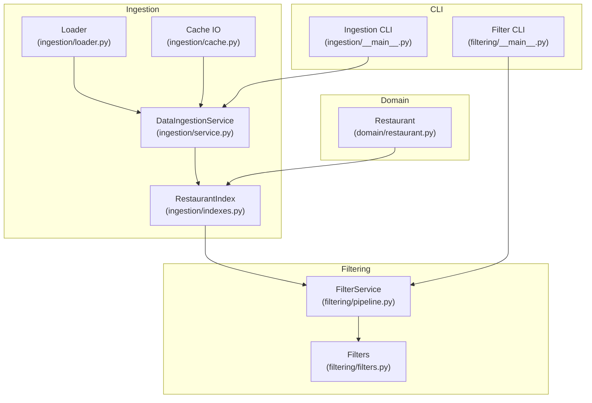
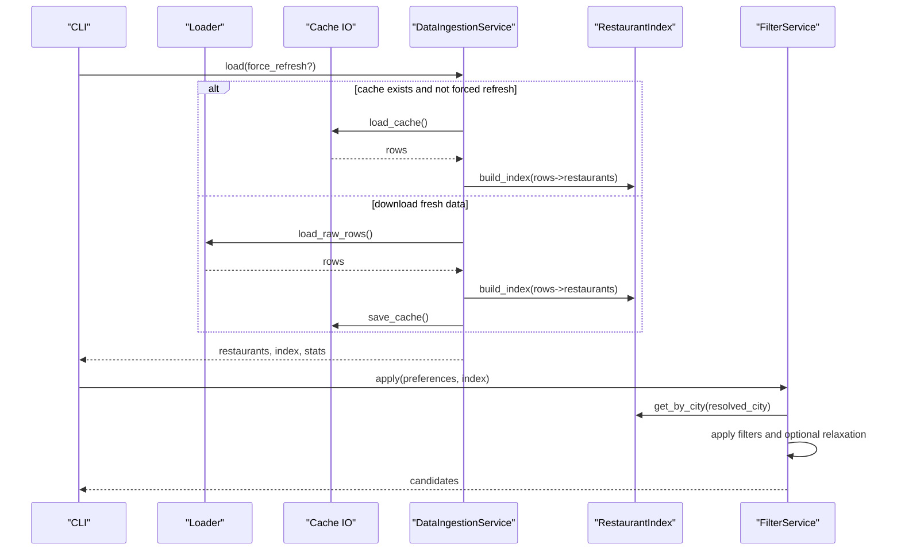
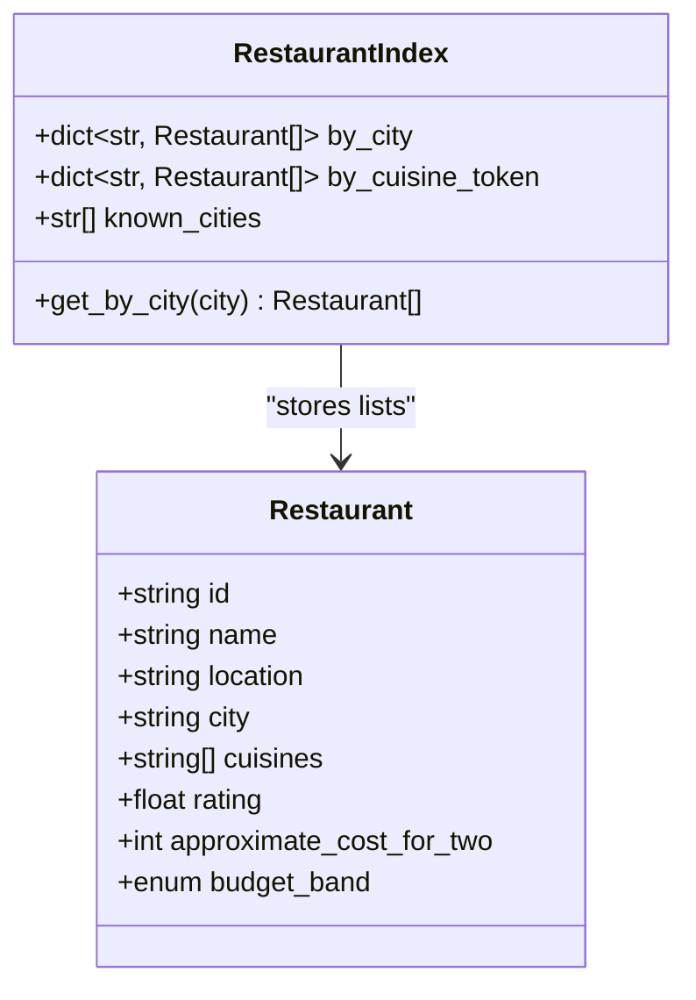
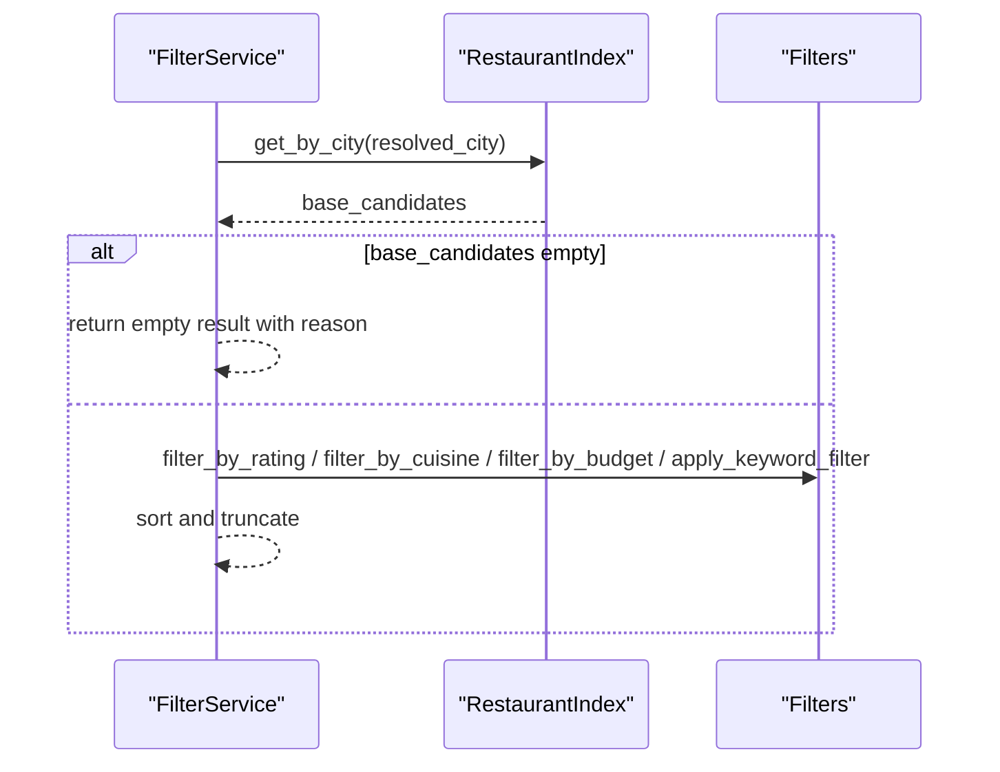
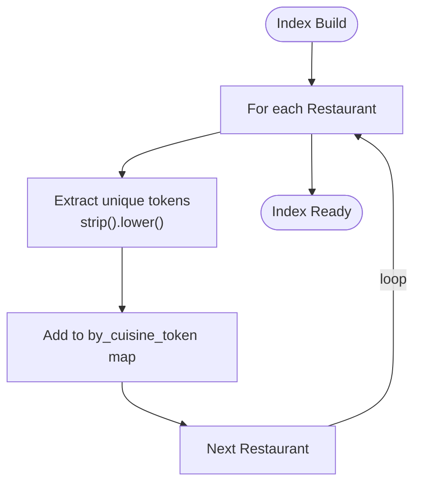
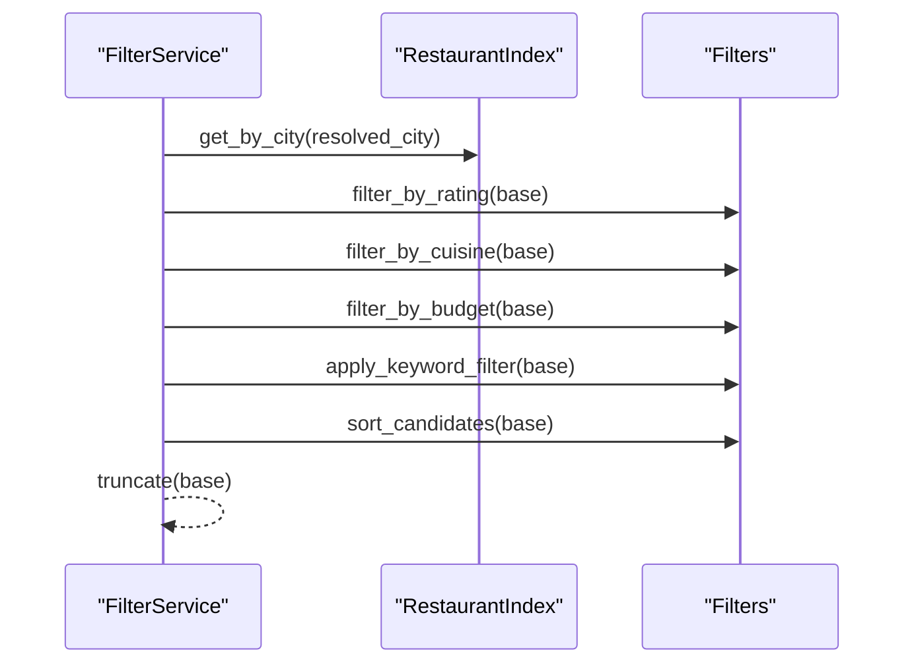
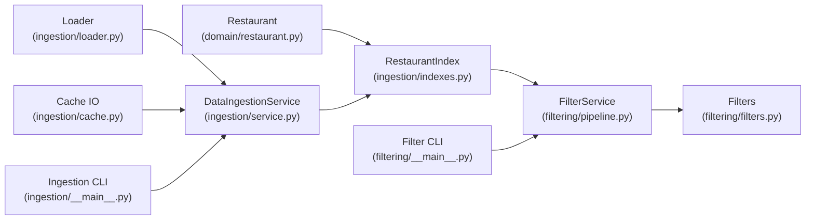

# Data Indexing

<cite>
**Referenced Files in This Document**
- [indexes.py](file://src/ingestion/indexes.py)
- [restaurant.py](file://src/domain/restaurant.py)
- [service.py](file://src/ingestion/service.py)
- [pipeline.py](file://src/filtering/pipeline.py)
- [filters.py](file://src/filtering/filters.py)
- [cache.py](file://src/ingestion/cache.py)
- [loader.py](file://src/ingestion/loader.py)
- [__main__.py (ingestion)](file://src/ingestion/__main__.py)
- [__main__.py (filtering)](file://src/filtering/__main__.py)
- [test_indexes.py](file://tests/test_indexes.py)
- [config.py](file://src/config.py)
</cite>

## Table of Contents
1. [Introduction](#introduction)
2. [Project Structure](#project-structure)
3. [Core Components](#core-components)
4. [Architecture Overview](#architecture-overview)
5. [Detailed Component Analysis](#detailed-component-analysis)
6. [Dependency Analysis](#dependency-analysis)
7. [Performance Considerations](#performance-considerations)
8. [Troubleshooting Guide](#troubleshooting-guide)
9. [Conclusion](#conclusion)

## Introduction
This document describes the data indexing system used to accelerate location-aware and cuisine-focused queries over restaurant collections. It focuses on the RestaurantIndex structure, the index-building process, and how the index is used by the filtering pipeline. It also covers city-based indexing, cuisine token indexing, known cities tracking, performance characteristics, query optimization, memory usage considerations, and index maintenance and consistency guarantees.

## Project Structure
The indexing system spans ingestion, domain modeling, filtering, caching, and CLI entry points:
- Domain model defines the Restaurant entity.
- Ingestion builds in-memory indexes from loaded restaurants.
- Filtering consumes the index to support fast city-based and cuisine-based selection.
- Caching persists preprocessed data to avoid repeated computation.
- CLI tools demonstrate loading, indexing, and filtering workflows.

**Diagram sources**
- [loader.py:11-28](file://src/ingestion/loader.py#L11-L28)
- [cache.py:58-71](file://src/ingestion/cache.py#L58-L71)
- [service.py:85-161](file://src/ingestion/service.py#L85-L161)
- [indexes.py:21-46](file://src/ingestion/indexes.py#L21-L46)
- [restaurant.py:16-25](file://src/domain/restaurant.py#L16-L25)
- [pipeline.py:42-103](file://src/filtering/pipeline.py#L42-L103)
- [filters.py:27-125](file://src/filtering/filters.py#L27-L125)
- [__main__.py (ingestion):17-55](file://src/ingestion/__main__.py#L17-L55)
- [__main__.py (filtering):20-72](file://src/filtering/__main__.py#L20-L72)

**Section sources**
- [indexes.py:11-46](file://src/ingestion/indexes.py#L11-L46)
- [service.py:62-161](file://src/ingestion/service.py#L62-L161)
- [pipeline.py:31-103](file://src/filtering/pipeline.py#L31-L103)
- [filters.py:27-125](file://src/filtering/filters.py#L27-L125)
- [cache.py:58-71](file://src/ingestion/cache.py#L58-L71)
- [loader.py:11-28](file://src/ingestion/loader.py#L11-L28)
- [__main__.py (ingestion):17-55](file://src/ingestion/__main__.py#L17-L55)
- [__main__.py (filtering):20-72](file://src/filtering/__main__.py#L20-L72)

## Core Components
- RestaurantIndex: In-memory index container with:
  - by_city: dictionary mapping city/location names to lists of restaurants.
  - by_cuisine_token: dictionary mapping normalized cuisine tokens to lists of restaurants.
  - known_cities: alphabetically sorted list of known city/location keys.
  - get_by_city(city): O(1) lookup returning restaurants for a given city/location key.

- build_index(restaurants): Constructs RestaurantIndex from a collection of Restaurant objects:
  - Populates by_city from restaurant.city and restaurant.location (excluding duplicates).
  - Populates by_cuisine_token from unique, lowercased cuisine tokens per restaurant.
  - Builds known_cities from by_city keys and sorts them case-insensitively.

- DataIngestionService: Orchestrates loading, normalization, validation, budget assignment, and index creation. Applies the index to the loaded dataset and exposes it via the index property.

- FilterService: Uses RestaurantIndex to quickly obtain a city-filtered base set and applies subsequent filters (rating, cuisine, budget, keywords) deterministically, with optional relaxation.

**Section sources**
- [indexes.py:11-46](file://src/ingestion/indexes.py#L11-L46)
- [service.py:117-125](file://src/ingestion/service.py#L117-L125)
- [pipeline.py:42-103](file://src/filtering/pipeline.py#L42-L103)

## Architecture Overview
The indexing architecture integrates ingestion, caching, and filtering:

**Diagram sources**
- [service.py:85-161](file://src/ingestion/service.py#L85-L161)
- [loader.py:11-28](file://src/ingestion/loader.py#L11-L28)
- [cache.py:58-71](file://src/ingestion/cache.py#L58-L71)
- [indexes.py:21-46](file://src/ingestion/indexes.py#L21-L46)
- [pipeline.py:42-103](file://src/filtering/pipeline.py#L42-L103)

## Detailed Component Analysis

### RestaurantIndex and Index Building
RestaurantIndex encapsulates three primary data structures:
- by_city: dictionary mapping city/location keys to lists of Restaurant instances. Keys are normalized city/location strings present in the dataset.
- by_cuisine_token: dictionary mapping unique, lowercase, whitespace-stripped cuisine tokens to lists of Restaurant instances. Duplicate tokens per restaurant are deduplicated to keep index compact.
- known_cities: sorted list of city/location keys for UI suggestions and diagnostics.

Index construction:
- Iterates over restaurants once to populate by_city and by_cuisine_token.
- Skips empty or whitespace-only city/location/cuisine entries.
- Deduplicates cuisines per restaurant to avoid redundant index entries.
- Sorts known_cities case-insensitively for stable presentation.

**Diagram sources**
- [indexes.py:11-18](file://src/ingestion/indexes.py#L11-L18)
- [restaurant.py:16-25](file://src/domain/restaurant.py#L16-L25)

**Section sources**
- [indexes.py:21-46](file://src/ingestion/indexes.py#L21-L46)
- [test_indexes.py:5-35](file://tests/test_indexes.py#L5-L35)

### City-Based Indexing Mechanism
City-based indexing enables O(1) retrieval of restaurants for a resolved city/location key:
- get_by_city(city) returns the list stored under the exact normalized key.
- During index building, both restaurant.city and restaurant.location are indexed, but location is excluded if it matches the city key (case-insensitive) to prevent duplication.

Integration with filtering:
- FilterService resolves the user’s city preference and retrieves the base candidate list via index.get_by_city(resolved_city).
- If no candidates are found, a structured empty reason is returned.

**Diagram sources**
- [pipeline.py:55-66](file://src/filtering/pipeline.py#L55-L66)
- [pipeline.py:105-129](file://src/filtering/pipeline.py#L105-L129)
- [filters.py:27-125](file://src/filtering/filters.py#L27-L125)
- [indexes.py:17-18](file://src/ingestion/indexes.py#L17-L18)

**Section sources**
- [indexes.py:25-32](file://src/ingestion/indexes.py#L25-L32)
- [pipeline.py:55-66](file://src/filtering/pipeline.py#L55-L66)

### Cuisine Token Extraction and Indexing
Cuisine indexing supports flexible food-type searches:
- Tokens are derived from restaurant.cuisines by stripping whitespace and converting to lowercase.
- Duplicate tokens per restaurant are deduplicated to minimize index size.
- The resulting by_cuisine_token map allows quick lookup of restaurants matching any target token(s).

Filtering behavior:
- The pipeline’s cuisine filter parses comma/slash-separated tokens and checks whether any token appears in the concatenated cuisines of each restaurant.

**Diagram sources**
- [indexes.py:34-39](file://src/ingestion/indexes.py#L34-L39)
- [filters.py:41-56](file://src/filtering/filters.py#L41-L56)

**Section sources**
- [indexes.py:34-39](file://src/ingestion/indexes.py#L34-L39)
- [filters.py:41-56](file://src/filtering/filters.py#L41-L56)

### Known Cities Tracking
Known cities are tracked for:
- UI suggestions and diagnostics.
- Stable alphabetical ordering (case-insensitive) for consistent presentation.

The list is built from by_city keys after index construction and exposed via RestaurantIndex.known_cities.

**Section sources**
- [indexes.py:41-46](file://src/ingestion/indexes.py#L41-L46)

### Index Usage in Filtering Pipeline
FilterService uses the index to:
- Obtain a city-filtered base set via index.get_by_city(resolved_city).
- Apply deterministic filters: rating threshold, cuisine tokens, budget bands, and keyword soft filter.
- Optionally relax filters to meet minimum candidate thresholds, recording the steps taken.

**Diagram sources**
- [pipeline.py:105-129](file://src/filtering/pipeline.py#L105-L129)
- [filters.py:37-125](file://src/filtering/filters.py#L37-L125)

**Section sources**
- [pipeline.py:42-103](file://src/filtering/pipeline.py#L42-L103)

## Dependency Analysis
Key dependencies and interactions:
- RestaurantIndex depends on Restaurant domain model.
- DataIngestionService constructs the index from normalized rows and exposes it.
- FilterService consumes the index and applies filters.
- Cache and Loader support persistent storage and streaming ingestion.
- CLI tools integrate ingestion and filtering flows.

**Diagram sources**
- [restaurant.py:16-25](file://src/domain/restaurant.py#L16-L25)
- [indexes.py:11-46](file://src/ingestion/indexes.py#L11-L46)
- [service.py:85-161](file://src/ingestion/service.py#L85-L161)
- [filters.py:27-125](file://src/filtering/filters.py#L27-L125)
- [cache.py:58-71](file://src/ingestion/cache.py#L58-L71)
- [loader.py:11-28](file://src/ingestion/loader.py#L11-L28)
- [__main__.py (ingestion):17-55](file://src/ingestion/__main__.py#L17-L55)
- [__main__.py (filtering):20-72](file://src/filtering/__main__.py#L20-L72)

**Section sources**
- [service.py:85-161](file://src/ingestion/service.py#L85-L161)
- [pipeline.py:42-103](file://src/filtering/pipeline.py#L42-L103)

## Performance Considerations
- Index construction complexity:
  - Time: O(N + T) where N is the number of restaurants and T is the total number of unique cuisine tokens across all restaurants.
  - Space: O(N + U) where U is the number of unique city/location keys and tokens stored in the index.
- City-based retrieval:
  - Lookup is O(1) average-case hash map access.
- Cuisine-based retrieval:
  - Tokenization is linear in the number of cuisines per restaurant; lookup is O(k) per restaurant for checking membership against target tokens.
- Sorting and post-processing:
  - Sorting candidates by rating and cost-fit is O(M log M) where M is the number of candidates after filtering.
- Memory usage:
  - Index stores pointers to Restaurant objects; memory scales with dataset size and number of unique keys/tokens.
  - known_cities list adds minimal overhead proportional to unique locations.
- Throughput:
  - The ingestion pipeline streams rows from Hugging Face and writes to Parquet cache, enabling fast subsequent loads.
- Latency targets:
  - The pipeline logs warnings when processing exceeds a target threshold, indicating room for tuning.

[No sources needed since this section provides general guidance]

## Troubleshooting Guide
Common issues and resolutions:
- Empty city results:
  - Symptom: No candidates returned for a resolved city.
  - Cause: City/location key mismatch or missing in index.
  - Action: Verify city normalization and ensure the key exists in known_cities; check index.get_by_city behavior.
- Missing cuisine matches:
  - Symptom: Cuisine filter yields no results.
  - Cause: Tokenization differences or case sensitivity.
  - Action: Confirm tokens are lowercase and deduplicated; verify target tokens align with dataset cuisines.
- Slow filtering:
  - Symptom: Pipeline exceeds latency targets.
  - Action: Reduce max_candidates, pre-filter by city, or adjust relaxation thresholds.
- Cache inconsistencies:
  - Symptom: Outdated index after updates.
  - Action: Use --refresh flag in ingestion CLI to bypass cache and rebuild index.
- Known cities list discrepancies:
  - Symptom: City suggestions missing or incorrect.
  - Action: Rebuild index after ingestion; confirm known_cities sorting and deduplication.

**Section sources**
- [pipeline.py:88-89](file://src/filtering/pipeline.py#L88-L89)
- [__main__.py (ingestion):20-23](file://src/ingestion/__main__.py#L20-L23)
- [indexes.py:41-46](file://src/ingestion/indexes.py#L41-L46)

## Conclusion
The indexing system provides efficient, deterministic filtering over restaurant data by leveraging:
- Fast O(1) city-based retrieval via RestaurantIndex.by_city.
- Compact cuisine-token indexing via RestaurantIndex.by_cuisine_token.
- Known cities tracking for UI and diagnostics.
- A robust ingestion pipeline that caches processed data and rebuilds indexes consistently.

Together, these components enable responsive, location-aware, and cuisine-focused search experiences with predictable performance and maintainable update workflows.