# Data Ingestion

<cite>
**Referenced Files in This Document**
- [__main__.py](file://src/ingestion/__main__.py)
- [load.py](file://src/ingestion/load.py)
- [service.py](file://src/ingestion/service.py)
- [loader.py](file://src/ingestion/loader.py)
- [cache.py](file://src/ingestion/cache.py)
- [normalizer.py](file://src/ingestion/normalizer.py)
- [validator.py](file://src/ingestion/validator.py)
- [budget.py](file://src/ingestion/budget.py)
- [indexes.py](file://src/ingestion/indexes.py)
- [cities.py](file://src/ingestion/cities.py)
- [config.py](file://src/config.py)
- [restaurant.py](file://src/domain/restaurant.py)
- [architecture.md](file://docs/architecture.md)
- [README.md](file://README.md)
</cite>

## Table of Contents
1. [Introduction](#introduction)
2. [Project Structure](#project-structure)
3. [Core Components](#core-components)
4. [Architecture Overview](#architecture-overview)
5. [Detailed Component Analysis](#detailed-component-analysis)
6. [Dependency Analysis](#dependency-analysis)
7. [Performance Considerations](#performance-considerations)
8. [Troubleshooting Guide](#troubleshooting-guide)
9. [Conclusion](#conclusion)

## Introduction
This document explains the data ingestion subsystem responsible for loading, transforming, validating, enriching, and caching the Zomato restaurant dataset from Hugging Face. It covers:
- Hugging Face dataset loading and streaming
- Raw data processing, normalization, and validation
- Budget band assignment and city normalization
- Statistics tracking (raw, valid, dropped counts, distributions)
- Lifecycle from initialization to completion, including cache checks and fallback
- Error handling, retry strategies, and performance considerations for large datasets

## Project Structure
The ingestion subsystem resides under src/ingestion and integrates with configuration, domain models, and caching utilities. The CLI entry point drives the ingestion lifecycle.

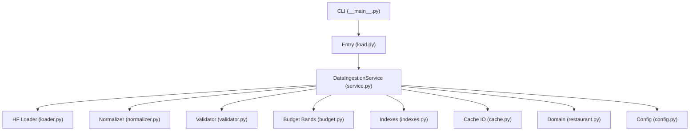

**Diagram sources**
- [__main__.py:17-55](file://src/ingestion/__main__.py#L17-L55)
- [load.py:3-6](file://src/ingestion/load.py#L3-L6)
- [service.py:62-161](file://src/ingestion/service.py#L62-L161)
- [loader.py:11-28](file://src/ingestion/loader.py#L11-L28)
- [normalizer.py:67-98](file://src/ingestion/normalizer.py#L67-L98)
- [validator.py:63-77](file://src/ingestion/validator.py#L63-L77)
- [budget.py:19-83](file://src/ingestion/budget.py#L19-L83)
- [indexes.py:21-47](file://src/ingestion/indexes.py#L21-L47)
- [cache.py:58-99](file://src/ingestion/cache.py#L58-L99)
- [restaurant.py:16-26](file://src/domain/restaurant.py#L16-L26)
- [config.py:46-81](file://src/config.py#L46-L81)

**Section sources**
- [__main__.py:17-55](file://src/ingestion/__main__.py#L17-L55)
- [load.py:3-6](file://src/ingestion/load.py#L3-L6)
- [service.py:62-161](file://src/ingestion/service.py#L62-L161)
- [config.py:46-81](file://src/config.py#L46-L81)

## Core Components
- DataIngestionService orchestrates the ingestion lifecycle, coordinates cache checks, and builds indexes.
- Loader streams rows from Hugging Face using the datasets library.
- Normalizer maps raw fields to canonical schema and extracts city/location.
- Validator enforces required fields and rating bounds.
- Budget assigns budget bands via global/per-city percentiles.
- Indexes builds in-memory lookup structures for city and cuisine tokens.
- Cache persists processed data to Parquet with metadata.
- Config supplies dataset ID, cache path, and runtime settings.

**Section sources**
- [service.py:62-161](file://src/ingestion/service.py#L62-L161)
- [loader.py:11-28](file://src/ingestion/loader.py#L11-L28)
- [normalizer.py:67-98](file://src/ingestion/normalizer.py#L67-L98)
- [validator.py:12-77](file://src/ingestion/validator.py#L12-L77)
- [budget.py:19-83](file://src/ingestion/budget.py#L19-L83)
- [indexes.py:11-47](file://src/ingestion/indexes.py#L11-L47)
- [cache.py:58-99](file://src/ingestion/cache.py#L58-L99)
- [config.py:46-81](file://src/config.py#L46-L81)

## Architecture Overview
The ingestion pipeline transforms raw Hugging Face rows into typed Restaurant objects, computes budget bands, and caches the result for subsequent fast loads.

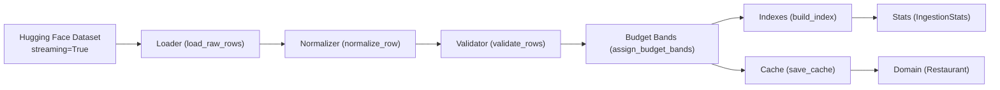

**Diagram sources**
- [loader.py:11-28](file://src/ingestion/loader.py#L11-L28)
- [normalizer.py:67-98](file://src/ingestion/normalizer.py#L67-L98)
- [validator.py:63-77](file://src/ingestion/validator.py#L63-L77)
- [budget.py:19-83](file://src/ingestion/budget.py#L19-L83)
- [indexes.py:21-47](file://src/ingestion/indexes.py#L21-L47)
- [cache.py:58-99](file://src/ingestion/cache.py#L58-L99)
- [restaurant.py:16-26](file://src/domain/restaurant.py#L16-L26)
- [service.py:127-161](file://src/ingestion/service.py#L127-L161)

## Detailed Component Analysis

### Hugging Face Dataset Loading Mechanism
- Streaming: Rows are streamed from the configured dataset ID with streaming enabled for memory efficiency.
- Access pattern: The loader yields dictionaries lazily, enabling incremental processing.
- Dataset ID configuration: Controlled by Settings.hf_dataset_id.

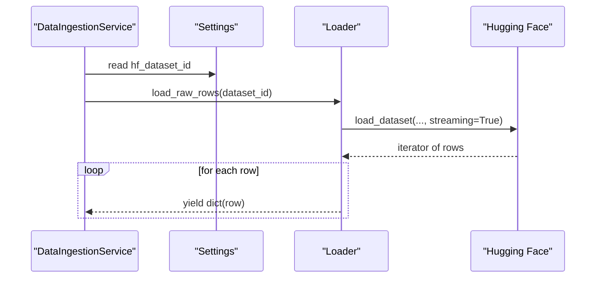

**Diagram sources**
- [service.py:85-115](file://src/ingestion/service.py#L85-L115)
- [loader.py:11-18](file://src/ingestion/loader.py#L11-L18)
- [config.py:53](file://src/config.py#L53)

**Section sources**
- [loader.py:11-18](file://src/ingestion/loader.py#L11-L18)
- [config.py:53](file://src/config.py#L53)
- [service.py:85-115](file://src/ingestion/service.py#L85-L115)

### Raw Data Loading, Iterator, and Streaming
- Iterator implementation: load_raw_rows returns a generator that iterates over the HF dataset.
- Materialization helper: load_raw_rows_list collects rows into a list (useful for tests with limits).
- Streaming capability: streaming=True ensures memory usage remains bounded for large datasets.

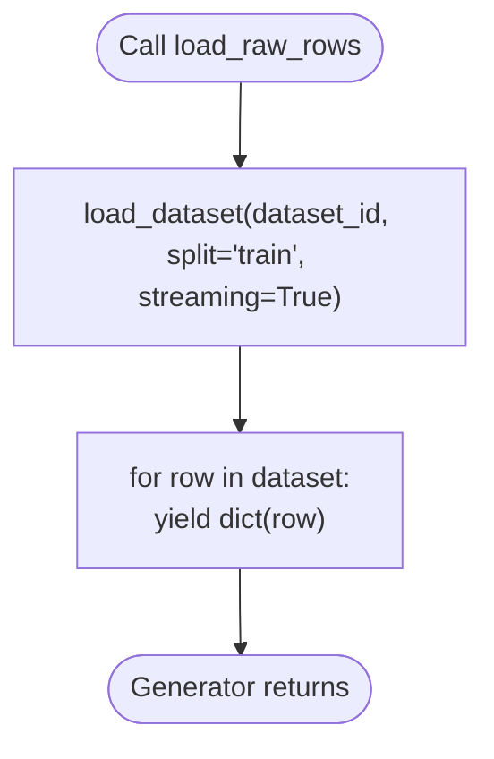

**Diagram sources**
- [loader.py:11-18](file://src/ingestion/loader.py#L11-L18)

**Section sources**
- [loader.py:11-28](file://src/ingestion/loader.py#L11-L28)

### Normalization and City Extraction
- Normalization: Converts raw fields to canonical schema, including name, location, city, cuisines, rating, and cost.
- City extraction: Uses address parsing and city alias normalization to derive a known city.
- ID generation: Creates a stable hash-based identifier from name, city, location, and row index.

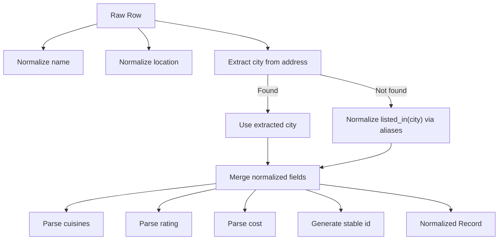

**Diagram sources**
- [normalizer.py:67-98](file://src/ingestion/normalizer.py#L67-L98)
- [cities.py:66-91](file://src/ingestion/cities.py#L66-L91)

**Section sources**
- [normalizer.py:67-98](file://src/ingestion/normalizer.py#L67-L98)
- [cities.py:51-91](file://src/ingestion/cities.py#L51-L91)

### Validation and Statistics Tracking
- Validation rules: Drops records missing required fields or with invalid ratings.
- Statistics: Tracks raw, valid, and dropped counts, plus breakdowns by reason and invalid rating types.
- Post-validation: Updates ingestion stats with computed totals.

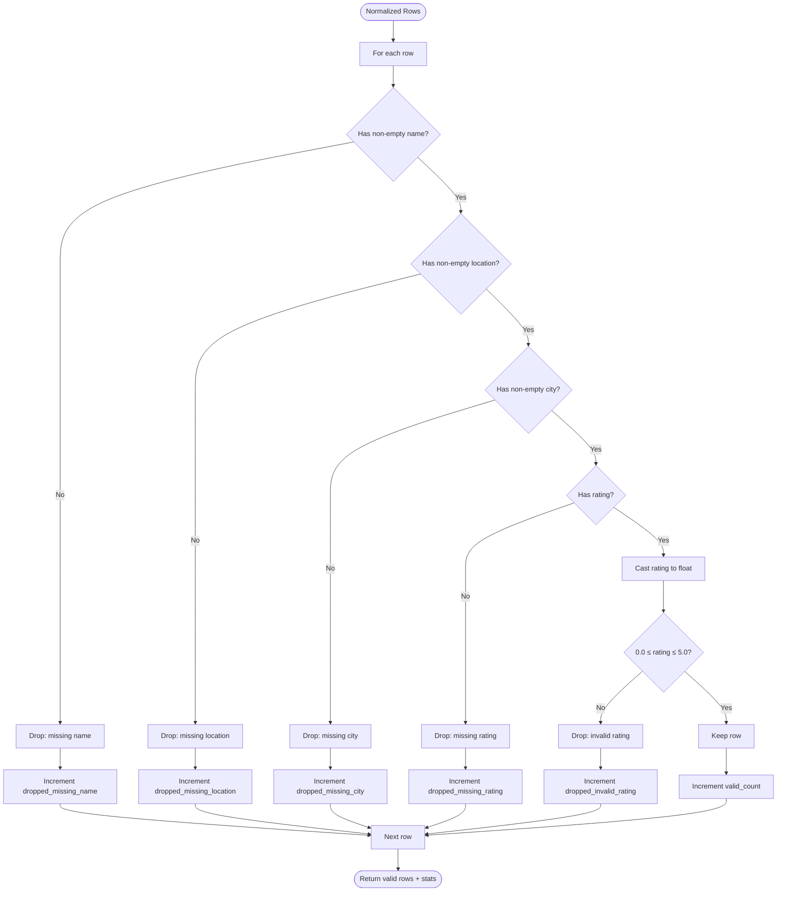

**Diagram sources**
- [validator.py:27-60](file://src/ingestion/validator.py#L27-L60)

**Section sources**
- [validator.py:12-77](file://src/ingestion/validator.py#L12-L77)
- [service.py:145-151](file://src/ingestion/service.py#L145-L151)

### Budget Band Assignment and Distribution
- Percentiles: Computes global and per-city cost percentiles (P33, P66) when sufficient samples exist.
- Band assignment: Assigns LOW/MEDIUM/HIGH bands based on thresholds; UNKNOWN otherwise.
- Distribution: Aggregates counts per band for reporting.

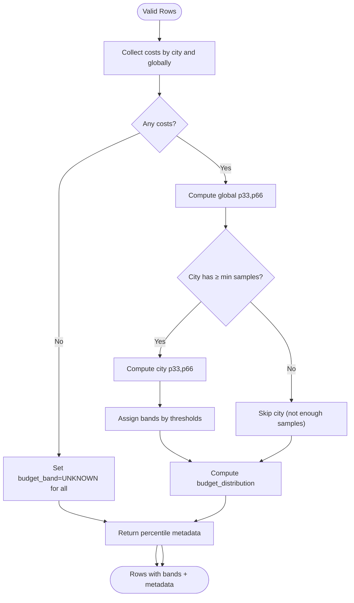

**Diagram sources**
- [budget.py:19-83](file://src/ingestion/budget.py#L19-L83)

**Section sources**
- [budget.py:19-83](file://src/ingestion/budget.py#L19-L83)
- [service.py:142-151](file://src/ingestion/service.py#L142-L151)

### Index Building and Query Support
- Index structure: Builds city and cuisine-token indexes for efficient filtering.
- Known cities: Maintains a sorted list of known cities for UI and stats.

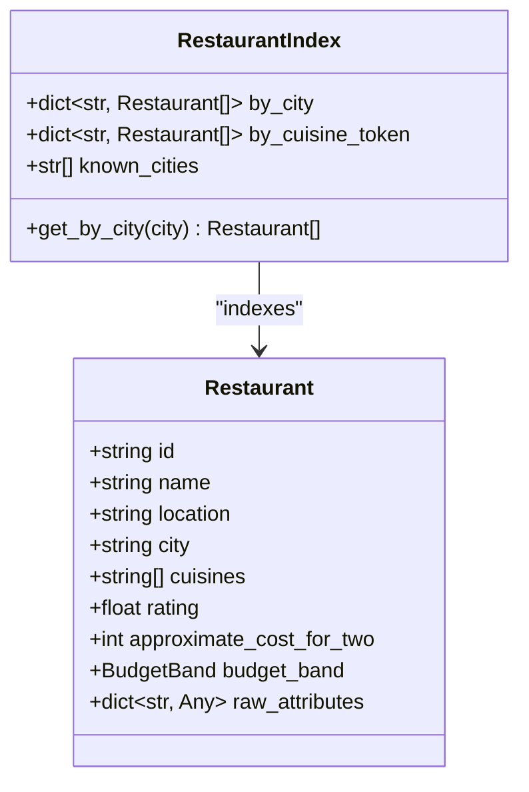

**Diagram sources**
- [indexes.py:11-47](file://src/ingestion/indexes.py#L11-L47)
- [restaurant.py:16-26](file://src/domain/restaurant.py#L16-L26)

**Section sources**
- [indexes.py:21-47](file://src/ingestion/indexes.py#L21-L47)
- [restaurant.py:16-26](file://src/domain/restaurant.py#L16-L26)

### Cache Persistence and Retrieval
- Save: Converts rows to DataFrame, serializes to Parquet, and writes metadata JSON.
- Load: Reads Parquet and reconstructs rows, restoring JSON-encoded fields.
- Existence check: Determines whether to bypass HF download.

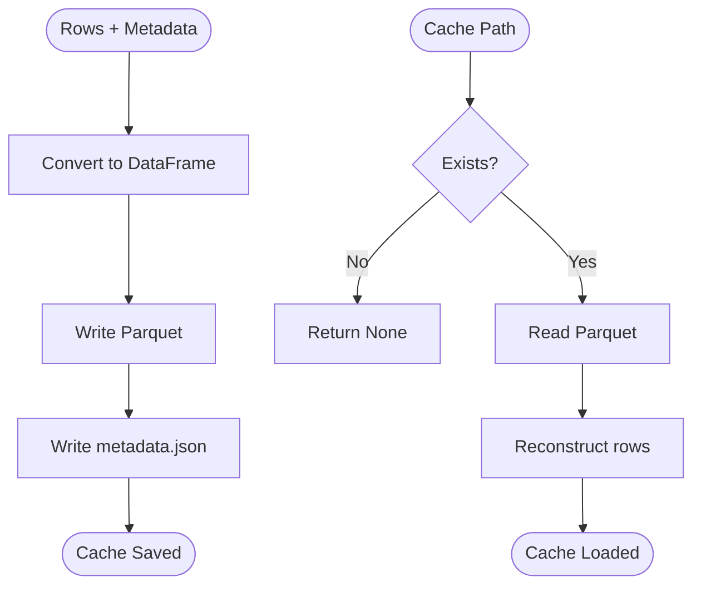

**Diagram sources**
- [cache.py:58-76](file://src/ingestion/cache.py#L58-L76)

**Section sources**
- [cache.py:58-99](file://src/ingestion/cache.py#L58-L99)

### Ingestion Lifecycle: Initialization to Completion
- CLI entry: Parses arguments for refresh and sampling, initializes service, and prints stats.
- Service load: Checks cache; if absent or refresh forced, downloads from HF, processes, saves cache, and builds indexes.
- Stats propagation: Aggregates ingestion stats and passes them to the caller.

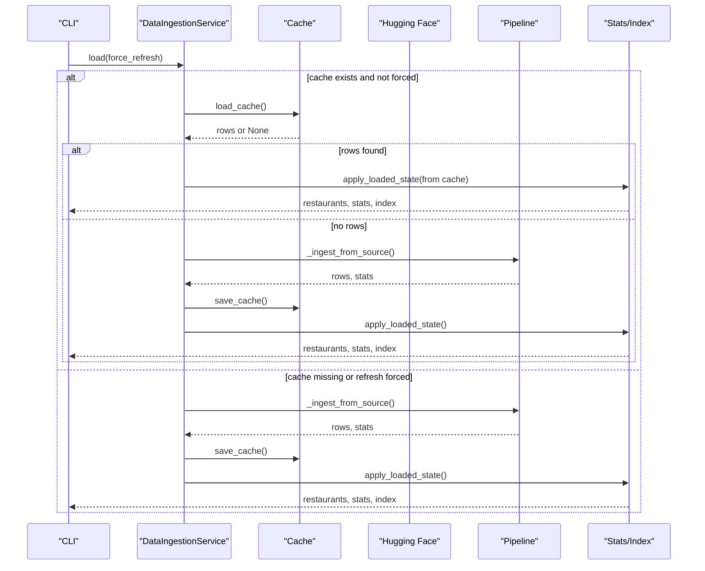

**Diagram sources**
- [__main__.py:32-55](file://src/ingestion/__main__.py#L32-L55)
- [service.py:85-115](file://src/ingestion/service.py#L85-L115)
- [service.py:127-161](file://src/ingestion/service.py#L127-L161)
- [cache.py:66-76](file://src/ingestion/cache.py#L66-L76)

**Section sources**
- [__main__.py:17-55](file://src/ingestion/__main__.py#L17-L55)
- [service.py:80-115](file://src/ingestion/service.py#L80-L115)
- [service.py:127-161](file://src/ingestion/service.py#L127-L161)

### Configuration and Access Patterns
- Dataset ID: Manages the HF dataset identifier used for loading.
- Cache path: Defines the Parquet cache location.
- Runtime settings: Controls minimum city samples for percentile computation and other ingestion parameters.

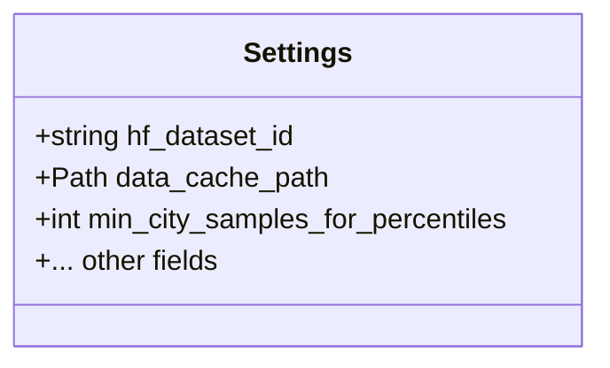

**Diagram sources**
- [config.py:46-81](file://src/config.py#L46-L81)

**Section sources**
- [config.py:53-54](file://src/config.py#L53-L54)
- [config.py:71](file://src/config.py#L71)
- [service.py:85-115](file://src/ingestion/service.py#L85-L115)

## Dependency Analysis
The ingestion service composes multiple modules with clear boundaries and minimal coupling.

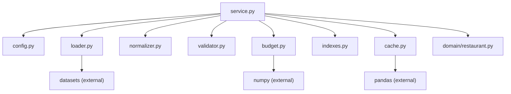

**Diagram sources**
- [service.py:10-17](file://src/ingestion/service.py#L10-L17)
- [loader.py:13](file://src/ingestion/loader.py#L13)
- [cache.py:11](file://src/ingestion/cache.py#L11)
- [budget.py:8](file://src/ingestion/budget.py#L8)

**Section sources**
- [service.py:10-17](file://src/ingestion/service.py#L10-L17)
- [loader.py:13](file://src/ingestion/loader.py#L13)
- [cache.py:11](file://src/ingestion/cache.py#L11)
- [budget.py:8](file://src/ingestion/budget.py#L8)

## Performance Considerations
- Streaming: Using streaming=True prevents loading the entire dataset into memory.
- Incremental processing: Pipeline processes rows incrementally, minimizing peak memory.
- Cache reuse: Subsequent runs load from Parquet, avoiding HF downloads.
- Vectorized operations: Budget percentile computation leverages NumPy for efficiency.
- DataFrames: Efficient serialization/deserialization via Pandas and Parquet.

[No sources needed since this section provides general guidance]

## Troubleshooting Guide
- Dataset download failures: Verify network connectivity and HF dataset availability. Re-run with --refresh to bypass cache.
- Cache corruption: Delete the Parquet file and metadata; the service will rebuild on next load.
- Validation drops: Review logs for dropped counts by category; adjust filters or data quality expectations.
- Budget band anomalies: Ensure sufficient city samples; adjust min_city_samples_for_percentiles.
- City normalization issues: Confirm city aliases and known city sets align with dataset content.

**Section sources**
- [README.md:21-41](file://README.md#L21-L41)
- [architecture.md:625-633](file://docs/architecture.md#L625-L633)

## Conclusion
The ingestion subsystem provides a robust, streaming-first pipeline to load, transform, validate, and cache the Zomato dataset. It tracks comprehensive statistics, supports cache-based acceleration, and integrates cleanly with downstream filtering and recommendation systems. The modular design enables maintainability, testability, and scalability for large datasets.