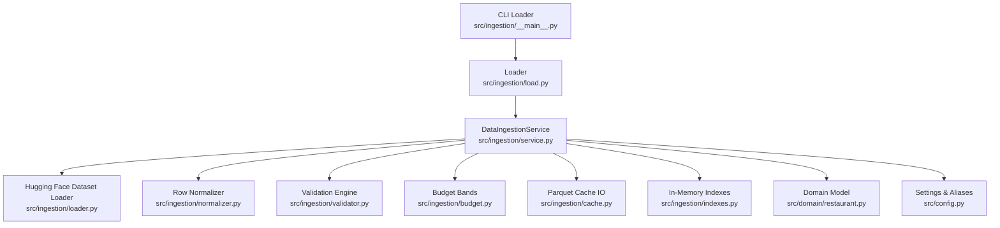
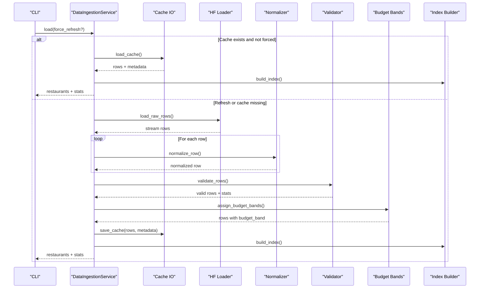
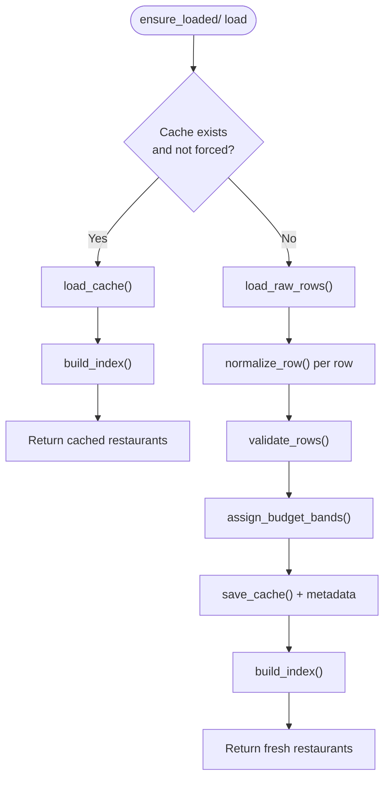
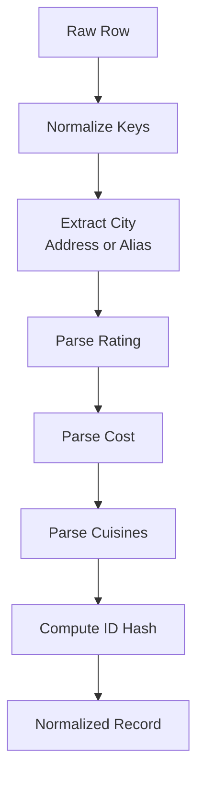
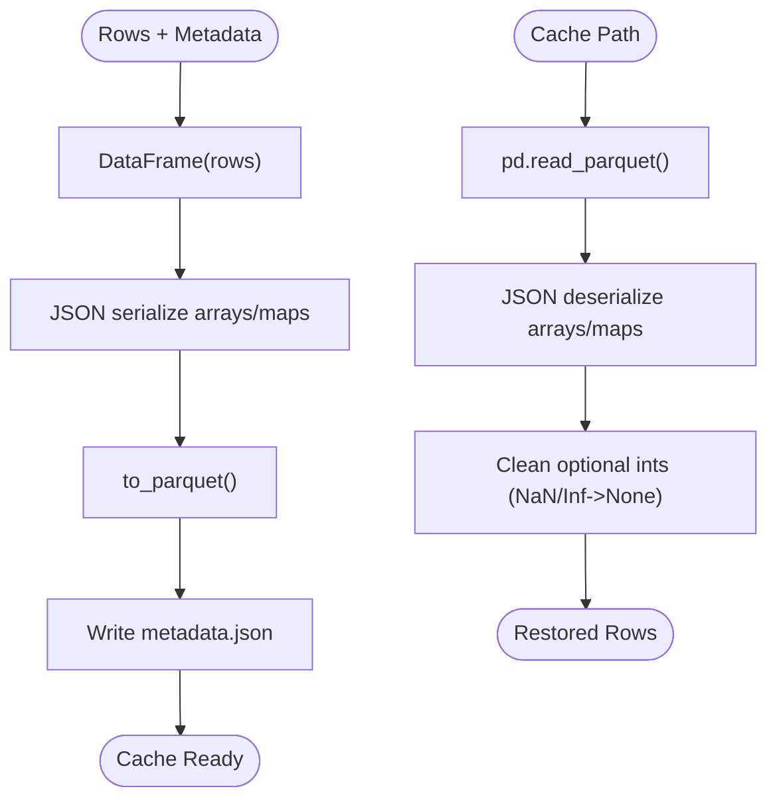
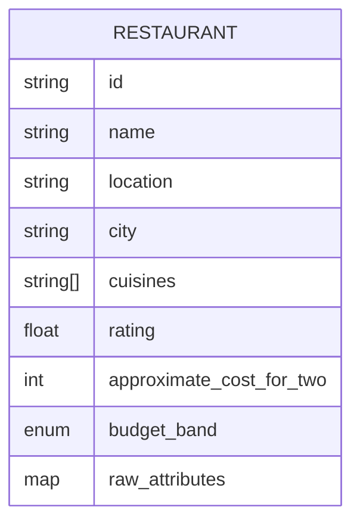
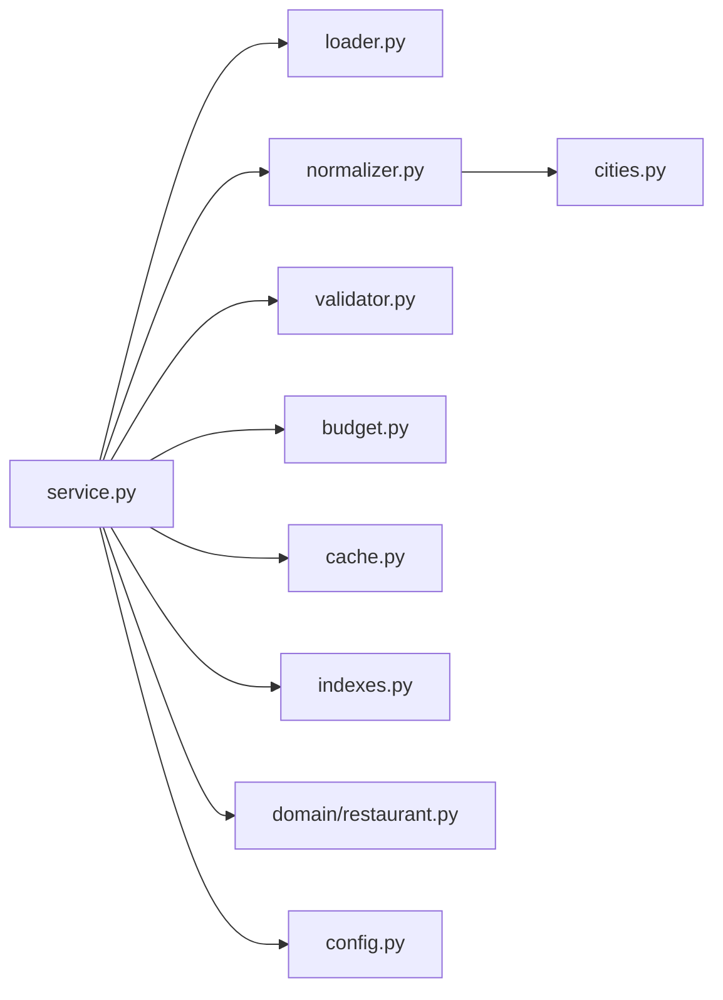

# Data Management

<cite>
**Referenced Files in This Document**
- [service.py](file://src/ingestion/service.py)
- [loader.py](file://src/ingestion/loader.py)
- [normalizer.py](file://src/ingestion/normalizer.py)
- [validator.py](file://src/ingestion/validator.py)
- [budget.py](file://src/ingestion/budget.py)
- [cache.py](file://src/ingestion/cache.py)
- [cities.py](file://src/ingestion/cities.py)
- [indexes.py](file://src/ingestion/indexes.py)
- [restaurant.py](file://src/domain/restaurant.py)
- [config.py](file://src/config.py)
- [__main__.py](file://src/ingestion/__main__.py)
- [load.py](file://src/ingestion/load.py)
- [test_normalizer.py](file://tests/test_normalizer.py)
- [test_validator.py](file://tests/test_validator.py)
- [test_budget.py](file://tests/test_budget.py)
- [test_cache.py](file://tests/test_cache.py)
</cite>

## Table of Contents
1. [Introduction](#introduction)
2. [Project Structure](#project-structure)
3. [Core Components](#core-components)
4. [Architecture Overview](#architecture-overview)
5. [Detailed Component Analysis](#detailed-component-analysis)
6. [Dependency Analysis](#dependency-analysis)
7. [Performance Considerations](#performance-considerations)
8. [Troubleshooting Guide](#troubleshooting-guide)
9. [Conclusion](#conclusion)
10. [Appendices](#appendices)

## Introduction
This document describes the Zomato recommendation system’s data management pipeline. It covers ingestion from Hugging Face datasets, normalization and validation, budget band assignment, caching to Parquet, and index building for efficient querying. It also documents the data schema, field mappings, quality metrics, lifecycle management, refresh mechanisms, and troubleshooting steps.

## Project Structure
The data management logic resides primarily under the ingestion module, with supporting domain models and configuration. The CLI entry point enables loading and caching of restaurant data.

**Diagram sources**
- [__main__.py:17-55](file://src/ingestion/__main__.py#L17-L55)
- [load.py:1-7](file://src/ingestion/load.py#L1-L7)
- [service.py:62-161](file://src/ingestion/service.py#L62-L161)
- [loader.py:11-28](file://src/ingestion/loader.py#L11-L28)
- [normalizer.py:67-98](file://src/ingestion/normalizer.py#L67-L98)
- [validator.py:27-76](file://src/ingestion/validator.py#L27-L76)
- [budget.py:19-74](file://src/ingestion/budget.py#L19-L74)
- [cache.py:58-99](file://src/ingestion/cache.py#L58-L99)
- [indexes.py:21-46](file://src/ingestion/indexes.py#L21-L46)
- [restaurant.py:16-26](file://src/domain/restaurant.py#L16-L26)
- [config.py:36-65](file://src/config.py#L36-L65)

**Section sources**
- [__main__.py:17-55](file://src/ingestion/__main__.py#L17-L55)
- [load.py:1-7](file://src/ingestion/load.py#L1-L7)
- [service.py:62-161](file://src/ingestion/service.py#L62-L161)
- [config.py:36-65](file://src/config.py#L36-L65)

## Core Components
- DataIngestionService orchestrates the entire pipeline: streaming from Hugging Face, normalizing, validating, assigning budget bands, caching, and building in-memory indexes.
- Loader streams rows from the configured Hugging Face dataset.
- Normalizer maps raw fields to a normalized schema and extracts city and cuisines.
- Validator enforces mandatory fields and rating bounds.
- Budget assigns budget bands via city-aware percentiles with a minimum sample threshold.
- Cache persists processed rows as Parquet with JSON-serialized arrays and metadata.
- Indexer builds city and cuisine-token indexes for fast lookup.
- Domain model defines the canonical Restaurant entity and BudgetBand enumeration.
- Configuration centralizes dataset ID, cache path, and percentile thresholds.

**Section sources**
- [service.py:62-161](file://src/ingestion/service.py#L62-L161)
- [loader.py:11-28](file://src/ingestion/loader.py#L11-L28)
- [normalizer.py:67-98](file://src/ingestion/normalizer.py#L67-L98)
- [validator.py:27-76](file://src/ingestion/validator.py#L27-L76)
- [budget.py:19-74](file://src/ingestion/budget.py#L19-L74)
- [cache.py:58-99](file://src/ingestion/cache.py#L58-L99)
- [indexes.py:21-46](file://src/ingestion/indexes.py#L21-L46)
- [restaurant.py:16-26](file://src/domain/restaurant.py#L16-L26)
- [config.py:36-65](file://src/config.py#L36-L65)

## Architecture Overview
The ingestion pipeline follows a streaming-first approach to minimize memory overhead while enabling robust preprocessing and caching.

**Diagram sources**
- [service.py:80-161](file://src/ingestion/service.py#L80-L161)
- [cache.py:66-71](file://src/ingestion/cache.py#L66-L71)
- [loader.py:11-18](file://src/ingestion/loader.py#L11-L18)
- [normalizer.py:67-98](file://src/ingestion/normalizer.py#L67-L98)
- [validator.py:63-76](file://src/ingestion/validator.py#L63-L76)
- [budget.py:19-74](file://src/ingestion/budget.py#L19-L74)
- [indexes.py:21-46](file://src/ingestion/indexes.py#L21-L46)

## Detailed Component Analysis

### Data Ingestion Orchestration
- Ensures idempotent loads with optional refresh.
- Streams rows from Hugging Face, normalizes, validates, computes budget bands, persists cache, and builds indexes.
- Tracks comprehensive statistics including raw/valid/dropped counts, budget distribution, and known cities.

**Diagram sources**
- [service.py:80-161](file://src/ingestion/service.py#L80-L161)
- [cache.py:66-71](file://src/ingestion/cache.py#L66-L71)
- [loader.py:11-18](file://src/ingestion/loader.py#L11-L18)
- [normalizer.py:67-98](file://src/ingestion/normalizer.py#L67-L98)
- [validator.py:63-76](file://src/ingestion/validator.py#L63-L76)
- [budget.py:19-74](file://src/ingestion/budget.py#L19-L74)

**Section sources**
- [service.py:80-161](file://src/ingestion/service.py#L80-L161)

### Hugging Face Dataset Loader
- Streams dataset rows with a configurable dataset identifier.
- Provides a materialized variant for testing with optional limits.

**Section sources**
- [loader.py:11-28](file://src/ingestion/loader.py#L11-L28)

### Row Normalization
- Maps raw keys to normalized fields and derives a compact restaurant ID.
- Extracts city from address or fallback to normalized city alias.
- Parses rating, cost, and cuisines with robust defaults.

**Diagram sources**
- [normalizer.py:67-98](file://src/ingestion/normalizer.py#L67-L98)
- [cities.py:66-91](file://src/ingestion/cities.py#L66-L91)

**Section sources**
- [normalizer.py:67-98](file://src/ingestion/normalizer.py#L67-L98)
- [cities.py:66-91](file://src/ingestion/cities.py#L66-L91)

### Validation Pipeline
- Enforces presence of name, location, city, and a numeric rating in [0.0, 5.0].
- Aggregates drop reasons for observability.

**Section sources**
- [validator.py:27-76](file://src/ingestion/validator.py#L27-L76)

### Budget Band Assignment
- Computes global and city-specific percentiles (p33, p66) using a minimum city sample threshold.
- Assigns LOW/MEDIUM/HIGH budgets; missing cost becomes UNKNOWN.

**Section sources**
- [budget.py:19-74](file://src/ingestion/budget.py#L19-L74)

### Caching Strategy (Parquet + Metadata)
- Persists normalized and validated rows to Parquet for fast reloads.
- Serializes nested lists and dictionaries to JSON strings before writing.
- Reads back with type restoration and cleans invalid numeric entries.

**Diagram sources**
- [cache.py:58-99](file://src/ingestion/cache.py#L58-L99)

**Section sources**
- [cache.py:58-99](file://src/ingestion/cache.py#L58-L99)

### Index Creation
- Builds in-memory indexes by city and by unique cuisine tokens.
- Tracks known cities for quick discovery and UI previews.

**Section sources**
- [indexes.py:21-46](file://src/ingestion/indexes.py#L21-L46)

### Data Schema and Field Mappings
- Canonical Restaurant fields and types are defined in the domain model.
- Normalized ingestion schema maps Hugging Face fields to internal representation.

**Diagram sources**
- [restaurant.py:16-26](file://src/domain/restaurant.py#L16-L26)

**Section sources**
- [restaurant.py:16-26](file://src/domain/restaurant.py#L16-L26)
- [normalizer.py:67-98](file://src/ingestion/normalizer.py#L67-L98)

### City Indexing and Known Cities Tracking
- Known cities list and alias normalization improve city resolution.
- City extraction prefers explicit tokens and falls back to substring matching.

**Section sources**
- [cities.py:15-48](file://src/ingestion/cities.py#L15-L48)
- [cities.py:66-91](file://src/ingestion/cities.py#L66-L91)
- [indexes.py:41-46](file://src/ingestion/indexes.py#L41-L46)

## Dependency Analysis
The ingestion service composes multiple modules with clear boundaries. Dependencies are predominantly unidirectional: loader → normalizer → validator → budget → cache/index.

**Diagram sources**
- [service.py:10-17](file://src/ingestion/service.py#L10-L17)
- [normalizer.py:9](file://src/ingestion/normalizer.py#L9)

**Section sources**
- [service.py:10-17](file://src/ingestion/service.py#L10-L17)

## Performance Considerations
- Streaming from Hugging Face prevents loading the entire dataset into memory.
- Parquet compression reduces disk footprint and speeds up reloads.
- In-memory indexes avoid repeated scans for city/cuisine queries.
- Percentile computation is O(n) per city and global; tune min_city_samples to balance accuracy and coverage.
- Consider batching writes and reads for very large datasets.

## Troubleshooting Guide
Common issues and resolutions:
- No cache found or stale cache:
  - Use the refresh flag to bypass cache and re-ingest from Hugging Face.
  - Verify cache path configuration and permissions.
- Missing or invalid ratings:
  - Ensure rating parsing supports “X/Y” and numeric forms within [0.0, 5.0].
- Unknown budget bands:
  - Occurs when cost is missing; confirm cost parsing and that sufficient rows exist for percentile computation.
- City resolution problems:
  - Confirm address tokens and aliases; known cities list can be extended if needed.
- NaN or infinite cost values:
  - Cache loader converts invalid numerics to None; inspect raw attributes and re-run ingestion.

Operational commands:
- Run the loader with optional refresh and sample printing to inspect results.

**Section sources**
- [service.py:80-115](file://src/ingestion/service.py#L80-L115)
- [cache.py:66-71](file://src/ingestion/cache.py#L66-L71)
- [budget.py:38-41](file://src/ingestion/budget.py#L38-L41)
- [normalizer.py:15-32](file://src/ingestion/normalizer.py#L15-L32)
- [normalizer.py:35-50](file://src/ingestion/normalizer.py#L35-L50)
- [__main__.py:17-55](file://src/ingestion/__main__.py#L17-L55)

## Conclusion
The ingestion pipeline provides a robust, observable, and efficient path from Hugging Face datasets to a cached, indexed, and validated dataset suitable for recommendation filtering. Its modular design enables easy maintenance, testing, and extension.

## Appendices

### Data Lifecycle and Refresh Mechanisms
- On startup or explicit refresh, the service checks for existing cache.
- If present and not forced, it loads from cache; otherwise, it reprocesses from source.
- After successful processing, cache and metadata are written for future loads.

**Section sources**
- [service.py:85-115](file://src/ingestion/service.py#L85-L115)
- [cache.py:58-63](file://src/ingestion/cache.py#L58-L63)

### CLI Usage
- Supports refresh and sampling to inspect outcomes quickly.

**Section sources**
- [__main__.py:17-55](file://src/ingestion/__main__.py#L17-L55)

### Tests and Quality Assurance
- Normalization tests validate rating/cost parsing and city extraction.
- Validation tests confirm drop conditions and counts.
- Budget tests verify band distribution and UNKNOWN handling.
- Cache tests ensure round-trip fidelity and NaN handling.

**Section sources**
- [test_normalizer.py:11-47](file://tests/test_normalizer.py#L11-L47)
- [test_validator.py:4-25](file://tests/test_validator.py#L4-L25)
- [test_budget.py:5-17](file://tests/test_budget.py#L5-L17)
- [test_cache.py:8-35](file://tests/test_cache.py#L8-L35)