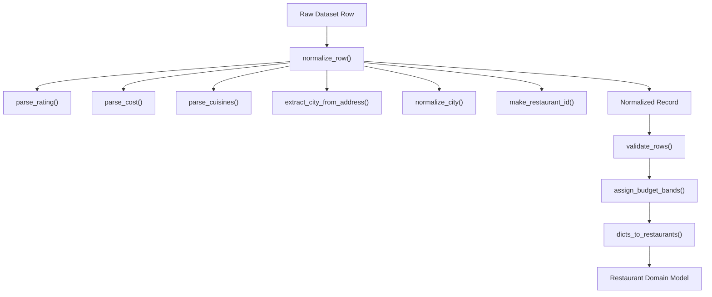
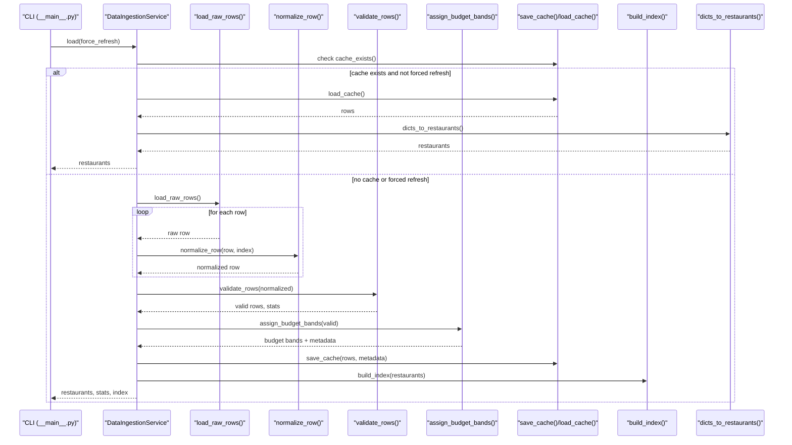
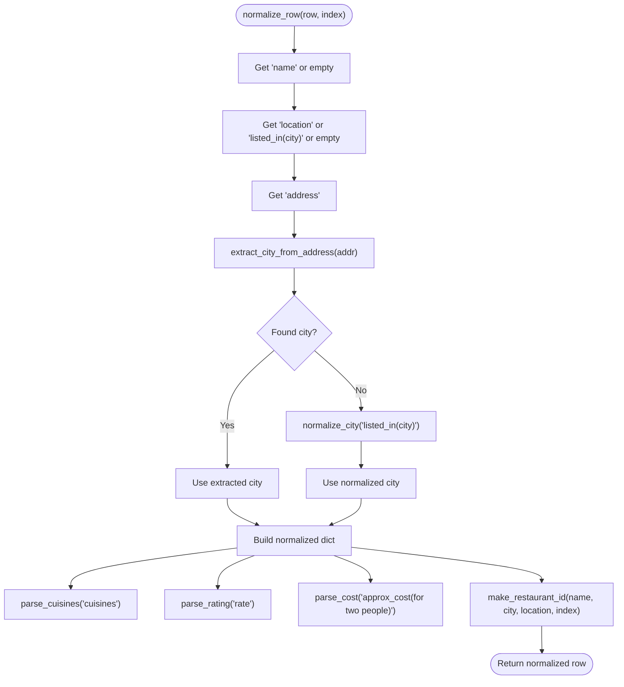
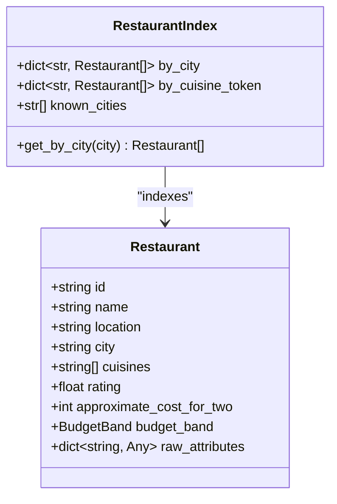
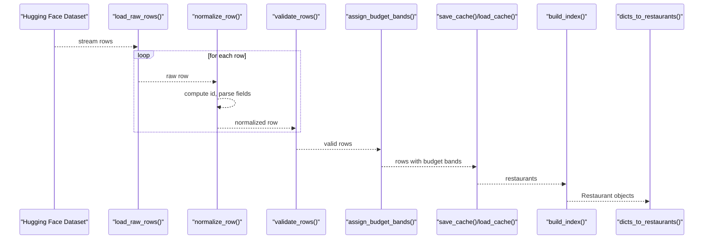
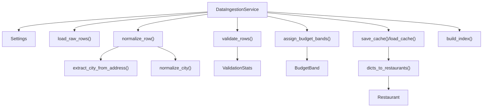

# Data Normalization

<cite>
**Referenced Files in This Document**
- [normalizer.py](file://src/ingestion/normalizer.py)
- [cities.py](file://src/ingestion/cities.py)
- [validator.py](file://src/ingestion/validator.py)
- [service.py](file://src/ingestion/service.py)
- [loader.py](file://src/ingestion/loader.py)
- [cache.py](file://src/ingestion/cache.py)
- [indexes.py](file://src/ingestion/indexes.py)
- [budget.py](file://src/ingestion/budget.py)
- [restaurant.py](file://src/domain/restaurant.py)
- [__main__.py](file://src/ingestion/__main__.py)
- [config.py](file://src/config.py)
- [test_normalizer.py](file://tests/test_normalizer.py)
- [test_validator.py](file://tests/test_validator.py)
- [test_cache.py](file://tests/test_cache.py)
</cite>

## Table of Contents
1. [Introduction](#introduction)
2. [Project Structure](#project-structure)
3. [Core Components](#core-components)
4. [Architecture Overview](#architecture-overview)
5. [Detailed Component Analysis](#detailed-component-analysis)
6. [Dependency Analysis](#dependency-analysis)
7. [Performance Considerations](#performance-considerations)
8. [Troubleshooting Guide](#troubleshooting-guide)
9. [Conclusion](#conclusion)
10. [Appendices](#appendices)

## Introduction
This document explains the data normalization process used to transform raw restaurant datasets into a consistent internal representation. It covers field mapping, data type conversion, value standardization, and the row indexing mechanism. It also documents normalization rules for restaurant names, locations, ratings, cuisines, and pricing information, along with error handling and the transformation pipeline from raw dataset format to internal representation. Examples of before/after normalization states and common normalization patterns across different data sources are included.

## Project Structure
The normalization pipeline resides primarily under the ingestion module and integrates with domain models and configuration. The key files involved are:
- Normalization and parsing logic
- City extraction and normalization
- Validation and statistics
- Orchestration and caching
- Index building
- Budget band assignment
- Domain model definition
- CLI entry point and configuration

**Diagram sources**
- [normalizer.py:67-97](file://src/ingestion/normalizer.py#L67-L97)
- [normalizer.py:15-32](file://src/ingestion/normalizer.py#L15-L32)
- [normalizer.py:35-50](file://src/ingestion/normalizer.py#L35-L50)
- [normalizer.py:53-59](file://src/ingestion/normalizer.py#L53-L59)
- [cities.py:66-90](file://src/ingestion/cities.py#L66-L90)
- [cities.py:51-59](file://src/ingestion/cities.py#L51-L59)
- [validator.py:27-60](file://src/ingestion/validator.py#L27-L60)
- [budget.py:19-74](file://src/ingestion/budget.py#L19-L74)
- [cache.py:78-99](file://src/ingestion/cache.py#L78-L99)
- [restaurant.py:16-26](file://src/domain/restaurant.py#L16-L26)

**Section sources**
- [normalizer.py:1-98](file://src/ingestion/normalizer.py#L1-L98)
- [cities.py:1-92](file://src/ingestion/cities.py#L1-L92)
- [validator.py:1-77](file://src/ingestion/validator.py#L1-L77)
- [budget.py:1-83](file://src/ingestion/budget.py#L1-L83)
- [cache.py:1-100](file://src/ingestion/cache.py#L1-L100)
- [restaurant.py:1-26](file://src/domain/restaurant.py#L1-L26)

## Core Components
- Row normalization: Converts raw dataset rows into a normalized dictionary with standardized keys and types.
- Parsing functions: Extract and convert ratings, costs, and cuisines with robust fallbacks.
- City resolution: Extracts and normalizes city names from addresses and alternate fields.
- Validation: Drops invalid rows and tracks statistics.
- Budget assignment: Computes budget bands via percentiles with city-aware thresholds.
- Indexing: Builds in-memory indexes for efficient queries by city and cuisine.
- Caching: Persists normalized data to Parquet with metadata for fast reloads.
- Domain model: Defines the canonical Restaurant entity with typed fields.

**Section sources**
- [normalizer.py:67-97](file://src/ingestion/normalizer.py#L67-L97)
- [validator.py:27-60](file://src/ingestion/validator.py#L27-L60)
- [budget.py:19-74](file://src/ingestion/budget.py#L19-L74)
- [indexes.py:21-46](file://src/ingestion/indexes.py#L21-L46)
- [cache.py:58-99](file://src/ingestion/cache.py#L58-L99)
- [restaurant.py:16-26](file://src/domain/restaurant.py#L16-L26)

## Architecture Overview
The normalization pipeline is orchestrated by the ingestion service. It streams raw rows from a Hugging Face dataset, normalizes each row with a stable ID, validates the results, assigns budget bands, builds indexes, caches the output, and converts to domain models.

**Diagram sources**
- [__main__.py:17-55](file://src/ingestion/__main__.py#L17-L55)
- [service.py:85-161](file://src/ingestion/service.py#L85-L161)
- [loader.py:11-28](file://src/ingestion/loader.py#L11-L28)
- [normalizer.py:67-97](file://src/ingestion/normalizer.py#L67-L97)
- [validator.py:63-76](file://src/ingestion/validator.py#L63-L76)
- [budget.py:19-74](file://src/ingestion/budget.py#L19-L74)
- [cache.py:58-71](file://src/ingestion/cache.py#L58-L71)
- [indexes.py:21-46](file://src/ingestion/indexes.py#L21-L46)
- [cache.py:78-99](file://src/ingestion/cache.py#L78-L99)

## Detailed Component Analysis

### Row Normalization Algorithm
The normalization function maps raw fields to a canonical internal structure, standardizes types, and computes a compact stable identifier.

Key steps:
- Name and location: Strip whitespace and fall back to alternate fields if needed.
- City: Prefer extraction from address; otherwise normalize from a city field.
- Cuisines: Split comma-separated values and strip tokens.
- Ratings: Parse fractions out of “X/Y” and numeric forms; clamp to [0, 5].
- Cost: Remove currency symbols and commas; support ranges and pure digits; clamp positive.
- Stable ID: SHA-256 hash of name|city|location|row_index, truncated to 16 hex characters.
- Raw attributes: Preserve untouched fields for downstream use.

**Diagram sources**
- [normalizer.py:67-97](file://src/ingestion/normalizer.py#L67-L97)
- [cities.py:66-90](file://src/ingestion/cities.py#L66-L90)
- [normalizer.py:53-59](file://src/ingestion/normalizer.py#L53-L59)
- [normalizer.py:15-32](file://src/ingestion/normalizer.py#L15-L32)
- [normalizer.py:35-50](file://src/ingestion/normalizer.py#L35-L50)
- [normalizer.py:62-64](file://src/ingestion/normalizer.py#L62-L64)

**Section sources**
- [normalizer.py:67-97](file://src/ingestion/normalizer.py#L67-L97)
- [cities.py:66-90](file://src/ingestion/cities.py#L66-L90)

### Field Mapping and Data Type Conversion
- Names: Stripped string.
- Locations: Stripped string; falls back to city field when missing.
- Cities: Extracted from address or normalized from city field; aliases resolved via configuration.
- Cuisines: List of stripped strings parsed from comma-separated values.
- Ratings: Float in [0, 5]; None if missing or invalid.
- Approximate cost for two: Integer; None if missing or invalid.
- Budget band: Enum string assigned post-validation.
- Raw attributes: Dictionary of untouched fields.

**Section sources**
- [normalizer.py:67-97](file://src/ingestion/normalizer.py#L67-L97)
- [cities.py:51-59](file://src/ingestion/cities.py#L51-L59)
- [restaurant.py:9-25](file://src/domain/restaurant.py#L9-L25)

### Value Standardization Rules
- Ratings:
  - Accepts “X/5” and numeric forms.
  - Clamps to [0, 5]; otherwise None.
- Costs:
  - Removes currency symbols and commas.
  - Supports ranges like “300–400”; averages to midpoint.
  - Pure digits accepted; clamps to positive integers.
- Cuisines:
  - Splits on comma; trims tokens; ignores empty entries.
- City:
  - Applies alias mapping and title-case normalization.
  - Known city detection and substring matching fallback.
- Names and Locations:
  - Whitespace trimmed; empty treated as missing.

**Section sources**
- [normalizer.py:15-32](file://src/ingestion/normalizer.py#L15-L32)
- [normalizer.py:35-50](file://src/ingestion/normalizer.py#L35-L50)
- [normalizer.py:53-59](file://src/ingestion/normalizer.py#L53-L59)
- [cities.py:10-13](file://src/ingestion/cities.py#L10-L13)
- [cities.py:51-59](file://src/ingestion/cities.py#L51-L59)

### Row Indexing Mechanism
- In-memory indexes group restaurants by city and by normalized, lowercased cuisine tokens.
- Duplicate cuisines within a restaurant are deduplicated per record.
- Additional location key is indexed only if distinct from city.
- Known cities list is sorted for deterministic reporting.

**Diagram sources**
- [indexes.py:11-46](file://src/ingestion/indexes.py#L11-L46)
- [restaurant.py:16-26](file://src/domain/restaurant.py#L16-L26)

**Section sources**
- [indexes.py:21-46](file://src/ingestion/indexes.py#L21-L46)

### Error Handling During Normalization
- Missing or empty name/location/city/rating leads to dropping the row.
- Invalid rating types/values are rejected.
- Cost parsing errors produce None; rows without cost remain valid but budget band may be unknown.
- City extraction failures return empty city; normalization falls back to alias mapping.
- Logging reports ingestion statistics and counts.

**Section sources**
- [validator.py:27-60](file://src/ingestion/validator.py#L27-L60)
- [normalizer.py:15-32](file://src/ingestion/normalizer.py#L15-L32)
- [normalizer.py:35-50](file://src/ingestion/normalizer.py#L35-L50)
- [cities.py:66-90](file://src/ingestion/cities.py#L66-L90)

### Transformation Pipeline: From Raw to Internal Representation
- Load raw rows from Hugging Face dataset.
- Normalize each row with a stable ID and canonical fields.
- Validate rows and compute statistics.
- Assign budget bands using city-aware percentiles.
- Save to cache and build indexes.
- Convert to domain models for downstream use.

**Diagram sources**
- [loader.py:11-28](file://src/ingestion/loader.py#L11-L28)
- [normalizer.py:67-97](file://src/ingestion/normalizer.py#L67-L97)
- [validator.py:63-76](file://src/ingestion/validator.py#L63-L76)
- [budget.py:19-74](file://src/ingestion/budget.py#L19-L74)
- [cache.py:58-71](file://src/ingestion/cache.py#L58-L71)
- [indexes.py:21-46](file://src/ingestion/indexes.py#L21-L46)
- [cache.py:78-99](file://src/ingestion/cache.py#L78-L99)

**Section sources**
- [service.py:85-161](file://src/ingestion/service.py#L85-L161)
- [loader.py:11-28](file://src/ingestion/loader.py#L11-L28)
- [cache.py:58-71](file://src/ingestion/cache.py#L58-L71)

### Examples of Before/After Normalization States
- Example 1: Rating normalization
  - Before: “4.1/5”, “3.8 ”, “ NEW ”, “invalid”
  - After: 4.1, 3.8, None, None
  - Reference: [test_normalizer.py:11-17](file://tests/test_normalizer.py#L11-L17)
- Example 2: Cost normalization
  - Before: “₹300–400”, “800”, “1,200”, “none”
  - After: 350, 800, 1200, None
  - Reference: [test_normalizer.py:19-24](file://tests/test_normalizer.py#L19-L24)
- Example 3: Cuisine parsing
  - Before: “North Indian, Chinese, ”
  - After: [“North Indian”, “Chinese”]
  - Reference: [test_normalizer.py:27-28](file://tests/test_normalizer.py#L27-L28)
- Example 4: City normalization
  - Before: “bengaluru”, “New Delhi”, “Bombay”
  - After: “Bangalore”, “Delhi”, “Mumbai”
  - Reference: [test_normalizer.py:35-36](file://tests/test_normalizer.py#L35-L36), [config.py:13-34](file://src/config.py#L13-L34)

**Section sources**
- [test_normalizer.py:11-36](file://tests/test_normalizer.py#L11-L36)
- [config.py:13-34](file://src/config.py#L13-L34)

### Common Normalization Patterns Across Data Sources
- Address-based city extraction with right-to-left preference and substring matching.
- Alias-driven normalization for city names.
- Robust rating parsing supporting fractional notation and whitespace.
- Flexible cost parsing accommodating currency symbols, commas, and ranges.
- Preservation of original attributes for traceability and future enrichment.

**Section sources**
- [cities.py:66-90](file://src/ingestion/cities.py#L66-L90)
- [config.py:13-34](file://src/config.py#L13-L34)
- [normalizer.py:15-32](file://src/ingestion/normalizer.py#L15-L32)
- [normalizer.py:35-50](file://src/ingestion/normalizer.py#L35-L50)

## Dependency Analysis
The ingestion service composes the normalization pipeline and manages caching and indexing. Dependencies are intentionally decoupled to enable streaming and caching.

**Diagram sources**
- [service.py:85-161](file://src/ingestion/service.py#L85-L161)
- [loader.py:11-28](file://src/ingestion/loader.py#L11-L28)
- [normalizer.py:67-97](file://src/ingestion/normalizer.py#L67-L97)
- [validator.py:27-60](file://src/ingestion/validator.py#L27-L60)
- [budget.py:19-74](file://src/ingestion/budget.py#L19-L74)
- [cache.py:58-99](file://src/ingestion/cache.py#L58-L99)
- [indexes.py:21-46](file://src/ingestion/indexes.py#L21-L46)
- [restaurant.py:16-26](file://src/domain/restaurant.py#L16-L26)
- [config.py:46-80](file://src/config.py#L46-L80)

**Section sources**
- [service.py:85-161](file://src/ingestion/service.py#L85-L161)
- [config.py:46-80](file://src/config.py#L46-L80)

## Performance Considerations
- Streaming loads reduce memory footprint during ingestion.
- Caching avoids repeated downloads and recomputation.
- Percentile computation is city-aware and requires minimal samples threshold.
- Index construction is linear in the number of restaurants.
- Optional sampling in CLI helps inspect results quickly.

[No sources needed since this section provides general guidance]

## Troubleshooting Guide
- Symptoms: Many rows dropped due to missing city or rating.
  - Causes: Invalid or empty city/rating fields; misaligned column names.
  - Actions: Verify dataset schema; ensure city normalization rules apply; confirm rating formats.
  - References: [validator.py:27-60](file://src/ingestion/validator.py#L27-L60), [normalizer.py:67-97](file://src/ingestion/normalizer.py#L67-L97)
- Symptoms: Cost parsing yields None.
  - Causes: Non-numeric, NaN, or unsupported currency formats.
  - Actions: Clean cost column upstream; confirm removal of symbols and commas.
  - References: [normalizer.py:35-50](file://src/ingestion/normalizer.py#L35-L50), [test_cache.py:26-34](file://tests/test_cache.py#L26-L34)
- Symptoms: City extraction fails.
  - Causes: Unknown city tokens or malformed addresses.
  - Actions: Review alias mappings; improve address formatting; validate known city sets.
  - References: [cities.py:66-90](file://src/ingestion/cities.py#L66-L90), [config.py:13-34](file://src/config.py#L13-L34)
- Symptoms: Budget bands mostly unknown.
  - Causes: Missing cost values or insufficient city samples.
  - Actions: Increase minimum city samples threshold; populate cost fields.
  - References: [budget.py:19-74](file://src/ingestion/budget.py#L19-L74), [config.py:71-71](file://src/config.py#L71-L71)

**Section sources**
- [validator.py:27-60](file://src/ingestion/validator.py#L27-L60)
- [normalizer.py:35-50](file://src/ingestion/normalizer.py#L35-L50)
- [cities.py:66-90](file://src/ingestion/cities.py#L66-L90)
- [budget.py:19-74](file://src/ingestion/budget.py#L19-L74)
- [config.py:71-71](file://src/config.py#L71-L71)
- [test_cache.py:26-34](file://tests/test_cache.py#L26-L34)

## Conclusion
The normalization pipeline transforms heterogeneous raw datasets into a consistent internal representation with robust parsing, validation, and indexing. It standardizes restaurant names, locations, ratings, cuisines, and pricing while preserving original attributes. City normalization and alias mapping ensure reliable geocoding. Budget bands are computed efficiently using city-aware percentiles. Caching accelerates subsequent runs, and the domain model provides a strong contract for downstream consumers.

[No sources needed since this section summarizes without analyzing specific files]

## Appendices

### Validation Statistics Fields
- raw_count: Total rows ingested.
- valid_count: Rows passing validation.
- dropped_missing_name/location/city/rating: Counts of dropped rows due to missing required fields.
- dropped_invalid_rating: Rows with invalid or out-of-range ratings.
- budget_distribution: Count of restaurants per budget band.
- budget_percentiles: Per-city and global percentile thresholds used for budget bands.
- known_cities_count: Number of distinct cities identified.
- from_cache: Whether the dataset was loaded from cache.

**Section sources**
- [validator.py:12-25](file://src/ingestion/validator.py#L12-L25)
- [service.py:22-59](file://src/ingestion/service.py#L22-L59)