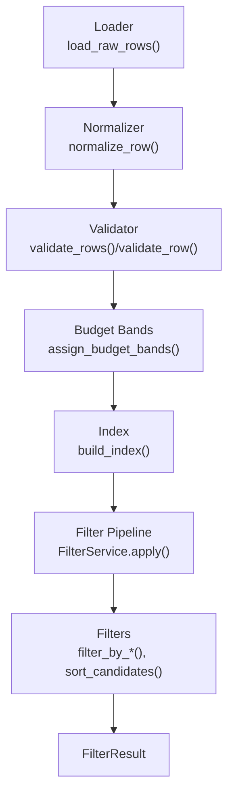
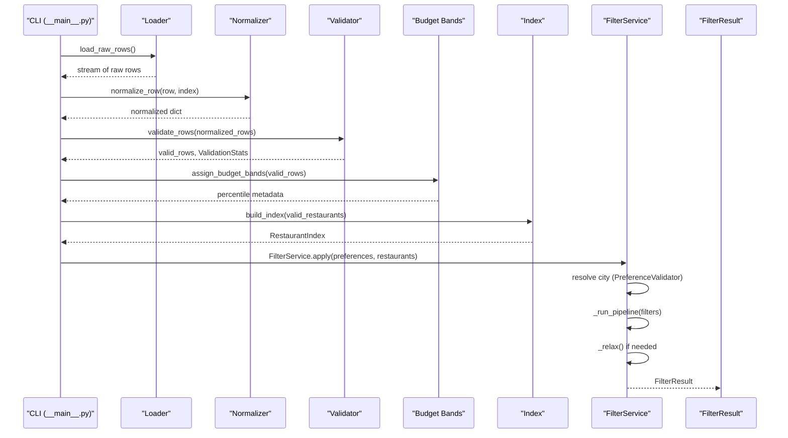
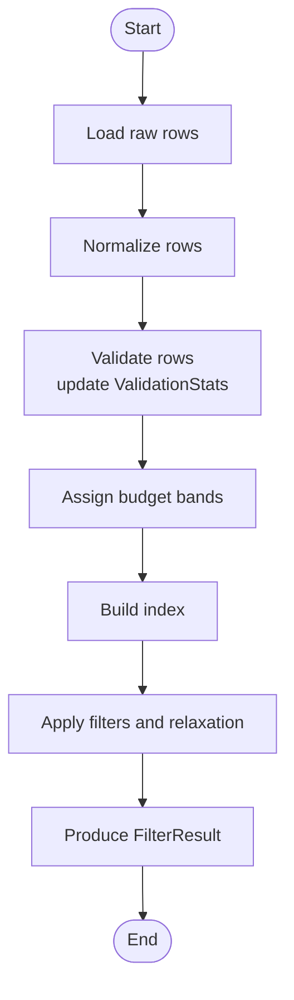
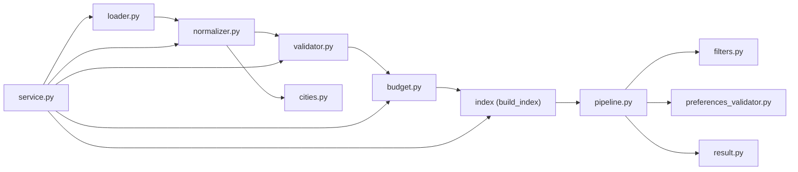

# Data Validation

<cite>
**Referenced Files in This Document**
- [validator.py](file://src/ingestion/validator.py)
- [normalizer.py](file://src/ingestion/normalizer.py)
- [service.py](file://src/ingestion/service.py)
- [loader.py](file://src/ingestion/loader.py)
- [cities.py](file://src/ingestion/cities.py)
- [budget.py](file://src/ingestion/budget.py)
- [restaurant.py](file://src/domain/restaurant.py)
- [filters.py](file://src/filtering/filters.py)
- [pipeline.py](file://src/filtering/pipeline.py)
- [preferences_validator.py](file://src/filtering/preferences_validator.py)
- [result.py](file://src/filtering/result.py)
- [test_validator.py](file://tests/test_validator.py)
- [conftest.py](file://tests/conftest.py)
- [__main__.py](file://src/ingestion/__main__.py)
- [config.py](file://src/config.py)
</cite>

## Table of Contents
1. [Introduction](#introduction)
2. [Project Structure](#project-structure)
3. [Core Components](#core-components)
4. [Architecture Overview](#architecture-overview)
5. [Detailed Component Analysis](#detailed-component-analysis)
6. [Dependency Analysis](#dependency-analysis)
7. [Performance Considerations](#performance-considerations)
8. [Troubleshooting Guide](#troubleshooting-guide)
9. [Conclusion](#conclusion)
10. [Appendices](#appendices)

## Introduction
This document describes the data validation system for restaurant data in the Zomato project. It explains the validation rules and criteria enforced on normalized restaurant records, including mandatory fields (name, location, city, rating), data type requirements, and business rule enforcement. It also documents validation statistics tracking, the end-to-end validation pipeline from normalized data through validation checks to filtered results, the validation error reporting mechanism, and common failure modes. Finally, it provides examples of valid and invalid data samples and their outcomes.

## Project Structure
The validation system spans ingestion, normalization, and filtering stages:
- Normalization transforms raw rows into a partial restaurant dictionary suitable for validation.
- Validation enforces mandatory fields and rating constraints, producing cleaned rows and statistics.
- Filtering consumes validated data to produce recommendation results.

**Diagram sources**
- [loader.py:11-28](file://src/ingestion/loader.py#L11-L28)
- [normalizer.py:67-98](file://src/ingestion/normalizer.py#L67-L98)
- [validator.py:63-77](file://src/ingestion/validator.py#L63-L77)
- [budget.py:19-74](file://src/ingestion/budget.py#L19-L74)
- [pipeline.py:42-103](file://src/filtering/pipeline.py#L42-L103)
- [filters.py:27-124](file://src/filtering/filters.py#L27-L124)
- [result.py:11-20](file://src/filtering/result.py#L11-L20)

**Section sources**
- [loader.py:11-28](file://src/ingestion/loader.py#L11-L28)
- [normalizer.py:67-98](file://src/ingestion/normalizer.py#L67-L98)
- [validator.py:63-77](file://src/ingestion/validator.py#L63-L77)
- [budget.py:19-74](file://src/ingestion/budget.py#L19-L74)
- [pipeline.py:42-103](file://src/filtering/pipeline.py#L42-L103)
- [filters.py:27-124](file://src/filtering/filters.py#L27-L124)
- [result.py:11-20](file://src/filtering/result.py#L11-L20)

## Core Components
- ValidationStats: Tracks counts for raw records, valid records, and drops categorized by reason (missing name, missing location, missing city, missing rating, invalid rating).
- validate_row: Enforces mandatory fields and rating validity; returns cleaned row or None.
- validate_rows: Iterates over normalized rows, accumulates stats, and logs summary.
- Normalizer: Converts raw rows to normalized dictionaries with parsed name, location, city, cuisines, rating, approximate cost, and raw attributes.
- DataIngestionService: Orchestrates loading, normalization, validation, budget band assignment, indexing, and statistics aggregation.

Key validation rules:
- Mandatory fields: name, location, city, rating.
- Data types: rating is converted to float; invalid or out-of-range ratings cause drop.
- Business rules: rating must be within [0.0, 5.0].

Validation statistics tracked:
- raw_count, valid_count, dropped_count
- dropped_missing_name, dropped_missing_location, dropped_missing_city, dropped_missing_rating, dropped_invalid_rating

**Section sources**
- [validator.py:12-77](file://src/ingestion/validator.py#L12-L77)
- [normalizer.py:67-98](file://src/ingestion/normalizer.py#L67-L98)
- [service.py:22-162](file://src/ingestion/service.py#L22-L162)

## Architecture Overview
The validation pipeline integrates with the broader ingestion and filtering system.

**Diagram sources**
- [__main__.py:17-55](file://src/ingestion/__main__.py#L17-L55)
- [loader.py:11-28](file://src/ingestion/loader.py#L11-L28)
- [normalizer.py:67-98](file://src/ingestion/normalizer.py#L67-L98)
- [validator.py:63-77](file://src/ingestion/validator.py#L63-L77)
- [budget.py:19-74](file://src/ingestion/budget.py#L19-L74)
- [pipeline.py:42-103](file://src/filtering/pipeline.py#L42-L103)
- [result.py:11-20](file://src/filtering/result.py#L11-L20)

## Detailed Component Analysis

### Validation Rules and Criteria
- Mandatory fields enforced:
  - name: must be present and non-empty after stripping.
  - location: must be present and non-empty after stripping.
  - city: must be present and non-empty after stripping.
  - rating: must be present; must convert to float; must be within [0.0, 5.0].
- Data type requirements:
  - rating is converted to float; non-numeric values or conversion errors lead to drop.
- Business rule enforcement:
  - Rating bounds: 0.0 ≤ rating ≤ 5.0.

Validation outcome:
- Rows passing validation are returned as valid records; others are dropped and counted in ValidationStats.

**Section sources**
- [validator.py:27-60](file://src/ingestion/validator.py#L27-L60)

### Validation Statistics Tracking
ValidationStats fields:
- raw_count: total processed rows.
- valid_count: rows that passed validation.
- dropped_missing_name, dropped_missing_location, dropped_missing_city, dropped_missing_rating, dropped_invalid_rating: counts per category of drop.
- dropped_count: computed as raw_count − valid_count.

Aggregation occurs in validate_rows, which iterates over normalized rows and updates counters accordingly. The ingestion service augments these stats with budget distribution, known cities count, and cache metadata.

**Section sources**
- [validator.py:12-25](file://src/ingestion/validator.py#L12-L25)
- [validator.py:63-77](file://src/ingestion/validator.py#L63-L77)
- [service.py:22-60](file://src/ingestion/service.py#L22-L60)

### Validation Pipeline: From Normalized Data to Filtered Results
End-to-end flow:
1. Load raw rows from Hugging Face dataset.
2. Normalize each row into a partial restaurant dictionary.
3. Validate normalized rows; collect ValidationStats.
4. Assign budget bands using percentiles.
5. Build an index over validated restaurants.
6. Apply filtering pipeline with optional relaxation.
7. Produce FilterResult with candidates and metadata.

**Diagram sources**
- [loader.py:11-28](file://src/ingestion/loader.py#L11-L28)
- [normalizer.py:67-98](file://src/ingestion/normalizer.py#L67-L98)
- [validator.py:63-77](file://src/ingestion/validator.py#L63-L77)
- [budget.py:19-74](file://src/ingestion/budget.py#L19-L74)
- [pipeline.py:42-103](file://src/filtering/pipeline.py#L42-L103)
- [result.py:11-20](file://src/filtering/result.py#L11-L20)

**Section sources**
- [service.py:127-162](file://src/ingestion/service.py#L127-L162)
- [pipeline.py:42-103](file://src/filtering/pipeline.py#L42-L103)

### Validation Error Reporting Mechanism
- Logging: The validator logs a summary after validation completion, including raw, valid, and dropped counts.
- CLI output: The ingestion CLI prints ingestion statistics including raw, valid, dropped, budget distribution, and known cities.
- Preference validation errors: City resolution raises a dedicated exception with optional suggestions when no match is found.

Common validation failures:
- Missing name, location, city, or rating leads to immediate drop.
- Non-numeric rating or rating outside [0.0, 5.0] leads to drop.
- Preference city resolution failure triggers a user-facing error with suggestions.

**Section sources**
- [validator.py:70-76](file://src/ingestion/validator.py#L70-L76)
- [__main__.py:37-45](file://src/ingestion/__main__.py#L37-L45)
- [preferences_validator.py:13-18](file://src/filtering/preferences_validator.py#L13-L18)
- [preferences_validator.py:65-68](file://src/filtering/preferences_validator.py#L65-L68)

### Examples of Valid and Invalid Data Samples
Valid sample:
- A normalized row with non-empty name, location, city, and a numeric rating in [0.0, 5.0] passes validation.

Invalid samples:
- Missing name: validation drops the record and increments dropped_missing_name.
- Missing rating: validation drops the record and increments dropped_missing_rating.
- Invalid rating (None, non-numeric, or out-of-range): validation drops the record and increments dropped_invalid_rating.

These behaviors are verified by tests and fixtures.

**Section sources**
- [test_validator.py:4-24](file://tests/test_validator.py#L4-L24)
- [conftest.py:10-42](file://tests/conftest.py#L10-L42)

## Dependency Analysis
Key dependencies:
- Normalizer depends on city extraction and normalization utilities.
- Validator depends on normalized row structure and rating parsing.
- DataIngestionService orchestrates Loader, Normalizer, Validator, Budget, and Index.
- FilterService depends on PreferenceValidator and Filter pipeline components.

**Diagram sources**
- [loader.py:11-28](file://src/ingestion/loader.py#L11-L28)
- [normalizer.py:67-98](file://src/ingestion/normalizer.py#L67-L98)
- [validator.py:63-77](file://src/ingestion/validator.py#L63-L77)
- [budget.py:19-74](file://src/ingestion/budget.py#L19-L74)
- [pipeline.py:42-103](file://src/filtering/pipeline.py#L42-L103)
- [filters.py:27-124](file://src/filtering/filters.py#L27-L124)
- [preferences_validator.py:28-76](file://src/filtering/preferences_validator.py#L28-L76)
- [result.py:11-20](file://src/filtering/result.py#L11-L20)
- [cities.py:66-91](file://src/ingestion/cities.py#L66-L91)
- [service.py:127-162](file://src/ingestion/service.py#L127-L162)

**Section sources**
- [service.py:127-162](file://src/ingestion/service.py#L127-L162)
- [pipeline.py:42-103](file://src/filtering/pipeline.py#L42-L103)

## Performance Considerations
- Validation is linear in the number of normalized rows; overhead is minimal.
- Budget band assignment computes percentiles per city and globally; thresholding is O(n).
- Filtering pipeline applies several passes (rating, cuisine, budget, keyword, sorting); complexity scales with candidate set size.
- The pipeline logs warnings when execution exceeds a target threshold, indicating potential bottlenecks.

[No sources needed since this section provides general guidance]

## Troubleshooting Guide
Common issues and resolutions:
- Excessive drops due to missing mandatory fields:
  - Verify normalization extracts name, location, city, and rating correctly.
  - Ensure raw data contains expected keys and non-empty values.
- Invalid ratings:
  - Confirm rating parsing supports formats like "X.Y/5" or standalone "X.Y".
  - Ensure values fall within [0.0, 5.0].
- City resolution failures:
  - Use PreferenceValidator to resolve preferred locations; leverage suggestions when exact match fails.
- Slow filtering:
  - Review pipeline logs for long-running steps; consider adjusting minimum candidates and relaxation thresholds.

**Section sources**
- [validator.py:27-60](file://src/ingestion/validator.py#L27-L60)
- [preferences_validator.py:28-76](file://src/filtering/preferences_validator.py#L28-L76)
- [pipeline.py:88-89](file://src/filtering/pipeline.py#L88-L89)

## Conclusion
The validation system rigorously enforces mandatory fields and rating constraints, tracks comprehensive statistics, and integrates cleanly into the ingestion and filtering pipeline. By normalizing raw data, validating records, assigning budget bands, and building an index, the system ensures high-quality inputs for recommendation filtering. Clear error reporting and suggestions support robust operation and diagnostics.

[No sources needed since this section summarizes without analyzing specific files]

## Appendices

### Validation Rule Reference
- name: required, non-empty after strip.
- location: required, non-empty after strip.
- city: required, non-empty after strip.
- rating: required; must be convertible to float; must satisfy 0.0 ≤ rating ≤ 5.0.

**Section sources**
- [validator.py:27-60](file://src/ingestion/validator.py#L27-L60)

### Domain Model Alignment
The Restaurant domain model expects a float rating, aligning with the validation’s conversion and bounds enforcement.

**Section sources**
- [restaurant.py:16-26](file://src/domain/restaurant.py#L16-L26)

### Configuration Notes
Settings influence downstream behavior (e.g., minimum candidates for relaxation) but do not alter validation rules.

**Section sources**
- [config.py:46-81](file://src/config.py#L46-L81)