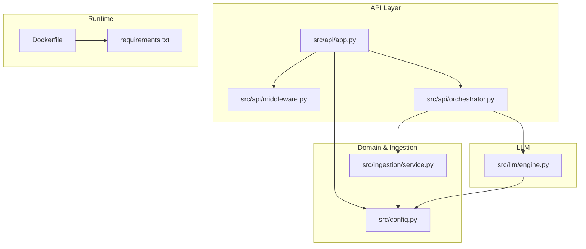
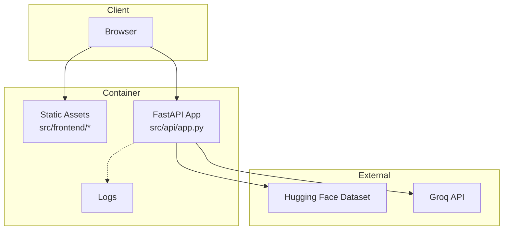
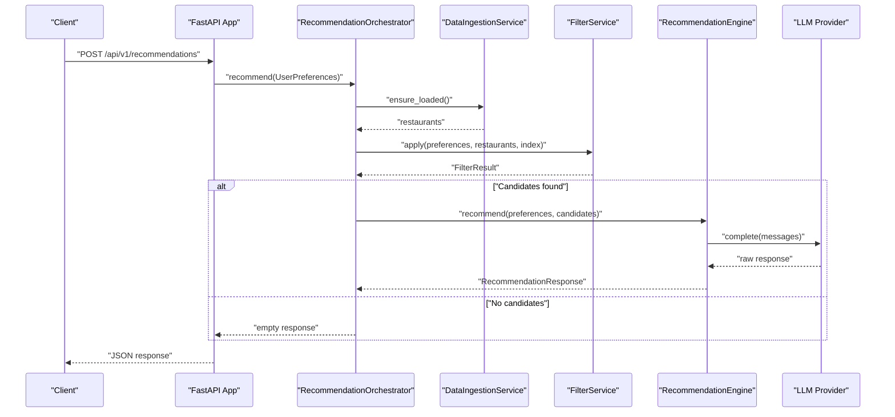
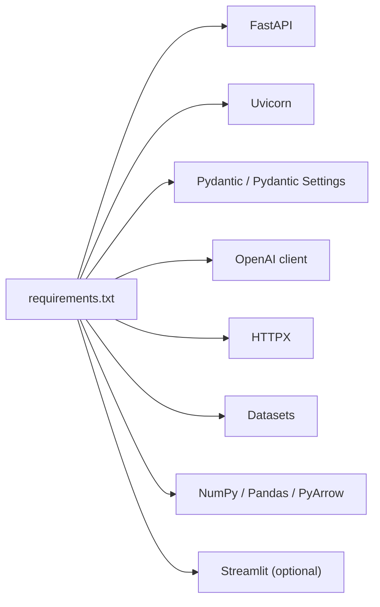

# Deployment and Operations

<cite>
**Referenced Files in This Document**
- [Dockerfile](file://Dockerfile)
- [.github/workflows/ci.yml](file://.github/workflows/ci.yml)
- [requirements.txt](file://requirements.txt)
- [src/config.py](file://src/config.py)
- [src/api/app.py](file://src/api/app.py)
- [src/api/middleware.py](file://src/api/middleware.py)
- [src/api/orchestrator.py](file://src/api/orchestrator.py)
- [src/ingestion/service.py](file://src/ingestion/service.py)
- [src/llm/engine.py](file://src/llm/engine.py)
- [pytest.ini](file://pytest.ini)
- [README.md](file://README.md)
- [docs/architecture.md](file://docs/architecture.md)
- [docs/deployment-plan.md](file://docs/deployment-plan.md)
- [docs/edge-cases.md](file://docs/edge-cases.md)
</cite>

## Table of Contents
1. [Introduction](#introduction)
2. [Project Structure](#project-structure)
3. [Core Components](#core-components)
4. [Architecture Overview](#architecture-overview)
5. [Detailed Component Analysis](#detailed-component-analysis)
6. [Dependency Analysis](#dependency-analysis)
7. [Performance Considerations](#performance-considerations)
8. [Troubleshooting Guide](#troubleshooting-guide)
9. [Conclusion](#conclusion)
10. [Appendices](#appendices)

## Introduction
This document provides comprehensive deployment and operations guidance for the Zomato AI Restaurant Recommendation System. It covers containerization with Docker, CI/CD pipeline configuration, automated testing, production deployment strategies, scaling and load balancing, health monitoring, infrastructure and resource requirements, performance optimization, logging and observability, backup and disaster recovery, security hardening, compliance, and operational runbooks for incident response and maintenance.

## Project Structure
The repository follows a modular structure with clear separation of concerns:
- API layer built with FastAPI and Uvicorn
- Data ingestion and caching pipeline
- Filtering pipeline for candidate selection
- LLM recommendation engine with graceful degradation
- Tests and QA scripts
- Documentation for architecture and deployment plans

**Diagram sources**
- [src/api/app.py:1-254](file://src/api/app.py#L1-L254)
- [src/api/middleware.py:1-38](file://src/api/middleware.py#L1-L38)
- [src/api/orchestrator.py:1-99](file://src/api/orchestrator.py#L1-L99)
- [src/ingestion/service.py:1-162](file://src/ingestion/service.py#L1-L162)
- [src/llm/engine.py:1-191](file://src/llm/engine.py#L1-L191)
- [src/config.py:1-81](file://src/config.py#L1-L81)
- [Dockerfile:1-33](file://Dockerfile#L1-L33)
- [requirements.txt:1-13](file://requirements.txt#L1-L13)

**Section sources**
- [README.md:120-132](file://README.md#L120-L132)
- [Dockerfile:1-33](file://Dockerfile#L1-L33)
- [requirements.txt:1-13](file://requirements.txt#L1-L13)

## Core Components
- FastAPI application with lifecycle hooks to load data and initialize services
- Request logging middleware with request ID propagation
- Recommendation orchestrator coordinating ingestion, filtering, and LLM ranking
- Data ingestion service managing cache, normalization, validation, and indexing
- LLM recommendation engine with degraded mode fallback and structured output parsing
- Configuration management supporting environment variables, .env, and Streamlit secrets

Key operational characteristics:
- Startup readiness guarded by a readiness probe
- Health endpoints for status and readiness
- Structured logging for requests and LLM exchanges
- Graceful degradation when LLM is unavailable or misconfigured

**Section sources**
- [src/api/app.py:42-77](file://src/api/app.py#L42-L77)
- [src/api/app.py:137-156](file://src/api/app.py#L137-L156)
- [src/api/middleware.py:17-38](file://src/api/middleware.py#L17-L38)
- [src/api/orchestrator.py:30-99](file://src/api/orchestrator.py#L30-L99)
- [src/ingestion/service.py:62-162](file://src/ingestion/service.py#L62-L162)
- [src/llm/engine.py:29-191](file://src/llm/engine.py#L29-L191)
- [src/config.py:46-81](file://src/config.py#L46-L81)

## Architecture Overview
The system is container-first with a FastAPI backend serving both API endpoints and static frontend assets. Data is cached locally as Parquet for fast startup and offline operation. External dependencies include the Hugging Face dataset and the Groq LLM API.

**Diagram sources**
- [src/api/app.py:245-254](file://src/api/app.py#L245-L254)
- [src/api/app.py:79-84](file://src/api/app.py#L79-L84)
- [docs/architecture.md:560-586](file://docs/architecture.md#L560-L586)

**Section sources**
- [docs/architecture.md:560-618](file://docs/architecture.md#L560-L618)
- [README.md:63-77](file://README.md#L63-L77)

## Detailed Component Analysis

### Containerization and Image Building
- Base image: Python slim 3.9
- Environment variables: bytecode disabling, unbuffered logs, default port
- System dependencies: minimal build-essential for compatible wheels
- Layering: requirements installed before source to maximize cache hits
- Working directory and copy strategy: source and cache assets included
- Port exposure and command: Uvicorn serves the FastAPI app on the configured port

Operational implications:
- Keep cache artifacts in the image for cold-start performance
- Ensure secrets are injected via environment variables at runtime
- Use multi-stage builds if minimizing image size becomes a priority

**Section sources**
- [Dockerfile:1-33](file://Dockerfile#L1-L33)

### CI/CD Pipeline and Automated Testing
- Trigger: runs on pushes and pull requests to main/master
- Steps: checkout, Python setup, lint/format with Ruff, install dependencies, run tests
- Test configuration: pytest with explicit pythonpath and test directory

Release management:
- Merge to main/master to trigger pipeline
- No explicit artifact publishing or semantic versioning steps in the workflow
- Consider adding build artifacts, container tagging, and registry push for production releases

**Section sources**
- [.github/workflows/ci.yml:1-38](file://.github/workflows/ci.yml#L1-L38)
- [pytest.ini:1-4](file://pytest.ini#L1-L4)

### Configuration Management
- Settings class supports .env, environment variables, and Streamlit secrets
- Key variables include dataset ID, cache path, LLM provider, API key, model, timeouts, and CORS
- Streamlit secrets override environment variables at runtime

Security considerations:
- Prefer environment variables or secret managers over committing credentials
- Validate and sanitize inputs; enforce minimum configurations for LLM provider

**Section sources**
- [src/config.py:46-81](file://src/config.py#L46-L81)
- [README.md:50-61](file://README.md#L50-L61)

### API Lifecycle, Health, and Readiness
- Lifespan loads dataset, initializes services, and sets readiness flag
- Health endpoint reports readiness, data status, and LLM configuration
- Readiness endpoint returns 503 until data is loaded
- CORS middleware configured from settings

Operational guidance:
- Use readiness probes to gate traffic until services are fully initialized
- Monitor health endpoint for startup failures and data load issues

**Section sources**
- [src/api/app.py:42-77](file://src/api/app.py#L42-L77)
- [src/api/app.py:137-156](file://src/api/app.py#L137-L156)
- [src/config.py:65-66](file://src/config.py#L65-L66)

### Request Logging and Observability
- RequestLoggingMiddleware attaches request IDs, measures latency, and logs structured entries
- Application logs include orchestrator timings and LLM exchange summaries
- Optional LLM prompt/response logging to disk controlled by settings

Observability recommendations:
- Forward container logs to centralized logging (e.g., stdout/stderr captured by container runtime)
- Correlate request IDs across API, ingestion, and LLM layers
- Instrument metrics for throughput, latency, error rates, and LLM token usage

**Section sources**
- [src/api/middleware.py:17-38](file://src/api/middleware.py#L17-L38)
- [src/api/orchestrator.py:45-99](file://src/api/orchestrator.py#L45-L99)
- [src/llm/engine.py:175-191](file://src/llm/engine.py#L175-L191)

### Data Ingestion and Caching
- Loads from Hugging Face dataset or local Parquet cache
- Normalizes, validates, assigns budget bands, and builds an index
- Persists cache with metadata for reproducibility

Production considerations:
- Persist cache volume outside the container for faster restarts
- Implement cache invalidation and refresh strategies
- Monitor ingestion stats and known cities count for data quality

**Section sources**
- [src/ingestion/service.py:80-162](file://src/ingestion/service.py#L80-L162)

### LLM Recommendation Engine and Degraded Mode
- Builds prompts, calls LLM client, parses structured output
- Fallback to deterministic ranking when API key is missing or LLM calls fail
- Logs exchanges when enabled

Reliability:
- Enable degraded mode gracefully when LLM is unavailable
- Validate and parse LLM output; retry once on parse errors
- Control temperature, max tokens, and timeout via settings

**Section sources**
- [src/llm/engine.py:45-119](file://src/llm/engine.py#L45-L119)
- [src/llm/engine.py:120-174](file://src/llm/engine.py#L120-L174)

### API Orchestration Flow

**Diagram sources**
- [src/api/app.py:211-243](file://src/api/app.py#L211-L243)
- [src/api/orchestrator.py:45-99](file://src/api/orchestrator.py#L45-L99)
- [src/ingestion/service.py:80-115](file://src/ingestion/service.py#L80-L115)
- [src/llm/engine.py:45-119](file://src/llm/engine.py#L45-L119)

## Dependency Analysis
- Runtime dependencies pinned in requirements.txt
- FastAPI and Uvicorn form the web server stack
- Pydantic and pydantic-settings manage configuration
- Optional UI dependency (streamlit) present for alternate deployment

**Diagram sources**
- [requirements.txt:1-13](file://requirements.txt#L1-L13)

**Section sources**
- [requirements.txt:1-13](file://requirements.txt#L1-L13)

## Performance Considerations
- Startup time: leverage cached Parquet to avoid downloading datasets on every start
- Concurrency: Uvicorn’s default worker model scales with CPU cores
- LLM latency: tune temperature, max tokens, and consider rate limits; enable degraded mode for resilience
- Data locality: keep cache persistent to reduce cold starts
- Monitoring: track filter and LLM durations from orchestrator logs

[No sources needed since this section provides general guidance]

## Troubleshooting Guide
Common issues and remediation:
- Service not ready: readiness probe failing due to dataset load errors; check ingestion logs and cache presence
- Validation errors: incorrect budget or missing fields; adjust request payload or defaults
- Empty results: broaden filters or relax constraints; confirm city resolution and known cities index
- LLM failures: missing or invalid API key; switch to degraded mode or fix credentials
- CORS errors: configure allowed origins in settings; verify wildcard or specific origins
- Health check failures: monitor /health and readiness endpoints; investigate startup exceptions

Operational runbook:
- Verify environment variables and secrets are correctly injected
- Confirm cache exists and is readable
- Review request logs for correlation IDs and error patterns
- Check LLM logs if enabled and inspect retry behavior

**Section sources**
- [docs/edge-cases.md:154-169](file://docs/edge-cases.md#L154-L169)
- [src/api/app.py:107-124](file://src/api/app.py#L107-L124)
- [src/llm/engine.py:64-107](file://src/llm/engine.py#L64-L107)
- [src/config.py:65-70](file://src/config.py#L65-L70)

## Conclusion
The system is designed for container-first deployment with a clear separation of concerns across ingestion, filtering, and LLM ranking. The CI/CD pipeline ensures code quality, while health and readiness endpoints support safe deployments. Production operations benefit from persistent caching, structured logging, and graceful degradation. Scaling and observability can be extended with load balancing, metrics, and centralized logging.

[No sources needed since this section summarizes without analyzing specific files]

## Appendices

### Production Deployment Checklist
- Build and push container images to a registry
- Configure environment variables and secrets at runtime
- Mount persistent volumes for cache and logs
- Set up health checks and readiness probes
- Configure load balancer and autoscaling policies
- Establish logging and alerting for critical events
- Plan rollout strategy (blue/green or rolling updates)

[No sources needed since this section provides general guidance]

### Backup and Disaster Recovery
- Back up cache artifacts and dataset metadata
- Maintain recent container images and manifests
- Automate snapshotting of persistent volumes
- Document restore procedures and RTO/RPO targets

[No sources needed since this section provides general guidance]

### Security Hardening and Compliance
- Enforce least privilege for secrets and environment variables
- Sanitize user inputs and limit payload sizes
- Audit LLM prompt/response logs if enabled
- Comply with data residency and export controls for dataset usage

[No sources needed since this section provides general guidance]