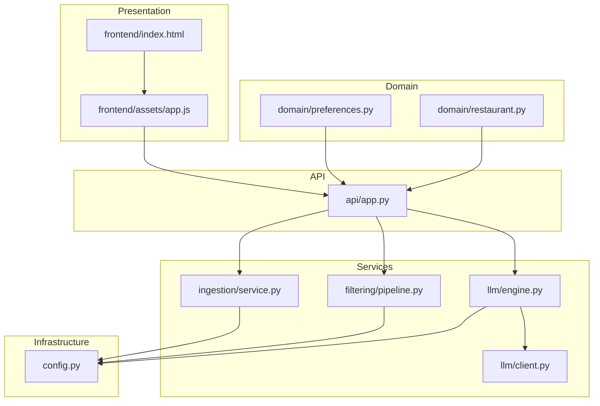
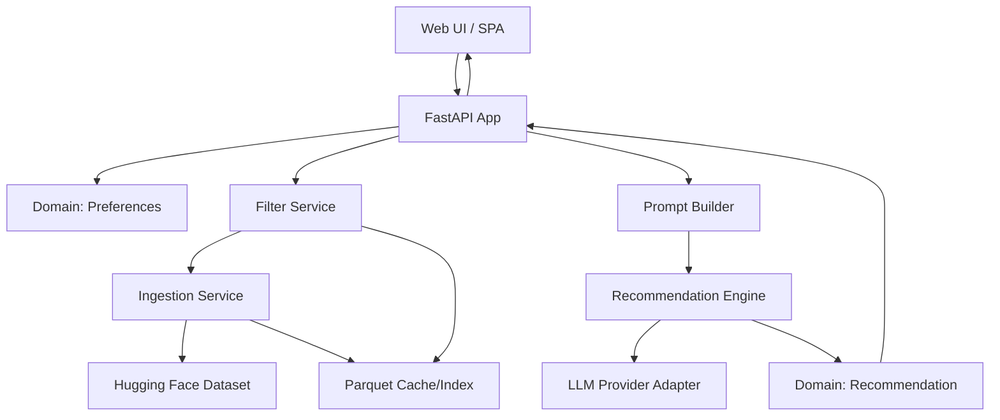
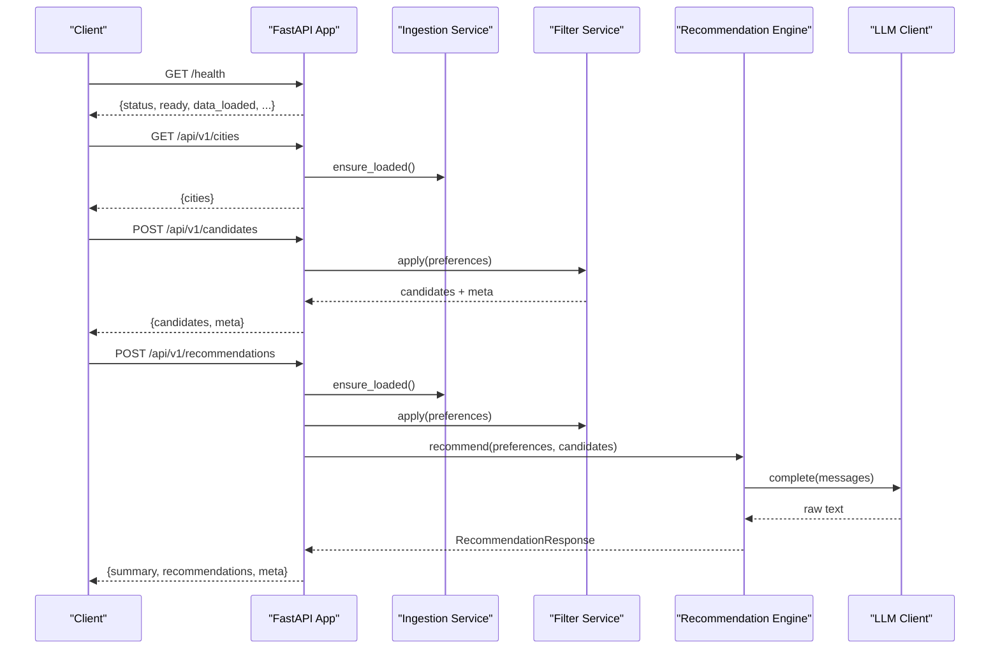
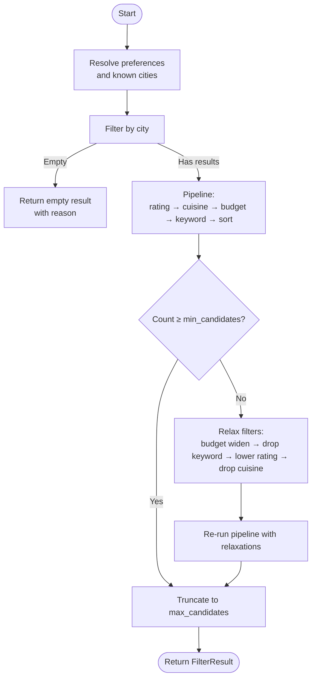
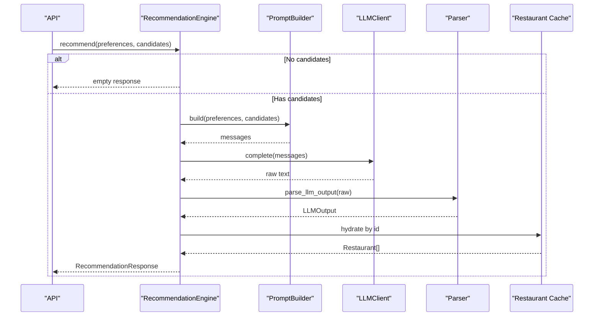
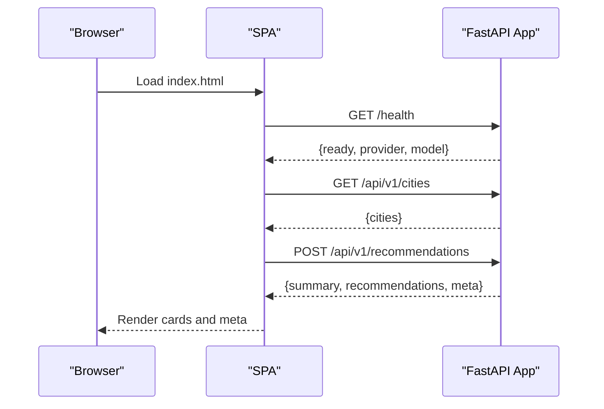
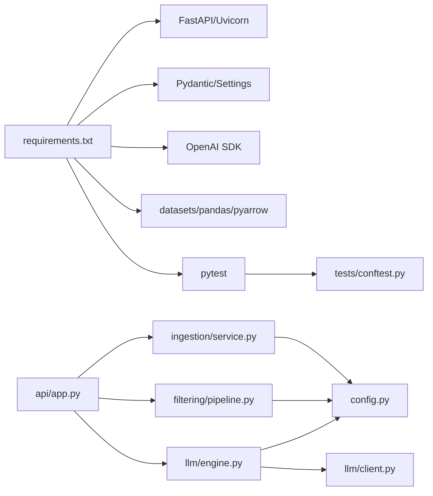

# Development Guidelines

<cite>
**Referenced Files in This Document**
- [README.md](file://README.md)
- [docs/architecture.md](file://docs/architecture.md)
- [src/config.py](file://src/config.py)
- [requirements.txt](file://requirements.txt)
- [pytest.ini](file://pytest.ini)
- [src/api/app.py](file://src/api/app.py)
- [src/domain/preferences.py](file://src/domain/preferences.py)
- [src/domain/restaurant.py](file://src/domain/restaurant.py)
- [src/filtering/pipeline.py](file://src/filtering/pipeline.py)
- [src/llm/engine.py](file://src/llm/engine.py)
- [src/llm/client.py](file://src/llm/client.py)
- [src/ingestion/service.py](file://src/ingestion/service.py)
- [src/frontend/index.html](file://src/frontend/index.html)
- [src/frontend/assets/app.js](file://src/frontend/assets/app.js)
- [tests/conftest.py](file://tests/conftest.py)
</cite>

## Table of Contents
1. [Introduction](#introduction)
2. [Project Structure](#project-structure)
3. [Core Components](#core-components)
4. [Architecture Overview](#architecture-overview)
5. [Detailed Component Analysis](#detailed-component-analysis)
6. [Dependency Analysis](#dependency-analysis)
7. [Performance Considerations](#performance-considerations)
8. [Troubleshooting Guide](#troubleshooting-guide)
9. [Contribution Workflow](#contribution-workflow)
10. [Code Review Guidelines](#code-review-guidelines)
11. [Development Environment Setup](#development-environment-setup)
12. [Best Practices](#best-practices)
13. [Conclusion](#conclusion)

## Introduction
This document provides comprehensive development guidelines for contributing to the Zomato recommendation system. It explains the layered architecture, separation of concerns, component responsibilities, coding standards, documentation requirements, contribution workflows, debugging and profiling techniques, and performance optimization strategies. The system is designed around deterministic filtering followed by an LLM integration layer to produce ranked, explained recommendations with transparency and robustness.

## Project Structure
The repository is organized into distinct layers and modules that align with the logical architecture. Key areas include:
- Domain models for preferences, restaurants, and recommendations
- Ingestion pipeline for dataset loading, normalization, validation, budget band assignment, caching, and indexing
- Filtering pipeline for deterministic candidate selection with configurable relaxation
- LLM integration layer for prompt building, client abstraction, engine orchestration, and response parsing
- API layer built with FastAPI for orchestration, middleware, and endpoint exposure
- Frontend assets and UI for user interaction
- Tests and fixtures for unit and integration validation

**Diagram sources**
- [src/frontend/index.html:1-230](file://src/frontend/index.html#L1-L230)
- [src/frontend/assets/app.js:1-333](file://src/frontend/assets/app.js#L1-L333)
- [src/api/app.py:1-254](file://src/api/app.py#L1-L254)
- [src/ingestion/service.py:1-162](file://src/ingestion/service.py#L1-L162)
- [src/filtering/pipeline.py:1-204](file://src/filtering/pipeline.py#L1-L204)
- [src/llm/client.py:1-64](file://src/llm/client.py#L1-L64)
- [src/llm/engine.py:1-191](file://src/llm/engine.py#L1-L191)
- [src/config.py:1-81](file://src/config.py#L1-L81)
- [src/domain/preferences.py:1-29](file://src/domain/preferences.py#L1-L29)
- [src/domain/restaurant.py:1-26](file://src/domain/restaurant.py#L1-L26)

**Section sources**
- [README.md:120-132](file://README.md#L120-L132)
- [docs/architecture.md:654-690](file://docs/architecture.md#L654-L690)

## Core Components
- Domain models define strongly typed preferences, restaurant entities, and recommendation outputs with Pydantic validation.
- Ingestion service loads data from Hugging Face, normalizes and validates rows, computes budget bands, builds indexes, caches results, and exposes stats.
- Filter service applies deterministic rules (location, rating, cuisine, budget, optional keywords), sorts, truncates, and supports configurable relaxation to ensure a minimum number of candidates.
- LLM client abstraction supports multiple providers (Groq, Ollama, Mock) with a unified interface; the engine orchestrates prompt building, LLM invocation, parsing, hydration, and degraded mode fallback.
- API application wires services, exposes health/readiness endpoints, and serves the SPA assets.
- Frontend provides a responsive UI with live status, form submission, loading states, results rendering, and error handling.

**Section sources**
- [src/domain/preferences.py:1-29](file://src/domain/preferences.py#L1-L29)
- [src/domain/restaurant.py:1-26](file://src/domain/restaurant.py#L1-L26)
- [src/ingestion/service.py:62-162](file://src/ingestion/service.py#L62-L162)
- [src/filtering/pipeline.py:31-204](file://src/filtering/pipeline.py#L31-L204)
- [src/llm/client.py:15-64](file://src/llm/client.py#L15-L64)
- [src/llm/engine.py:29-191](file://src/llm/engine.py#L29-L191)
- [src/api/app.py:79-254](file://src/api/app.py#L79-L254)
- [src/frontend/index.html:1-230](file://src/frontend/index.html#L1-L230)
- [src/frontend/assets/app.js:1-333](file://src/frontend/assets/app.js#L1-L333)

## Architecture Overview
The system follows a five-layer logical architecture:
- Presentation: Web UI and SPA
- Application: FastAPI orchestration and middleware
- Domain: Core data models
- Services: Ingestion, filtering, prompt building, and recommendation engine
- Infrastructure: External integrations (Hugging Face, LLM providers), caching, and configuration

**Diagram sources**
- [docs/architecture.md:95-137](file://docs/architecture.md#L95-L137)
- [src/api/app.py:79-254](file://src/api/app.py#L79-L254)
- [src/ingestion/service.py:80-162](file://src/ingestion/service.py#L80-L162)
- [src/filtering/pipeline.py:42-103](file://src/filtering/pipeline.py#L42-L103)
- [src/llm/engine.py:45-118](file://src/llm/engine.py#L45-L118)
- [src/llm/client.py:37-63](file://src/llm/client.py#L37-L63)
- [src/domain/preferences.py:15-28](file://src/domain/preferences.py#L15-L28)
- [src/domain/restaurant.py:16-25](file://src/domain/restaurant.py#L16-L25)

## Detailed Component Analysis

### API Orchestration and Endpoints
The API initializes services at startup, enforces readiness, and exposes:
- Health and readiness probes
- Cities listing
- Candidate filtering endpoint (deterministic)
- Recommendations endpoint (filter + LLM)

**Diagram sources**
- [src/api/app.py:137-242](file://src/api/app.py#L137-L242)
- [src/ingestion/service.py:80-115](file://src/ingestion/service.py#L80-L115)
- [src/filtering/pipeline.py:42-103](file://src/filtering/pipeline.py#L42-L103)
- [src/llm/engine.py:45-118](file://src/llm/engine.py#L45-L118)
- [src/llm/client.py:37-63](file://src/llm/client.py#L37-L63)

**Section sources**
- [src/api/app.py:79-254](file://src/api/app.py#L79-L254)

### Filter Pipeline Logic
The filter service applies a deterministic pipeline with configurable relaxation to ensure a minimum number of candidates.

**Diagram sources**
- [src/filtering/pipeline.py:42-103](file://src/filtering/pipeline.py#L42-L103)
- [src/filtering/pipeline.py:131-203](file://src/filtering/pipeline.py#L131-L203)

**Section sources**
- [src/filtering/pipeline.py:31-204](file://src/filtering/pipeline.py#L31-L204)

### LLM Integration and Degraded Mode
The recommendation engine builds prompts, invokes the LLM client, parses structured output, hydrates results, and falls back to deterministic rankings when necessary.

**Diagram sources**
- [src/llm/engine.py:45-118](file://src/llm/engine.py#L45-L118)
- [src/llm/client.py:37-63](file://src/llm/client.py#L37-L63)

**Section sources**
- [src/llm/engine.py:29-191](file://src/llm/engine.py#L29-L191)
- [src/llm/client.py:15-64](file://src/llm/client.py#L15-L64)

### Frontend Interaction Flow
The SPA communicates with the backend to load cities, submit preferences, and render results with loading and error states.

**Diagram sources**
- [src/frontend/index.html:1-230](file://src/frontend/index.html#L1-L230)
- [src/frontend/assets/app.js:96-193](file://src/frontend/assets/app.js#L96-L193)
- [src/api/app.py:137-242](file://src/api/app.py#L137-L242)

**Section sources**
- [src/frontend/index.html:1-230](file://src/frontend/index.html#L1-L230)
- [src/frontend/assets/app.js:1-333](file://src/frontend/assets/app.js#L1-L333)

## Dependency Analysis
- External libraries are declared in requirements.txt and include FastAPI, Uvicorn, Pydantic, Pydantic Settings, OpenAI SDK, HTTPX, pytest, datasets, pandas, numpy, pyarrow, and streamlit.
- The API depends on ingestion, filtering, and LLM modules; ingestion depends on configuration and data utilities; filtering depends on domain models and configuration; LLM engine depends on client abstraction and prompt builder.
- Tests rely on shared fixtures for normalization, validation, and budget assignment.

**Diagram sources**
- [requirements.txt:1-13](file://requirements.txt#L1-L13)
- [src/api/app.py:15-31](file://src/api/app.py#L15-L31)
- [src/ingestion/service.py:10-17](file://src/ingestion/service.py#L10-L17)
- [src/filtering/pipeline.py:9-23](file://src/filtering/pipeline.py#L9-L23)
- [src/llm/engine.py:12-24](file://src/llm/engine.py#L12-L24)
- [src/llm/client.py:9-10](file://src/llm/client.py#L9-L10)
- [src/config.py:46-80](file://src/config.py#L46-L80)
- [tests/conftest.py:5-61](file://tests/conftest.py#L5-L61)

**Section sources**
- [requirements.txt:1-13](file://requirements.txt#L1-L13)
- [pytest.ini:1-4](file://pytest.ini#L1-L4)

## Performance Considerations
- Filter performance target: sub-200 ms on cached data; monitor warnings when exceeded.
- LLM round-trip target: under 5 s typical for Groq; reduce MAX_CANDIDATES and keep prompts concise.
- Startup cold start: downloading and processing the dataset; warm requests leverage cache and LLM only.
- Recommendations: cap top-N shown and avoid unnecessary retries; enable prompt logging only when needed for diagnostics.

**Section sources**
- [src/filtering/pipeline.py:88-89](file://src/filtering/pipeline.py#L88-L89)
- [docs/architecture.md:644-651](file://docs/architecture.md#L644-L651)

## Troubleshooting Guide
Common issues and resolutions:
- Service not ready: health/ready endpoints return 503 until ingestion completes; check dataset load logs.
- Validation errors: API returns 422 with detailed field errors; ensure preferences meet constraints.
- LLM failures: degraded mode returns top-K deterministic results with a template explanation; verify API key and provider settings.
- Empty results: UI suggests relaxing filters; confirm candidates were produced by the filter pipeline.
- Network/UI connectivity: SPA polls /health and displays status; ensure the server is running and reachable.

**Section sources**
- [src/api/app.py:107-113](file://src/api/app.py#L107-L113)
- [src/api/app.py:97-104](file://src/api/app.py#L97-L104)
- [src/llm/engine.py:82-107](file://src/llm/engine.py#L82-L107)
- [src/frontend/assets/app.js:96-115](file://src/frontend/assets/app.js#L96-L115)

## Contribution Workflow
- Fork and branch: Create feature branches from main; keep branches focused and short-lived.
- Commit hygiene: Write clear, imperative commit messages; reference related issues.
- Tests: Add unit tests and integration tests; run pytest locally before opening a pull request.
- Documentation: Update docs/architecture.md and README.md as needed; keep inline docstrings concise and meaningful.
- Environment: Use the provided virtual environment and requirements; verify setup with the commands in README.
- Pull requests: Include a summary of changes, rationale, and test coverage; request reviews from maintainers.

**Section sources**
- [README.md:12-19](file://README.md#L12-L19)
- [pytest.ini:1-4](file://pytest.ini#L1-L4)

## Code Review Guidelines
Review checklist:
- Architecture alignment: Does the change respect layer boundaries and separation of concerns?
- Domain correctness: Are Pydantic models and validators used consistently?
- Determinism: Filtering remains deterministic; LLM is used for ranking only after narrowing candidates.
- Error handling: Prefer explicit exceptions and graceful degradation; surface actionable messages.
- Logging: Include structured logs with request IDs and timing metrics where appropriate.
- Configuration: Use Settings for environment-driven behavior; avoid hardcoded values.
- Tests: Ensure unit and integration coverage; snapshot tests for prompt stability.

**Section sources**
- [docs/architecture.md:37-43](file://docs/architecture.md#L37-L43)
- [src/config.py:46-80](file://src/config.py#L46-L80)

## Development Environment Setup
- Virtual environment and dependencies:
  - Create and activate a virtual environment
  - Install dependencies from requirements.txt
  - Copy .env.example to .env and configure environment variables
- Running ingestion:
  - Load and cache the dataset; use refresh flag to bypass cache
  - Inspect sample rows
- Running the API:
  - Start the server with hot reload
  - Access health, readiness, and OpenAPI docs
- Running the filter demo:
  - Execute the filtering demo with user preferences
- Running LLM demos:
  - Use mock provider for offline demos
  - Configure Groq provider with API key for production-like behavior
- Running tests:
  - Execute pytest with verbose output

**Section sources**
- [README.md:12-19](file://README.md#L12-L19)
- [README.md:21-41](file://README.md#L21-L41)
- [README.md:44-61](file://README.md#L44-L61)
- [README.md:63-76](file://README.md#L63-L76)
- [README.md:78-84](file://README.md#L78-L84)
- [README.md:112-118](file://README.md#L112-L118)

## Best Practices
- Coding standards:
  - Use Pydantic models for data contracts; enforce constraints via validators
  - Keep functions pure where possible; isolate side effects (I/O, logging)
  - Favor explicit error signaling over silent failures
- Naming conventions:
  - Modules: kebab-case or snake_case; avoid abbreviations
  - Classes: PascalCase; methods/functions: snake_case
  - Constants: UPPER_SNAKE_CASE
- Documentation:
  - Add docstrings for modules, classes, and public functions
  - Update architecture and context documents when changing behavior
- Refactoring:
  - Extract small, focused changes; preserve behavior under tests
  - Maintain backward compatibility for APIs and configuration keys
- Observability:
  - Log at appropriate levels; include request IDs and durations
  - Track metrics for success rates, degraded mode usage, and empty results
- Security:
  - Never commit secrets; use environment variables and settings overrides
  - Sanitize user inputs and limit lengths for free-text fields

**Section sources**
- [src/domain/preferences.py:15-28](file://src/domain/preferences.py#L15-L28)
- [src/domain/restaurant.py:16-25](file://src/domain/restaurant.py#L16-L25)
- [src/config.py:46-80](file://src/config.py#L46-L80)
- [docs/architecture.md:610-651](file://docs/architecture.md#L610-L651)

## Conclusion
This guide consolidates the architectural principles, component responsibilities, and development practices for the Zomato recommendation system. By adhering to layered design, deterministic filtering, robust LLM integration, and disciplined testing and documentation, contributors can deliver reliable, transparent, and efficient recommendations that scale with minimal risk.