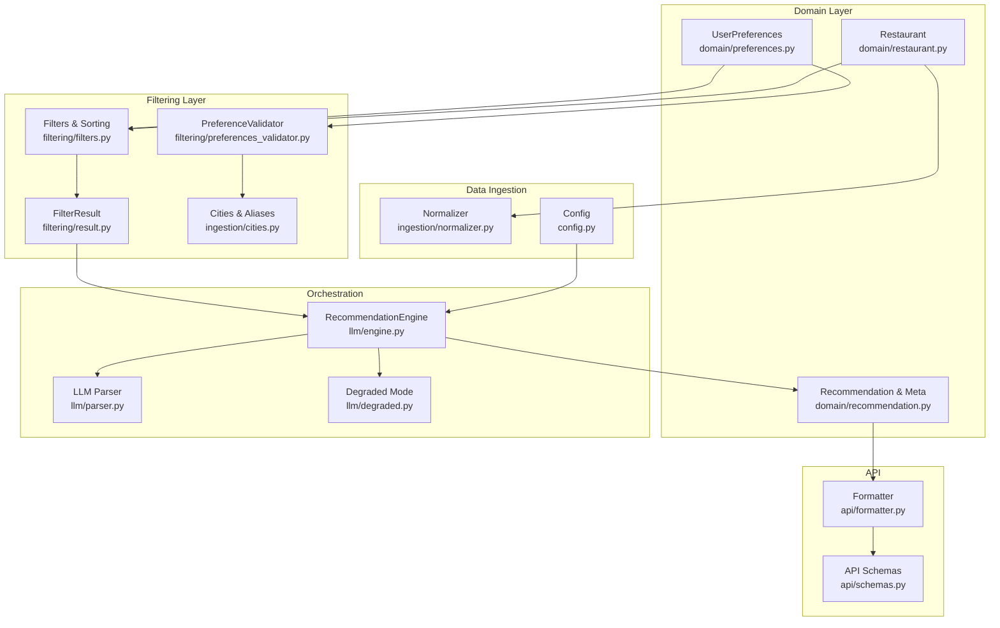
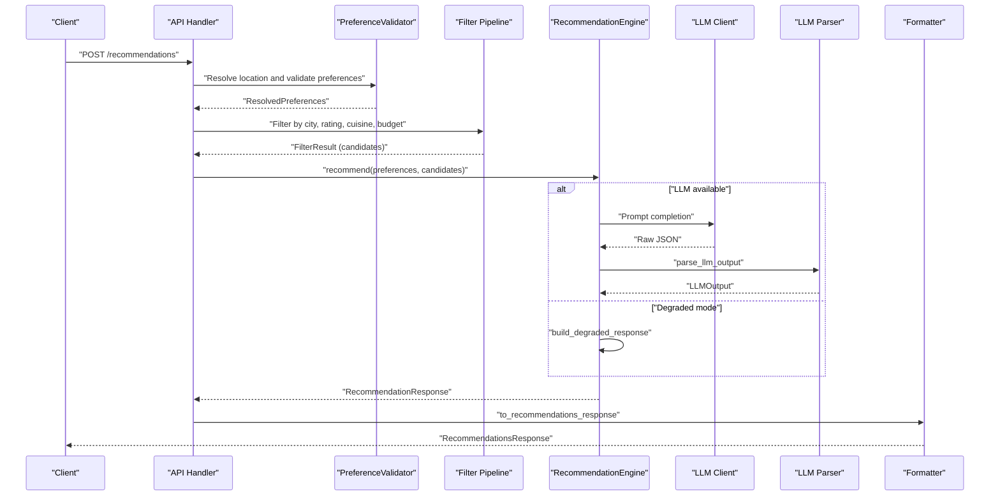
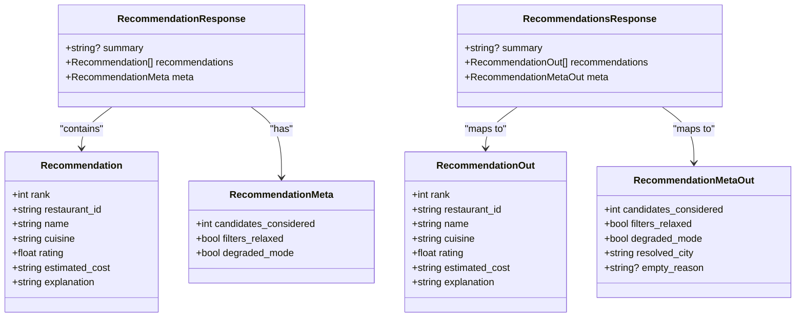
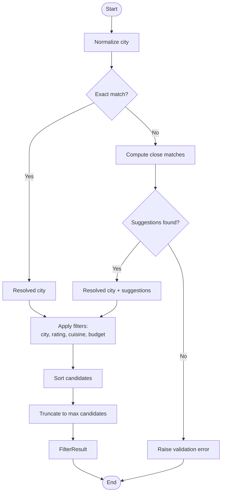
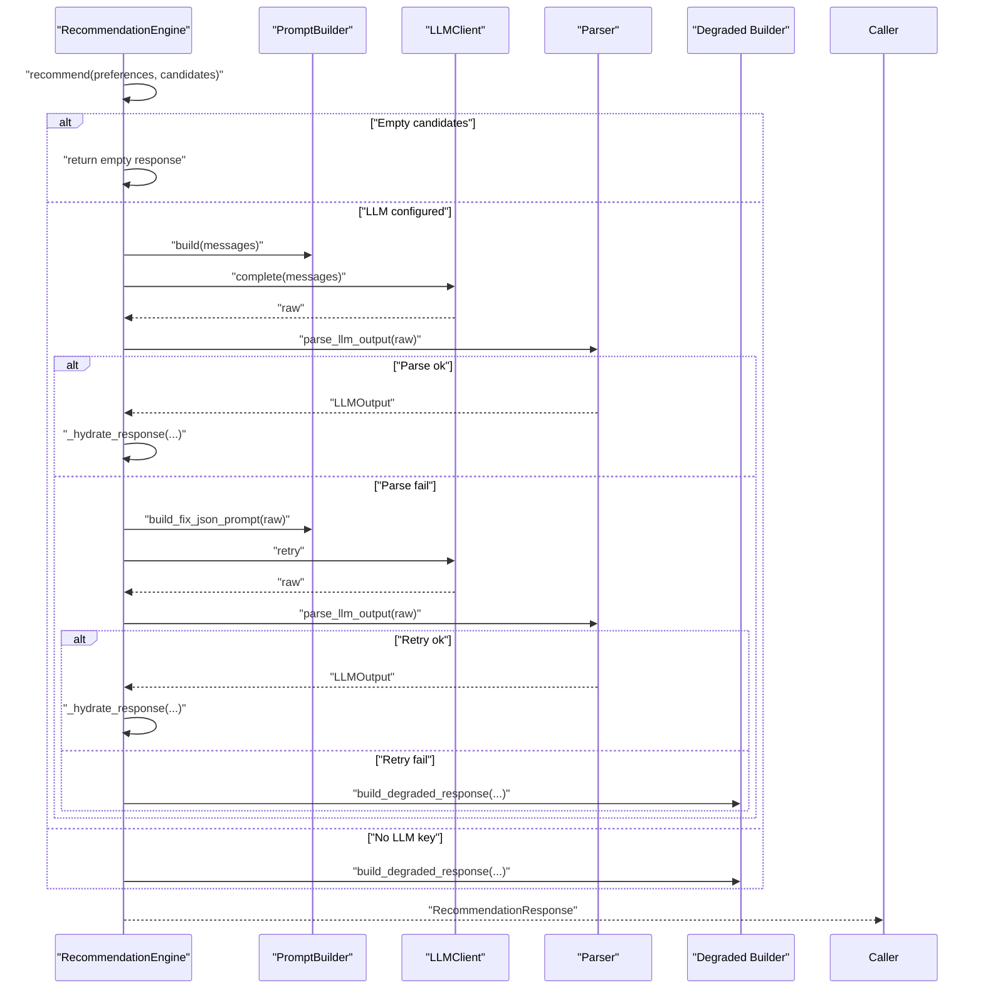
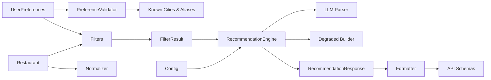

# Domain Models

<cite>
**Referenced Files in This Document**
- [preferences.py](file://src/domain/preferences.py)
- [restaurant.py](file://src/domain/restaurant.py)
- [recommendation.py](file://src/domain/recommendation.py)
- [preferences_validator.py](file://src/filtering/preferences_validator.py)
- [filters.py](file://src/filtering/filters.py)
- [result.py](file://src/filtering/result.py)
- [cities.py](file://src/ingestion/cities.py)
- [schemas.py](file://src/api/schemas.py)
- [formatter.py](file://src/api/formatter.py)
- [engine.py](file://src/llm/engine.py)
- [parser.py](file://src/llm/parser.py)
- [degraded.py](file://src/llm/degraded.py)
- [normalizer.py](file://src/ingestion/normalizer.py)
- [config.py](file://src/config.py)
</cite>

## Table of Contents
1. [Introduction](#introduction)
2. [Project Structure](#project-structure)
3. [Core Components](#core-components)
4. [Architecture Overview](#architecture-overview)
5. [Detailed Component Analysis](#detailed-component-analysis)
6. [Dependency Analysis](#dependency-analysis)
7. [Performance Considerations](#performance-considerations)
8. [Troubleshooting Guide](#troubleshooting-guide)
9. [Conclusion](#conclusion)

## Introduction
This document defines the core business domain models for the recommendation system and explains how they interact across the filtering, orchestration, and presentation layers. It covers:
- UserPreferences: validation rules, preference resolution, and input processing
- Restaurant: location, rating, budget, and cuisine attributes
- Recommendation response: ranking, explanations, and metadata
- Entity relationships, validation constraints, and business rules
- Serialization formats, transformations, and integration with external systems
- Immutability considerations, consistency requirements, and performance implications

## Project Structure
The domain models live under the domain layer and are consumed by filtering, orchestration, and API formatting layers. Supporting modules handle city normalization, preference validation, candidate filtering, and LLM-driven recommendation generation.



**Diagram sources**
- [preferences.py:15-28](file://src/domain/preferences.py#L15-L28)
- [restaurant.py:16-25](file://src/domain/restaurant.py#L16-L25)
- [recommendation.py:8-27](file://src/domain/recommendation.py#L8-L27)
- [preferences_validator.py:28-68](file://src/filtering/preferences_validator.py#L28-L68)
- [filters.py:27-124](file://src/filtering/filters.py#L27-L124)
- [result.py:11-19](file://src/filtering/result.py#L11-L19)
- [cities.py:15-48](file://src/ingestion/cities.py#L15-L48)
- [engine.py:29-173](file://src/llm/engine.py#L29-L173)
- [parser.py:14-45](file://src/llm/parser.py#L14-L45)
- [degraded.py:34-66](file://src/llm/degraded.py#L34-L66)
- [schemas.py:13-79](file://src/api/schemas.py#L13-L79)
- [formatter.py:16-44](file://src/api/formatter.py#L16-L44)
- [normalizer.py:67-97](file://src/ingestion/normalizer.py#L67-L97)
- [config.py:46-80](file://src/config.py#L46-L80)

**Section sources**
- [preferences.py:1-28](file://src/domain/preferences.py#L1-L28)
- [restaurant.py:1-25](file://src/domain/restaurant.py#L1-L25)
- [recommendation.py:1-27](file://src/domain/recommendation.py#L1-L27)
- [preferences_validator.py:1-75](file://src/filtering/preferences_validator.py#L1-L75)
- [filters.py:1-124](file://src/filtering/filters.py#L1-L124)
- [result.py:1-19](file://src/filtering/result.py#L1-L19)
- [cities.py:1-91](file://src/ingestion/cities.py#L1-L91)
- [engine.py:1-190](file://src/llm/engine.py#L1-L190)
- [parser.py:1-45](file://src/llm/parser.py#L1-L45)
- [degraded.py:1-66](file://src/llm/degraded.py#L1-L66)
- [schemas.py:1-79](file://src/api/schemas.py#L1-L79)
- [formatter.py:1-48](file://src/api/formatter.py#L1-L48)
- [normalizer.py:1-97](file://src/ingestion/normalizer.py#L1-L97)
- [config.py:1-80](file://src/config.py#L1-L80)

## Core Components
This section documents the three primary domain models and their roles.

- UserPreferences
  - Purpose: Captures user intent for recommendations with validated constraints.
  - Key fields and constraints:
    - location: Required, non-empty after stripping
    - budget: Enum {low, medium, high}
    - cuisine: Optional; used for keyword matching
    - min_rating: Float with inclusive bounds [0.0, 5.0]
    - additional_preferences: Optional; soft keyword filter input
  - Validation:
    - Location validator rejects empty or whitespace-only inputs.
    - Pydantic Field validators enforce numeric bounds for ratings.
    - API-level sanitization strips HTML and collapses whitespace for string fields.

- Restaurant
  - Purpose: Represents a candidate restaurant with location, rating, budget alignment, and cuisine.
  - Key fields:
    - id, name, location, city
    - cuisines: list of strings
    - rating: float
    - approximate_cost_for_two: optional integer
    - budget_band: Enum {low, medium, high, unknown}
    - raw_attributes: dict for preserving original ingestion fields
  - Business rules:
    - Cost parsing supports ranges and currency normalization.
    - City extraction leverages aliases and known city sets.

- Recommendation and Metadata
  - Recommendation:
    - Fields: rank, restaurant_id, name, cuisine, rating, estimated_cost, explanation
  - RecommendationMeta:
    - candidates_considered: count of candidates evaluated
    - filters_relaxed: whether filters were relaxed during processing
    - degraded_mode: whether response was generated in degraded mode
  - RecommendationResponse:
    - summary: optional narrative
    - recommendations: list of Recommendation
    - meta: RecommendationMeta

**Section sources**
- [preferences.py:9-28](file://src/domain/preferences.py#L9-L28)
- [schemas.py:13-31](file://src/api/schemas.py#L13-L31)
- [restaurant.py:9-25](file://src/domain/restaurant.py#L9-L25)
- [normalizer.py:15-50](file://src/ingestion/normalizer.py#L15-L50)
- [recommendation.py:8-27](file://src/domain/recommendation.py#L8-L27)

## Architecture Overview
The recommendation pipeline transforms user preferences into ranked recommendations via filtering and optional LLM ranking.



**Diagram sources**
- [preferences_validator.py:37-68](file://src/filtering/preferences_validator.py#L37-L68)
- [filters.py:27-124](file://src/filtering/filters.py#L27-L124)
- [engine.py:45-173](file://src/llm/engine.py#L45-L173)
- [parser.py:36-45](file://src/llm/parser.py#L36-L45)
- [formatter.py:16-44](file://src/api/formatter.py#L16-L44)

## Detailed Component Analysis

### UserPreferences Model
- Validation rules
  - Location: Stripped non-empty requirement enforced by a field validator.
  - Rating: Enforced via Pydantic Field constraints [0.0, 5.0].
  - String inputs sanitized at API boundary to remove HTML tags and normalize whitespace.
- Preference resolution
  - City normalization and known-city lookup performed by PreferenceValidator using ingestion utilities.
  - Suggestions returned when exact match fails, enabling robust fuzzy matching.
- Input processing
  - API schemas define max lengths and sanitization for user-provided strings.

```mermaid
classDiagram
class Budget {
<<enum>>
"low"
"medium"
"high"
}
class UserPreferences {
+string location
+Budget budget
+string? cuisine
+float min_rating
+string? additional_preferences
+location_not_empty(value) string
}
class RecommendationRequest {
+string location
+Budget budget
+string? cuisine
+float min_rating
+string? additional_preferences
+sanitize_strings(v) any
}
UserPreferences <.. RecommendationRequest : "validated by"
```

**Diagram sources**
- [preferences.py:9-28](file://src/domain/preferences.py#L9-L28)
- [schemas.py:13-31](file://src/api/schemas.py#L13-L31)

**Section sources**
- [preferences.py:22-28](file://src/domain/preferences.py#L22-L28)
- [schemas.py:20-30](file://src/api/schemas.py#L20-L30)
- [preferences_validator.py:37-68](file://src/filtering/preferences_validator.py#L37-L68)
- [cities.py:51-59](file://src/ingestion/cities.py#L51-L59)

### Restaurant Entity
- Attributes
  - Identity: id, name
  - Location: city, location
  - Cuisines: list of strings
  - Quality: rating
  - Cost: approximate_cost_for_two (optional)
  - Budget alignment: budget_band (UNKNOWN until enrichment)
  - Raw attributes preserved for provenance and debugging
- Data normalization
  - Ratings parsed from varied formats with bounds checking.
  - Costs normalized from currency strings and ranges.
  - Cuisines split from comma-separated lists.
  - City extracted from address or fallback to normalized city name.

```mermaid
classDiagram
class BudgetBand {
<<enum>>
"low"
"medium"
"high"
"unknown"
}
class Restaurant {
+string id
+string name
+string location
+string city
+string[] cuisines
+float rating
+int? approximate_cost_for_two
+BudgetBand budget_band
+dict raw_attributes
}
```

**Diagram sources**
- [restaurant.py:9-25](file://src/domain/restaurant.py#L9-L25)
- [normalizer.py:67-97](file://src/ingestion/normalizer.py#L67-L97)

**Section sources**
- [restaurant.py:16-25](file://src/domain/restaurant.py#L16-L25)
- [normalizer.py:15-50](file://src/ingestion/normalizer.py#L15-L50)
- [normalizer.py:67-97](file://src/ingestion/normalizer.py#L67-L97)

### Recommendation Response
- Structure
  - Recommendation: rank, restaurant_id, name, cuisine, rating, estimated_cost, explanation
  - RecommendationMeta: candidates_considered, filters_relaxed, degraded_mode
  - RecommendationResponse: summary, recommendations, meta
- Formatting and serialization
  - API schemas define output shapes for clients.
  - Formatter maps domain RecommendationResponse to API schemas, rounding ratings and enriching metadata.
- Degraded mode
  - When LLM is unavailable, basic ranking is produced with template explanations.



**Diagram sources**
- [recommendation.py:8-27](file://src/domain/recommendation.py#L8-L27)
- [schemas.py:58-79](file://src/api/schemas.py#L58-L79)
- [formatter.py:16-44](file://src/api/formatter.py#L16-L44)

**Section sources**
- [recommendation.py:8-27](file://src/domain/recommendation.py#L8-L27)
- [schemas.py:58-79](file://src/api/schemas.py#L58-L79)
- [formatter.py:16-44](file://src/api/formatter.py#L16-L44)
- [degraded.py:34-66](file://src/llm/degraded.py#L34-L66)

### Preference Resolution and Filtering Pipeline
- Preference resolution
  - Normalizes user input city, compares against known cities, and suggests alternatives when exact match fails.
- Filtering
  - Applies city, rating, cuisine, and budget filters; supports relaxed budget bands.
  - Keyword filtering uses soft matching when additional preferences are provided.
  - Sorting prioritizes rating, cost fit per budget, and stability.
- Results
  - FilterResult captures candidates, counts, and metadata including suggestions and reasons for emptiness.



**Diagram sources**
- [preferences_validator.py:37-68](file://src/filtering/preferences_validator.py#L37-L68)
- [filters.py:27-124](file://src/filtering/filters.py#L27-L124)
- [result.py:11-19](file://src/filtering/result.py#L11-L19)
- [cities.py:51-59](file://src/ingestion/cities.py#L51-L59)

**Section sources**
- [preferences_validator.py:28-68](file://src/filtering/preferences_validator.py#L28-L68)
- [filters.py:18-124](file://src/filtering/filters.py#L18-L124)
- [result.py:11-19](file://src/filtering/result.py#L11-L19)
- [cities.py:15-48](file://src/ingestion/cities.py#L15-L48)

### LLM Ranking and Explanation Generation
- Engine behavior
  - Validates presence of candidates and builds a prompt.
  - Completes prompt via LLM client and parses structured JSON.
  - Hydrates recommendations by aligning parsed items with candidate restaurants.
  - Falls back to degraded mode when LLM is unavailable or parsing fails.
- Output hydration
  - Ensures restaurant_id exists and deduplicates entries.
  - Formats cuisines and costs for display.
  - Generates default explanations when missing.



**Diagram sources**
- [engine.py:45-173](file://src/llm/engine.py#L45-L173)
- [parser.py:36-45](file://src/llm/parser.py#L36-L45)
- [degraded.py:34-66](file://src/llm/degraded.py#L34-L66)

**Section sources**
- [engine.py:29-173](file://src/llm/engine.py#L29-L173)
- [parser.py:14-45](file://src/llm/parser.py#L14-L45)
- [degraded.py:12-66](file://src/llm/degraded.py#L12-L66)

## Dependency Analysis
- Domain models are immutable Pydantic models, ensuring data integrity and predictable serialization.
- Filtering depends on domain enums and models; it does not mutate inputs but produces new filtered lists and metadata.
- Orchestration composes filtering results with LLM parsing and degraded fallbacks.
- API formatting maps domain models to stable output schemas, rounding and enriching fields for clients.



**Diagram sources**
- [preferences.py:15-28](file://src/domain/preferences.py#L15-L28)
- [preferences_validator.py:28-68](file://src/filtering/preferences_validator.py#L28-L68)
- [cities.py:15-48](file://src/ingestion/cities.py#L15-L48)
- [filters.py:27-124](file://src/filtering/filters.py#L27-L124)
- [result.py:11-19](file://src/filtering/result.py#L11-L19)
- [engine.py:45-173](file://src/llm/engine.py#L45-L173)
- [parser.py:36-45](file://src/llm/parser.py#L36-L45)
- [degraded.py:34-66](file://src/llm/degraded.py#L34-L66)
- [recommendation.py:24-27](file://src/domain/recommendation.py#L24-L27)
- [formatter.py:16-44](file://src/api/formatter.py#L16-L44)
- [schemas.py:58-79](file://src/api/schemas.py#L58-L79)
- [normalizer.py:67-97](file://src/ingestion/normalizer.py#L67-L97)
- [config.py:46-80](file://src/config.py#L46-L80)

**Section sources**
- [preferences.py:15-28](file://src/domain/preferences.py#L15-L28)
- [restaurant.py:16-25](file://src/domain/restaurant.py#L16-L25)
- [recommendation.py:8-27](file://src/domain/recommendation.py#L8-L27)
- [preferences_validator.py:28-68](file://src/filtering/preferences_validator.py#L28-L68)
- [filters.py:18-124](file://src/filtering/filters.py#L18-L124)
- [engine.py:45-173](file://src/llm/engine.py#L45-L173)
- [formatter.py:16-44](file://src/api/formatter.py#L16-L44)
- [schemas.py:58-79](file://src/api/schemas.py#L58-L79)
- [normalizer.py:67-97](file://src/ingestion/normalizer.py#L67-L97)
- [config.py:46-80](file://src/config.py#L46-L80)

## Performance Considerations
- Immutability and Pydantic models
  - Immutable domain models reduce accidental mutation and simplify concurrency.
  - Pydantic validation occurs at boundaries, minimizing runtime checks inside hot loops.
- Filtering and sorting
  - Sorting keys prioritize rating and cost fit per budget to minimize downstream recomputation.
  - Early truncation reduces memory footprint for large candidate sets.
- LLM integration
  - Degraded mode avoids expensive LLM calls when unavailable, maintaining responsiveness.
  - Logging prompts can be toggled to balance observability and overhead.
- Data ingestion
  - Normalization consolidates heterogeneous formats early, reducing per-record processing overhead.

[No sources needed since this section provides general guidance]

## Troubleshooting Guide
- Location resolution failures
  - Symptom: Validation errors indicating no restaurants found for the location.
  - Action: Review city normalization and known city sets; leverage suggestions returned by the resolver.
- Empty recommendation sets
  - Causes: No candidates after filtering; budget relaxation may be indicated in meta.
  - Action: Relax filters or adjust preferences; check FilterResult for empty_reason.
- LLM-related issues
  - Symptoms: Degraded mode activation, retries, or parse errors.
  - Action: Verify API key/provider configuration; inspect logs if enabled; confirm JSON schema compliance.
- Rating and cost parsing
  - Symptoms: Unexpected None values for rating or cost.
  - Action: Inspect raw ingestion fields; ensure formats match normalization expectations.

**Section sources**
- [preferences_validator.py:13-18](file://src/filtering/preferences_validator.py#L13-L18)
- [preferences_validator.py:62-68](file://src/filtering/preferences_validator.py#L62-L68)
- [engine.py:64-90](file://src/llm/engine.py#L64-L90)
- [engine.py:91-107](file://src/llm/engine.py#L91-L107)
- [normalizer.py:15-50](file://src/ingestion/normalizer.py#L15-L50)

## Conclusion
The domain models form a cohesive foundation for the recommendation system:
- UserPreferences enforces strong validation and sanitization at the edges.
- Restaurant encapsulates normalized attributes with budget alignment and provenance.
- RecommendationResponse provides a stable, explainable output with metadata for observability.
Together with filtering, orchestration, and formatting layers, they deliver a robust, resilient, and performant recommendation pipeline.