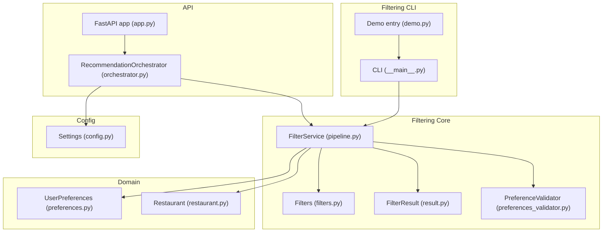
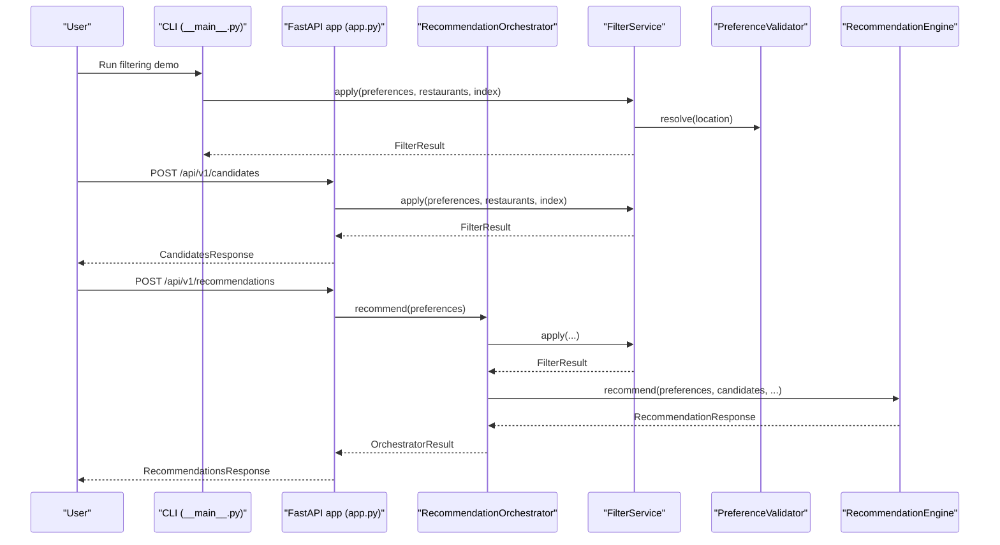
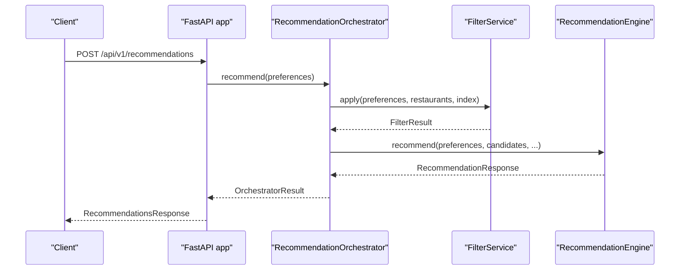
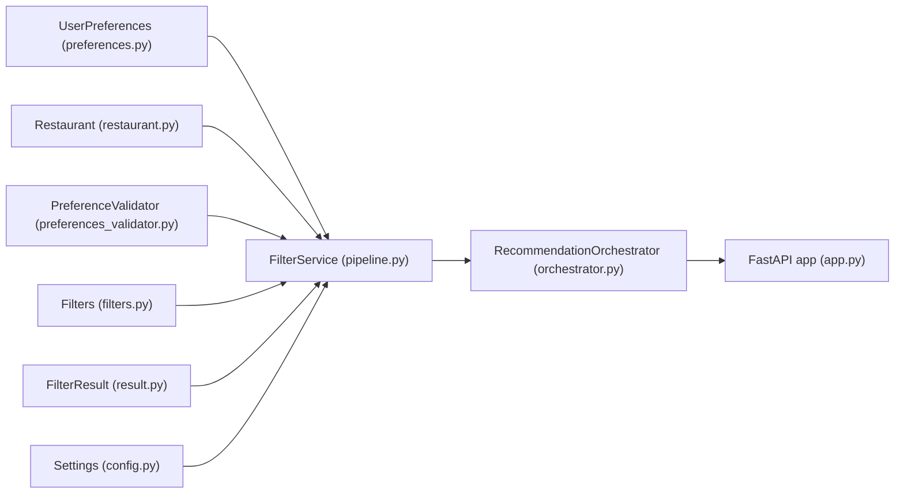

# Demo and Usage Examples

<cite>
**Referenced Files in This Document**
- [__main__.py](file://src/filtering/__main__.py)
- [demo.py](file://src/filtering/demo.py)
- [filters.py](file://src/filtering/filters.py)
- [pipeline.py](file://src/filtering/pipeline.py)
- [preferences_validator.py](file://src/filtering/preferences_validator.py)
- [result.py](file://src/filtering/result.py)
- [preferences.py](file://src/domain/preferences.py)
- [restaurant.py](file://src/domain/restaurant.py)
- [config.py](file://src/config.py)
- [orchestrator.py](file://src/api/orchestrator.py)
- [app.py](file://src/api/app.py)
- [test_filters.py](file://tests/test_filters.py)
- [test_pipeline.py](file://tests/test_pipeline.py)
- [test_preferences_validator.py](file://tests/test_preferences_validator.py)
</cite>

## Table of Contents
1. [Introduction](#introduction)
2. [Project Structure](#project-structure)
3. [Core Components](#core-components)
4. [Architecture Overview](#architecture-overview)
5. [Detailed Component Analysis](#detailed-component-analysis)
6. [Dependency Analysis](#dependency-analysis)
7. [Performance Considerations](#performance-considerations)
8. [Troubleshooting Guide](#troubleshooting-guide)
9. [Conclusion](#conclusion)
10. [Appendices](#appendices)

## Introduction
This document provides practical, hands-on guidance for using the filtering system. It covers:
- Command-line demos and interactive CLI usage
- API endpoints for deterministic filtering and recommendation
- Step-by-step tutorials for common scenarios: basic location-based filtering, multi-criteria searches, and edge-case handling
- Preference combinations, result interpretation, and troubleshooting
- Integration with the broader recommendation pipeline and how filtered results feed into the LLM ranking system
- Performance benchmarking and optimization tips

## Project Structure
The filtering system lives under src/filtering and integrates with the ingestion and API layers:
- Filtering CLI entry points: src/filtering/__main__.py and src/filtering/demo.py
- Core filtering logic: src/filtering/filters.py
- Deterministic pipeline: src/filtering/pipeline.py
- Preference resolution: src/filtering/preferences_validator.py
- Domain models: src/domain/preferences.py, src/domain/restaurant.py
- Configuration: src/config.py
- API orchestration: src/api/orchestrator.py and src/api/app.py
- Tests validating behavior: tests/test_filters.py, tests/test_pipeline.py, tests/test_preferences_validator.py

**Diagram sources**
- [__main__.py:1-73](file://src/filtering/__main__.py#L1-L73)
- [demo.py:1-7](file://src/filtering/demo.py#L1-L7)
- [pipeline.py:1-204](file://src/filtering/pipeline.py#L1-L204)
- [filters.py:1-125](file://src/filtering/filters.py#L1-L125)
- [preferences_validator.py:1-76](file://src/filtering/preferences_validator.py#L1-L76)
- [result.py:1-20](file://src/filtering/result.py#L1-L20)
- [preferences.py:1-29](file://src/domain/preferences.py#L1-L29)
- [restaurant.py:1-26](file://src/domain/restaurant.py#L1-L26)
- [orchestrator.py:1-99](file://src/api/orchestrator.py#L1-L99)
- [app.py:1-254](file://src/api/app.py#L1-L254)
- [config.py:1-81](file://src/config.py#L1-L81)

**Section sources**
- [__main__.py:1-73](file://src/filtering/__main__.py#L1-L73)
- [demo.py:1-7](file://src/filtering/demo.py#L1-L7)
- [pipeline.py:1-204](file://src/filtering/pipeline.py#L1-L204)
- [filters.py:1-125](file://src/filtering/filters.py#L1-L125)
- [preferences_validator.py:1-76](file://src/filtering/preferences_validator.py#L1-L76)
- [result.py:1-20](file://src/filtering/result.py#L1-L20)
- [preferences.py:1-29](file://src/domain/preferences.py#L1-L29)
- [restaurant.py:1-26](file://src/domain/restaurant.py#L1-L26)
- [orchestrator.py:1-99](file://src/api/orchestrator.py#L1-L99)
- [app.py:1-254](file://src/api/app.py#L1-L254)
- [config.py:1-81](file://src/config.py#L1-L81)

## Core Components
- FilterService: Applies a deterministic pipeline of filters and optional relaxation steps to produce a shortlist.
- Filters: Individual filter functions for city, rating, cuisine, budget, keyword soft-filter, sorting, and truncation.
- PreferenceValidator: Normalizes and resolves the user’s location against known cities.
- FilterResult: Typed result container capturing candidates, counts, relaxation steps, and reasons.
- UserPreferences and Restaurant: Pydantic models defining input preferences and restaurant records.
- RecommendationOrchestrator and FastAPI app: Orchestrate filtering and LLM ranking, exposing endpoints for candidates and recommendations.

Key behaviors:
- Pipeline stages: rating → cuisine → budget → keyword soft-filter → sort → truncate
- Relaxation order: widen budget band → drop keyword filter → lower min_rating floor → drop cuisine filter
- Sorting prioritizes rating, then cost fit per budget, then stable ID

**Section sources**
- [pipeline.py:31-203](file://src/filtering/pipeline.py#L31-L203)
- [filters.py:27-125](file://src/filtering/filters.py#L27-L125)
- [preferences_validator.py:28-76](file://src/filtering/preferences_validator.py#L28-L76)
- [result.py:11-20](file://src/filtering/result.py#L11-L20)
- [preferences.py:15-29](file://src/domain/preferences.py#L15-L29)
- [restaurant.py:16-26](file://src/domain/restaurant.py#L16-L26)
- [orchestrator.py:30-99](file://src/api/orchestrator.py#L30-L99)
- [app.py:166-242](file://src/api/app.py#L166-L242)

## Architecture Overview
End-to-end flow from CLI to API to LLM ranking:

**Diagram sources**
- [__main__.py:20-68](file://src/filtering/__main__.py#L20-L68)
- [app.py:166-242](file://src/api/app.py#L166-L242)
- [orchestrator.py:45-98](file://src/api/orchestrator.py#L45-L98)
- [pipeline.py:42-103](file://src/filtering/pipeline.py#L42-L103)
- [preferences_validator.py:37-68](file://src/filtering/preferences_validator.py#L37-L68)

## Detailed Component Analysis

### CLI Filtering Demo
Run the filtering pipeline on cached data and print top-N candidates along with structured metadata.

Usage pattern:
- python -m src.filtering.demo --location "Bangalore" --budget "medium" --cuisine "Italian" --min-rating 4.0 --additional "" --sample 5

Behavior:
- Loads dataset via DataIngestionService
- Builds UserPreferences and FilterService
- Executes FilterService.apply and prints JSON metadata and candidate list

Output interpretation:
- resolved_city: canonical city after normalization
- candidates_considered: total candidates after initial pipeline
- returned: number of candidates returned
- filters_relaxed: whether any relaxation steps were taken
- relaxation_steps: list of steps taken (e.g., budget_widened, min_rating_lowered_to_X)
- empty_reason: reason for empty results (e.g., unknown_location)
- Sample list: top restaurants with name, rating, budget band, and up to three cuisines

**Section sources**
- [__main__.py:20-68](file://src/filtering/__main__.py#L20-L68)
- [demo.py:3-6](file://src/filtering/demo.py#L3-L6)

### Deterministic Filtering API
Endpoints:
- GET /api/v1/candidates: Returns filtered candidates without LLM ranking
- POST /api/v1/recommendations: Returns LLM-ranked recommendations

Request payload (RecommendationRequest):
- location: string
- budget: "low" | "medium" | "high"
- cuisine: optional string (comma/pipe/and-separated tokens)
- min_rating: float in [0.0, 5.0]
- additional_preferences: optional string (keywords separated by commas, semicolons, or “and”)

Response metadata:
- candidates_considered, filters_relaxed, relaxation_steps, empty_reason, resolved_city, city_suggestions

**Section sources**
- [app.py:166-242](file://src/api/app.py#L166-L242)
- [preferences.py:15-29](file://src/domain/preferences.py#L15-L29)

### Filtering Pipeline and Relaxation
Pipeline stages:
1. filter_by_rating
2. filter_by_cuisine
3. filter_by_budget (strict or relaxed)
4. apply_keyword_filter (soft filter; if no match, returns original list)
5. sort_candidates (rating desc, cost fit by budget, stable id)
6. truncate (max_candidates)

Relaxation steps (when fewer than min_candidates):
1. Widen budget bands
2. Drop keyword filter
3. Lower min_rating toward floor (step size defined)
4. Drop cuisine filter

Sorting logic:
- Rating descending
- Cost fit by budget band (lower for low, higher for high, nearest for medium)
- Stable ID tie-breaker

**Section sources**
- [pipeline.py:105-203](file://src/filtering/pipeline.py#L105-L203)
- [filters.py:37-125](file://src/filtering/filters.py#L37-L125)
- [config.py:55-57](file://src/config.py#L55-L57)

### Preference Resolution and Edge Cases
PreferenceValidator:
- Normalizes input location and resolves to a known city
- Provides suggestions if exact match fails
- Raises PreferenceValidationError with suggestions when unknown

Edge cases validated by tests:
- Case-insensitive city matching
- Cuisine parsing with comma/pipe/and semantics
- Keyword soft-filter behavior (no-op when no match)
- Relaxation steps and thresholds

**Section sources**
- [preferences_validator.py:28-76](file://src/filtering/preferences_validator.py#L28-L76)
- [test_preferences_validator.py:7-27](file://tests/test_preferences_validator.py#L7-L27)
- [test_filters.py:38-125](file://tests/test_filters.py#L38-L125)
- [test_pipeline.py:49-131](file://tests/test_pipeline.py#L49-L131)

### Integration with Recommendation Pipeline
After filtering, candidates are passed to the LLM recommendation engine. The orchestrator captures timing and constructs a response with metadata indicating whether results were degraded or not.

**Diagram sources**
- [app.py:211-242](file://src/api/app.py#L211-L242)
- [orchestrator.py:45-98](file://src/api/orchestrator.py#L45-L98)
- [pipeline.py:42-103](file://src/filtering/pipeline.py#L42-L103)

## Dependency Analysis
High-level dependencies among filtering components:

**Diagram sources**
- [preferences.py:15-29](file://src/domain/preferences.py#L15-L29)
- [restaurant.py:16-26](file://src/domain/restaurant.py#L16-L26)
- [preferences_validator.py:28-76](file://src/filtering/preferences_validator.py#L28-L76)
- [filters.py:12-24](file://src/filtering/filters.py#L12-L24)
- [result.py:11-20](file://src/filtering/result.py#L11-L20)
- [config.py:46-81](file://src/config.py#L46-L81)
- [pipeline.py:31-103](file://src/filtering/pipeline.py#L31-L103)
- [orchestrator.py:30-99](file://src/api/orchestrator.py#L30-L99)
- [app.py:166-242](file://src/api/app.py#L166-L242)

**Section sources**
- [pipeline.py:31-103](file://src/filtering/pipeline.py#L31-L103)
- [filters.py:12-24](file://src/filtering/filters.py#L12-L24)
- [preferences_validator.py:28-76](file://src/filtering/preferences_validator.py#L28-L76)
- [result.py:11-20](file://src/filtering/result.py#L11-L20)
- [preferences.py:15-29](file://src/domain/preferences.py#L15-L29)
- [restaurant.py:16-26](file://src/domain/restaurant.py#L16-L26)
- [config.py:46-81](file://src/config.py#L46-L81)
- [orchestrator.py:30-99](file://src/api/orchestrator.py#L30-L99)
- [app.py:166-242](file://src/api/app.py#L166-L242)

## Performance Considerations
- Target latency: The pipeline logs a warning if execution exceeds a target threshold; aim to keep filtering under the configured upper bound.
- Configuration knobs:
  - max_candidates: caps the number of candidates returned
  - min_candidates: triggers relaxation when below threshold
  - top_n_results: controls final recommendation count (used downstream)
- Optimization tips:
  - Broaden filters intentionally to avoid deep relaxation (e.g., relax budget first, then rating)
  - Use keyword soft-filter sparingly; it only narrows when matches exist
  - Prefer pre-indexed city lookups via RestaurantIndex to reduce scanning overhead
  - Tune min_rating and cuisine filters to balance precision and recall

**Section sources**
- [pipeline.py:87-89](file://src/filtering/pipeline.py#L87-L89)
- [config.py:55-57](file://src/config.py#L55-L57)
- [filters.py:84-101](file://src/filtering/filters.py#L84-L101)

## Troubleshooting Guide
Common issues and resolutions:
- Empty results after relaxation:
  - Verify location normalization and known city list
  - Check if min_candidates is too strict for the dataset
  - Review relaxation_steps to see which filters were relaxed
- Unknown location:
  - The validator raises an error with suggestions; use suggestions or correct spelling
- No candidates despite valid location:
  - Relax filters deliberately (e.g., lower min_rating or drop cuisine)
  - Confirm budget band alignment with dataset distribution
- Keyword soft-filter not affecting results:
  - Ensure keywords appear in restaurant name/location/cuisines; otherwise, list remains unchanged

Interactive testing approaches:
- CLI: python -m src.filtering.demo with different arguments to observe relaxation_steps and returned counts
- API:
  - GET /api/v1/candidates to inspect deterministic filtering behavior
  - POST /api/v1/recommendations to evaluate LLM ranking post-filtering

**Section sources**
- [preferences_validator.py:13-18](file://src/filtering/preferences_validator.py#L13-L18)
- [preferences_validator.py:62-68](file://src/filtering/preferences_validator.py#L62-L68)
- [pipeline.py:131-203](file://src/filtering/pipeline.py#L131-L203)
- [test_pipeline.py:120-131](file://tests/test_pipeline.py#L120-L131)
- [test_preferences_validator.py:21-27](file://tests/test_preferences_validator.py#L21-L27)

## Conclusion
The filtering system offers a robust, configurable, and transparent pipeline that:
- Enables deterministic, fast filtering with optional relaxation
- Integrates cleanly with the recommendation pipeline and LLM ranking
- Provides rich metadata for diagnostics and tuning
- Supports both CLI and API usage patterns for diverse workflows

## Appendices

### Step-by-Step Tutorials

#### Tutorial 1: Basic Location-Based Filtering (CLI)
Goal: Find restaurants in a city with minimal criteria.

Steps:
1. Ensure dataset is loaded (cached)
2. Run: python -m src.filtering.demo --location "Bangalore" --budget "medium"
3. Observe JSON metadata and top-N candidates printed
4. Interpret:
   - resolved_city indicates normalized city
   - filters_relaxed indicates if any relaxation occurred
   - candidates_considered vs returned shows truncation

**Section sources**
- [__main__.py:20-68](file://src/filtering/__main__.py#L20-L68)

#### Tutorial 2: Multi-Criteria Search (API)
Goal: Combine location, cuisine, budget, and rating.

Steps:
1. Send POST to /api/v1/candidates with:
   - location: "Bangalore"
   - budget: "medium"
   - cuisine: "Italian,Chinese"
   - min_rating: 4.0
   - additional_preferences: "family friendly"
2. Inspect meta fields:
   - candidates_considered
   - filters_relaxed
   - relaxation_steps
   - empty_reason
3. For ranked results, send POST to /api/v1/recommendations with the same payload

**Section sources**
- [app.py:166-208](file://src/api/app.py#L166-L208)
- [app.py:211-242](file://src/api/app.py#L211-L242)

#### Tutorial 3: Edge Case Handling
Goal: Understand behavior when no results are found.

Scenarios:
- Unknown city:
  - Validator raises error with suggestions
- Very high min_rating:
  - Relaxation lowers min_rating until sufficient results
- Extremely strict cuisine filter:
  - Relaxation drops cuisine filter last

Verification:
- Use tests as references:
  - Unknown city raises error with suggestions
  - Relaxation steps recorded in FilterResult
  - Empty reason captured when no results remain

**Section sources**
- [test_preferences_validator.py:21-27](file://tests/test_preferences_validator.py#L21-L27)
- [test_pipeline.py:76-117](file://tests/test_pipeline.py#L76-L117)
- [test_pipeline.py:120-131](file://tests/test_pipeline.py#L120-L131)

### Preference Combinations and Result Interpretation
- Budget bands:
  - LOW/MEDIUM/HIGH map to strict bands; relaxation widens bands
- Cuisine tokens:
  - Comma, pipe, or “and” supported; any token match suffices
- Keywords:
  - Soft filter; only narrows when matches exist
- Sorting:
  - Rating desc; cost fit by budget; stable ID
- Truncation:
  - Controlled by max_candidates

**Section sources**
- [filters.py:11-24](file://src/filtering/filters.py#L11-L24)
- [filters.py:41-56](file://src/filtering/filters.py#L41-L56)
- [filters.py:69-101](file://src/filtering/filters.py#L69-L101)
- [filters.py:104-125](file://src/filtering/filters.py#L104-L125)
- [config.py:55](file://src/config.py#L55)

### Performance Benchmarking and Optimization Tips
- Measure:
  - Filter duration via orchestrator timings
  - Candidates considered vs returned to assess truncation impact
- Optimize:
  - Adjust min_candidates to reduce unnecessary relaxation
  - Broaden budget first to minimize repeated passes
  - Use keyword soft-filter judiciously
  - Pre-load and reuse RestaurantIndex for city lookups

**Section sources**
- [orchestrator.py:49-55](file://src/api/orchestrator.py#L49-L55)
- [pipeline.py:87-89](file://src/filtering/pipeline.py#L87-L89)
- [config.py:55-57](file://src/config.py#L55-L57)