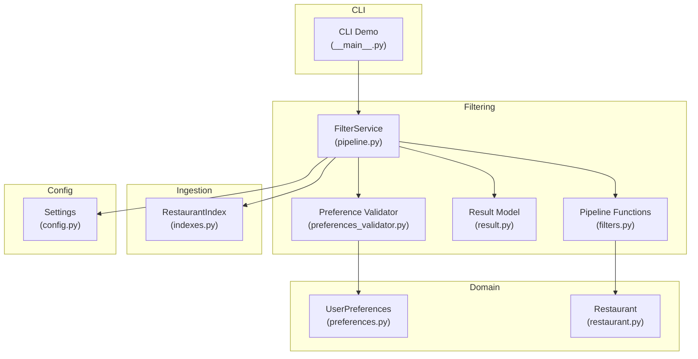
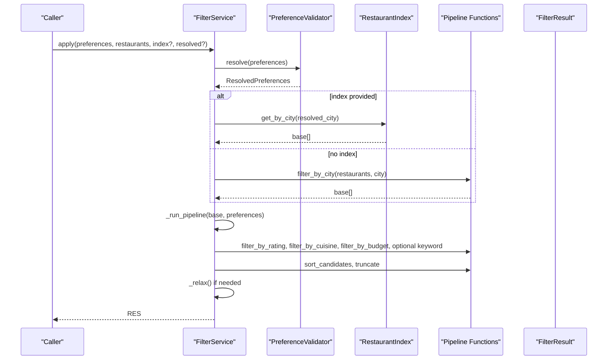
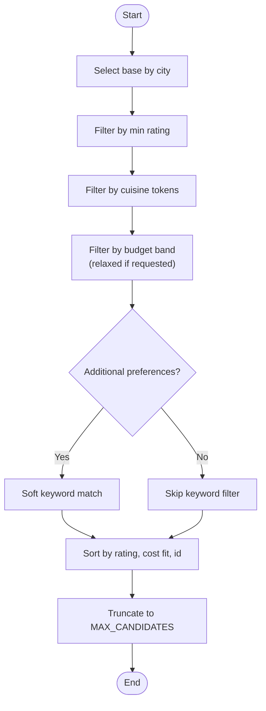
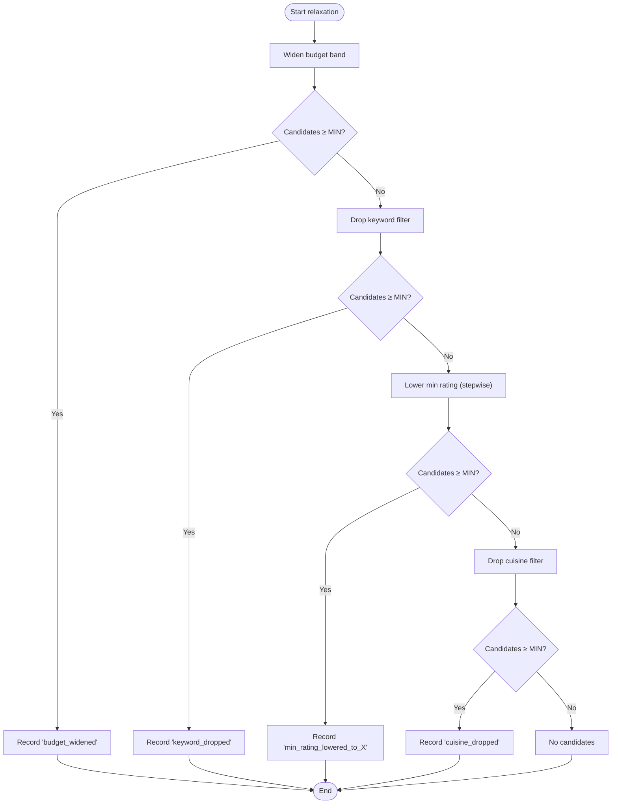
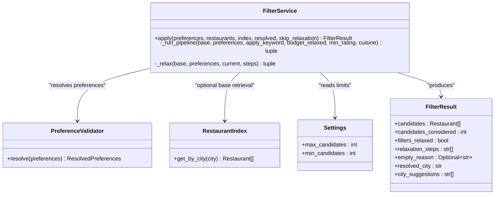

# Filter Pipeline Architecture

<cite>
**Referenced Files in This Document**
- [pipeline.py](file://src/filtering/pipeline.py)
- [filters.py](file://src/filtering/filters.py)
- [result.py](file://src/filtering/result.py)
- [preferences_validator.py](file://src/filtering/preferences_validator.py)
- [preferences.py](file://src/domain/preferences.py)
- [restaurant.py](file://src/domain/restaurant.py)
- [indexes.py](file://src/ingestion/indexes.py)
- [config.py](file://src/config.py)
- [test_pipeline.py](file://tests/test_pipeline.py)
- [test_pipeline_integration.py](file://tests/test_pipeline_integration.py)
- [__main__.py](file://src/filtering/__main__.py)
- [architecture.md](file://docs/architecture.md)
- [implementation-plan.md](file://docs/implementation-plan.md)
</cite>

## Table of Contents
1. [Introduction](#introduction)
2. [Project Structure](#project-structure)
3. [Core Components](#core-components)
4. [Architecture Overview](#architecture-overview)
5. [Detailed Component Analysis](#detailed-component-analysis)
6. [Dependency Analysis](#dependency-analysis)
7. [Performance Considerations](#performance-considerations)
8. [Troubleshooting Guide](#troubleshooting-guide)
9. [Conclusion](#conclusion)
10. [Appendices](#appendices)

## Introduction
This document explains the sequential filtering pipeline architecture that produces a deterministic candidate shortlist from a pool of restaurants. The FilterService orchestrates a five-stage pipeline: city/location filtering, rating filtering, cuisine filtering, budget filtering, and optional keyword filtering. It then sorts and truncates candidates, and applies a controlled relaxation mechanism when the number of results falls below a configurable minimum. The system integrates configuration-driven settings, preference resolution, and index-based optimizations to ensure efficient operation on cached datasets.

## Project Structure
The filtering subsystem resides under src/filtering and collaborates with domain models, ingestion indexes, and configuration. The CLI entry point demonstrates end-to-end usage with cached data and prints structured metadata about the filtering run.

**Diagram sources**
- [pipeline.py:31-203](file://src/filtering/pipeline.py#L31-L203)
- [filters.py:1-125](file://src/filtering/filters.py#L1-L125)
- [result.py:11-20](file://src/filtering/result.py#L11-L20)
- [preferences_validator.py:28-76](file://src/filtering/preferences_validator.py#L28-L76)
- [preferences.py:15-29](file://src/domain/preferences.py#L15-L29)
- [restaurant.py:16-26](file://src/domain/restaurant.py#L16-L26)
- [indexes.py:11-48](file://src/ingestion/indexes.py#L11-L48)
- [config.py:46-81](file://src/config.py#L46-L81)
- [__main__.py:20-73](file://src/filtering/__main__.py#L20-L73)

**Section sources**
- [pipeline.py:1-204](file://src/filtering/pipeline.py#L1-L204)
- [filters.py:1-125](file://src/filtering/filters.py#L1-L125)
- [result.py:1-20](file://src/filtering/result.py#L1-L20)
- [preferences_validator.py:1-76](file://src/filtering/preferences_validator.py#L1-L76)
- [preferences.py:1-29](file://src/domain/preferences.py#L1-L29)
- [restaurant.py:1-26](file://src/domain/restaurant.py#L1-L26)
- [indexes.py:1-48](file://src/ingestion/indexes.py#L1-L48)
- [config.py:1-81](file://src/config.py#L1-L81)
- [__main__.py:1-73](file://src/filtering/__main__.py#L1-L73)

## Core Components
- FilterService: Orchestrates the deterministic pipeline, resolves preferences, applies filters, and manages relaxation. It measures performance and emits warnings when the pipeline exceeds a target threshold.
- Pipeline functions: Individual filter stages (city, rating, cuisine, budget, keyword) and sorting/truncation utilities.
- PreferenceValidator: Resolves user location to a canonical city and provides suggestions when an exact match is not found.
- Result model: Encapsulates the final candidate list and auxiliary metadata (counts, relaxation flags, reasons).
- Index-based optimization: Uses RestaurantIndex to accelerate city-based base selection.

Key initialization parameters and settings integration:
- Settings: Controls MAX_CANDIDATES, MIN_CANDIDATES, and other pipeline limits.
- known_cities: Passed to PreferenceValidator to enable fuzzy matching and suggestion.
- index: Optional RestaurantIndex to supply the base candidate pool by city.

**Section sources**
- [pipeline.py:31-203](file://src/filtering/pipeline.py#L31-L203)
- [filters.py:27-125](file://src/filtering/filters.py#L27-L125)
- [preferences_validator.py:28-76](file://src/filtering/preferences_validator.py#L28-L76)
- [result.py:11-20](file://src/filtering/result.py#L11-L20)
- [indexes.py:11-48](file://src/ingestion/indexes.py#L11-L48)
- [config.py:46-81](file://src/config.py#L46-L81)

## Architecture Overview
The FilterService composes a deterministic pipeline that reduces the dataset to a ranked, truncated shortlist. It optionally leverages an index to fetch a city-specific base and applies a controlled relaxation strategy when the result count is insufficient.

**Diagram sources**
- [pipeline.py:42-103](file://src/filtering/pipeline.py#L42-L103)
- [pipeline.py:105-129](file://src/filtering/pipeline.py#L105-L129)
- [pipeline.py:131-203](file://src/filtering/pipeline.py#L131-L203)
- [filters.py:27-125](file://src/filtering/filters.py#L27-L125)
- [preferences_validator.py:37-68](file://src/filtering/preferences_validator.py#L37-L68)
- [indexes.py:17-18](file://src/ingestion/indexes.py#L17-L18)

## Detailed Component Analysis

### FilterService Class
FilterService encapsulates the orchestration of the filtering pipeline. It:
- Resolves user preferences to a canonical city and provides suggestions.
- Builds a base candidate pool either from an index (by city) or via city filtering.
- Executes the deterministic pipeline: rating, cuisine, budget, optional keyword, sort, truncate.
- Applies relaxation steps if the candidate count is below the minimum threshold.
- Tracks performance and logs a warning when the pipeline exceeds a target threshold.
- Produces a structured FilterResult with metadata for downstream consumers.

Initialization parameters:
- settings: Optional Settings instance; defaults to get_settings().
- known_cities: Optional list passed to PreferenceValidator to expand known city vocabulary.

Runtime parameters:
- preferences: UserPreferences object.
- restaurants: Full list of Restaurant objects.
- index: Optional RestaurantIndex for accelerated base retrieval.
- resolved: Optional ResolvedPreferences to bypass validation.
- skip_relaxation: Boolean to disable relaxation for deterministic runs.

Relaxation mechanism:
- Widens budget band when results are insufficient.
- Drops keyword filter if still insufficient.
- Lowers minimum rating in steps down to a floor.
- Drops cuisine filter last.
- Emits a list of steps taken to reach the final candidate set.

Performance monitoring:
- Measures wall-clock time around the pipeline and logs a warning if execution exceeds a target threshold.

**Section sources**
- [pipeline.py:31-203](file://src/filtering/pipeline.py#L31-L203)
- [preferences_validator.py:28-76](file://src/filtering/preferences_validator.py#L28-L76)
- [result.py:11-20](file://src/filtering/result.py#L11-L20)
- [config.py:46-81](file://src/config.py#L46-L81)

### Pipeline Execution Flow
The pipeline executes in a fixed sequence with deterministic semantics:
1. Base selection: City/location match yields a base list.
2. Rating filter: Retains restaurants meeting the minimum rating.
3. Cuisine filter: Matches cuisines via token overlap.
4. Budget filter: Matches budget bands; can be relaxed to adjacent bands.
5. Optional keyword filter: Soft match on name/location/cuisines; if no matches, the original list is returned.
6. Sorting: Orders by rating descending, then by cost fit within the budget band, then by stable id.
7. Truncation: Limits the final list to a configurable maximum.

**Diagram sources**
- [pipeline.py:105-129](file://src/filtering/pipeline.py#L105-L129)
- [filters.py:27-125](file://src/filtering/filters.py#L27-L125)

**Section sources**
- [pipeline.py:105-129](file://src/filtering/pipeline.py#L105-L129)
- [filters.py:27-125](file://src/filtering/filters.py#L27-L125)

### Relaxation Mechanism
When the number of candidates is less than the minimum threshold:
- Budget widening: Re-run pipeline with relaxed budget bands.
- Keyword drop: Re-run pipeline without the keyword filter.
- Rating lowering: Iteratively lower the minimum rating toward a floor.
- Cuisine drop: Remove cuisine filter as a last resort.
- Steps are recorded to inform the caller about which filters were relaxed.

**Diagram sources**
- [pipeline.py:131-203](file://src/filtering/pipeline.py#L131-L203)

**Section sources**
- [pipeline.py:131-203](file://src/filtering/pipeline.py#L131-L203)

### Preference Resolution and Validation
PreferenceValidator ensures the user’s location resolves to a known city:
- Normalizes the input and attempts an exact match.
- Falls back to fuzzy matching with suggestions.
- Raises a validation error if no suitable city is found.

**Section sources**
- [preferences_validator.py:28-76](file://src/filtering/preferences_validator.py#L28-L76)
- [preferences.py:15-29](file://src/domain/preferences.py#L15-L29)

### Index-Based Optimizations
RestaurantIndex accelerates base selection by city:
- Stores lists of restaurants grouped by city and by individual cuisine tokens.
- Provides O(1) lookup for the base candidate pool given a resolved city.
- Known cities list enables fuzzy matching and suggestion.

**Section sources**
- [indexes.py:11-48](file://src/ingestion/indexes.py#L11-L48)

### Result Metadata and Logging
FilterResult captures:
- candidates: Final ranked list.
- candidates_considered: Count before truncation.
- filters_relaxed: Whether any relaxation steps occurred.
- relaxation_steps: Ordered list of steps taken.
- empty_reason: Indicates why no candidates were produced.
- resolved_city and city_suggestions: Context for the resolved location.

Logging:
- Warning emitted when pipeline execution exceeds a target threshold.

**Section sources**
- [result.py:11-20](file://src/filtering/result.py#L11-L20)
- [pipeline.py:88-89](file://src/filtering/pipeline.py#L88-L89)

## Dependency Analysis
FilterService depends on:
- Settings for pipeline limits.
- PreferenceValidator for canonical city resolution.
- RestaurantIndex for accelerated base retrieval.
- Pipeline functions for filter and sort operations.
- Domain models for typed preferences and restaurants.

**Diagram sources**
- [pipeline.py:31-203](file://src/filtering/pipeline.py#L31-L203)
- [preferences_validator.py:28-76](file://src/filtering/preferences_validator.py#L28-L76)
- [indexes.py:11-48](file://src/ingestion/indexes.py#L11-L48)
- [config.py:46-81](file://src/config.py#L46-L81)
- [result.py:11-20](file://src/filtering/result.py#L11-L20)

**Section sources**
- [pipeline.py:31-203](file://src/filtering/pipeline.py#L31-L203)
- [preferences_validator.py:28-76](file://src/filtering/preferences_validator.py#L28-L76)
- [indexes.py:11-48](file://src/ingestion/indexes.py#L11-L48)
- [config.py:46-81](file://src/config.py#L46-L81)
- [result.py:11-20](file://src/filtering/result.py#L11-L20)

## Performance Considerations
- Target performance: The filter step should complete under a specified threshold on cached data.
- Index acceleration: Using RestaurantIndex.get_by_city dramatically reduces the cost of base selection.
- Budget relaxation: Widening bands increases candidate count with minimal overhead.
- Sorting cost: The sort key considers rating, cost fit, and id; keep candidate sets modest to maintain responsiveness.
- Logging: Excessive runtime triggers a warning to aid tuning.

**Section sources**
- [architecture.md:644-651](file://docs/architecture.md#L644-L651)
- [pipeline.py:88-89](file://src/filtering/pipeline.py#L88-L89)
- [indexes.py:17-18](file://src/ingestion/indexes.py#L17-L18)

## Troubleshooting Guide
Common scenarios and diagnostics:
- Empty base: If no restaurants match the resolved city, the pipeline returns an empty result with a specific reason.
- Insufficient candidates: When results fall below the minimum threshold, relaxation steps are applied and recorded.
- Slow pipeline: A warning is logged if execution exceeds the target threshold; consider enabling index usage or adjusting filters.
- City resolution failures: Validation errors indicate no suitable city; verify known cities and input normalization.

**Section sources**
- [pipeline.py:59-66](file://src/filtering/pipeline.py#L59-L66)
- [pipeline.py:75-82](file://src/filtering/pipeline.py#L75-L82)
- [pipeline.py:88-89](file://src/filtering/pipeline.py#L88-L89)
- [preferences_validator.py:62-68](file://src/filtering/preferences_validator.py#L62-L68)

## Conclusion
The FilterService implements a robust, deterministic filtering pipeline that reliably narrows a large dataset to a high-quality, ranked shortlist. Its preference resolution, index-based optimizations, and controlled relaxation mechanism ensure both accuracy and resilience. The structured result metadata and performance monitoring support transparent, observable operations suitable for integration with higher-level recommendation systems.

## Appendices

### Example Pipeline Executions
- Deterministic run with no relaxation: Demonstrates strict adherence to user preferences and truncation to the maximum candidate count.
- Budget relaxation triggered: When the base set is too small, the pipeline widens the budget band and records the step.
- Rating relaxation triggered: The pipeline lowers the minimum rating incrementally until sufficient candidates are found.
- Empty city scenario: When the resolved city yields no matches, the pipeline returns an empty result with a reason.

**Section sources**
- [test_pipeline.py:49-61](file://tests/test_pipeline.py#L49-L61)
- [test_pipeline.py:64-74](file://tests/test_pipeline.py#L64-L74)
- [test_pipeline.py:76-98](file://tests/test_pipeline.py#L76-L98)
- [test_pipeline.py:100-118](file://tests/test_pipeline.py#L100-L118)
- [test_pipeline.py:120-131](file://tests/test_pipeline.py#L120-L131)

### CLI Usage and Metadata
The CLI entry point loads cached data, constructs preferences, invokes FilterService, and prints structured metadata including the resolved city, candidate counts, relaxation flags, and reasons.

**Section sources**
- [__main__.py:20-73](file://src/filtering/__main__.py#L20-L73)

### Integration Test with Cached Data
An integration test verifies end-to-end behavior on cached data, asserting candidate counts, resolved city, and performance targets.

**Section sources**
- [test_pipeline_integration.py:15-46](file://tests/test_pipeline_integration.py#L15-L46)