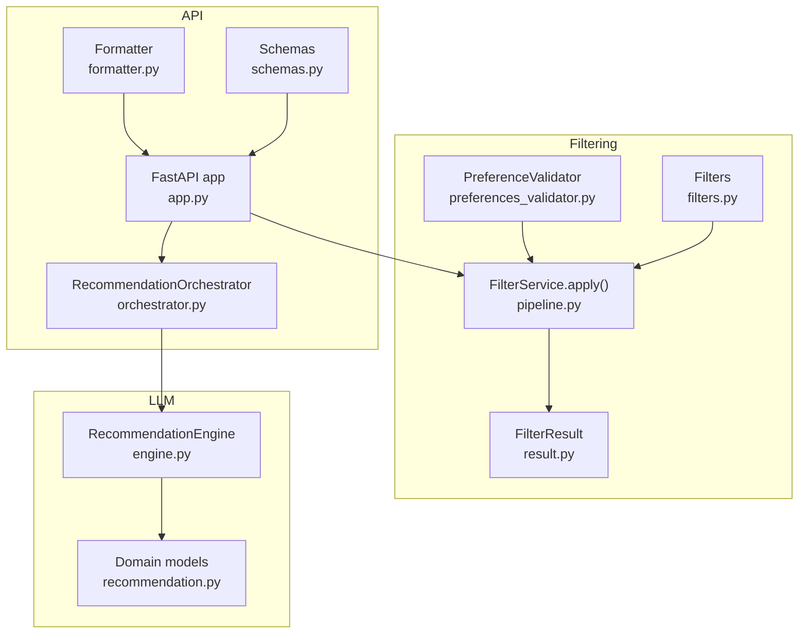
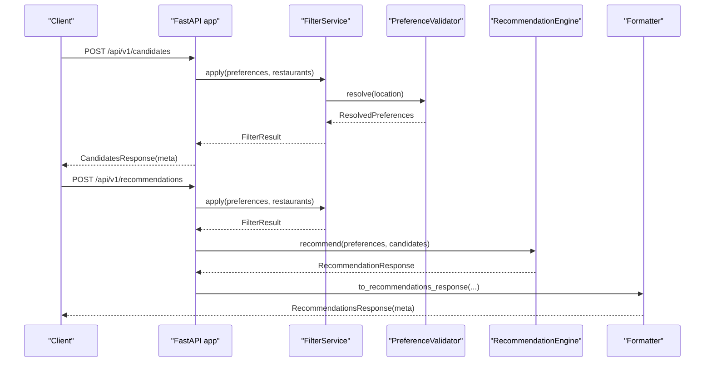
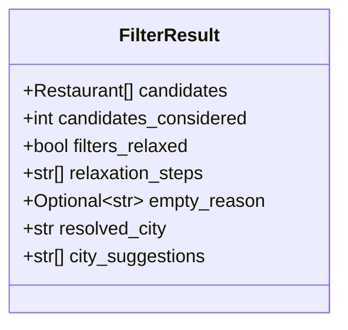
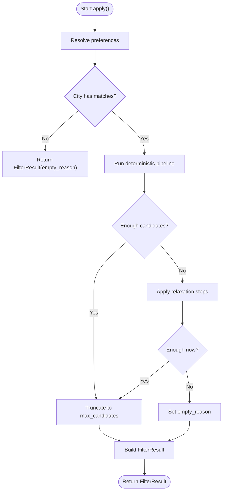
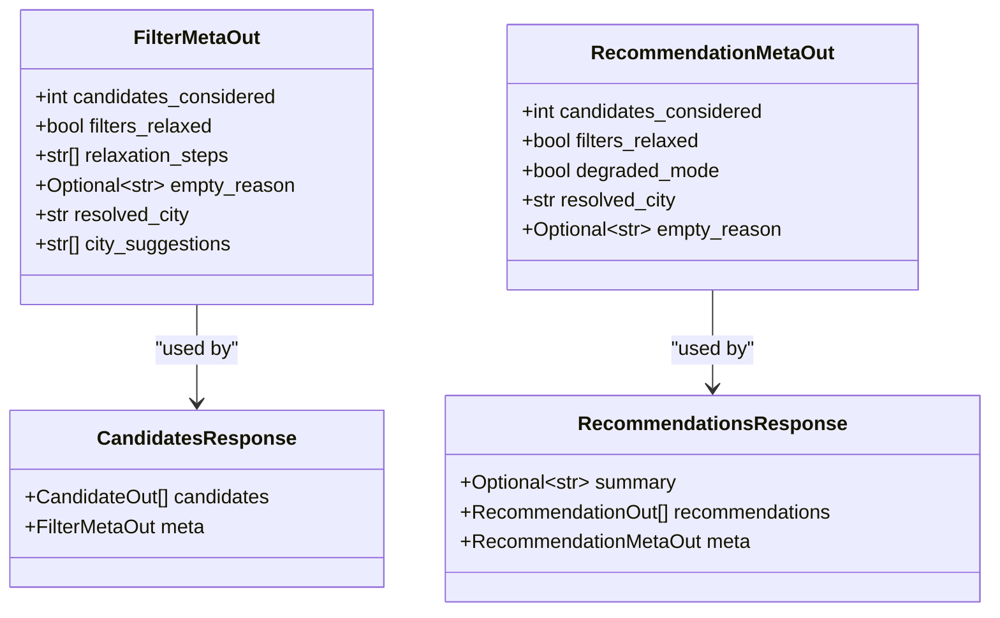
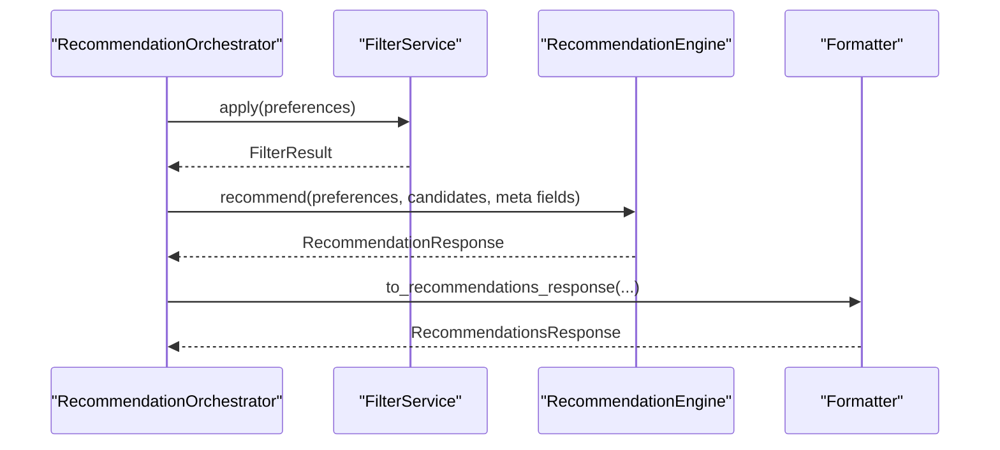
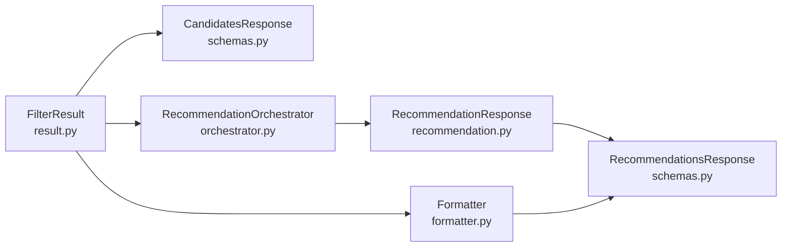

# Filter Result Structure and Metadata

<cite>
**Referenced Files in This Document**
- [result.py](file://src/filtering/result.py)
- [pipeline.py](file://src/filtering/pipeline.py)
- [filters.py](file://src/filtering/filters.py)
- [preferences_validator.py](file://src/filtering/preferences_validator.py)
- [app.py](file://src/api/app.py)
- [schemas.py](file://src/api/schemas.py)
- [formatter.py](file://src/api/formatter.py)
- [orchestrator.py](file://src/api/orchestrator.py)
- [engine.py](file://src/llm/engine.py)
- [recommendation.py](file://src/domain/recommendation.py)
- [test_pipeline.py](file://tests/test_pipeline.py)
</cite>

## Table of Contents
1. [Introduction](#introduction)
2. [Project Structure](#project-structure)
3. [Core Components](#core-components)
4. [Architecture Overview](#architecture-overview)
5. [Detailed Component Analysis](#detailed-component-analysis)
6. [Dependency Analysis](#dependency-analysis)
7. [Performance Considerations](#performance-considerations)
8. [Troubleshooting Guide](#troubleshooting-guide)
9. [Conclusion](#conclusion)
10. [Appendices](#appendices)

## Introduction
This document explains the FilterResult data structure and the metadata handling system used by the filtering pipeline. It covers the FilterResult class properties, how filtering performance and system behavior are tracked, the serialization format for API consumers, and how filter outcomes integrate with the broader recommendation system. It also provides examples of interpreting results, handling empty results, and communicating outcomes to users and API clients.

## Project Structure
The filtering and recommendation system spans several modules:
- Filtering pipeline and result type
- Individual filter functions
- Preference resolution and validation
- API endpoints and response schemas
- Orchestration of filter + LLM phases
- Domain models for recommendation responses

**Diagram sources**
- [result.py:11-19](file://src/filtering/result.py#L11-L19)
- [pipeline.py:42-103](file://src/filtering/pipeline.py#L42-L103)
- [filters.py:27-125](file://src/filtering/filters.py#L27-L125)
- [preferences_validator.py:28-68](file://src/filtering/preferences_validator.py#L28-L68)
- [app.py:166-208](file://src/api/app.py#L166-L208)
- [schemas.py:44-80](file://src/api/schemas.py#L44-L80)
- [formatter.py:16-48](file://src/api/formatter.py#L16-L48)
- [orchestrator.py:30-98](file://src/api/orchestrator.py#L30-L98)
- [engine.py:29-191](file://src/llm/engine.py#L29-191)
- [recommendation.py:8-28](file://src/domain/recommendation.py#L8-L28)

**Section sources**
- [result.py:11-19](file://src/filtering/result.py#L11-L19)
- [pipeline.py:42-103](file://src/filtering/pipeline.py#L42-L103)
- [filters.py:27-125](file://src/filtering/filters.py#L27-L125)
- [preferences_validator.py:28-68](file://src/filtering/preferences_validator.py#L28-L68)
- [app.py:166-208](file://src/api/app.py#L166-L208)
- [schemas.py:44-80](file://src/api/schemas.py#L44-L80)
- [formatter.py:16-48](file://src/api/formatter.py#L16-L48)
- [orchestrator.py:30-98](file://src/api/orchestrator.py#L30-L98)
- [engine.py:29-191](file://src/llm/engine.py#L29-191)
- [recommendation.py:8-28](file://src/domain/recommendation.py#L8-L28)

## Core Components
FilterResult is the central data structure representing the outcome of the deterministic filtering phase. It carries:
- candidates: the filtered and truncated list of restaurants
- candidates_considered: total number of candidates processed before truncation
- filters_relaxed: whether any relaxation steps were applied
- relaxation_steps: ordered list of steps taken to relax filters
- empty_reason: reason for returning no candidates
- resolved_city: canonical city used for filtering
- city_suggestions: suggested alternatives when the location could not be resolved

These fields enable transparent communication of filtering behavior to both the LLM phase and API consumers.

**Section sources**
- [result.py:11-19](file://src/filtering/result.py#L11-L19)

## Architecture Overview
The filtering pipeline produces a FilterResult, which is serialized into API responses and passed to the LLM recommendation engine. The orchestrator coordinates timing and fallback behavior.

**Diagram sources**
- [app.py:166-208](file://src/api/app.py#L166-L208)
- [app.py:211-242](file://src/api/app.py#L211-L242)
- [pipeline.py:42-103](file://src/filtering/pipeline.py#L42-L103)
- [preferences_validator.py:37-68](file://src/filtering/preferences_validator.py#L37-L68)
- [engine.py:45-118](file://src/llm/engine.py#L45-118)
- [formatter.py:16-48](file://src/api/formatter.py#L16-L48)

## Detailed Component Analysis

### FilterResult Class
FilterResult encapsulates the deterministic filtering outcome and metadata. Its properties are populated by the FilterService and consumed downstream.

**Diagram sources**
- [result.py:11-19](file://src/filtering/result.py#L11-L19)

**Section sources**
- [result.py:11-19](file://src/filtering/result.py#L11-L19)

### Filter Pipeline and Relaxation
The FilterService applies a deterministic sequence of filters and, if needed, relaxation steps to meet minimum candidate thresholds. It populates FilterResult with:
- candidates: post-filtering and pre-truncation
- candidates_considered: count before truncation
- filters_relaxed: true if any relaxation occurred
- relaxation_steps: ordered list of applied steps
- empty_reason: reason for no candidates
- resolved_city and city_suggestions: from preference resolution

**Diagram sources**
- [pipeline.py:42-103](file://src/filtering/pipeline.py#L42-L103)
- [pipeline.py:105-129](file://src/filtering/pipeline.py#L105-L129)
- [pipeline.py:131-203](file://src/filtering/pipeline.py#L131-L203)

**Section sources**
- [pipeline.py:42-103](file://src/filtering/pipeline.py#L42-L103)
- [pipeline.py:105-129](file://src/filtering/pipeline.py#L105-L129)
- [pipeline.py:131-203](file://src/filtering/pipeline.py#L131-L203)

### Filters Module
The filters module defines the deterministic steps:
- filter_by_city
- filter_by_rating
- filter_by_cuisine
- filter_by_budget (with relaxed mode)
- apply_keyword_filter (soft match)
- sort_candidates
- truncate

These functions are orchestrated by FilterService to produce the initial candidate list and inform relaxation decisions.

**Section sources**
- [filters.py:27-125](file://src/filtering/filters.py#L27-L125)

### Preference Resolution
PreferenceValidator resolves the user’s location to a canonical city and provides suggestions when ambiguous or unknown. It feeds ResolvedPreferences into FilterService, which sets resolved_city and city_suggestions in FilterResult.

**Section sources**
- [preferences_validator.py:28-68](file://src/filtering/preferences_validator.py#L28-L68)

### API Serialization and Communication
The API exposes two primary endpoints:
- POST /api/v1/candidates: returns FilterResult as CandidatesResponse with FilterMetaOut
- POST /api/v1/recommendations: returns RecommendationsResponse with RecommendationMetaOut

FilterResult fields are mapped to API schemas:
- candidates_considered, filters_relaxed, relaxation_steps, empty_reason, resolved_city, city_suggestions

The formatter maps RecommendationResponse to RecommendationsResponse, preserving meta fields and adding resolved_city and empty_reason.

**Diagram sources**
- [schemas.py:44-80](file://src/api/schemas.py#L44-L80)
- [formatter.py:16-48](file://src/api/formatter.py#L16-L48)

**Section sources**
- [app.py:166-208](file://src/api/app.py#L166-L208)
- [app.py:211-242](file://src/api/app.py#L211-L242)
- [schemas.py:44-80](file://src/api/schemas.py#L44-L80)
- [formatter.py:16-48](file://src/api/formatter.py#L16-L48)

### Integration with LLM Ranking
After filtering, the orchestrator passes FilterResult to the RecommendationEngine. The engine uses:
- candidates_considered and filters_relaxed to populate RecommendationResponse.meta
- empty_reason to decide whether to return a degraded response or proceed with LLM ranking

**Diagram sources**
- [orchestrator.py:45-98](file://src/api/orchestrator.py#L45-L98)
- [engine.py:45-118](file://src/llm/engine.py#L45-118)
- [formatter.py:16-48](file://src/api/formatter.py#L16-L48)

**Section sources**
- [orchestrator.py:45-98](file://src/api/orchestrator.py#L45-L98)
- [engine.py:45-118](file://src/llm/engine.py#L45-118)
- [formatter.py:16-48](file://src/api/formatter.py#L16-L48)

## Dependency Analysis
FilterResult is consumed across modules:
- API endpoints serialize it into FilterMetaOut and RecommendationMetaOut
- RecommendationOrchestrator constructs RecommendationResponse using meta fields
- RecommendationEngine reads meta fields to decide behavior and fallbacks

**Diagram sources**
- [result.py:11-19](file://src/filtering/result.py#L11-L19)
- [schemas.py:44-80](file://src/api/schemas.py#L44-L80)
- [orchestrator.py:45-98](file://src/api/orchestrator.py#L45-L98)
- [recommendation.py:18-28](file://src/domain/recommendation.py#L18-L28)
- [formatter.py:16-48](file://src/api/formatter.py#L16-L48)

**Section sources**
- [result.py:11-19](file://src/filtering/result.py#L11-L19)
- [schemas.py:44-80](file://src/api/schemas.py#L44-L80)
- [orchestrator.py:45-98](file://src/api/orchestrator.py#L45-L98)
- [recommendation.py:18-28](file://src/domain/recommendation.py#L18-L28)
- [formatter.py:16-48](file://src/api/formatter.py#L16-L48)

## Performance Considerations
- The pipeline logs warnings when execution exceeds a target threshold, aiding performance monitoring.
- Truncation ensures bounded downstream processing costs.
- Relaxation steps are ordered to minimize impact on user intent while meeting minimum candidate counts.

**Section sources**
- [pipeline.py:88-89](file://src/filtering/pipeline.py#L88-L89)
- [pipeline.py:128-129](file://src/filtering/pipeline.py#L128-L129)
- [pipeline.py:131-203](file://src/filtering/pipeline.py#L131-L203)

## Troubleshooting Guide
Common scenarios and how they surface in FilterResult:
- Unknown location: empty_reason indicates the city could not be resolved; city_suggestions may contain alternatives.
- Too few candidates: filters_relaxed is true and relaxation_steps lists applied steps; candidates_considered reflects the count before truncation.
- No matches after relaxation: empty_reason signals the pipeline exhausted relaxation without sufficient matches.

Tests demonstrate these behaviors and help validate expectations.

**Section sources**
- [test_pipeline.py:76-98](file://tests/test_pipeline.py#L76-L98)
- [test_pipeline.py:100-117](file://tests/test_pipeline.py#L100-L117)
- [test_pipeline.py:120-131](file://tests/test_pipeline.py#L120-L131)

## Conclusion
FilterResult is the backbone of transparency in the filtering phase. It captures the deterministic filtering outcome, relaxation behavior, and contextual metadata that inform both the LLM ranking stage and API consumers. Together with the API schemas and orchestrator, it enables clear communication of system behavior, robust fallbacks, and actionable feedback to users.

## Appendices

### Property Reference and Interpretation
- candidates: list of restaurants after filtering and truncation
- candidates_considered: total candidates processed before truncation
- filters_relaxed: true if any relaxation was applied
- relaxation_steps: ordered list of steps taken (e.g., budget_widened, keyword_dropped, min_rating_lowered_to_X)
- empty_reason: reason for zero candidates (e.g., unknown_location, no_matches_after_relaxation)
- resolved_city: canonical city used for filtering
- city_suggestions: alternative city names when resolution is ambiguous or unknown

**Section sources**
- [result.py:11-19](file://src/filtering/result.py#L11-L19)

### Example Interpretations
- Few candidates returned: check filters_relaxed and relaxation_steps to understand what was relaxed; review candidates_considered to assess coverage.
- Empty result: inspect empty_reason and city_suggestions; present suggestions to the user and explain the reason.
- Full result: confirm filters_relaxed is false or minimal; leverage relaxation_steps to inform user feedback.

**Section sources**
- [test_pipeline.py:76-98](file://tests/test_pipeline.py#L76-L98)
- [test_pipeline.py:100-117](file://tests/test_pipeline.py#L100-L117)
- [test_pipeline.py:120-131](file://tests/test_pipeline.py#L120-L131)