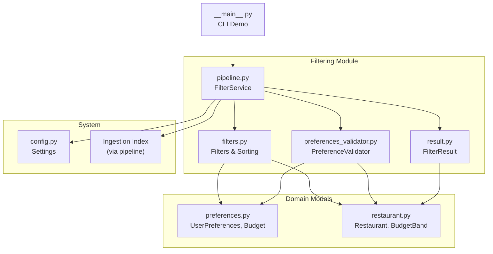
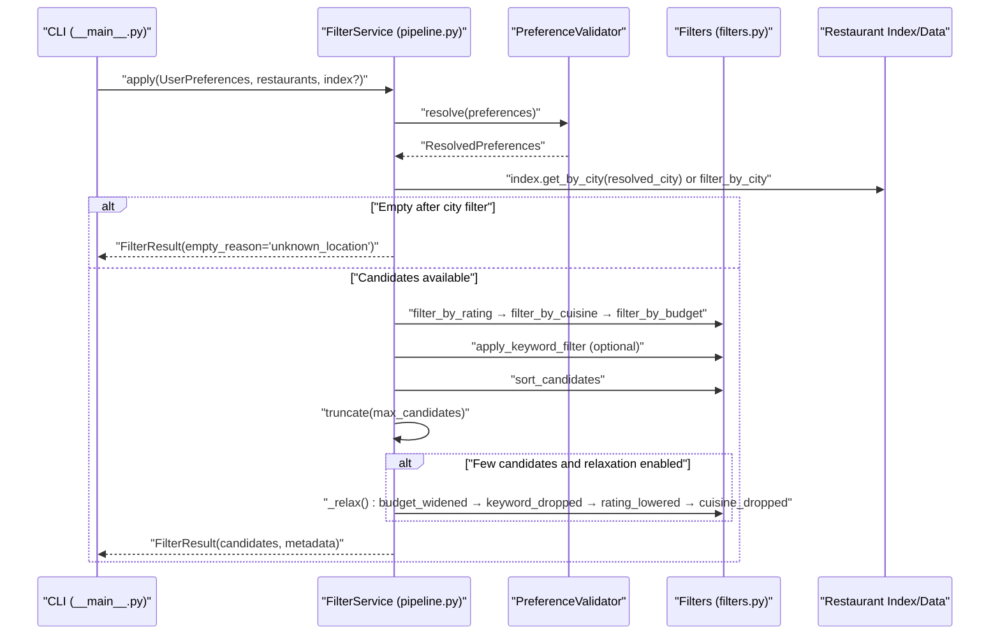
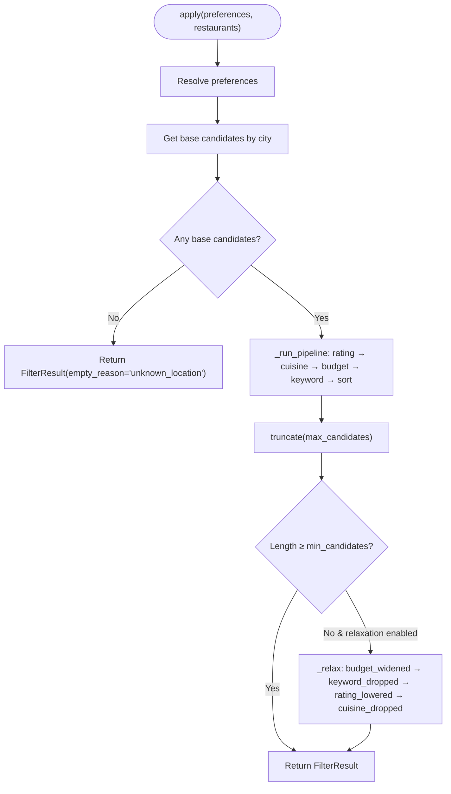
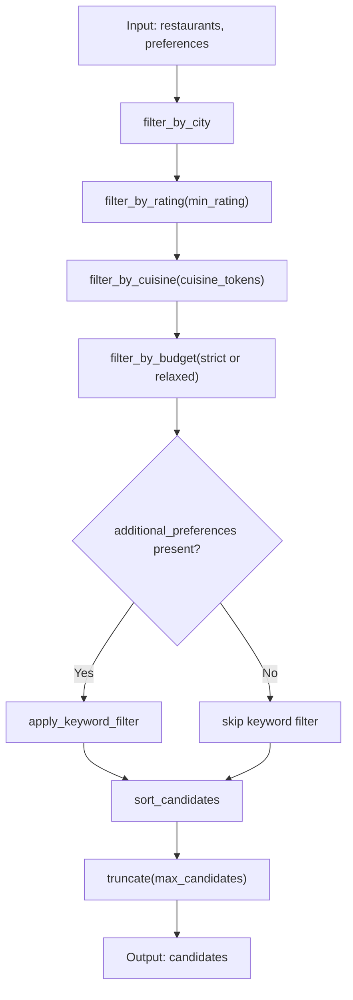
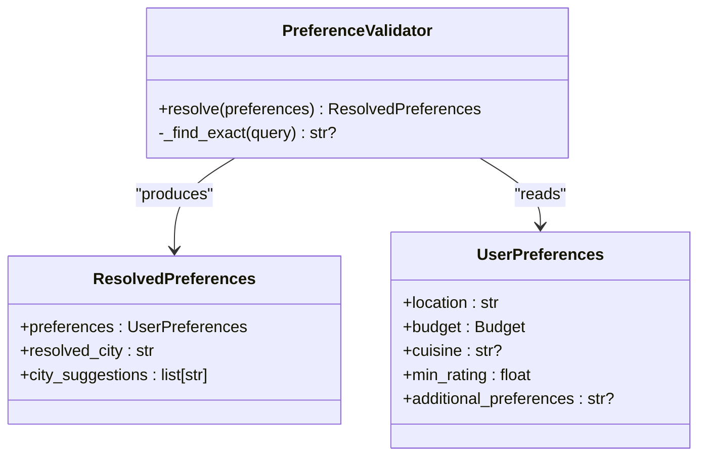
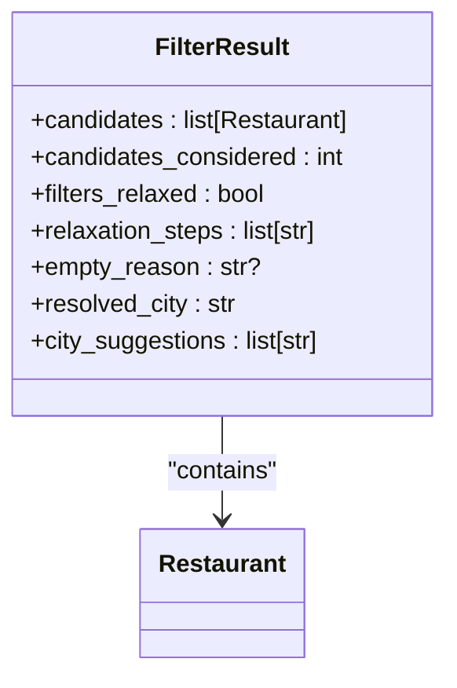
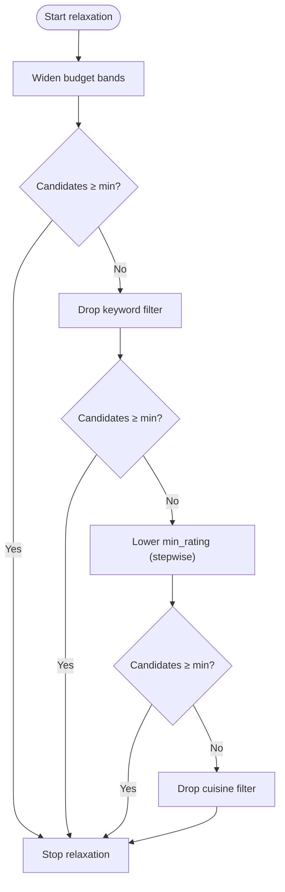
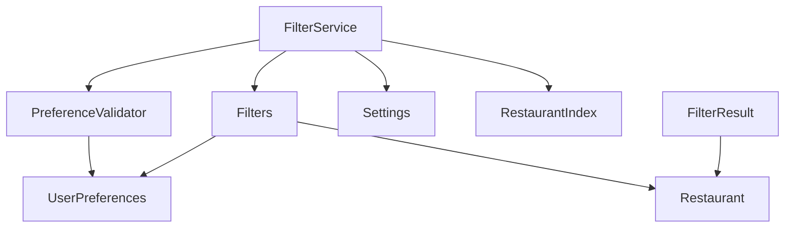

# Filtering System

<cite>
**Referenced Files in This Document**
- [pipeline.py](file://src/filtering/pipeline.py)
- [filters.py](file://src/filtering/filters.py)
- [preferences_validator.py](file://src/filtering/preferences_validator.py)
- [result.py](file://src/filtering/result.py)
- [preferences.py](file://src/domain/preferences.py)
- [restaurant.py](file://src/domain/restaurant.py)
- [config.py](file://src/config.py)
- [__main__.py](file://src/filtering/__main__.py)
- [test_filters.py](file://tests/test_filters.py)
- [test_pipeline.py](file://tests/test_pipeline.py)
- [test_pipeline_integration.py](file://tests/test_pipeline_integration.py)
</cite>

## Table of Contents
1. [Introduction](#introduction)
2. [Project Structure](#project-structure)
3. [Core Components](#core-components)
4. [Architecture Overview](#architecture-overview)
5. [Detailed Component Analysis](#detailed-component-analysis)
6. [Dependency Analysis](#dependency-analysis)
7. [Performance Considerations](#performance-considerations)
8. [Troubleshooting Guide](#troubleshooting-guide)
9. [Conclusion](#conclusion)
10. [Appendices](#appendices)

## Introduction
This document describes the deterministic filtering system that powers restaurant recommendations. It explains the sequential filtering pipeline, individual filter implementations, preference validation and user input processing, relaxation logic and fallback mechanisms, the filter result structure and metadata tracking, and performance optimization strategies. It also provides examples of filter combinations, demonstrates edge cases and user preference conflicts, and offers guidance for troubleshooting and tuning.

## Project Structure
The filtering subsystem resides under src/filtering and integrates with domain models, configuration, and ingestion indices. The CLI entry point under src/filtering/__main__.py demonstrates end-to-end usage with cached datasets.

**Diagram sources**
- [pipeline.py:31-203](file://src/filtering/pipeline.py#L31-L203)
- [filters.py:1-125](file://src/filtering/filters.py#L1-L125)
- [preferences_validator.py:28-76](file://src/filtering/preferences_validator.py#L28-L76)
- [result.py:11-20](file://src/filtering/result.py#L11-L20)
- [preferences.py:9-29](file://src/domain/preferences.py#L9-L29)
- [restaurant.py:9-26](file://src/domain/restaurant.py#L9-L26)
- [config.py:36-66](file://src/config.py#L36-L66)
- [__main__.py:20-73](file://src/filtering/__main__.py#L20-L73)

**Section sources**
- [pipeline.py:1-204](file://src/filtering/pipeline.py#L1-L204)
- [filters.py:1-125](file://src/filtering/filters.py#L1-L125)
- [preferences_validator.py:1-76](file://src/filtering/preferences_validator.py#L1-L76)
- [result.py:1-20](file://src/filtering/result.py#L1-L20)
- [preferences.py:1-29](file://src/domain/preferences.py#L1-L29)
- [restaurant.py:1-26](file://src/domain/restaurant.py#L1-L26)
- [config.py:1-66](file://src/config.py#L1-L66)
- [__main__.py:1-73](file://src/filtering/__main__.py#L1-L73)

## Core Components
- FilterService orchestrates the deterministic pipeline, validates preferences, applies filters, and manages relaxation/fallback.
- Individual filters implement location-based filtering, quality thresholds, cuisine matching, and budget constraints.
- PreferenceValidator resolves user location to a canonical city and suggests alternatives when exact matches fail.
- FilterResult encapsulates the final candidates, counts, metadata, and reasons for emptiness.
- Domain models define UserPreferences and Restaurant data structures.
- Settings configure thresholds like minimum and maximum candidates and target performance windows.

Key responsibilities:
- Deterministic pipeline: rating → cuisine → budget → keyword → sort → truncate.
- Relaxation: widen budget band, drop keyword, lower rating floor, drop cuisine.
- Metadata: tracks filters relaxed, steps taken, resolved city, suggestions, and empty reason.

**Section sources**
- [pipeline.py:31-203](file://src/filtering/pipeline.py#L31-L203)
- [filters.py:27-125](file://src/filtering/filters.py#L27-L125)
- [preferences_validator.py:28-76](file://src/filtering/preferences_validator.py#L28-L76)
- [result.py:11-20](file://src/filtering/result.py#L11-L20)
- [preferences.py:9-29](file://src/domain/preferences.py#L9-L29)
- [restaurant.py:9-26](file://src/domain/restaurant.py#L9-L26)
- [config.py:36-66](file://src/config.py#L36-L66)

## Architecture Overview
The filtering pipeline is a deterministic, sequential process with optional relaxation. It begins by resolving user preferences, narrowing candidates by city, then applying filters in order. After sorting and truncation, it optionally relaxes filters to meet minimum candidate targets.

**Diagram sources**
- [__main__.py:20-73](file://src/filtering/__main__.py#L20-L73)
- [pipeline.py:42-103](file://src/filtering/pipeline.py#L42-L103)
- [pipeline.py:105-130](file://src/filtering/pipeline.py#L105-L130)
- [pipeline.py:131-203](file://src/filtering/pipeline.py#L131-L203)
- [filters.py:27-125](file://src/filtering/filters.py#L27-L125)
- [preferences_validator.py:37-68](file://src/filtering/preferences_validator.py#L37-L68)

## Detailed Component Analysis

### FilterService (Deterministic Pipeline and Relaxation)
- Initialization: stores Settings and constructs PreferenceValidator with known cities.
- apply:
  - Resolves preferences; selects base candidates via index city lookup or city filter.
  - Returns early with empty reason if no city matches.
  - Runs deterministic pipeline and truncates to maximum candidates.
  - If below minimum candidates and relaxation not skipped, invokes _relax with ordered fallbacks.
  - Emits performance warning if pipeline exceeds target threshold.
- _run_pipeline:
  - Applies rating, cuisine, budget, optional keyword filter, then sorts candidates.
- _relax:
  - Budget widening (widest bands) when insufficient results.
  - Drops keyword filter next.
  - Iteratively lowers minimum rating toward floor.
  - Drops cuisine filter last.
  - Tracks steps taken for observability.

**Diagram sources**
- [pipeline.py:42-103](file://src/filtering/pipeline.py#L42-L103)
- [pipeline.py:105-130](file://src/filtering/pipeline.py#L105-L130)
- [pipeline.py:131-203](file://src/filtering/pipeline.py#L131-L203)

**Section sources**
- [pipeline.py:31-203](file://src/filtering/pipeline.py#L31-L203)

### Filters (Location, Quality, Cuisine, Budget, Keyword, Sorting, Truncation)
- Location-based filtering:
  - Case-insensitive match against city or location fields.
- Quality thresholds:
  - Minimum rating filter.
- Cuisine matching:
  - Tokenization supports comma, pipe, or slash delimiters; case-insensitive substring match against combined cuisines.
- Budget constraints:
  - Strict mode: exact budget band.
  - Relaxed mode: expanded bands (e.g., low→low+medium; medium→low+medium+high).
- Keyword soft filter:
  - Parses words separated by commas, spaces, semicolons, or “ and ”; case-insensitive substring match across name, location, and cuisines.
  - If no matches, returns original list; if matches exist, narrows to matches.
- Sorting:
  - Primary: rating descending.
  - Secondary: cost fit aligned with budget band (lower cost preferred for low, higher for high, near 600 for medium).
  - Tertiary: stable id.
- Truncation:
  - Limits output to configured maximum.

**Diagram sources**
- [filters.py:27-125](file://src/filtering/filters.py#L27-L125)

**Section sources**
- [filters.py:18-125](file://src/filtering/filters.py#L18-L125)

### Preference Validation and User Input Processing
- PreferenceValidator:
  - Normalizes and resolves location to a known canonical city.
  - Exact match check, then close matches via difflib with configurable cutoff.
  - Falls back to known city list if normalization succeeds but no suggestion.
  - Raises PreferenceValidationError with suggestions when resolution fails.
- UserPreferences:
  - Enforces non-empty location via Pydantic validator.
  - Defines budget tier, optional cuisine, min rating bounds, and optional keyword preferences.

**Diagram sources**
- [preferences_validator.py:28-76](file://src/filtering/preferences_validator.py#L28-L76)
- [preferences.py:15-29](file://src/domain/preferences.py#L15-L29)

**Section sources**
- [preferences_validator.py:13-76](file://src/filtering/preferences_validator.py#L13-L76)
- [preferences.py:15-29](file://src/domain/preferences.py#L15-L29)

### Filter Result Structure and Metadata Tracking
- FilterResult fields:
  - candidates: filtered and sorted restaurants.
  - candidates_considered: count before truncation.
  - filters_relaxed: whether any relaxation step was applied.
  - relaxation_steps: list of steps taken (e.g., budget_widened, keyword_dropped, min_rating_lowered_to_X, cuisine_dropped).
  - empty_reason: reason for zero results (e.g., unknown_location, no_matches_after_relaxation).
  - resolved_city: canonical city used for filtering.
  - city_suggestions: suggestions provided during validation.

**Diagram sources**
- [result.py:11-20](file://src/filtering/result.py#L11-L20)
- [restaurant.py:16-26](file://src/domain/restaurant.py#L16-L26)

**Section sources**
- [result.py:11-20](file://src/filtering/result.py#L11-L20)

### Relaxation Logic and Fallback Mechanisms
- Steps are executed in a fixed order when candidate count is below minimum:
  1) Widen budget bands.
  2) Drop keyword filter.
  3) Lower minimum rating toward floor in steps.
  4) Drop cuisine filter.
- Improvement criterion: replace current candidates only if new set is larger; otherwise retain previous result.
- Final empty reason set when no candidates remain after all relaxations.

**Diagram sources**
- [pipeline.py:131-203](file://src/filtering/pipeline.py#L131-L203)

**Section sources**
- [pipeline.py:131-203](file://src/filtering/pipeline.py#L131-L203)

### Examples of Filter Combinations and Edge Cases
- Example 1: Location + Cuisine + Budget + Rating
  - Use city index to narrow, then cuisine and budget filters, then rating threshold, then keyword soft filter, then sort and truncate.
- Example 2: Very strict rating and cuisine
  - If no results, relaxation lowers rating floor until sufficient candidates or falls back to dropping cuisine.
- Example 3: No matches after city filter
  - Early exit with empty reason indicating unknown location; city suggestions may be provided.
- Example 4: Keyword filter yields no matches
  - Soft filter preserves original list; if matches exist, narrows to matches.

Validation and tests confirm:
- City filter is case-insensitive and matches either city or location.
- Cuisine tokens split by delimiters and matched case-insensitively.
- Keyword filter narrows only when matches exist.
- Sorting prioritizes rating, then cost alignment with budget, then id.
- Truncation respects maximum candidates.

**Section sources**
- [test_filters.py:38-125](file://tests/test_filters.py#L38-L125)
- [test_pipeline.py:49-131](file://tests/test_pipeline.py#L49-L131)
- [test_pipeline_integration.py:15-46](file://tests/test_pipeline_integration.py#L15-L46)

## Dependency Analysis
- FilterService depends on:
  - PreferenceValidator for location resolution.
  - Filters for all pipeline stages.
  - Settings for thresholds and limits.
  - RestaurantIndex for fast city-based candidate retrieval.
- Filters depend on:
  - UserPreferences for configuration.
  - Restaurant for attributes.
- PreferenceValidator depends on:
  - Known city lists and normalization utilities.
- FilterResult aggregates Restaurant instances.

**Diagram sources**
- [pipeline.py:34-103](file://src/filtering/pipeline.py#L34-L103)
- [filters.py:8-125](file://src/filtering/filters.py#L8-L125)
- [preferences_validator.py:31-68](file://src/filtering/preferences_validator.py#L31-L68)
- [result.py:11-20](file://src/filtering/result.py#L11-L20)
- [preferences.py:15-29](file://src/domain/preferences.py#L15-L29)
- [restaurant.py:16-26](file://src/domain/restaurant.py#L16-L26)
- [config.py:36-66](file://src/config.py#L36-L66)

**Section sources**
- [pipeline.py:34-103](file://src/filtering/pipeline.py#L34-L103)
- [filters.py:8-125](file://src/filtering/filters.py#L8-L125)
- [preferences_validator.py:31-68](file://src/filtering/preferences_validator.py#L31-L68)
- [result.py:11-20](file://src/filtering/result.py#L11-L20)
- [preferences.py:15-29](file://src/domain/preferences.py#L15-L29)
- [restaurant.py:16-26](file://src/domain/restaurant.py#L16-L26)
- [config.py:36-66](file://src/config.py#L36-L66)

## Performance Considerations
- Target latency: pipeline emits warnings when exceeding a defined threshold, guiding tuning.
- Early exits: city filter failure returns immediately with metadata.
- Index-backed base selection: when an index is provided, city-based candidate retrieval avoids scanning entire dataset.
- Budget relaxation reduces scan cost by expanding allowed bands in one step.
- Sorting cost: O(n log n) dominated by key computation per restaurant; keep candidate sets bounded by truncation.
- Recommendations:
  - Preload and reuse known cities in PreferenceValidator.
  - Use RestaurantIndex for city-scoped queries.
  - Tune Settings.max_candidates and Settings.min_candidates to balance relevance and coverage.
  - Monitor FilterResult.candidates_considered vs returned to assess filter effectiveness.

**Section sources**
- [pipeline.py:51-103](file://src/filtering/pipeline.py#L51-L103)
- [config.py:44-47](file://src/config.py#L44-L47)

## Troubleshooting Guide
Common issues and resolutions:
- Unknown location:
  - Symptom: empty results with empty_reason set to unknown_location.
  - Action: verify location spelling, consider suggestions provided; ensure known cities list includes the intended city.
- No matches after relaxation:
  - Symptom: filters_relaxed true, but still zero candidates.
  - Action: review strictness of rating floor and cuisine constraints; consider broader budget bands or removing keyword filter.
- Excessive runtime:
  - Symptom: performance warning indicating long pipeline duration.
  - Action: enable index usage, reduce max_candidates, or simplify filters.
- Keyword filter not affecting results:
  - Symptom: soft filter returns original list.
  - Action: confirm keywords exist in restaurant name, location, or cuisines; adjust delimiter usage.

Validation and tests:
- City filter correctness and case insensitivity verified.
- Keyword filter behavior validated for both match/no-match scenarios.
- Sorting correctness and truncation enforced by tests.

**Section sources**
- [preferences_validator.py:62-68](file://src/filtering/preferences_validator.py#L62-L68)
- [pipeline.py:91-103](file://src/filtering/pipeline.py#L91-L103)
- [test_filters.py:97-125](file://tests/test_filters.py#L97-L125)
- [test_pipeline.py:120-131](file://tests/test_pipeline.py#L120-L131)

## Conclusion
The filtering system provides a robust, deterministic pipeline with controlled relaxation to ensure meaningful recommendations. By combining strict filters with soft keyword matching and a structured fallback sequence, it balances precision and recall. Metadata tracking enables observability, while configuration and indexing support performance tuning. The tests validate core behaviors and edge cases, ensuring reliability in real-world usage.

## Appendices

### API and CLI Usage
- CLI entry point demonstrates loading cached data, constructing preferences, and invoking FilterService to produce JSON output and top-N candidates.

**Section sources**
- [__main__.py:20-73](file://src/filtering/__main__.py#L20-L73)