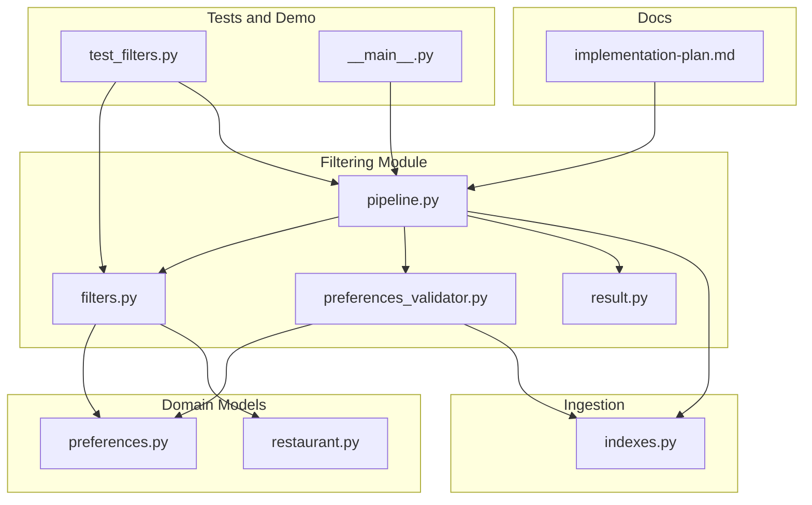
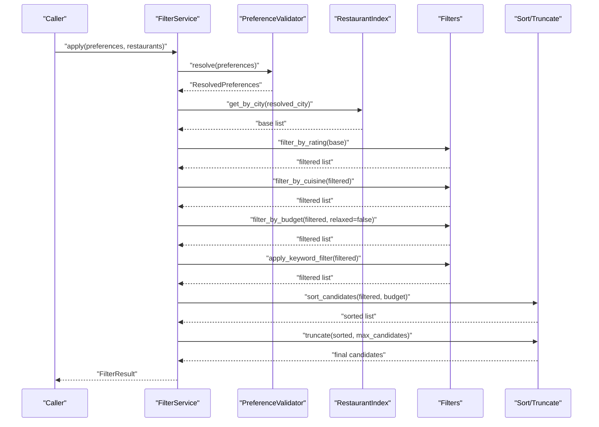
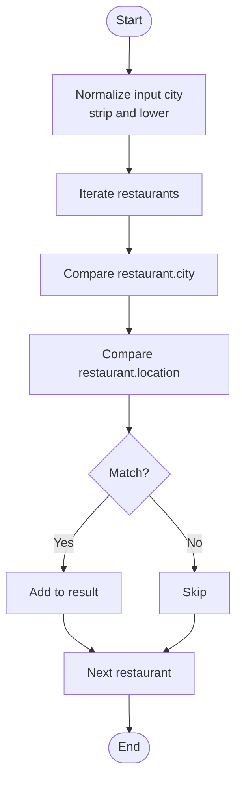
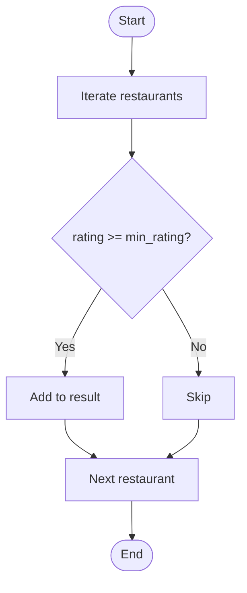
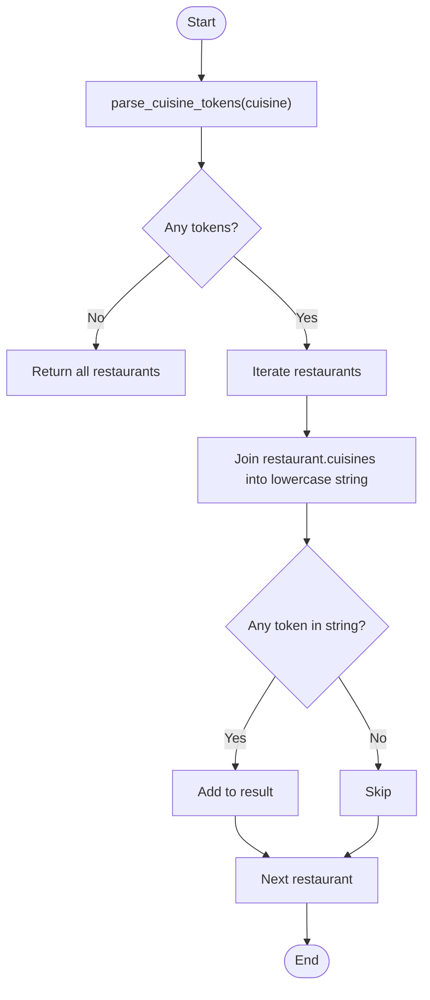
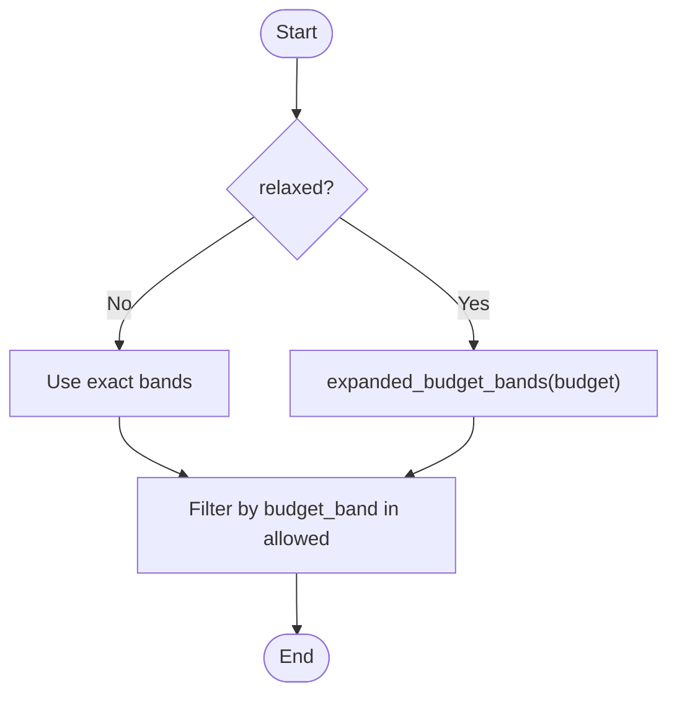
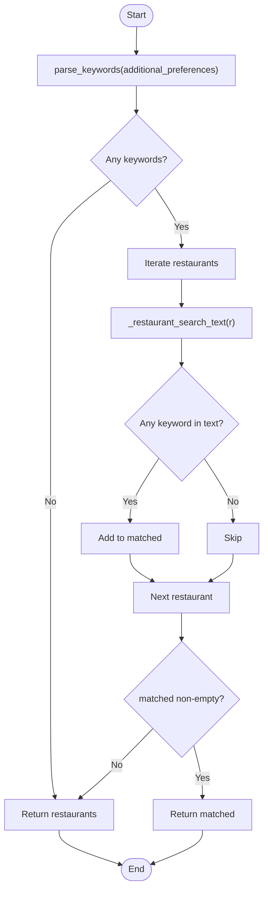
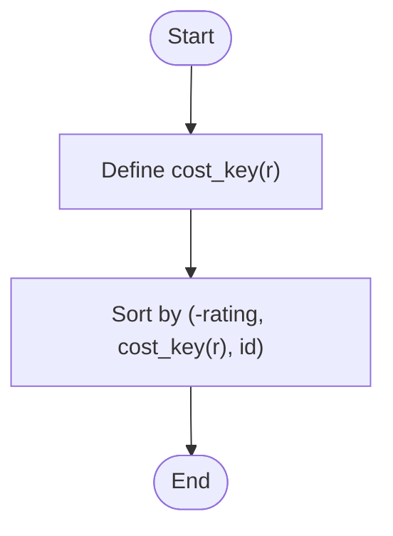
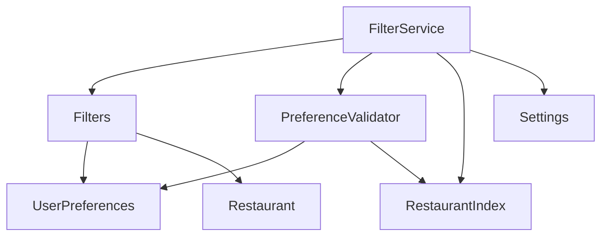

# Individual Filter Implementations

<cite>
**Referenced Files in This Document**
- [filters.py](file://src/filtering/filters.py)
- [pipeline.py](file://src/filtering/pipeline.py)
- [result.py](file://src/filtering/result.py)
- [preferences_validator.py](file://src/filtering/preferences_validator.py)
- [preferences.py](file://src/domain/preferences.py)
- [restaurant.py](file://src/domain/restaurant.py)
- [indexes.py](file://src/ingestion/indexes.py)
- [test_filters.py](file://tests/test_filters.py)
- [__main__.py](file://src/filtering/__main__.py)
- [implementation-plan.md](file://docs/implementation-plan.md)
</cite>

## Table of Contents
1. [Introduction](#introduction)
2. [Project Structure](#project-structure)
3. [Core Components](#core-components)
4. [Architecture Overview](#architecture-overview)
5. [Detailed Component Analysis](#detailed-component-analysis)
6. [Dependency Analysis](#dependency-analysis)
7. [Performance Considerations](#performance-considerations)
8. [Troubleshooting Guide](#troubleshooting-guide)
9. [Conclusion](#conclusion)
10. [Appendices](#appendices)

## Introduction
This document provides detailed documentation for each individual filter implementation in the Zomato filtering system. It focuses on five core filters: filter_by_city for location-based filtering, filter_by_rating for quality thresholds, filter_by_cuisine for food type matching, filter_by_budget for price range constraints, and apply_keyword_filter for additional preference matching. It also documents the sorting and truncation functions used in the pipeline, explains the filter algorithms, performance characteristics, and data processing logic, and demonstrates how filters interact with each other in the sequential pipeline.

## Project Structure
The filtering system resides under src/filtering and integrates with domain models, ingestion indexes, and configuration. The primary files involved are:
- Filters and pipeline orchestration: filters.py, pipeline.py
- Domain models: preferences.py, restaurant.py
- Indexing and caching: indexes.py
- Validation and result types: preferences_validator.py, result.py
- Tests and CLI demo: test_filters.py, __main__.py
- Implementation plan: implementation-plan.md

**Diagram sources**
- [filters.py:1-125](file://src/filtering/filters.py#L1-L125)
- [pipeline.py:1-204](file://src/filtering/pipeline.py#L1-L204)
- [result.py:1-20](file://src/filtering/result.py#L1-L20)
- [preferences_validator.py:1-76](file://src/filtering/preferences_validator.py#L1-L76)
- [preferences.py:1-29](file://src/domain/preferences.py#L1-L29)
- [restaurant.py:1-26](file://src/domain/restaurant.py#L1-L26)
- [indexes.py:1-48](file://src/ingestion/indexes.py#L1-L48)
- [test_filters.py:1-125](file://tests/test_filters.py#L1-L125)
- [__main__.py:1-73](file://src/filtering/__main__.py#L1-L73)
- [implementation-plan.md:152-189](file://docs/implementation-plan.md#L152-L189)

**Section sources**
- [filters.py:1-125](file://src/filtering/filters.py#L1-L125)
- [pipeline.py:1-204](file://src/filtering/pipeline.py#L1-L204)
- [preferences.py:1-29](file://src/domain/preferences.py#L1-L29)
- [restaurant.py:1-26](file://src/domain/restaurant.py#L1-L26)
- [indexes.py:1-48](file://src/ingestion/indexes.py#L1-L48)
- [test_filters.py:1-125](file://tests/test_filters.py#L1-L125)
- [__main__.py:1-73](file://src/filtering/__main__.py#L1-L73)
- [implementation-plan.md:152-189](file://docs/implementation-plan.md#L152-L189)

## Core Components
This section outlines the core filter functions and their roles in the pipeline:
- filter_by_city: Filters restaurants by city or location (case-insensitive).
- filter_by_rating: Filters restaurants by minimum rating threshold.
- filter_by_cuisine: Filters restaurants by cuisine tokens (comma, pipe, or slash separated).
- filter_by_budget: Filters restaurants by budget band; supports strict or relaxed bands.
- apply_keyword_filter: Applies soft keyword matching across name, location, and cuisines.
- sort_candidates: Sorts candidates by rating, cost fit within budget band, and stable ID.
- truncate: Limits the number of candidates to a configured maximum.

These components are orchestrated by FilterService.apply and executed in a deterministic pipeline with optional relaxation steps.

**Section sources**
- [filters.py:27-125](file://src/filtering/filters.py#L27-L125)
- [pipeline.py:42-130](file://src/filtering/pipeline.py#L42-L130)
- [implementation-plan.md:152-189](file://docs/implementation-plan.md#L152-L189)

## Architecture Overview
The filtering pipeline applies a sequence of filters and optional relaxation to produce a ranked, truncated shortlist. The pipeline is driven by UserPreferences and operates on Restaurant entities. The FilterService resolves preferences, executes filters, sorts, truncates, and records relaxation steps.

**Diagram sources**
- [pipeline.py:42-130](file://src/filtering/pipeline.py#L42-L130)
- [filters.py:37-125](file://src/filtering/filters.py#L37-L125)
- [preferences_validator.py:37-68](file://src/filtering/preferences_validator.py#L37-L68)
- [indexes.py:17-18](file://src/ingestion/indexes.py#L17-L18)

## Detailed Component Analysis

### filter_by_city
- Purpose: Performs case-insensitive filtering by city or location.
- Algorithm:
  - Normalizes the input city string (strip and lower).
  - Compares normalized city against restaurant.city and restaurant.location.
  - Returns restaurants where either matches.
- Complexity:
  - Time: O(n) over the input list.
  - Space: O(n) for the filtered list.
- Parameters:
  - restaurants: Iterable[Restaurant]
  - city: str
- Return:
  - List[Restaurant]
- Example usage patterns:
  - Filtering by city name or neighborhood name.
- Notes:
  - The pipeline uses this filter early to reduce the candidate set.

**Diagram sources**
- [filters.py:27-33](file://src/filtering/filters.py#L27-L33)

**Section sources**
- [filters.py:27-33](file://src/filtering/filters.py#L27-L33)
- [pipeline.py:55-66](file://src/filtering/pipeline.py#L55-L66)
- [test_filters.py:38-63](file://tests/test_filters.py#L38-L63)

### filter_by_rating
- Purpose: Filters restaurants by minimum rating threshold.
- Algorithm:
  - Returns restaurants where rating >= min_rating.
- Complexity:
  - Time: O(n).
  - Space: O(n).
- Parameters:
  - restaurants: Iterable[Restaurant]
  - min_rating: float
- Return:
  - List[Restaurant]
- Example usage patterns:
  - Enforcing a minimum quality threshold (default 3.0).

**Diagram sources**
- [filters.py:37-38](file://src/filtering/filters.py#L37-L38)

**Section sources**
- [filters.py:37-38](file://src/filtering/filters.py#L37-L38)
- [preferences.py:19](file://src/domain/preferences.py#L19)
- [pipeline.py:118](file://src/filtering/pipeline.py#L118)
- [test_filters.py:66-69](file://tests/test_filters.py#L66-L69)

### filter_by_cuisine
- Purpose: Matches restaurants by cuisine tokens derived from a comma, pipe, or slash-separated string.
- Algorithm:
  - Parses tokens using parse_cuisine_tokens.
  - If no tokens, returns all restaurants.
  - Otherwise, checks if any token appears in the concatenated lowercase cuisines string.
- Complexity:
  - Time: O(n * t) where t is average number of tokens per restaurant.
  - Space: O(n).
- Parameters:
  - restaurants: Iterable[Restaurant]
  - cuisine: Optional[str]
- Return:
  - List[Restaurant]
- Example usage patterns:
  - “Italian, Chinese” matches restaurants offering either Italian or Chinese.

**Diagram sources**
- [filters.py:47-56](file://src/filtering/filters.py#L47-L56)
- [filters.py:41-44](file://src/filtering/filters.py#L41-L44)

**Section sources**
- [filters.py:41-56](file://src/filtering/filters.py#L41-L56)
- [pipeline.py:119](file://src/filtering/pipeline.py#L119)
- [test_filters.py:71-78](file://tests/test_filters.py#L71-L78)
- [test_filters.py:80-82](file://tests/test_filters.py#L80-L82)

### filter_by_budget
- Purpose: Filters restaurants by budget band according to user budget.
- Algorithm:
  - Strict mode: matches exact budget band.
  - Relaxed mode: expands bands (e.g., low -> low, medium; medium -> low, medium, high).
- Complexity:
  - Time: O(n).
  - Space: O(n).
- Parameters:
  - restaurants: Iterable[Restaurant]
  - budget: Budget
  - relaxed: bool (default False)
- Return:
  - List[Restaurant]
- Example usage patterns:
  - Enforcing strict budget bands or widening bands for relaxation.

**Diagram sources**
- [filters.py:59-66](file://src/filtering/filters.py#L59-L66)
- [filters.py:18-24](file://src/filtering/filters.py#L18-L24)

**Section sources**
- [filters.py:11-24](file://src/filtering/filters.py#L11-L24)
- [filters.py:59-66](file://src/filtering/filters.py#L59-L66)
- [pipeline.py:120-124](file://src/filtering/pipeline.py#L120-L124)
- [test_filters.py:84-95](file://tests/test_filters.py#L84-L95)
- [test_filters.py:92-95](file://tests/test_filters.py#L92-L95)

### apply_keyword_filter
- Purpose: Applies a soft keyword filter that narrows results when matches exist; otherwise returns the input list unchanged.
- Algorithm:
  - Parses additional_preferences into keywords using parse_keywords.
  - If no keywords, return input list.
  - Otherwise, checks if any keyword appears in the combined search text (name, location, cuisines).
  - Returns narrowed list if non-empty; otherwise returns original list.
- Complexity:
  - Time: O(n * k) where k is number of keywords.
  - Space: O(n).
- Parameters:
  - restaurants: List[Restaurant]
  - additional_preferences: Optional[str]
- Return:
  - List[Restaurant]
- Example usage patterns:
  - “family friendly” narrows to restaurants containing that term; otherwise preserves input.

**Diagram sources**
- [filters.py:84-101](file://src/filtering/filters.py#L84-L101)
- [filters.py:69-76](file://src/filtering/filters.py#L69-L76)
- [filters.py:79-81](file://src/filtering/filters.py#L79-L81)

**Section sources**
- [filters.py:69-101](file://src/filtering/filters.py#L69-L101)
- [pipeline.py:125-126](file://src/filtering/pipeline.py#L125-L126)
- [test_filters.py:97-111](file://tests/test_filters.py#L97-L111)

### Sorting and Truncation
- sort_candidates:
  - Sorts by rating descending, then cost fit within budget band, then stable ID.
  - Cost key logic:
    - For LOW budget: ascending cost fit.
    - For HIGH budget: descending cost fit.
    - For MEDIUM budget: cost fit around a central value.
    - Unknown cost treated as least preferred.
  - Complexity: O(n log n).
  - Parameters: restaurants: List[Restaurant], budget: Budget.
  - Return: List[Restaurant].
- truncate:
  - Limits candidates to max_candidates.
  - Complexity: O(k) where k is max_candidates.
  - Parameters: restaurants: List[Restaurant], max_candidates: int.
  - Return: List[Restaurant].

**Diagram sources**
- [filters.py:104-121](file://src/filtering/filters.py#L104-L121)

**Section sources**
- [filters.py:104-125](file://src/filtering/filters.py#L104-L125)
- [pipeline.py:128](file://src/filtering/pipeline.py#L128)
- [test_filters.py:113-120](file://tests/test_filters.py#L113-L120)
- [test_filters.py:122-125](file://tests/test_filters.py#L122-L125)

## Dependency Analysis
The filtering pipeline depends on:
- Domain models: UserPreferences, Restaurant, Budget, BudgetBand.
- Indexing: RestaurantIndex for fast city-based retrieval.
- Validation: PreferenceValidator to resolve and validate locations.
- Configuration: Settings controlling min_candidates and max_candidates.

**Diagram sources**
- [pipeline.py:12-23](file://src/filtering/pipeline.py#L12-L23)
- [preferences_validator.py:28-68](file://src/filtering/preferences_validator.py#L28-L68)
- [indexes.py:11-18](file://src/ingestion/indexes.py#L11-L18)
- [preferences.py:15-29](file://src/domain/preferences.py#L15-L29)
- [restaurant.py:16-26](file://src/domain/restaurant.py#L16-L26)

**Section sources**
- [pipeline.py:12-23](file://src/filtering/pipeline.py#L12-L23)
- [preferences_validator.py:28-68](file://src/filtering/preferences_validator.py#L28-L68)
- [indexes.py:11-48](file://src/ingestion/indexes.py#L11-L48)
- [preferences.py:15-29](file://src/domain/preferences.py#L15-L29)
- [restaurant.py:16-26](file://src/domain/restaurant.py#L16-L26)

## Performance Considerations
- Filter complexity:
  - filter_by_city, filter_by_rating, filter_by_cuisine, filter_by_budget, apply_keyword_filter are linear in the number of restaurants.
  - sort_candidates is O(n log n).
  - truncate is O(k) where k is max_candidates.
- Early filtering:
  - filter_by_city reduces the candidate set early, improving downstream filter performance.
- Relaxation:
  - The pipeline attempts relaxation steps to meet min_candidates, avoiding empty results.
- Configuration:
  - max_candidates and min_candidates control output size and acceptance thresholds.
- Timing target:
  - The implementation plan specifies completion under 200 ms on cached data.

**Section sources**
- [implementation-plan.md:174-181](file://docs/implementation-plan.md#L174-L181)
- [pipeline.py:87-89](file://src/filtering/pipeline.py#L87-L89)
- [config.py:55-56](file://src/config.py#L55-L56)

## Troubleshooting Guide
Common issues and resolutions:
- Empty results after city filter:
  - The pipeline returns an empty result with a specific reason when no base restaurants are found for the resolved city.
- No matches after relaxation:
  - The pipeline marks filters_relaxed and records relaxation steps; empty_reason indicates the cause.
- Keyword filter behavior:
  - apply_keyword_filter is soft; if no matches, it preserves the input list.
- Budget band mismatch:
  - Use relaxed=True to widen bands during relaxation.

**Section sources**
- [pipeline.py:60-66](file://src/filtering/pipeline.py#L60-L66)
- [pipeline.py:91-94](file://src/filtering/pipeline.py#L91-L94)
- [filters.py:88-101](file://src/filtering/filters.py#L88-L101)
- [test_filters.py:97-111](file://tests/test_filters.py#L97-L111)

## Conclusion
The filtering system implements a robust, configurable pipeline that applies location, quality, cuisine, and budget constraints, followed by optional keyword matching, sorting, and truncation. The design emphasizes determinism, performance, and resilience via relaxation steps, ensuring meaningful results even under restrictive preferences.

## Appendices

### Parameter Specifications and Return Formats
- filter_by_city
  - Parameters: restaurants: Iterable[Restaurant], city: str
  - Return: List[Restaurant]
- filter_by_rating
  - Parameters: restaurants: Iterable[Restaurant], min_rating: float
  - Return: List[Restaurant]
- filter_by_cuisine
  - Parameters: restaurants: Iterable[Restaurant], cuisine: Optional[str]
  - Return: List[Restaurant]
- filter_by_budget
  - Parameters: restaurants: Iterable[Restaurant], budget: Budget, relaxed: bool
  - Return: List[Restaurant]
- apply_keyword_filter
  - Parameters: restaurants: List[Restaurant], additional_preferences: Optional[str]
  - Return: List[Restaurant]
- sort_candidates
  - Parameters: restaurants: List[Restaurant], budget: Budget
  - Return: List[Restaurant]
- truncate
  - Parameters: restaurants: List[Restaurant], max_candidates: int
  - Return: List[Restaurant]

### Example Usage Patterns
- Command-line demo:
  - Run the CLI with arguments for location, budget, cuisine, min_rating, and additional preferences to observe the pipeline in action.
- Programmatic usage:
  - Construct UserPreferences, resolve with PreferenceValidator, and call FilterService.apply to obtain FilterResult.

**Section sources**
- [__main__.py:20-68](file://src/filtering/__main__.py#L20-L68)
- [preferences.py:15-29](file://src/domain/preferences.py#L15-L29)
- [preferences_validator.py:37-68](file://src/filtering/preferences_validator.py#L37-L68)
- [pipeline.py:42-103](file://src/filtering/pipeline.py#L42-L103)