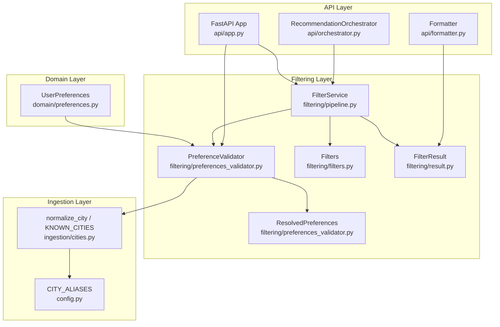
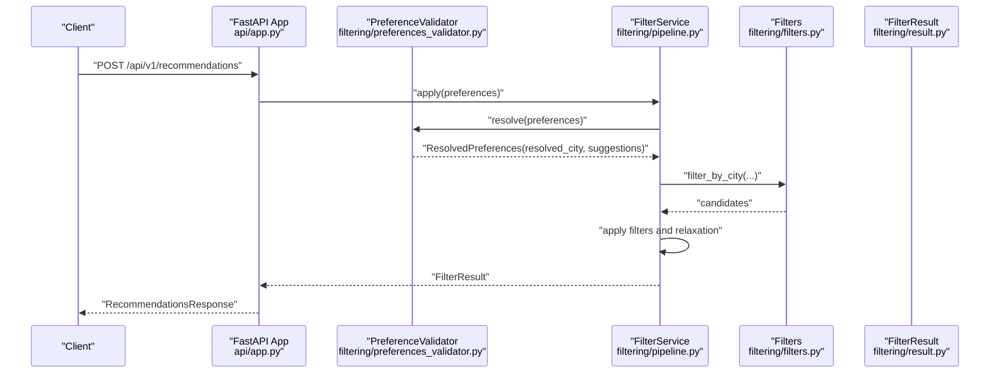
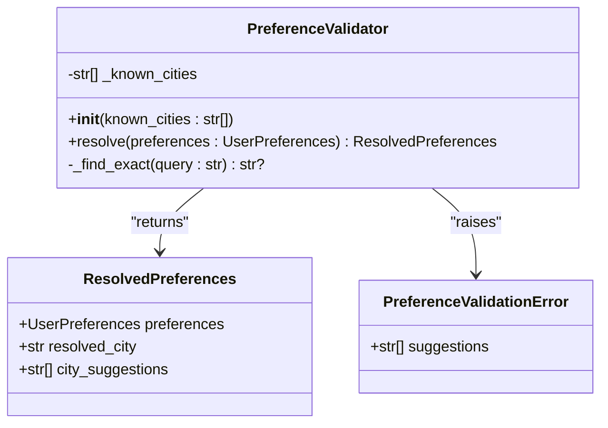
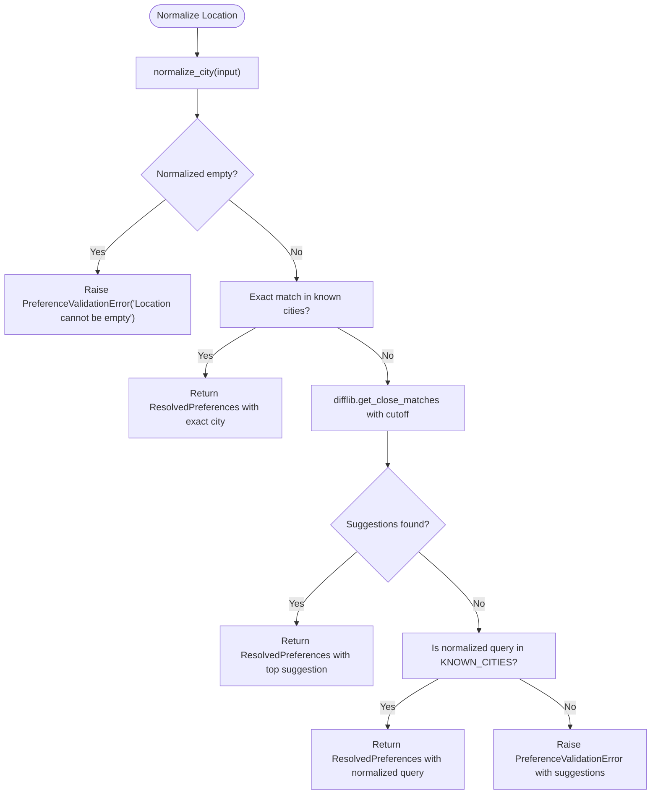
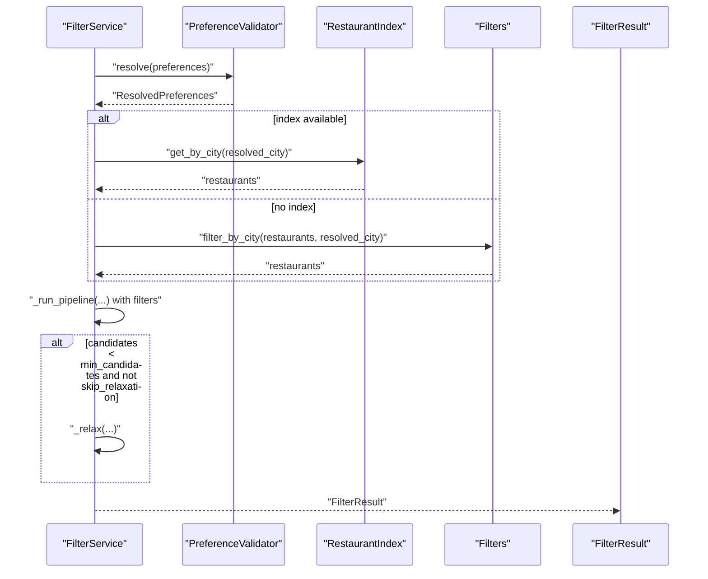
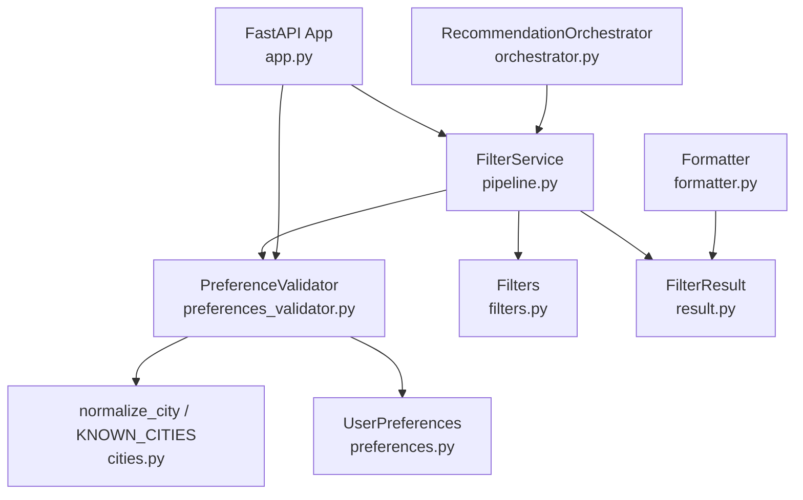

# Preference Validation and Resolution

<cite>
**Referenced Files in This Document**
- [preferences_validator.py](file://src/filtering/preferences_validator.py)
- [preferences.py](file://src/domain/preferences.py)
- [pipeline.py](file://src/filtering/pipeline.py)
- [filters.py](file://src/filtering/filters.py)
- [cities.py](file://src/ingestion/cities.py)
- [result.py](file://src/filtering/result.py)
- [app.py](file://src/api/app.py)
- [orchestrator.py](file://src/api/orchestrator.py)
- [formatter.py](file://src/api/formatter.py)
- [test_preferences_validator.py](file://tests/test_preferences_validator.py)
- [config.py](file://src/config.py)
- [restaurant.py](file://src/domain/restaurant.py)
</cite>

## Table of Contents
1. [Introduction](#introduction)
2. [Project Structure](#project-structure)
3. [Core Components](#core-components)
4. [Architecture Overview](#architecture-overview)
5. [Detailed Component Analysis](#detailed-component-analysis)
6. [Dependency Analysis](#dependency-analysis)
7. [Performance Considerations](#performance-considerations)
8. [Troubleshooting Guide](#troubleshooting-guide)
9. [Conclusion](#conclusion)

## Introduction
This document explains the preference validation and resolution system that transforms raw user preferences into validated, normalized values for downstream filtering. It focuses on:
- The PreferenceValidator class and its role in resolving user input preferences
- The ResolvedPreferences structure and how raw preferences become normalized
- City resolution logic, preference conflict handling, and suggestion generation for unknown locations
- Examples of validation scenarios, error handling for invalid inputs
- The relationship between validation results and downstream filtering operations
- Integration with the known cities database and fallback mechanisms

## Project Structure
The preference validation and resolution system spans several modules:
- Domain models define the shape of user preferences
- Filtering pipeline validates preferences and applies deterministic filters
- City normalization and known city database support robust location resolution
- API integration surfaces validation errors and suggestions to clients

**Diagram sources**
- [preferences_validator.py:1-76](file://src/filtering/preferences_validator.py#L1-L76)
- [preferences.py:15-29](file://src/domain/preferences.py#L15-L29)
- [pipeline.py:31-204](file://src/filtering/pipeline.py#L31-L204)
- [filters.py:1-125](file://src/filtering/filters.py#L1-L125)
- [cities.py:15-92](file://src/ingestion/cities.py#L15-L92)
- [config.py:12-34](file://src/config.py#L12-L34)
- [result.py:11-20](file://src/filtering/result.py#L11-L20)
- [app.py:166-242](file://src/api/app.py#L166-L242)
- [orchestrator.py:30-99](file://src/api/orchestrator.py#L30-L99)
- [formatter.py:16-49](file://src/api/formatter.py#L16-L49)

**Section sources**
- [preferences_validator.py:1-76](file://src/filtering/preferences_validator.py#L1-L76)
- [preferences.py:15-29](file://src/domain/preferences.py#L15-L29)
- [pipeline.py:31-204](file://src/filtering/pipeline.py#L31-L204)
- [filters.py:1-125](file://src/filtering/filters.py#L1-L125)
- [cities.py:15-92](file://src/ingestion/cities.py#L15-L92)
- [config.py:12-34](file://src/config.py#L12-L34)
- [result.py:11-20](file://src/filtering/result.py#L11-L20)
- [app.py:166-242](file://src/api/app.py#L166-L242)
- [orchestrator.py:30-99](file://src/api/orchestrator.py#L30-L99)
- [formatter.py:16-49](file://src/api/formatter.py#L16-L49)

## Core Components
- PreferenceValidator: Resolves and validates user preferences, primarily focusing on city normalization and known city matching. It raises a dedicated validation error with suggestions when a location cannot be resolved.
- ResolvedPreferences: A data structure containing the original preferences, the resolved canonical city, and optional city suggestions generated from fuzzy matching.
- FilterService: Applies the validation and a deterministic filtering pipeline. It integrates with the validator and downstream filters to produce a shortlist of candidates, with configurable relaxation steps.
- Known Cities Database: Provides canonical city names and normalization rules, including aliases and title-case normalization.
- API Integration: Exposes endpoints that surface validation errors and suggestions to clients, and formats results for downstream recommendation engines.

Key responsibilities:
- Normalize user input location using alias mapping and title-case rules
- Resolve to an exact known city match or suggest alternatives via fuzzy matching
- Fail fast with actionable suggestions for unknown locations
- Feed validated preferences into the filtering pipeline and LLM recommendation engine

**Section sources**
- [preferences_validator.py:21-76](file://src/filtering/preferences_validator.py#L21-L76)
- [pipeline.py:31-104](file://src/filtering/pipeline.py#L31-L104)
- [cities.py:51-92](file://src/ingestion/cities.py#L51-L92)
- [app.py:178-182](file://src/api/app.py#L178-L182)

## Architecture Overview
The preference validation and resolution system follows a layered architecture:
- Domain layer defines the UserPreferences model with Pydantic validation
- Filtering layer orchestrates validation and deterministic filtering
- Ingestion layer provides city normalization and known city sets
- API layer integrates validation with endpoints and error handling

**Diagram sources**
- [app.py:211-242](file://src/api/app.py#L211-L242)
- [preferences_validator.py:37-68](file://src/filtering/preferences_validator.py#L37-L68)
- [pipeline.py:42-103](file://src/filtering/pipeline.py#L42-L103)
- [filters.py:27-125](file://src/filtering/filters.py#L27-L125)
- [result.py:11-20](file://src/filtering/result.py#L11-L20)

## Detailed Component Analysis

### PreferenceValidator
The PreferenceValidator resolves user location preferences against a known city database and returns normalized results with optional suggestions.

Responsibilities:
- Normalize raw location input using alias mapping and title-case rules
- Exact match against known cities
- Fuzzy matching with difflib to suggest alternatives
- Raise a structured error with suggestions when no match is found

**Diagram sources**
- [preferences_validator.py:28-76](file://src/filtering/preferences_validator.py#L28-L76)
- [preferences_validator.py:21-26](file://src/filtering/preferences_validator.py#L21-L26)
- [preferences_validator.py:13-19](file://src/filtering/preferences_validator.py#L13-L19)

Key behaviors:
- Normalization: Uses normalize_city to transform input into a canonical form
- Exact match: Linear scan for case-insensitive equality against known cities
- Fuzzy matching: Uses difflib to find close matches with tunable cutoff
- Fallback: If the normalized query is itself present in the known cities set, accept it
- Error handling: Raises PreferenceValidationError with suggestions populated from difflib or defaults

Validation scenarios:
- Exact city match: Returns ResolvedPreferences with resolved_city equal to the exact match
- Alias normalization: Converts known aliases to canonical city names
- Close match: Returns ResolvedPreferences with the top suggestion
- Unknown city: Raises PreferenceValidationError with suggestions

**Section sources**
- [preferences_validator.py:31-68](file://src/filtering/preferences_validator.py#L31-L68)
- [preferences_validator.py:70-76](file://src/filtering/preferences_validator.py#L70-L76)
- [test_preferences_validator.py:7-27](file://tests/test_preferences_validator.py#L7-L27)

### ResolvedPreferences
ResolvedPreferences encapsulates the validated and normalized preferences along with city resolution metadata.

Structure:
- preferences: Original UserPreferences object
- resolved_city: Canonical city name
- city_suggestions: Optional list of suggested cities derived from fuzzy matching

Usage:
- Returned by PreferenceValidator.resolve
- Passed to downstream filtering pipeline to constrain results by city

**Section sources**
- [preferences_validator.py:21-26](file://src/filtering/preferences_validator.py#L21-L26)

### City Resolution Logic
City resolution combines normalization and known city matching:

Normalization:
- normalize_city applies alias mapping and title-casing
- Handles empty or whitespace-only inputs gracefully

Known city matching:
- Exact match via case-insensitive comparison
- Fuzzy matching with difflib.get_close_matches using a cutoff threshold
- Final fallback checks whether the normalized query is present in the known cities set

Integration with known cities database:
- PreferenceValidator merges provided known_cities with the module-level KNOWN_CITIES
- The ingestion module defines KNOWN_CITIES and provides normalize_city and extraction utilities

**Diagram sources**
- [preferences_validator.py:37-68](file://src/filtering/preferences_validator.py#L37-L68)
- [cities.py:51-92](file://src/ingestion/cities.py#L51-L92)
- [config.py:12-34](file://src/config.py#L12-L34)

**Section sources**
- [preferences_validator.py:37-68](file://src/filtering/preferences_validator.py#L37-L68)
- [cities.py:51-92](file://src/ingestion/cities.py#L51-L92)
- [config.py:12-34](file://src/config.py#L12-L34)

### Preference Conflict Handling and Downstream Filtering
The FilterService coordinates validation and filtering:
- Validates and resolves preferences via PreferenceValidator
- Applies filters in sequence: rating, cuisine, budget, keyword
- Supports relaxation steps to broaden filters when candidate count is below thresholds
- Produces FilterResult with metadata indicating empty reasons and relaxation steps

**Diagram sources**
- [pipeline.py:42-103](file://src/filtering/pipeline.py#L42-L103)
- [filters.py:27-125](file://src/filtering/filters.py#L27-L125)
- [result.py:11-20](file://src/filtering/result.py#L11-L20)

Downstream filtering operations:
- filter_by_city constrains restaurants to the resolved city
- filter_by_rating, filter_by_cuisine, filter_by_budget enforce preference constraints
- apply_keyword_filter performs a soft keyword match that falls back to the full set if no matches exist
- sort_candidates ranks results by rating, cost fit, and stability
- truncate limits the final candidate list

Relaxation steps:
- Widen budget bands
- Drop keyword filter
- Lower minimum rating toward a floor
- Drop cuisine filter

**Section sources**
- [pipeline.py:105-204](file://src/filtering/pipeline.py#L105-L204)
- [filters.py:27-125](file://src/filtering/filters.py#L27-L125)

### Suggestion Generation for Unknown Locations
When a location cannot be resolved:
- difflib.get_close_matches generates up to five suggestions with a cutoff threshold
- If no suggestions are found, the error includes defaults from KNOWN_CITIES
- The suggestions are surfaced to clients via the API layer

API integration:
- Endpoints catch PreferenceValidationError and return HTTP 400 with message and suggestions
- Clients receive structured error details to guide correction

**Section sources**
- [preferences_validator.py:65-68](file://src/filtering/preferences_validator.py#L65-L68)
- [app.py:178-182](file://src/api/app.py#L178-L182)

### Relationship Between Validation Results and Downstream Operations
- Validation determines the resolved_city used to constrain the initial dataset
- FilterResult carries resolved_city and city_suggestions for downstream presentation
- Empty reasons indicate whether no results were found due to unknown location or post-relaxation
- Relaxation metadata informs clients about which filters were relaxed

**Section sources**
- [pipeline.py:55-103](file://src/filtering/pipeline.py#L55-L103)
- [result.py:11-20](file://src/filtering/result.py#L11-L20)

## Dependency Analysis
The preference validation and resolution system exhibits strong cohesion within the filtering layer and clear boundaries with domain, ingestion, and API layers.

**Diagram sources**
- [preferences_validator.py:9-10](file://src/filtering/preferences_validator.py#L9-L10)
- [pipeline.py:21-23](file://src/filtering/pipeline.py#L21-L23)
- [filters.py:8-9](file://src/filtering/filters.py#L8-L9)
- [result.py:8-9](file://src/filtering/result.py#L8-L9)
- [app.py:27-29](file://src/api/app.py#L27-L29)
- [orchestrator.py:13-17](file://src/api/orchestrator.py#L13-L17)
- [formatter.py:12-13](file://src/api/formatter.py#L12-L13)

**Section sources**
- [preferences_validator.py:9-10](file://src/filtering/preferences_validator.py#L9-L10)
- [pipeline.py:21-23](file://src/filtering/pipeline.py#L21-L23)
- [filters.py:8-9](file://src/filtering/filters.py#L8-L9)
- [result.py:8-9](file://src/filtering/result.py#L8-L9)
- [app.py:27-29](file://src/api/app.py#L27-L29)
- [orchestrator.py:13-17](file://src/api/orchestrator.py#L13-L17)
- [formatter.py:12-13](file://src/api/formatter.py#L12-L13)

## Performance Considerations
- City resolution uses linear scanning over known cities; performance depends on the size of the known city set
- Fuzzy matching uses difflib with a fixed cutoff and limit; tuning these parameters affects latency and recall
- The filtering pipeline applies multiple passes; relaxation steps add computational overhead
- Recommendations are produced by an external LLM engine; ensure the filter pipeline completes within acceptable latency targets

[No sources needed since this section provides general guidance]

## Troubleshooting Guide
Common issues and resolutions:
- Empty location input: Validation fails early with a dedicated error; ensure the location field is provided and non-empty
- Unknown city: The validator raises an error with suggestions; use the suggestions or confirm spelling
- No candidates after filtering: The pipeline may relax filters; review min_candidates and relaxation settings
- API error responses: Endpoints return HTTP 400 with message and suggestions; use suggestions to correct input

Error handling in API:
- Endpoints catch PreferenceValidationError and return structured details including suggestions
- Clients should display suggestions to help users refine their preferences

**Section sources**
- [preferences_validator.py:13-19](file://src/filtering/preferences_validator.py#L13-L19)
- [app.py:178-182](file://src/api/app.py#L178-L182)
- [test_preferences_validator.py:21-27](file://tests/test_preferences_validator.py#L21-L27)

## Conclusion
The preference validation and resolution system ensures robust, normalized city resolution and integrates tightly with a deterministic filtering pipeline. It provides clear error signaling with actionable suggestions, supports configurable relaxation for improved coverage, and exposes results with sufficient metadata for downstream recommendation systems. The modular design enables easy extension of known cities and refinement of normalization rules.