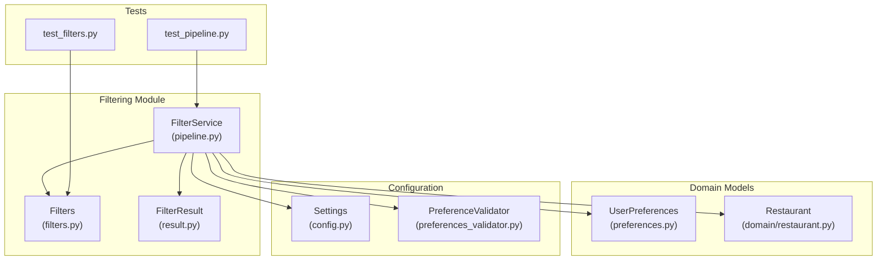
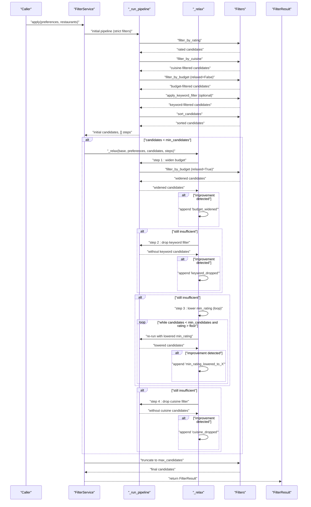
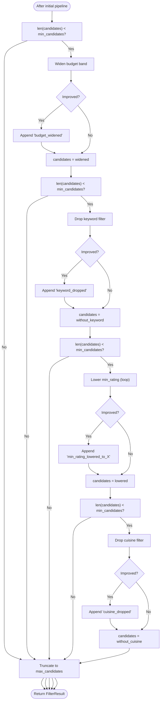
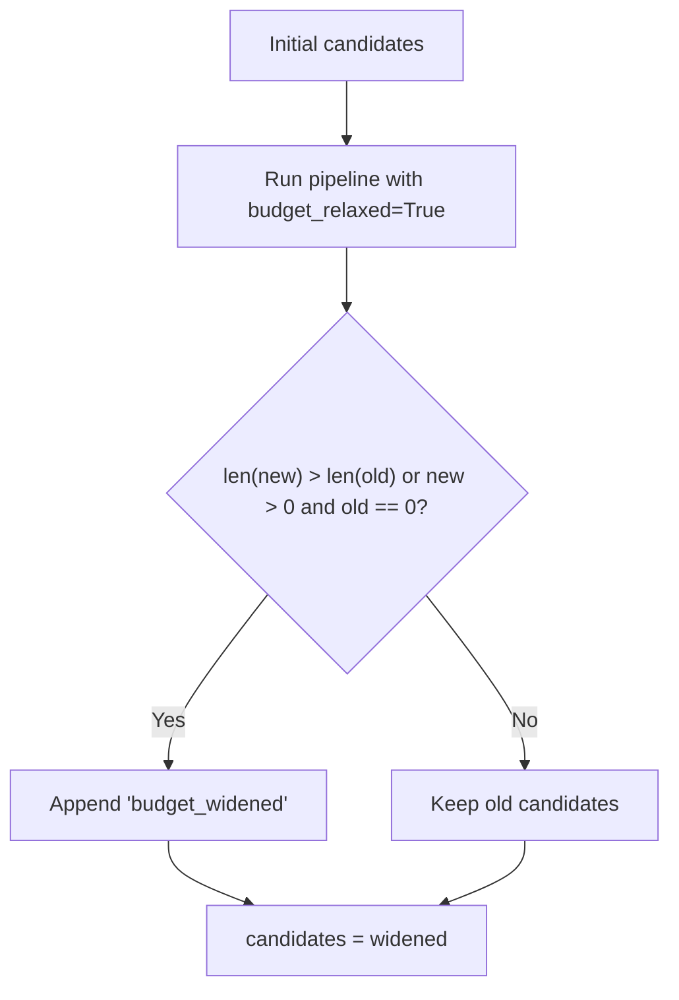
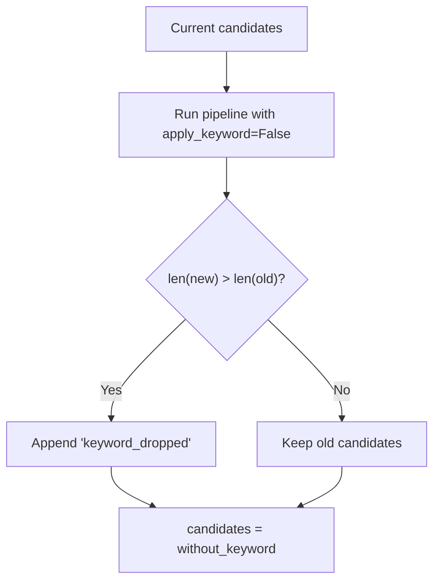
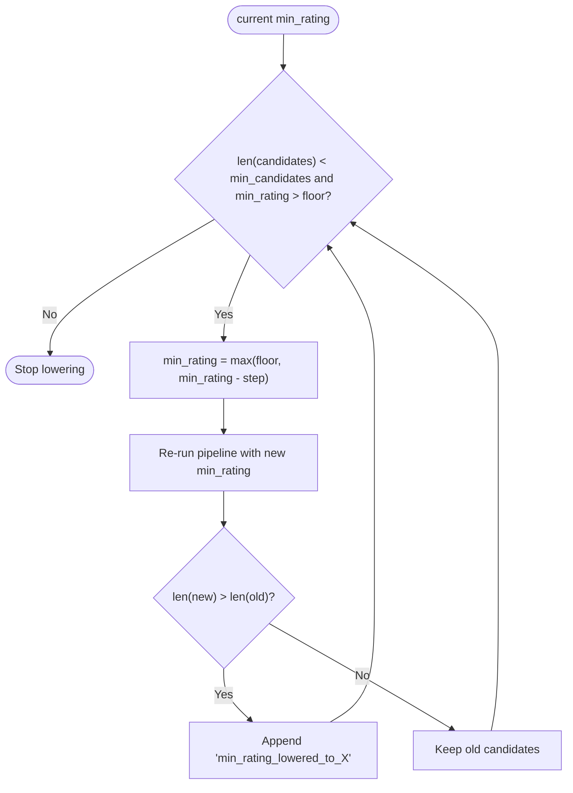
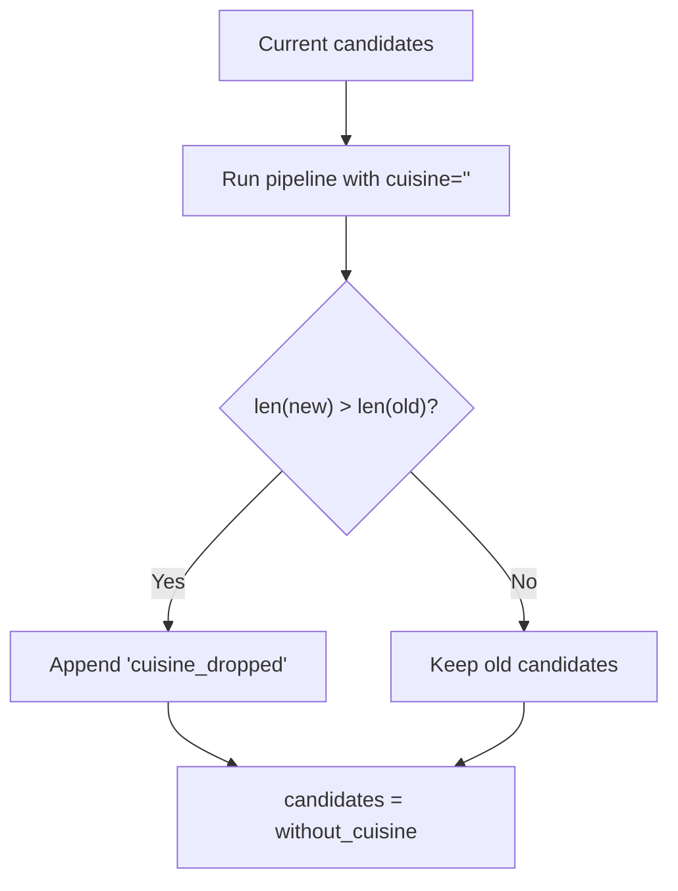
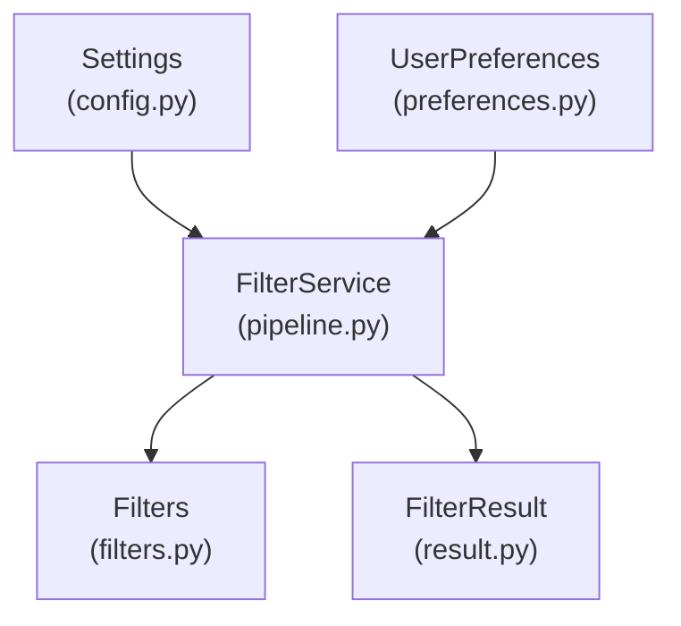

# Relaxation Logic and Fallback Strategies

<cite>
**Referenced Files in This Document**
- [pipeline.py](file://src/filtering/pipeline.py)
- [filters.py](file://src/filtering/filters.py)
- [result.py](file://src/filtering/result.py)
- [config.py](file://src/config.py)
- [preferences.py](file://src/domain/preferences.py)
- [preferences_validator.py](file://src/filtering/preferences_validator.py)
- [test_pipeline.py](file://tests/test_pipeline.py)
- [test_filters.py](file://tests/test_filters.py)
</cite>

## Table of Contents
1. [Introduction](#introduction)
2. [Project Structure](#project-structure)
3. [Core Components](#core-components)
4. [Architecture Overview](#architecture-overview)
5. [Detailed Component Analysis](#detailed-component-analysis)
6. [Dependency Analysis](#dependency-analysis)
7. [Performance Considerations](#performance-considerations)
8. [Troubleshooting Guide](#troubleshooting-guide)
9. [Conclusion](#conclusion)

## Introduction
This document explains the relaxation mechanism that ensures minimum candidate generation in the filtering pipeline. It details the four-step relaxation process: budget widening, keyword filter removal, minimum rating reduction, and cuisine filter dropping. The document covers trigger criteria, execution order, improvement detection logic, configurable parameters, scenario examples, performance impact analysis, and transparency mechanisms for tracking which filters were relaxed.

## Project Structure
The relaxation logic resides primarily in the filtering module, with supporting components in configuration, domain models, and tests.

**Diagram sources**
- [pipeline.py:31-103](file://src/filtering/pipeline.py#L31-L103)
- [filters.py:118-125](file://src/filtering/filters.py#L118-L125)
- [result.py:11-20](file://src/filtering/result.py#L11-L20)
- [config.py:46-71](file://src/config.py#L46-L71)
- [preferences.py:15-29](file://src/domain/preferences.py#L15-L29)
- [preferences_validator.py:28-76](file://src/filtering/preferences_validator.py#L28-L76)
- [test_pipeline.py:76-117](file://tests/test_pipeline.py#L76-L117)
- [test_filters.py:92-95](file://tests/test_filters.py#L92-L95)

**Section sources**
- [pipeline.py:1-204](file://src/filtering/pipeline.py#L1-L204)
- [filters.py:1-125](file://src/filtering/filters.py#L1-L125)
- [result.py:1-20](file://src/filtering/result.py#L1-L20)
- [config.py:1-81](file://src/config.py#L1-L81)
- [preferences.py:1-29](file://src/domain/preferences.py#L1-L29)
- [preferences_validator.py:1-76](file://src/filtering/preferences_validator.py#L1-L76)
- [test_pipeline.py:1-131](file://tests/test_pipeline.py#L1-L131)
- [test_filters.py:1-125](file://tests/test_filters.py#L1-L125)

## Core Components
- FilterService: Orchestrates the deterministic pipeline and applies relaxation when candidate count falls below the configured minimum.
- Filters: Individual filter functions for city, rating, cuisine, budget, keyword filtering, sorting, and truncation.
- FilterResult: Encapsulates the final results, including whether filters were relaxed and the sequence of relaxation steps taken.
- Settings: Configurable parameters controlling minimum and maximum candidates, among other system settings.
- UserPreferences: Domain model for user-specified preferences including budget, cuisine, minimum rating, and additional preferences.
- PreferenceValidator: Resolves user location to a canonical city and provides suggestions when needed.

Key relaxation constants:
- Rating floor and step values are defined within the pipeline module for controlled rating reduction.

**Section sources**
- [pipeline.py:31-103](file://src/filtering/pipeline.py#L31-L103)
- [filters.py:118-125](file://src/filtering/filters.py#L118-L125)
- [result.py:11-20](file://src/filtering/result.py#L11-L20)
- [config.py:46-71](file://src/config.py#L46-L71)
- [preferences.py:15-29](file://src/domain/preferences.py#L15-L29)
- [preferences_validator.py:28-76](file://src/filtering/preferences_validator.py#L28-L76)

## Architecture Overview
The relaxation mechanism operates after the initial deterministic pipeline. If the resulting candidate set is smaller than the configured minimum, the system iteratively relaxes filters until either sufficient candidates are found or all relaxation steps have been exhausted.

**Diagram sources**
- [pipeline.py:42-103](file://src/filtering/pipeline.py#L42-L103)
- [pipeline.py:105-129](file://src/filtering/pipeline.py#L105-L129)
- [pipeline.py:131-203](file://src/filtering/pipeline.py#L131-L203)
- [filters.py:37-125](file://src/filtering/filters.py#L37-L125)
- [result.py:11-20](file://src/filtering/result.py#L11-L20)

## Detailed Component Analysis

### Relaxation Trigger Criteria
- Trigger condition: After the initial pipeline, if the number of candidates is less than the configured minimum threshold.
- Minimum threshold: Controlled by Settings.min_candidates.
- Improvement detection: A relaxation step is considered successful if it increases the candidate count compared to the previous iteration or yields a non-empty set when the current set is empty.

**Diagram sources**
- [pipeline.py:75-82](file://src/filtering/pipeline.py#L75-L82)
- [pipeline.py:145-201](file://src/filtering/pipeline.py#L145-L201)

**Section sources**
- [pipeline.py:75-82](file://src/filtering/pipeline.py#L75-L82)
- [pipeline.py:145-201](file://src/filtering/pipeline.py#L145-L201)
- [config.py:56](file://src/config.py#L56)

### Four-Step Relaxation Process

#### Step 1: Budget Widening
- Purpose: Expand the allowed budget bands to increase candidate availability.
- Mechanism: Uses expanded budget bands when relaxed=True.
- Detection: Appended to relaxation_steps as "budget_widened" if improvement is observed.

**Diagram sources**
- [pipeline.py:146-157](file://src/filtering/pipeline.py#L146-L157)
- [filters.py:18-24](file://src/filtering/filters.py#L18-L24)
- [filters.py:59-66](file://src/filtering/filters.py#L59-L66)

**Section sources**
- [pipeline.py:146-157](file://src/filtering/pipeline.py#L146-L157)
- [filters.py:18-24](file://src/filtering/filters.py#L18-L24)
- [filters.py:59-66](file://src/filtering/filters.py#L59-L66)

#### Step 2: Keyword Filter Removal
- Purpose: Remove the soft keyword filter to broaden results.
- Mechanism: Re-runs pipeline with apply_keyword=False.
- Detection: Appended to relaxation_steps as "keyword_dropped" if improvement is observed.

**Diagram sources**
- [pipeline.py:160-170](file://src/filtering/pipeline.py#L160-L170)
- [filters.py:84-101](file://src/filtering/filters.py#L84-L101)

**Section sources**
- [pipeline.py:160-170](file://src/filtering/pipeline.py#L160-L170)
- [filters.py:84-101](file://src/filtering/filters.py#L84-L101)

#### Step 3: Minimum Rating Reduction
- Purpose: Lower the minimum rating threshold to include more candidates.
- Mechanism: Iteratively reduces min_rating by a fixed step until improvement is observed or the rating floor is reached.
- Detection: Appended to relaxation_steps with the specific rating value (e.g., "min_rating_lowered_to_4.0").

**Diagram sources**
- [pipeline.py:172-187](file://src/filtering/pipeline.py#L172-L187)
- [pipeline.py:27-28](file://src/filtering/pipeline.py#L27-L28)

**Section sources**
- [pipeline.py:172-187](file://src/filtering/pipeline.py#L172-L187)
- [pipeline.py:27-28](file://src/filtering/pipeline.py#L27-L28)

#### Step 4: Cuisine Filter Dropping
- Purpose: Remove the cuisine filter to maximize candidate availability.
- Mechanism: Re-runs pipeline with cuisine="".
- Detection: Appended to relaxation_steps as "cuisine_dropped" if improvement is observed.

**Diagram sources**
- [pipeline.py:189-201](file://src/filtering/pipeline.py#L189-L201)
- [filters.py:47-56](file://src/filtering/filters.py#L47-L56)

**Section sources**
- [pipeline.py:189-201](file://src/filtering/pipeline.py#L189-L201)
- [filters.py:47-56](file://src/filtering/filters.py#L47-L56)

### Improvement Detection Logic
- Comparison metric: len(new_candidates) > len(current_candidates).
- Special case: If the new set is non-empty while the current set is empty, the step is still considered an improvement and recorded.
- This ensures that even if the absolute count does not increase, any step that yields at least one candidate is treated as beneficial.

**Section sources**
- [pipeline.py:142-143](file://src/filtering/pipeline.py#L142-L143)
- [pipeline.py:153-155](file://src/filtering/pipeline.py#L153-L155)

### Configurable Parameters
- min_candidates: Minimum number of candidates required before relaxation is triggered.
- max_candidates: Maximum number of candidates to return after truncation.
- top_n_results: Number of top results to return (used in recommendation pipeline).
- Rating floor and step: Controls the lower bound and decrement granularity for min_rating relaxation.
- Additional LLM-related settings: Not directly part of relaxation but influence overall system behavior.

**Section sources**
- [config.py:55-57](file://src/config.py#L55-L57)
- [config.py:66-71](file://src/config.py#L66-L71)
- [pipeline.py:27-28](file://src/filtering/pipeline.py#L27-L28)

### Transparency and Tracking
- filters_relaxed: Boolean flag indicating whether any relaxation was applied.
- relaxation_steps: Ordered list of steps taken, enabling full auditability of the decision-making process.
- empty_reason: Set to "no_matches_after_relaxation" when no candidates remain even after relaxation.

**Section sources**
- [result.py:15-16](file://src/filtering/result.py#L15-L16)
- [result.py:16](file://src/filtering/result.py#L16)
- [pipeline.py:93-93](file://src/filtering/pipeline.py#L93-L93)

### Examples of Relaxation Scenarios
- Budget widening: When a strict budget band yields fewer candidates than the minimum threshold, the system expands the budget bands and re-runs the pipeline.
- Keyword filter removal: When keyword filtering is too restrictive, removing it can yield more candidates.
- Minimum rating reduction: When the minimum rating is set too high for the available dataset, lowering it incrementally can improve candidate counts.
- Cuisine filter dropping: When cuisine filtering is overly restrictive, removing it maximizes candidate availability.

These scenarios are validated by tests demonstrating the relaxation steps and their outcomes.

**Section sources**
- [test_pipeline.py:76-97](file://tests/test_pipeline.py#L76-L97)
- [test_pipeline.py:100-117](file://tests/test_pipeline.py#L100-L117)
- [test_filters.py:92-95](file://tests/test_filters.py#L92-L95)

## Dependency Analysis
The relaxation logic depends on:
- Settings for min_candidates and max_candidates thresholds.
- UserPreferences for budget, cuisine, min_rating, and additional preferences.
- Filters for rating, cuisine, budget, keyword filtering, sorting, and truncation.
- FilterResult for returning the final state, including relaxation flags and steps.

**Diagram sources**
- [config.py:46-71](file://src/config.py#L46-L71)
- [preferences.py:15-29](file://src/domain/preferences.py#L15-L29)
- [pipeline.py:34-40](file://src/filtering/pipeline.py#L34-L40)
- [filters.py:118-125](file://src/filtering/filters.py#L118-L125)
- [result.py:11-20](file://src/filtering/result.py#L11-L20)

**Section sources**
- [config.py:46-71](file://src/config.py#L46-L71)
- [preferences.py:15-29](file://src/domain/preferences.py#L15-L29)
- [pipeline.py:34-40](file://src/filtering/pipeline.py#L34-L40)
- [filters.py:118-125](file://src/filtering/filters.py#L118-L125)
- [result.py:11-20](file://src/filtering/result.py#L11-L20)

## Performance Considerations
- The pipeline logs warnings when execution exceeds a target duration, indicating potential performance bottlenecks.
- Each relaxation step involves re-running the pipeline, which can be computationally expensive depending on dataset size.
- Recommendations:
  - Tune min_candidates and max_candidates to balance candidate availability and performance.
  - Consider indexing strategies for city and cuisine filtering to reduce runtime.
  - Monitor empty_reason to detect scenarios where relaxation is frequently needed, signaling potential misalignment between user preferences and dataset characteristics.

**Section sources**
- [pipeline.py:88-89](file://src/filtering/pipeline.py#L88-L89)

## Troubleshooting Guide
Common issues and resolutions:
- No candidates returned: Check empty_reason and relaxation_steps to understand which filters were relaxed.
- Excessive relaxation: Review min_candidates and rating floor settings; adjust preferences to align with dataset distribution.
- Performance degradation: Investigate pipeline timing and consider reducing max_candidates or optimizing filters.

Validation references:
- Tests demonstrate relaxation behavior under various conditions, including budget widening and rating reduction scenarios.

**Section sources**
- [test_pipeline.py:76-117](file://tests/test_pipeline.py#L76-L117)
- [pipeline.py:93-93](file://src/filtering/pipeline.py#L93-L93)

## Conclusion
The relaxation mechanism provides a robust fallback strategy to ensure minimum candidate generation while maintaining transparency. By systematically widening budgets, removing restrictive filters, lowering rating thresholds, and finally dropping cuisine constraints, the system balances strict filtering with practical availability. Configurable parameters and detailed tracking enable operators to monitor and tune the behavior for optimal user experience.