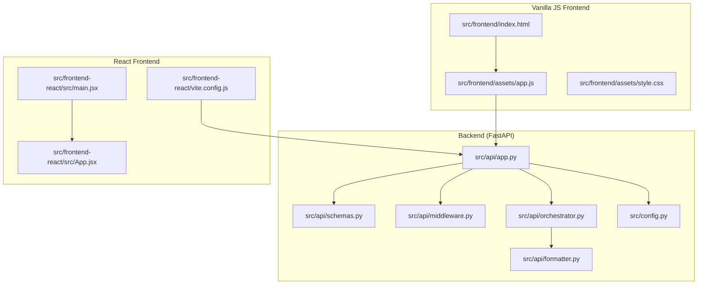
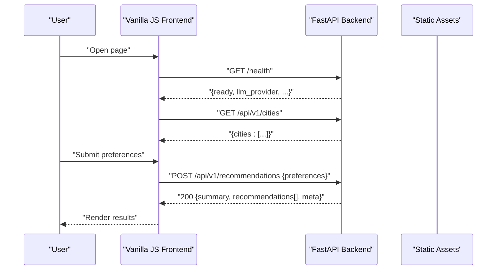
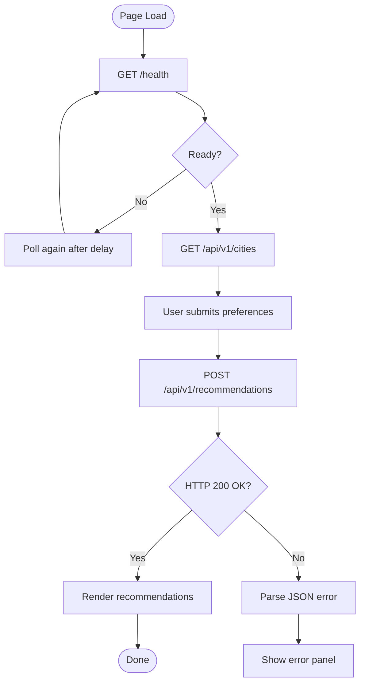
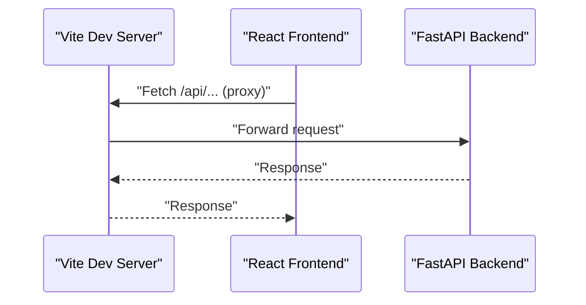
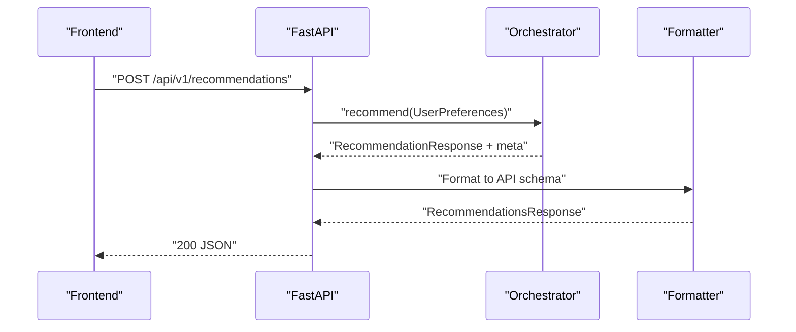
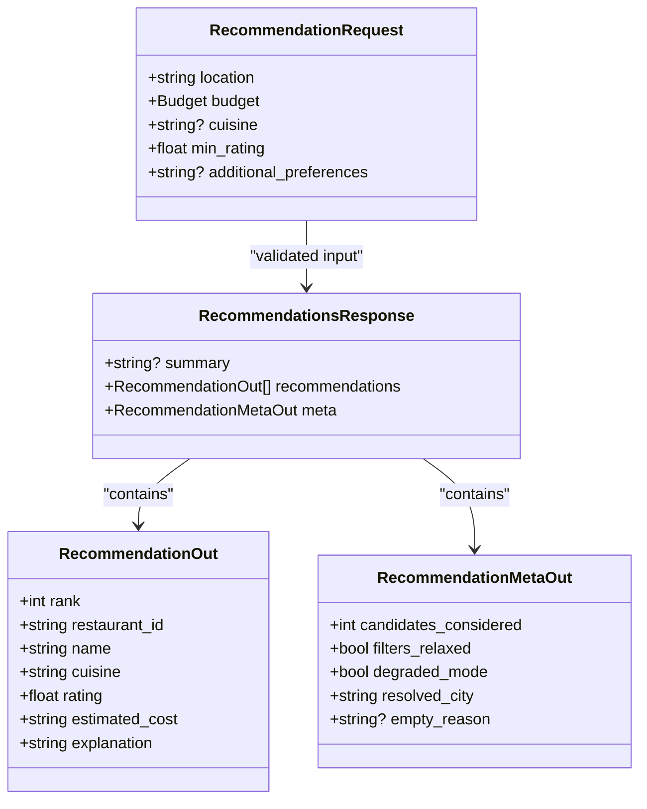
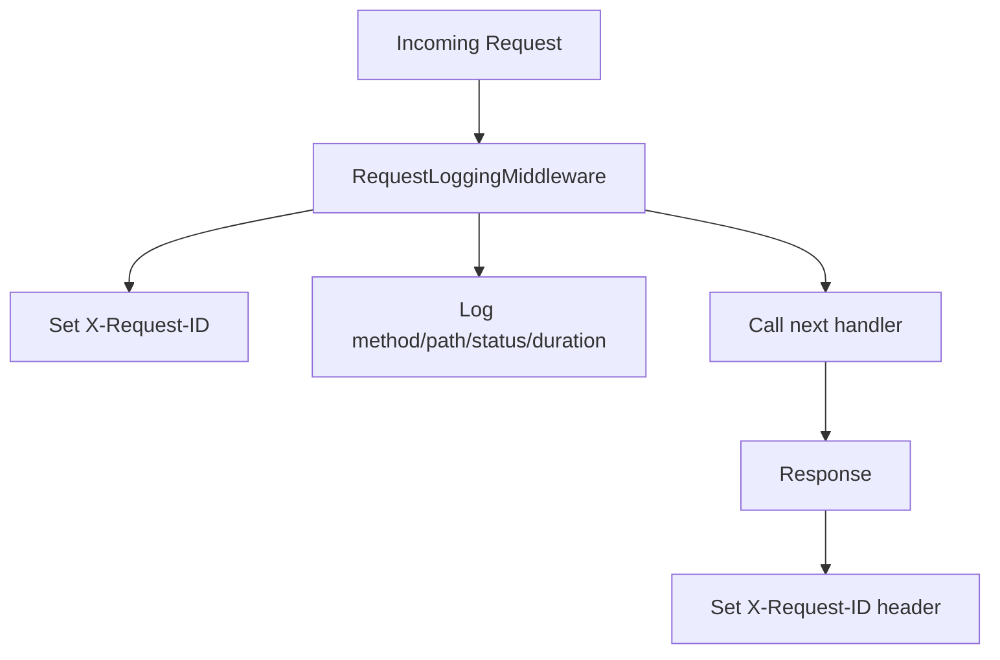
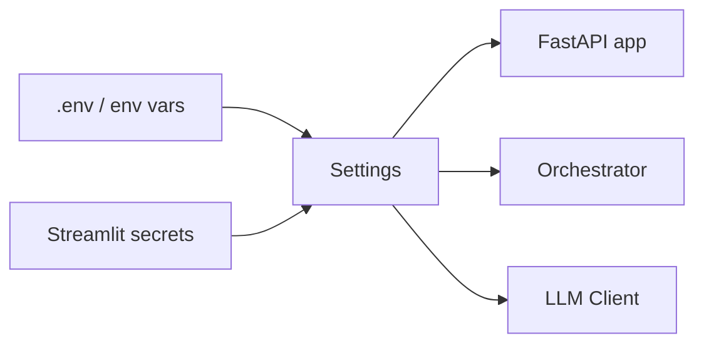
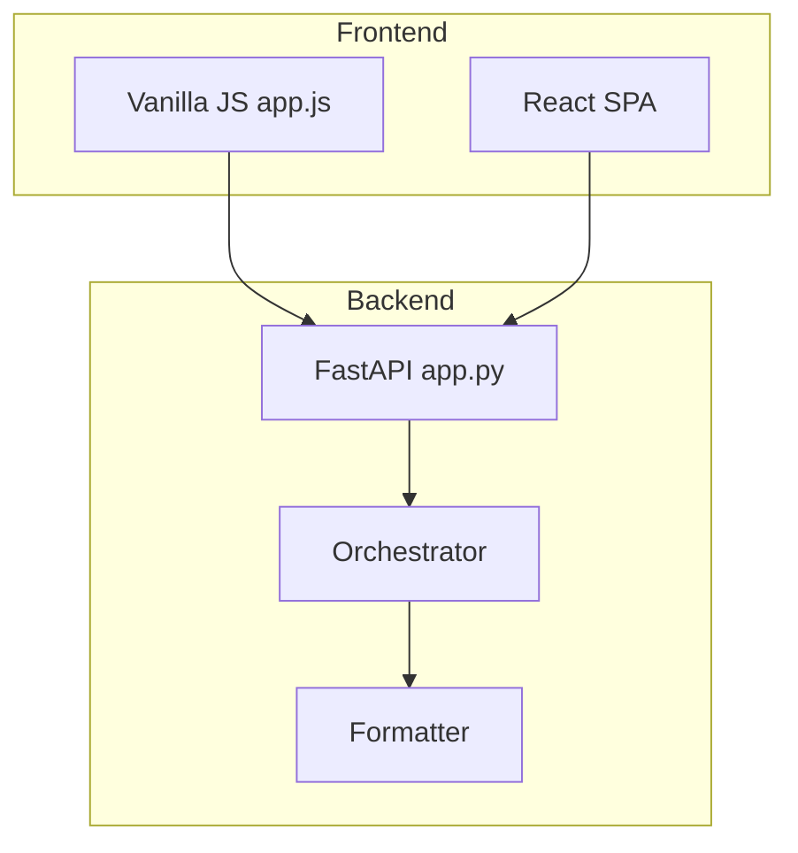

# API Integration Patterns

<cite>
**Referenced Files in This Document**
- [src/frontend/assets/app.js](file://src/frontend/assets/app.js)
- [src/frontend/index.html](file://src/frontend/index.html)
- [src/frontend/assets/style.css](file://src/frontend/assets/style.css)
- [src/frontend-react/src/main.jsx](file://src/frontend-react/src/main.jsx)
- [src/frontend-react/src/App.jsx](file://src/frontend-react/src/App.jsx)
- [src/frontend-react/vite.config.js](file://src/frontend-react/vite.config.js)
- [src/api/app.py](file://src/api/app.py)
- [src/api/schemas.py](file://src/api/schemas.py)
- [src/api/middleware.py](file://src/api/middleware.py)
- [src/api/orchestrator.py](file://src/api/orchestrator.py)
- [src/api/formatter.py](file://src/api/formatter.py)
- [src/config.py](file://src/config.py)
- [docs/edge-cases.md](file://docs/edge-cases.md)
</cite>

## Table of Contents
1. [Introduction](#introduction)
2. [Project Structure](#project-structure)
3. [Core Components](#core-components)
4. [Architecture Overview](#architecture-overview)
5. [Detailed Component Analysis](#detailed-component-analysis)
6. [Dependency Analysis](#dependency-analysis)
7. [Performance Considerations](#performance-considerations)
8. [Troubleshooting Guide](#troubleshooting-guide)
9. [Conclusion](#conclusion)
10. [Appendices](#appendices)

## Introduction
This document explains the API integration patterns implemented across the two frontend applications: a vanilla JavaScript single-page app and a React-based SPA. It covers HTTP request patterns, response handling, error management, authentication considerations, request headers, data serialization, endpoint consumption, data transformation pipelines, and caching strategies. It also documents CORS configuration, security considerations, rate limiting approaches, and the end-to-end data flow between frontend and backend.

## Project Structure
The repository contains:
- A FastAPI backend exposing REST endpoints and serving a static frontend.
- A vanilla JavaScript frontend served statically by the backend.
- A React frontend built via Vite and configured to proxy API calls to the backend.

**Diagram sources**
- [src/api/app.py:79-94](file://src/api/app.py#L79-L94)
- [src/api/schemas.py:13-31](file://src/api/schemas.py#L13-L31)
- [src/api/middleware.py:17-37](file://src/api/middleware.py#L17-L37)
- [src/api/orchestrator.py:30-98](file://src/api/orchestrator.py#L30-L98)
- [src/api/formatter.py:16-44](file://src/api/formatter.py#L16-L44)
- [src/config.py:46-80](file://src/config.py#L46-L80)
- [src/frontend/index.html:1-230](file://src/frontend/index.html#L1-L230)
- [src/frontend/assets/app.js:1-333](file://src/frontend/assets/app.js#L1-L333)
- [src/frontend/assets/style.css:1-200](file://src/frontend/assets/style.css#L1-L200)
- [src/frontend-react/src/main.jsx:1-11](file://src/frontend-react/src/main.jsx#L1-L11)
- [src/frontend-react/src/App.jsx:1-123](file://src/frontend-react/src/App.jsx#L1-L123)
- [src/frontend-react/vite.config.js:1-19](file://src/frontend-react/vite.config.js#L1-L19)

**Section sources**
- [src/api/app.py:79-94](file://src/api/app.py#L79-L94)
- [src/frontend/index.html:1-230](file://src/frontend/index.html#L1-L230)
- [src/frontend/assets/app.js:1-333](file://src/frontend/assets/app.js#L1-L333)
- [src/frontend-react/vite.config.js:1-19](file://src/frontend-react/vite.config.js#L1-L19)

## Core Components
- Backend endpoints:
  - GET /health and GET /health/ready for readiness and liveness.
  - GET /api/v1/cities for city enumeration.
  - POST /api/v1/recommendations for AI-powered recommendations.
- Frontends:
  - Vanilla JS SPA that performs GET and POST requests and renders results.
  - React SPA that proxies API calls to the backend via Vite dev server.

Key integration behaviors:
- Authentication: No authentication is enforced by the backend; clients should treat endpoints as public unless configured otherwise.
- Headers: Requests to POST /api/v1/recommendations include Content-Type: application/json.
- Data serialization: Pydantic schemas enforce strict request validation and response shaping.
- Error handling: Backend returns structured JSON with detail messages; frontend displays user-friendly states.

**Section sources**
- [src/api/app.py:137-163](file://src/api/app.py#L137-L163)
- [src/api/app.py:211-242](file://src/api/app.py#L211-L242)
- [src/api/schemas.py:13-31](file://src/api/schemas.py#L13-L31)
- [src/frontend/assets/app.js:169-193](file://src/frontend/assets/app.js#L169-L193)

## Architecture Overview
The system integrates a static frontend with a FastAPI backend. The vanilla JS frontend consumes endpoints directly, while the React frontend proxies API calls through Vite’s development server to the backend.

**Diagram sources**
- [src/frontend/assets/app.js:96-140](file://src/frontend/assets/app.js#L96-L140)
- [src/frontend/assets/app.js:169-193](file://src/frontend/assets/app.js#L169-L193)
- [src/api/app.py:137-163](file://src/api/app.py#L137-L163)
- [src/api/app.py:211-242](file://src/api/app.py#L211-L242)

## Detailed Component Analysis

### Vanilla JavaScript Frontend Integration
- Initialization and health checks:
  - On DOMContentLoaded, the app checks /health and updates the status indicator.
  - If not ready, it retries periodically.
- City loading:
  - Fetches /api/v1/cities and populates the location dropdown.
- Search submission:
  - Serializes form data into a JSON payload and posts to /api/v1/recommendations.
  - Uses Content-Type: application/json.
- Response handling:
  - On success, renders recommendations and metadata.
  - On error, parses JSON error payload and shows an error panel.
- UI state management:
  - Switches between welcome, loading, results, empty, and error panels.
- Security and sanitization:
  - The backend strips HTML tags and collapses whitespace from string fields.

**Diagram sources**
- [src/frontend/assets/app.js:96-140](file://src/frontend/assets/app.js#L96-L140)
- [src/frontend/assets/app.js:169-193](file://src/frontend/assets/app.js#L169-L193)
- [src/api/app.py:137-163](file://src/api/app.py#L137-L163)
- [src/api/app.py:211-242](file://src/api/app.py#L211-L242)

**Section sources**
- [src/frontend/assets/app.js:1-333](file://src/frontend/assets/app.js#L1-L333)
- [src/frontend/index.html:1-230](file://src/frontend/index.html#L1-L230)
- [src/api/schemas.py:20-31](file://src/api/schemas.py#L20-L31)

### React Frontend Integration
- Build and proxy configuration:
  - Vite builds the React app and outputs to the backend’s static assets folder.
  - Dev server proxies /api and /health to the backend.
- SPA bootstrap:
  - Root mounts the App component; current App.jsx is a placeholder for future integration.

**Diagram sources**
- [src/frontend-react/vite.config.js:12-18](file://src/frontend-react/vite.config.js#L12-L18)
- [src/frontend-react/src/main.jsx:1-11](file://src/frontend-react/src/main.jsx#L1-L11)
- [src/frontend-react/src/App.jsx:1-123](file://src/frontend-react/src/App.jsx#L1-L123)

**Section sources**
- [src/frontend-react/vite.config.js:1-19](file://src/frontend-react/vite.config.js#L1-L19)
- [src/frontend-react/src/main.jsx:1-11](file://src/frontend-react/src/main.jsx#L1-L11)
- [src/frontend-react/src/App.jsx:1-123](file://src/frontend-react/src/App.jsx#L1-L123)

### Backend API Endpoints and Data Flow
- Health and readiness:
  - /health returns readiness and runtime stats.
  - /health/ready returns 200 when ready, otherwise 503.
- City enumeration:
  - /api/v1/cities returns known cities after ensuring data is loaded.
- Recommendations:
  - POST /api/v1/recommendations validates input, orchestrates filtering and LLM ranking, and formats the response.

**Diagram sources**
- [src/api/app.py:211-242](file://src/api/app.py#L211-L242)
- [src/api/orchestrator.py:45-98](file://src/api/orchestrator.py#L45-L98)
- [src/api/formatter.py:16-44](file://src/api/formatter.py#L16-L44)

**Section sources**
- [src/api/app.py:137-163](file://src/api/app.py#L137-L163)
- [src/api/app.py:211-242](file://src/api/app.py#L211-L242)
- [src/api/orchestrator.py:30-98](file://src/api/orchestrator.py#L30-L98)
- [src/api/formatter.py:16-44](file://src/api/formatter.py#L16-L44)

### Request and Response Schemas
- Request model enforces:
  - String length limits and sanitization.
  - Numeric bounds for min_rating.
- Response model ensures:
  - Structured recommendations with rounded ratings.
  - Metadata for candidates considered, filters relaxed, degraded mode, resolved city, and empty reason.

**Diagram sources**
- [src/api/schemas.py:13-31](file://src/api/schemas.py#L13-L31)
- [src/api/schemas.py:58-80](file://src/api/schemas.py#L58-L80)

**Section sources**
- [src/api/schemas.py:13-31](file://src/api/schemas.py#L13-L31)
- [src/api/schemas.py:58-80](file://src/api/schemas.py#L58-L80)

### Middleware and Observability
- RequestLoggingMiddleware attaches a request ID, logs latency, and sets X-Request-ID on responses.
- CORS is configured via settings with allow-all defaults.

**Diagram sources**
- [src/api/middleware.py:17-37](file://src/api/middleware.py#L17-L37)
- [src/api/app.py:86-94](file://src/api/app.py#L86-L94)

**Section sources**
- [src/api/middleware.py:17-37](file://src/api/middleware.py#L17-L37)
- [src/api/app.py:86-94](file://src/api/app.py#L86-L94)

### Configuration and Environment
- Settings include LLM provider, model, base URL, CORS origins, timeouts, and token limits.
- Streamlit secrets can override environment variables.

**Diagram sources**
- [src/config.py:46-80](file://src/config.py#L46-L80)
- [src/api/app.py:35-39](file://src/api/app.py#L35-L39)

**Section sources**
- [src/config.py:46-80](file://src/config.py#L46-L80)
- [src/api/app.py:35-39](file://src/api/app.py#L35-L39)

## Dependency Analysis
- Frontend to Backend:
  - Vanilla JS directly calls backend endpoints.
  - React dev server proxies API calls to backend.
- Backend to Domain:
  - FastAPI routes depend on orchestrator, which depends on ingestion, filter service, and LLM engine.
  - Formatter maps domain responses to API schemas.

**Diagram sources**
- [src/frontend/assets/app.js:1-333](file://src/frontend/assets/app.js#L1-L333)
- [src/frontend-react/vite.config.js:12-18](file://src/frontend-react/vite.config.js#L12-L18)
- [src/api/app.py:211-242](file://src/api/app.py#L211-L242)
- [src/api/orchestrator.py:30-98](file://src/api/orchestrator.py#L30-L98)
- [src/api/formatter.py:16-44](file://src/api/formatter.py#L16-L44)

**Section sources**
- [src/frontend/assets/app.js:1-333](file://src/frontend/assets/app.js#L1-L333)
- [src/frontend-react/vite.config.js:1-19](file://src/frontend-react/vite.config.js#L1-L19)
- [src/api/app.py:211-242](file://src/api/app.py#L211-L242)
- [src/api/orchestrator.py:30-98](file://src/api/orchestrator.py#L30-L98)
- [src/api/formatter.py:16-44](file://src/api/formatter.py#L16-L44)

## Performance Considerations
- Latency monitoring:
  - Middleware logs request durations; use X-Request-ID to correlate logs.
- Endpoint timing:
  - Orchestrator measures filter and LLM durations; frontend can surface these metrics to users if desired.
- Recommendations volume:
  - Settings include top_n_results and candidate thresholds; tune for responsiveness.

[No sources needed since this section provides general guidance]

## Troubleshooting Guide
Common issues and remedies:
- Backend not ready:
  - /health returns starting; retry polling until ready.
- Validation errors:
  - 422 with detail array; fix input according to field constraints.
- Empty results:
  - 200 with empty recommendations; suggest relaxing filters.
- Degraded mode:
  - 200 with meta.degraded_mode true; inform user and retry later.
- CORS issues:
  - Configure allowed origins in settings; preflight behavior depends on configuration.
- Network failures:
  - Frontend shows a network error message; ensure backend is reachable.

**Section sources**
- [src/api/app.py:97-104](file://src/api/app.py#L97-L104)
- [src/api/app.py:137-163](file://src/api/app.py#L137-L163)
- [src/api/app.py:211-242](file://src/api/app.py#L211-L242)
- [docs/edge-cases.md:151-169](file://docs/edge-cases.md#L151-L169)

## Conclusion
The frontend integrations demonstrate robust HTTP patterns: explicit JSON serialization, structured error handling, and clear state transitions. The backend enforces strict validation and provides observability and CORS configuration. Together, they support reliable API consumption across both vanilla JS and React frontends.

[No sources needed since this section summarizes without analyzing specific files]

## Appendices

### API Reference Summary
- GET /health
  - Purpose: Readiness and runtime stats.
  - Response: JSON with readiness flags and LLM info.
- GET /health/ready
  - Purpose: Readiness probe.
  - Response: JSON with ready flag; 503 if not ready.
- GET /api/v1/cities
  - Purpose: Enumerate known cities.
  - Response: JSON with cities array.
- POST /api/v1/recommendations
  - Purpose: Get AI-ranked recommendations.
  - Request: JSON with location, budget, cuisine, min_rating, additional_preferences.
  - Response: JSON with summary, recommendations[], meta.

**Section sources**
- [src/api/app.py:137-163](file://src/api/app.py#L137-L163)
- [src/api/app.py:211-242](file://src/api/app.py#L211-L242)
- [src/api/schemas.py:13-31](file://src/api/schemas.py#L13-L31)
- [src/api/schemas.py:76-80](file://src/api/schemas.py#L76-L80)

### Frontend Request Patterns
- GET /health
  - Method: GET
  - Headers: None required
  - Handling: Update status indicator; poll until ready
- GET /api/v1/cities
  - Method: GET
  - Headers: None required
  - Handling: Populate location dropdown
- POST /api/v1/recommendations
  - Method: POST
  - Headers: Content-Type: application/json
  - Body: JSON derived from form fields
  - Handling: Show loading, render results or error panel

**Section sources**
- [src/frontend/assets/app.js:96-140](file://src/frontend/assets/app.js#L96-L140)
- [src/frontend/assets/app.js:169-193](file://src/frontend/assets/app.js#L169-L193)

### Security and CORS
- CORS:
  - Configured via settings; defaults allow all origins/methods/headers.
- Authentication:
  - Not enforced by backend; treat endpoints as public unless secured externally.
- Rate limiting:
  - Not implemented in the backend; consider adding at the gateway or reverse proxy level.

**Section sources**
- [src/api/app.py:86-94](file://src/api/app.py#L86-L94)
- [src/config.py:65-65](file://src/config.py#L65-L65)