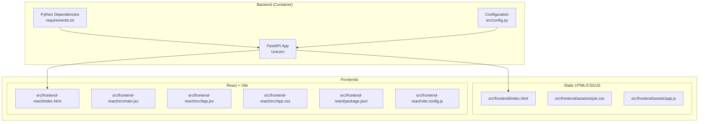
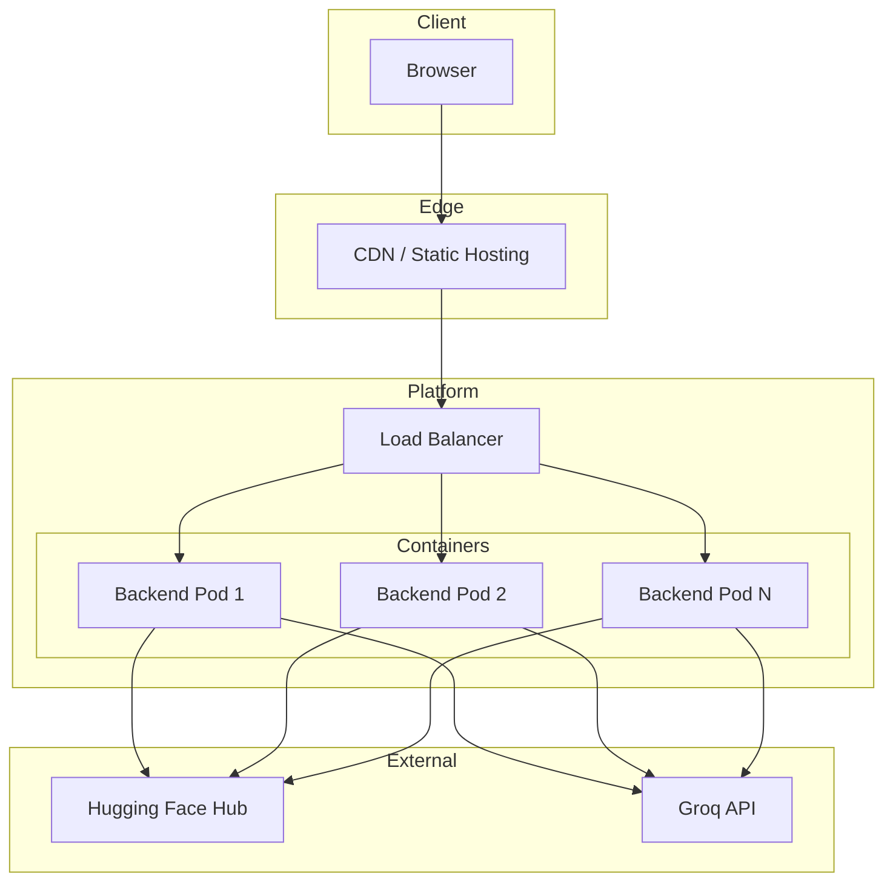
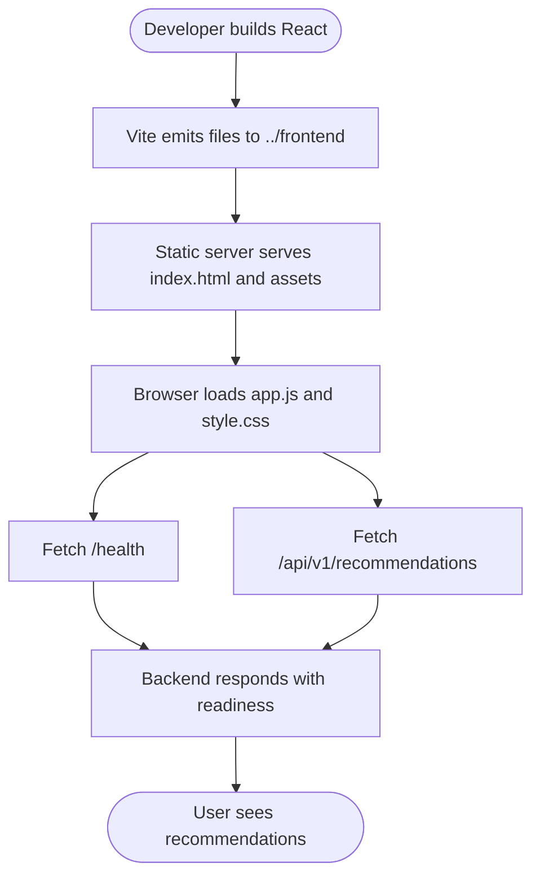
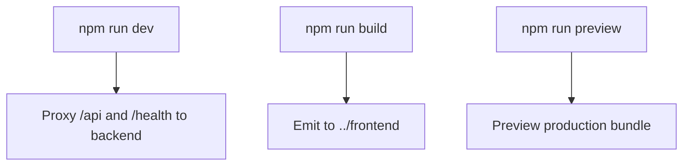
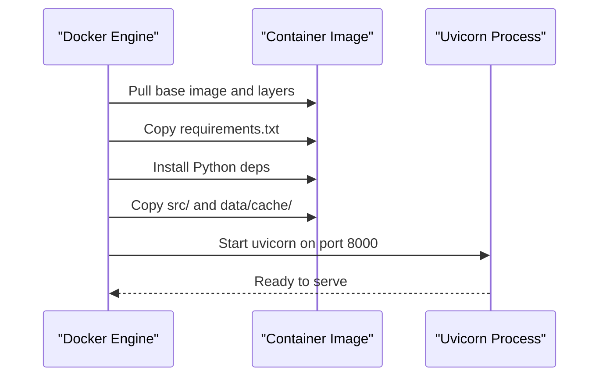
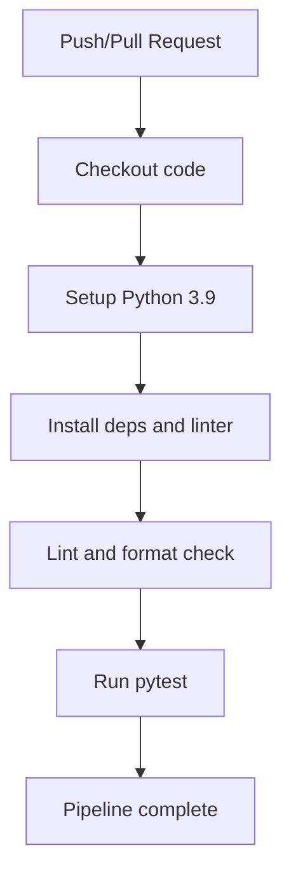
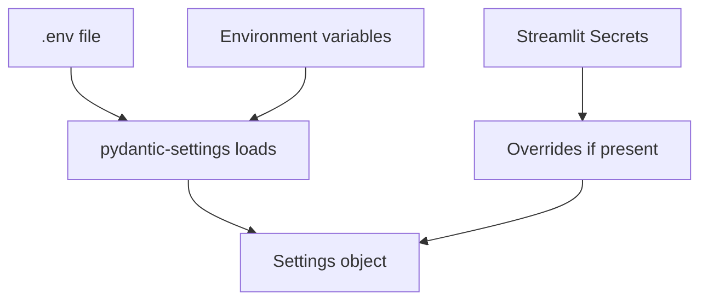
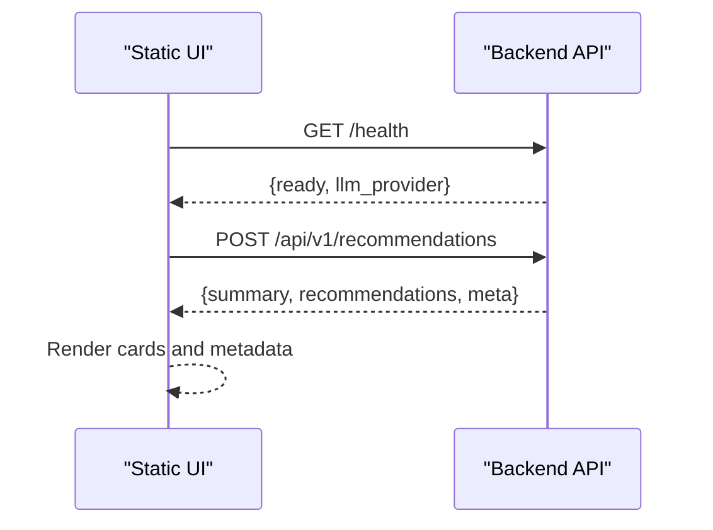
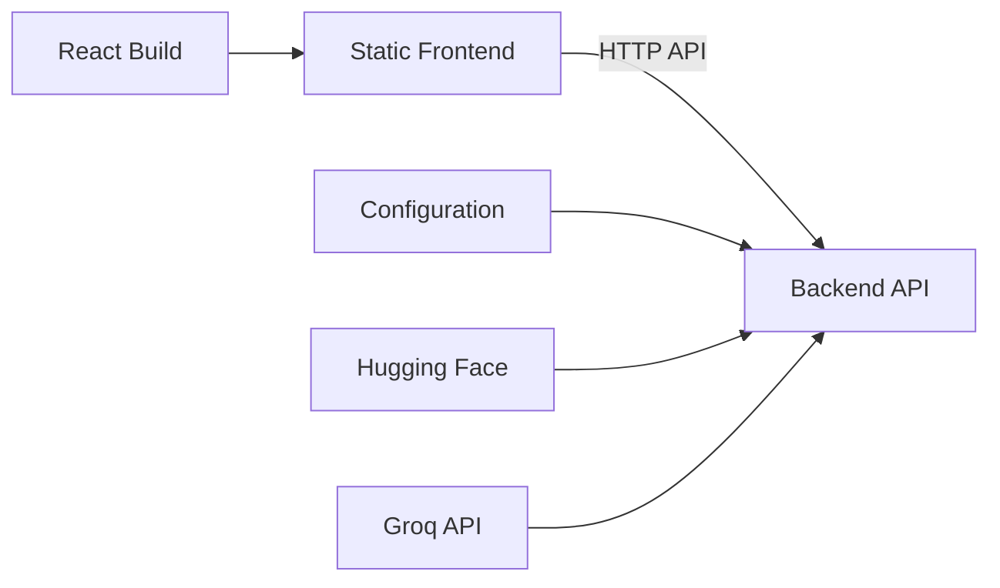

# Build and Deployment

<cite>
**Referenced Files in This Document**
- [Dockerfile](file://Dockerfile)
- [requirements.txt](file://requirements.txt)
- [src/config.py](file://src/config.py)
- [src/frontend/index.html](file://src/frontend/index.html)
- [src/frontend/assets/app.js](file://src/frontend/assets/app.js)
- [src/frontend/assets/style.css](file://src/frontend/assets/style.css)
- [src/frontend-react/vite.config.js](file://src/frontend-react/vite.config.js)
- [src/frontend-react/package.json](file://src/frontend-react/package.json)
- [src/frontend-react/src/main.jsx](file://src/frontend-react/src/main.jsx)
- [src/frontend-react/src/App.jsx](file://src/frontend-react/src/App.jsx)
- [src/frontend-react/src/App.css](file://src/frontend-react/src/App.css)
- [src/frontend-react/index.html](file://src/frontend-react/index.html)
- [.github/workflows/ci.yml](file://.github/workflows/ci.yml)
- [README.md](file://README.md)
- [docs/architecture.md](file://docs/architecture.md)
- [docs/deployment-plan.md](file://docs/deployment-plan.md)
</cite>

## Table of Contents
1. [Introduction](#introduction)
2. [Project Structure](#project-structure)
3. [Core Components](#core-components)
4. [Architecture Overview](#architecture-overview)
5. [Detailed Component Analysis](#detailed-component-analysis)
6. [Dependency Analysis](#dependency-analysis)
7. [Performance Considerations](#performance-considerations)
8. [Troubleshooting Guide](#troubleshooting-guide)
9. [Conclusion](#conclusion)
10. [Appendices](#appendices)

## Introduction
This document explains how to build and deploy both frontend implementations included in the project:
- Static HTML/CSS/JS frontend under src/frontend/, designed to run as a static site and communicate with the backend API.
- React + Vite frontend under src/frontend-react/, which is built into the static output folder for production distribution.

It also documents the Docker containerization of the backend, environment configuration, CI/CD pipeline, and deployment strategies. Guidance is provided for asset optimization, CDN integration, performance monitoring, environment-specific configurations, secrets management, rollback procedures, deployment topology, load balancing, and scaling.

## Project Structure
The repository organizes the backend and two frontends separately. The backend is a Python/Starlette/FastAPI application packaged in a container. The static frontend is placed under src/frontend/ and is generated from the React/Vite build output.

**Diagram sources**
- [Dockerfile:1-33](file://Dockerfile#L1-L33)
- [requirements.txt:1-13](file://requirements.txt#L1-L13)
- [src/config.py:1-81](file://src/config.py#L1-L81)
- [src/frontend/index.html:1-230](file://src/frontend/index.html#L1-L230)
- [src/frontend/assets/style.css:1-1195](file://src/frontend/assets/style.css#L1-L1195)
- [src/frontend/assets/app.js:1-333](file://src/frontend/assets/app.js#L1-L333)
- [src/frontend-react/index.html:1-17](file://src/frontend-react/index.html#L1-L17)
- [src/frontend-react/src/main.jsx:1-11](file://src/frontend-react/src/main.jsx#L1-L11)
- [src/frontend-react/src/App.jsx:1-123](file://src/frontend-react/src/App.jsx#L1-L123)
- [src/frontend-react/src/App.css:1-185](file://src/frontend-react/src/App.css#L1-L185)
- [src/frontend-react/package.json:1-32](file://src/frontend-react/package.json#L1-L32)
- [src/frontend-react/vite.config.js:1-19](file://src/frontend-react/vite.config.js#L1-L19)

**Section sources**
- [Dockerfile:1-33](file://Dockerfile#L1-L33)
- [requirements.txt:1-13](file://requirements.txt#L1-L13)
- [src/config.py:1-81](file://src/config.py#L1-L81)
- [src/frontend/index.html:1-230](file://src/frontend/index.html#L1-L230)
- [src/frontend/assets/style.css:1-1195](file://src/frontend/assets/style.css#L1-L1195)
- [src/frontend/assets/app.js:1-333](file://src/frontend/assets/app.js#L1-L333)
- [src/frontend-react/index.html:1-17](file://src/frontend-react/index.html#L1-L17)
- [src/frontend-react/src/main.jsx:1-11](file://src/frontend-react/src/main.jsx#L1-L11)
- [src/frontend-react/src/App.jsx:1-123](file://src/frontend-react/src/App.jsx#L1-L123)
- [src/frontend-react/src/App.css:1-185](file://src/frontend-react/src/App.css#L1-L185)
- [src/frontend-react/package.json:1-32](file://src/frontend-react/package.json#L1-L32)
- [src/frontend-react/vite.config.js:1-19](file://src/frontend-react/vite.config.js#L1-L19)

## Core Components
- Backend container image
  - Uses Python 3.9 slim base, sets environment variables, installs system and Python dependencies, copies source and cache, exposes port 8000, and runs Uvicorn.
- Static HTML/CSS/JS frontend
  - Single-page application served statically; communicates with the backend via /api/v1 endpoints and health checks.
- React + Vite frontend
  - Built to emit static assets into the shared static folder for production distribution.
- CI/CD pipeline
  - Automated Python lint/format checks and tests on pushes and pull requests.
- Configuration and secrets
  - Environment-driven configuration via pydantic-settings with support for Streamlit secrets.

**Section sources**
- [Dockerfile:1-33](file://Dockerfile#L1-L33)
- [src/frontend/index.html:1-230](file://src/frontend/index.html#L1-L230)
- [src/frontend/assets/app.js:1-333](file://src/frontend/assets/app.js#L1-L333)
- [src/frontend-react/vite.config.js:1-19](file://src/frontend-react/vite.config.js#L1-L19)
- [.github/workflows/ci.yml:1-38](file://.github/workflows/ci.yml#L1-L38)
- [src/config.py:1-81](file://src/config.py#L1-L81)

## Architecture Overview
The deployment architecture combines a containerized backend with a static frontend. The static frontend can be served from a CDN or static hosting, while the backend exposes REST endpoints for recommendations and health probes.

**Diagram sources**
- [docs/architecture.md:560-607](file://docs/architecture.md#L560-L607)
- [src/frontend/index.html:1-230](file://src/frontend/index.html#L1-L230)
- [src/frontend/assets/app.js:1-333](file://src/frontend/assets/app.js#L1-L333)

## Detailed Component Analysis

### Static HTML/CSS/JS Frontend Build and Deployment
- Output destination
  - The React build is configured to write output into the shared static folder used by the static frontend.
- Asset delivery
  - The static HTML references CSS and JS from the static folder; ensure these files are deployed consistently.
- API communication
  - The frontend fetches from /health and /api/v1 endpoints on the same origin, relying on the backend being reachable at the same host/port.
- Hosting requirements
  - Serve index.html and assets from a web server or CDN. Enable HTTP/2 and compression. Consider enabling immutable caching for hashed filenames.

**Diagram sources**
- [src/frontend-react/vite.config.js:8-11](file://src/frontend-react/vite.config.js#L8-L11)
- [src/frontend/index.html:1-230](file://src/frontend/index.html#L1-L230)
- [src/frontend/assets/app.js:1-333](file://src/frontend/assets/app.js#L1-L333)

**Section sources**
- [src/frontend-react/vite.config.js:1-19](file://src/frontend-react/vite.config.js#L1-L19)
- [src/frontend/index.html:1-230](file://src/frontend/index.html#L1-L230)
- [src/frontend/assets/app.js:1-333](file://src/frontend/assets/app.js#L1-L333)

### React + Vite Frontend Build Configuration
- Plugins and toolchain
  - React plugin and TailwindCSS integration are enabled.
- Output directory
  - Builds into the shared static folder to consolidate assets for deployment.
- Dev server proxy
  - Local development proxies /api and /health to the backend running on port 8000.
- Scripts
  - Provides dev, build, lint, and preview commands.

**Diagram sources**
- [src/frontend-react/vite.config.js:6-18](file://src/frontend-react/vite.config.js#L6-L18)
- [src/frontend-react/package.json:6-11](file://src/frontend-react/package.json#L6-L11)

**Section sources**
- [src/frontend-react/vite.config.js:1-19](file://src/frontend-react/vite.config.js#L1-L19)
- [src/frontend-react/package.json:1-32](file://src/frontend-react/package.json#L1-L32)

### Backend Containerization and Runtime
- Base image and environment
  - Python 3.9 slim, environment flags, and port 8000 exposed.
- Dependencies
  - Installs system build tools and Python packages from requirements.txt.
- Content placement
  - Copies src/ and data/cache/ into the container.
- Startup
  - Runs Uvicorn pointing to the FastAPI app entrypoint.

**Diagram sources**
- [Dockerfile:1-33](file://Dockerfile#L1-L33)
- [requirements.txt:1-13](file://requirements.txt#L1-L13)

**Section sources**
- [Dockerfile:1-33](file://Dockerfile#L1-L33)
- [requirements.txt:1-13](file://requirements.txt#L1-L13)

### CI/CD Pipeline
- Trigger
  - Runs on pushes and pull requests to main/master.
- Steps
  - Checks out code, sets up Python 3.9, installs dependencies and linter, runs lint/format checks, and executes tests.

**Diagram sources**
- [.github/workflows/ci.yml:1-38](file://.github/workflows/ci.yml#L1-L38)

**Section sources**
- [.github/workflows/ci.yml:1-38](file://.github/workflows/ci.yml#L1-L38)

### Environment Variables and Secrets Management
- Configuration model
  - Settings are loaded from .env, environment variables, and Streamlit secrets. Streamlit secrets override environment variables.
- Keys and defaults
  - Includes LLM provider, API key, base URL, model, CORS origins, and tuning knobs.
- Streamlit compatibility
  - The configuration supports reading secrets from Streamlit’s secrets manager for cloud deployments.

**Diagram sources**
- [src/config.py:46-81](file://src/config.py#L46-L81)

**Section sources**
- [src/config.py:1-81](file://src/config.py#L1-L81)
- [docs/deployment-plan.md:314-399](file://docs/deployment-plan.md#L314-L399)

### API Communication and Frontend Interaction
- Health and recommendations
  - The static frontend checks readiness via /health and submits preferences to /api/v1/recommendations.
- Error handling
  - Displays user-friendly states for empty results and errors, and allows retry actions.

**Diagram sources**
- [src/frontend/assets/app.js:96-193](file://src/frontend/assets/app.js#L96-L193)
- [src/frontend/index.html:1-230](file://src/frontend/index.html#L1-L230)

**Section sources**
- [src/frontend/assets/app.js:1-333](file://src/frontend/assets/app.js#L1-L333)
- [src/frontend/index.html:1-230](file://src/frontend/index.html#L1-L230)

## Dependency Analysis
- Frontend-to-backend coupling
  - The static frontend depends on backend endpoints and readiness probe semantics.
- Build-time coupling
  - React build writes into the static folder, ensuring a unified artifact for deployment.
- Runtime coupling
  - Backend depends on configuration and external services (dataset and LLM provider).

**Diagram sources**
- [src/frontend/assets/app.js:1-333](file://src/frontend/assets/app.js#L1-L333)
- [src/frontend-react/vite.config.js:8-11](file://src/frontend-react/vite.config.js#L8-L11)
- [src/config.py:1-81](file://src/config.py#L1-L81)

**Section sources**
- [src/frontend/assets/app.js:1-333](file://src/frontend/assets/app.js#L1-L333)
- [src/frontend-react/vite.config.js:1-19](file://src/frontend-react/vite.config.js#L1-L19)
- [src/config.py:1-81](file://src/config.py#L1-L81)

## Performance Considerations
- Static asset optimization
  - Enable long-lived caching for static assets; use hashed filenames for cache busting.
  - Compress assets with gzip or Brotli; enable HTTP/2 and keep-alive.
- CDN integration
  - Serve the static frontend from a CDN to reduce latency and improve availability.
- Backend performance
  - Keep dataset cached in memory or on fast local storage; minimize cold-start delays.
  - Tune LLM parameters (temperature, max tokens) to balance quality and latency.
- Observability
  - Instrument latency metrics for API endpoints and LLM calls; track error rates and degraded mode usage.

[No sources needed since this section provides general guidance]

## Troubleshooting Guide
- Static frontend shows “Connecting…” or “Unavailable”
  - Confirm backend is healthy and reachable; verify /health returns ready state.
- API returns empty results
  - Adjust preferences or broaden filters; confirm backend logs indicate candidate count and filter relaxation.
- React build artifacts missing
  - Ensure npm run build completes and outputs to the shared static folder.
- CI failures
  - Review lint/format and test outputs; fix discrepancies locally before pushing again.

**Section sources**
- [src/frontend/assets/app.js:96-115](file://src/frontend/assets/app.js#L96-L115)
- [src/frontend/assets/app.js:169-193](file://src/frontend/assets/app.js#L169-L193)
- [src/frontend-react/vite.config.js:8-11](file://src/frontend-react/vite.config.js#L8-L11)
- [.github/workflows/ci.yml:28-37](file://.github/workflows/ci.yml#L28-L37)

## Conclusion
The project supports two frontend delivery modes: a static HTML/CSS/JS app and a React/Vite-built static app emitted into the shared static folder. The backend is containerized and can be scaled behind a load balancer with CDN caching for the frontend. Configuration is environment-driven with support for secrets, and CI ensures quality. For production, pair CDN-hosted static assets with containerized backend replicas and monitor performance and observability.

[No sources needed since this section summarizes without analyzing specific files]

## Appendices

### Deployment Topology and Scaling
- Single-host deployment
  - Serve static assets from a web server or CDN; run backend container exposing port 8000.
- Multi-host deployment
  - Scale backend pods behind a load balancer; ensure health checks target /health; distribute static assets via CDN.
- Scaling strategies
  - Stateless backend replicas; consider caching filter results and rate-limiting LLM calls.

**Section sources**
- [docs/architecture.md:601-607](file://docs/architecture.md#L601-L607)
- [Dockerfile:28-32](file://Dockerfile#L28-L32)

### Rollback Procedures
- Container images
  - Tag releases and roll back by redeploying previous image tags.
- Static assets
  - Maintain immutable filenames; switch CDN origin to previous release bucket or tag.
- Configuration
  - Store environment overrides in a versioned configuration repository; revert to prior versions.

[No sources needed since this section provides general guidance]

### Example CI/CD Pipeline Setup
- Trigger conditions
  - Run on pushes and pull requests to main/master.
- Steps
  - Set up Python, install dependencies, lint/format check, and run tests.

**Section sources**
- [.github/workflows/ci.yml:1-38](file://.github/workflows/ci.yml#L1-L38)

### Environment-Specific Configuration Examples
- Local development
  - Use .env file for configuration; run backend locally or via Docker.
- Streamlit Cloud
  - Use Streamlit Secrets; configuration supports both .env and secrets seamlessly.

**Section sources**
- [src/config.py:37-81](file://src/config.py#L37-L81)
- [docs/deployment-plan.md:314-399](file://docs/deployment-plan.md#L314-L399)