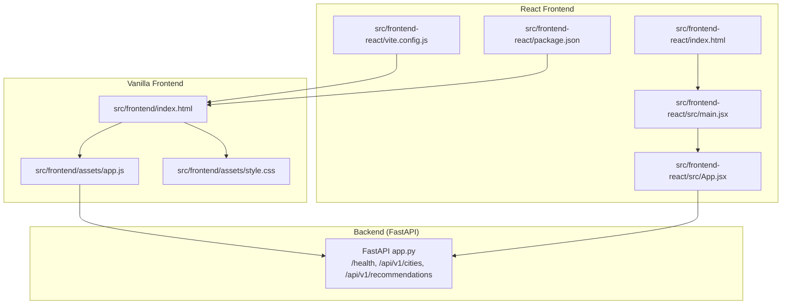
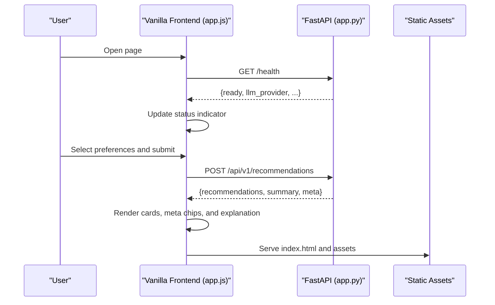
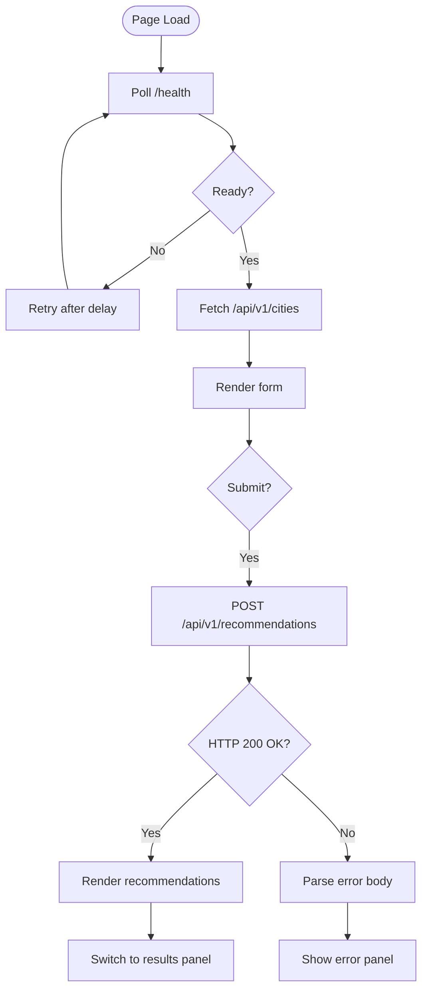
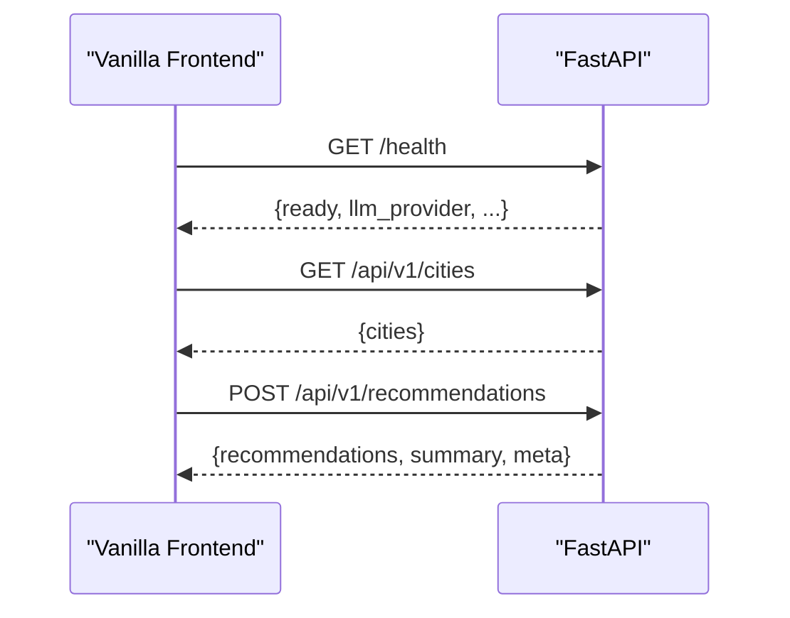
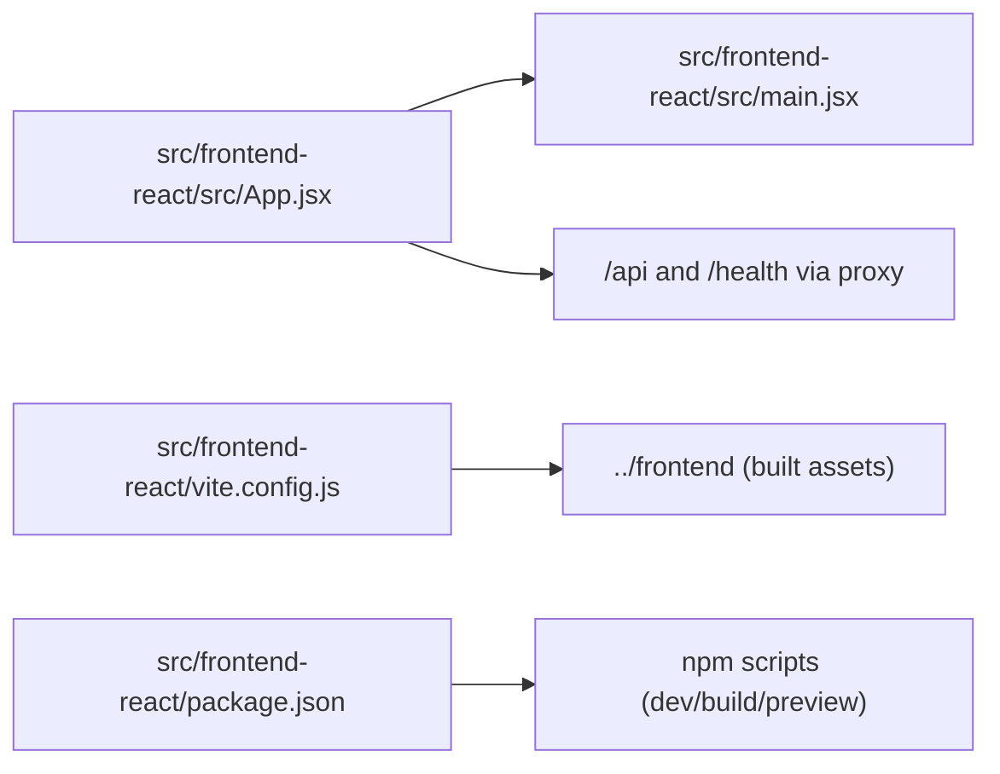
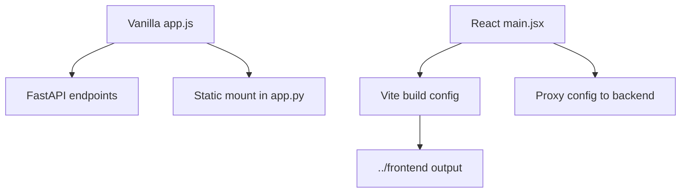
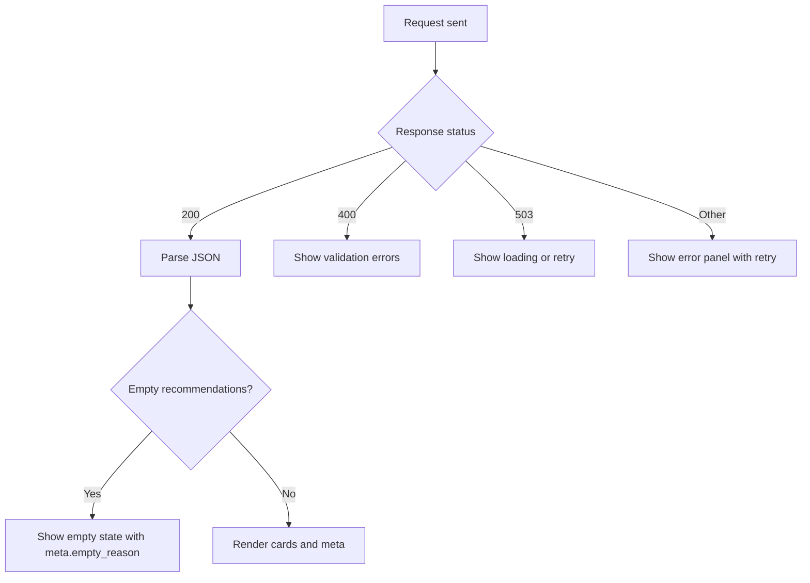

# Frontend Integration

<cite>
**Referenced Files in This Document**
- [index.html](file://src/frontend/index.html)
- [app.js](file://src/frontend/assets/app.js)
- [style.css](file://src/frontend/assets/style.css)
- [app.py](file://src/api/app.py)
- [App.jsx](file://src/frontend-react/src/App.jsx)
- [main.jsx](file://src/frontend-react/src/main.jsx)
- [index.html (React)](file://src/frontend-react/index.html)
- [package.json (React)](file://src/frontend-react/package.json)
- [vite.config.js (React)](file://src/frontend-react/vite.config.js)
- [index.css (React)](file://src/frontend-react/src/index.css)
- [App.css (React)](file://src/frontend-react/src/App.css)
- [edge-cases.md](file://docs/edge-cases.md)
</cite>

## Table of Contents
1. [Introduction](#introduction)
2. [Project Structure](#project-structure)
3. [Core Components](#core-components)
4. [Architecture Overview](#architecture-overview)
5. [Detailed Component Analysis](#detailed-component-analysis)
6. [Dependency Analysis](#dependency-analysis)
7. [Performance Considerations](#performance-considerations)
8. [Troubleshooting Guide](#troubleshooting-guide)
9. [Conclusion](#conclusion)
10. [Appendices](#appendices)

## Introduction
This document explains how the frontend integrates with the backend for both a vanilla HTML/CSS/JavaScript implementation and a React-based implementation. It covers API integration patterns, request/response handling, data visualization, routing, state management, styling systems, responsive design, cross-browser compatibility, build processes, deployment considerations, performance optimization, accessibility, and UX best practices.

## Project Structure
The frontend is delivered via two implementations:
- Vanilla SPA under src/frontend serving index.html and assets (HTML/CSS/JS).
- React SPA under src/frontend-react using Vite and Tailwind; built artifacts are emitted into the shared src/frontend directory for unified hosting.

**Diagram sources**
- [app.py:137-254](file://src/api/app.py#L137-L254)
- [index.html:1-230](file://src/frontend/index.html#L1-L230)
- [app.js:1-333](file://src/frontend/assets/app.js#L1-L333)
- [style.css:1-800](file://src/frontend/assets/style.css#L1-L800)
- [index.html (React):1-17](file://src/frontend-react/index.html#L1-L17)
- [main.jsx:1-11](file://src/frontend-react/src/main.jsx#L1-L11)
- [App.jsx:1-123](file://src/frontend-react/src/App.jsx#L1-L123)
- [vite.config.js (React):1-19](file://src/frontend-react/vite.config.js#L1-L19)
- [package.json (React):1-32](file://src/frontend-react/package.json#L1-L32)

**Section sources**
- [index.html:1-230](file://src/frontend/index.html#L1-L230)
- [app.js:1-333](file://src/frontend/assets/app.js#L1-L333)
- [style.css:1-800](file://src/frontend/assets/style.css#L1-L800)
- [app.py:137-254](file://src/api/app.py#L137-L254)
- [index.html (React):1-17](file://src/frontend-react/index.html#L1-L17)
- [main.jsx:1-11](file://src/frontend-react/src/main.jsx#L1-L11)
- [App.jsx:1-123](file://src/frontend-react/src/App.jsx#L1-L123)
- [vite.config.js (React):1-19](file://src/frontend-react/vite.config.js#L1-L19)
- [package.json (React):1-32](file://src/frontend-react/package.json#L1-L32)

## Core Components
- Vanilla SPA:
  - Single-page HTML with embedded forms, panels, and state switching.
  - JavaScript module handles API calls, DOM updates, and user interactions.
  - CSS defines a cohesive dark theme, glassmorphism, animations, and responsive layouts.
- React SPA:
  - Minimal starter scaffold with Vite and Tailwind; configured to emit built assets into the shared frontend directory.
  - Provides a modern component model and tooling for future expansion.

Key integration touchpoints:
- API base URL resolution from window.location.origin.
- Health endpoint polling to reflect backend readiness.
- City list fetching and population.
- Recommendations submission and rendering with meta indicators.

**Section sources**
- [index.html:1-230](file://src/frontend/index.html#L1-L230)
- [app.js:3-333](file://src/frontend/assets/app.js#L3-L333)
- [style.css:1-800](file://src/frontend/assets/style.css#L1-L800)
- [app.py:137-254](file://src/api/app.py#L137-L254)
- [index.html (React):1-17](file://src/frontend-react/index.html#L1-L17)
- [vite.config.js (React):1-19](file://src/frontend-react/vite.config.js#L1-L19)

## Architecture Overview
The frontend communicates with the backend through REST endpoints exposed by the FastAPI application. The vanilla frontend performs imperative DOM updates, while the React frontend can adopt a declarative component model in future iterations.

**Diagram sources**
- [app.js:96-193](file://src/frontend/assets/app.js#L96-L193)
- [app.py:137-242](file://src/api/app.py#L137-L242)
- [index.html:1-230](file://src/frontend/index.html#L1-L230)

## Detailed Component Analysis

### Vanilla Frontend Integration (HTML/CSS/JS)
- Initialization and API base:
  - Resolves API base from window.location.origin.
  - Polls /health to reflect backend status.
- City loading:
  - Fetches /api/v1/cities and populates the select dropdown.
- Preferences form:
  - Gathers FormData and posts to /api/v1/recommendations.
  - Updates current search summary panel.
- Results rendering:
  - Parses response and renders cards with badges, ratings, and explanations.
  - Displays meta chips for candidate counts, relaxation flag, and mode.
- States and UX:
  - Welcome, loading, results, empty, and error panels.
  - Animated loader cycle and skeleton previews during loading.
- Error handling:
  - Catches network failures and parses JSON error bodies.
  - Displays user-friendly messages and retry actions.

**Diagram sources**
- [app.js:96-193](file://src/frontend/assets/app.js#L96-L193)

**Section sources**
- [index.html:1-230](file://src/frontend/index.html#L1-L230)
- [app.js:3-333](file://src/frontend/assets/app.js#L3-L333)
- [style.css:1-800](file://src/frontend/assets/style.css#L1-L800)
- [app.py:137-242](file://src/api/app.py#L137-L242)

### Backend API Endpoints Used
- GET /health: Returns readiness and provider info.
- GET /api/v1/cities: Returns known city list.
- POST /api/v1/recommendations: Returns curated recommendations with explanations and metadata.

**Diagram sources**
- [app.py:137-242](file://src/api/app.py#L137-L242)
- [app.js:96-193](file://src/frontend/assets/app.js#L96-L193)

**Section sources**
- [app.py:137-242](file://src/api/app.py#L137-L242)

### React Frontend Integration (Vite + Tailwind)
- Build pipeline:
  - Vite compiles React and Tailwind; outDir targets ../frontend for unified hosting.
  - Dev server proxies /api and /health to the backend on port 8000.
- Minimal component scaffold:
  - main.jsx mounts App.jsx.
  - App.jsx currently renders placeholder content; can be extended to mirror vanilla behavior.
- Styling:
  - index.css defines dark/light theme tokens and responsive breakpoints.
  - App.css demonstrates component-level styles and media queries.

**Diagram sources**
- [main.jsx:1-11](file://src/frontend-react/src/main.jsx#L1-L11)
- [App.jsx:1-123](file://src/frontend-react/src/App.jsx#L1-L123)
- [vite.config.js (React):1-19](file://src/frontend-react/vite.config.js#L1-L19)
- [package.json (React):1-32](file://src/frontend-react/package.json#L1-L32)

**Section sources**
- [index.html (React):1-17](file://src/frontend-react/index.html#L1-L17)
- [main.jsx:1-11](file://src/frontend-react/src/main.jsx#L1-L11)
- [App.jsx:1-123](file://src/frontend-react/src/App.jsx#L1-L123)
- [index.css (React):1-112](file://src/frontend-react/src/index.css#L1-L112)
- [App.css (React):1-185](file://src/frontend-react/src/App.css#L1-L185)
- [vite.config.js (React):1-19](file://src/frontend-react/vite.config.js#L1-L19)
- [package.json (React):1-32](file://src/frontend-react/package.json#L1-L32)

## Dependency Analysis
- Vanilla frontend depends on:
  - Backend endpoints for health, city list, and recommendations.
  - Static asset mounting in FastAPI for serving index.html and assets.
- React frontend depends on:
  - Vite build to emit into the shared frontend directory.
  - Proxy configuration for development to reach the backend.
  - Package scripts for dev/build/preview lifecycles.

**Diagram sources**
- [app.js:3-333](file://src/frontend/assets/app.js#L3-L333)
- [app.py:245-254](file://src/api/app.py#L245-L254)
- [main.jsx:1-11](file://src/frontend-react/src/main.jsx#L1-L11)
- [vite.config.js (React):1-19](file://src/frontend-react/vite.config.js#L1-L19)

**Section sources**
- [app.py:245-254](file://src/api/app.py#L245-L254)
- [app.js:3-333](file://src/frontend/assets/app.js#L3-L333)
- [vite.config.js (React):1-19](file://src/frontend-react/vite.config.js#L1-L19)

## Performance Considerations
- Network efficiency:
  - Use JSON payloads for requests and avoid unnecessary re-renders.
  - Debounce or coalesce rapid user inputs before triggering requests.
- Rendering:
  - Prefer virtualized lists for large recommendation sets.
  - Lazy-load images and defer non-critical resources.
- Caching:
  - Cache city lists and static assets with appropriate headers.
  - Consider short-lived caches for recommendations with explicit invalidation.
- Bundle size:
  - Tree-shake unused React dependencies in the React SPA.
  - Minimize third-party fonts and icons; consider icon fonts or SVG sprites.
- Animations:
  - Use transform/opacity for smooth transitions; avoid layout thrashing.
- Observability:
  - Instrument fetch durations and error rates for API calls.

[No sources needed since this section provides general guidance]

## Troubleshooting Guide
Common issues and remedies:
- Backend not ready:
  - The health endpoint returns readiness; if not ready, poll again or show a loading state.
- Validation errors:
  - Expect 400 with structured detail; surface suggestions to the user.
- Degraded mode:
  - Expect meta.degraded_mode; inform users and optionally offer retry.
- Empty results:
  - Expect recommendations array empty with meta.empty_reason; guide users to relax filters.
- Network failures:
  - Catch exceptions and present retry actions.

**Diagram sources**
- [app.js:169-193](file://src/frontend/assets/app.js#L169-L193)
- [edge-cases.md:151-169](file://docs/edge-cases.md#L151-L169)

**Section sources**
- [app.js:169-193](file://src/frontend/assets/app.js#L169-L193)
- [edge-cases.md:151-169](file://docs/edge-cases.md#L151-L169)

## Conclusion
The vanilla frontend provides a robust, self-contained integration with the backend through straightforward fetch-based API calls and imperative DOM updates. The React SPA establishes a scalable foundation with Vite and Tailwind, configured to emit into the shared frontend directory and proxy backend endpoints during development. Together, they support a consistent UX, responsive design, and maintainable codebases.

[No sources needed since this section summarizes without analyzing specific files]

## Appendices

### API Integration Patterns
- Base URL resolution: Use window.origin to compute API base.
- Health checks: Poll /health to reflect backend status.
- City list: GET /api/v1/cities to populate selects.
- Recommendations: POST /api/v1/recommendations with form data.
- Error handling: Parse JSON error bodies and display user-friendly messages.

**Section sources**
- [app.js:3-333](file://src/frontend/assets/app.js#L3-L333)
- [app.py:137-242](file://src/api/app.py#L137-L242)

### Styling Systems and Responsive Design
- Vanilla:
  - CSS custom properties for theme tokens.
  - Glassmorphism, backdrop blur, and gradient overlays.
  - Media queries and clamp for fluid typography.
- React:
  - Tailwind utilities for layout and spacing.
  - Dark mode tokens and responsive breakpoints in index.css.
  - Component-level styles in App.css with media queries.

**Section sources**
- [style.css:1-800](file://src/frontend/assets/style.css#L1-L800)
- [index.css (React):1-112](file://src/frontend-react/src/index.css#L1-L112)
- [App.css (React):1-185](file://src/frontend-react/src/App.css#L1-L185)

### Cross-Browser Compatibility
- Use unprefixed CSS properties where possible.
- Provide fallbacks for advanced features (e.g., gradients, backdrop-filter).
- Validate focus styles and keyboard navigation.
- Test on latest Chrome, Firefox, Safari, and Edge.

[No sources needed since this section provides general guidance]

### Accessibility Best Practices
- Semantic HTML and ARIA roles where needed.
- Sufficient color contrast and readable fonts.
- Focus management and skip links.
- Screen reader-friendly labels and descriptions.

[No sources needed since this section provides general guidance]

### Build Processes and Deployment
- Vanilla:
  - Static assets served from FastAPI’s mounted directory.
- React:
  - Vite build emits to ../frontend; configure server to serve static files from there.
  - Use proxy in development to avoid CORS during local testing.

**Section sources**
- [vite.config.js (React):1-19](file://src/frontend-react/vite.config.js#L1-L19)
- [app.py:245-254](file://src/api/app.py#L245-L254)