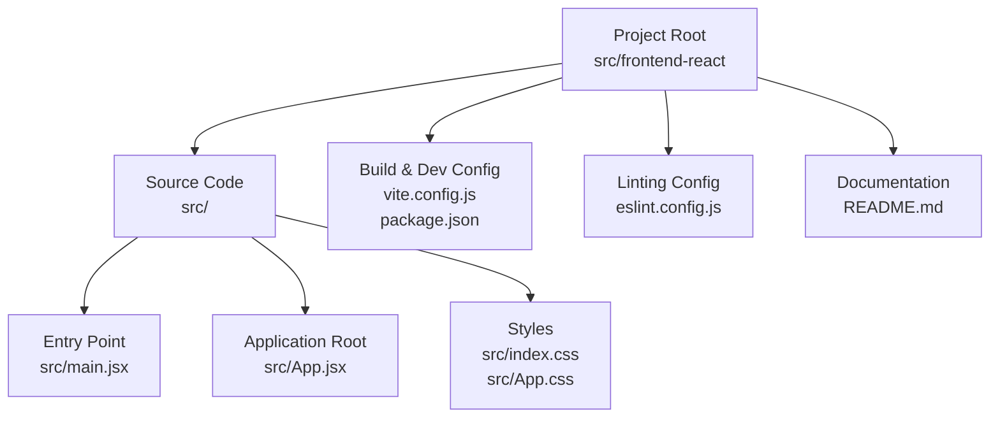
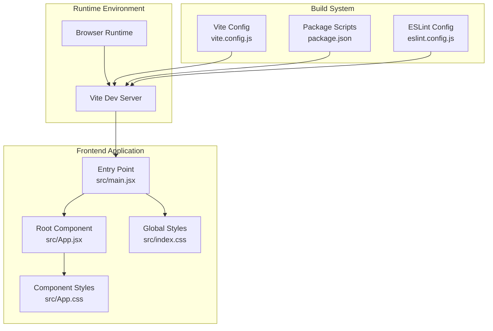
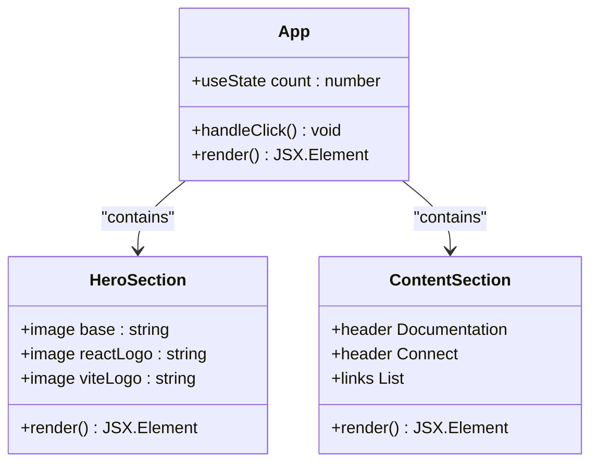
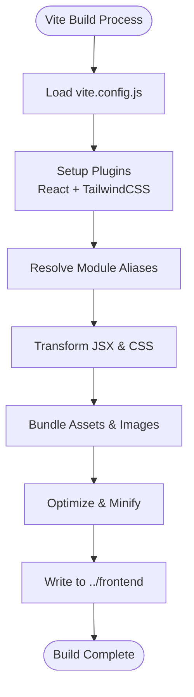
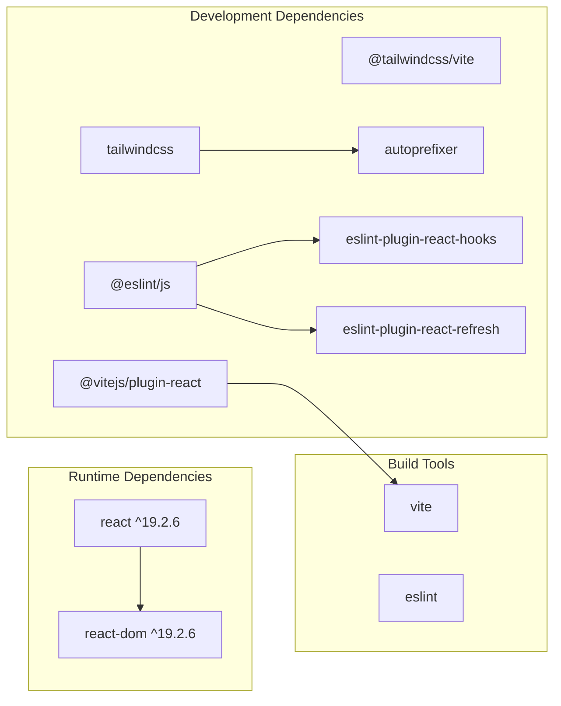

# React-Based Modern Frontend

<cite>
**Referenced Files in This Document**
- [package.json](file://src/frontend-react/package.json)
- [vite.config.js](file://src/frontend-react/vite.config.js)
- [main.jsx](file://src/frontend-react/src/main.jsx)
- [App.jsx](file://src/frontend-react/src/App.jsx)
- [App.css](file://src/frontend-react/src/App.css)
- [index.css](file://src/frontend-react/src/index.css)
- [eslint.config.js](file://src/frontend-react/eslint.config.js)
- [README.md](file://src/frontend-react/README.md)
</cite>

## Table of Contents
1. [Introduction](#introduction)
2. [Project Structure](#project-structure)
3. [Core Components](#core-components)
4. [Architecture Overview](#architecture-overview)
5. [Detailed Component Analysis](#detailed-component-analysis)
6. [Dependency Analysis](#dependency-analysis)
7. [Performance Considerations](#performance-considerations)
8. [Troubleshooting Guide](#troubleshooting-guide)
9. [Conclusion](#conclusion)

## Introduction
This document provides comprehensive documentation for the React-based modern frontend implementation in the Zomato project. It covers component architecture, state management patterns, React hooks usage, Vite build configuration, development server setup, production bundling, styling approaches, and best practices. The frontend is a minimal React application configured with Vite and Tailwind CSS, designed to demonstrate modern frontend tooling and styling patterns.

## Project Structure
The frontend is organized under the `src/frontend-react` directory with a standard Vite + React setup. The structure emphasizes simplicity and clarity, focusing on a single-page application with a central App component and supporting styles.

**Diagram sources**
- [main.jsx:1-11](file://src/frontend-react/src/main.jsx#L1-L11)
- [App.jsx:1-123](file://src/frontend-react/src/App.jsx#L1-L123)
- [vite.config.js:1-19](file://src/frontend-react/vite.config.js#L1-L19)
- [package.json:1-32](file://src/frontend-react/package.json#L1-L32)
- [eslint.config.js:1-22](file://src/frontend-react/eslint.config.js#L1-L22)
- [README.md:1-17](file://src/frontend-react/README.md#L1-L17)

**Section sources**
- [main.jsx:1-11](file://src/frontend-react/src/main.jsx#L1-L11)
- [App.jsx:1-123](file://src/frontend-react/src/App.jsx#L1-L123)
- [vite.config.js:1-19](file://src/frontend-react/vite.config.js#L1-L19)
- [package.json:1-32](file://src/frontend-react/package.json#L1-L32)
- [eslint.config.js:1-22](file://src/frontend-react/eslint.config.js#L1-L22)
- [README.md:1-17](file://src/frontend-react/README.md#L1-L17)

## Core Components
The application consists of a single root component that renders a hero section, interactive counter, and informational links. The component demonstrates basic React patterns including local state management with useState and event handling.

Key characteristics:
- Single-file component architecture
- Local state via useState hook
- Event-driven UI updates
- Utility-first styling with Tailwind CSS classes
- Static asset imports for logos and images

**Section sources**
- [App.jsx:1-123](file://src/frontend-react/src/App.jsx#L1-L123)

## Architecture Overview
The frontend follows a straightforward unidirectional data flow pattern typical of small React applications. The architecture emphasizes simplicity and developer experience through Vite's fast development server and hot module replacement capabilities.

**Diagram sources**
- [main.jsx:1-11](file://src/frontend-react/src/main.jsx#L1-L11)
- [App.jsx:1-123](file://src/frontend-react/src/App.jsx#L1-L123)
- [index.css:1-112](file://src/frontend-react/src/index.css#L1-L112)
- [App.css:1-185](file://src/frontend-react/src/App.css#L1-L185)
- [vite.config.js:1-19](file://src/frontend-react/vite.config.js#L1-L19)
- [package.json:1-32](file://src/frontend-react/package.json#L1-L32)
- [eslint.config.js:1-22](file://src/frontend-react/eslint.config.js#L1-L22)

## Detailed Component Analysis

### App Component Analysis
The App component serves as the primary container for the application's UI. It demonstrates fundamental React patterns and modern frontend development practices.

**Diagram sources**
- [App.jsx:1-123](file://src/frontend-react/src/App.jsx#L1-L123)

#### Component Hierarchy
The component structure follows a clean hierarchy:
- Root App component
  - Hero section with animated logos
  - Interactive counter button
  - Documentation links section
  - Social connection section

#### State Management Patterns
The component utilizes React's useState hook for local state management:
- Local counter state with functional updates
- Event handlers for user interactions
- Conditional rendering based on state

#### Styling Implementation
The application employs a hybrid approach combining CSS modules and utility-first CSS:
- Global CSS variables for theming
- Component-specific stylesheets
- Tailwind CSS utility classes for layout and typography

**Section sources**
- [App.jsx:1-123](file://src/frontend-react/src/App.jsx#L1-L123)
- [App.css:1-185](file://src/frontend-react/src/App.css#L1-L185)
- [index.css:1-112](file://src/frontend-react/src/index.css#L1-L112)

### Build Configuration Analysis
The Vite configuration establishes a production-ready build pipeline with development conveniences.

**Diagram sources**
- [vite.config.js:1-19](file://src/frontend-react/vite.config.js#L1-L19)
- [package.json:1-32](file://src/frontend-react/package.json#L1-L32)

#### Development Server Configuration
The development server includes proxy configuration for API requests:
- Proxy `/api` requests to backend server
- Proxy `/health` endpoint for monitoring
- Hot module replacement for fast iteration

#### Production Build Process
The build system produces optimized static assets:
- Code splitting and tree shaking
- Asset optimization and compression
- Static file generation for deployment

**Section sources**
- [vite.config.js:1-19](file://src/frontend-react/vite.config.js#L1-L19)
- [package.json:1-32](file://src/frontend-react/package.json#L1-L32)

## Dependency Analysis
The frontend maintains a lean dependency graph focused on essential functionality.

**Diagram sources**
- [package.json:1-32](file://src/frontend-react/package.json#L1-L32)

**Section sources**
- [package.json:1-32](file://src/frontend-react/package.json#L1-L32)

## Performance Considerations
The application is designed with performance as a core consideration:

### Optimizations Implemented
- Minimal bundle size through selective dependencies
- Efficient CSS architecture with CSS variables
- Lazy loading for images and assets
- Optimized build pipeline with code splitting

### Best Practices Applied
- Component composition over inheritance
- Functional components with hooks
- Memoization opportunities through React.memo
- Efficient event handling patterns

## Troubleshooting Guide
Common issues and their resolutions:

### Development Issues
- **Hot Reload Not Working**: Verify Vite server is running and port is available
- **CSS Not Loading**: Check Tailwind configuration and CSS import statements
- **TypeScript Errors**: Ensure proper type definitions are installed

### Build Issues
- **Missing Dependencies**: Run npm install to restore node_modules
- **Build Failures**: Check console output for specific error messages
- **Asset Loading**: Verify asset paths and public folder configuration

### Performance Issues
- **Slow Builds**: Clear node_modules and reinstall dependencies
- **Large Bundle Size**: Analyze bundle with Vite's built-in analyzer
- **Memory Leaks**: Monitor component lifecycle and cleanup effects

**Section sources**
- [eslint.config.js:1-22](file://src/frontend-react/eslint.config.js#L1-L22)
- [README.md:1-17](file://src/frontend-react/README.md#L1-L17)

## Conclusion
The React-based modern frontend implementation demonstrates a clean, efficient approach to building contemporary web applications. By leveraging Vite's fast development server, React's component model, and Tailwind CSS's utility-first methodology, the application achieves excellent developer experience while maintaining optimal runtime performance. The modular architecture supports easy maintenance and future enhancements, making it an excellent foundation for larger-scale React applications.

The implementation showcases best practices in modern frontend development including:
- Clean component architecture
- Efficient state management
- Optimized build processes
- Comprehensive styling strategies
- Developer-friendly tooling

This foundation provides a solid starting point for building feature-rich React applications while maintaining performance and maintainability standards.