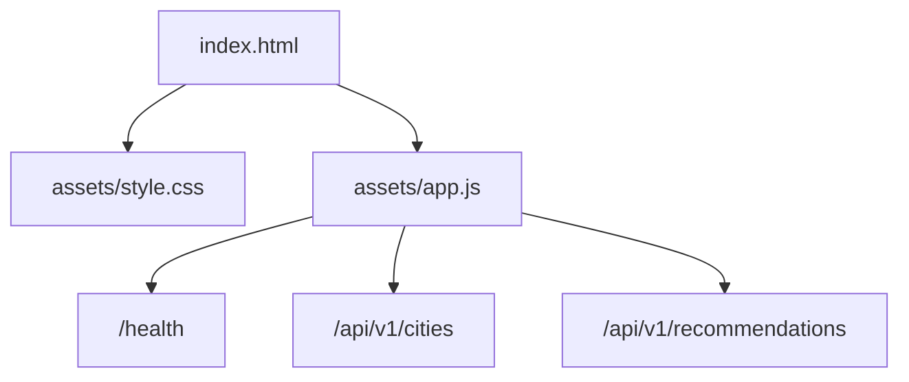
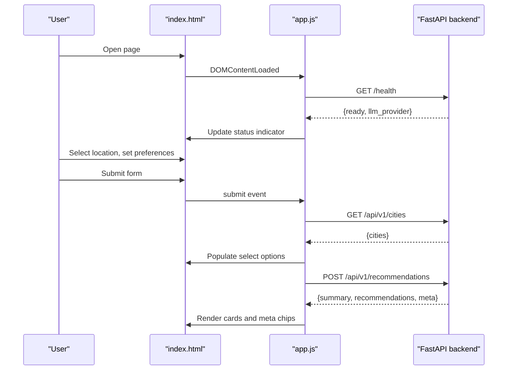
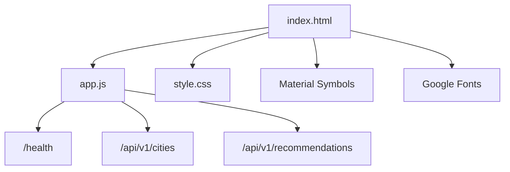

# Static HTML/CSS/JS Frontend

<cite>
**Referenced Files in This Document**
- [index.html](file://src/frontend/index.html)
- [style.css](file://src/frontend/assets/style.css)
- [app.js](file://src/frontend/assets/app.js)
- [README.md](file://README.md)
- [architecture.md](file://docs/architecture.md)
- [implementation-plan.md](file://docs/implementation-plan.md)
</cite>

## Table of Contents
1. [Introduction](#introduction)
2. [Project Structure](#project-structure)
3. [Core Components](#core-components)
4. [Architecture Overview](#architecture-overview)
5. [Detailed Component Analysis](#detailed-component-analysis)
6. [Dependency Analysis](#dependency-analysis)
7. [Performance Considerations](#performance-considerations)
8. [Troubleshooting Guide](#troubleshooting-guide)
9. [Conclusion](#conclusion)

## Introduction
This document describes the static HTML/CSS/JavaScript frontend for the Zomato AI recommendation system. It explains the HTML structure, CSS styling approach, and JavaScript functionality for user interaction. It documents DOM manipulation patterns, form handling, and API integration methods. It also covers responsive design, cross-browser compatibility, accessibility, and the styling system including custom CSS properties and layout patterns. Finally, it outlines browser-specific optimizations, progressive enhancement, and graceful degradation strategies.

## Project Structure
The frontend is a single-page application composed of:
- An HTML entry page that defines the UI shell and view states
- A CSS stylesheet that implements a dark-themed glass-morphism design system
- A JavaScript module that manages user interactions, API calls, and dynamic content updates

**Diagram sources**
- [index.html:1-230](file://src/frontend/index.html#L1-L230)
- [style.css:1-1195](file://src/frontend/assets/style.css#L1-L1195)
- [app.js:1-333](file://src/frontend/assets/app.js#L1-L333)

**Section sources**
- [index.html:1-230](file://src/frontend/index.html#L1-L230)
- [style.css:1-1195](file://src/frontend/assets/style.css#L1-L1195)
- [app.js:1-333](file://src/frontend/assets/app.js#L1-L333)

## Core Components
- HTML structure: Defines the header, sidebar, main canvas, and multiple view panels (welcome, loading, results, empty, error). It includes a preference form with inputs for cuisine, location, budget, rating, and additional preferences.
- CSS styling system: Uses a design system built on CSS custom properties, glass-morphism effects, and a dark theme. It includes animations, responsive breakpoints, and reusable component classes.
- JavaScript logic: Handles API health checks, city loading, form submission, loading animations, error handling, and dynamic rendering of recommendation cards.

Key responsibilities:
- DOM manipulation: Switching between view panels, updating summary chips, and rendering recommendation cards
- Form handling: Validating required fields and constructing the request payload
- API integration: Fetching health status, cities, and recommendations; handling errors and retries
- Dynamic content updates: Updating meta chips, summary text, and empty/error states

**Section sources**
- [index.html:18-225](file://src/frontend/index.html#L18-L225)
- [style.css:3-31](file://src/frontend/assets/style.css#L3-L31)
- [app.js:39-57](file://src/frontend/assets/app.js#L39-L57)
- [app.js:142-193](file://src/frontend/assets/app.js#L142-L193)
- [app.js:195-277](file://src/frontend/assets/app.js#L195-L277)

## Architecture Overview
The frontend integrates with the backend API through a straightforward request/response flow. The UI transitions through distinct view states based on user actions and API outcomes.

**Diagram sources**
- [app.js:67-140](file://src/frontend/assets/app.js#L67-L140)
- [app.js:169-193](file://src/frontend/assets/app.js#L169-L193)
- [README.md:63-76](file://README.md#L63-L76)

## Detailed Component Analysis

### HTML Structure and View States
The HTML defines:
- Header with brand, navigation, and API status indicator
- Sidebar with brand identity, current search summary, navigation, and a new search button
- Main canvas containing multiple view panels:
  - Welcome panel with the preference form
  - Loading panel with animated loader and skeleton previews
  - Results panel with summary, meta chips, and a bento grid of recommendation cards
  - Empty and error panels with actionable CTAs

DOM manipulation patterns:
- Panel visibility toggled via a shared helper that hides all panels and reveals the target panel
- Summary chips updated with current preferences before initiating a search
- Content placeholders updated dynamically based on API responses

Accessibility and semantics:
- Proper labels and roles for inputs and buttons
- Material Symbols icons used as visual cues with accessible markup
- Focusable elements styled consistently

**Section sources**
- [index.html:18-225](file://src/frontend/index.html#L18-L225)
- [app.js:296-308](file://src/frontend/assets/app.js#L296-L308)
- [app.js:161-167](file://src/frontend/assets/app.js#L161-L167)

### CSS Styling System and Layout Patterns
Styling system highlights:
- Design tokens via CSS custom properties for colors, typography, spacing, and radii
- Glass-morphism cards with backdrop blur and translucent borders
- Dark theme palette with ambient glows and gradient accents
- Modular component classes for forms, buttons, badges, and result cards
- Responsive grid layouts and media queries for desktop and mobile

Layout patterns:
- Fixed header and sidebar on larger screens; stacked sidebar on smaller screens
- Grid-based welcome layout and a bento-style results grid
- Card hover and focus states with smooth transitions

Custom CSS properties:
- Background levels, surface colors, borders, and accent colors
- Typography families and sizes
- Spacing units and corner radii
- Transition timing functions

Animations and micro-interactions:
- Pulse, spin, shimmer, and float animations for loaders and badges
- Opacity and transform transitions for state changes

**Section sources**
- [style.css:3-31](file://src/frontend/assets/style.css#L3-L31)
- [style.css:1109-1195](file://src/frontend/assets/style.css#L1109-L1195)
- [style.css:818-990](file://src/frontend/assets/style.css#L818-L990)

### JavaScript Functionality and API Integration
Key behaviors:
- Health check on load to display API status
- City list population from the backend
- Form submission handling with validation and payload construction
- Loading state with cycling loader messages and skeleton previews
- Results rendering with meta chips and feature highlighting
- Empty and error states with retry and broaden actions

AJAX requests:
- Health: GET /health
- Cities: GET /api/v1/cities
- Recommendations: POST /api/v1/recommendations

Error handling:
- Network failures and non-OK responses are caught and displayed in the error state
- Empty results are handled with a tailored message and a “Relax Filters” action
- User-visible messages are sanitized and displayed in dedicated elements

Security and sanitization:
- HTML escaping for dynamic content to prevent XSS

Progressive enhancement and graceful degradation:
- UI remains functional without JavaScript (HTML structure and styles still render)
- Feature detection for modern APIs (fetch) with fallbacks where applicable
- Degraded UI states for offline or partial failures

**Section sources**
- [app.js:39-57](file://src/frontend/assets/app.js#L39-L57)
- [app.js:67-140](file://src/frontend/assets/app.js#L67-L140)
- [app.js:142-193](file://src/frontend/assets/app.js#L142-L193)
- [app.js:195-277](file://src/frontend/assets/app.js#L195-L277)
- [app.js:290-294](file://src/frontend/assets/app.js#L290-L294)

### Responsive Design and Cross-Browser Compatibility
Responsive design:
- Media queries adapt the layout for desktop and mobile
- Sidebar transforms from fixed to stacked on smaller screens
- Grid columns adjust for optimal readability and density

Cross-browser compatibility:
- CSS custom properties are widely supported; fallbacks are minimal due to the dark theme focus
- Flexbox and Grid are used extensively with modern support
- Animations rely on standard CSS keyframes and transforms
- Fetch API is used for requests; consider adding a polyfill if targeting legacy browsers

Accessibility:
- Semantic HTML and ARIA roles are implied by structure
- Focus management and keyboard navigation are supported by native controls
- Color contrast maintained across the dark theme palette

**Section sources**
- [style.css:1109-1154](file://src/frontend/assets/style.css#L1109-L1154)
- [index.html:18-31](file://src/frontend/index.html#L18-L31)

### Dynamic Content Updates and Rendering Pipeline
Rendering pipeline:
- Trigger search from form submission
- Start loader cycle and switch to loading panel
- Fetch recommendations and render cards
- Update meta chips and summary text
- Handle empty and error states with user actions

Card rendering specifics:
- Featured card receives special styling and a “#1 Pick” badge
- Rating badges use color-coded classes based on rating thresholds
- Tags include estimated cost and primary cuisines
- Explanation text is conditionally rendered based on card prominence

**Section sources**
- [app.js:142-193](file://src/frontend/assets/app.js#L142-L193)
- [app.js:195-277](file://src/frontend/assets/app.js#L195-L277)
- [app.js:279-288](file://src/frontend/assets/app.js#L279-L288)

## Dependency Analysis
The frontend depends on:
- Backend endpoints for health, city lists, and recommendations
- Material Symbols for iconography
- Google Fonts for typography

**Diagram sources**
- [app.js:67-140](file://src/frontend/assets/app.js#L67-L140)
- [app.js:169-193](file://src/frontend/assets/app.js#L169-L193)
- [index.html:8-12](file://src/frontend/index.html#L8-L12)

**Section sources**
- [README.md:86-96](file://README.md#L86-L96)
- [index.html:8-12](file://src/frontend/index.html#L8-L12)

## Performance Considerations
- Minimize DOM updates by batching state changes and using a single render pass per result set
- Use CSS transforms and opacity for animations to leverage GPU acceleration
- Avoid layout thrashing by reading measurements before writing
- Debounce or throttle rapid user interactions (e.g., slider updates) if extended
- Lazy-load images only if additional assets are introduced

[No sources needed since this section provides general guidance]

## Troubleshooting Guide
Common issues and resolutions:
- API connectivity problems:
  - Verify backend is running and reachable
  - Check the API status indicator for online/offline/loading states
  - Confirm environment variables and base URL resolution
- Empty results:
  - Use the “Relax Filters” action to broaden cuisine or rating
  - Adjust budget or location selection
- Form validation:
  - Ensure a city is selected before submitting
  - Check that required fields are filled
- Error state:
  - Use the “Retry Search” button to reattempt the request
  - Review network tab for request/response details

**Section sources**
- [app.js:67-115](file://src/frontend/assets/app.js#L67-L115)
- [app.js:195-201](file://src/frontend/assets/app.js#L195-L201)
- [app.js:327-331](file://src/frontend/assets/app.js#L327-L331)

## Conclusion
The static HTML/CSS/JS frontend implements a modern, accessible, and responsive interface for the Zomato AI recommendation system. It leverages a cohesive design system, robust DOM manipulation, and clean API integration patterns. The UI gracefully handles loading, empty, and error states while providing clear feedback and actionable next steps. With thoughtful responsive design and cross-browser considerations, it delivers a polished user experience across devices.