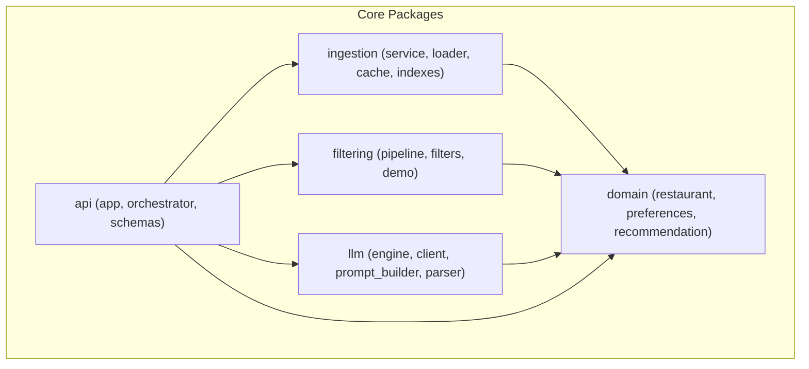
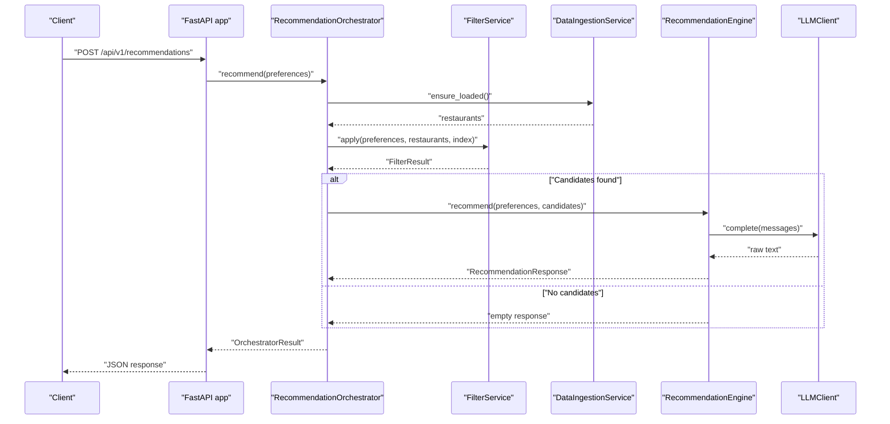
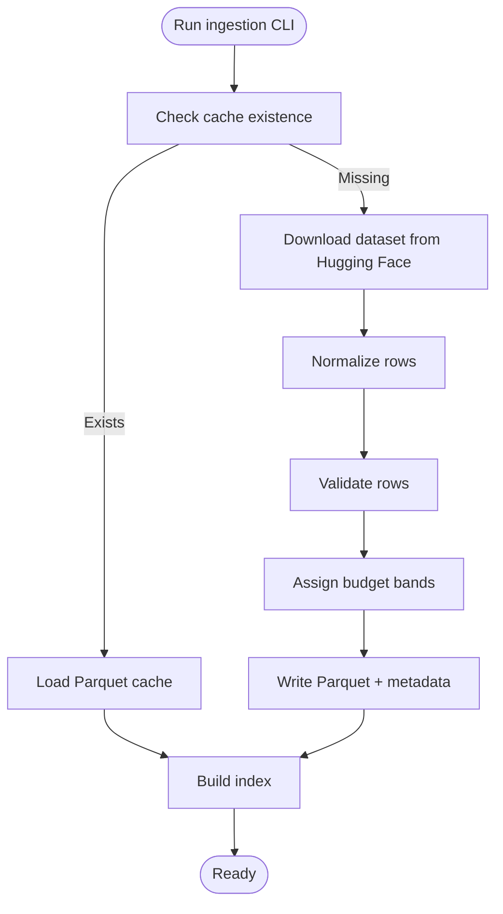
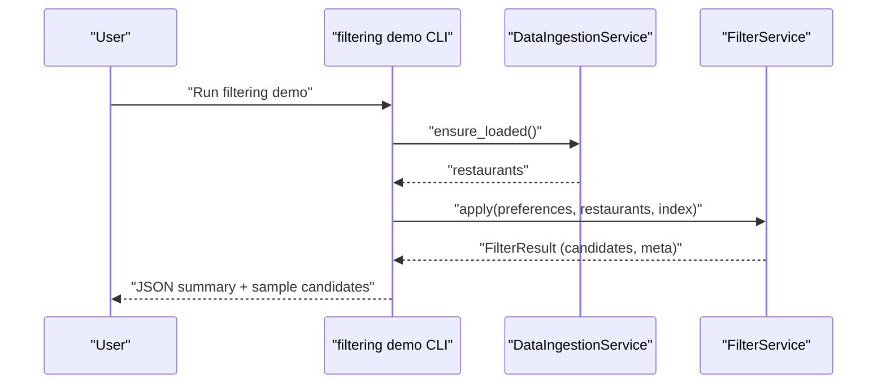
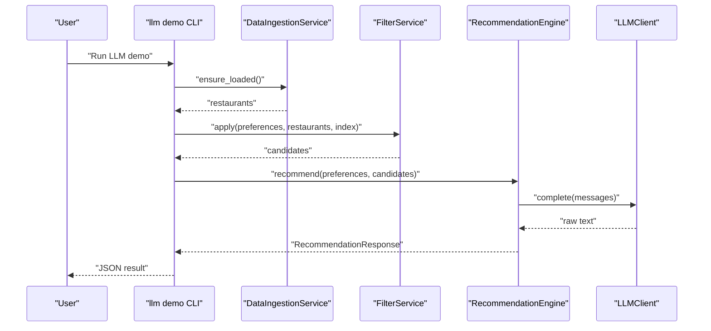
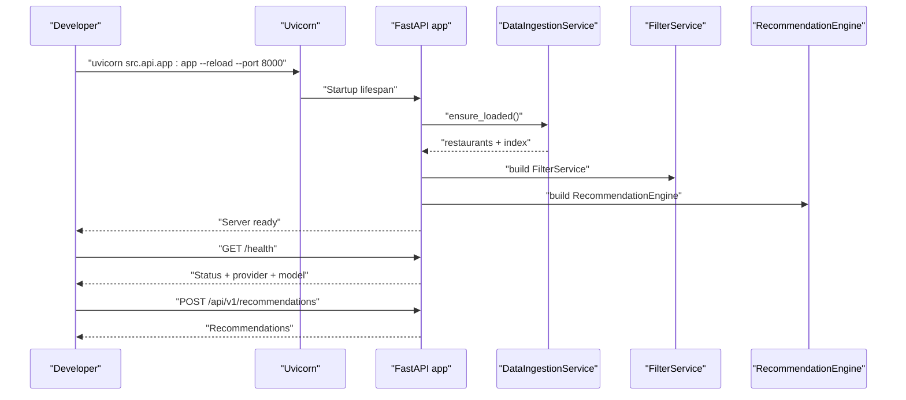

# Getting Started

<cite>
**Referenced Files in This Document**
- [README.md](file://README.md)
- [requirements.txt](file://requirements.txt)
- [src/config.py](file://src/config.py)
- [src/ingestion/__main__.py](file://src/ingestion/__main__.py)
- [src/ingestion/service.py](file://src/ingestion/service.py)
- [src/ingestion/cache.py](file://src/ingestion/cache.py)
- [src/filtering/__main__.py](file://src/filtering/__main__.py)
- [src/filtering/pipeline.py](file://src/filtering/pipeline.py)
- [src/llm/__main__.py](file://src/llm/__main__.py)
- [src/llm/client.py](file://src/llm/client.py)
- [src/llm/engine.py](file://src/llm/engine.py)
- [src/api/app.py](file://src/api/app.py)
- [src/api/orchestrator.py](file://src/api/orchestrator.py)
- [src/frontend/index.html](file://src/frontend/index.html)
- [pytest.ini](file://pytest.ini)
</cite>

## Table of Contents
1. [Introduction](#introduction)
2. [Project Structure](#project-structure)
3. [Core Components](#core-components)
4. [Architecture Overview](#architecture-overview)
5. [Detailed Component Analysis](#detailed-component-analysis)
6. [Dependency Analysis](#dependency-analysis)
7. [Performance Considerations](#performance-considerations)
8. [Troubleshooting Guide](#troubleshooting-guide)
9. [Conclusion](#conclusion)
10. [Appendices](#appendices)

## Introduction
This guide helps you set up and run the Zomato AI Restaurant Recommendation System from scratch. It covers environment setup, data ingestion, filtering pipeline, LLM demo modes, REST API server, and common troubleshooting. The system integrates a Hugging Face dataset, a deterministic filter pipeline, and an LLM-based recommendation engine with graceful fallback.

## Project Structure
At a high level, the project is organized into modular packages:
- ingestion: loads, normalizes, validates, assigns budget bands, caches, and indexes the dataset
- filtering: applies deterministic filters and optional relaxation to produce a candidate shortlist
- llm: builds prompts, queries providers, parses outputs, and hydrates recommendations
- api: FastAPI server exposing health, filtering, and recommendation endpoints
- domain: core data models (Restaurant, Preferences, Recommendation)
- frontend: static SPA served by the API
- tests: unit and integration tests

**Diagram sources**
- [src/ingestion/service.py:62-162](file://src/ingestion/service.py#L62-L162)
- [src/filtering/pipeline.py:31-204](file://src/filtering/pipeline.py#L31-L204)
- [src/llm/engine.py:29-191](file://src/llm/engine.py#L29-L191)
- [src/api/app.py:1-254](file://src/api/app.py#L1-L254)
- [src/domain/restaurant.py](file://src/domain/restaurant.py)
- [src/domain/preferences.py](file://src/domain/preferences.py)
- [src/domain/recommendation.py](file://src/domain/recommendation.py)

**Section sources**
- [README.md:120-132](file://README.md#L120-L132)

## Core Components
- Configuration: centralized settings with environment-backed fields, defaults, and provider constants
- Ingestion: loads from Hugging Face, normalizes, validates, assigns budget bands, writes Parquet cache
- Filtering: applies city/rating/cuisine/budget filters with configurable relaxation
- LLM Engine: prompts, completion, parsing, and hydrated response building with degraded mode fallback
- API: FastAPI app with lifecycle loading, CORS, readiness checks, and endpoints for candidates and recommendations
- Frontend: static SPA served under the API root

**Section sources**
- [src/config.py:36-66](file://src/config.py#L36-L66)
- [src/ingestion/service.py:85-162](file://src/ingestion/service.py#L85-L162)
- [src/filtering/pipeline.py:42-204](file://src/filtering/pipeline.py#L42-L204)
- [src/llm/engine.py:45-191](file://src/llm/engine.py#L45-L191)
- [src/api/app.py:35-254](file://src/api/app.py#L35-L254)
- [src/frontend/index.html:1-230](file://src/frontend/index.html#L1-L230)

## Architecture Overview
The system initializes services on startup, loads and indexes the dataset, and exposes endpoints that orchestrate filtering and LLM ranking.

**Diagram sources**
- [src/api/app.py:211-242](file://src/api/app.py#L211-L242)
- [src/api/orchestrator.py:45-99](file://src/api/orchestrator.py#L45-L99)
- [src/filtering/pipeline.py:42-103](file://src/filtering/pipeline.py#L42-L103)
- [src/llm/engine.py:45-118](file://src/llm/engine.py#L45-L118)
- [src/llm/client.py:37-63](file://src/llm/client.py#L37-L63)

## Detailed Component Analysis

### Environment Setup and Prerequisites
- Install Python 3.10+ and pip
- Create a virtual environment and activate it
- Install dependencies from requirements.txt
- Copy .env.example to .env and configure LLM provider and keys

Key commands and locations:
- Virtual environment activation and dependency installation
- Environment variable configuration for LLM provider and API key

**Section sources**
- [README.md:12-19](file://README.md#L12-L19)
- [requirements.txt:1-12](file://requirements.txt#L1-L12)
- [src/config.py:36-66](file://src/config.py#L36-L66)

### Data Ingestion: First-Time Setup and Local Caching
- First run downloads ~51k rows from Hugging Face, normalizes, validates, assigns budget bands, and writes Parquet cache
- Subsequent runs load from local cache instantly
- CLI supports refresh and sampling

**Diagram sources**
- [src/ingestion/__main__.py:17-55](file://src/ingestion/__main__.py#L17-L55)
- [src/ingestion/service.py:85-162](file://src/ingestion/service.py#L85-L162)
- [src/ingestion/cache.py:58-76](file://src/ingestion/cache.py#L58-L76)

Practical steps:
- First run: python -m src.ingestion.load
- Refresh cache: python -m src.ingestion.load --refresh
- Sample rows: python -m src.ingestion.load --sample 5

**Section sources**
- [README.md:21-42](file://README.md#L21-L42)
- [src/ingestion/__main__.py:17-55](file://src/ingestion/__main__.py#L17-L55)
- [src/ingestion/service.py:85-162](file://src/ingestion/service.py#L85-L162)
- [src/ingestion/cache.py:58-76](file://src/ingestion/cache.py#L58-L76)

### Running the Filtering Pipeline
- Use the filtering demo CLI to run the deterministic pipeline against cached data
- Example invocation demonstrates location, budget, cuisine, and minimum rating

**Diagram sources**
- [src/filtering/__main__.py:20-68](file://src/filtering/__main__.py#L20-L68)
- [src/filtering/pipeline.py:42-103](file://src/filtering/pipeline.py#L42-L103)
- [src/ingestion/service.py:80-84](file://src/ingestion/service.py#L80-L84)

Example command:
- python -m src.filtering.demo --location Bangalore --budget medium --cuisine Italian --min-rating 4.0

**Section sources**
- [README.md:78-84](file://README.md#L78-L84)
- [src/filtering/__main__.py:20-68](file://src/filtering/__main__.py#L20-L68)
- [src/filtering/pipeline.py:42-103](file://src/filtering/pipeline.py#L42-L103)

### LLM Demo Modes
- Offline demo with mock provider (no API key required)
- Production demo with Groq/OpenAI-compatible provider (requires API key)

**Diagram sources**
- [src/llm/__main__.py:21-55](file://src/llm/__main__.py#L21-L55)
- [src/llm/engine.py:45-118](file://src/llm/engine.py#L45-L118)
- [src/llm/client.py:37-63](file://src/llm/client.py#L37-L63)
- [src/filtering/pipeline.py:42-103](file://src/filtering/pipeline.py#L42-L103)
- [src/ingestion/service.py:80-84](file://src/ingestion/service.py#L80-L84)

Examples:
- Offline: python -m src.llm.demo --provider mock --location Bangalore --budget medium --cuisine Italian
- With Groq: export LLM_PROVIDER=groq LLM_API_KEY=...; python -m src.llm.demo

Provider selection and fallback:
- Provider resolution supports mock, ollama, groq, and openai

**Section sources**
- [README.md:50-61](file://README.md#L50-L61)
- [src/llm/__main__.py:21-55](file://src/llm/__main__.py#L21-L55)
- [src/llm/client.py:37-63](file://src/llm/client.py#L37-L63)
- [src/config.py:8-10](file://src/config.py#L8-L10)

### REST API Server Startup
- Start the server with uvicorn
- Health and readiness probes indicate dataset load status and LLM provider/model
- OpenAPI docs are available at /docs

**Diagram sources**
- [README.md:63-76](file://README.md#L63-L76)
- [src/api/app.py:42-76](file://src/api/app.py#L42-L76)
- [src/api/app.py:137-242](file://src/api/app.py#L137-L242)
- [src/api/orchestrator.py:45-99](file://src/api/orchestrator.py#L45-L99)

Endpoints overview:
- GET /health: service status, dataset info, LLM provider/model
- GET /health/ready: readiness probe
- GET /api/v1/cities: known cities
- POST /api/v1/candidates: deterministic filter results
- POST /api/v1/recommendations: filter + LLM-ranked recommendations
- GET /docs: OpenAPI docs

**Section sources**
- [README.md:86-96](file://README.md#L86-L96)
- [src/api/app.py:137-242](file://src/api/app.py#L137-L242)

### Frontend Integration
- The API serves a static SPA under /
- Assets are mounted under /assets
- The SPA interacts with the backend endpoints described above

**Section sources**
- [src/frontend/index.html:245-253](file://src/frontend/index.html#L245-L253)
- [src/api/app.py:245-253](file://src/api/app.py#L245-L253)

## Dependency Analysis
External libraries and their roles:
- datasets: Hugging Face dataset loading
- pandas/pyarrow: caching to Parquet
- numpy: numerical operations
- pydantic/pydantic-settings: typed configuration
- fastapi/uvicorn: REST API and ASGI server
- openai/httpx: OpenAI-compatible LLM client and HTTP utilities
- pytest: testing framework

**Section sources**
- [requirements.txt:1-12](file://requirements.txt#L1-L12)
- [pytest.ini:1-4](file://pytest.ini#L1-L4)

## Performance Considerations
- Filter pipeline target runtime is under 200 ms; warnings are logged if exceeded
- Dataset is cached locally as Parquet for instant subsequent loads
- LLM calls are bounded by configured timeout and token limits; degraded mode provides fallback when API key is missing or calls fail

**Section sources**
- [src/filtering/pipeline.py:87-89](file://src/filtering/pipeline.py#L87-L89)
- [src/ingestion/cache.py:58-76](file://src/ingestion/cache.py#L58-L76)
- [src/llm/engine.py:64-107](file://src/llm/engine.py#L64-L107)
- [src/config.py:56-61](file://src/config.py#L56-L61)

## Troubleshooting Guide
Common issues and resolutions:
- Missing or invalid LLM API key
  - Symptom: degraded mode responses or warnings
  - Resolution: set LLM_API_KEY or GROQ_API_KEY in .env; confirm provider matches expected
- Provider misconfiguration
  - Symptom: unexpected provider fallback or errors
  - Resolution: set LLM_PROVIDER to mock, ollama, groq, or openai
- Dataset not loaded on startup
  - Symptom: readiness probe fails or health indicates not ready
  - Resolution: run ingestion CLI to populate cache; verify cache file exists
- Slow filter pipeline
  - Symptom: warnings about latency
  - Resolution: adjust preferences to reduce candidate set; avoid overly restrictive filters
- Network or LLM timeouts
  - Symptom: LLM call failures or retries
  - Resolution: increase timeout settings; verify connectivity; enable prompt logging for diagnostics

Environment and configuration pointers:
- Settings and provider defaults
- Health and readiness endpoints for diagnostics

**Section sources**
- [src/config.py:36-66](file://src/config.py#L36-L66)
- [src/llm/engine.py:64-107](file://src/llm/engine.py#L64-L107)
- [src/api/app.py:107-113](file://src/api/app.py#L107-L113)
- [src/api/app.py:151-155](file://src/api/app.py#L151-L155)
- [README.md:50-61](file://README.md#L50-L61)

## Conclusion
You now have the essentials to set up the Zomato recommendation system, ingest and cache the dataset, run the filtering pipeline, experiment with LLM demos, and start the REST API server. Use the troubleshooting section to resolve common issues, and refer to the architecture and component diagrams for deeper understanding.

## Appendices

### Step-by-Step Setup Checklist
- Create and activate a Python virtual environment
- Install dependencies
- Configure .env with LLM provider and API key
- Load and cache the dataset
- Run filtering demo
- Run LLM demo (mock or production)
- Start the API server and test endpoints
- Optionally run QA scenarios and tests

**Section sources**
- [README.md:12-19](file://README.md#L12-L19)
- [README.md:21-76](file://README.md#L21-L76)
- [README.md:97-118](file://README.md#L97-L118)