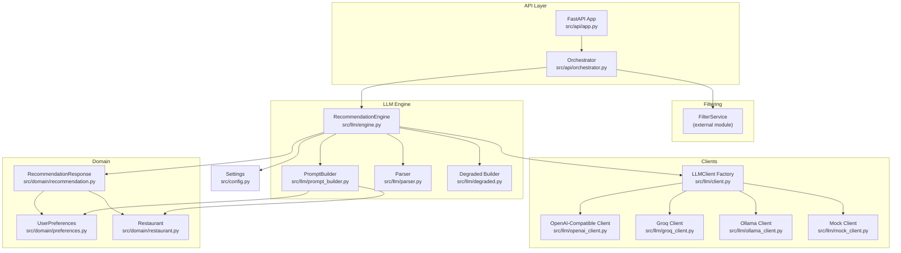
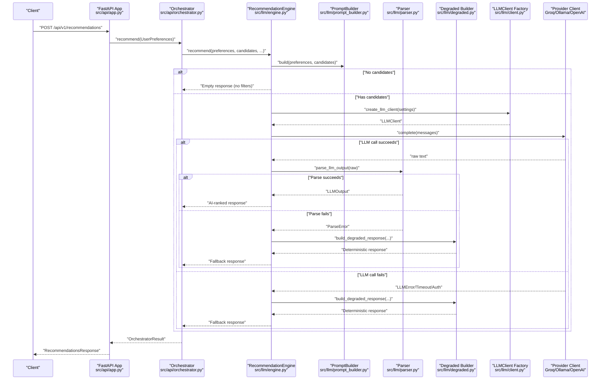
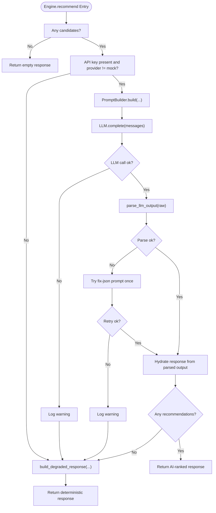
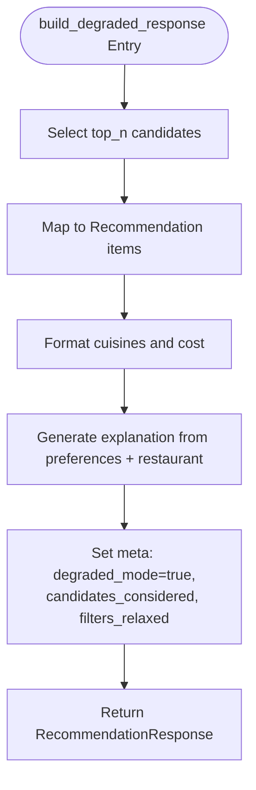
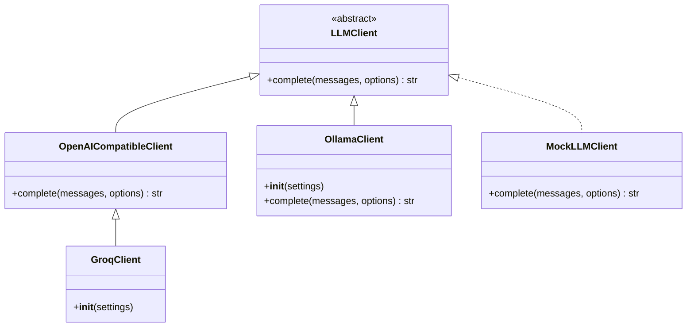
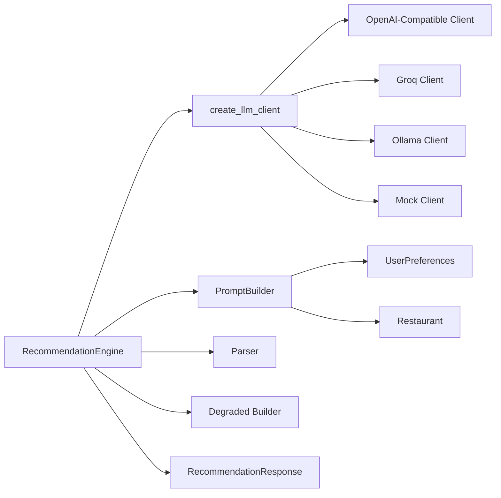

# Degraded Mode & Fallback

<cite>
**Referenced Files in This Document**
- [engine.py](file://src/llm/engine.py)
- [degraded.py](file://src/llm/degraded.py)
- [client.py](file://src/llm/client.py)
- [openai_client.py](file://src/llm/openai_client.py)
- [groq_client.py](file://src/llm/groq_client.py)
- [ollama_client.py](file://src/llm/ollama_client.py)
- [mock_client.py](file://src/llm/mock_client.py)
- [parser.py](file://src/llm/parser.py)
- [prompt_builder.py](file://src/llm/prompt_builder.py)
- [config.py](file://src/config.py)
- [recommendation.py](file://src/domain/recommendation.py)
- [preferences.py](file://src/domain/preferences.py)
- [restaurant.py](file://src/domain/restaurant.py)
- [orchestrator.py](file://src/api/orchestrator.py)
- [app.py](file://src/api/app.py)
- [test_llm_degraded.py](file://tests/test_llm_degraded.py)
</cite>

## Table of Contents
1. [Introduction](#introduction)
2. [Project Structure](#project-structure)
3. [Core Components](#core-components)
4. [Architecture Overview](#architecture-overview)
5. [Detailed Component Analysis](#detailed-component-analysis)
6. [Dependency Analysis](#dependency-analysis)
7. [Performance Considerations](#performance-considerations)
8. [Monitoring, Alerting, and Metrics](#monitoring-alerting-and-metrics)
9. [Operational Procedures](#operational-procedures)
10. [Troubleshooting Guide](#troubleshooting-guide)
11. [Conclusion](#conclusion)

## Introduction
This document describes the degraded mode fallback system that maintains service continuity when LLM providers fail. It explains automatic failure detection, graceful degradation to deterministic ranking, alternative recommendation strategies, configuration options, activation thresholds, recovery procedures, impact assessment, user experience considerations, monitoring and alerting, and operational procedures for managing degraded mode incidents.

## Project Structure
The degraded mode system spans several modules:
- LLM engine and clients: orchestrate LLM calls, handle errors, and trigger fallback.
- Degraded mode builder: constructs deterministic recommendations when AI fails.
- Configuration: defines provider selection, timeouts, and logging behavior.
- Domain models: define the shape of recommendations and metadata.
- API and orchestrator: integrate filtering, LLM ranking, and response formatting.

**Diagram sources**
- [app.py:1-254](file://src/api/app.py#L1-L254)
- [orchestrator.py:1-99](file://src/api/orchestrator.py#L1-L99)
- [engine.py:1-191](file://src/llm/engine.py#L1-L191)
- [prompt_builder.py:1-91](file://src/llm/prompt_builder.py#L1-L91)
- [parser.py:1-46](file://src/llm/parser.py#L1-L46)
- [degraded.py:1-67](file://src/llm/degraded.py#L1-L67)
- [client.py:1-64](file://src/llm/client.py#L1-L64)
- [openai_client.py:1-66](file://src/llm/openai_client.py#L1-L66)
- [groq_client.py:1-29](file://src/llm/groq_client.py#L1-L29)
- [ollama_client.py:1-56](file://src/llm/ollama_client.py#L1-L56)
- [mock_client.py:1-67](file://src/llm/mock_client.py#L1-L67)
- [config.py:1-81](file://src/config.py#L1-L81)
- [preferences.py:1-29](file://src/domain/preferences.py#L1-L29)
- [restaurant.py:1-26](file://src/domain/restaurant.py#L1-L26)
- [recommendation.py:1-28](file://src/domain/recommendation.py#L1-L28)

**Section sources**
- [app.py:1-254](file://src/api/app.py#L1-L254)
- [orchestrator.py:1-99](file://src/api/orchestrator.py#L1-L99)
- [engine.py:1-191](file://src/llm/engine.py#L1-L191)
- [config.py:1-81](file://src/config.py#L1-L81)

## Core Components
- RecommendationEngine: Main orchestrator for LLM-based recommendations with built-in fallback to deterministic ranking.
- LLM Clients: Pluggable clients for Groq, Ollama, OpenAI-compatible APIs, and a mock client for testing.
- Degraded Builder: Produces deterministic recommendations when AI services are unavailable.
- Parser: Validates and parses LLM JSON outputs; triggers retries and fallbacks on parse errors.
- PromptBuilder: Constructs system prompts and user instructions for the LLM.
- Configuration: Centralized settings controlling provider selection, timeouts, token limits, and logging.
- Domain Models: Strongly typed models for preferences, restaurants, and recommendation responses.

**Section sources**
- [engine.py:29-191](file://src/llm/engine.py#L29-L191)
- [client.py:15-64](file://src/llm/client.py#L15-L64)
- [degraded.py:34-67](file://src/llm/degraded.py#L34-L67)
- [parser.py:36-46](file://src/llm/parser.py#L36-L46)
- [prompt_builder.py:45-91](file://src/llm/prompt_builder.py#L45-L91)
- [config.py:46-81](file://src/config.py#L46-L81)
- [recommendation.py:8-28](file://src/domain/recommendation.py#L8-L28)
- [preferences.py:15-29](file://src/domain/preferences.py#L15-L29)
- [restaurant.py:16-26](file://src/domain/restaurant.py#L16-L26)

## Architecture Overview
The system follows a deterministic-first approach with AI augmentation. When AI is available and healthy, the engine builds prompts, calls the LLM, parses the response, and hydrates a rich recommendation response. If any failure occurs (missing API key, provider errors, parsing failures), the engine falls back to deterministic ranking using the degraded builder.

**Diagram sources**
- [app.py:211-242](file://src/api/app.py#L211-L242)
- [orchestrator.py:45-98](file://src/api/orchestrator.py#L45-L98)
- [engine.py:45-118](file://src/llm/engine.py#L45-L118)
- [prompt_builder.py:50-77](file://src/llm/prompt_builder.py#L50-L77)
- [parser.py:36-46](file://src/llm/parser.py#L36-L46)
- [degraded.py:34-67](file://src/llm/degraded.py#L34-L67)
- [client.py:37-63](file://src/llm/client.py#L37-L63)
- [openai_client.py:25-65](file://src/llm/openai_client.py#L25-L65)
- [groq_client.py:24-29](file://src/llm/groq_client.py#L24-L29)
- [ollama_client.py:22-55](file://src/llm/ollama_client.py#L22-L55)

## Detailed Component Analysis

### RecommendationEngine: Failure Detection and Fallback Logic
- Activation conditions:
  - Missing API key and provider is not mock: immediately degrade.
  - LLMError raised during completion: fallback to deterministic ranking.
  - ParseError during output parsing: attempt a single retry with a fix prompt; if still failing, fallback.
  - Empty or invalid LLM output after successful parsing: fallback to deterministic ranking.
- Deterministic ranking:
  - Uses the first N candidates (top_n_results) and constructs explanations based on preferences and restaurant attributes.
  - Sets meta.degraded_mode to true and preserves candidates_considered and filters_relaxed flags.
- Logging:
  - Logs timing and fallback events for observability.
  - Optionally logs prompt/response exchanges to disk when enabled.

**Diagram sources**
- [engine.py:45-173](file://src/llm/engine.py#L45-L173)
- [parser.py:36-46](file://src/llm/parser.py#L36-L46)
- [degraded.py:34-67](file://src/llm/degraded.py#L34-L67)

**Section sources**
- [engine.py:45-173](file://src/llm/engine.py#L45-L173)
- [parser.py:25-46](file://src/llm/parser.py#L25-L46)
- [degraded.py:34-67](file://src/llm/degraded.py#L34-L67)

### Degraded Mode Builder: Deterministic Ranking
- Selects up to top_n results deterministically from the candidate list.
- Formats cuisines and cost information consistently.
- Generates explanations based on preferences and restaurant attributes.
- Returns a RecommendationResponse with meta.degraded_mode set to true.

**Diagram sources**
- [degraded.py:34-67](file://src/llm/degraded.py#L34-L67)

**Section sources**
- [degraded.py:12-67](file://src/llm/degraded.py#L12-L67)

### LLM Clients and Provider Selection
- Factory selects provider based on settings:
  - mock: returns a mock client for tests/offline.
  - ollama: local inference via HTTP.
  - groq/openai: OpenAI-compatible API clients.
  - Unknown provider: falls back to Groq client with a warning.
- OpenAI-compatible client wraps authentication, timeouts, and connection errors into domain-specific exceptions.
- Ollama client handles local HTTP calls and timeouts.

**Diagram sources**
- [client.py:15-63](file://src/llm/client.py#L15-L63)
- [openai_client.py:17-65](file://src/llm/openai_client.py#L17-L65)
- [groq_client.py:24-29](file://src/llm/groq_client.py#L24-L29)
- [ollama_client.py:17-55](file://src/llm/ollama_client.py#L17-L55)
- [mock_client.py:11-67](file://src/llm/mock_client.py#L11-L67)

**Section sources**
- [client.py:37-63](file://src/llm/client.py#L37-L63)
- [openai_client.py:17-65](file://src/llm/openai_client.py#L17-L65)
- [groq_client.py:12-29](file://src/llm/groq_client.py#L12-L29)
- [ollama_client.py:17-55](file://src/llm/ollama_client.py#L17-L55)
- [mock_client.py:11-67](file://src/llm/mock_client.py#L11-L67)

### Configuration Options and Activation Thresholds
- Provider selection and defaults:
  - llm_provider: default "groq".
  - llm_api_key: required for non-mock providers.
  - llm_model and llm_base_url: defaults applied for Groq when unspecified.
- Timing and limits:
  - llm_timeout_seconds: per-call timeout.
  - llm_temperature and llm_max_tokens: generation parameters.
- Output controls:
  - llm_log_prompts and llm_log_dir: optional prompt/response logging.
- Results control:
  - top_n_results: number of recommendations to return.
- Activation thresholds:
  - Immediate fallback when API key is missing and provider is not mock.
  - Fallback triggered on LLMError, LLMTimeoutError, or LLMAuthError.
  - Fallback triggered on ParseError after initial and retry attempts.

**Section sources**
- [config.py:46-81](file://src/config.py#L46-L81)
- [engine.py:64-107](file://src/llm/engine.py#L64-L107)
- [openai_client.py:47-65](file://src/llm/openai_client.py#L47-L65)
- [ollama_client.py:42-55](file://src/llm/ollama_client.py#L42-L55)

### API Integration and User Experience
- The API exposes health/readiness endpoints and routes for recommendations and candidate filtering.
- The orchestrator measures filter and LLM durations and logs them with request context.
- Responses carry meta.degraded_mode to inform clients about fallback status.
- When no candidates remain after filtering, the system returns a clear message and sets meta accordingly.

**Section sources**
- [app.py:137-242](file://src/api/app.py#L137-L242)
- [orchestrator.py:45-98](file://src/api/orchestrator.py#L45-L98)
- [recommendation.py:18-28](file://src/domain/recommendation.py#L18-L28)

## Dependency Analysis
The engine depends on the client factory, prompt builder, parser, and degraded builder. The client factory selects among multiple provider implementations. The orchestrator coordinates filtering and engine execution.

**Diagram sources**
- [engine.py:16-24](file://src/llm/engine.py#L16-L24)
- [client.py:37-63](file://src/llm/client.py#L37-L63)
- [prompt_builder.py:17-42](file://src/llm/prompt_builder.py#L17-L42)
- [parser.py:14-26](file://src/llm/parser.py#L14-L26)
- [degraded.py:7-9](file://src/llm/degraded.py#L7-L9)
- [recommendation.py:8-28](file://src/domain/recommendation.py#L8-L28)

**Section sources**
- [engine.py:16-24](file://src/llm/engine.py#L16-L24)
- [client.py:37-63](file://src/llm/client.py#L37-L63)
- [prompt_builder.py:17-42](file://src/llm/prompt_builder.py#L17-L42)
- [parser.py:14-26](file://src/llm/parser.py#L14-L26)
- [degraded.py:7-9](file://src/llm/degraded.py#L7-L9)
- [recommendation.py:8-28](file://src/domain/recommendation.py#L8-L28)

## Performance Considerations
- Latency:
  - Engine logs LLM duration and filter duration for visibility.
  - Degraded mode avoids network calls, reducing latency under provider outages.
- Throughput:
  - Degraded mode relies on local sorting and formatting; throughput remains high.
- Resource usage:
  - Local clients (Ollama/Mock) shift compute to the service host; remote clients (Groq/OpenAI) rely on external infrastructure.
- Retry strategy:
  - Single retry on parse errors reduces repeated LLM calls while preserving quality.

[No sources needed since this section provides general guidance]

## Monitoring, Alerting, and Metrics
- Logging:
  - Engine logs warnings on fallback events and info on successful completion with timing.
  - Optional prompt/response logging to disk for debugging.
- Observability signals:
  - meta.degraded_mode indicates fallback activation.
  - Filter and LLM durations help assess performance deltas during fallback.
- Suggested metrics:
  - Fallback count per time window.
  - LLM error rate and retry rate.
  - Degraded vs. AI-ranked recommendation counts.
  - Latency percentiles for filter and LLM stages.

**Section sources**
- [engine.py:82-110](file://src/llm/engine.py#L82-L110)
- [engine.py:175-190](file://src/llm/engine.py#L175-L190)
- [app.py:229-236](file://src/api/app.py#L229-L236)

## Operational Procedures
- Manual override and maintenance:
  - Set llm_provider to "mock" to bypass external providers for testing or maintenance.
  - Disable LLM by leaving llm_api_key empty with provider != "mock" to force deterministic mode.
- Recovery:
  - Restore llm_api_key and correct provider settings to resume AI ranking.
  - Verify provider connectivity and credentials; check timeouts and token limits.
- Validation:
  - Use tests to confirm degraded mode behavior and deterministic explanations.

**Section sources**
- [client.py:45-48](file://src/llm/client.py#L45-L48)
- [engine.py:64-72](file://src/llm/engine.py#L64-L72)
- [test_llm_degraded.py:11-31](file://tests/test_llm_degraded.py#L11-L31)

## Troubleshooting Guide
- Symptoms:
  - Recommendations are returned but explanations are generic; meta.degraded_mode is true.
  - Requests succeed but performance degrades; filter stage completes quickly, LLM stage is slow or absent.
- Causes:
  - Missing API key or invalid provider configuration.
  - Provider errors (authentication, timeouts, connection failures).
  - LLM output parsing failures.
- Actions:
  - Confirm llm_api_key presence and provider correctness.
  - Review logs for warnings and fallback entries.
  - Enable prompt logging for deeper inspection if needed.
  - Validate candidate lists and preferences to ensure deterministic explanations are reasonable.

**Section sources**
- [engine.py:64-107](file://src/llm/engine.py#L64-L107)
- [openai_client.py:55-65](file://src/llm/openai_client.py#L55-L65)
- [ollama_client.py:47-55](file://src/llm/ollama_client.py#L47-L55)
- [parser.py:36-46](file://src/llm/parser.py#L36-L46)

## Conclusion
The degraded mode fallback system ensures continuous service delivery by seamlessly switching to deterministic ranking when LLM providers fail. Built-in detection, robust retry logic, and clear observability enable quick incident response and recovery. Operators can manage fallback via configuration, validate behavior with tests, and monitor performance to maintain a high-quality user experience even under provider outages.