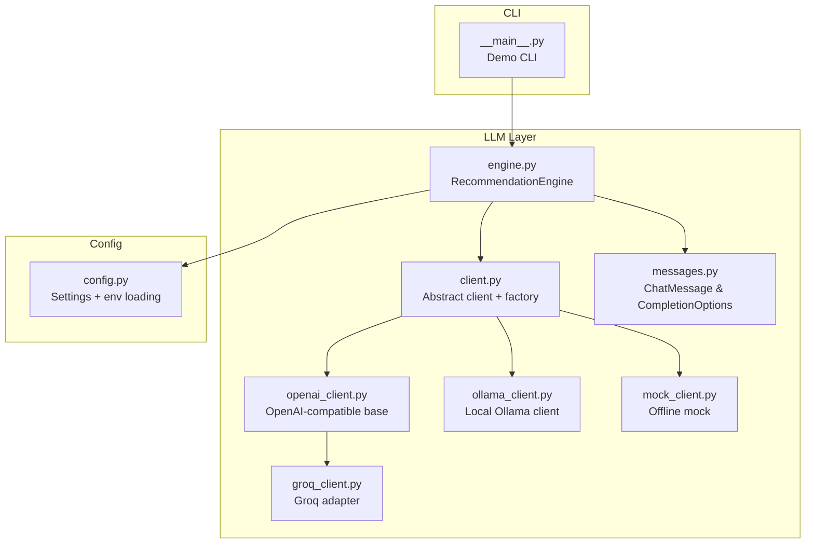
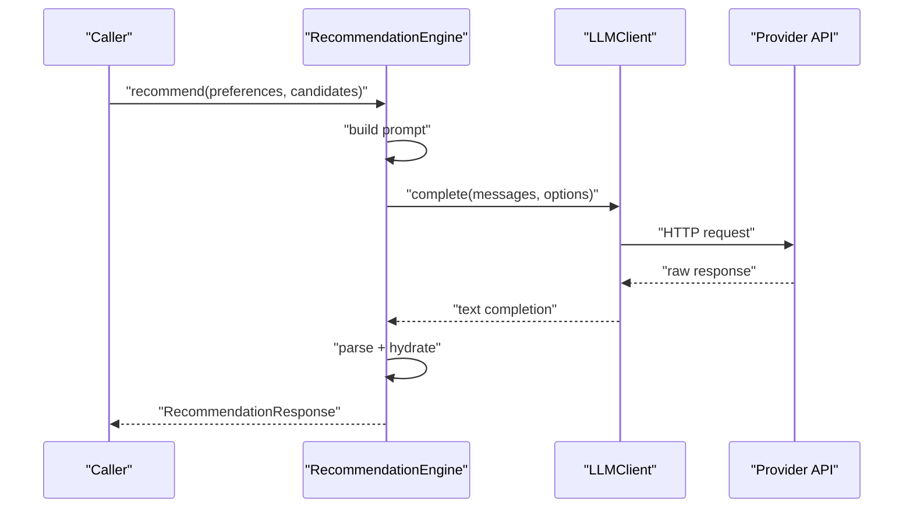
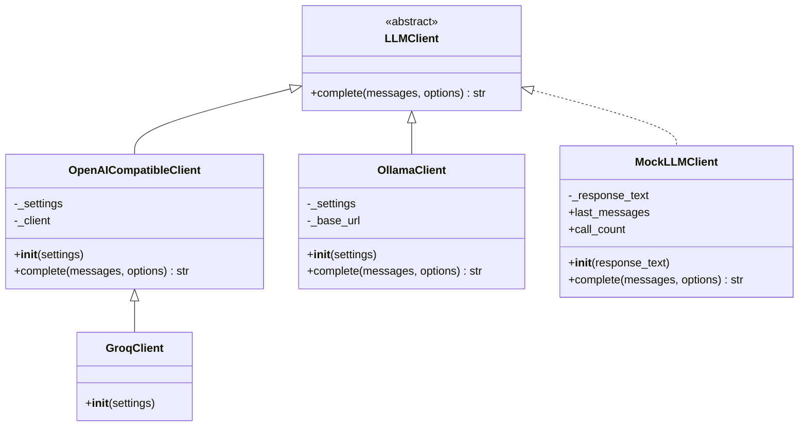
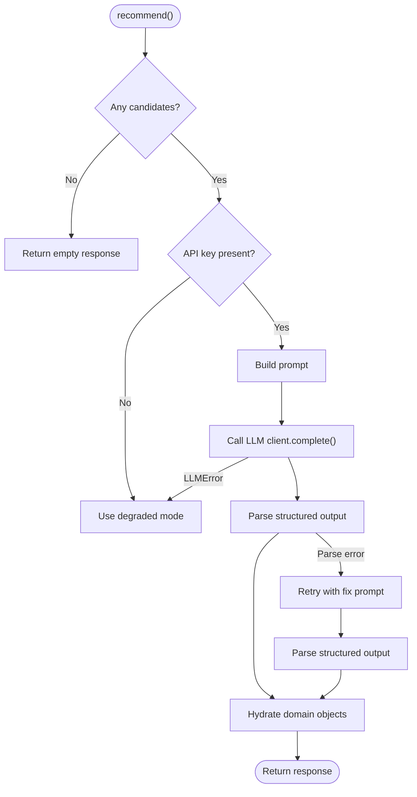
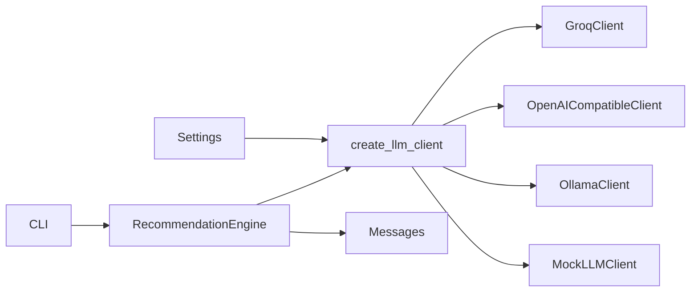

# LLM Client Implementations

<cite>
**Referenced Files in This Document**
- [client.py](file://src/llm/client.py)
- [openai_client.py](file://src/llm/openai_client.py)
- [groq_client.py](file://src/llm/groq_client.py)
- [ollama_client.py](file://src/llm/ollama_client.py)
- [mock_client.py](file://src/llm/mock_client.py)
- [messages.py](file://src/llm/messages.py)
- [engine.py](file://src/llm/engine.py)
- [config.py](file://src/config.py)
- [__main__.py](file://src/llm/__main__.py)
- [test_groq_client.py](file://tests/test_groq_client.py)
- [test_llm_engine.py](file://tests/test_llm_engine.py)
</cite>

## Table of Contents
1. [Introduction](#introduction)
2. [Project Structure](#project-structure)
3. [Core Components](#core-components)
4. [Architecture Overview](#architecture-overview)
5. [Detailed Component Analysis](#detailed-component-analysis)
6. [Dependency Analysis](#dependency-analysis)
7. [Performance Considerations](#performance-considerations)
8. [Troubleshooting Guide](#troubleshooting-guide)
9. [Conclusion](#conclusion)
10. [Appendices](#appendices)

## Introduction
This document explains the LLM client implementations that power the recommendation system. It covers the unified client abstraction, provider-specific clients for Groq, OpenAI-compatible APIs, Mock, and Ollama, and the end-to-end request-response lifecycle. It also documents configuration, authentication, timeouts, error propagation, and practical usage patterns for testing and production.

## Project Structure
The LLM subsystem resides under src/llm and integrates with configuration, domain models, and the recommendation engine.

**Diagram sources**
- [client.py:15-63](file://src/llm/client.py#L15-L63)
- [openai_client.py:17-65](file://src/llm/openai_client.py#L17-L65)
- [groq_client.py:24-28](file://src/llm/groq_client.py#L24-L28)
- [ollama_client.py:17-55](file://src/llm/ollama_client.py#L17-L55)
- [mock_client.py:11-66](file://src/llm/mock_client.py#L11-L66)
- [messages.py:11-21](file://src/llm/messages.py#L11-L21)
- [engine.py:29-191](file://src/llm/engine.py#L29-L191)
- [config.py:46-81](file://src/config.py#L46-L81)
- [__main__.py:21-59](file://src/llm/__main__.py#L21-L59)

**Section sources**
- [client.py:15-63](file://src/llm/client.py#L15-L63)
- [engine.py:29-191](file://src/llm/engine.py#L29-L191)
- [config.py:46-81](file://src/config.py#L46-L81)

## Core Components
- Unified client interface: An abstract base class defines the contract for completions.
- Provider clients:
  - OpenAI-compatible base client that wraps the OpenAI SDK.
  - Groq client that adapts settings to Groq defaults.
  - Ollama client that talks to a local HTTP endpoint.
  - Mock client for offline and testing scenarios.
- Factory: A function that selects the appropriate client based on configuration.
- Messages: Typed structures for chat messages and completion options.
- Engine: Orchestrates prompts, calls the client, parses responses, and falls back to degraded mode on errors.

**Section sources**
- [client.py:15-35](file://src/llm/client.py#L15-L35)
- [openai_client.py:17-65](file://src/llm/openai_client.py#L17-L65)
- [groq_client.py:24-28](file://src/llm/groq_client.py#L24-L28)
- [ollama_client.py:17-55](file://src/llm/ollama_client.py#L17-L55)
- [mock_client.py:11-66](file://src/llm/mock_client.py#L11-L66)
- [messages.py:11-21](file://src/llm/messages.py#L11-L21)
- [engine.py:29-191](file://src/llm/engine.py#L29-L191)

## Architecture Overview
The system exposes a single client interface while delegating to provider-specific implementations. The engine builds prompts, invokes the client, parses structured output, and gracefully degrades when LLM calls fail.

**Diagram sources**
- [engine.py:45-118](file://src/llm/engine.py#L45-L118)
- [openai_client.py:25-65](file://src/llm/openai_client.py#L25-L65)
- [ollama_client.py:22-55](file://src/llm/ollama_client.py#L22-L55)
- [mock_client.py:19-66](file://src/llm/mock_client.py#L19-L66)

## Detailed Component Analysis

### Abstract Client and Factory
- LLMClient defines a single method to produce raw text completions given a list of typed messages and optional completion options.
- create_llm_client selects the provider based on configuration, with fallback behavior and support for overriding the provider at runtime.
- Error types:
  - LLMError: generic provider failure.
  - LLMTimeoutError: provider-side or transport timeout.
  - LLMAuthError: authentication failure.

**Diagram sources**
- [client.py:15-35](file://src/llm/client.py#L15-L35)
- [openai_client.py:17-65](file://src/llm/openai_client.py#L17-L65)
- [groq_client.py:24-28](file://src/llm/groq_client.py#L24-L28)
- [ollama_client.py:17-55](file://src/llm/ollama_client.py#L17-L55)
- [mock_client.py:11-66](file://src/llm/mock_client.py#L11-L66)

**Section sources**
- [client.py:15-63](file://src/llm/client.py#L15-L63)
- [client.py:25-35](file://src/llm/client.py#L25-L35)

### OpenAI-Compatible Client
- Wraps the OpenAI SDK client with provider-agnostic settings.
- Reads model, base URL, and API key from Settings.
- Applies per-call overrides from CompletionOptions for temperature, max tokens, and timeout.
- Converts SDK exceptions to domain-specific errors:
  - AuthenticationError -> LLMAuthError
  - APITimeoutError -> LLMTimeoutError
  - APIConnectionError -> LLMError
- Validates non-empty response content and returns stripped text.

**Section sources**
- [openai_client.py:17-65](file://src/llm/openai_client.py#L17-L65)

### Groq Client
- Groq is configured via an OpenAI-compatible endpoint.
- settings_for_groq applies defaults when base URL or model are unset:
  - Sets Groq base URL if not provided.
  - Switches model to a Groq default when using OpenAI model names.
- GroqClient inherits OpenAI-compatible behavior.

**Section sources**
- [groq_client.py:8-28](file://src/llm/groq_client.py#L8-L28)
- [config.py:9-10](file://src/config.py#L9-L10)
- [config.py:58-68](file://src/config.py#L58-L68)

### Ollama Client
- Uses httpx to send a JSON payload to a local Ollama endpoint.
- Supports configurable base URL (defaults to localhost).
- Sends model, messages, and options (temperature).
- Raises LLMTimeoutError on timeout and LLMError on HTTP errors.
- Validates non-empty response content.

**Section sources**
- [ollama_client.py:17-55](file://src/llm/ollama_client.py#L17-L55)

### Mock Client
- Returns either a fixed response text or a generated JSON response containing recommendations.
- Parses a system prompt to extract candidate IDs when available.
- Tracks last_messages and call_count for testing and inspection.
- Useful for offline development and deterministic tests.

**Section sources**
- [mock_client.py:11-66](file://src/llm/mock_client.py#L11-L66)

### Messages and Options
- ChatMessage: role and content.
- CompletionOptions: temperature, max_tokens, timeout_seconds.

**Section sources**
- [messages.py:11-21](file://src/llm/messages.py#L11-L21)

### Recommendation Engine Integration
- Builds prompts, invokes the client, logs exchanges when enabled, parses structured output, and hydrates domain objects.
- Falls back to degraded mode when:
  - No API key is present (except for mock provider).
  - LLM calls fail or JSON parsing fails.
- Logs exchanges to disk when enabled.

**Diagram sources**
- [engine.py:45-118](file://src/llm/engine.py#L45-L118)
- [engine.py:120-173](file://src/llm/engine.py#L120-L173)

**Section sources**
- [engine.py:29-191](file://src/llm/engine.py#L29-L191)

## Dependency Analysis
- Configuration-driven selection: create_llm_client depends on Settings.llm_provider and Settings.llm_api_key.
- Provider defaults: Groq defaults are applied when base URL or model are missing.
- Engine dependency: RecommendationEngine depends on LLMClient and Settings, and optionally on a pre-instantiated client.
- CLI integration: The demo CLI constructs Settings, optionally overrides provider, and runs the full pipeline.

**Diagram sources**
- [client.py:37-63](file://src/llm/client.py#L37-L63)
- [engine.py:29-43](file://src/llm/engine.py#L29-L43)
- [config.py:46-81](file://src/config.py#L46-L81)
- [__main__.py:30-50](file://src/llm/__main__.py#L30-L50)

**Section sources**
- [client.py:37-63](file://src/llm/client.py#L37-L63)
- [engine.py:29-43](file://src/llm/engine.py#L29-L43)
- [config.py:46-81](file://src/config.py#L46-L81)
- [__main__.py:30-50](file://src/llm/__main__.py#L30-L50)

## Performance Considerations
- Timeout tuning: Configure llm_timeout_seconds globally and override per-call via CompletionOptions.timeout_seconds.
- Token limits: Control llm_max_tokens to bound response sizes and reduce latency.
- Temperature: Lower values increase determinism; higher values increase creativity.
- Local vs remote:
  - Ollama runs locally; adjust base URL and model accordingly.
  - Groq is remote; ensure network stability and consider retry/backoff at the caller level.
- Logging overhead: Disabling llm_log_prompts avoids filesystem writes during heavy loads.

[No sources needed since this section provides general guidance]

## Troubleshooting Guide
Common issues and resolutions:
- Missing API key:
  - Symptom: Degraded mode or authentication errors.
  - Resolution: Set LLM_API_KEY or GROQ_API_KEY in environment or .env.
- Unknown provider:
  - Symptom: Warning and fallback to Groq client.
  - Resolution: Set llm_provider to a supported value.
- Empty or invalid response:
  - Symptom: LLMError indicating empty response.
  - Resolution: Verify model availability, base URL, and payload correctness.
- Timeout:
  - Symptom: LLMTimeoutError.
  - Resolution: Increase llm_timeout_seconds or reduce max_tokens.
- JSON parsing failures:
  - Symptom: Parse errors leading to degraded mode or retry attempts.
  - Resolution: Ensure prompts yield valid JSON; consider stricter prompt engineering.

**Section sources**
- [engine.py:64-90](file://src/llm/engine.py#L64-L90)
- [openai_client.py:55-65](file://src/llm/openai_client.py#L55-L65)
- [ollama_client.py:47-55](file://src/llm/ollama_client.py#L47-L55)
- [mock_client.py:30-66](file://src/llm/mock_client.py#L30-L66)

## Conclusion
The LLM client layer provides a clean abstraction over multiple providers, enabling seamless switching between Groq, OpenAI-compatible APIs, local Ollama, and a mock client for testing. The RecommendationEngine orchestrates the end-to-end flow, with robust error handling and graceful degradation. Proper configuration of timeouts, tokens, and authentication ensures reliable operation across environments.

[No sources needed since this section summarizes without analyzing specific files]

## Appendices

### Configuration Reference
- llm_provider: "groq", "openai", "ollama", or "mock".
- llm_api_key: API key for remote providers; optional for mock.
- llm_base_url: Provider base URL; defaults applied for Groq.
- llm_model: Model identifier; Groq defaults applied when using OpenAI model names.
- llm_temperature: Generation temperature.
- llm_max_tokens: Maximum tokens to generate.
- llm_timeout_seconds: Request timeout in seconds.
- llm_log_prompts: Enable logging of exchanges to disk.
- llm_log_dir: Directory for logged exchanges.

**Section sources**
- [config.py:58-70](file://src/config.py#L58-L70)

### Provider-Specific Notes
- Groq:
  - Uses OpenAI-compatible endpoint.
  - Defaults applied when base URL or model are unset.
- OpenAI-compatible:
  - Uses the OpenAI SDK; supports base_url and api_key.
- Ollama:
  - Requires a local server; default base URL is http://localhost:11434.
- Mock:
  - No external dependencies; useful for offline development and testing.

**Section sources**
- [groq_client.py:8-28](file://src/llm/groq_client.py#L8-L28)
- [openai_client.py:17-24](file://src/llm/openai_client.py#L17-L24)
- [ollama_client.py:18-21](file://src/llm/ollama_client.py#L18-L21)
- [mock_client.py:11-18](file://src/llm/mock_client.py#L11-L18)

### Practical Usage Examples
- CLI demo with mock provider:
  - python -m src.llm.demo --provider mock --location Bangalore --budget medium --cuisine Italian
- Using Groq with environment variables:
  - export LLM_PROVIDER=groq LLM_API_KEY=gsk_...
  - python -m src.llm.demo
- Programmatic usage:
  - Override provider via Settings or pass override_provider to create_llm_client.
  - Pass CompletionOptions to tune temperature, tokens, and timeout per call.

**Section sources**
- [__main__.py:21-59](file://src/llm/__main__.py#L21-L59)
- [client.py:37-63](file://src/llm/client.py#L37-L63)

### Test Coverage Highlights
- Groq defaults application and API key alias resolution.
- Engine happy path with mock client, hallucination handling, degraded mode on missing keys, and invalid JSON recovery.

**Section sources**
- [test_groq_client.py:5-19](file://tests/test_groq_client.py#L5-L19)
- [test_llm_engine.py:23-53](file://tests/test_llm_engine.py#L23-L53)
- [test_llm_engine.py:55-74](file://tests/test_llm_engine.py#L55-L74)
- [test_llm_engine.py:76-87](file://tests/test_llm_engine.py#L76-L87)
- [test_llm_engine.py:90-98](file://tests/test_llm_engine.py#L90-L98)
- [test_llm_engine.py:101-106](file://tests/test_llm_engine.py#L101-L106)