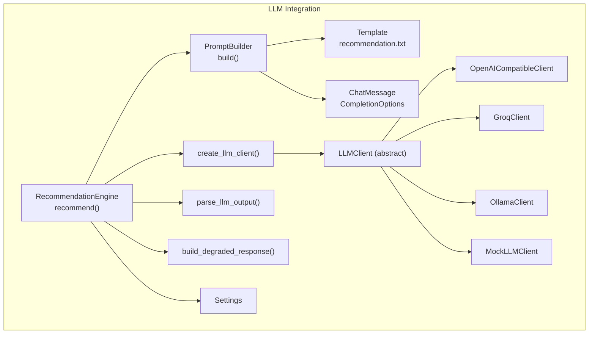
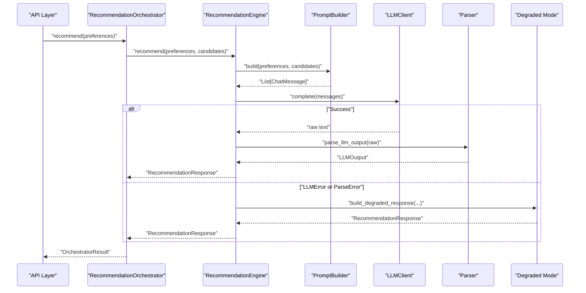
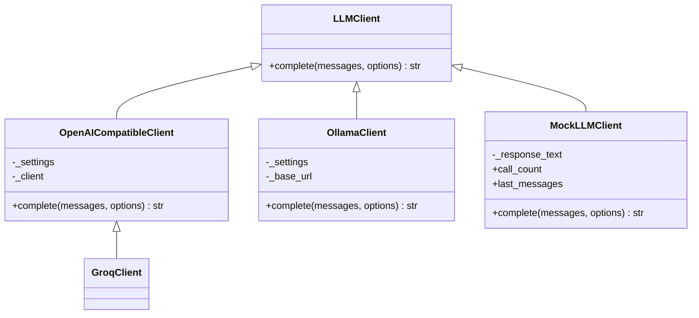
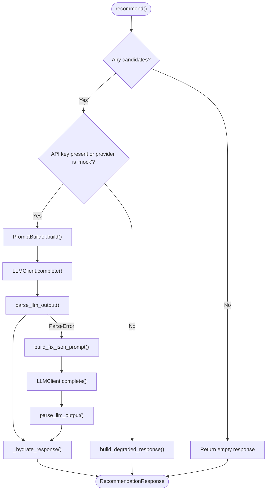
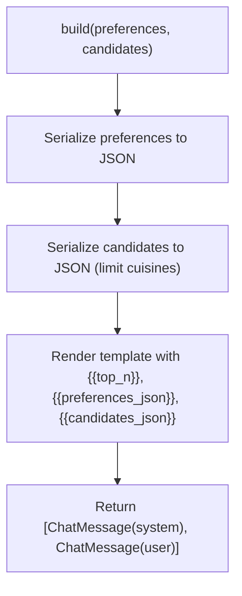
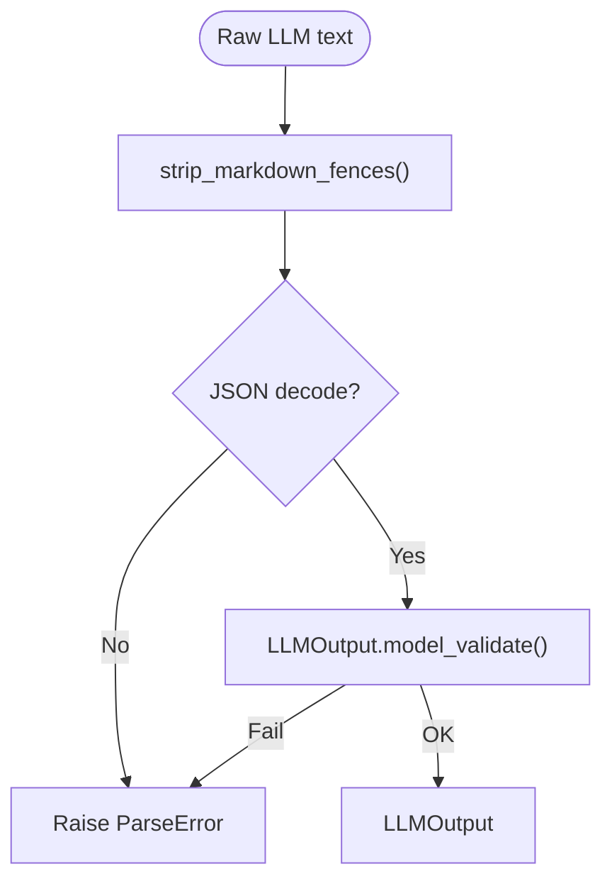
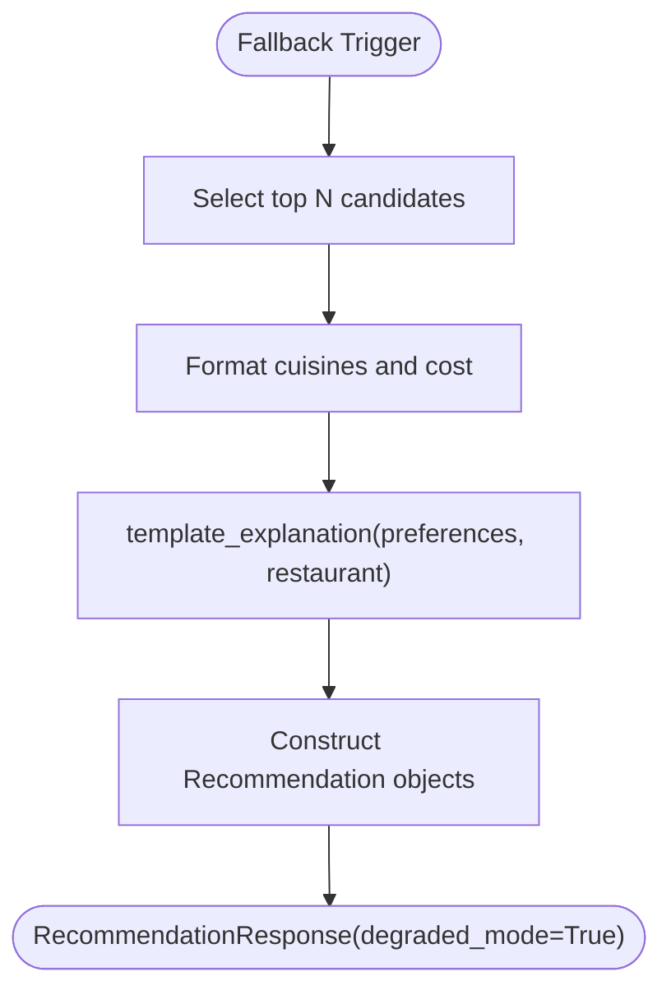
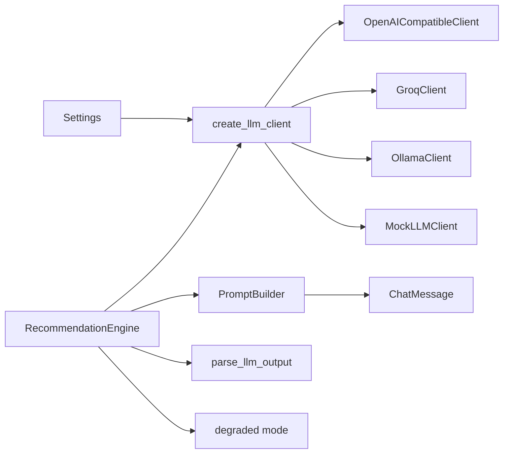

# LLM Integration

<cite>
**Referenced Files in This Document**
- [src/llm/__init__.py](file://src/llm/__init__.py)
- [src/llm/engine.py](file://src/llm/engine.py)
- [src/llm/client.py](file://src/llm/client.py)
- [src/llm/openai_client.py](file://src/llm/openai_client.py)
- [src/llm/groq_client.py](file://src/llm/groq_client.py)
- [src/llm/ollama_client.py](file://src/llm/ollama_client.py)
- [src/llm/mock_client.py](file://src/llm/mock_client.py)
- [src/llm/prompt_builder.py](file://src/llm/prompt_builder.py)
- [src/llm/parser.py](file://src/llm/parser.py)
- [src/llm/degraded.py](file://src/llm/degraded.py)
- [src/llm/messages.py](file://src/llm/messages.py)
- [src/llm/templates/recommendation.txt](file://src/llm/templates/recommendation.txt)
- [src/config.py](file://src/config.py)
- [src/domain/recommendation.py](file://src/domain/recommendation.py)
- [src/domain/restaurant.py](file://src/domain/restaurant.py)
- [src/api/orchestrator.py](file://src/api/orchestrator.py)
</cite>

## Table of Contents
1. [Introduction](#introduction)
2. [Project Structure](#project-structure)
3. [Core Components](#core-components)
4. [Architecture Overview](#architecture-overview)
5. [Detailed Component Analysis](#detailed-component-analysis)
6. [Dependency Analysis](#dependency-analysis)
7. [Performance Considerations](#performance-considerations)
8. [Troubleshooting Guide](#troubleshooting-guide)
9. [Conclusion](#conclusion)
10. [Appendices](#appendices)

## Introduction
This document explains the LLM integration powering the recommendation engine. It covers the client abstraction supporting multiple providers (Groq, OpenAI-compatible APIs, Ollama, and a Mock client), the prompt building and templating system, response parsing and validation, degraded mode fallback, and graceful error handling. It also provides prompt engineering best practices, model configuration options, and production considerations such as rate limiting and cost management.

## Project Structure
The LLM integration is organized around a small set of cohesive modules:
- Client abstraction and provider clients
- Engine orchestrating recommendation requests
- Prompt builder and template system
- Response parser and validation
- Degraded mode fallback
- Configuration and domain models
- API orchestration glue

**Diagram sources**
- [src/llm/prompt_builder.py:45-77](file://src/llm/prompt_builder.py#L45-L77)
- [src/llm/templates/recommendation.txt:1-24](file://src/llm/templates/recommendation.txt#L1-L24)
- [src/llm/messages.py:11-22](file://src/llm/messages.py#L11-L22)
- [src/llm/engine.py:29-118](file://src/llm/engine.py#L29-L118)
- [src/llm/client.py:37-63](file://src/llm/client.py#L37-L63)
- [src/llm/openai_client.py:17-65](file://src/llm/openai_client.py#L17-L65)
- [src/llm/groq_client.py:24-28](file://src/llm/groq_client.py#L24-L28)
- [src/llm/ollama_client.py:17-55](file://src/llm/ollama_client.py#L17-L55)
- [src/llm/mock_client.py:11-66](file://src/llm/mock_client.py#L11-L66)
- [src/llm/parser.py:36-45](file://src/llm/parser.py#L36-L45)
- [src/llm/degraded.py:34-66](file://src/llm/degraded.py#L34-L66)
- [src/config.py:36-65](file://src/config.py#L36-L65)

**Section sources**
- [src/llm/__init__.py:1-14](file://src/llm/__init__.py#L1-L14)
- [src/llm/engine.py:29-118](file://src/llm/engine.py#L29-L118)
- [src/llm/client.py:37-63](file://src/llm/client.py#L37-L63)
- [src/llm/prompt_builder.py:45-77](file://src/llm/prompt_builder.py#L45-L77)
- [src/llm/parser.py:36-45](file://src/llm/parser.py#L36-L45)
- [src/llm/degraded.py:34-66](file://src/llm/degraded.py#L34-L66)
- [src/llm/messages.py:11-22](file://src/llm/messages.py#L11-L22)
- [src/llm/templates/recommendation.txt:1-24](file://src/llm/templates/recommendation.txt#L1-L24)
- [src/config.py:36-65](file://src/config.py#L36-L65)

## Core Components
- LLMClient and factory: Abstracts provider differences and instantiates the appropriate client based on configuration.
- RecommendationEngine: Orchestrates prompt building, LLM invocation, response parsing, and hydrated response creation.
- PromptBuilder: Renders a structured system prompt and user instruction using a template and serializes preferences and candidates.
- Parser: Validates and parses raw LLM output into a strongly-typed model.
- Degraded mode: Provides a deterministic fallback when LLM calls fail or are unavailable.
- Provider clients: OpenAI-compatible (Groq/OpenAI), Ollama, and Mock implementations.
- Configuration: Centralized settings controlling provider, model, timeouts, token limits, and logging.

**Section sources**
- [src/llm/client.py:15-63](file://src/llm/client.py#L15-L63)
- [src/llm/engine.py:29-118](file://src/llm/engine.py#L29-L118)
- [src/llm/prompt_builder.py:45-90](file://src/llm/prompt_builder.py#L45-L90)
- [src/llm/parser.py:14-45](file://src/llm/parser.py#L14-L45)
- [src/llm/degraded.py:34-66](file://src/llm/degraded.py#L34-L66)
- [src/llm/openai_client.py:17-65](file://src/llm/openai_client.py#L17-L65)
- [src/llm/groq_client.py:24-28](file://src/llm/groq_client.py#L24-L28)
- [src/llm/ollama_client.py:17-55](file://src/llm/ollama_client.py#L17-L55)
- [src/llm/mock_client.py:11-66](file://src/llm/mock_client.py#L11-L66)
- [src/config.py:36-65](file://src/config.py#L36-L65)

## Architecture Overview
End-to-end flow from preferences to recommendations, including fallback and logging.

**Diagram sources**
- [src/api/orchestrator.py:45-98](file://src/api/orchestrator.py#L45-L98)
- [src/llm/engine.py:45-118](file://src/llm/engine.py#L45-L118)
- [src/llm/prompt_builder.py:50-77](file://src/llm/prompt_builder.py#L50-L77)
- [src/llm/parser.py:36-45](file://src/llm/parser.py#L36-L45)
- [src/llm/degraded.py:34-66](file://src/llm/degraded.py#L34-L66)

## Detailed Component Analysis

### LLM Client Abstractions and Providers
- LLMClient defines the contract for chat completions.
- create_llm_client selects the provider based on configuration, defaulting to Groq when unknown.
- OpenAICompatibleClient wraps an OpenAI SDK client and handles provider-specific errors.
- GroqClient adapts settings for Groq’s base URL and model defaults.
- OllamaClient performs local inference via HTTP.
- MockLLMClient returns deterministic JSON for testing and offline development.

**Diagram sources**
- [src/llm/client.py:15-63](file://src/llm/client.py#L15-L63)
- [src/llm/openai_client.py:17-65](file://src/llm/openai_client.py#L17-L65)
- [src/llm/groq_client.py:24-28](file://src/llm/groq_client.py#L24-L28)
- [src/llm/ollama_client.py:17-55](file://src/llm/ollama_client.py#L17-L55)
- [src/llm/mock_client.py:11-66](file://src/llm/mock_client.py#L11-L66)

**Section sources**
- [src/llm/client.py:15-63](file://src/llm/client.py#L15-L63)
- [src/llm/openai_client.py:17-65](file://src/llm/openai_client.py#L17-L65)
- [src/llm/groq_client.py:24-28](file://src/llm/groq_client.py#L24-L28)
- [src/llm/ollama_client.py:17-55](file://src/llm/ollama_client.py#L17-L55)
- [src/llm/mock_client.py:11-66](file://src/llm/mock_client.py#L11-L66)

### Recommendation Engine
- Initializes settings, optional injected client and prompt builder.
- recommend() validates candidates, checks API key/provider availability, builds messages, invokes LLM, parses output, hydrates response, and logs exchanges when enabled.
- Handles LLMError and ParseError with a robust retry path and falls back to degraded mode when necessary.
- Hydration ensures only valid candidate IDs are included, deduplicates entries, and truncates to configured top_n.

**Diagram sources**
- [src/llm/engine.py:45-118](file://src/llm/engine.py#L45-L118)
- [src/llm/prompt_builder.py:79-90](file://src/llm/prompt_builder.py#L79-L90)
- [src/llm/parser.py:36-45](file://src/llm/parser.py#L36-L45)
- [src/llm/degraded.py:34-66](file://src/llm/degraded.py#L34-L66)

**Section sources**
- [src/llm/engine.py:29-173](file://src/llm/engine.py#L29-L173)

### Prompt Building and Template System
- PromptBuilder loads a system template and substitutes placeholders for top_n, preferences JSON, and candidates JSON.
- The template enforces strict rules: only use provided candidates, return JSON-only, include a summary and ranked recommendations with explanations.
- A secondary fix prompt is provided to recover from invalid JSON.

**Diagram sources**
- [src/llm/prompt_builder.py:45-77](file://src/llm/prompt_builder.py#L45-L77)
- [src/llm/templates/recommendation.txt:1-24](file://src/llm/templates/recommendation.txt#L1-L24)

**Section sources**
- [src/llm/prompt_builder.py:45-90](file://src/llm/prompt_builder.py#L45-L90)
- [src/llm/templates/recommendation.txt:1-24](file://src/llm/templates/recommendation.txt#L1-L24)

### Response Parsing and Validation
- parse_llm_output strips fenced code blocks, attempts JSON decode, and validates against a Pydantic model.
- LLMOutput requires a summary and a list of recommendations with restaurant_id, rank, and explanation.
- ParseError is raised for invalid JSON or schema violations.

**Diagram sources**
- [src/llm/parser.py:29-45](file://src/llm/parser.py#L29-L45)

**Section sources**
- [src/llm/parser.py:14-45](file://src/llm/parser.py#L14-L45)

### Degraded Mode Fallback
- Triggered when API key is missing (and provider is not mock) or when LLM calls fail.
- Builds a deterministic response by selecting top candidates, formatting cuisines and costs, and generating a template explanation referencing user preferences.
- Sets meta.degraded_mode to True and preserves candidates_considered and filters_relaxed.

**Diagram sources**
- [src/llm/degraded.py:34-66](file://src/llm/degraded.py#L34-L66)

**Section sources**
- [src/llm/degraded.py:12-66](file://src/llm/degraded.py#L12-L66)

### Message Construction and Options
- ChatMessage encapsulates role and content.
- CompletionOptions allows overriding temperature, max_tokens, and timeout per call.
- Clients consume these options and translate them into provider-specific parameters.

**Section sources**
- [src/llm/messages.py:11-22](file://src/llm/messages.py#L11-L22)
- [src/llm/openai_client.py:25-65](file://src/llm/openai_client.py#L25-L65)
- [src/llm/ollama_client.py:22-55](file://src/llm/ollama_client.py#L22-L55)

### Domain Models and Orchestration
- RecommendationResponse aggregates summary, recommendations, and metadata.
- RecommendationOrchestrator coordinates data loading, filtering, and recommendation, measuring durations and logging outcomes.

**Section sources**
- [src/domain/recommendation.py:8-28](file://src/domain/recommendation.py#L8-L28)
- [src/api/orchestrator.py:30-98](file://src/api/orchestrator.py#L30-L98)

## Dependency Analysis
- Loose coupling: Engine depends on abstractions (LLMClient, PromptBuilder) and configuration.
- High cohesion: Provider clients encapsulate provider specifics behind a single method.
- No circular dependencies observed among LLM modules.

**Diagram sources**
- [src/llm/client.py:37-63](file://src/llm/client.py#L37-L63)
- [src/llm/openai_client.py:17-23](file://src/llm/openai_client.py#L17-L23)
- [src/llm/groq_client.py:24-28](file://src/llm/groq_client.py#L24-L28)
- [src/llm/ollama_client.py:17-21](file://src/llm/ollama_client.py#L17-L21)
- [src/llm/mock_client.py:11-17](file://src/llm/mock_client.py#L11-L17)
- [src/llm/prompt_builder.py:45-77](file://src/llm/prompt_builder.py#L45-L77)
- [src/llm/parser.py:36-45](file://src/llm/parser.py#L36-L45)
- [src/llm/degraded.py:34-66](file://src/llm/degraded.py#L34-L66)
- [src/config.py:36-65](file://src/config.py#L36-L65)

**Section sources**
- [src/llm/client.py:37-63](file://src/llm/client.py#L37-L63)
- [src/llm/engine.py:29-118](file://src/llm/engine.py#L29-L118)
- [src/llm/prompt_builder.py:45-77](file://src/llm/prompt_builder.py#L45-L77)
- [src/llm/parser.py:36-45](file://src/llm/parser.py#L36-L45)
- [src/llm/degraded.py:34-66](file://src/llm/degraded.py#L34-L66)
- [src/config.py:36-65](file://src/config.py#L36-L65)

## Performance Considerations
- Token limits and timeouts: Configure llm_max_tokens and llm_timeout_seconds to balance quality and latency.
- Model selection: Choose smaller models for lower latency or larger models for richer reasoning; Groq defaults are applied when unspecified.
- Candidate curation: Limit max_candidates/min_candidates to reduce prompt size and improve speed.
- Logging overhead: Disable llm_log_prompts in production or rotate logs to avoid disk pressure.
- Retry strategy: The engine retries once after JSON parsing failure; consider adding exponential backoff at higher layers if needed.
- Streaming vs. non-streaming: Current clients use non-streaming; streaming could reduce perceived latency but adds complexity.

[No sources needed since this section provides general guidance]

## Troubleshooting Guide
Common issues and remedies:
- Authentication failures: LLMAuthError indicates invalid or missing API keys; verify llm_api_key and provider base URL.
- Timeouts: LLMTimeoutError suggests network issues or slow providers; increase llm_timeout_seconds.
- Empty responses: LLMError for empty content; check provider health and model availability.
- JSON parse errors: ParseError indicates malformed output; the engine attempts a fix prompt automatically.
- Degraded mode: Triggered intentionally when API key is missing or on errors; confirm configuration and provider availability.
- Logging exchanges: Enable llm_log_prompts and review llm_log_dir for debugging.

**Section sources**
- [src/llm/openai_client.py:55-65](file://src/llm/openai_client.py#L55-L65)
- [src/llm/ollama_client.py:47-55](file://src/llm/ollama_client.py#L47-L55)
- [src/llm/parser.py:25-45](file://src/llm/parser.py#L25-L45)
- [src/llm/engine.py:78-107](file://src/llm/engine.py#L78-L107)
- [src/config.py:58-60](file://src/config.py#L58-L60)

## Conclusion
The LLM integration cleanly separates concerns across client abstractions, prompt construction, parsing, and fallback logic. It supports multiple providers with minimal code changes, provides robust error handling and logging, and offers a deterministic degraded mode. Production deployments should tune configuration parameters, monitor provider quotas and costs, and leverage logging judiciously.

[No sources needed since this section summarizes without analyzing specific files]

## Appendices

### Configuration Options
Key settings impacting LLM behavior:
- llm_provider: Selects client factory route.
- llm_api_key: Required for remote providers; empty triggers degraded mode unless provider is mock.
- llm_model: Model identifier; defaults applied for Groq when unspecified.
- llm_base_url: Provider endpoint; defaults applied for Groq.
- llm_temperature, llm_max_tokens, llm_timeout_seconds: Control generation behavior and safety.
- llm_log_prompts, llm_log_dir: Enable and configure prompt/response logging.

**Section sources**
- [src/config.py:48-61](file://src/config.py#L48-L61)
- [src/llm/groq_client.py:12-21](file://src/llm/groq_client.py#L12-L21)
- [src/llm/openai_client.py:18-45](file://src/llm/openai_client.py#L18-L45)
- [src/llm/ollama_client.py:18-32](file://src/llm/ollama_client.py#L18-L32)

### Provider-Specific Considerations
- Groq/OpenAI-compatible: Uses OpenAI SDK; respects base_url and model defaults; applies provider-specific overrides.
- Ollama: Requires local server; ensure port accessibility and model availability; respects temperature via options.
- Mock: Deterministic responses useful for testing; last_messages and call_count support assertions.

**Section sources**
- [src/llm/groq_client.py:24-28](file://src/llm/groq_client.py#L24-L28)
- [src/llm/openai_client.py:17-65](file://src/llm/openai_client.py#L17-L65)
- [src/llm/ollama_client.py:17-55](file://src/llm/ollama_client.py#L17-L55)
- [src/llm/mock_client.py:11-66](file://src/llm/mock_client.py#L11-L66)

### Prompt Engineering Best Practices
- Enforce strict schema adherence and JSON-only output in the system template.
- Include explicit constraints (use only provided candidates, preserve ratings/costs).
- Request concise summaries and ranked explanations tailored to user preferences.
- Keep prompts minimal and focused to reduce token usage and improve reliability.

**Section sources**
- [src/llm/templates/recommendation.txt:3-17](file://src/llm/templates/recommendation.txt#L3-L17)
- [src/llm/prompt_builder.py:50-77](file://src/llm/prompt_builder.py#L50-L77)

### Rate Limiting and Cost Management
- Remote providers: Monitor provider quotas and adjust llm_max_tokens and top_n to control cost.
- Local Ollama: Manage model size and hardware resources; consider quantization for reduced memory footprint.
- Retries: Automatic retry reduces failure rates but increases cost/time; consider throttling at the caller level if needed.
- Logging: Disable in production or archive logs to control storage costs.

[No sources needed since this section provides general guidance]