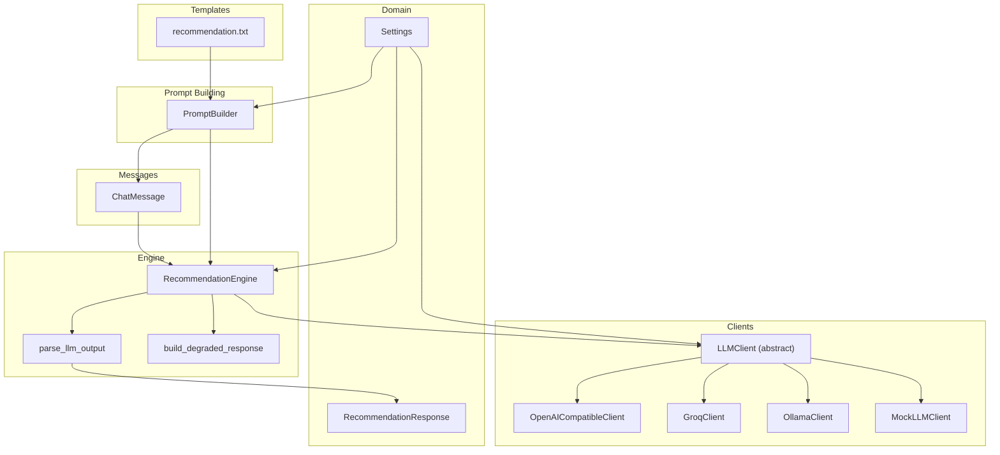
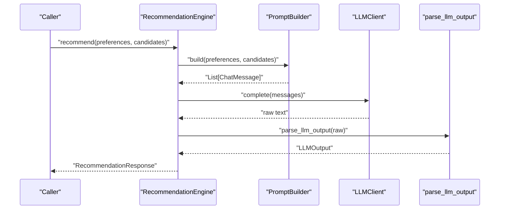
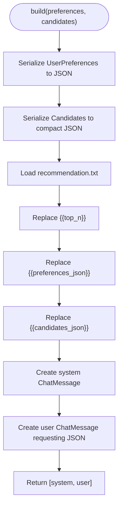
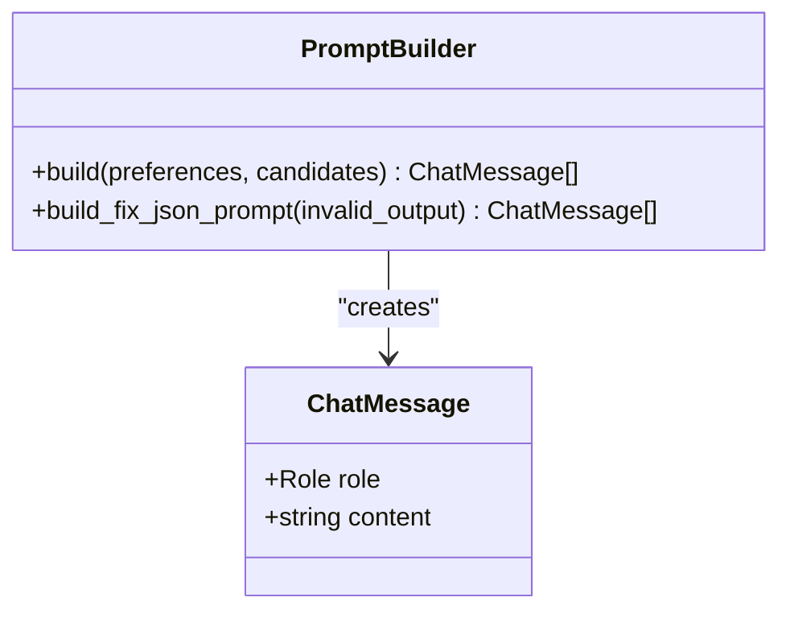
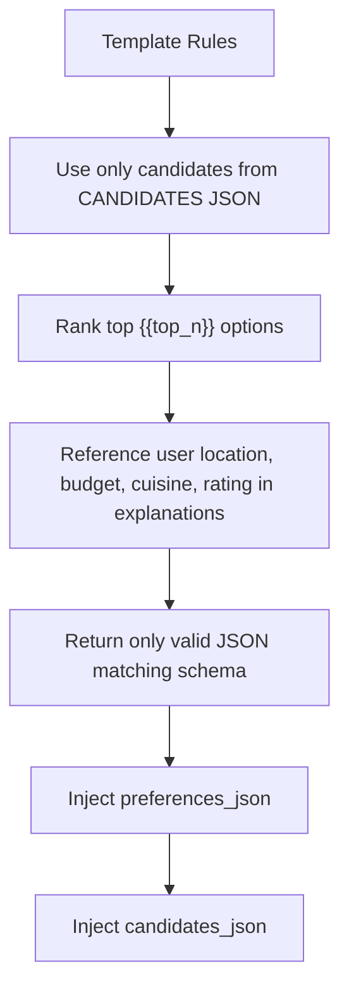
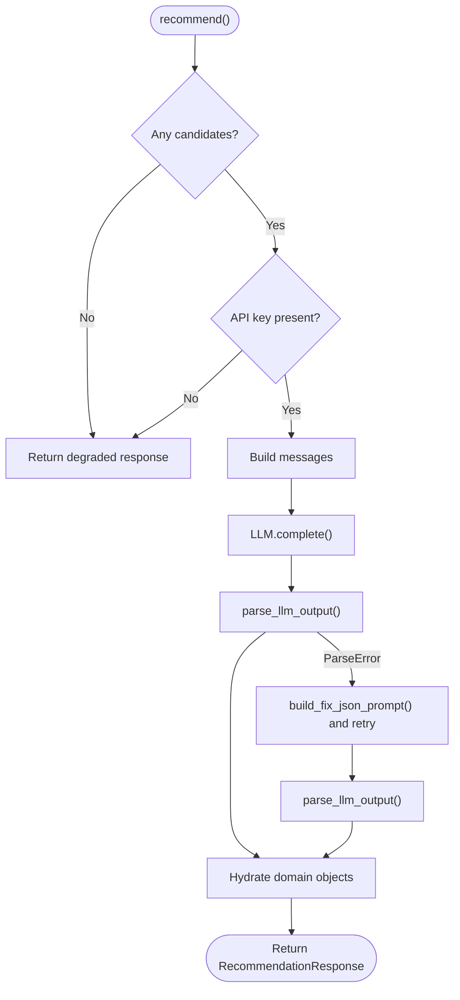
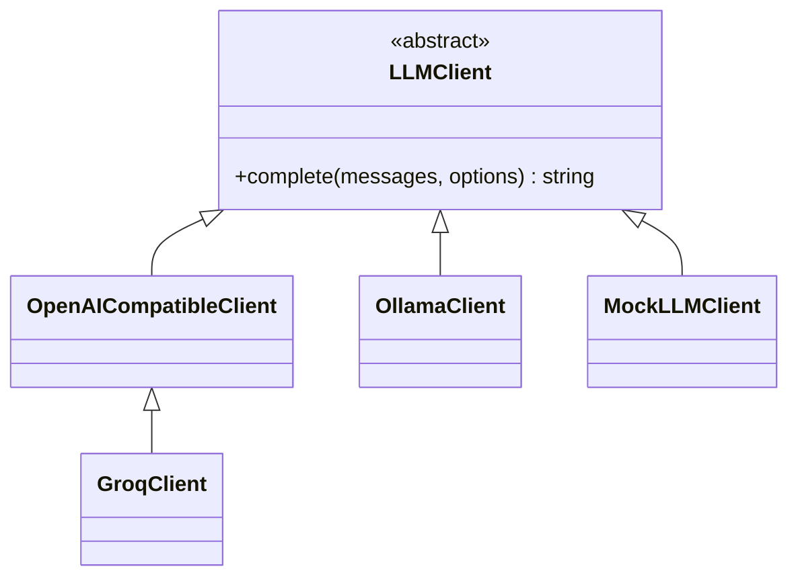
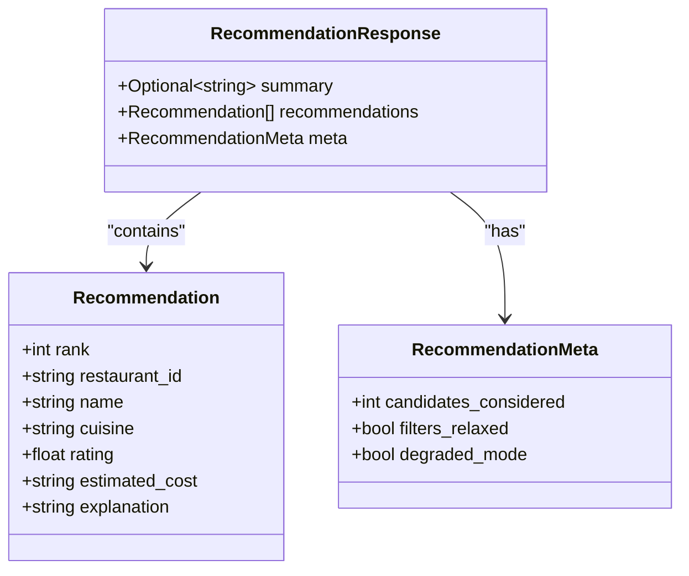
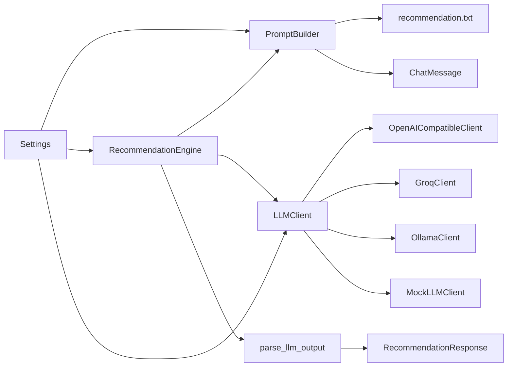

# Prompt Engineering & Templates

<cite>
**Referenced Files in This Document**
- [prompt_builder.py](file://src/llm/prompt_builder.py)
- [recommendation.txt](file://src/llm/templates/recommendation.txt)
- [messages.py](file://src/llm/messages.py)
- [engine.py](file://src/llm/engine.py)
- [parser.py](file://src/llm/parser.py)
- [degraded.py](file://src/llm/degraded.py)
- [client.py](file://src/llm/client.py)
- [openai_client.py](file://src/llm/openai_client.py)
- [ollama_client.py](file://src/llm/ollama_client.py)
- [groq_client.py](file://src/llm/groq_client.py)
- [mock_client.py](file://src/llm/mock_client.py)
- [config.py](file://src/config.py)
- [recommendation.py](file://src/domain/recommendation.py)
- [test_llm_prompt_builder.py](file://tests/test_llm_prompt_builder.py)
</cite>

## Table of Contents
1. [Introduction](#introduction)
2. [Project Structure](#project-structure)
3. [Core Components](#core-components)
4. [Architecture Overview](#architecture-overview)
5. [Detailed Component Analysis](#detailed-component-analysis)
6. [Dependency Analysis](#dependency-analysis)
7. [Performance Considerations](#performance-considerations)
8. [Troubleshooting Guide](#troubleshooting-guide)
9. [Conclusion](#conclusion)
10. [Appendices](#appendices)

## Introduction
This document explains the prompt engineering and template management architecture used by the recommendation system. It focuses on how contextual prompts are constructed from user preferences and filtered candidates, how multi-turn messages are built and preserved, and how the recommendation template enforces formatting, instruction clarity, and output constraints. It also covers prompt optimization strategies, customization options, dynamic content injection, best practices for clarity and bias mitigation, performance tuning, and operational safeguards such as degraded mode, validation, and logging.

## Project Structure
The prompt engineering and template system spans several modules:
- Template definition and prompt construction
- Message types and multi-turn conversation support
- LLM client abstraction and providers
- Engine orchestration, parsing, and fallback behavior
- Configuration and runtime settings

**Diagram sources**
- [recommendation.txt:1-24](file://src/llm/templates/recommendation.txt#L1-L24)
- [prompt_builder.py:45-90](file://src/llm/prompt_builder.py#L45-L90)
- [messages.py:11-22](file://src/llm/messages.py#L11-L22)
- [engine.py:29-191](file://src/llm/engine.py#L29-L191)
- [parser.py:36-46](file://src/llm/parser.py#L36-L46)
- [degraded.py:34-67](file://src/llm/degraded.py#L34-L67)
- [client.py:15-64](file://src/llm/client.py#L15-L64)
- [openai_client.py:17-66](file://src/llm/openai_client.py#L17-L66)
- [groq_client.py:24-29](file://src/llm/groq_client.py#L24-L29)
- [ollama_client.py:17-56](file://src/llm/ollama_client.py#L17-L56)
- [mock_client.py:11-67](file://src/llm/mock_client.py#L11-L67)
- [recommendation.py:24-28](file://src/domain/recommendation.py#L24-L28)
- [config.py:46-81](file://src/config.py#L46-L81)

**Section sources**
- [prompt_builder.py:1-91](file://src/llm/prompt_builder.py#L1-L91)
- [recommendation.txt:1-24](file://src/llm/templates/recommendation.txt#L1-L24)
- [messages.py:1-22](file://src/llm/messages.py#L1-L22)
- [engine.py:1-191](file://src/llm/engine.py#L1-L191)
- [parser.py:1-46](file://src/llm/parser.py#L1-L46)
- [degraded.py:1-67](file://src/llm/degraded.py#L1-L67)
- [client.py:1-64](file://src/llm/client.py#L1-L64)
- [openai_client.py:1-66](file://src/llm/openai_client.py#L1-L66)
- [ollama_client.py:1-56](file://src/llm/ollama_client.py#L1-L56)
- [groq_client.py:1-29](file://src/llm/groq_client.py#L1-L29)
- [mock_client.py:1-67](file://src/llm/mock_client.py#L1-L67)
- [config.py:1-81](file://src/config.py#L1-L81)
- [recommendation.py:1-28](file://src/domain/recommendation.py#L1-L28)

## Core Components
- PromptBuilder: Loads the recommendation template, serializes preferences and candidates, injects dynamic values, and produces a system message plus a user instruction to return JSON.
- Recommendation template: Defines strict rules, schema expectations, and content placeholders for preferences and candidates.
- ChatMessage: Lightweight data structure representing roles and content for multi-turn conversations.
- RecommendationEngine: Orchestrates prompt creation, LLM invocation, response parsing, hydration into domain objects, and fallback to degraded mode.
- Parser: Validates and parses LLM output into a strongly-typed schema, with markdown fence stripping and robust error handling.
- Degraded mode: Provides deterministic, preference-aware recommendations when LLM is unavailable or fails.
- LLM clients: Abstractions for multiple providers (OpenAI-compatible, Groq, Ollama, Mock), with standardized error types and completion options.
- Configuration: Centralized settings controlling provider selection, model, token limits, timeouts, and logging.

**Section sources**
- [prompt_builder.py:45-90](file://src/llm/prompt_builder.py#L45-L90)
- [recommendation.txt:1-24](file://src/llm/templates/recommendation.txt#L1-L24)
- [messages.py:11-22](file://src/llm/messages.py#L11-L22)
- [engine.py:29-191](file://src/llm/engine.py#L29-L191)
- [parser.py:36-46](file://src/llm/parser.py#L36-L46)
- [degraded.py:34-67](file://src/llm/degraded.py#L34-L67)
- [client.py:15-64](file://src/llm/client.py#L15-L64)
- [config.py:46-81](file://src/config.py#L46-L81)

## Architecture Overview
The system follows a clean separation of concerns:
- Templates define the instruction and schema.
- PromptBuilder injects structured data into the template.
- RecommendationEngine composes messages and coordinates LLM calls.
- Parser validates and converts raw text into typed recommendations.
- Degraded mode ensures resilience when LLM calls fail.
- Clients encapsulate provider-specific logic behind a unified interface.

**Diagram sources**
- [engine.py:45-118](file://src/llm/engine.py#L45-L118)
- [prompt_builder.py:50-77](file://src/llm/prompt_builder.py#L50-L77)
- [client.py:15-27](file://src/llm/client.py#L15-L27)
- [parser.py:36-46](file://src/llm/parser.py#L36-L46)

## Detailed Component Analysis

### PromptBuilder and Template Management
- Template loading: The builder reads a single, centralized template file and performs placeholder substitution with runtime values.
- Dynamic injection:
  - top_n is injected from configuration.
  - Preferences and candidates are serialized to JSON and injected into the template.
- Output composition:
  - System message: Contains the template with injected data and rules.
  - User message: Requests ranked results and JSON-only output.
- Validation hook:
  - A secondary prompt is generated to fix invalid JSON, guiding the model to conform to the expected schema.

**Diagram sources**
- [prompt_builder.py:50-77](file://src/llm/prompt_builder.py#L50-L77)
- [recommendation.txt:5-24](file://src/llm/templates/recommendation.txt#L5-L24)

**Section sources**
- [prompt_builder.py:17-90](file://src/llm/prompt_builder.py#L17-L90)
- [recommendation.txt:1-24](file://src/llm/templates/recommendation.txt#L1-L24)

### Message Construction and Multi-Turn Context Preservation
- ChatMessage defines role and content, enabling explicit system/user/assistant turns.
- The builder emits exactly two messages: a system instruction and a user request for JSON.
- Context preservation:
  - The system message embeds all necessary context (preferences, candidates, rules).
  - The user message anchors the desired output format.
- This minimal multi-turn design reduces ambiguity while ensuring the model has sufficient context.

**Diagram sources**
- [messages.py:11-22](file://src/llm/messages.py#L11-L22)
- [prompt_builder.py:50-90](file://src/llm/prompt_builder.py#L50-L90)

**Section sources**
- [messages.py:1-22](file://src/llm/messages.py#L1-L22)
- [prompt_builder.py:50-90](file://src/llm/prompt_builder.py#L50-L90)

### Recommendation Template Structure and Output Constraints
- Instruction clarity:
  - Explicitly instructs the model to use only provided candidates and to rank top N.
  - Requires explanations to reference user’s location, budget, cuisine, and rating when relevant.
- Output constraints:
  - Enforces a strict JSON schema with summary and recommendations array.
  - Disallows markdown or extra text; only raw JSON is acceptable.
- Placeholders:
  - {{top_n}}, {{preferences_json}}, {{candidates_json}} are dynamically substituted.

**Diagram sources**
- [recommendation.txt:3-17](file://src/llm/templates/recommendation.txt#L3-L17)

**Section sources**
- [recommendation.txt:1-24](file://src/llm/templates/recommendation.txt#L1-L24)

### RecommendationEngine Orchestration, Parsing, and Fallback
- Orchestration:
  - Builds messages, invokes the LLM client, logs exchanges when enabled, parses output, and hydrates domain objects.
- Robustness:
  - Handles missing API keys by entering degraded mode.
  - Catches LLM errors and schema validation failures, attempting a single retry with a JSON-fix prompt.
- Hydration:
  - Matches returned restaurant IDs to candidates, deduplicates, truncates to top N, and fills formatted fields.
  - Falls back to degraded mode if parsing yields no recommendations.

**Diagram sources**
- [engine.py:45-118](file://src/llm/engine.py#L45-L118)
- [parser.py:36-46](file://src/llm/parser.py#L36-L46)
- [degraded.py:34-67](file://src/llm/degraded.py#L34-L67)

**Section sources**
- [engine.py:29-191](file://src/llm/engine.py#L29-L191)
- [parser.py:1-46](file://src/llm/parser.py#L1-L46)
- [degraded.py:1-67](file://src/llm/degraded.py#L1-L67)

### LLM Client Abstraction and Providers
- Abstraction:
  - LLMClient defines a single method to produce raw text completions.
  - create_llm_client selects provider based on configuration, with fallback behavior.
- Providers:
  - OpenAI-compatible client supports configurable base URL, model, and timeouts.
  - Groq client applies provider-specific defaults for base URL and model.
  - Ollama client targets a local endpoint with streaming disabled.
  - Mock client returns deterministic JSON for testing and offline development.

**Diagram sources**
- [client.py:15-64](file://src/llm/client.py#L15-L64)
- [openai_client.py:17-66](file://src/llm/openai_client.py#L17-L66)
- [groq_client.py:24-29](file://src/llm/groq_client.py#L24-L29)
- [ollama_client.py:17-56](file://src/llm/ollama_client.py#L17-L56)
- [mock_client.py:11-67](file://src/llm/mock_client.py#L11-L67)

**Section sources**
- [client.py:1-64](file://src/llm/client.py#L1-L64)
- [openai_client.py:1-66](file://src/llm/openai_client.py#L1-L66)
- [groq_client.py:1-29](file://src/llm/groq_client.py#L1-L29)
- [ollama_client.py:1-56](file://src/llm/ollama_client.py#L1-L56)
- [mock_client.py:1-67](file://src/llm/mock_client.py#L1-L67)

### Domain Models and Response Formatting
- RecommendationResponse aggregates summary, recommendations, and metadata.
- RecommendationMeta tracks counts and flags for observability.
- The engine hydrates recommendations, formats cuisines and costs, and ensures explanations are present.

**Diagram sources**
- [recommendation.py:8-28](file://src/domain/recommendation.py#L8-L28)

**Section sources**
- [recommendation.py:1-28](file://src/domain/recommendation.py#L1-L28)
- [engine.py:120-173](file://src/llm/engine.py#L120-L173)

### Configuration and Runtime Controls
- Settings govern provider selection, model, token limits, timeouts, and logging.
- Top-N results and other behaviors are controlled centrally, influencing prompt injection and downstream formatting.

**Section sources**
- [config.py:46-81](file://src/config.py#L46-L81)
- [prompt_builder.py:46-67](file://src/llm/prompt_builder.py#L46-L67)
- [engine.py:30-43](file://src/llm/engine.py#L30-L43)

## Dependency Analysis
The following diagram highlights key dependencies among prompt-building, engine orchestration, parsing, and clients.

**Diagram sources**
- [prompt_builder.py:45-90](file://src/llm/prompt_builder.py#L45-L90)
- [recommendation.txt:1-24](file://src/llm/templates/recommendation.txt#L1-L24)
- [messages.py:11-22](file://src/llm/messages.py#L11-L22)
- [engine.py:29-191](file://src/llm/engine.py#L29-L191)
- [parser.py:36-46](file://src/llm/parser.py#L36-L46)
- [recommendation.py:24-28](file://src/domain/recommendation.py#L24-L28)
- [client.py:37-63](file://src/llm/client.py#L37-L63)
- [openai_client.py:17-66](file://src/llm/openai_client.py#L17-L66)
- [groq_client.py:24-29](file://src/llm/groq_client.py#L24-L29)
- [ollama_client.py:17-56](file://src/llm/ollama_client.py#L17-L56)
- [mock_client.py:11-67](file://src/llm/mock_client.py#L11-L67)
- [config.py:46-81](file://src/config.py#L46-L81)

**Section sources**
- [engine.py:29-191](file://src/llm/engine.py#L29-L191)
- [prompt_builder.py:45-90](file://src/llm/prompt_builder.py#L45-L90)
- [client.py:15-64](file://src/llm/client.py#L15-L64)
- [parser.py:36-46](file://src/llm/parser.py#L36-L46)
- [recommendation.py:24-28](file://src/domain/recommendation.py#L24-L28)
- [config.py:46-81](file://src/config.py#L46-L81)

## Performance Considerations
- Token efficiency:
  - Keep templates concise and avoid redundant context.
  - Limit top_n to reduce token usage; adjust via configuration.
- Provider selection:
  - Choose providers aligned with latency and cost targets; configure base URLs and models accordingly.
- Timeout and retries:
  - Tune llm_timeout_seconds and handle retries gracefully to minimize user-facing delays.
- Logging overhead:
  - Enable llm_log_prompts judiciously; logs can grow quickly in production.
- Degraded mode:
  - Acts as a fast, deterministic fallback when LLM calls are slow or unavailable.

[No sources needed since this section provides general guidance]

## Troubleshooting Guide
Common issues and remedies:
- Empty or malformed JSON:
  - The engine attempts a single retry with a dedicated JSON-fix prompt.
  - Ensure the template enforces strict JSON schema and disallows markdown.
- LLM errors or timeouts:
  - The engine falls back to degraded mode and logs warnings.
  - Verify API keys, base URLs, and network connectivity.
- Hallucinations or invalid restaurant IDs:
  - The engine drops IDs not present in candidates and deduplicates entries.
  - Strengthen template rules to emphasize using only provided candidates.
- Schema mismatches:
  - The parser validates against a strict schema; ensure the model adheres to the expected structure.
- Debugging:
  - Enable prompt logging to inspect exchanged messages and raw responses.

**Section sources**
- [engine.py:78-107](file://src/llm/engine.py#L78-L107)
- [parser.py:36-46](file://src/llm/parser.py#L36-L46)
- [degraded.py:34-67](file://src/llm/degraded.py#L34-L67)
- [config.py:69-71](file://src/config.py#L69-L71)

## Conclusion
The system’s prompt engineering and template management center on a strict, schema-driven template and a builder that injects precise, compact context. The engine orchestrates robust parsing, resilient fallbacks, and deterministic formatting, while configuration controls provider behavior and performance characteristics. Together, these components deliver clear, consistent, and reliable recommendations with strong safeguards against common pitfalls.

[No sources needed since this section summarizes without analyzing specific files]

## Appendices

### Best Practices for Prompt Clarity and Bias Mitigation
- Clarity:
  - Use explicit rules and schema constraints in the template.
  - Anchor requests with unambiguous instructions (e.g., “return JSON only”).
- Bias mitigation:
  - Avoid leading the model toward specific candidates; rely solely on provided candidates.
  - Encourage explanations that reference user preferences rather than stereotypes.
- Output discipline:
  - Enforce schema compliance and reject markdown or extra text.

[No sources needed since this section provides general guidance]

### Template Customization Options and Dynamic Content Injection
- Customization:
  - Adjust template rules and placeholders to reflect product goals.
  - Modify top_n via configuration to balance relevance and performance.
- Injection:
  - Preferences and candidates are serialized compactly to reduce token overhead.
  - The builder replaces placeholders atomically to prevent leakage or duplication.

**Section sources**
- [prompt_builder.py:46-67](file://src/llm/prompt_builder.py#L46-L67)
- [recommendation.txt:5-24](file://src/llm/templates/recommendation.txt#L5-L24)

### Example Prompt Design Patterns
- Minimal multi-turn: One system instruction embedding all context, one user request for JSON.
- Strict schema enforcement: Template defines the exact JSON shape and rejects deviations.
- Preference-centric explanations: Require references to location, budget, cuisine, and rating.

**Section sources**
- [prompt_builder.py:50-77](file://src/llm/prompt_builder.py#L50-L77)
- [recommendation.txt:6-17](file://src/llm/templates/recommendation.txt#L6-L17)

### Validation and Testing
- Unit tests validate that the builder includes preferences and candidate IDs in the system prompt.
- Mock client enables deterministic testing and offline development.

**Section sources**
- [test_llm_prompt_builder.py:7-26](file://tests/test_llm_prompt_builder.py#L7-L26)
- [mock_client.py:19-67](file://src/llm/mock_client.py#L19-L67)