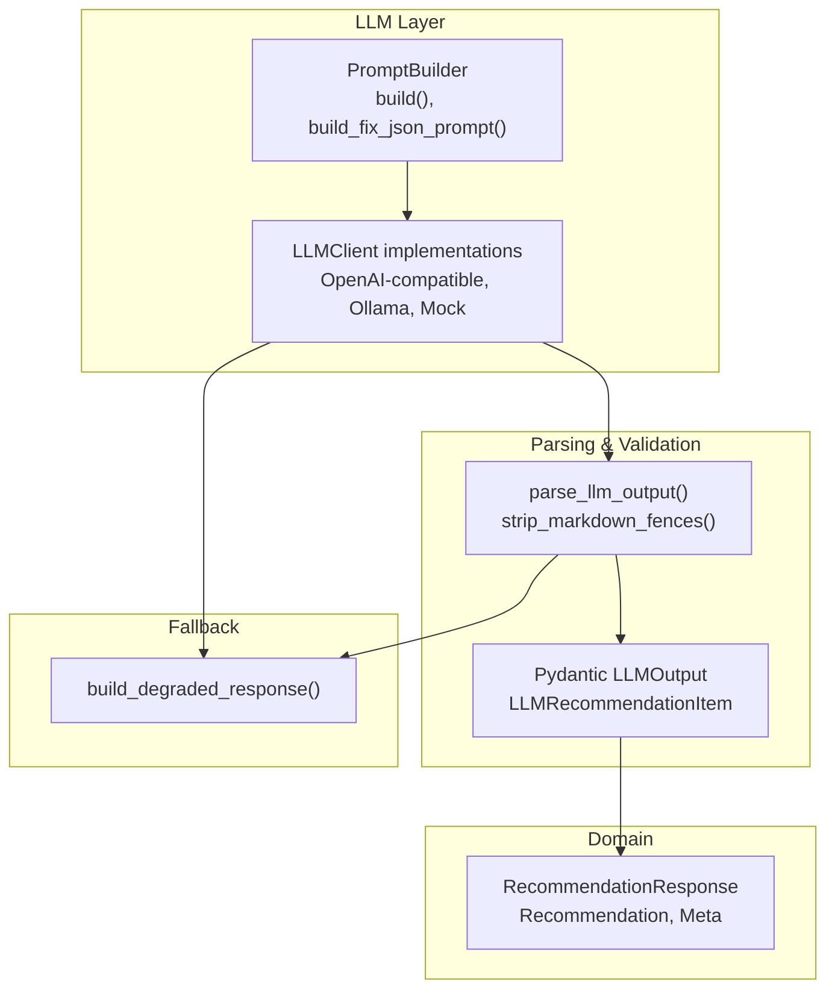
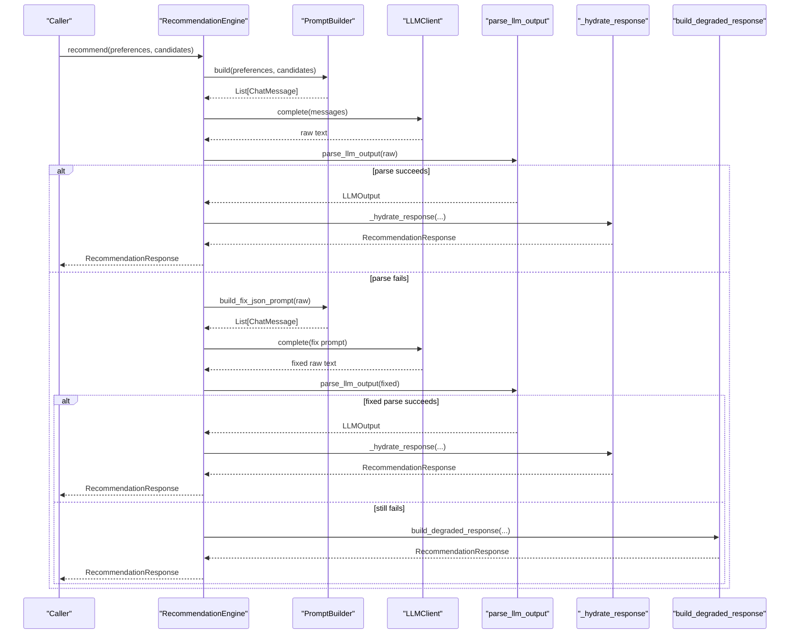
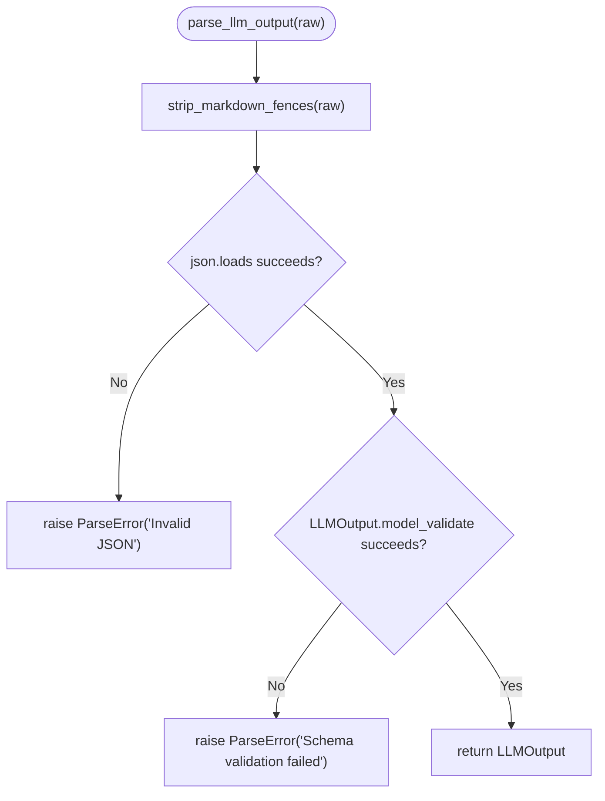
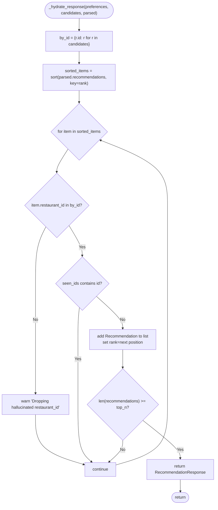
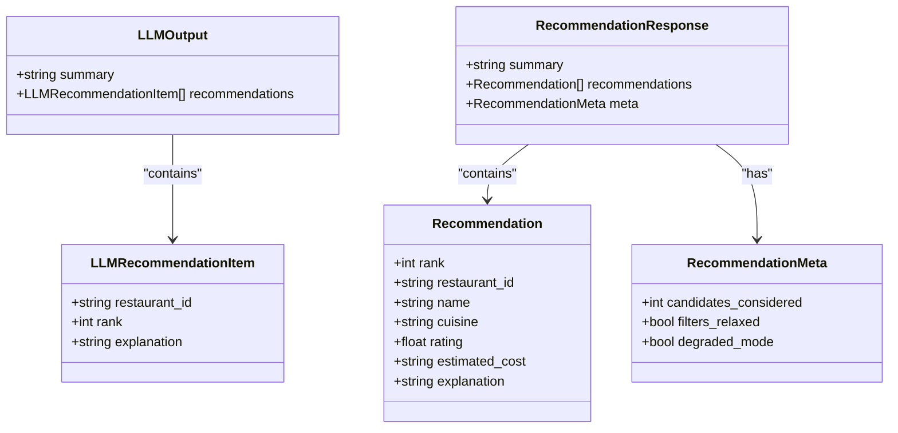
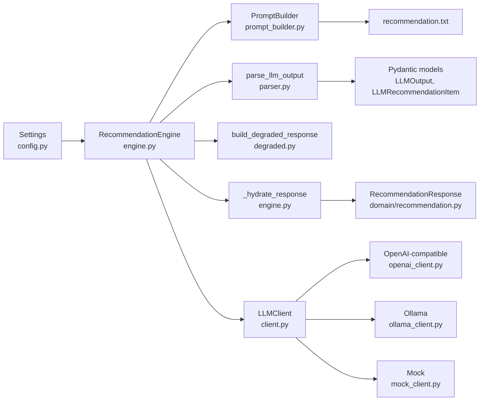

# Response Parsing & Validation

<cite>
**Referenced Files in This Document**
- [parser.py](file://src/llm/parser.py)
- [engine.py](file://src/llm/engine.py)
- [prompt_builder.py](file://src/llm/prompt_builder.py)
- [recommendation.txt](file://src/llm/templates/recommendation.txt)
- [recommendation.py](file://src/domain/recommendation.py)
- [degraded.py](file://src/llm/degraded.py)
- [client.py](file://src/llm/client.py)
- [openai_client.py](file://src/llm/openai_client.py)
- [ollama_client.py](file://src/llm/ollama_client.py)
- [mock_client.py](file://src/llm/mock_client.py)
- [messages.py](file://src/llm/messages.py)
- [config.py](file://src/config.py)
- [test_llm_parser.py](file://tests/test_llm_parser.py)
- [test_llm_engine.py](file://tests/test_llm_engine.py)
</cite>

## Table of Contents
1. [Introduction](#introduction)
2. [Project Structure](#project-structure)
3. [Core Components](#core-components)
4. [Architecture Overview](#architecture-overview)
5. [Detailed Component Analysis](#detailed-component-analysis)
6. [Dependency Analysis](#dependency-analysis)
7. [Performance Considerations](#performance-considerations)
8. [Troubleshooting Guide](#troubleshooting-guide)
9. [Conclusion](#conclusion)
10. [Appendices](#appendices)

## Introduction
This document explains the LLM response parsing and validation mechanisms used to extract structured recommendations from raw LLM outputs. It covers:
- How raw LLM text is transformed into validated, structured data
- Validation rules ensuring format consistency, schema correctness, and business compliance
- Error handling for malformed responses, parsing failures, and edge cases
- Recommendation extraction, including restaurant ID mapping, ranking validation, and explanation parsing
- Performance optimization, memory management, and retry strategies
- Practical examples and troubleshooting guidance

## Project Structure
The parsing and validation logic spans several modules:
- Parser: Defines Pydantic models and parsing/validation routines
- Engine: Orchestrates prompting, LLM calls, parsing, and response hydration
- Prompt builder: Generates system/user prompts with strict JSON schema instructions
- Degraded mode: Provides fallback recommendations when LLM parsing fails
- Clients: Abstractions for different LLM providers
- Domain models: Strongly typed response models returned to callers

**Diagram sources**
- [prompt_builder.py:50-90](file://src/llm/prompt_builder.py#L50-L90)
- [openai_client.py:25-65](file://src/llm/openai_client.py#L25-L65)
- [ollama_client.py:22-55](file://src/llm/ollama_client.py#L22-L55)
- [mock_client.py:19-66](file://src/llm/mock_client.py#L19-L66)
- [parser.py:36-45](file://src/llm/parser.py#L36-L45)
- [recommendation.py:24-27](file://src/domain/recommendation.py#L24-L27)
- [degraded.py:34-66](file://src/llm/degraded.py#L34-L66)

**Section sources**
- [parser.py:1-46](file://src/llm/parser.py#L1-L46)
- [engine.py:1-191](file://src/llm/engine.py#L1-L191)
- [prompt_builder.py:1-91](file://src/llm/prompt_builder.py#L1-L91)
- [recommendation.py:1-28](file://src/domain/recommendation.py#L1-L28)
- [degraded.py:1-67](file://src/llm/degraded.py#L1-L67)
- [client.py:1-64](file://src/llm/client.py#L1-L64)
- [openai_client.py:1-66](file://src/llm/openai_client.py#L1-L66)
- [ollama_client.py:1-56](file://src/llm/ollama_client.py#L1-L56)
- [mock_client.py:1-67](file://src/llm/mock_client.py#L1-L67)
- [messages.py:1-22](file://src/llm/messages.py#L1-L22)
- [config.py:1-81](file://src/config.py#L1-L81)

## Core Components
- Response parser and validator
  - Strips optional Markdown code fences around JSON
  - Parses JSON and validates against Pydantic models
  - Raises a dedicated ParseError on failure
- Structured models
  - LLMOutput: top-level container with optional summary and recommendations list
  - LLMRecommendationItem: individual recommendation with restaurant_id, rank, explanation
- Recommendation engine
  - Builds prompts with strict schema instructions
  - Calls LLM client, parses output, hydrates domain response
  - Implements robust error handling and fallback to degraded mode
- Degraded mode
  - Produces basic ranked recommendations when LLM is unavailable or response is invalid
- Clients
  - Unified interface for multiple providers with consistent error types

**Section sources**
- [parser.py:14-45](file://src/llm/parser.py#L14-L45)
- [engine.py:29-118](file://src/llm/engine.py#L29-L118)
- [degraded.py:34-66](file://src/llm/degraded.py#L34-L66)
- [client.py:15-63](file://src/llm/client.py#L15-L63)

## Architecture Overview
End-to-end flow from preferences and candidates to a validated, hydrated recommendation response:

**Diagram sources**
- [engine.py:45-118](file://src/llm/engine.py#L45-L118)
- [prompt_builder.py:50-90](file://src/llm/prompt_builder.py#L50-L90)
- [parser.py:36-45](file://src/llm/parser.py#L36-L45)
- [degraded.py:34-66](file://src/llm/degraded.py#L34-L66)

## Detailed Component Analysis

### Parser and Validation
Responsibilities:
- Remove Markdown code fences to isolate JSON
- Parse JSON and validate against Pydantic models
- Enforce schema correctness and type safety
- Raise ParseError for invalid inputs or schema violations

Key behaviors:
- Fence stripping supports fenced JSON blocks commonly returned by LLMs
- JSON decoding and Pydantic validation are combined to ensure robustness
- ParseError is raised for both malformed JSON and schema mismatches

Validation rules:
- Top-level keys: summary (optional string), recommendations (array of items)
- Each recommendation item requires:
  - restaurant_id: string present and mapped to a candidate
  - rank: integer, used for ordering
  - explanation: string, optional but filled with a default if empty

**Diagram sources**
- [parser.py:29-45](file://src/llm/parser.py#L29-L45)

**Section sources**
- [parser.py:14-45](file://src/llm/parser.py#L14-L45)
- [test_llm_parser.py:8-43](file://tests/test_llm_parser.py#L8-L43)

### Recommendation Extraction and Hydration
Responsibilities:
- Map parsed restaurant IDs to actual candidates
- Validate ranks and remove duplicates
- Drop hallucinated IDs not present in candidates
- Build final RecommendationResponse with formatted fields

Processing logic:
- Sort recommendations by rank
- Deduplicate by restaurant_id
- Filter out IDs not found among candidates
- Limit to top N results based on settings
- Fill explanation with parsed text or a default message
- Set meta flags indicating degraded mode and filters relaxation

**Diagram sources**
- [engine.py:120-173](file://src/llm/engine.py#L120-L173)

**Section sources**
- [engine.py:120-173](file://src/llm/engine.py#L120-L173)
- [recommendation.py:8-27](file://src/domain/recommendation.py#L8-L27)

### Prompt Builder and Schema Enforcement
Responsibilities:
- Serialize user preferences and candidate restaurants into compact JSON
- Inject serialized data into a system template that enforces:
  - Strict JSON schema in the output
  - No markdown or extra text
  - Use only provided candidates
  - Ranking instructions and explanation requirements
- Provide a fix prompt to recover from invalid JSON

Key elements:
- Template instructs the model to return JSON only and adhere to the schema
- Fix prompt asks the model to correct the JSON to match the expected schema

**Section sources**
- [prompt_builder.py:17-90](file://src/llm/prompt_builder.py#L17-L90)
- [recommendation.txt:3-17](file://src/llm/templates/recommendation.txt#L3-L17)

### Degraded Mode Fallback
Responsibilities:
- Produce a basic ranked list when LLM is unavailable or response is invalid
- Format cuisines and costs consistently
- Generate explanations based on preferences and restaurant attributes

Behavior:
- Selects up to top N candidates
- Uses a template explanation incorporating location, budget, and rating criteria
- Marks meta as degraded_mode=True

**Section sources**
- [degraded.py:34-66](file://src/llm/degraded.py#L34-L66)
- [engine.py:64-72](file://src/llm/engine.py#L64-L72)

### LLM Clients and Error Handling
Responsibilities:
- Provide a unified interface for different providers
- Convert provider-specific errors into common LLMError/LLMTimeoutError/LLMAuthError
- Support timeouts and provider-specific defaults

Provider specifics:
- OpenAI-compatible clients apply provider defaults when base URL/model are unspecified
- Ollama client handles HTTP timeouts and empty responses
- Mock client generates deterministic valid JSON for testing

**Section sources**
- [client.py:15-63](file://src/llm/client.py#L15-L63)
- [openai_client.py:17-65](file://src/llm/openai_client.py#L17-L65)
- [ollama_client.py:17-55](file://src/llm/ollama_client.py#L17-L55)
- [mock_client.py:11-66](file://src/llm/mock_client.py#L11-L66)

### Class Model: Pydantic Schemas

**Diagram sources**
- [parser.py:14-23](file://src/llm/parser.py#L14-L23)
- [recommendation.py:8-27](file://src/domain/recommendation.py#L8-L27)

## Dependency Analysis
High-level dependencies among parsing and validation components:

**Diagram sources**
- [config.py:46-80](file://src/config.py#L46-L80)
- [engine.py:29-118](file://src/llm/engine.py#L29-L118)
- [prompt_builder.py:45-77](file://src/llm/prompt_builder.py#L45-L77)
- [parser.py:36-45](file://src/llm/parser.py#L36-L45)
- [degraded.py:34-66](file://src/llm/degraded.py#L34-L66)
- [recommendation.py:24-27](file://src/domain/recommendation.py#L24-L27)
- [client.py:37-63](file://src/llm/client.py#L37-L63)
- [openai_client.py:17-28](file://src/llm/openai_client.py#L17-L28)
- [ollama_client.py:17-32](file://src/llm/ollama_client.py#L17-L32)
- [mock_client.py:11-18](file://src/llm/mock_client.py#L11-L18)

**Section sources**
- [engine.py:1-191](file://src/llm/engine.py#L1-L191)
- [parser.py:1-46](file://src/llm/parser.py#L1-L46)
- [prompt_builder.py:1-91](file://src/llm/prompt_builder.py#L1-L91)
- [recommendation.py:1-28](file://src/domain/recommendation.py#L1-L28)
- [degraded.py:1-67](file://src/llm/degraded.py#L1-L67)
- [client.py:1-64](file://src/llm/client.py#L1-L64)
- [openai_client.py:1-66](file://src/llm/openai_client.py#L1-L66)
- [ollama_client.py:1-56](file://src/llm/ollama_client.py#L1-L56)
- [mock_client.py:1-67](file://src/llm/mock_client.py#L1-L67)
- [config.py:1-81](file://src/config.py#L1-L81)

## Performance Considerations
- Parsing overhead
  - Single-pass JSON decode followed by Pydantic validation
  - Minimal allocations: string fence stripping and direct JSON load
- Memory management
  - Recommendations list grows linearly with top_n results
  - Candidate lookup via dictionary for O(1) ID checks
- Batch processing
  - The engine processes a single recommendation request per call
  - To scale, invoke multiple requests concurrently with thread/process pools
- Retry strategy
  - One automatic retry with a fix prompt reduces repeated failures
- Logging
  - Optional prompt/response logs can be enabled for diagnostics at the cost of disk I/O

[No sources needed since this section provides general guidance]

## Troubleshooting Guide
Common issues and resolutions:
- Invalid JSON or schema mismatch
  - Symptom: ParseError raised during parsing
  - Action: Ensure the model returns JSON only and adheres to the schema; rely on the fix prompt retry
- Empty or missing LLM response
  - Symptom: LLMError with empty content
  - Action: Verify credentials and endpoint; enable degraded mode fallback
- Hallucinated restaurant IDs
  - Symptom: Recommendations filtered out with warnings
  - Action: Confirm candidates list includes all referenced IDs; avoid instructing the model to invent new restaurants
- Timeout or authentication errors
  - Symptom: LLMTimeoutError or LLMAuthError
  - Action: Adjust timeouts, check API keys, and provider defaults
- Degraded mode activation
  - Symptom: Basic ranked results with degraded_mode=True
  - Action: Supply a valid LLM API key or improve prompt clarity

Operational tips:
- Enable prompt logging for debugging exchanges when llm_log_prompts is true
- Use the mock client for deterministic testing and rapid iteration
- Validate schema adherence in the system template and fix prompt

**Section sources**
- [parser.py:25-45](file://src/llm/parser.py#L25-L45)
- [engine.py:78-107](file://src/llm/engine.py#L78-L107)
- [openai_client.py:55-65](file://src/llm/openai_client.py#L55-L65)
- [ollama_client.py:47-55](file://src/llm/ollama_client.py#L47-L55)
- [degraded.py:34-66](file://src/llm/degraded.py#L34-L66)
- [config.py:68-70](file://src/config.py#L68-L70)
- [mock_client.py:19-66](file://src/llm/mock_client.py#L19-L66)

## Conclusion
The parsing and validation pipeline ensures robust, structured recommendations from LLM outputs:
- Strict schema enforcement via Pydantic
- Resilient parsing with fenced JSON support and automatic retries
- Clear fallback to degraded mode for reliability
- Efficient extraction and deduplication of recommendations
- Extensible client architecture supporting multiple providers

[No sources needed since this section summarizes without analyzing specific files]

## Appendices

### Successful Parsing Workflow Examples
- Valid JSON with fenced markers
  - Demonstrated by tests that strip fences and parse successfully
- Schema-compliant response
  - Tests confirm correct handling of summary and recommendations arrays
- Degraded mode triggered by invalid JSON
  - Engine falls back to basic ranking when parsing fails

**Section sources**
- [test_llm_parser.py:8-38](file://tests/test_llm_parser.py#L8-L38)
- [test_llm_engine.py:23-98](file://tests/test_llm_engine.py#L23-L98)