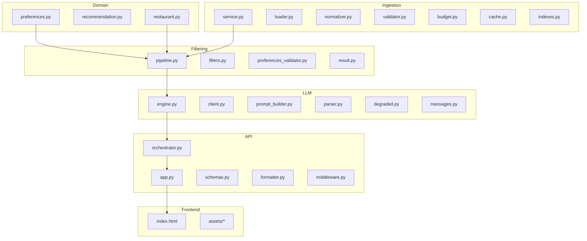
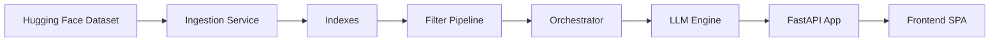
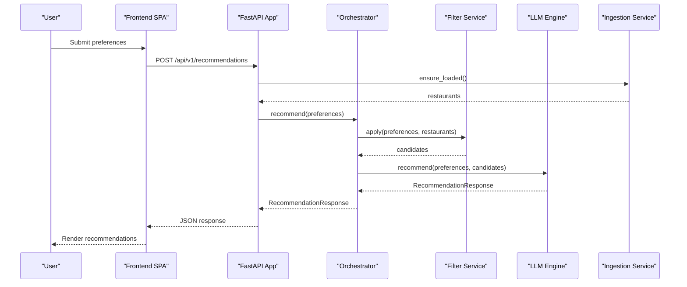
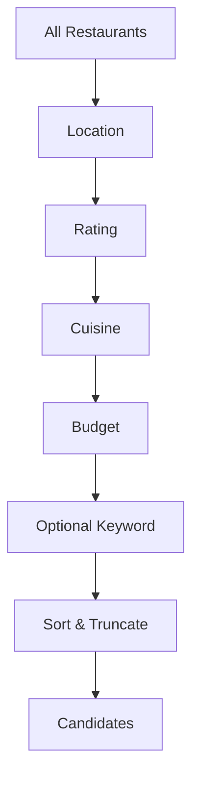
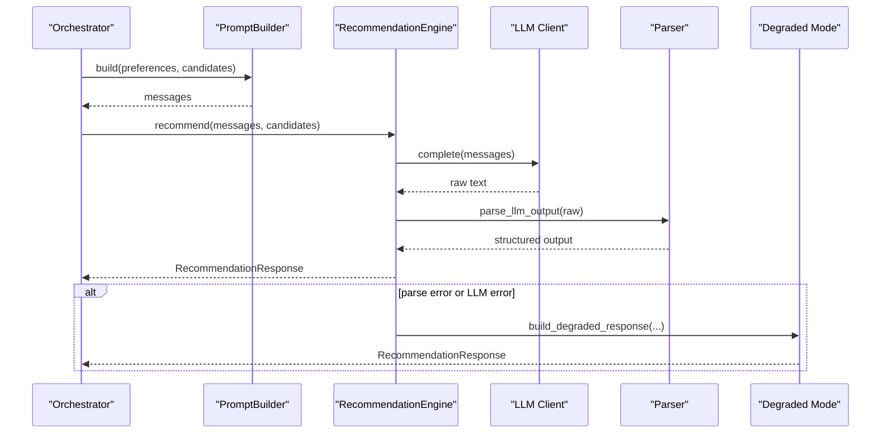
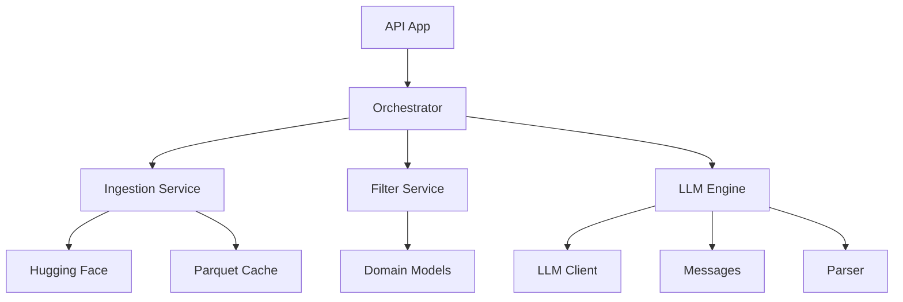

# Project Overview

<cite>
**Referenced Files in This Document**
- [README.md](file://README.md)
- [docs/context.md](file://docs/context.md)
- [docs/architecture.md](file://docs/architecture.md)
- [src/config.py](file://src/config.py)
- [src/api/app.py](file://src/api/app.py)
- [src/api/orchestrator.py](file://src/api/orchestrator.py)
- [src/domain/preferences.py](file://src/domain/preferences.py)
- [src/filtering/pipeline.py](file://src/filtering/pipeline.py)
- [src/llm/engine.py](file://src/llm/engine.py)
- [src/ingestion/service.py](file://src/ingestion/service.py)
- [src/frontend/index.html](file://src/frontend/index.html)
- [requirements.txt](file://requirements.txt)
</cite>

## Table of Contents
1. [Introduction](#introduction)
2. [Project Structure](#project-structure)
3. [Core Components](#core-components)
4. [Architecture Overview](#architecture-overview)
5. [Detailed Component Analysis](#detailed-component-analysis)
6. [Dependency Analysis](#dependency-analysis)
7. [Performance Considerations](#performance-considerations)
8. [Troubleshooting Guide](#troubleshooting-guide)
9. [Conclusion](#conclusion)

## Introduction
This document presents a comprehensive overview of the Zomato AI Restaurant Recommendation System. The project is an AI-powered recommendation platform inspired by Zomato, combining a real-world restaurant dataset with a Large Language Model (LLM) to deliver personalized, transparent, and efficient restaurant suggestions. The system emphasizes deterministic filtering to constrain the candidate set, followed by LLM-driven ranking and explanation to meet user preferences.

Key goals:
- Personalization: Recommendations reflect user-stated preferences.
- Transparency: Each suggestion includes an explanation tied to preference fields.
- Accuracy: Factual attributes are grounded in the dataset; the LLM reasons over a bounded set.
- Efficiency: Controlled LLM cost and latency via pre-filtering and caching.
- Maintainability and extensibility: Clear separation of concerns across layers.

## Project Structure
The repository is organized into layered modules aligned with the end-to-end workflow:
- Domain: Core models for preferences, restaurants, and recommendations.
- Ingestion: Dataset loading, normalization, validation, budget band assignment, caching, and indexing.
- Filtering: Deterministic pipeline to reduce the dataset to a small candidate set.
- LLM: Prompt building, LLM invocation, response parsing, and fallback handling.
- API: FastAPI application, orchestration, and endpoints.
- Frontend: Static SPA for user interaction.
- Tests: Unit and integration tests.

**Diagram sources**
- [src/api/app.py:1-254](file://src/api/app.py#L1-L254)
- [src/api/orchestrator.py:1-99](file://src/api/orchestrator.py#L1-L99)
- [src/filtering/pipeline.py:1-204](file://src/filtering/pipeline.py#L1-L204)
- [src/llm/engine.py:1-191](file://src/llm/engine.py#L1-L191)
- [src/ingestion/service.py:1-162](file://src/ingestion/service.py#L1-L162)
- [src/frontend/index.html:1-230](file://src/frontend/index.html#L1-L230)

**Section sources**
- [README.md:120-132](file://README.md#L120-L132)
- [docs/architecture.md:654-690](file://docs/architecture.md#L654-L690)

## Core Components
- Configuration: Centralized settings for dataset ID, cache path, LLM provider, model, token limits, and defaults.
- API Application: FastAPI app with lifecycle hooks to load data, wire services, and expose endpoints.
- Orchestration: Single entry point that coordinates ingestion, filtering, and LLM recommendation.
- Domain Models: Strongly typed preferences, restaurants, and recommendation responses.
- Filtering Pipeline: Deterministic, configurable filters with progressive relaxation.
- LLM Engine: Structured prompt assembly, LLM invocation, robust parsing, and degraded mode fallback.
- Ingestion Service: Load from Hugging Face, normalize, validate, assign budget bands, cache, and index.
- Frontend: SPA with forms, loading states, results rendering, and empty/error handling.

**Section sources**
- [src/config.py:1-66](file://src/config.py#L1-L66)
- [src/api/app.py:1-254](file://src/api/app.py#L1-L254)
- [src/api/orchestrator.py:1-99](file://src/api/orchestrator.py#L1-L99)
- [src/domain/preferences.py:1-29](file://src/domain/preferences.py#L1-L29)
- [src/filtering/pipeline.py:1-204](file://src/filtering/pipeline.py#L1-L204)
- [src/llm/engine.py:1-191](file://src/llm/engine.py#L1-L191)
- [src/ingestion/service.py:1-162](file://src/ingestion/service.py#L1-L162)
- [src/frontend/index.html:1-230](file://src/frontend/index.html#L1-L230)

## Architecture Overview
The system follows a layered pipeline:
- Data Ingestion: Load and cache the Zomato dataset; build indexes for fast filtering.
- User Input: Collect and validate preferences (location, budget, cuisine, rating, additional preferences).
- Deterministic Filtering: Produce a small candidate set using structured rules and progressive relaxation.
- LLM Integration: Build a constrained prompt, call the LLM, parse structured output, and hydrate results.
- Presentation: Render recommendations with explanations and metadata.

**Diagram sources**
- [docs/architecture.md:56-70](file://docs/architecture.md#L56-L70)
- [src/ingestion/service.py:80-162](file://src/ingestion/service.py#L80-L162)
- [src/filtering/pipeline.py:42-103](file://src/filtering/pipeline.py#L42-L103)
- [src/api/orchestrator.py:45-99](file://src/api/orchestrator.py#L45-L99)
- [src/llm/engine.py:45-118](file://src/llm/engine.py#L45-L118)
- [src/api/app.py:137-243](file://src/api/app.py#L137-L243)
- [src/frontend/index.html:1-230](file://src/frontend/index.html#L1-L230)

## Detailed Component Analysis

### Problem Statement and Solution Approach
- Problem: Deliver personalized restaurant recommendations grounded in real data while maintaining transparency and efficiency.
- Solution: Combine structured filtering with LLM ranking and explanation. The dataset is the single source of truth; the LLM reasons over a bounded candidate set and produces ranked results with explanations.

**Section sources**
- [docs/ProbelmStatement.txt:1-38](file://docs/ProbelmStatement.txt#L1-L38)
- [docs/context.md:7-21](file://docs/context.md#L7-L21)

### System Context and User Interaction
- End users submit preferences via the web UI or API.
- The API orchestrates ingestion, filtering, and LLM recommendation.
- Responses include ranked recommendations with explanations and metadata.

**Diagram sources**
- [src/api/app.py:211-243](file://src/api/app.py#L211-L243)
- [src/api/orchestrator.py:45-99](file://src/api/orchestrator.py#L45-L99)
- [src/filtering/pipeline.py:42-103](file://src/filtering/pipeline.py#L42-L103)
- [src/llm/engine.py:45-118](file://src/llm/engine.py#L45-L118)
- [src/ingestion/service.py:80-115](file://src/ingestion/service.py#L80-L115)

### Configuration and Environment
- Settings define dataset ID, cache path, LLM provider/model/base URL, token limits, and defaults.
- Environment variables support provider selection and API keys.

**Section sources**
- [src/config.py:36-66](file://src/config.py#L36-L66)
- [README.md:52-61](file://README.md#L52-L61)

### API and Orchestration
- Lifecycle loads data and wires services before serving requests.
- Health endpoints expose readiness and dataset status.
- Endpoints:
  - GET /health: service status and dataset info
  - GET /health/ready: readiness probe
  - GET /api/v1/cities: known cities
  - POST /api/v1/candidates: deterministic filter only
  - POST /api/v1/recommendations: filter + LLM ranked results
- Frontend served statically at root.

**Section sources**
- [src/api/app.py:42-77](file://src/api/app.py#L42-L77)
- [src/api/app.py:137-254](file://src/api/app.py#L137-L254)
- [README.md:86-96](file://README.md#L86-L96)

### Filtering Pipeline
- Sequential deterministic filters: location, rating, cuisine, budget, optional keyword.
- Progressive relaxation: widen budget band, drop keyword, lower min rating, drop cuisine filter.
- Sorting and truncation to a configurable maximum candidate set.

**Diagram sources**
- [src/filtering/pipeline.py:105-130](file://src/filtering/pipeline.py#L105-L130)
- [src/filtering/pipeline.py:131-204](file://src/filtering/pipeline.py#L131-L204)

**Section sources**
- [src/filtering/pipeline.py:31-103](file://src/filtering/pipeline.py#L31-L103)

### LLM Recommendation Engine
- Builds a structured prompt with user preferences and candidate subset.
- Calls the LLM client, parses JSON output, and hydrates full restaurant objects.
- Robust fallback to deterministic ranking when LLM fails or returns invalid output.
- Logs exchanges when enabled for observability.

**Diagram sources**
- [src/llm/engine.py:45-118](file://src/llm/engine.py#L45-L118)
- [src/llm/engine.py:120-173](file://src/llm/engine.py#L120-L173)

**Section sources**
- [src/llm/engine.py:29-118](file://src/llm/engine.py#L29-L118)

### Ingestion and Indexing
- Loads from Hugging Face, normalizes fields, validates rows, assigns budget bands, and caches to Parquet.
- Builds indexes for fast city-based filtering and known cities enumeration.
- Supports cold start and warm request patterns.

**Section sources**
- [src/ingestion/service.py:62-162](file://src/ingestion/service.py#L62-L162)
- [README.md:21-41](file://README.md#L21-L41)

### Domain Models
- UserPreferences: Strongly typed preferences with validation.
- RecommendationResponse: Top-N ranked items with explanations and metadata.

**Section sources**
- [src/domain/preferences.py:15-29](file://src/domain/preferences.py#L15-L29)

### Frontend Overview
- SPA with form fields for location, budget, cuisine, min rating, and additional preferences.
- States: welcome, loading, results, empty, error.
- Displays summary, meta chips, and recommendation cards with explanations.

**Section sources**
- [src/frontend/index.html:1-230](file://src/frontend/index.html#L1-L230)

## Dependency Analysis
High-level dependencies across layers:
- API depends on ingestion, filtering, and LLM engine.
- Filtering depends on domain models and ingestion index.
- LLM engine depends on prompt builder, parser, and client.
- Ingestion depends on dataset loaders, validators, and cache.

**Diagram sources**
- [src/api/app.py:15-31](file://src/api/app.py#L15-L31)
- [src/api/orchestrator.py:30-44](file://src/api/orchestrator.py#L30-L44)
- [src/filtering/pipeline.py:9-23](file://src/filtering/pipeline.py#L9-L23)
- [src/llm/engine.py:12-24](file://src/llm/engine.py#L12-L24)
- [src/ingestion/service.py:10-17](file://src/ingestion/service.py#L10-L17)

**Section sources**
- [requirements.txt:1-12](file://requirements.txt#L1-L12)

## Performance Considerations
- Cold start: First-time load from Hugging Face plus normalization and caching; subsequent requests are fast.
- Filter performance target: Under 200 ms on cached data.
- LLM round-trip: Typical under 5 seconds depending on model and prompt size.
- Candidate cap: MAX_CANDIDATES controls prompt size and cost.
- Token limits: Configurable max tokens and temperature for consistency.

**Section sources**
- [docs/architecture.md:644-651](file://docs/architecture.md#L644-L651)
- [src/config.py:45-58](file://src/config.py#L45-L58)

## Troubleshooting Guide
Common issues and remedies:
- Service not ready: Use readiness probe endpoint; wait for dataset load.
- Validation errors: Ensure required fields and constraints are met.
- LLM failures: Degraded mode returns deterministic rankings; check API key and provider settings.
- Empty results: Broaden filters; UI provides suggestions and CTAs.
- Network or provider issues: Verify environment variables and connectivity.

Operational endpoints:
- GET /health: service status, dataset info, and LLM provider/model.
- GET /health/ready: 503 until data is loaded.
- GET /api/v1/cities: known cities for selection.

**Section sources**
- [src/api/app.py:137-156](file://src/api/app.py#L137-L156)
- [README.md:63-77](file://README.md#L63-L77)

## Conclusion
The Zomato AI Restaurant Recommendation System integrates structured filtering with LLM ranking to deliver personalized, transparent, and efficient restaurant suggestions. By constraining the candidate set deterministically and leveraging the LLM for ranking and explanation, the system balances accuracy, cost, and user experience. The layered architecture ensures maintainability, scalability, and clear separation of concerns across ingestion, filtering, LLM integration, API orchestration, and presentation.