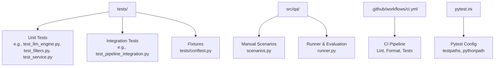
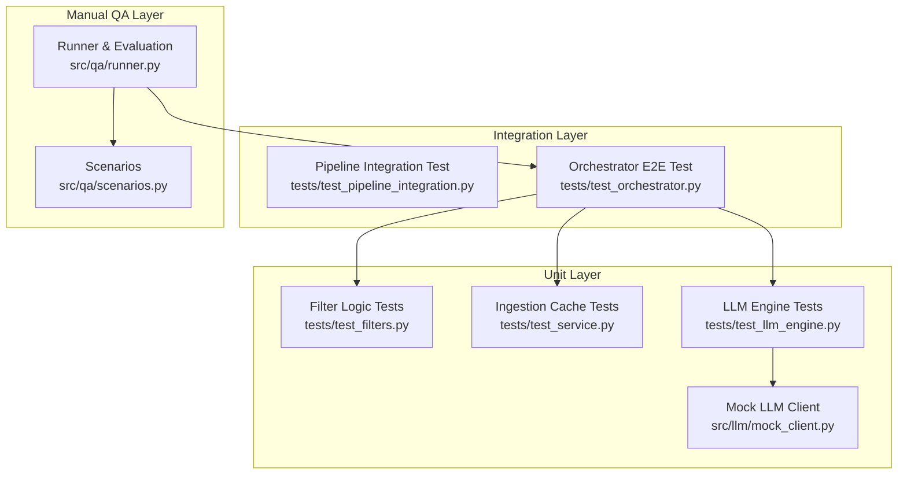
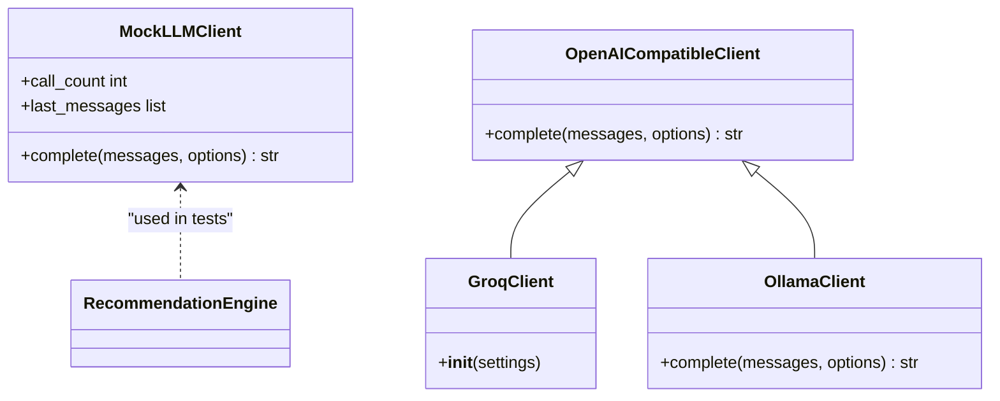
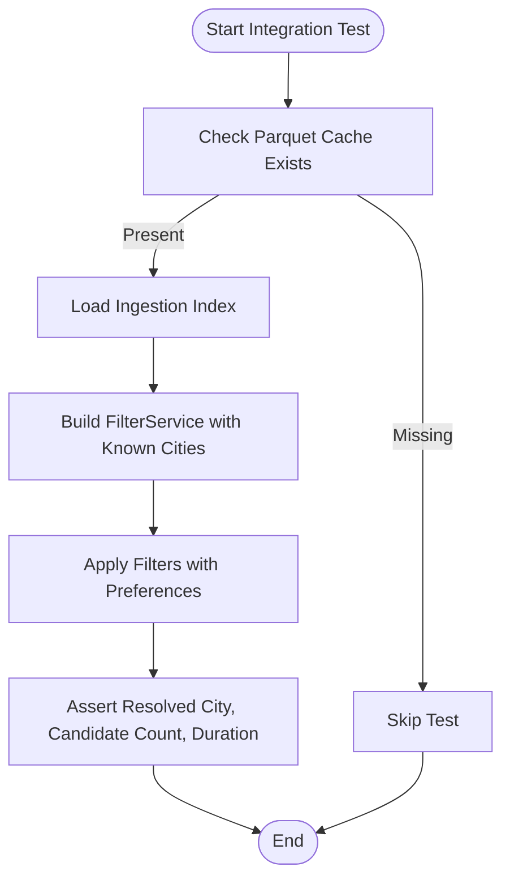
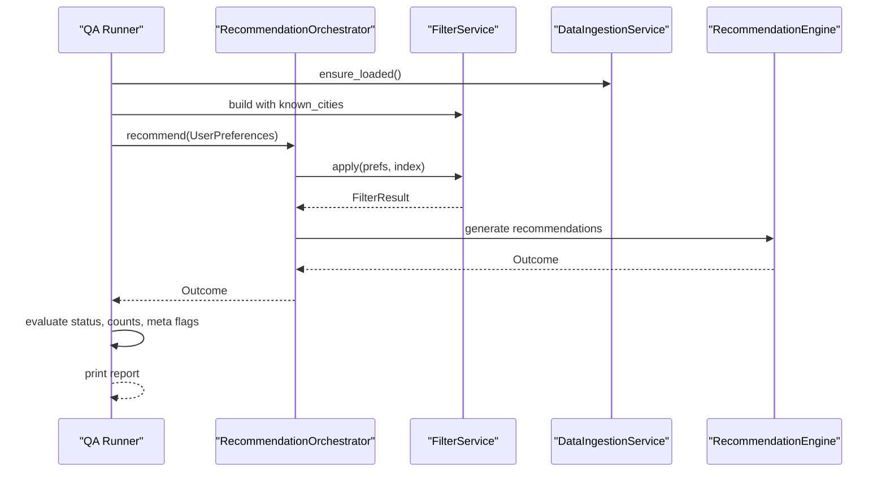
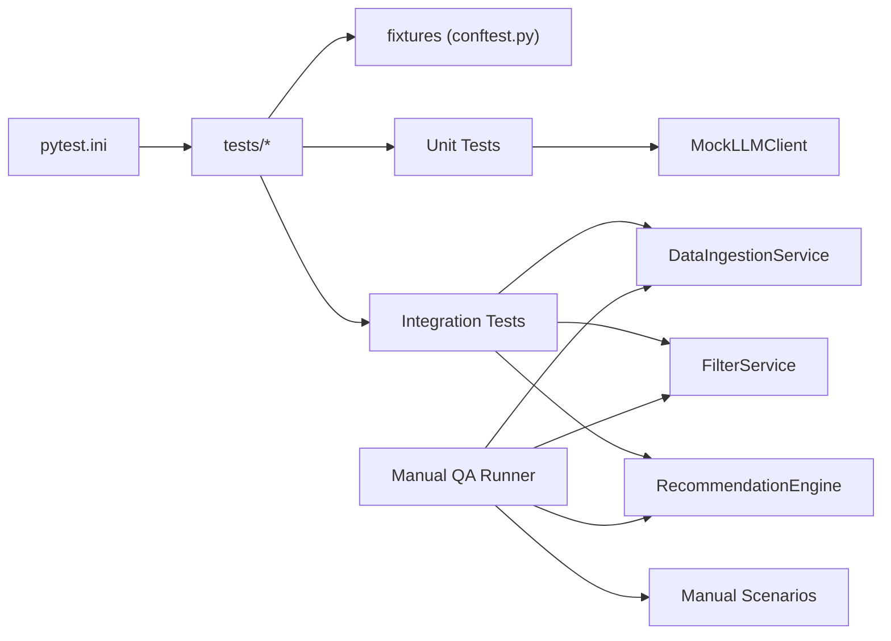

# Testing Strategy

<cite>
**Referenced Files in This Document**
- [pytest.ini](file://pytest.ini)
- [.github/workflows/ci.yml](file://.github/workflows/ci.yml)
- [tests/conftest.py](file://tests/conftest.py)
- [src/qa/scenarios.py](file://src/qa/scenarios.py)
- [src/qa/runner.py](file://src/qa/runner.py)
- [tests/test_llm_engine.py](file://tests/test_llm_engine.py)
- [src/llm/mock_client.py](file://src/llm/mock_client.py)
- [tests/test_pipeline_integration.py](file://tests/test_pipeline_integration.py)
- [tests/test_orchestrator.py](file://tests/test_orchestrator.py)
- [tests/test_filters.py](file://tests/test_filters.py)
- [tests/test_service.py](file://tests/test_service.py)
- [src/llm/openai_client.py](file://src/llm/openai_client.py)
- [src/llm/groq_client.py](file://src/llm/groq_client.py)
- [src/llm/ollama_client.py](file://src/llm/ollama_client.py)
- [requirements.txt](file://requirements.txt)
</cite>

## Table of Contents
1. [Introduction](#introduction)
2. [Project Structure](#project-structure)
3. [Core Components](#core-components)
4. [Architecture Overview](#architecture-overview)
5. [Detailed Component Analysis](#detailed-component-analysis)
6. [Dependency Analysis](#dependency-analysis)
7. [Performance Considerations](#performance-considerations)
8. [Troubleshooting Guide](#troubleshooting-guide)
9. [Conclusion](#conclusion)
10. [Appendices](#appendices)

## Introduction
This document defines a comprehensive testing strategy for the recommendation system. It covers unit testing with pytest fixtures, integration testing with real datasets, manual QA procedures, edge-case and degradation-mode testing, performance baselines, test data management, environment setup, debugging techniques, and continuous integration workflows. The strategy emphasizes a layered testing pyramid, deterministic mocks for LLM providers, and robust validation of orchestration and filtering pipelines.

## Project Structure
The repository organizes tests under the tests/ directory and includes dedicated manual QA scripts under src/qa/. Continuous integration is configured via GitHub Actions. Pytest configuration centralizes test discovery and path resolution.

**Diagram sources**
- [pytest.ini:1-4](file://pytest.ini#L1-L4)
- [.github/workflows/ci.yml:1-38](file://.github/workflows/ci.yml#L1-L38)
- [tests/conftest.py:1-62](file://tests/conftest.py#L1-L62)
- [src/qa/scenarios.py:1-179](file://src/qa/scenarios.py#L1-L179)
- [src/qa/runner.py:1-390](file://src/qa/runner.py#L1-L390)

**Section sources**
- [pytest.ini:1-4](file://pytest.ini#L1-L4)
- [.github/workflows/ci.yml:1-38](file://.github/workflows/ci.yml#L1-L38)

## Core Components
- Unit tests validate isolated components such as filtering logic, ingestion caching, and LLM engine behavior with deterministic mocks.
- Integration tests exercise the filtering pipeline against cached datasets to ensure end-to-end performance and correctness.
- Manual QA scenarios define acceptance criteria for happy-path, edge-case, and degraded-mode behavior, validated both locally and via HTTP.
- Fixtures standardize reusable test data and preconditions across tests.

Key testing artifacts:
- Pytest fixtures for normalized and validated ingestion rows and budget band assignments.
- Mock LLM client enabling deterministic responses and call counting.
- Manual QA scenarios and runner for structured acceptance validation.

**Section sources**
- [tests/conftest.py:10-62](file://tests/conftest.py#L10-L62)
- [src/llm/mock_client.py:11-67](file://src/llm/mock_client.py#L11-L67)
- [src/qa/scenarios.py:9-179](file://src/qa/scenarios.py#L9-L179)
- [src/qa/runner.py:264-303](file://src/qa/runner.py#L264-L303)

## Architecture Overview
The testing architecture follows a layered pyramid:
- Unit layer: isolated logic tests with deterministic mocks.
- Integration layer: pipeline and orchestration tests using cached datasets.
- Manual QA layer: end-to-end acceptance scenarios with explicit pass/fail criteria.

**Diagram sources**
- [tests/test_filters.py:1-125](file://tests/test_filters.py#L1-L125)
- [tests/test_service.py:1-47](file://tests/test_service.py#L1-L47)
- [tests/test_llm_engine.py:1-106](file://tests/test_llm_engine.py#L1-L106)
- [src/llm/mock_client.py:11-67](file://src/llm/mock_client.py#L11-L67)
- [tests/test_pipeline_integration.py:1-46](file://tests/test_pipeline_integration.py#L1-L46)
- [tests/test_orchestrator.py:1-77](file://tests/test_orchestrator.py#L1-L77)
- [src/qa/scenarios.py:24-179](file://src/qa/scenarios.py#L24-L179)
- [src/qa/runner.py:305-331](file://src/qa/runner.py#L305-L331)

## Detailed Component Analysis

### Unit Testing with Pytest Fixtures
- Shared fixtures encapsulate realistic ingestion data:
  - Raw row normalization and validation fixtures.
  - Budget band assignment fixture for varied cost bands.
- Fixture usage ensures consistent, repeatable test inputs across ingestion, filtering, and engine tests.

Recommended patterns:
- Use fixtures to construct minimal, valid datasets.
- Prefer deterministic mocks for external LLM APIs.
- Keep assertions focused on observable outputs (counts, shapes, presence of keywords).

**Section sources**
- [tests/conftest.py:10-62](file://tests/conftest.py#L10-L62)

### Mocking Strategies for LLM Providers
- MockLLMClient returns configurable JSON responses and tracks call counts and last messages.
- OpenAI-compatible clients (OpenAI-compatible, Groq, Ollama) translate provider-specific errors into unified exceptions for robust test coverage.
- Engine tests validate behavior under valid JSON, invalid JSON, empty candidates, and degraded mode conditions.

**Diagram sources**
- [src/llm/mock_client.py:11-67](file://src/llm/mock_client.py#L11-L67)
- [src/llm/openai_client.py:17-66](file://src/llm/openai_client.py#L17-L66)
- [src/llm/groq_client.py:24-29](file://src/llm/groq_client.py#L24-L29)
- [src/llm/ollama_client.py:17-56](file://src/llm/ollama_client.py#L17-L56)

**Section sources**
- [tests/test_llm_engine.py:23-106](file://tests/test_llm_engine.py#L23-L106)
- [src/llm/mock_client.py:11-67](file://src/llm/mock_client.py#L11-L67)
- [src/llm/openai_client.py:17-66](file://src/llm/openai_client.py#L17-L66)
- [src/llm/groq_client.py:24-29](file://src/llm/groq_client.py#L24-L29)
- [src/llm/ollama_client.py:17-56](file://src/llm/ollama_client.py#L17-L56)

### Integration Testing Patterns
- Pipeline integration tests require cached datasets and skip when absent, ensuring reproducible performance baselines.
- Tests assert resolved city, candidate count bounds, and runtime thresholds to detect regressions.

**Diagram sources**
- [tests/test_pipeline_integration.py:15-46](file://tests/test_pipeline_integration.py#L15-L46)

**Section sources**
- [tests/test_pipeline_integration.py:15-46](file://tests/test_pipeline_integration.py#L15-L46)

### Quality Assurance Scenarios
Manual QA scenarios define acceptance criteria for:
- Happy path requests with specific preferences.
- Low/high budget and strict rating thresholds.
- Filter relaxation detection and degraded mode fallback.
- Endpoint-specific validations (recommendations vs. candidates).

The runner evaluates automated preconditions and prints a human-readable report, supporting manual verification of explanations and UI behavior.

**Diagram sources**
- [src/qa/runner.py:45-67](file://src/qa/runner.py#L45-L67)
- [src/qa/runner.py:71-172](file://src/qa/runner.py#L71-L172)
- [src/qa/runner.py:206-261](file://src/qa/runner.py#L206-L261)

**Section sources**
- [src/qa/scenarios.py:24-179](file://src/qa/scenarios.py#L24-L179)
- [src/qa/runner.py:305-331](file://src/qa/runner.py#L305-L331)
- [src/qa/runner.py:334-363](file://src/qa/runner.py#L334-L363)

### Edge Case Testing
Edge cases covered by unit and integration tests:
- Empty candidate sets.
- Invalid JSON from LLM clients.
- Missing API keys triggering degraded mode.
- Keyword filters soft-match and hard-narrow behavior.
- Budget band relaxation logic.

These are validated through targeted assertions and deterministic mocks.

**Section sources**
- [tests/test_llm_engine.py:55-106](file://tests/test_llm_engine.py#L55-L106)
- [tests/test_filters.py:97-125](file://tests/test_filters.py#L97-L125)

### End-to-End Orchestration Validation
The orchestrator end-to-end test constructs synthetic ingestion data, applies filters, and validates recommendation ordering and content presence. It demonstrates a complete flow using mocked LLM responses.

**Section sources**
- [tests/test_orchestrator.py:14-77](file://tests/test_orchestrator.py#L14-L77)

## Dependency Analysis
Testing relies on:
- Pytest for test discovery and execution.
- Pydantic for request validation in manual QA.
- httpx for HTTP-based QA scenarios.
- Provider clients abstract differences between Groq, OpenAI-compatible, and Ollama endpoints.

**Diagram sources**
- [pytest.ini:1-4](file://pytest.ini#L1-L4)
- [tests/conftest.py:10-62](file://tests/conftest.py#L10-L62)
- [src/llm/mock_client.py:11-67](file://src/llm/mock_client.py#L11-L67)
- [src/qa/runner.py:45-67](file://src/qa/runner.py#L45-L67)

**Section sources**
- [requirements.txt:1-13](file://requirements.txt#L1-L13)

## Performance Considerations
- Integration tests enforce a runtime threshold to catch regressions in filtering performance.
- Engine tests validate behavior under degraded mode to maintain responsiveness when LLMs are unavailable.
- Mock-based unit tests eliminate network variability, enabling fast, deterministic runs.

Recommendations:
- Track median and p95 durations for filtering and recommendation generation.
- Use fixtures to simulate larger candidate pools without external dependencies.
- Monitor CI performance trends to identify hotspots.

**Section sources**
- [tests/test_pipeline_integration.py:40-46](file://tests/test_pipeline_integration.py#L40-L46)
- [tests/test_llm_engine.py:76-98](file://tests/test_llm_engine.py#L76-L98)

## Troubleshooting Guide
Common issues and debugging techniques:
- Fixture failures: Verify normalized and validated rows meet expectations; inspect fixture chain and assertion outcomes.
- Mock misuse: Confirm MockLLMClient call_count and last_messages align with expectations; ensure deterministic responses.
- Integration cache missing: Build the parquet cache before running integration tests; tests skip gracefully otherwise.
- Manual QA mismatches: Review scenario expectations and runner evaluation logic; confirm meta flags and result counts.
- Provider errors: Inspect translated exceptions from OpenAI-compatible clients and ensure proper error propagation.

**Section sources**
- [tests/conftest.py:10-62](file://tests/conftest.py#L10-L62)
- [src/llm/mock_client.py:19-28](file://src/llm/mock_client.py#L19-L28)
- [tests/test_pipeline_integration.py:15-16](file://tests/test_pipeline_integration.py#L15-L16)
- [src/qa/runner.py:206-261](file://src/qa/runner.py#L206-L261)
- [src/llm/openai_client.py:55-65](file://src/llm/openai_client.py#L55-L65)

## Conclusion
The testing strategy leverages a robust testing pyramid: deterministic unit tests with mocks, integration tests against cached datasets, and manual QA scenarios for end-to-end validation. Continuous integration enforces linting, formatting, and test execution. Together, these practices ensure reliability, performance, and user-centric quality for the recommendation system.

## Appendices

### Testing Pyramid Implementation
- Unit: Filtering, ingestion caching, engine behavior with MockLLMClient.
- Integration: Pipeline application with cached data and performance bounds.
- Manual QA: Structured scenarios with automated pre-checks and manual verification.

**Section sources**
- [tests/test_filters.py:1-125](file://tests/test_filters.py#L1-L125)
- [tests/test_service.py:1-47](file://tests/test_service.py#L1-L47)
- [tests/test_llm_engine.py:1-106](file://tests/test_llm_engine.py#L1-L106)
- [tests/test_pipeline_integration.py:1-46](file://tests/test_pipeline_integration.py#L1-L46)
- [src/qa/scenarios.py:24-179](file://src/qa/scenarios.py#L24-L179)

### Coverage Requirements
- Target: High coverage for filtering logic, engine decision paths, and orchestration.
- Strategy: Use fixtures to exercise boundary conditions; mock external dependencies to isolate logic under test.

[No sources needed since this section provides general guidance]

### Continuous Integration Testing
- CI job installs dependencies, runs linter/format checks, and executes pytest.
- Configure environment variables for LLM providers as needed for manual QA runs.

**Section sources**
- [.github/workflows/ci.yml:22-37](file://.github/workflows/ci.yml#L22-L37)

### Test Data Management
- Use fixtures for synthetic ingestion data.
- Persist and reuse cached datasets for integration tests; skip when unavailable.
- Validate cache behavior and statistics in ingestion tests.

**Section sources**
- [tests/conftest.py:45-62](file://tests/conftest.py#L45-L62)
- [tests/test_service.py:26-47](file://tests/test_service.py#L26-L47)
- [tests/test_pipeline_integration.py:12-16](file://tests/test_pipeline_integration.py#L12-L16)

### Debugging Techniques for Test Failures
- Inspect fixture-generated data and assertions.
- Log and assert on MockLLMClient call_count and last_messages.
- Capture and log runner evaluation details for manual QA discrepancies.

**Section sources**
- [src/llm/mock_client.py:19-28](file://src/llm/mock_client.py#L19-L28)
- [src/qa/runner.py:334-363](file://src/qa/runner.py#L334-L363)