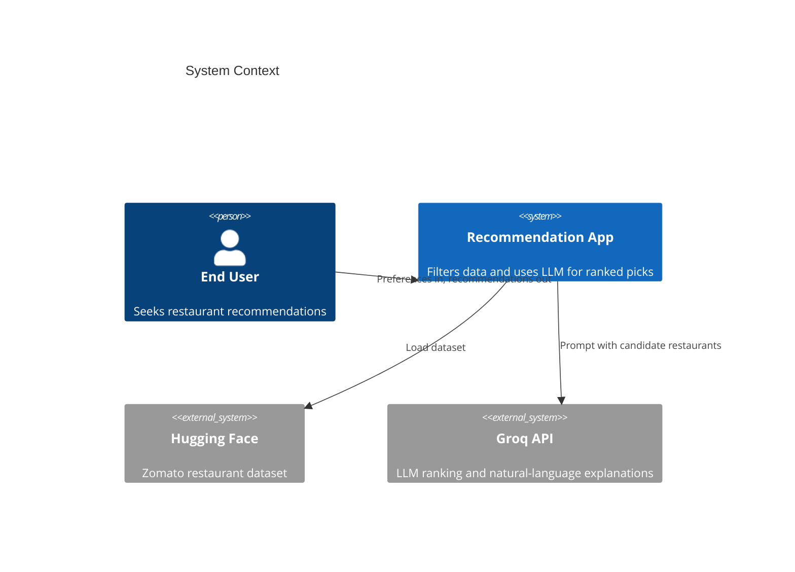
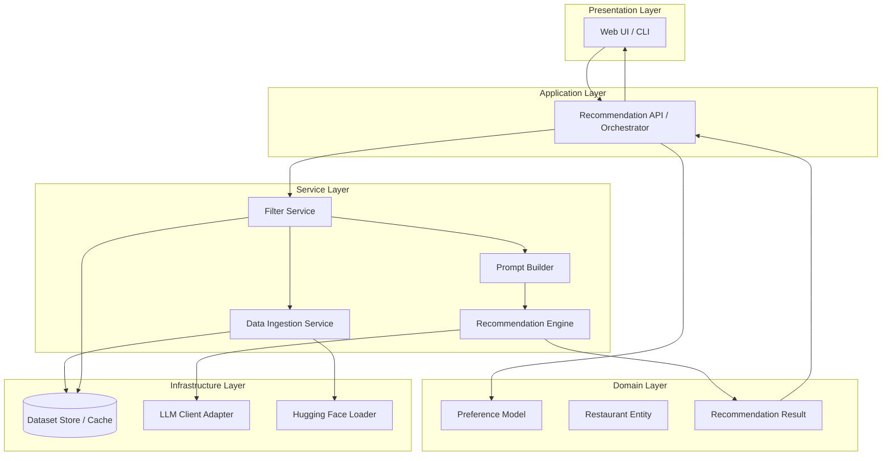
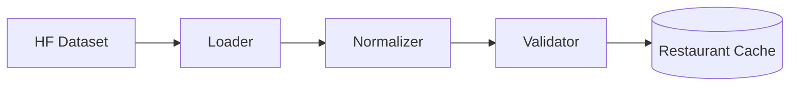
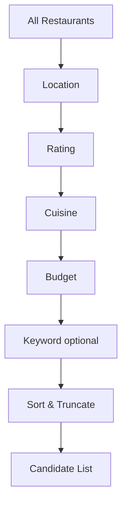
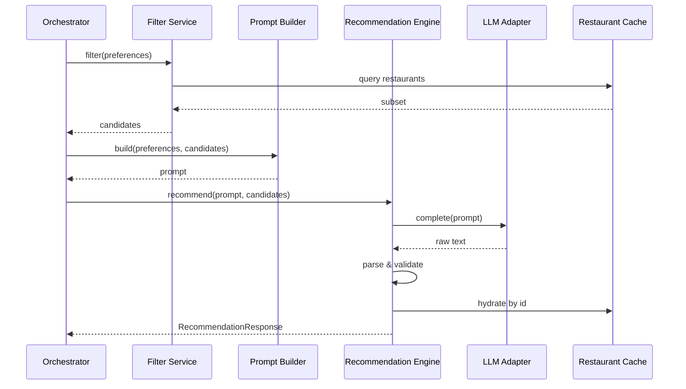
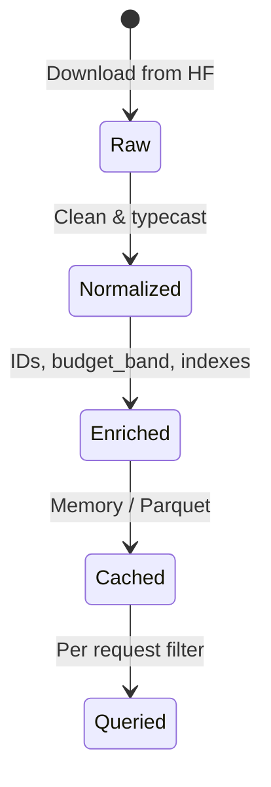
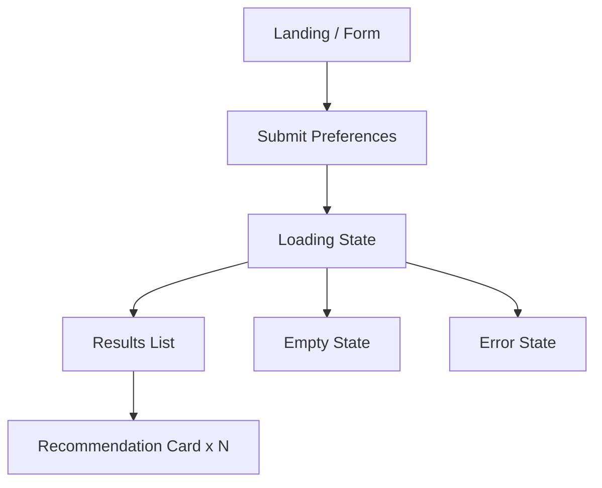
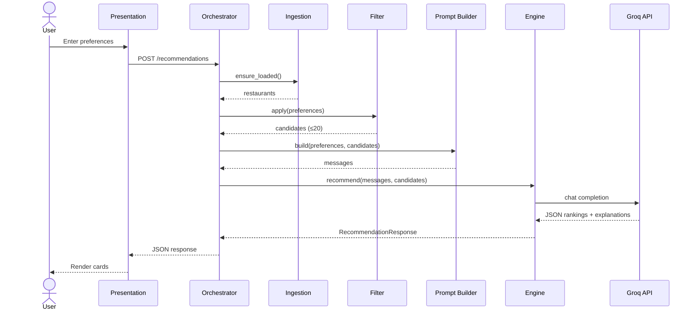
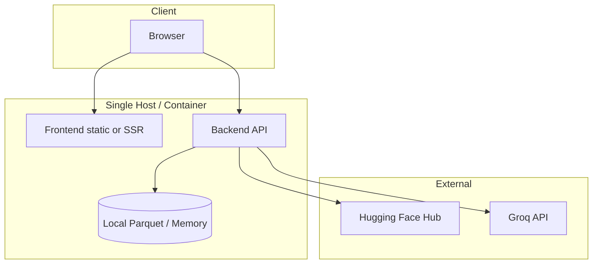

# System Architecture: AI-Powered Restaurant Recommendation System

This document defines the technical architecture for the Zomato-inspired restaurant recommendation application described in [`docs/context.md`](context.md). It translates product requirements into layers, components, data flows, interfaces, and operational concerns.

---

## Table of Contents

1. [Architecture Goals](#1-architecture-goals)
2. [System Context](#2-system-context)
3. [Logical Architecture](#3-logical-architecture)
4. [Component Design](#4-component-design)
5. [Data Architecture](#5-data-architecture)
6. [Integration Layer & LLM Design](#6-integration-layer--llm-design)
7. [API & Contracts](#7-api--contracts)
8. [Presentation Layer](#8-presentation-layer)
9. [End-to-End Flows](#9-end-to-end-flows)
10. [Deployment Architecture](#10-deployment-architecture)
11. [Cross-Cutting Concerns](#11-cross-cutting-concerns)
12. [Suggested Project Structure](#12-suggested-project-structure)
13. [Technology Options](#13-technology-options)
14. [Evolution & Extensions](#14-evolution--extensions)

---

## 1. Architecture Goals

| Goal | Description | How architecture supports it |
|------|-------------|------------------------------|
| **Personalization** | Recommendations reflect user-stated preferences | Structured pre-filter + LLM reasoning over preference-aware context |
| **Transparency** | Users understand *why* each restaurant was chosen | LLM returns per-item explanations mapped to preference fields |
| **Accuracy** | Suggestions grounded in real data | Dataset-backed records; LLM only ranks/explains pre-validated candidates |
| **Efficiency** | Low latency and controlled LLM cost | Narrow candidate set before LLM; cache dataset; limit tokens in prompt |
| **Maintainability** | Clear separation of concerns | Layered design: ingestion, domain, filter, prompt, LLM, presentation |
| **Extensibility** | Easy to add filters, models, or UI | Pluggable filters, prompt templates, and LLM provider abstraction |

### Architectural principles

1. **Structured data first** — The LLM reasons over a bounded, filtered subset of restaurants, not the full corpus.
2. **Single source of truth** — Restaurant facts (name, cuisine, rating, cost) come from the dataset; the LLM must not invent factual attributes.
3. **Fail gracefully** — If the LLM fails, return deterministic ranked results from structured filters with a degraded explanation message.
4. **Observable pipeline** — Log filter counts, prompt size, latency, and parse errors for debugging.

---

## 2. System Context

### Actors

| Actor | Role |
|-------|------|
| **End user** | Submits preferences; views ranked recommendations |
| **Hugging Face dataset** | External source of restaurant records |
| **LLM provider (Groq)** | External API — **[Groq](https://groq.com/)** for fast ranking and natural-language explanations (OpenAI-compatible Chat Completions API) |

### Context diagram



### Scope boundary

**In scope**

- Dataset load, preprocess, and in-memory or cached query
- Preference capture (UI or API)
- Rule-based filtering and candidate preparation
- LLM prompt construction, invocation, and response parsing
- Formatted output (name, cuisine, rating, cost, explanation)

**Out of scope (initial milestone)**

- User accounts, authentication, and saved history
- Real-time Zomato API integration
- Payments, reservations, or maps
- Training custom ML models on the dataset

---

## 3. Logical Architecture

The system is organized into **five horizontal layers** aligned with the workflow in `context.md`.



### Layer responsibilities

| Layer | Responsibility |
|-------|----------------|
| **Presentation** | Forms for preferences; renders recommendation cards |
| **Application** | Orchestrates request lifecycle; validates input; handles errors |
| **Domain** | Core types: `UserPreferences`, `Restaurant`, `Recommendation` |
| **Service** | Business logic: ingest, filter, prompt, call LLM, parse output |
| **Infrastructure** | External I/O: Hugging Face, LLM API, optional file/cache store |

---

## 4. Component Design

### 4.1 Data Ingestion Service

**Purpose:** Load the Zomato dataset once (or on schedule), normalize fields, and expose a queryable restaurant collection.

| Concern | Design decision |
|---------|-----------------|
| **Source** | `datasets` library → `ManikaSaini/zomato-restaurant-recommendation` |
| **Load strategy** | Lazy load on first request; cache in memory or Parquet on disk |
| **Normalization** | Map raw columns to canonical schema (see [Data Architecture](#5-data-architecture)) |
| **Validation** | Drop or flag rows missing name, location, or rating; log counts |

**Outputs:** `List[Restaurant]` or indexed structure (e.g., by city) for fast filtering.



---

### 4.2 Preference Collector

**Purpose:** Capture and validate user input before filtering.

| Field | Type | Validation |
|-------|------|------------|
| `location` | string | Required; match against known cities/locations in dataset |
| `budget` | enum: `low` \| `medium` \| `high` | Required; map to cost ranges using dataset statistics |
| `cuisine` | string or list | Optional; fuzzy match against cuisine tokens in data |
| `min_rating` | float | Optional; default e.g. 3.0 |
| `additional_preferences` | string | Optional free text (family-friendly, quick service) |

**Component:** `PreferenceCollector` (UI form) → `UserPreferences` DTO → validated by `PreferenceValidator`.

---

### 4.3 Filter Service

**Purpose:** Reduce the full dataset to a **candidate shortlist** (e.g., 15–30 restaurants) using deterministic rules.

**Filter pipeline (sequential):**

1. **Location filter** — Case-insensitive match on city/location field
2. **Rating filter** — `rating >= min_rating`
3. **Cuisine filter** — Substring or token overlap on cuisines field
4. **Budget filter** — Map `low` / `medium` / `high` to cost percentiles or fixed thresholds derived from dataset
5. **Optional keyword filter** — If `additional_preferences` present, lightweight keyword match on name/cuisines/attributes (pre-LLM heuristic)

**Ranking before LLM (optional):** Sort by rating desc, then by cost fit to budget band. Truncate to `MAX_CANDIDATES` (configurable, default 20).

| Parameter | Suggested default |
|-----------|-------------------|
| `MAX_CANDIDATES` | 20 |
| `MIN_CANDIDATES` | 3 (if fewer, relax filters with warning) |



---

### 4.4 Prompt Builder

**Purpose:** Assemble a structured, token-efficient prompt for the LLM.

**Prompt structure:**

1. **System message** — Role: restaurant recommendation assistant; must only use provided restaurant JSON; output strict JSON schema
2. **User context** — Serialized `UserPreferences`
3. **Candidate block** — Compact JSON array of restaurants (id, name, location, cuisines, rating, approximate_cost)
4. **Task instructions** — Rank top N (e.g., 5); explain each pick against preferences; optional one-line summary

**Design constraints:**

- Cap candidate count and field length to control tokens
- Include restaurant `id` so LLM references stable keys; map back after response
- Instruct: do not fabricate restaurants or change numeric ratings/costs

---

### 4.5 Recommendation Engine (LLM)

**Purpose:** Invoke the LLM, parse structured response, and merge with dataset records for final display.

**Responsibilities:**

| Step | Action |
|------|--------|
| 1 | Call LLM via adapter with timeout and retry |
| 2 | Parse JSON (ranked list with `restaurant_id`, `rank`, `explanation`, optional `summary`) |
| 3 | Hydrate full `Restaurant` objects from cache by id |
| 4 | Validate: every id exists in candidates; drop invalid entries |
| 5 | Fallback: if parse fails, return top-K from filter sort with template explanation |

**Interface:** `RecommendationEngine.recommend(preferences, candidates) -> RecommendationResponse`



---

### 4.6 Output Formatter / Presentation

**Purpose:** Map domain `Recommendation` objects to UI-ready view models.

**Per-item display fields (from context):**

- Restaurant name  
- Cuisine  
- Rating  
- Estimated cost  
- AI-generated explanation  

Optional: overall summary paragraph, “no results” state, filter relaxation hints.

---

## 5. Data Architecture

### 5.1 Canonical restaurant schema

After ingestion, each record should conform to:

```json
{
  "id": "string",
  "name": "string",
  "location": "string",
  "city": "string",
  "cuisines": ["string"],
  "rating": 4.2,
  "approximate_cost_for_two": 800,
  "budget_band": "medium",
  "raw_attributes": {}
}
```

| Field | Source | Notes |
|-------|--------|-------|
| `id` | Generated or dataset key | Stable reference for LLM output |
| `name` | Dataset | Required |
| `location` / `city` | Dataset | Normalize spelling (e.g., "Bengaluru" → "Bangalore") if needed |
| `cuisines` | Dataset | Split comma-separated strings into list |
| `rating` | Dataset | Float; handle missing as null and exclude from high-rating filters |
| `approximate_cost_for_two` | Dataset | Numeric; drive budget bands |
| `budget_band` | Derived | Computed via dataset percentiles: low ≤ P33, medium P33–P66, high > P66 |

### 5.2 Budget mapping strategy

At ingest time, compute global or per-city percentiles for cost. At query time:

| User budget | Filter rule |
|-------------|-------------|
| `low` | `budget_band == 'low'` or cost ≤ P33 for city |
| `medium` | `budget_band == 'medium'` |
| `high` | `budget_band == 'high'` |

If filters yield too few results, widen band adjacency (low → include medium, etc.) and surface a warning in the UI.

### 5.3 Data lifecycle



---

## 6. Integration Layer & LLM Design

The **integration layer** is the bridge between structured filtering and the LLM (see context.md § Integration Layer).

### 6.1 Responsibilities

1. Accept `UserPreferences` + filtered `candidates`
2. Serialize candidates to compact JSON
3. Build prompt with reasoning instructions
4. Invoke LLM and enforce output schema
5. Return ranked, explained recommendations

### 6.2 Prompt contract (LLM output schema)

```json
{
  "summary": "Optional one-sentence overview of the shortlist",
  "recommendations": [
    {
      "restaurant_id": "abc123",
      "rank": 1,
      "explanation": "Matches your Italian preference and high rating threshold in Bangalore."
    }
  ]
}
```

### 6.3 Prompt engineering guidelines

| Guideline | Rationale |
|-----------|-----------|
| Ground answers in provided JSON only | Prevents hallucinated venues |
| Reference explicit preference fields in explanations | Transparency requirement |
| Ask for top 5 ranked items | Bounded output size |
| Request JSON only, no markdown | Simplifies parsing |
| Include negative reasoning when relevant | e.g., “Slightly above budget but highest rated” |

### 6.4 LLM adapter abstraction

```text
interface LLMClient {
  complete(messages: Message[], options?: CompletionOptions): Promise<string>
}
```

**Production provider: Groq.** Groq exposes an [OpenAI-compatible Chat Completions API](https://console.groq.com/docs/openai), so the milestone uses a single `OpenAICompatibleClient` pointed at Groq’s base URL—no separate OpenAI subscription required.

| Implementation | Use case |
|----------------|----------|
| **GroqClient** (default) | Production and staging — `LLM_PROVIDER=groq` |
| **MockLLMClient** | Unit tests, CI, offline demos — `LLM_PROVIDER=mock` |
| **OllamaClient** (optional) | Local development without cloud API — `LLM_PROVIDER=ollama` |

Configuration via environment variables: API key, base URL, model name, max tokens, temperature (low, e.g. 0.2–0.4 for consistency).

**Recommended Groq settings (milestone):**

| Setting | Value |
|---------|--------|
| `LLM_PROVIDER` | `groq` |
| `LLM_BASE_URL` | `https://api.groq.com/openai/v1` |
| `LLM_API_KEY` | Groq API key from [console.groq.com](https://console.groq.com/) |
| `LLM_MODEL` | `llama-3.3-70b-versatile` (or `llama-3.1-8b-instant` for lower latency) |

### 6.5 Degraded mode

| Failure | Behavior |
|---------|----------|
| LLM timeout / 5xx | Return top 5 from filter sort + static explanation template |
| Invalid JSON | Retry once with “fix JSON only”; then degraded mode |
| Empty candidates | Return user message: broaden location, budget, or cuisine |

---

## 7. API & Contracts

### 7.1 REST API (recommended for separation)

**`POST /api/v1/recommendations`**

Request:

```json
{
  "location": "Bangalore",
  "budget": "medium",
  "cuisine": "Italian",
  "min_rating": 4.0,
  "additional_preferences": "family-friendly, quick service"
}
```

Response:

```json
{
  "summary": "Five Italian spots in Bangalore that balance rating and mid-range budget.",
  "recommendations": [
    {
      "rank": 1,
      "name": "Example Bistro",
      "cuisine": "Italian, Pizza",
      "rating": 4.5,
      "estimated_cost": "₹800 for two",
      "explanation": "Highest rated among your filtered options; fits medium budget."
    }
  ],
  "meta": {
    "candidates_considered": 18,
    "filters_relaxed": false
  }
}
```

### 7.2 Internal module contracts

| Module | Input | Output |
|--------|-------|--------|
| `DataIngestionService.load()` | — | `Restaurant[]` |
| `FilterService.apply(prefs, restaurants)` | `UserPreferences`, `Restaurant[]` | `Restaurant[]` |
| `PromptBuilder.build(prefs, candidates)` | prefs, candidates | `PromptMessages` |
| `RecommendationEngine.recommend(prefs, candidates)` | prefs, candidates | `RecommendationResponse` |

---

## 8. Presentation Layer

### 8.1 UI flows



### 8.2 Recommendation card (view model)

| UI element | Data source |
|------------|-------------|
| Title | `name` |
| Tags | `cuisine` |
| Rating badge | `rating` |
| Cost line | `estimated_cost` / `approximate_cost_for_two` |
| Explanation block | LLM `explanation` |
| Rank badge | `rank` |

### 8.3 UX considerations

- Show applied filters as chips (location, budget, cuisine, min rating)
- Display `meta.candidates_considered` for transparency
- Allow “ broaden search ” CTA when results &lt; 3

---

## 9. End-to-End Flows

### 9.1 Happy path



### 9.2 Application startup

1. Load configuration (API keys, paths, limits)  
2. Trigger dataset download/load if cache miss  
3. Build indexes (by city, cuisine tokens)  
4. Mark service ready for requests  

### 9.3 Cold start vs warm request

| Phase | Work |
|-------|------|
| **Cold start** | HF download, normalize, cache (~seconds to minutes) |
| **Warm request** | Filter + LLM only (~1–10s depending on model) |

---

## 10. Deployment Architecture

### 10.1 Reference deployment (milestone)



### 10.2 Environment configuration

| Variable | Purpose |
|----------|---------|
| `HF_DATASET_ID` | `ManikaSaini/zomato-restaurant-recommendation` |
| `DATA_CACHE_PATH` | Local path for processed data |
| `LLM_PROVIDER` | `groq` (default) \| `mock` \| `ollama` |
| `LLM_API_KEY` | Groq API key (required when `LLM_PROVIDER=groq`) |
| `LLM_BASE_URL` | `https://api.groq.com/openai/v1` (default for Groq) |
| `LLM_MODEL` | Groq model id, e.g. `llama-3.3-70b-versatile` |
| `MAX_CANDIDATES` | Cap before LLM |
| `TOP_N_RESULTS` | Final recommendations shown (default 5) |

### 10.3 Scaling notes (future)

- Move dataset to object storage + periodic ETL job  
- Stateless API replicas behind load balancer  
- Redis cache for filter results keyed by preference hash  
- Rate limiting on LLM calls per IP/session  

---

## 11. Cross-Cutting Concerns

### 11.1 Security

| Topic | Approach |
|-------|----------|
| API keys | Environment variables only; never commit secrets |
| User input | Sanitize strings; max length on `additional_preferences` |
| LLM injection | Treat user text as data; system prompt forbids ignoring candidate list |

### 11.2 Observability

- Structured logs: `request_id`, filter duration, candidate count, LLM latency, token estimate  
- Metrics: success rate, degraded mode rate, empty result rate  

### 11.3 Error handling

| Error | HTTP / UI |
|-------|-----------|
| Validation error | 400 + field messages |
| Dataset not loaded | 503 + retry |
| LLM failure | 200 with degraded rankings + banner |
| No matches | 200 + empty state + suggestions |

### 11.4 Testing strategy

| Layer | Test type |
|-------|-----------|
| Normalizer / budget bands | Unit tests with fixture rows |
| Filters | Unit tests per rule + integration with sample dataset |
| Prompt builder | Snapshot tests on prompt text |
| LLM response parser | Unit tests with mock JSON |
| E2E | Mock LLM; assert response shape and required fields |

### 11.5 Performance targets (guidance)

| Metric | Target |
|--------|--------|
| Filter step | &lt; 200 ms on cached data |
| LLM round-trip (Groq) | &lt; 5 s typical (Groq LPU inference; depends on model and prompt size) |
| Total request (warm) | &lt; 10 s |

---

## 12. Suggested Project Structure

```text
zomato-recommendation/
├── docs/
│   ├── context.md
│   ├── architecture.md
│   └── ProbelmStatement.txt
├── src/
│   ├── domain/
│   │   ├── restaurant.py
│   │   ├── preferences.py
│   │   └── recommendation.py
│   ├── ingestion/
│   │   ├── loader.py
│   │   ├── normalizer.py
│   │   └── cache.py
│   ├── filtering/
│   │   ├── pipeline.py
│   │   └── budget.py
│   ├── llm/
│   │   ├── client.py
│   │   ├── prompt_builder.py
│   │   ├── engine.py
│   │   └── parser.py
│   ├── api/
│   │   ├── routes.py
│   │   └── orchestrator.py
│   └── config.py
├── frontend/                 # optional
│   └── ...
├── tests/
├── .env.example
├── requirements.txt
└── README.md
```

---

## 13. Technology Options

| Concern | Option A (Python-focused) | Option B |
|---------|---------------------------|----------|
| Backend | FastAPI | Flask |
| Dataset | `datasets` + `pandas` | Polars |
| LLM | **Groq** via OpenAI Python SDK (`base_url` = Groq) | LangChain (optional wrapper) |
| Frontend | Streamlit (fastest milestone) | React + Vite |
| Config | `pydantic-settings` | python-dotenv |

**Recommended for milestone:** FastAPI + `datasets` + Streamlit (or simple React) + **Groq** as the LLM provider using the OpenAI-compatible client pointed at `https://api.groq.com/openai/v1`.

---

## 14. Evolution & Extensions

| Extension | Architectural impact |
|-----------|------------------------|
| User accounts | Add auth service; persist preference history |
| Semantic cuisine search | Embedding index over cuisines/descriptions pre-filter |
| Multi-location compare | Parallel filter branches + merged LLM prompt |
| Feedback loop | Store thumbs up/down; fine-tune prompts or rerank weights |
| Alternative datasets | `RestaurantDataSource` interface behind ingestion |

---

## Document Map

| Document | Purpose |
|----------|---------|
| [`docs/ProbelmStatement.txt`](ProbelmStatement.txt) | Original problem statement |
| [`docs/context.md`](context.md) | Product context and requirements |
| **`docs/architecture.md`** | Technical architecture (this file) |

---

## Summary

The application follows a **layered pipeline**: ingest and cache Zomato data from Hugging Face, collect and validate user preferences, **deterministically filter** to a small candidate set, then use an **LLM integration layer** to rank, explain, and optionally summarize choices. Factual fields come from the dataset; the LLM adds ranking logic and natural-language transparency. The presentation layer renders a fixed schema per recommendation. This design meets the objectives in `context.md` while controlling cost, latency, and hallucination risk.
