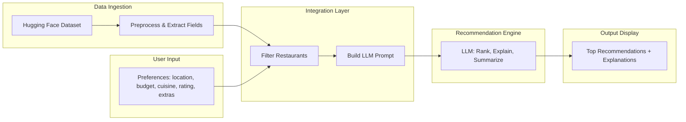

# Project Context: AI-Powered Restaurant Recommendation System

This document captures the full context from `docs/ProbelmStatement.txt` for use in planning, implementation, and agent sessions.

---

## Overview

Build an **AI-powered restaurant recommendation service** inspired by **Zomato**. The system suggests restaurants based on user preferences by combining **structured restaurant data** with a **Large Language Model (LLM)** to produce personalized, human-like recommendations.

---

## Objective

Design and implement an application that:

1. Accepts user preferences (location, budget, cuisine, ratings, and more)
2. Uses a real-world restaurant dataset
3. Leverages an LLM for personalized, natural-language recommendations
4. Displays clear, useful results to the user

---

## Data Source

| Item | Detail |
|------|--------|
| **Dataset** | Zomato restaurant data on Hugging Face |
| **URL** | https://huggingface.co/datasets/ManikaSaini/zomato-restaurant-recommendation |
| **Relevant fields** | Restaurant name, location, cuisine, cost, rating, and related attributes |

---

## System Workflow

### 1. Data Ingestion

- Load and preprocess the Zomato dataset from Hugging Face
- Extract fields such as: restaurant name, location, cuisine, cost, rating, etc.

### 2. User Input

Collect user preferences:

| Preference | Examples |
|------------|----------|
| **Location** | Delhi, Bangalore |
| **Budget** | low, medium, high |
| **Cuisine** | Italian, Chinese |
| **Minimum rating** | Numeric threshold |
| **Additional** | family-friendly, quick service, etc. |

### 3. Integration Layer

- Filter and prepare restaurant data based on user input
- Pass structured results into an LLM prompt
- Design a prompt that helps the LLM **reason** and **rank** options

### 4. Recommendation Engine (LLM)

The LLM should:

- Rank restaurants
- Provide explanations (why each recommendation fits the user)
- Optionally summarize the set of choices

### 5. Output Display

Present top recommendations in a user-friendly format. Each result should include:

| Field | Description |
|-------|-------------|
| **Restaurant Name** | Name of the venue |
| **Cuisine** | Type(s) of food |
| **Rating** | User/restaurant rating |
| **Estimated Cost** | Price indication |
| **AI-generated explanation** | Why this pick matches the user’s preferences |

---

## High-Level Architecture

---

## Functional Requirements (Checklist)

- [ ] Load Zomato dataset from Hugging Face
- [ ] Preprocess and expose core fields (name, location, cuisine, cost, rating)
- [ ] UI or API for user preference collection
- [ ] Filter dataset by user criteria before LLM call
- [ ] Prompt engineering for ranking and reasoning
- [ ] LLM integration for recommendations and explanations
- [ ] Display ranked results with all required fields

---

## Non-Functional Considerations (Implied)

- **Personalization**: Recommendations should reflect stated preferences, not generic lists
- **Transparency**: Each suggestion includes an explanation tied to user input
- **Usability**: Output is readable and actionable for end users
- **Efficiency**: Pre-filter structured data before sending context to the LLM (cost and latency)

---

## Key Constraints & Assumptions

- Dataset is the Hugging Face Zomato recommendation dataset (author: ManikaSaini)
- Budget is categorical: low / medium / high
- LLM is central to ranking and natural-language output; structured data alone is insufficient for the product goal
- “Zomato-inspired” means similar UX/value (smart picks + explanations), not necessarily Zomato branding or production APIs

---

## Success Criteria

A successful implementation:

1. Correctly ingests and filters real restaurant data
2. Accepts rich user preferences
3. Returns a ranked shortlist with name, cuisine, rating, cost, and per-item AI explanations
4. Feels personalized and understandable to a non-technical user

---

## Reference

- Source problem statement: `docs/ProbelmStatement.txt`
- Dataset: [ManikaSaini/zomato-restaurant-recommendation](https://huggingface.co/datasets/ManikaSaini/zomato-restaurant-recommendation)
