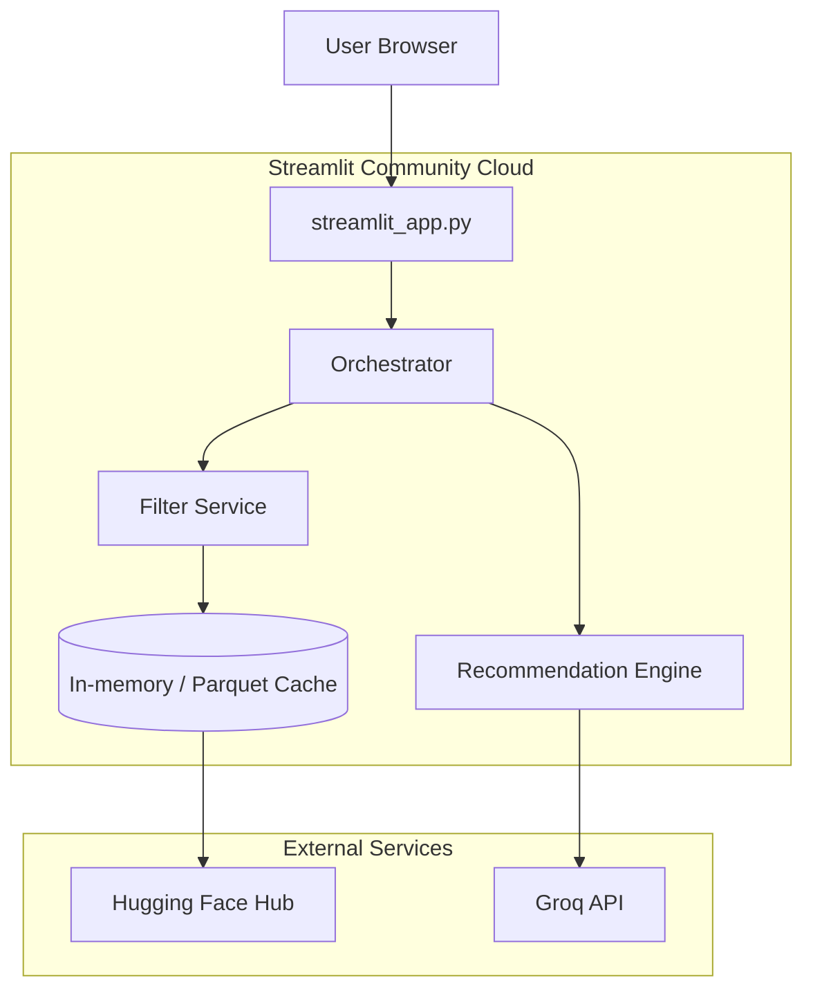

# Streamlit Deployment Plan

This document covers deploying the **Zomato AI Culinary Concierge** as a Streamlit Community Cloud application — replacing the FastAPI + static-HTML architecture with a single Streamlit app that embeds the backend logic directly.

---

## Table of Contents

1. [Deployment Architecture](#1-deployment-architecture)
2. [Prerequisites](#2-prerequisites)
3. [Step 1 — Add Streamlit Dependency](#step-1--add-streamlit-dependency)
4. [Step 2 — Create the Streamlit App](#step-2--create-the-streamlit-app)
5. [Step 3 — Configure Secrets](#step-3--configure-secrets)
6. [Step 4 — Handle Data Cache on Streamlit Cloud](#step-4--handle-data-cache-on-streamlit-cloud)
7. [Step 5 — Push to GitHub](#step-5--push-to-github)
8. [Step 6 — Deploy on Streamlit Community Cloud](#step-6--deploy-on-streamlit-community-cloud)
9. [Step 7 — Verify Deployment](#step-7--verify-deployment)
10. [Environment Variables Reference](#8-environment-variables-reference)
11. [Streamlit Cloud Quotas & Limits](#9-streamlit-cloud-quotas--limits)
12. [Troubleshooting](#10-troubleshooting)
13. [Local Development](#11-local-development)
14. [Post-Deployment](#12-post-deployment)

---

## 1. Deployment Architecture

The current architecture uses **FastAPI** as a backend and a static HTML/JS frontend. For Streamlit deployment, we collapse both layers into a single Streamlit app that directly calls the Python service modules (ingestion, filtering, LLM engine) — no HTTP API needed.

```
BEFORE (current):
  Browser → FastAPI (/api/v1/recommendations) → Orchestrator → Filter + Groq LLM

AFTER (Streamlit):
  Browser → Streamlit App → Orchestrator → Filter + Groq LLM
```



### Key architectural change

| Aspect | Current (FastAPI) | Streamlit |
|--------|-------------------|-----------|
| Backend | FastAPI + Uvicorn | Streamlit runtime |
| Frontend | Static HTML/JS (`src/frontend/`) | Streamlit widgets & layout |
| API calls | HTTP `POST /api/v1/recommendations` | Direct Python function calls |
| State management | REST (stateless) | `st.session_state` |
| Secrets | `.env` file | Streamlit Secrets Manager |
| Port | 8000 | 8501 (default) |

---

## 2. Prerequisites

| Requirement | Details |
|-------------|---------|
| **GitHub account** | Streamlit Cloud deploys from a GitHub repo |
| **Streamlit Cloud account** | Sign up at [share.streamlit.io](https://share.streamlit.io) |
| **Groq API key** | From [console.groq.com](https://console.groq.com/) |
| **Python 3.9+** | Project already targets 3.9 |
| **Data cache file** | `data/cache/restaurants.parquet` committed to the repo |

---

## Step 1 — Add Streamlit Dependency

Add `streamlit` to `requirements.txt`:

```text
streamlit>=1.35.0
```

The full updated `requirements.txt` should include:

```text
datasets>=2.19.0
numpy>=1.24.0
pandas>=2.0.0
pyarrow>=14.0.0
pydantic>=2.0.0
pydantic-settings>=2.0.0
fastapi>=0.109.0
uvicorn>=0.27.0
pytest>=7.4.0
openai>=1.0.0
httpx>=0.26.0
streamlit>=1.35.0
```

> **Note:** FastAPI and uvicorn are retained for local API development and testing. They are not used by the Streamlit deployment but do not interfere.

---

## Step 2 — Create the Streamlit App

Create a new file `streamlit_app.py` in the project root (Streamlit Cloud looks for this file by default):

```python
"""Zomato AI Culinary Concierge — Streamlit Frontend."""

from __future__ import annotations

import logging
import streamlit as st
from src.config import Settings, get_settings
from src.domain.preferences import UserPreferences
from src.filtering.pipeline import FilterService
from src.ingestion.service import DataIngestionService
from src.llm.client import create_llm_client
from src.llm.engine import RecommendationEngine
from src.api.orchestrator import RecommendationOrchestrator

logger = logging.getLogger(__name__)


def init_services() -> tuple[DataIngestionService, RecommendationOrchestrator]:
    """Initialize and cache all services in session state."""
    if "orchestrator" in st.session_state:
        return st.session_state["ingestion"], st.session_state["orchestrator"]

    settings = get_settings()
    ingestion = DataIngestionService(settings)
    ingestion.ensure_loaded()

    index = ingestion.index
    filter_service = FilterService(
        settings=settings,
        known_cities=index.known_cities if index else None,
    )
    llm_client = create_llm_client(settings)
    engine = RecommendationEngine(settings, llm_client=llm_client)
    orchestrator = RecommendationOrchestrator(
        ingestion, filter_service, engine=engine, settings=settings,
    )

    st.session_state["ingestion"] = ingestion
    st.session_state["orchestrator"] = orchestrator
    st.session_state["settings"] = settings
    return ingestion, orchestrator


def main():
    st.set_page_config(
        page_title="Zomato AI — Culinary Concierge",
        page_icon="🍽️",
        layout="wide",
    )

    st.title("🍽️ Zomato AI — Culinary Concierge")
    st.caption("AI-powered restaurant recommendations with Groq LLM ranking")

    # --- Initialize services ---
    with st.spinner("Loading restaurant data..."):
        ingestion, orchestrator = init_services()

    settings = st.session_state.get("settings", get_settings())
    index = ingestion.index

    # --- Preference Form ---
    with st.form("preferences_form"):
        col1, col2 = st.columns(2)

        with col1:
            cities = index.known_cities if index else []
            location = st.selectbox("📍 City", options=cities, index=None,
                                    placeholder="Select a city...")
            cuisine = st.text_input("🍕 Craving / Cuisine",
                                    placeholder="e.g. Italian, Biryani, Cafe...")

        with col2:
            budget = st.radio("💰 Budget", options=["low", "medium", "high"],
                              index=1, horizontal=True,
                              format_func=lambda x: {"low": "₹", "medium": "₹₹", "high": "₹₹₹"}[x])
            min_rating = st.slider("⭐ Minimum Rating", min_value=2.0,
                                   max_value=5.0, value=4.0, step=0.1)

        additional = st.text_area("📝 Special Instructions",
                                  placeholder="Dietary restrictions, seating, family-friendly...",
                                  height=68)

        submitted = st.form_submit_button("✨ Find Recommendations", type="primary",
                                          use_container_width=True)

    # --- Process Request ---
    if submitted:
        if not location:
            st.error("Please select a city.")
            return

        preferences = UserPreferences(
            location=location,
            budget=budget,
            cuisine=cuisine or None,
            min_rating=min_rating,
            additional_preferences=additional or None,
        )

        with st.spinner("🤖 Curating your experience..."):
            try:
                outcome = orchestrator.recommend(preferences)
            except Exception as exc:
                st.error(f"Something went wrong: {exc}")
                return

        response = outcome.response

        # --- Summary ---
        if response.summary:
            st.info(response.summary)

        # --- Meta chips ---
        meta_col1, meta_col2, meta_col3 = st.columns(3)
        with meta_col1:
            st.metric("Scanned", outcome.filter_result.candidates_considered)
        with meta_col2:
            st.metric("Filters Relaxed", "Yes" if outcome.filter_result.filters_relaxed else "No")
        with meta_col3:
            st.metric("Mode", "Degraded" if response.meta.degraded_mode else "Groq LLM")

        if response.meta.degraded_mode:
            st.warning("⚠️ Running in degraded mode — LLM unavailable. Showing filter-based rankings.")

        # --- Recommendation Cards ---
        if not response.recommendations:
            st.warning("No restaurants matched your criteria. Try broadening your budget or cuisine.")
            return

        for rec in response.recommendations:
            with st.container(border=True):
                header_col, rank_col = st.columns([6, 1])
                with header_col:
                    st.subheader(f"{rec.name}")
                with rank_col:
                    st.badge(f"#{rec.rank}", icon="🏆")

                tag_col1, tag_col2, tag_col3 = st.columns(3)
                with tag_col1:
                    st.caption(f"🍜 {rec.cuisine}")
                with tag_col2:
                    st.caption(f"⭐ {rec.rating}")
                with tag_col3:
                    st.caption(f"💰 {rec.estimated_cost}")

                st.markdown(f"> {rec.explanation}")


if __name__ == "__main__":
    main()
```

### Key design decisions

| Decision | Rationale |
|----------|-----------|
| File at project root as `streamlit_app.py` | Streamlit Cloud auto-detects this filename |
| Services cached in `st.session_state` | Avoids re-loading dataset on every interaction |
| Direct Python calls (no HTTP) | Lower latency; no FastAPI overhead on Streamlit Cloud |
| `st.form` for preferences | Batches input; single submit triggers one LLM call |
| Degraded mode banner | Matches architecture §6.5 graceful degradation |

---

## Step 3 — Configure Secrets

Streamlit Cloud does **not** read `.env` files. Instead, use **Streamlit Secrets**.

### 3.1 Create `.streamlit/secrets.toml` (local development)

```toml
LLM_API_KEY = "gsk_your_groq_api_key_here"
GROQ_API_KEY = "gsk_your_groq_api_key_here"
LLM_PROVIDER = "groq"
LLM_MODEL = "llama-3.3-70b-versatile"
LLM_BASE_URL = "https://api.groq.com/openai/v1"
```

> **IMPORTANT:** Add `.streamlit/secrets.toml` to `.gitignore` — never commit API keys.

### 3.2 Configure secrets on Streamlit Cloud

After deploying, go to your app's **Settings → Secrets** in the Streamlit Cloud dashboard and paste:

```toml
LLM_API_KEY = "gsk_your_actual_groq_key"
GROQ_API_KEY = "gsk_your_actual_groq_key"
LLM_PROVIDER = "groq"
LLM_MODEL = "llama-3.3-70b-versatile"
LLM_BASE_URL = "https://api.groq.com/openai/v1"
```

### 3.3 Make `config.py` Streamlit-compatible

The current `Settings` class reads from `.env` via `pydantic-settings`. On Streamlit Cloud, we need it to also read from `st.secrets`. Update `src/config.py` to support both:

```python
"""Application configuration — supports .env and Streamlit secrets."""

from pathlib import Path

from pydantic import AliasChoices, Field
from pydantic_settings import BaseSettings, SettingsConfigDict

GROQ_BASE_URL = "https://api.groq.com/openai/v1"
GROQ_DEFAULT_MODEL = "llama-3.3-70b-versatile"

# City name aliases applied during ingestion (lowercase key -> canonical value).
CITY_ALIASES: dict[str, str] = {
    "bengaluru": "Bangalore",
    "bangalore": "Bangalore",
    "bangalore.": "Bangalore",
    "banglore": "Bangalore",
    "bengalore": "Bangalore",
    "new delhi": "Delhi",
    "delhi-ncr": "Delhi",
    "gurgaon": "Gurgaon",
    "gurugram": "Gurgaon",
    "mumbai": "Mumbai",
    "bombay": "Mumbai",
    "kolkata": "Kolkata",
    "calcutta": "Kolkata",
    "chennai": "Chennai",
    "madras": "Chennai",
    "hyderabad": "Hyderabad",
    "pune": "Pune",
    "ahmedabad": "Ahmedabad",
    "noida": "Noida",
    "ghaziabad": "Ghaziabad",
}


def _get_streamlit_secrets() -> dict[str, str]:
    """Load secrets from Streamlit if available; return empty dict otherwise."""
    try:
        import streamlit as st
        return dict(st.secrets)
    except Exception:
        return {}


class Settings(BaseSettings):
    model_config = SettingsConfigDict(
        env_file=".env",
        env_file_encoding="utf-8",
        extra="ignore",
    )

    hf_dataset_id: str = "ManikaSaini/zomato-restaurant-recommendation"
    data_cache_path: Path = Path("data/cache/restaurants.parquet")
    max_candidates: int = 20
    min_candidates: int = 3
    top_n_results: int = 5
    llm_provider: str = "groq"
    llm_api_key: str = Field(
        default="",
        validation_alias=AliasChoices("LLM_API_KEY", "GROQ_API_KEY"),
    )
    llm_model: str = GROQ_DEFAULT_MODEL
    llm_base_url: str = GROQ_BASE_URL
    cors_origins: str = "*"
    llm_temperature: float = 0.3
    llm_max_tokens: int = 1500
    llm_timeout_seconds: float = 30.0
    llm_log_prompts: bool = False
    llm_log_dir: Path = Path("data/logs/llm")
    min_city_samples_for_percentiles: int = 30


def get_settings() -> Settings:
    """Build Settings from .env, environment variables, and Streamlit secrets."""
    streamlit_overrides = _get_streamlit_secrets()
    # Streamlit secrets take precedence; pydantic-settings handles env vars and .env
    import os
    for key, value in streamlit_overrides.items():
        os.environ.setdefault(key, str(value))
    return Settings()
```

---

## Step 4 — Handle Data Cache on Streamlit Cloud

### The problem

Streamlit Cloud has an **ephemeral filesystem** — files written at runtime are lost when the app sleeps or redeploys. The `data/cache/restaurants.parquet` file must be available for the app to work.

Additionally, the parquet cache file (~157 MB) **exceeds GitHub's 100 MB file limit**, so it cannot be committed directly to the repository.

### Solution: Download from HuggingFace on startup

The `streamlit_app.py` already handles this automatically. When the parquet cache file is missing (which it always will be on Streamlit Cloud's ephemeral filesystem), the app forces a fresh download from HuggingFace:

```python
# Already built into streamlit_app.py init_services():
if not Path(settings.data_cache_path).exists():
    ingestion.ensure_loaded(force_refresh=True)
else:
    ingestion.ensure_loaded()
```

This adds ~30–60 seconds to the cold start, but subsequent requests within the same session are fast.

### Important: `.gitignore` configuration

The `.gitignore` already excludes `data/cache/` and `*.parquet` — this is correct. The parquet file is too large for GitHub and will be re-downloaded on Streamlit Cloud automatically.

### Alternative: Use Git LFS (if you want faster cold starts)

If cold start speed is critical, you can use [Git Large File Storage](https://git-lfs.github.com/) to store the parquet file:

```bash
# Install Git LFS
git lfs install

# Track parquet files
git lfs track "data/cache/restaurants.parquet"

# Commit and push
git add .gitattributes data/cache/restaurants.parquet
git commit -m "Add restaurant data cache via Git LFS"
git push
```

> **Recommendation:** Use the automatic HuggingFace download for simplicity. The ~30–60 s cold start is acceptable for a demo/milestone project.

---

## Step 5 — Push to GitHub

```bash
# Ensure these are in .gitignore
echo ".streamlit/secrets.toml" >> .gitignore
echo ".env" >> .gitignore  # Already gitignored

# Stage everything
git add .
git commit -m "Add Streamlit app and deployment configuration"
git push origin main
```

---

## Step 6 — Deploy on Streamlit Community Cloud

1. Go to [share.streamlit.io](https://share.streamlit.io)
2. Click **"New app"**
3. Configure:

| Setting | Value |
|---------|-------|
| Repository | Your GitHub repo (e.g., `username/Zomato-milestone`) |
| Branch | `main` |
| Main file path | `streamlit_app.py` |
| Python version | 3.9 |

4. Click **"Advanced settings"** → paste secrets (see Step 3.2)
5. Click **"Deploy"**

The first deployment takes 2–5 minutes (installing dependencies + loading dataset).

---

## Step 7 — Verify Deployment

After deployment, check the following:

| Check | Expected result |
|-------|-----------------|
| App loads | Zomato AI page renders with city dropdown populated |
| City selection | Dropdown shows known cities (Bangalore, Mumbai, Delhi, etc.) |
| Recommendation request | Submitting preferences returns 1–5 ranked cards |
| LLM explanations | Each card shows an AI-generated explanation |
| Degraded mode | If Groq key is invalid, results appear with a degraded-mode warning |
| `/health` equivalent | Not applicable; Streamlit has no separate health endpoint |

### Smoke test scenarios

| # | Location | Budget | Cuisine | Min Rating | Expected |
|---|----------|--------|---------|------------|----------|
| 1 | Bangalore | medium | Italian | 4.0 | 1–5 results with explanations |
| 2 | Mumbai | high | — | 3.5 | Results without cuisine filter |
| 3 | Delhi | low | Street Food | 3.0 | Likely relaxed filters |
| 4 | Pune | medium | — | 4.5 | Fewer results or empty state |
| 5 | Invalid city | medium | — | 4.0 | Validation error message |

---

## 8. Environment Variables Reference

All configuration is managed through Streamlit Secrets (cloud) or `.env` (local):

| Variable | Default | Required | Description |
|----------|---------|----------|-------------|
| `LLM_API_KEY` | — | **Yes** | Groq API key |
| `GROQ_API_KEY` | — | Alt | Alias for `LLM_API_KEY` |
| `LLM_PROVIDER` | `groq` | No | `groq`, `mock`, or `ollama` |
| `LLM_MODEL` | `llama-3.3-70b-versatile` | No | Groq model ID |
| `LLM_BASE_URL` | `https://api.groq.com/openai/v1` | No | Groq API endpoint |
| `LLM_TEMPERATURE` | `0.3` | No | LLM sampling temperature |
| `LLM_MAX_TOKENS` | `1500` | No | Max output tokens |
| `LLM_TIMEOUT_SECONDS` | `30` | No | Request timeout |
| `HF_DATASET_ID` | `ManikaSaini/zomato-restaurant-recommendation` | No | HuggingFace dataset |
| `DATA_CACHE_PATH` | `data/cache/restaurants.parquet` | No | Cache file path |
| `MAX_CANDIDATES` | `20` | No | Max candidates before LLM |
| `MIN_CANDIDATES` | `3` | No | Min before filter relaxation |
| `TOP_N_RESULTS` | `5` | No | Final recommendation count |

---

## 9. Streamlit Cloud Quotas & Limits

| Limit | Value | Impact on this app |
|-------|-------|---------------------|
| **Memory** | ~1 GB | Dataset (~50k rows) fits easily in memory |
| **CPU** | Shared | Filter step < 200 ms; LLM latency dominated by Groq API |
| **Disk** | Ephemeral | Parquet downloaded from HuggingFace on startup |
| **App sleep** | After inactivity | Cold start re-downloads dataset (~30–60 s from HuggingFace) |
| **Outbound network** | Allowed | Groq API and HuggingFace are accessible |
| **Secrets** | Per-app | Store Groq API key in Streamlit Secrets |

### Cold start behavior

When the app wakes from sleep:

1. Streamlit installs dependencies from `requirements.txt` (~30–60 s on first deploy; cached afterward)
2. `streamlit_app.py` runs → `init_services()` downloads dataset from HuggingFace (~30–60 s on first cold start; cached in memory until app sleeps)
3. App becomes interactive

**Total cold start:** ~60–120 seconds from sleep (first time). Subsequent warm requests are < 10 seconds.

---

## 10. Troubleshooting

| Issue | Cause | Fix |
|-------|-------|-----|
| `ModuleNotFoundError: No module named 'src'` | Streamlit Cloud runs from repo root | Ensure repo root has `src/` package; add `__init__.py` if missing |
| `FileNotFoundError: data/cache/restaurants.parquet` | Cache file not in repo | This is expected on Streamlit Cloud; the app auto-downloads from HuggingFace |
| `LLM_API_KEY not set` or degraded mode | Secrets not configured | Add secrets in Streamlit Cloud → Settings → Secrets |
| App shows "Loading..." indefinitely | Dataset download failing | Check HuggingFace connectivity; check Streamlit Cloud logs for download errors |
| `pydantic-settings` validation error | Conflicting env vars | Check that secrets keys match `Settings` field names |
| Groq rate limit (429) | Too many requests | Reduce `MAX_CANDIDATES` or use `llama-3.1-8b-instant` for lower latency |
| App sleeps frequently | No traffic | Streamlit free tier sleeps after ~7 days of inactivity |

### Checking logs

On Streamlit Cloud: click your app → **⋮** → **View logs**. Logs include:
- Dataset load status
- Filter candidate counts
- LLM call duration and errors

---

## 11. Local Development

Run the Streamlit app locally alongside the existing FastAPI setup:

```bash
# Install dependencies
pip install -r requirements.txt

# Run Streamlit (reads from .env automatically)
streamlit run streamlit_app.py

# OR run the existing FastAPI backend
uvicorn src.api.app:app --reload --port 8000
```

Both can coexist — Streamlit for the integrated UI, FastAPI for API testing.

### Optional: `.streamlit/config.toml` for theming

```toml
[theme]
primaryColor = "#E23744"
backgroundColor = "#1C1C1C"
secondaryBackgroundColor = "#2D2D2D"
textColor = "#FFFFFF"
```

---

## 12. Post-Deployment

### Monitoring

- **Streamlit Cloud dashboard** — Check app health, view logs, monitor usage
- **Groq console** — Monitor API usage at [console.groq.com](https://console.groq.com/)

### Updating the app

1. Make changes locally
2. Commit and push to GitHub
3. Streamlit Cloud auto-redeploys from the main branch

### Keeping data fresh

The restaurant dataset is static for this milestone. To update:

1. Run `python -m src.ingestion` locally to regenerate `data/cache/restaurants.parquet`
2. Commit the updated parquet file
3. Push to trigger a redeploy

### Future improvements

| Improvement | Description |
|-------------|-------------|
| **@st.cache_data** | Cache the `ensure_loaded()` call with Streamlit's caching for faster warm starts |
| **@st.cache_resource** | Cache the orchestrator singleton across reruns |
| **Custom component** | Build richer recommendation cards with `st.components.v1.html` |
| **Session history** | Store past searches in `st.session_state` for comparison |
| **Multi-page app** | Split into `pages/` for Discover, History, Settings |

---

## Summary

| Step | Action | Time |
|------|--------|------|
| 1 | Add `streamlit` to `requirements.txt` | 1 min |
| 2 | Create `streamlit_app.py` | 15 min |
| 3 | Configure secrets (local + cloud) | 5 min |
| 4 | Push to GitHub | 2 min |
| 5 | Deploy on Streamlit Cloud | 5 min |
| 6 | Verify and smoke test | 10 min |

**Total estimated time:** ~40 minutes

The Streamlit deployment replaces the FastAPI + static HTML architecture with a simpler, single-file application that directly calls the existing Python service modules. The core business logic (ingestion, filtering, LLM engine, orchestrator) remains unchanged — only the presentation layer is replaced.
