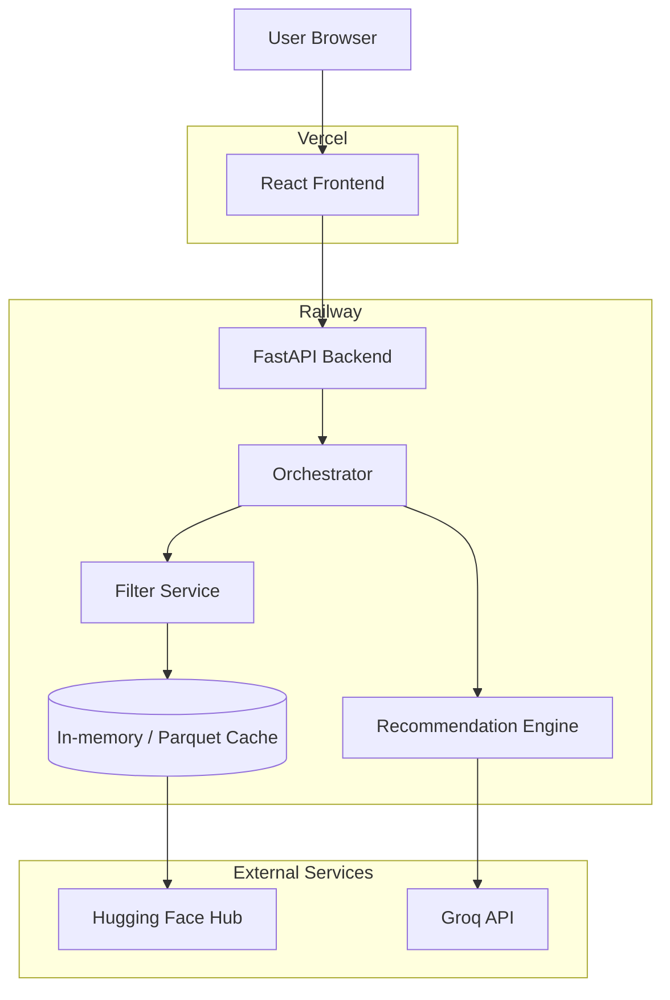

# Deployment Plan: Railway (Backend) & Vercel (Frontend)

This document covers deploying the **Zomato AI Culinary Concierge** using a decoupled architecture, with the FastAPI backend hosted on Railway and the React frontend hosted on Vercel.

---

## Table of Contents

1. [Deployment Architecture](#1-deployment-architecture)
2. [Backend Deployment (Railway)](#2-backend-deployment-railway)
3. [Frontend Deployment (Vercel)](#3-frontend-deployment-vercel)
4. [Environment Variables](#4-environment-variables)
5. [Troubleshooting](#5-troubleshooting)

---

## 1. Deployment Architecture

The application uses a separated frontend and backend:
- **Backend (FastAPI)**: Serves the REST API (`/api/v1/...`) and handles orchestration, data ingestion, filtering, and LLM communication.
- **Frontend (React)**: Provides the user interface, making HTTP calls to the backend.

---

## 2. Backend Deployment (Railway)

Railway is an excellent choice for Python/FastAPI backends due to its ease of use with Dockerfiles and Nixpacks.

### Prerequisites
- A GitHub account and repo with the backend code (Python + FastAPI).
- A Railway account (sign up at [railway.app](https://railway.app)).
- A Groq API Key.

### Steps
1. Log into your Railway dashboard and click **New Project** → **Deploy from GitHub repo**.
2. Select your `Zomato` repository.
3. Railway will automatically detect the Python app (or use the provided `Dockerfile`).
4. **Configure Environment Variables**:
   Go to the Variables tab for your service and add:
   - `LLM_API_KEY`: `gsk_...` (Your Groq key)
   - `LLM_PROVIDER`: `groq`
   - `CORS_ORIGINS`: `*` (or restrict it to your Vercel URL later)
5. **Start Command**: Railway typically detects `uvicorn src.api.app:app --host 0.0.0.0 --port $PORT` if specified in a `Procfile` or `railway.json`. Alternatively, the `Dockerfile` will handle this.
6. **Generate Domain**: Go to Settings → Domains, and click "Generate Domain" to get a public URL for your API (e.g., `https://zomato-api-production.up.railway.app`).

---

## 3. Frontend Deployment (Vercel)

Vercel is optimized for frontend frameworks like React and Vite.

### Prerequisites
- A Vercel account (sign up at [vercel.com](https://vercel.com)).
- The React frontend code located in `src/frontend-react/`.

### Steps
1. Log into Vercel and click **Add New** → **Project**.
2. Import your `Zomato` repository from GitHub.
3. **Configure Project Settings**:
   - **Framework Preset**: Vite (if using Vite) or Create React App.
   - **Root Directory**: Select `src/frontend-react` (or the folder containing `package.json`).
   - **Build Command**: `npm run build`
   - **Install Command**: `npm install`
4. **Configure Environment Variables**:
   Add the backend URL to connect the frontend to the API:
   - `VITE_API_BASE_URL` (or your specific API env var): `https://zomato-api-production.up.railway.app`
5. Click **Deploy**. Vercel will build the frontend and provide a public domain.

---

## 4. Environment Variables

### Backend (Railway)
| Variable | Description |
|----------|-------------|
| `LLM_API_KEY` | Groq API Key |
| `LLM_PROVIDER` | `groq` |
| `CORS_ORIGINS` | Allow requests from your Vercel domain (e.g., `https://your-frontend.vercel.app`) |

### Frontend (Vercel)
| Variable | Description |
|----------|-------------|
| `VITE_API_BASE_URL` | The public Railway API URL |

---

## 5. Troubleshooting

- **CORS Errors**: Ensure the backend's `CORS_ORIGINS` environment variable includes the Vercel frontend URL. If testing, `*` can be used temporarily.
- **Frontend can't reach API**: Double-check that the frontend environment variable for the API base URL is correctly prefixed (e.g., `VITE_` for Vite) and set in Vercel before the build step.
- **Dataset Loading on Railway**: Since Railway uses ephemeral disks for basic deployments, ensure the backend is configured to pull the dataset from Hugging Face on startup if the parquet file isn't committed.
