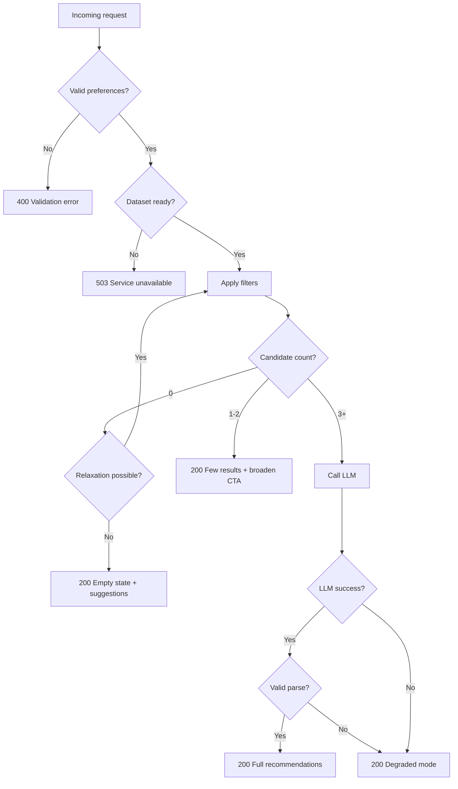

# Edge Cases & Handling Guide

This document catalogs edge cases for the **AI-Powered Restaurant Recommendation System**, with expected behavior and implementation guidance. It complements [`docs/context.md`](context.md), [`docs/architecture.md`](architecture.md), and [`docs/implementation-plan.md`](implementation-plan.md).

---

## How to Use This Document

| Column / section | Meaning |
|------------------|---------|
| **ID** | Stable reference (e.g. `ING-01`) for tests and issues |
| **Severity** | `Critical` \| `High` \| `Medium` \| `Low` |
| **Layer** | Where the case is detected/handled |
| **Behavior** | What the system must do |
| **User-facing** | Message or UI state shown to the end user |

Implementers should add automated tests for all `Critical` and `High` cases before milestone sign-off.

---

## Edge Case Flow (Decision Overview)



---

## 1. Data Ingestion & Cache

| ID | Scenario | Severity | Behavior | User-facing | Test hint |
|----|----------|----------|----------|-------------|-----------|
| **ING-01** | Hugging Face download fails (network, 404, rate limit) | Critical | Retry with exponential backoff (max 3); if still failing, return 503 on API; log error with dataset id | “Service is starting up. Please try again in a minute.” | Mock `ConnectionError` on loader |
| **ING-02** | Dataset schema changed (unknown/missing columns) | High | Flexible column mapping with required-field fallback; log unmapped columns; fail ingest if name/location/rating unmappable | 503 until ingest succeeds | Fixture with alternate column names |
| **ING-03** | Empty dataset returned from HF | Critical | Abort ingest; do not mark service ready | 503 “Data unavailable” | Mock empty iterator |
| **ING-04** | Row missing `name` | High | Drop row; increment `dropped_missing_name` metric | N/A (silent) | Row fixture without name |
| **ING-05** | Row missing `location` / `city` | High | Drop row or assign `unknown` and exclude from location filter index | N/A | Partial row fixture |
| **ING-06** | Row missing `rating` | Medium | Keep row; exclude from `min_rating` filter (treat as null) | N/A | Null rating row |
| **ING-07** | Row missing `approximate_cost_for_two` | Medium | Assign `budget_band = unknown`; exclude from strict budget filter unless relaxation | N/A | Null cost row |
| **ING-08** | Invalid rating (negative, > 5, non-numeric string) | High | Coerce or drop; log count of invalid ratings | N/A | `"rating": "4.5/5"`, `-1`, `6` |
| **ING-09** | Invalid cost (negative, zero, non-numeric) | High | Coerce or drop; zero may map to `low` band with flag | N/A | `0`, `"₹500"`, `-100` |
| **ING-10** | Duplicate restaurant names in same city | Medium | Generate unique `id` (hash of name+city+row index); do not dedupe unless business rule added | N/A | Duplicate name fixtures |
| **ING-11** | Corrupt Parquet cache on disk | High | Delete cache and re-ingest from HF; log `cache_rebuild` | Brief 503 on first request after rebuild | Truncate/corrupt cache file |
| **ING-12** | Cache stale (dataset version bumped) | Medium | Compare `HF_DATASET_REVISION` env or etag; rebuild if mismatch | N/A | Change version constant |
| **ING-13** | City spelling variants (Bengaluru vs Bangalore) | High | Apply normalization map at ingest; index canonical city | User can type either; both match | Map lookup tests |
| **ING-14** | Cuisines as comma-separated string vs list | Medium | Always normalize to `list[str]`; trim whitespace | N/A | `"Italian, Chinese, Cafe"` |
| **ING-15** | All restaurants in one city have same cost | Medium | Budget percentiles collapse; use global percentiles fallback for that city | N/A | Synthetic uniform cost data |
| **ING-16** | Extremely long restaurant name or cuisine string | Low | Truncate at ingest (e.g. 200 chars) for storage; full name in `raw_attributes` if needed | Display truncated with tooltip optional | 500-char name |
| **ING-17** | Cold start: first request before ingest completes | Critical | Block readiness probe until ingest done; queue or 503 concurrent requests | Loading screen / retry | Hit API during startup |
| **ING-18** | Disk full when writing Parquet cache | High | Fall back to in-memory only; warn in logs; 503 if memory load also fails | “Temporary storage issue” | Mock `OSError` on write |

---

## 2. User Preferences & Validation

| ID | Scenario | Severity | Behavior | User-facing | Test hint |
|----|----------|----------|----------|-------------|-----------|
| **INP-01** | Missing `location` | Critical | 400 validation error | “Location is required.” | `{}` body |
| **INP-02** | Missing `budget` | Critical | 400 validation error | “Budget is required (low, medium, high).” | No budget field |
| **INP-03** | Invalid `budget` value (e.g. `"cheap"`, `123`) | Critical | 400; enum validation | “Budget must be low, medium, or high.” | `budget: "cheap"` |
| **INP-04** | Empty string `location` | Critical | 400 | “Location cannot be empty.” | `location: ""` |
| **INP-05** | Whitespace-only `location` | High | Trim; if empty after trim → 400 | Same as INP-04 | `location: "   "` |
| **INP-06** | Unknown city (not in dataset) | High | 200 empty state OR suggest closest known cities (Levenshtein top 3) | “No restaurants found in ‘X’. Did you mean Bangalore, Delhi…?” | `location: "Tokyo"` |
| **INP-07** | `min_rating` omitted | Medium | Default to `3.0` (configurable) | N/A | Omit field |
| **INP-08** | `min_rating` out of range (< 0 or > 5) | High | 400 | “Rating must be between 0 and 5.” | `min_rating: 10` |
| **INP-09** | `min_rating` impossible for city (e.g. 4.9, no restaurant qualifies) | Medium | After filters → empty or relaxation path | “No restaurants meet 4.9★ in this area. Try 4.0.” | High threshold + strict filters |
| **INP-10** | `cuisine` omitted | Medium | Skip cuisine filter; all cuisines in location/budget/rating | N/A | No cuisine field |
| **INP-11** | `cuisine` typo (“Itallian”) | Medium | Fuzzy match or no match → fewer results; optional “did you mean Italian?” | Empty or few results + suggestion | Typo input |
| **INP-12** | `cuisine` with special characters | Medium | Sanitize; strip HTML/script; use literal substring match | N/A | `cuisine: "<script>"` |
| **INP-13** | Multiple cuisines in one string (“Italian, Chinese”) | Medium | Split on comma; match ANY (OR) or ALL (AND)—document choice: **default OR** | N/A | Combined cuisine string |
| **INP-14** | `additional_preferences` very long (> 500 chars) | High | Truncate to max length (e.g. 500); log warning | N/A (silent truncate) | 10k char string |
| **INP-15** | `additional_preferences` empty or whitespace | Low | Treat as absent; skip keyword filter | N/A | `"   "` |
| **INP-16** | Prompt injection in `additional_preferences` | Critical | Escape/treat as data; system prompt forbids ignoring candidate list; never execute instructions | Normal recommendations only | “Ignore previous instructions…” |
| **INP-17** | Unicode / emoji in preferences | Medium | Accept UTF-8; normalize NFC; keyword match on normalized text | N/A | `location: "Mumbai 🍕"` |
| **INP-18** | Case variations (“bangalore”, “BANGALORE”) | High | Case-insensitive location match after canonicalization | N/A | Lowercase city |
| **INP-19** | Null explicit JSON fields | Medium | Treat null as omitted (use defaults) | N/A | `"cuisine": null` |
| **INP-20** | Extra unknown JSON fields | Low | Ignore (Pydantic `extra = ignore`) | N/A | `"foo": "bar"` |
| **INP-21** | Non-JSON body / malformed JSON | Critical | 400 `invalid_request` | “Invalid request body.” | Plain text POST |
| **INP-22** | Concurrent duplicate submissions from UI | Low | Idempotent per session optional; debounce submit button | Single in-flight request | Double-click submit |

---

## 3. Filter Pipeline

| ID | Scenario | Severity | Behavior | User-facing | Test hint |
|----|----------|----------|----------|-------------|-----------|
| **FIL-01** | Zero candidates after all filters | Critical | Try relaxation (see FIL-05); if still zero → empty state | See EMPTY-01 | Impossible combo |
| **FIL-02** | Fewer than `MIN_CANDIDATES` (3) | High | Relax budget band adjacency; set `meta.filters_relaxed = true` | Banner: “Expanded budget to show more options.” | Strict budget + niche cuisine |
| **FIL-03** | More than `MAX_CANDIDATES` (20) | Medium | Sort by rating desc, cost fit; truncate to 20 before LLM | N/A | Popular city + loose filters |
| **FIL-04** | Exactly 1–2 candidates | Medium | Proceed to LLM with 1–2; UI shows “few results” + broaden CTA | “Only 2 matches. Try removing cuisine filter.” | Narrow filters |
| **FIL-05** | Relaxation exhausted, still zero | Critical | 200 with `recommendations: []`, `meta.empty_reason` | EMPTY-01 message | FIL-01 after all relax steps |
| **FIL-06** | Location matches suburbs inconsistently | Medium | Document: match `city` field only, not free-text address | N/A | `location: "Indiranagar"` if not in data |
| **FIL-07** | Budget filter eliminates all despite valid city | High | Trigger relaxation: low→include medium, etc. | Relaxation banner | low budget in expensive city |
| **FIL-08** | Cuisine filter too strict (AND vs OR bug) | High | Verify OR semantics for multi-cuisine; unit test | N/A | Italian + Chinese rare combo |
| **FIL-09** | Keyword filter on `additional_preferences` matches nothing | Medium | Do not zero out results; treat as soft boost only OR skip if zero keyword hits | N/A | Obscure keywords |
| **FIL-10** | All candidates have `rating: null` and `min_rating` set | High | Empty after rating filter; suggest lowering rating | “No rated restaurants found.” | Null ratings only |
| **FIL-11** | Tie scores on rating and cost | Low | Stable sort by `id` as tertiary key | N/A | Equal ratings |
| **FIL-12** | Filter completes in > 200 ms (large cache) | Low | Log warning; consider indexes by city | Slight delay acceptable | Performance test on full data |
| **FIL-13** | User selects `high` budget but all local data is `low` band | Medium | Relaxation or empty with suggestion to change budget | “No high-budget options in this area.” | Skewed local distribution |

### Relaxation order (canonical)

1. Widen budget band (one step)  
2. Drop optional keyword filter  
3. Lower `min_rating` by 0.5 (floor 2.0)  
4. Drop cuisine filter  
5. If still zero → empty state (do not invent data)

---

## 4. LLM Integration & Recommendation Engine

| ID | Scenario | Severity | Behavior | User-facing | Test hint |
|----|----------|----------|----------|-------------|-----------|
| **LLM-01** | Missing `LLM_API_KEY` | Critical | Degraded mode: filter-sorted top 5 + template explanation | Banner: “AI explanations unavailable.” | Unset env var |
| **LLM-02** | Invalid / expired API key | High | Degraded mode; log `auth_error` (no key in logs) | Same as LLM-01 | 401 from provider |
| **LLM-03** | LLM timeout | High | Degraded mode after configurable timeout (e.g. 15s) | “Recommendations ready (basic mode).” | Mock slow response |
| **LLM-04** | LLM 5xx / rate limit (429) | High | Retry once with backoff; then degraded mode | Same as LLM-01 | Mock 429 |
| **LLM-05** | LLM returns empty content | High | Degraded mode | Same as LLM-01 | Empty string response |
| **LLM-06** | LLM returns markdown-wrapped JSON | Medium | Strip ``` fences; parse | N/A | Response with code blocks |
| **LLM-07** | LLM returns invalid JSON | High | Retry once with “fix JSON only”; then degraded | Degraded banner | `{ broken` |
| **LLM-08** | LLM returns valid JSON but wrong schema | High | Validate with Pydantic; missing fields → degraded | Degraded banner | Missing `recommendations` |
| **LLM-09** | LLM hallucinates `restaurant_id` not in candidates | Critical | Drop invalid entries; log `hallucinated_id`; fill ranks from filter order if < TOP_N | N/A (user sees valid only) | Fake id in mock response |
| **LLM-10** | LLM returns duplicate ranks or duplicate ids | Medium | Deduplicate by id; re-rank sequentially | N/A | Two `rank: 1` |
| **LLM-11** | LLM returns fewer than `TOP_N` (5) items | Medium | Return what’s valid; pad with filter order if needed | Show available count | 2 items in response |
| **LLM-12** | LLM returns more than `TOP_N` items | Low | Truncate to top N by rank | N/A | 10 items |
| **LLM-13** | LLM changes factual rating/cost in explanation only | Medium | Display facts from dataset only, never from LLM prose | N/A | Manual review |
| **LLM-14** | LLM explanation empty string | Medium | Use template: “Matches your preferences for {location}, {budget}.” | Generic explanation text | `explanation: ""` |
| **LLM-15** | LLM summary missing | Low | Omit summary block in UI | N/A | No `summary` field |
| **LLM-16** | Prompt exceeds token limit | High | Reduce candidate count dynamically (20→10→5); truncate long fields | N/A | Huge `additional_preferences` |
| **LLM-17** | Single candidate sent to LLM | Medium | Still call LLM or skip and use template (config: `SKIP_LLM_IF_CANDIDATES_LT=2`) | One card + explanation | 1 candidate |
| **LLM-18** | Ollama/local model not running | High | Degraded mode; clear log | “AI service offline.” | Connection refused |
| **LLM-19** | LLM outputs offensive / unsafe content | Medium | Optional moderation hook; fallback to template explanation | Sanitized text | Red-team prompt |
| **LLM-20** | Temperature too high → inconsistent rankings | Low | Enforce low temperature (0.2–0.4) in config | N/A | Config review |

---

## 5. API & Orchestration

| ID | Scenario | Severity | Behavior | User-facing | Test hint |
|----|----------|----------|----------|-------------|-----------|
| **API-01** | Request while dataset not loaded | Critical | 503 `service_unavailable` | “System is loading data.” | Request before startup complete |
| **API-02** | Validation error | Critical | 400 with field-level `detail[]` | Inline field errors in UI | Invalid budget |
| **API-03** | Successful request with degraded LLM | High | 200 + `meta.degraded_mode: true` | Warning banner | Mock LLM failure |
| **API-04** | Successful request with empty results | High | 200 + `recommendations: []` + `meta.empty_reason` | Empty state component | FIL-05 |
| **API-05** | Internal unhandled exception | Critical | 500 generic message; log stack trace server-side | “Something went wrong. Please retry.” | Force exception in orchestrator |
| **API-06** | Wrong HTTP method (GET on POST endpoint) | Low | 405 | N/A | GET `/recommendations` |
| **API-07** | Missing `Content-Type: application/json` | Medium | 415 or attempt parse; prefer 415 | Error message | Form POST |
| **API-08** | Extremely large request body (> 1 MB) | Medium | 413 Payload Too Large | “Request too large.” | Huge JSON |
| **API-09** | CORS preflight from unknown origin | Medium | Reject or allow per config; document allowed origins | Browser CORS error | Wrong origin |
| **API-10** | Health check during ingest | Medium | `/health` returns 503 until ready; `/health/live` vs `/health/ready` optional | Load balancer waits | K8s readiness |
| **API-11** | Response serialization of float rating | Low | Round to 1 decimal in JSON output | “4.5” not “4.5000001” | Float precision |
| **API-12** | `estimated_cost` formatting | Medium | Handle null cost: “Price not available” | Display fallback | Null cost restaurant |

---

## 6. Presentation Layer (UI)

| ID | Scenario | Severity | Behavior | User-facing | Test hint |
|----|----------|----------|----------|-------------|-----------|
| **UI-01** | User submits before required fields filled | High | Client-side validation; disable submit | Inline errors | Empty form submit |
| **UI-02** | API slow (> 10s) | Medium | Show loading spinner; optional cancel | “Finding restaurants…” | Throttle network |
| **UI-03** | API returns 503 | High | Retry button + message | “Service busy, retry.” | Startup race |
| **UI-04** | API returns 400 | High | Map `detail` to form fields | Field-level errors | Invalid input |
| **UI-05** | Empty recommendations | High | Empty state with suggestions (broaden location, budget, cuisine) | EMPTY-01 copy | Zero results |
| **UI-06** | Degraded mode flag | High | Non-blocking banner above results | “AI summaries limited.” | `meta.degraded_mode` |
| **UI-07** | `filters_relaxed` flag | Medium | Info banner explaining relaxed criteria | “We expanded your budget…” | `meta.filters_relaxed` |
| **UI-08** | Very long explanation text | Low | CSS `max-height` + “Read more” expand | Readable layout | Long LLM text |
| **UI-09** | Missing optional fields in one card | Medium | Hide badge or show “—” | Partial card | Null cuisine |
| **UI-10** | Network offline in browser | Medium | Catch fetch error; offline message | “Check your connection.” | DevTools offline |
| **UI-11** | Double-submit | Medium | Disable button while loading | Single request | Double click |
| **UI-12** | Mobile narrow viewport | Low | Responsive card layout | Usable on phone | CSS test |

### Standard copy: EMPTY-01

> **No restaurants match your filters.**  
> Try: a nearby city name from our list, a broader budget, a different cuisine, or a lower minimum rating.

---

## 7. Security & Abuse

| ID | Scenario | Severity | Behavior | User-facing |
|----|----------|----------|----------|-------------|
| **SEC-01** | API key in client-side code | Critical | Never expose; backend-only LLM calls | N/A |
| **SEC-02** | Secrets committed to git | Critical | Pre-commit scan; `.env` gitignored | N/A |
| **SEC-03** | SQL/command injection | Low | No raw SQL in milestone; parameterized if added later | N/A |
| **SEC-04** | LLM prompt injection via preferences | Critical | See INP-16; isolate user text in prompt | N/A |
| **SEC-05** | DoS via rapid API calls | Medium | Rate limit per IP (e.g. 30/min) optional | 429 Too Many Requests |
| **SEC-06** | Log leakage of PII or API keys | High | Redact keys; log preference hashes only if needed | N/A |

---

## 8. Operational & Deployment

| ID | Scenario | Severity | Behavior | User-facing |
|----|----------|----------|----------|-------------|
| **OPS-01** | Process restart loses in-memory cache only | Medium | Reload from Parquet on startup | Brief 503 |
| **OPS-02** | HF hub maintenance | High | Use cached Parquet; serve read-only | N/A if cache exists |
| **OPS-03** | Clock skew affecting token expiry | Low | Use provider SDK retry | Rare auth errors |
| **OPS-04** | Out of memory loading full dataset | High | Stream/chunk ingest; or sample subset with config flag `DATA_LIMIT` | 503 |
| **OPS-05** | Multiple workers without shared cache | Medium | Each worker ingests once OR shared volume for Parquet | Slow cold start |
| **OPS-06** | Docker container without network on first run | High | Bake cache into image OR mount volume | Startup failure message |

---

## 9. Data Display & Consistency

| ID | Scenario | Severity | Behavior | User-facing |
|----|----------|----------|----------|-------------|
| **DSP-01** | Cuisine list display | Low | Join with comma: `Italian, Pizza` | Tags on card |
| **DSP-02** | Rating display with one decimal | Low | `4.5 ★` | Badge |
| **DSP-03** | Cost in INR | Medium | Format `₹{n} for two`; locale optional | Cost line |
| **DSP-04** | Rank gaps after dropping hallucinated ids | Medium | Renumber ranks 1..N contiguously | Correct order |
| **DSP-05** | Mismatch: LLM rank order vs filter sort in degraded mode | High | Degraded uses filter sort only; ignore LLM ranks | Consistent order |

---

## 10. Testing Matrix (Priority Cases)

Run these before milestone sign-off:

| Priority | IDs |
|----------|-----|
| **P0 (must pass)** | ING-01, ING-17, INP-01, INP-02, INP-16, FIL-01, FIL-05, LLM-01, LLM-03, LLM-07, LLM-09, API-01, API-03, API-04, UI-05, UI-06, SEC-01, SEC-04 |
| **P1 (should pass)** | ING-02, ING-13, INP-06, INP-09, FIL-02, FIL-07, LLM-06, LLM-11, LLM-16, API-02, UI-02, UI-04, OPS-02 |
| **P2 (nice to have)** | Remaining IDs |

---

## 11. Response Shape Extensions

Extend the API response `meta` object for edge-case transparency:

```json
{
  "meta": {
    "candidates_considered": 0,
    "filters_relaxed": false,
    "degraded_mode": false,
    "empty_reason": "no_matches_after_relaxation",
    "suggestions": [
      "Try lowering minimum rating to 3.5",
      "Try budget: medium instead of low"
    ],
    "known_locations_sample": ["Bangalore", "Delhi", "Mumbai"]
  }
}
```

| `empty_reason` value | Meaning |
|----------------------|---------|
| `unknown_location` | City not in dataset (INP-06) |
| `no_matches_after_relaxation` | FIL-05 |
| `rating_too_strict` | INP-09 |
| `dataset_not_ready` | API-01 (use 503, not 200) |

---

## 12. Implementation Checklist

Map edge-case handling to code locations:

| Layer | Module | Edge-case IDs |
|-------|--------|---------------|
| Ingestion | `src/ingestion/normalizer.py`, `validator.py` | ING-* |
| Preferences | `src/domain/preferences.py` | INP-* |
| Filtering | `src/filtering/pipeline.py` | FIL-* |
| LLM | `src/llm/parser.py`, `engine.py` | LLM-* |
| API | `src/api/orchestrator.py`, `routes.py` | API-* |
| UI | `frontend/` or Streamlit app | UI-* |

- [ ] Degraded mode implemented (`LLM-01`–`LLM-05`, `LLM-07`)
- [ ] Filter relaxation sequence documented and coded (`FIL-02`, `FIL-05`)
- [ ] Hallucinated id stripping (`LLM-09`)
- [ ] Empty state copy (`EMPTY-01`, `UI-05`)
- [ ] Validation errors return 400 with field detail (`INP-*`, `API-02`)
- [ ] 503 until dataset ready (`ING-17`, `API-01`)
- [ ] Prompt injection mitigations (`INP-16`, `SEC-04`)
- [ ] Unit tests for P0 matrix

---

## Document Map

| Document | Role |
|----------|------|
| [`docs/context.md`](context.md) | Requirements |
| [`docs/architecture.md`](architecture.md) | Design & degraded mode (§6.5, §11.3) |
| [`docs/implementation-plan.md`](implementation-plan.md) | Phases & risks |
| **`docs/edge-cases.md`** | Edge cases & handling (this file) |

---

*Covers ingestion, validation, filtering, LLM, API, UI, security, and operations. Update this file when new edge cases are discovered during implementation or QA.*
