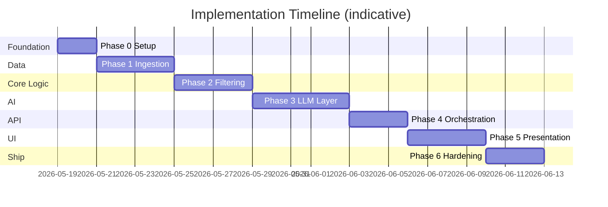
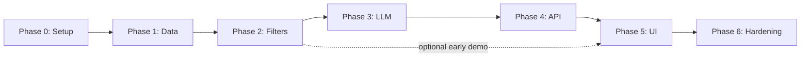

# Phase-Wise Implementation Plan

This plan implements the **AI-Powered Restaurant Recommendation System** defined in [`docs/context.md`](context.md) and [`docs/architecture.md`](architecture.md). Work is split into **seven phases** (Phase 0–6), each with goals, tasks, deliverables, acceptance criteria, and dependencies.

---

## Plan Overview

| Phase | Name | Primary outcome | Maps to context.md |
|-------|------|-----------------|----------------------|
| **0** | Project foundation | Repo, config, domain skeleton | — |
| **1** | Data ingestion | Cached, normalized restaurant data | § Data Ingestion |
| **2** | Filter & preferences | Deterministic shortlist without LLM | § User Input (partial) |
| **3** | LLM integration (Groq) | Ranked picks + explanations via Groq API | § Integration + Recommendation Engine |
| **4** | API & orchestration | `POST /recommendations` end-to-end with **Groq** | All layers wired |
| **5** | UI & output display | User-facing recommendation cards | § Output Display |
| **6** | Test, deploy, polish | Production-ready milestone | Success criteria |

**Estimated total:** ~3–4 weeks (solo developer, part-time adjust proportionally).

---

## Phase Dependency Graph

---

## Phase 0: Project Foundation

**Goal:** Establish repository structure, tooling, configuration, and domain models so later phases plug in cleanly.

**Architecture reference:** §3 Logical Architecture (domain layer), §12 Suggested Project Structure, §13 Technology Options.

### Tasks

| # | Task | Owner module / file |
|---|------|---------------------|
| 0.1 | Initialize Python project (`pyproject.toml` or `requirements.txt`) | root |
| 0.2 | Create folder structure per architecture §12 | `src/domain`, `src/ingestion`, `src/filtering`, `src/llm`, `src/api` |
| 0.3 | Add `.env.example` with `HF_DATASET_ID`, `LLM_*` (Groq: `LLM_PROVIDER=groq`, `LLM_BASE_URL`, `LLM_API_KEY`, `LLM_MODEL`), `MAX_CANDIDATES`, `TOP_N_RESULTS` | root |
| 0.4 | Implement `config.py` using `pydantic-settings` | `src/config.py` |
| 0.5 | Define domain models: `Restaurant`, `UserPreferences`, `Recommendation`, `RecommendationResponse` | `src/domain/` |
| 0.6 | Add `README.md` with setup instructions and doc links | root |
| 0.7 | Configure linting/formatting (ruff or black + isort) | dev tooling |

### Deliverables

- Runnable empty FastAPI app (health check only)
- Domain types with Pydantic validation (budget enum, rating bounds)
- Documented environment variables

### Acceptance criteria

- [ ] `pip install -r requirements.txt` succeeds
- [ ] `UserPreferences` validates `budget` ∈ `{low, medium, high}`
- [ ] `GET /health` returns 200
- [ ] Project structure matches architecture §12

### Dependencies

- None

**Duration:** 1–2 days

---

## Phase 1: Data Ingestion & Cache

**Goal:** Load the Hugging Face Zomato dataset, normalize to the canonical schema, enrich with `budget_band`, and cache for fast queries.

**Architecture reference:** §4.1 Data Ingestion Service, §5 Data Architecture, §9.2 Application startup.

**Context reference:** Data Ingestion workflow; dataset URL in context.md.

### Tasks

| # | Task | Details |
|---|------|---------|
| 1.1 | Implement HF loader | `datasets.load_dataset("ManikaSaini/zomato-restaurant-recommendation")` |
| 1.2 | Inspect raw schema | Log column names; map to canonical fields |
| 1.3 | Build normalizer | Name, location/city, cuisines (split CSV), rating, cost |
| 1.4 | Assign stable `id` per row | Hash or index-based |
| 1.5 | City normalization | e.g. Bengaluru → Bangalore (configurable map) |
| 1.6 | Validator | Drop rows missing name, location, or rating; log stats |
| 1.7 | Compute `budget_band` | Per-city or global P33/P66 on `approximate_cost_for_two` |
| 1.8 | Cache layer | Save processed data to Parquet at `DATA_CACHE_PATH`; load on startup |
| 1.9 | Build indexes | Dict/list by `city`; optional cuisine token index |
| 1.10 | CLI/script: `python -m src.ingestion.load` | One-off ingest for dev |
| 1.11 | Unit tests | Normalizer, budget bands, validator with fixtures |

### Deliverables

- `DataIngestionService.load()` → `list[Restaurant]`
- Parquet cache file (gitignored)
- Ingestion logs: raw count, valid count, dropped count

### Acceptance criteria

- [ ] Dataset downloads and loads without manual steps (after first run uses cache)
- [ ] Every cached `Restaurant` has `id`, `name`, `city`, `cuisines`, `rating`, `budget_band`
- [ ] Budget bands distribute sensibly (not 100% in one band)
- [ ] Cold start documented in README (expected time on first download)
- [ ] Unit tests pass for normalizer and budget logic

### Dependencies

- Phase 0 complete

**Duration:** 3–4 days

---

## Phase 2: Preferences & Filter Service

**Goal:** Accept and validate user preferences; run the deterministic filter pipeline to produce a candidate shortlist (≤20). No LLM yet—enables testing and a structured-only fallback.

**Architecture reference:** §4.2 Preference Collector, §4.3 Filter Service, §5.2 Budget mapping.

**Context reference:** User Input; Functional requirement “filter dataset by user criteria.”

### Tasks

| # | Task | Details |
|---|------|---------|
| 2.1 | `PreferenceValidator` | Required location + budget; optional cuisine, min_rating, additional_preferences |
| 2.2 | Location filter | Case-insensitive city match |
| 2.3 | Rating filter | `rating >= min_rating` (default 3.0) |
| 2.4 | Cuisine filter | Token/substring overlap on `cuisines` |
| 2.5 | Budget filter | Match `budget_band` to user budget |
| 2.6 | Keyword filter (optional) | Split `additional_preferences`; match name/cuisines |
| 2.7 | Pre-LLM sort | Rating desc, then cost fit within band |
| 2.8 | Truncate to `MAX_CANDIDATES` (20) | Config-driven |
| 2.9 | Filter relaxation | If results &lt; `MIN_CANDIDATES` (3), widen budget band; set `filters_relaxed` flag |
| 2.10 | `FilterService.apply(prefs, restaurants)` | Sequential pipeline per architecture diagram |
| 2.11 | Unit + integration tests | Each filter rule; full pipeline on sample data |
| 2.12 | Dev script or REPL | Print candidate count for sample preferences |

### Deliverables

- Working filter pipeline with relaxation logic
- `FilterResult` including `candidates`, `candidates_considered`, `filters_relaxed`

### Acceptance criteria

- [ ] Bangalore + medium + Italian + min_rating 4.0 returns a non-empty list (or documented empty with relaxation)
- [ ] Candidate count never exceeds `MAX_CANDIDATES`
- [ ] Relaxation triggers when &lt; 3 results and widens budget as designed
- [ ] All filter steps covered by unit tests
- [ ] Filter step completes in &lt; 200 ms on cached data (architecture §11.5)

### Dependencies

- Phase 1 complete (restaurant cache available)

**Duration:** 3–4 days

---

## Phase 3: LLM Integration Layer

**Goal:** Build prompt builder, LLM client adapter, recommendation engine, response parser, and degraded-mode fallback.

**Architecture reference:** §4.4 Prompt Builder, §4.5 Recommendation Engine, §6 Integration Layer & LLM Design.

**Context reference:** Integration Layer; Recommendation Engine (rank, explain, summarize).

### Tasks

| # | Task | Details |
|---|------|---------|
| 3.1 | `LLMClient` interface | `complete(messages, options) -> str` |
| 3.2 | Provider implementation | **Groq** (OpenAI-compatible API at `https://api.groq.com/openai/v1`); `mock` for tests; optional `ollama` for local dev |
| 3.3 | `PromptBuilder.build(prefs, candidates)` | System + user context + compact JSON candidates |
| 3.4 | Prompt template file | Versioned template in `src/llm/templates/` |
| 3.5 | Output schema enforcement | Instruct JSON: `summary`, `recommendations[{restaurant_id, rank, explanation}]` |
| 3.6 | `ResponseParser` | Parse JSON; handle markdown fences; validate schema |
| 3.7 | Hydration | Map `restaurant_id` → full `Restaurant`; reject unknown ids |
| 3.8 | `RecommendationEngine.recommend()` | Orchestrate prompt → LLM → parse → hydrate |
| 3.9 | Retry logic | One retry on invalid JSON with “fix JSON only” |
| 3.10 | Degraded mode | On timeout/parse failure: top-K from filter + template explanation |
| 3.11 | Mock LLM for tests | Return fixed JSON; no API key in CI |
| 3.12 | Prompt iteration log | Save sample prompts/responses in dev (gitignored) |

### Deliverables

- End-to-end LLM path: preferences + candidates → `RecommendationResponse`
- `.env.example` updated with Groq settings: `LLM_PROVIDER=groq`, `LLM_API_KEY`, `LLM_BASE_URL`, `LLM_MODEL` (e.g. `llama-3.3-70b-versatile`)
- Test suite with mocked LLM

### Acceptance criteria

- [ ] Happy path returns top 5 with `rank`, `explanation`, and correct factual fields from dataset
- [ ] LLM does not reference restaurants outside candidate list (validation drops bad ids)
- [ ] Degraded mode returns results when LLM is unavailable or returns invalid JSON
- [ ] Explanations mention user preference fields (location, budget, cuisine) in manual spot-check
- [ ] Optional `summary` field populated when model supports it
- [ ] Parser unit tests cover valid JSON, fenced JSON, and malformed responses

### Dependencies

- Phase 2 complete (candidate list)

**Duration:** 4–5 days

---

## Phase 4: API & Application Orchestration

**Goal:** Expose a single REST endpoint that wires ingestion, filtering, **Groq-powered** LLM engine, and response formatting per the API contract.

**Architecture reference:** §7 API & Contracts, §9.1 Happy path, §4 Application Layer, §6.4 LLM adapter (Groq).

**LLM provider:** **[Groq](https://groq.com/)** — not OpenAI. The recommendation path calls Groq’s OpenAI-compatible Chat Completions API for ranking and explanations. Use `mock` in CI; use `groq` + `LLM_API_KEY` in staging/production.

### Tasks

| # | Task | Details |
|---|------|---------|
| 4.1 | FastAPI app bootstrap | Load config; `ensure_loaded()` on startup; default `LLM_PROVIDER=groq` |
| 4.2 | `POST /api/v1/recommendations` | Request/response models match architecture §7.1 |
| 4.3 | `RecommendationOrchestrator` | Sequence: load → filter → Groq recommend → format |
| 4.4 | Groq client wiring | `create_llm_client()` with `LLM_BASE_URL=https://api.groq.com/openai/v1`, model e.g. `llama-3.3-70b-versatile` |
| 4.5 | Output formatter | Map to API response: name, cuisine, rating, estimated_cost, explanation |
| 4.6 | Cost display | Format `approximate_cost_for_two` as e.g. `₹800 for two` |
| 4.7 | Error handling | 400 validation; 503 if dataset not loaded; 200 + degraded banner when Groq fails |
| 4.8 | Request logging | `request_id`, durations, candidate count, Groq LLM latency |
| 4.9 | CORS | Enable for frontend origin |
| 4.10 | OpenAPI docs | Auto-generated at `/docs` |
| 4.11 | Integration test | Full POST with mock LLM; optional smoke test with real Groq key |

### Deliverables

- Working API callable via curl/Postman
- Orchestrator with clear single entry point
- Groq configured via `.env` (`LLM_PROVIDER=groq`, `LLM_API_KEY`, `LLM_MODEL`)

### Acceptance criteria

- [ ] `POST /api/v1/recommendations` returns response matching schema in architecture §7.1
- [ ] `meta.candidates_considered` and `meta.filters_relaxed` present
- [ ] Invalid budget returns 400 with field error
- [ ] Startup loads or builds cache before accepting traffic
- [ ] Integration test passes without real Groq key (mocked)
- [ ] With valid `LLM_API_KEY`, live Groq call returns ranked recommendations (manual smoke test)
- [ ] `meta.degraded_mode=true` when Groq is unavailable or key missing

### Dependencies

- Phases 1–3 complete

**Duration:** 2–3 days

---

## Phase 5: Presentation Layer (UI)

**Goal:** Build a user-friendly interface to collect preferences and display recommendation cards with all required fields.

**Architecture reference:** §8 Presentation Layer, §4.6 Output Formatter.

**Context reference:** Output Display (name, cuisine, rating, cost, AI explanation).

### Tasks

| # | Task | Option A: Streamlit | Option B: React |
|---|------|---------------------|-----------------|
| 5.1 | Preference form | Location, budget, cuisine, min rating, additional text | Same fields |
| 5.2 | Submit → API call | `POST /api/v1/recommendations` | fetch from FastAPI |
| 5.3 | Loading state | Spinner during LLM wait | Spinner/skeleton |
| 5.4 | Recommendation cards | Rank, name, cuisine tags, rating, cost, explanation | Component per card |
| 5.5 | Summary block | Show LLM `summary` if present | Same |
| 5.6 | Empty state | Suggest broadening filters | Same |
| 5.7 | Error state | API/LLM errors with retry | Same |
| 5.8 | Filter chips | Display applied preferences | Same |
| 5.9 | Meta transparency | `candidates_considered`, relaxed filter warning | Same |
| 5.10 | “Broaden search” CTA | When results &lt; 3 | Same |

**Recommended for milestone:** Streamlit (faster); migrate to React later if needed.

### Deliverables

- Runnable UI (`streamlit run` or `npm run dev`)
- Screenshots or short demo GIF in README (optional)

### Acceptance criteria

- [ ] User can submit all preference fields from context.md
- [ ] Each result shows: name, cuisine, rating, estimated cost, AI explanation
- [ ] Loading and empty states implemented
- [ ] End-to-end demo: form → API → cards without using curl
- [ ] UI usable by non-technical reviewer (clear labels, readable explanations)

### Dependencies

- Phase 4 complete (API stable)

**Duration:** 3–4 days

---

## Phase 6: Testing, Hardening & Deployment

**Goal:** Meet success criteria from context.md; add observability, documentation, and a repeatable runbook.

**Architecture reference:** §10 Deployment, §11 Cross-Cutting Concerns.

**Context reference:** Success criteria; Non-functional considerations.

### Tasks

| # | Task | Details |
|---|------|---------|
| 6.1 | Test pyramid | Unit (domain, filters, parser); integration (API + mock LLM); optional smoke E2E |
| 6.2 | CI pipeline | GitHub Actions: lint + pytest on push |
| 6.3 | Security pass | No secrets in repo; input length limits; sanitize `additional_preferences` |
| 6.4 | Performance check | Filter &lt; 200 ms; document typical LLM latency |
| 6.5 | Dockerfile (optional) | Single container: API + cached data volume |
| 6.6 | Runbook | How to set API keys, first-time ingest, run UI |
| 6.7 | Update context checklist | Mark functional requirements done in `context.md` |
| 6.8 | Manual QA script | 5–10 preference scenarios (cities, budgets, cuisines) |
| 6.9 | Degraded mode QA | Disable LLM key; verify fallback rankings |
| 6.10 | Final README | Architecture diagram link, phases summary, demo steps |

### Deliverables

- CI green on main branch
- QA checklist completed
- Deployment instructions (local + optional Docker)

### Acceptance criteria (maps to context.md success criteria)

- [ ] Correctly ingests and filters real restaurant data
- [ ] Accepts rich user preferences (all fields from context)
- [ ] Returns ranked shortlist with name, cuisine, rating, cost, per-item AI explanations
- [ ] Feels personalized (manual review of 5 scenarios)
- [ ] Degraded mode works without LLM
- [ ] All items in context.md functional requirements checklist addressed

### Dependencies

- Phase 5 complete

**Duration:** 2–3 days

---

## Requirements Traceability Matrix

| Context / architecture requirement | Phase |
|-----------------------------------|-------|
| Load Zomato dataset from Hugging Face | 1 |
| Preprocess core fields | 1 |
| UI/API for preferences | 2 (validation), 4 (API), 5 (UI) |
| Filter before LLM | 2 |
| Prompt engineering | 3 |
| LLM rank + explain + summarize (Groq) | 3, 4 |
| Groq API orchestration (`LLM_PROVIDER=groq`) | 4 |
| Display all output fields | 4, 5 |
| Pre-filter for efficiency (NFR) | 2 |
| Fail gracefully (architecture §6.5) | 3 |
| REST contract §7.1 | 4 |
| Observability §11.2 | 4, 6 |
| Deployment §10 | 6 |

---

## Milestone Checkpoints

| Checkpoint | After phase | Demo |
|------------|-------------|------|
| **M0** | Phase 1 | Show cached restaurant sample in terminal |
| **M1** | Phase 2 | Print filtered candidates for hard-coded preferences |
| **M2** | Phase 3 | Print LLM-ranked JSON in terminal |
| **M3** | Phase 4 | `curl` full recommendation response |
| **M4** | Phase 5 | Live UI demo |
| **M5** | Phase 6 | Submission-ready project with README + tests |

---

## Risk Register

| Risk | Impact | Mitigation | Phase |
|------|--------|------------|-------|
| HF dataset schema differs from docs | High | Inspect early in Phase 1; flexible column mapping | 1 |
| LLM hallucinates restaurants | High | Strict id validation; prompt grounding rules | 3 |
| LLM cost/latency | Medium | Cap candidates at 20; low temperature; cache dataset | 2, 3 |
| Empty filter results | Medium | Relaxation logic + empty-state UX | 2, 5 |
| Groq API key missing / rate limit | Medium | Degraded mode + mock LLM in CI; document Groq console limits | 3, 4, 6 |
| City name mismatches | Medium | Normalization map; fuzzy match fallback | 1, 2 |

---

## Optional Phase 7 (Post-Milestone Extensions)

Not required for initial delivery (per architecture out-of-scope list). Schedule after Phase 6 if time permits.

| Item | Effort |
|------|--------|
| React frontend replacing Streamlit | 1 week |
| Ollama local LLM profile (dev only; production stays on Groq) | 2 days |
| Semantic cuisine search (embeddings) | 1 week |
| Preference history (requires auth) | 2 weeks |

---

## Suggested Weekly Schedule (Solo)

| Week | Phases | Focus |
|------|--------|-------|
| **Week 1** | 0 → 1 → start 2 | Setup, ingest, explore dataset |
| **Week 2** | Finish 2 → 3 | Filters solid; LLM integration |
| **Week 3** | 4 → 5 | API + UI |
| **Week 4** | 6 | Tests, docs, demo polish |

---

## Document Map

| Document | Role |
|----------|------|
| [`docs/context.md`](context.md) | What to build (requirements) |
| [`docs/architecture.md`](architecture.md) | How to build (design) |
| **`docs/implementation-plan.md`** | When and in what order (this file) |

---

## Quick Start for Implementers

1. Read `context.md` for product intent.  
2. Read `architecture.md` §4–§7 for component contracts.  
3. Execute **Phase 0** today; do not skip domain models.  
4. Complete **Phase 1** before any LLM work—filters need real data.  
5. Treat **Phase 2** as a working MVP (structured recommendations only).  
6. Add LLM in **Phase 3** only after filters return sensible candidates.  
7. Wire **API (4)** then **UI (5)**; harden in **Phase 6**.

---

*Generated from `docs/context.md` and `docs/architecture.md`.*
